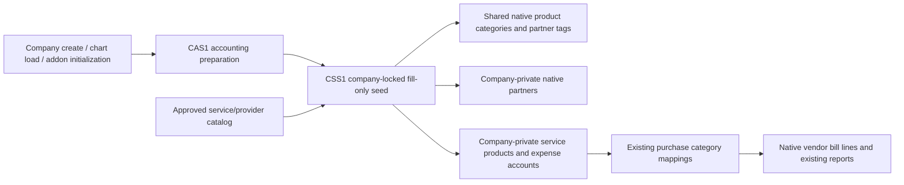

# CSS1 architecture impact (ARCHITECTURAL)

Extends the verified CAS1 accounting initialization boundary. No rediscovery of payroll or cash-report implementation, no changes to their financial authorities.

New addon: `custom_addons/baseer_service_seed`. Stable XMLIDs own seed identities. No new ledger or HR service transactions. Existing company/chart ownership and native access rights remain authorities. Supplier categories are suggestions; invoice line account remains accounting authority. Tax-source numbers are reference data only, and blank VAT is unknown.

Existing generic charts are retained. Safe Saudi account identities reused, otherwise a collision-safe dedicated purpose expense is added. Existing master records and historical transactions are preserved. Native branches remain under the CAS1 parent-chart boundary. Category names cannot be translated natively; preserve native field semantics instead of broad schema changes.

Business labels: new batch rows selecting seeded services suggest Expense. Explicit user type is preserved and no historical row is recomputed. Financial posting remains native and independent of this caption.

Review and evidence: `docs/build-governance/COMMON-SERVICES-SEED.md`, `COMMON-SERVICES-SEED-GATE-REVIEW.md`. Delivery evidence to be linked after tests and independent acceptance.

Accepted CSS1 on 2026-09-08: independent G8 GO in `docs/build-governance/COMMON-SERVICES-SEED-REVIEW.md`; 458 rollback assertions, 21 real concurrency assertions, original-row preservation, native upgrade stable IDs, and live Arabic UI verified. Source/ZIP/deployed 10 files match candidate `docs/releases/2026-09-08-common-services-seed/candidate.json`. Automatic eligibility is independent company + configured chart + SAR; non-SAR initialization remains untouched. Main database unchanged. Current QA contains the catalog in five SAR companies. No new UI component, asset, dependency library or ledger.
