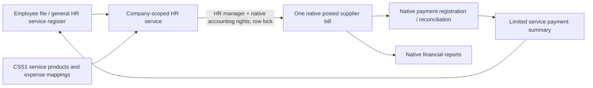

# HRS1 — employee service workflow (ARCHITECTURAL)

Date 2026-09-08. Extends verified CSS1 and existing HR/payroll financial-page contracts. New addon baseer_hr_services; source changes owned by backend and native UI workers, reviewed independently. Contract and gate evidence: docs/build-governance/HR-SERVICES-BUILD.md and HR-SERVICES-GATE-REVIEW.md.

Data ownership: HR service owns descriptive metadata and immutable approved input; account.move and reconciliation own financial totals and payment status. No second ledger. An internal Python capability protects creation/linking of generated bills; direct RPC cannot forge context flags. Service row lock + unique bill link prevent retry multiplication. Approved sources and financial bill content are protected; native reversals retain audit history.

Service user access follows native HR groups and company rules. Approval requires HR manager and native invoice rights, without sudo financial actions. A narrow derived financial summary can compute with elevated read for the specifically linked same-company bill, without exposing invoice contents, attachments or payroll. Existing payroll financial page restrictions are retained; the HR service page is separate.

Native form/list/kanban/search/chatter and date/money widgets are the shared UI catalog. No new JS library or global CSS. Service data is SAR-only matching CSS1; archived employees can receive post-departure services within their company. No automatic payroll deductions, bank transfers, tax-policy generation or prepaid amortization. QA deployment only.

Provider proposals are presentation defaults plus server-side omission defaults, scoped to existing private CSS1 provider XMLIDs. Nine public-service types map to passports/HRSD/Balady; other types require manual selection. Changing type resets the proposal; unrelated edits retain the chosen provider. No seed identities, taxes, prior bills or provider records are rewritten.

Payment filters use an ORM SQL query constrained by HR-service access rules before joining the single linked same-company invoice. This avoids requiring invoice access just to filter the authorized projection, and avoids materializing company history in Python. Native Community currently returns `paid` before bank matching; evidence records this behavior explicitly. Final acceptance and package hashes: docs/releases/2026-09-08-hr-services/HANDOFF.md.
