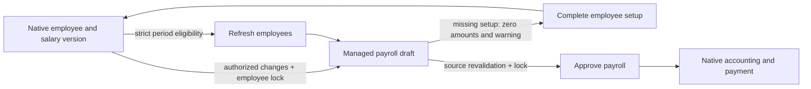

## ABROJ-COST-ACCESS-1 — Project-costing company boundary (2026-09-29; QA)

Company isolation for `abroj_project_costing` is ARCHITECTURAL. A disabled company's app tile was hidden, but direct URLs still reached its own project records because record rules used all activated companies. QA contract: selected company must be enabled and is the sole record scope; no data deletion or transfer. [Access boundary and verification](ABROJ-COSTING-COMPANY-ACCESS.md).

## HC-1 — Saudi official-occasion and heat-calendar architecture (2026-09-14; isolated demo running; original release blocked)

The committee classified this route as **ARCHITECTURAL**. `baseer_sales_heat_calendar` is an isolated candidate add-on at `release_candidates/2026-09-14-abroj-baseer/heat_calendar_demo_source`, branching from immutable source `91e1b8d`, current commit `90e5e0f`. It owns only `baseer.official.occasion` and `baseer.heat.calendar.target`; a Dashboard-only OWL monthly grid reads the existing approved daily POS aggregate (`baseer.pos.daily.report._aggregate_days`) and never copies or changes it. It deliberately does not reuse the meeting-oriented Odoo Calendar component or inherit/write `calendar.event`, `resource.calendar`, HR, payroll, accounting or sales source rows. It uses a goal where configured, otherwise an eight-week same-weekday median with explicit neutral and incomplete/closed/missing states. The weekday heading shows its selected-month average from complete days only; it is not repeated in day cells. Management actions use standard Odoo list/form routes so a manager can create records reliably. The isolated local clone `baseer_heat_calendar_demo_20260914` is running on port 18087 with cron disabled; source protected-model counts were unchanged after cloning and the required source filestore was copied only into the separate demo volume. Arabic browser checks cover approved-source drill-through, idempotent occasion feed, fixed day-details modal and a 390×844 view. The decision is **Conditional GO for owner demo review and NO-GO for the original release** until an independent G8 re-review. [Committee decision and gates](../../build-governance/HEAT-CALENDAR-COMMITTEE-REVIEW.md); [delivery review](../../releases/2026-09-14-heat-calendar-demo/DELIVERY-REVIEW.md).

**HC-2 — Batch target editor candidate (2026-09-14; design gates pending; no live change):** owner approved a single manager-only heat-calendar target editor where one active company/year can select all or selected months and weekdays, edit every exact month×weekday amount independently, and save a bounded atomic batch (maximum 84 cells). It preserves `baseer.heat.calendar.target` exact identity and the approved POS-summary read-only source; it adds no target precedence, no accounting/HR/stock write, no schema migration and no dependency. Desktop is a matrix; narrow mobile is vertical month cards. The batch service derives `env.company`, enforces <=2-decimal finite money, protects company/year save concurrency, and rejects a stale or invalid whole batch. The incomplete cashier order-permission request is explicitly outside this candidate until the order source and ownership scope are clarified. [Batch G0–G4 contract](../../releases/2026-09-14-heat-calendar-targets/BUILD-GOVERNANCE.md).

## HC-0 — Noorix heat-calendar discovery (2026-09-14; no application change)

The Noorix dashboard heat calendar is a per-company/month sales-versus-target calendar with separate occasions and day notes; it is not an HR holiday calendar or a cash-collection report. The documented Baseer route is a proposed isolated read-only Dashboard feature, `baseer_sales_heat_calendar`, sourcing gross approved daily POS sales from `baseer.pos.daily.report._aggregate_days`. It must keep `account.move`, payroll, HR leave/resource calendars, POS approval/source rows and the existing sales dashboard unchanged. Saudi HR holiday apps are not a direct dashboard dependency because they modify work calendars; any marketplace evaluation is sandbox-only. Full discovery and the pre-code gate contract: [HEAT-CALENDAR-DISCOVERY.md](../../build-governance/HEAT-CALENDAR-DISCOVERY.md).

PRC-CATALOG-QUICK1 current QA release (2026-09-13): isolated `baseer_noorix_data_migration_qa_20260912` at `127.0.0.1:18082` runs read-only `candidate-v9` with `baseer_procurement_requests 19.0.10.0.0`. The existing product remains the company-specific catalogue authority. Cashiers may create a purchase-only non-storable product from name + unit price; backend validation, normalized-name advisory locking and unique identity prevent duplicate quick creation. Favorites are user+company state, and a bounded 12-item read model combines favorites before confirmed price-history usage. No POS/core dependency and quick creation produces no stock or accounting movement. Evidence: 8 focused tests; full suite 45 loaded with 0 failed/errors; actual multi-session product/favorite races; Arabic 1280/390/360 and English 1280 browser acceptance including a temporary create→cart→favorite→highlight journey fully removed afterward; restored prewrite dump with 665/665 attachment paths. Final QA counts returned to 556 products, 833 product values, 0 stock moves/quants, 2 account moves, 0 favorite/identity rows. [Map](../../releases/2026-09-13-procurement-catalog-quick1/ARCHITECTURE.md); [evidence](../../releases/2026-09-13-procurement-catalog-quick1/TEST-EVIDENCE.md); [candidate](../../../.local-backups/procurement-product-source1-20260913/candidate-v9/candidate-manifest.json). GO for isolated QA only; original and production remain outside approval.

PRC-PRODUCT-SOURCE1 accepted baseline before QUICK1 (2026-09-13): isolated `baseer_noorix_data_migration_qa_20260912` previously ran frozen `candidate-v3`, with `baseer_procurement_requests 19.0.9.0.0`; it is now superseded in QA by PRC-CATALOG-QUICK1 above. Exact-company Odoo goods are the procurement catalogue source; all 364 Noorix purchase products are non-storable, split 279/85 by company, and create no stock move/quant/picking. Final cashier confirmation alone records actual price/history and updates company cost after UoM conversion. Used option identity and direct product snapshots are immutable; forged RPC context is rejected. Frozen full suite: 45 stats/37 loaded, 0 failed/errors; restore smoke 36/36 readable samples. MAIN remains `19.0.7.0.0` with 80 partners/89 products and is outside approval. [Evidence](../../releases/2026-09-13-procurement-product-source1/TEST-EVIDENCE.md); [candidate manifest](../../../.local-backups/procurement-product-source1-20260913/candidate-v3/candidate-manifest.json). Historical GO was for isolated QA only; production remained NO-GO.

NSM-SUPPLIER-1 local QA migration (2026-09-12): isolated `baseer_noorix_data_migration_qa_20260912` at `127.0.0.1:18082` is a fresh clone of the current `baseer_dev`, with an isolated filestore and QA-only provenance add-on.  Approved QA run `20260912-noorix-supplier-master-qa-1` committed the SHA-pinned supplier payload: 271 global suppliers created, 15 approved canonical links reused, 449 write-once supplier maps and 101 category maps.  The post-run reconciliation has 0 mapped-partner scope violations and idempotent replay is a no-op.  The original remains 80 contacts/21 global suppliers/6 tags; it was never targeted.  [Architecture impact](NOORIX-SUPPLIER-MIGRATION.md); [migration governance](../../operations/2026-09-12-noorix-supplier-migration/BUILD-GOVERNANCE.md).

NSM-PRODUCT-1 QA product-master migration (2026-09-12): owner-approved QA-only scope extends the local Noorix migration contract to 467 company-scoped active products, 47 global technical category leaves and four non-convertible packaging UoMs.  It excludes stock, accounting, pricing, taxes, source mutation and the protected original database.  [Architecture impact](NOORIX-PRODUCT-MIGRATION.md); [product plan](../../operations/2026-09-12-noorix-supplier-migration/PRODUCTS-COMPANY-SCOPED-PLAN.md).

PRC-PRODUCTION1 current MAIN source (2026-09-12): the independently accepted `PRC-REMEDIATION1` source is installed on `baseer_dev` from the immutable read-only candidate `.local-backups/procurement-production-20260912/candidate-v1`. `baseer_procurement_requests 19.0.7.0.0` and `baseer_arabic_ui 19.0.1.0.0` were freshly installed and `baseer_purchase_batch 19.0.1.2.3` explicitly updated. Rehearsal and cutover restore checks passed; 3 companies, 6 users, 2 moves/4 lines and 665 stored attachment references were preserved, HTTP is 200 locally and over Tailscale, and production has no unbalanced posted move or pending module operation. No QA request, custody, invoice or catalogue data was copied. Admin-only procurement roles are active; operational use remains conditional on configuring the real MAIN catalogue, representatives, custody accounts and journals. [Production handoff](../../releases/2026-09-12-procurement-production1/HANDOFF.md); [QA evidence](../../releases/2026-09-12-procurement-remediation1/TEST-EVIDENCE.md); [candidate](../../releases/2026-09-12-procurement-remediation1/candidate.json).

Cash tracing repair current MAIN/GitHub (2026-09-11): `0e2a0853d858ffc8760d009a34cf17dda68dde45`, accepted QA SHA1824578524e00788c8e35f7f23af0567e8252f93ac2bc583017e6502ddc79bfd. 1183 source files/6 changes; cash19.0.1.3.2, POS19.0.1.5.2, register19.0.1.2.1. MAIN18069 upgraded with original data retained; QA18075 retains the 90-day dataset. Independent QA969 unique checks and26 runtime checks reused; MAIN clone39 and actual MAIN39 read-only checks PASS.405 protected tables preserve business/security/schema;400 raw exact,88 precisely allowed metadata-only rows. Coherent pre-upgrade backup and664 attachment refs verified. GitHub `7a79650118965b63bb2509271a25d92a4ad61a62`, CI34534151549 success. [Handoff](../../releases/2026-09-11-cash-tracing-repair/HANDOFF.md). Previous release entries below are historical.

QA 90-day repair current (2026-09-11): QA18075/baseer_ic1_20260910 runs frozen candidate 1824578524e00788c8e35f7f23af0567e8252f93ac2bc583017e6502ddc79bfd, 1183 files / 6 changes. Cash19.0.1.3.2, POS summary19.0.1.5.2, financial register19.0.1.2.1. Same 90-day ledger retained; payroll/advance tracing, native POS refund/collection proof, and false zero-platform warning repaired. Independent GO: 969 unique checks PASS; actual QA runtime26 PASS; Arabic desktop cash Jan–Mar, All/Inout and empty September manually compared. QA316 business tables preserved with six explicitly documented metadata-only records; security34 tables exact; original316 table hashes exact. MAIN and GitHub were unchanged at QA acceptance; promotion is recorded above. [Before/after, evidence and login](../../audits/2026-09-10-90day-simulation/repair/COMPARISON.md).

QA 90-day simulation baseline (2026-09-10, superseded by repair above): synthetic Jan–Mar2026 data: 90days,4999postedmoves,12848AML,3payrollruns/71slips,24staff,90approvedpurchasebatches. Independent19647checks:19467PASS/180FAIL, roles70PASS. Historical NO-GO for cash category tracing and collection-percentage coverage; native ledgers/All/Inout/dashboard/classic totals PASS. Original206tablefingerprints preserved; no product/source/GitHub change at that stage. PreviousQA retained. [Baseline result](../../audits/2026-09-10-90day-simulation/FINAL.md). The MAIN release below was current at baseline acceptance.

FL3/FL3B previous MAIN release (2026-09-10): `f38e4c4934c377dac69cd563c2ed3ca30b61bf9e`, financial_register19.0.1.2.0. All-mode Sales includes native POS/summary signed primary/reversal/reclassification entries without collections duplication; supplier indicators preserved. Incoming/outgoing replaces Cash-mode labels: actual cash plus posted Applications sales, with exact subsequent settlement/refund adjustments; outgoing actual, native cash report unchanged. 307 financial assertions,36 QA database-read-only checks,13 browser journeys and33 MAIN database-read-only checks PASS.373 business tables/security/presets/other versions exact;664 attachment refs in both backups.1183 source files/10 changes/1173 preserved. GitHub `031264047111ca677f404608543a2d22d0cfc10b`, CI34519359419success. [Handoff](../../releases/2026-09-10-financial-register-sales/HANDOFF.md). Earlier entries historical.

IC2 R2 current MAIN release (2026-09-10):`3d96581c2eef324df3b5ed69f7ba526bb37035fc`, correction19.0.1.1.0/summary19.0.1.5.1. Unified eligible invoice/payment and per-purchase-row cancellation; atomic summary reverse/edit/reapprove or cancel. Shared owner/accountant toggle and unconditional cashier denial; native source/entry bypass guards. 60core+38summary checks,2actualraces,AR/EN/480pxUI and actual-accounting verification PASS. 372oldtable projections/security/presets/versions exact;661attachmentrefs pre/postbackups. 1181files/15changed/1166preserved. First upgrade stopped on45translatednames+2partnermetadata drift; R2 removes dynamic PO records and restores exact old values under independent GO, no second upgrade. GitHubbe89096027c823dbe5414bbf95ce97e9e354a5b6,CI34511962677success. [Handoff](../../releases/2026-09-10-financial-source-lifecycle-r2/HANDOFF.md). Earlier entries historical.

IC1 current MAIN release (2026-09-10):24bc64d2a778590e8e8e6577eb3866d18727bc24, new financial_correction19.0.1.0.0. Source-aware native correction and immutable private audit; owner-controlled per-accountant setting, cashier always denied by shared correction. Existing native draft/edit permissions unchanged.63accounting+20routes+26permissions, two real concurrency races and10AR/EN/480px UI journeys PASS. MAIN readonly smoke/settings PASS;368original business tables/memberships/presets/versions preserved,661attachmentrefs pre/postbackups.1177files/10new/1167preserved. Parser-only install flag issue recovered under independent GO; no frozen source change. GitHub7a2e0057640f63a43be6193e7e51b8fe8c027fdd, CI34504859260success. [Handoff](../../releases/2026-09-10-financial-correction/HANDOFF.md). Earlier entries historical.

FL2 current MAIN release (2026-09-10): e84fcfb96800fe8a655a3e40fb6db3d215085238, financial_register19.0.1.1.0. Native All/Cash mode reuses cash report allocations and same card area; one SARcompany/month.63accounting+13frontend and Arabic480px evidence; MAIN read-only3company/AR-EN smoke PASS.368protectedtables/memberships/presets exact;661attachmentrefs pre/postbackups.1167files/9changes/1158preserved. GitHub3f3808576d2e62b7c7d66a6880b8fc326db51ef9, CI34494233699success. [Handoff](../../releases/2026-09-10-financial-register-cash/HANDOFF.md). Earlier entries historical.

FL2 QA-only preview (2026-09-10): same native financial register with All / Cash mode, three reused cards matching the existing cash report. Trial at18074, company2, February2026:8000/-5000/3000. Working addon19.0.1.1.0 only; MAIN/GitHub remain FL1 below. [Preview](../../build-governance/fl2-ui/PREVIEW.md).

FL1 current MAIN release (2026-09-10): `0a6246b7215caddf9e7b14ffe799f84ee03f8cd3`, new baseer_financial_register19.0.1.0.0. Invoicing financial operations register: native posted rows/source links/search and customer/vendor invoice cards, currency separation, native mobile kanban.62 clean-clone accounting checks with full rollback +8 AR/EN/480px UI checks PASS.368 business tables/current memberships/presets preserved.1166files/10new/1156preserved. GitHub `de47b3f1fdc36a628580290c2ac6b9a55796f82d`;CI34489905518success. MAIN login required for browser session; QA UI verified. [Handoff](../../releases/2026-09-10-financial-register/HANDOFF.md). Earlier entries historical.

AR2 current MAIN release (2026-09-10): `6104fc8e6f1d24b3e842f2b43bd9f410840d7759`, roles19.0.1.0.1. Fixes accountant/cashier saves with native In Odoo notifications; preserves preference across role changes and previews role grants immediately. 55 focused rollback checks +5 Arabic UI checks PASS.368 business tables and current memberships/presets unchanged. 1156files/3changes/1153preserved; GitHub `4124200cad7d53fab8eab228752d25e3e79f2da9`;CI34484312535success. [Handoff](../../releases/2026-09-10-access-roles-user-form/HANDOFF.md). Earlier entries historical.

AR1 current MAIN release (2026-09-10): `98f9d4dced9f7a844d3d44e63f89d8d0d8218664`, new baseer_access_roles19.0.1.0.0, payroll19.0.1.5.1. Owner/accountant/cashier presets; cashier own purchase drafts, accountant approval; both approve employee advances through a private screen without salary access. 300 integration checks +12 lifecycle checks +9 Arabic UI evidence groups PASS;367 original business tables and existing user memberships unchanged, no presets assigned automatically. 1156 files/23 changes/1133 preserved. GitHub `c021ceac3a7ce2c980687e1fd46f073a2ab21426`;CI34482110786success. [Handoff](../../releases/2026-09-10-access-roles/HANDOFF.md). Earlier entries historical.

SD7 current MAIN release (2026-09-10): `4cd5ee3e9bebcd1d85bda2723bf2781643f7f3e7`, dashboard19.0.1.1.5. Borderless chart/performance sections; faint labelled empty KPI examples and sales/customer legend. PASS5 preview-isolation checks, QA actual/empty/480px and MAIN verified;367 business tables unchanged.1135files/4changes. GitHub `429b8a9856fbb6e790d49e2a0c7a827b20d5bdfe`. [Handoff](../../releases/2026-09-10-sales-dashboard-preview/HANDOFF.md). Earlier entries historical.

SD6 previous MAIN release (2026-09-10): `77afc48e42afe8fedd1e0355842bb1f887f3ac8f`, dashboard19.0.1.1.4. White background matches native dashboards; KPI colors retained. QA desktop/480px and MAIN computed white verified;367 business tables unchanged.1135files/2changes. GitHub `8dfe046b9d20e6d57877f1b3076bee5f4ec948ba`. [Handoff](../../releases/2026-09-10-sales-dashboard-background/HANDOFF.md). Earlier entries historical.

SD5 previous MAIN release (2026-09-10): `de89a85675cb7d36a503618a4fa5fb9faf6ad696`, dashboard19.0.1.1.3. Native graph/pivot icons for shift/payment tabs; accessible names retained. QA desktop/480px and MAIN verified;367 protected tables unchanged.1135 files,2 changes. GitHub `4f40d7249b477c981d1cc61f637b9c639d0f977f`. [Handoff](../../releases/2026-09-10-sales-dashboard-icons/HANDOFF.md). Earlier entries historical.

PP1 previous MAIN release (2026-09-10): `a8d533d67ee4ca3e4a7ce06fc44bc5e459fc192c`, new `baseer_partner_priority19.0.1.0.0`. Company-specific supplier stars; favorites then posted vendor-bill frequency in the active company over90days. All1126BP1files preserved plus9reviewed addon files. QA28+6checks reused, fresh MAINclone install and367business tables unchanged on rehearsal and actual deploy; coherent pre/post backups, pinned read-only runtime and actual MAIN stars/picker verified. Public GitHub `b3e586558973759422e035741d6a91f24f6f687e` matches all1135 source files; CI34473528226success. [Handoff](../../releases/2026-09-10-partner-priority-main/HANDOFF.md). Earlier entries are historical.

BP1 previous MAIN release (2026-09-09): `80ab864153b9e337090d5a1286150e7a64ad6319`, new `baseer_browser_print19.0.1.0.0`. Native qweb-pdf handler preserves report bytes/context, offers Print and Download PDF, and uses bundled PDF.js fallback when native preview fails. All1118 SD4 source files unchanged plus8 addon files;45focused checks,4native PDF renders, actual compatible QA viewer;367business tables exactly preserved. Public GitHub `216c0a04091ed3bc367317f8967ab5a3ac22c8ce`, CI34404186973success. [Handoff](../../releases/2026-09-09-browser-print/HANDOFF.md). Earlier entries are historical.

SD4 previous MAIN release (2026-09-09): 1108f2a8fc0edee2f61d728135feee02590a8f46, baseer_sales_dashboard19.0.1.1.2. Applications share of total approved sales in payment Details; server Decimal and incomplete/zero guards.9focused tests and actual QA/MAIN verified;367business tables unchanged. [Handoff](../../releases/2026-09-09-sales-dashboard-application-share/HANDOFF.md). Earlier entries are historical.

SD3 current MAIN release (2026-09-09): 60fe49fe3907eaa0985f70fa3ec428ab512a559d, baseer_sales_dashboard 19.0.1.1.1. Adjacent shift/payment cards with Chart and Details tabs; category totals footer; permanent explanations removed. Backend14/UI11 and actual Arabic desktop QA/MAIN. All367business tables unchanged;1118source files/7dashboard-only changes. [Handoff](../../releases/2026-09-09-sales-dashboard-tabs/HANDOFF.md). Earlier entries are historical.

SD2 current MAIN release (2026-09-09): `973395f87b62c8d09f1e6fdc301a7d89e2988d56`, baseer_sales_dashboard19.0.1.1.0. Native top date filter, compact cards/combo chart, shift and payment performance, clear empty/coverage states. Backend75/UI34 plus actual browser;367business tables unchanged. Frozen1118files/9addonchanges. [Handoff](../../releases/2026-09-09-sales-dashboard-compact/HANDOFF.md). Earlier entries below historical.

SD1 current MAIN release (2026-09-09): `2d2ff102d11a53fc2fca1b8c1707fc81c77537ab`, new `baseer_sales_dashboard 19.0.1.0.0`. Company-scoped read-only Sales summaries in native Dashboards, five KPIs with prior-period comparisons and daily/monthly charts. Existing 1106 source files unchanged; 12 new addon files. Backend84/UI17 plus actual AR/EN/mobile browser acceptance. All367 protected business tables unchanged on install. [Contract](../../build-governance/SALES-DASHBOARD.md); [handoff](../../releases/2026-09-09-sales-dashboard/HANDOFF.md); [browser](../../releases/2026-09-09-sales-dashboard/browser-evidence.md). Earlier entries below are historical.

POS payment seed previous MAIN release (2026-09-09):8aff2c48f66df5925cf9dd98e9e7f11b55741f50, baseer_pos_summary19.0.1.5.0. Bilingual Cash/Bank/HungerStation/Keeta/Jahez company defaults with distinct platform clearing. All3currentcompanies verified. Summary POS suppresses native implicit cashier staff creation; normal POS and canonical manager fields retained. PASS37;126protected tables and original masters preserved except documented company-contact write_date only. [Contract](../../build-governance/POS-PAYMENT-SEED.md); [handoff](../../releases/2026-09-09-pos-payment-seed/HANDOFF.md); [GO](../../releases/2026-09-09-pos-payment-seed/FINAL-REVIEW.md).

WS5 previous MAIN release (2026-09-09):96dd7960f30a0863772139423e037e127faf3c52, baseer_work_schedule19.0.1.1.2. Compact unified HH:MM picker; modal retained; wrapped daytags.250 protected tables unchanged. [Impact](WS5-TIME-PICKER.md); [handoff](../../releases/2026-09-09-unified-time-picker/HANDOFF.md).

POS empty-shift current MAIN release (2026-09-09): d7c1d675f2176c1e125ca50c5522f917ad51d153, baseer_pos_summary19.0.1.4.1. Fresh entry requires explicit shift selection; requested two UI hints removed.250 protected tables unchanged. [Impact](POS-EMPTY-SHIFT.md); [handoff](../../releases/2026-09-09-pos-empty-shift/HANDOFF.md). Earlier releases below historical.

WS4/WS4A current MAIN release (2026-09-09): `2b555de2dc26349098dd1ab741d26e0eb260c334`, module19.0.1.1.1, frozen `.local-backups/current-schedules-20260909/candidate`. Adds dated template edit with direct employee fanout/history preservation; native schedule list defaults to Current schedules.250 protectedbusiness tables unchanged on upgrade. Architecture delta: [WS4-SCHEDULE-EDIT.md](WS4-SCHEDULE-EDIT.md). Current handoff: `docs/releases/2026-09-09-current-schedules/HANDOFF.md`. Earlier release entries below historical.

HR2A data-only salary/job import (2026-09-09): MAIN40 reconciled salary packages,38 job assignments/28 company job definitions;9 salary decisions pending (7 changed schedules,2 merged historical conflicts).8 salary-basis flexible calendars without clock periods;existingusercalendars preserved. NoWS3sourcechange. Evidence: `docs/operations/2026-09-09-hr-import/HR2-HANDOFF.md`.

HR1 data-only import (2026-09-09): MAIN49 employee files from51 legacy identities after2 owner-approved historical merges;34active15archived. Salaries/allowances/contracts/shifts explicitly deferred by owner. Three nativezero-hour pending calendars satisfy requiredcontractschedule; existingcalendars/financialdata unchanged. NoWS3sourcechange. Evidence: `docs/operations/2026-09-09-hr-import/HANDOFF.md`.

WS3 current MAIN release: `40dee029c01cf51fa01d233185b3b63805754ce3` (2026-09-09), frozen `.local-backups/duration-display-20260909/candidate`, HH:MM schedule averages, module19.0.1.0.2. Current evidence: `docs/releases/2026-09-09-duration-display/HANDOFF.md`. Earlier releases below are historical.

WS2 current MAIN release: `c89de592ace16758ad67c4b69efd3a309cf6c950` (2026-09-09), frozen `.local-backups/work-schedule-time-picker-20260909/candidate`, 24-hour work schedule picker, module19.0.1.0.1. Evidence: `docs/releases/2026-09-09-work-schedule-time-picker/HANDOFF.md`. Earlier release descriptions below are historical.

WS1 current MAIN release (2026-09-09): `fd5dd15be755051edb0d695095aa02abc2fc18f0`, frozen source `.local-backups/simple-work-schedules-20260909/candidate`; adds native simple schedule templates and employee setup. Earlier PT1/BN1/MP3 descriptions below are historical. Current evidence: `docs/releases/2026-09-09-simple-work-schedules/HANDOFF.md`.

PT1 current MAIN release (2026-09-09): commit `9c43256987654c4d988cd29c05f5f967b457235a`, frozen source `.local-backups/payroll-company-tab-20260909/candidate`. One inherited company payroll tab disabled; Settings > Payroll remains the company-backed configuration authority. All 782 tables compared, only ir_ui_view changed. Details: `docs/releases/2026-09-09-payroll-company-tab/HANDOFF.md`. Prior BN1 entries below remain historical.

# Baseer Odoo architecture registry

## Current identity/deployment delta — BN1 (2026-09-09)

Reference BASEER-ODOO-BN1, ARCHITECTURAL; lastVerifiedCommit `7c52ea751f6568eaec048e51f1011d5a5a109e15`. `baseer_service_seed 19.0.1.2.0` retains partner bilingual fields as authority and exposes nonstored related company projections. Batched company adapters avoid transient unique-name collisions; native complete_name/name searches handle both languages. Migration fills empty components only where the exact native name is preserved and omits redundant native name writes. No accounting authority, account mappings, privileges or vendor/core changes. [G0–G8 contract](../../build-governance/BILINGUAL-NAMES.md), [candidate and handoff](../../releases/2026-09-09-bilingual-names/HANDOFF.md).

MAIN now uses the BN1 frozen read-only source in `.local-backups/bilingual-names-20260909/candidate`; MP3 below is historical. Daily backup archive/mount guards updated to BN1 and exercised. 35 rollback checks, 167 protected-table preservation on restored QA database upgrade, 168 on MAIN; bilingual desktop/mobile form evidence recorded. Operational and financial transactions stay native. Owner: build lead; alternate/reviewer: independent delivery reviewer.

## Current production deployment — MP3 (2026-09-09)

MAIN `baseer_dev` now runs the accepted FA2+PB2 composite commit `93d66e67ff507ed161349fe177fba23e29703ce5` from immutable read-only addon mounts. `compose.yaml` persists this source boundary; QA continues using its separate development mounts and database. This is a deployment delta, with no new application architecture or financial authority beyond the FA2/PB2 maps below. [Independent MAIN acceptance](../../releases/2026-09-09-main-promotion/ACCEPTANCE.md), [runtime proof](../../releases/2026-09-09-main-promotion/runtime-final.json), and [transfer handoff](../../releases/2026-09-09-main-promotion/HANDOFF.md) supersede earlier QA-only deployment status for this composite release.

The fresh original database/filestore backup was restored before live upgrade. Both rehearsal and live target passed71 read-only checks. Preservation separately classified four previously empty, unused outbound payment-account mappings populated by CAS-002, native root/admin payroll-role additions, approved seed rows and exact master audit metadata. No operational transactions were imported or generated on MAIN. The existing employee received the new inclusion field's default on first module installation; no previously stored False flag was overwritten. MAIN and QA HTTP200 and immutable source identity are verified; disposable clones were removed, coherent pre/post backups retained.

## FA2 — targeted financial and release-boundary delta (2026-09-09)

Reference **BASEER-ODOO-FA2**, version1, impact **ARCHITECTURAL**; owner: build/integration lead, alternate: independent delivery/security reviewer. `lastVerifiedCommit`: `4f5d0ff133f4b32fd8ca01b957490b20dba38326` in the isolated release repository (the user workspace has no HEAD); identity is the immutable [FA2 candidate](../../releases/2026-09-09-fa2-remediation/candidate.json), its1089 file hashes and archive SHA256 `c8843337ffabea086892c1defe995032ea7f7c17be7592b60c0abf12df71d3e5`. This is a targeted amendment to the BP/POS/SP1 map below, not a redraw or a MAIN deployment decision. Approved G0–G3 and ownership: [FA2 mandate](../../build-governance/FA2-REMEDIATION.md).

Native `account.move`, payment and partial reconciliation remain the financial authority. `baseer_payroll19.0.1.4.0` adds reviewed additive wage/deduction adjustments and linked advance/recovery reversals, preserving original payroll evidence. Server-created source snapshots, stale-source checks, company/manager boundaries and immutable correction links guard the review step; receipt/final-state projections follow actual native allocations and reversals. Child salary reads now follow the parent employee/department/company scope. See [payroll design](../../releases/2026-09-09-fa2-remediation/PAYROLL-DESIGN.md), [results](../../releases/2026-09-09-fa2-remediation/PAYROLL-RESULTS.md) and [independent boundary review](../../releases/2026-09-09-fa2-remediation/security-cross-review.md).

`baseer_pos_summary19.0.1.4.0` owns immutable journal/receipt links and a manager correction chain: original → exact native reversals → cancelled retained source/order → same-date/shift replacement draft → separate approval. Full correction rejects locked periods, earlier reversals and external matches; receipt-only reversal changes collections without cancelling the sale. Only the private validated state transition bypasses native POS's done→cancel restriction; it does not rewrite amounts or payments. Cancelled sources leave live totals/denominators, and confirmed half-closure coverage is shared by daily report, archive and message preparation. Upgrade assigns a separate service instead of converting a stock product, and backfills owned entry links. [Sales contract and evidence](../../releases/2026-09-09-fa2-remediation/sales-remediation-review.md) records357 checks and three real races.

`baseer_service_seed19.0.1.1.1` limits elevated access to seed metadata after normal mapping access; it does not elevate a financial transaction. SP1 shared native providers remain authoritative. The two tracked OdooMates contribution-report namespace edits are the only vendor correction scope; [security handoff](../../releases/2026-09-09-fa2-remediation/security-handoff.md) records their evidence. Existing report, chart and ordinary native POS ownership are unchanged.

Release execution uses pinned `odoo@sha256:f99ffac95cb39a0924622ea4118481c95651d9c84187e5b30a21c2cc4419c7dd`, immutable addon snapshots and explicit ERP Heritage/OdooMates addon roots. The archived running engine and critical hashes in [engine-proof.json](../../releases/2026-09-09-fa2-remediation/engine-proof.json) are authoritative; the differently versioned local `odoo/` checkout is not this engine. Per-owner clones and source overlays isolate concurrent edits; integration uses the frozen combined candidate. The MAIN-clone rehearsal [preserved original financial rows](../../releases/2026-09-09-fa2-remediation/main-projection-result.json), with [metadata differences](../../releases/2026-09-09-fa2-remediation/main-metadata-diff.json) classified separately. Transfer requires a fresh coherent MAIN PostgreSQL/filestore/code/config backup and full-set rollback; no partial table restore, live QA copy or destructive module uninstall. [TRANSFER-RUNBOOK.md](../../releases/2026-09-09-fa2-remediation/TRANSFER-RUNBOOK.md) is preparation only. Final independent acceptance and current evidence remain with the release owner.

SP1 accepted 2026-09-09 supersedes CSS1 provider ownership:20shared native suppliers,100unused seed copies physically deleted by explicit user authorization after property transfer/preflight and backup. Native financial documents remain company-owned. Supplier card gains optional Arabic/English names; existing navigation addon adds native current-user language menu. Details and evidence: SHARED-PARTNERS.md; candidate docs/releases/2026-09-09-shared-partners/candidate.json. QA only, independent delivery GO recorded alongside candidate.76 assertions plus UI verification;50 source/ZIP/deployed file hashes match. Main and original financial rows preserved; authorized user language-test write_date explicitly classified.

CSS1 accepted 2026-09-08: baseer_service_seed 19.0.1.0.0 extends CAS1 with a native fill-only catalog: 20 company-private providers, 26 service expense products/maps, 36 shared product categories and native provider tags. SAR independent companies with charts are automatically initialized; non-SAR/branches are skipped without changing native setup. Safe Saudi purpose accounts reused, only missing dedicated purposes added. New batch service selections suggest Expense; explicit submitted type remains authoritative. No transactions or historical masters rewritten. 458 rollback integration checks, 21 actual concurrency checks, native module-upgrade identity preservation and Arabic supplier/category/entry UI evidence passed. Independent G8 GO in docs/build-governance/COMMON-SERVICES-SEED-REVIEW.md; QA only and main database verified unchanged. Candidate docs/releases/2026-09-08-common-services-seed/candidate.json, 10-file ZIP SHA256 6ffc993ac36fb070c59febcd7261e5f26e49eea478cdb5c53e7595f49227866b. Impact map COMMON-SERVICES-SEED.md in this registry.

CAS1 accepted 2026-09-08: separate baseer_company_setup19.0.1.0.0 completes native independent/root-company accounting with fill-only seven payroll/EOS references and missing starter journals. Native l10n_sa remains chart authority; private company precommit and post-_load hooks are atomic/idempotent. Empty-SA/SAR subtree guard preserves manual/inactive/shared/tax setups; foreign/unknown/currency-conflict setup deferred. Native branches excluded from automatic payroll readiness; no membership expansion. Exact Saudi expense XMLIDs reused, dedicated reconcilable payable/advance accounts and native collision allocator. Configured/used payment journals preserved; only empty manual outbound account on wholly unused compatible liquidity journal filled. No new schema/ledger or payroll/core/vendor change.137 rollback checks,31 real race assertions with40001 retry, native settings evidence and explicit additive-preservation deltas accepted. QA only/main unchanged. Contract docs/build-governance/COMPANY-ACCOUNTING-SEED.md; independent G8 GO COMPANY-ACCOUNTING-SEED-REVIEW.md CASR-005; seven-file candidate docs/releases/2026-09-08-company-accounting-seed/candidate.json ZIP14716ad9b693118569b5493c0469ed13604a1212e7f9dcddd8d8f21f808efc99. Immutable payroll dependency BP-S6 retained.

BP-S6 accepted 2026-09-08: baseer_payroll19.0.1.3.0 connects native employee departure to existing baseer.hr.eos review, native bill approval/payment and one-page A4 signature statement/receipt. Native accounting remains payment authority; final receipt requires matched paid outbound allocations covering the award with zero residual and no posted reversal. Grouped payments count only allocations to this award; mixed write-offs require review. Internal approval identity snapshot and partial generated-request uniqueness prevent forged history and duplicate opening requests; old approved records retain documented identity fallback. Existing EOS formula and core/vendor sources unchanged.43 rollback workflow checks,46 EOS regressions,21 real race assertions, seven one-page native PDFs and Arabic desktop/mobile evidence accepted. QA only; main and original business rows preserved. Independent G8 GO: docs/build-governance/BASEER-EOS-WORKFLOW-REVIEW.md. Contract BASEER-EOS-WORKFLOW.md; frozen30-file candidate docs/releases/2026-09-08-baseer-eos-workflow/candidate.json, ZIP SHA256 e5c0f62098ce846598c42621b0f514875643168d7e3b95c8b840de4f84ce21bd.

BP-S5 accepted 2026-09-08: baseer_payroll19.0.1.2.1 seeds two optional native duration calendars per company (84h/7days/12daily;60h/6days/10daily, Friday omitted). Authorized native company create then private targeted seed; trusted XML initialization for existing companies. Company row lock and deterministic noupdate XMLIDs preserve administrator edits/archive across upgrades. No company/employee default assignment, new schema/dependency, core/vendor edit, or payroll math change. Native calendar read behavior and company selection domains retained; native hr.version does not automatically enforce every raw ORM company assignment, no new isolation claim.43 rollback checks, two actual upgrades, Arabic desktop/mobile selector and preserved existing financial/employee/version/company/calendar rows verified. QA only/main unchanged. Contract docs/build-governance/BASEER-WORK-SCHEDULES.md; independent G8 GO BASEER-WORK-SCHEDULES-REVIEW.md; frozen candidate docs/releases/2026-09-08-baseer-work-schedules/candidate.json.

BP-S4 accepted 2026-09-08: baseer_payroll19.0.1.2.0 unifies employee salary setup in the native Payroll tab. Selected native hr.version/resource.calendar is the salary and scheduled-hours authority; one Decimal helper computes inclusive basic/overtime and unsaved previews. Existing salary modes and financial records are preserved. Independent baseer.hr.eos estimates require reviewed source/departure evidence before issuing one posted native vendor bill; native payments/reconciliation/reversal remain financial authority. Durable duplicate protection survives reversal. Inherited EOS policy limitations are explicit; this is not a new legal compliance certification. No core/vendor/dependency edits. Contract docs/build-governance/BASEER-PAYROLL-PROFILE.md; independent G8 GO docs/build-governance/BASEER-PAYROLL-PROFILE-REVIEW.md; frozen candidate docs/releases/2026-09-08-baseer-payroll-profile/candidate.json. QA only:45 salary checks including six months,46 EOS checks,17 concurrency assertions/two real races, Arabic desktop/mobile verified. Original101moves/238lines/37payments preserved; main unchanged. EOS expense account and purchase journal must be configured before first issue.

BP-S3 controlled19.0.1.1.1: payroll-local native monthinput projects existingDate(firstday), noUTC/businesscalculation; originalbackend normalization unchanged. Settlementcreate suggests run.date_end onlywhenexplicitdate/contextdateabsent. Employee loan count/balance/history action moved to existing FinancialRecord tab; no duplicateledger/query/permissionchange.18targetedrollbackchecks anddesktop/mobileUI verified; all101moves/238lines/37payments hashes andmainexact. Contract docs/build-governance/BASEER-PAYROLL-MONTH.md; candidate docs/releases/2026-09-08-baseer-payroll-month/candidate.json. No newdependency/core/vendor/sharedwidgetedit.

BP-S2 settlement boundary 2026-09-08: baseer_payroll19.0.1.1.0 adds one locked transient batch/amount-only child orchestration over unchanged native per-employee account.payment.register. Native payable residual/reconciliation remains financial authority; derived run/slip stages and employee Financial Record do not duplicate ledger data. Aggregate receipt allocates partial reconciliations per slip/payment. Company/payroll/accounting rights, transactional rollback, replay and stale-snapshot boundaries validated. No new dependency/core/vendor edit. Contract docs/build-governance/BASEER-PAYROLL-FLOW.md; QA candidate docs/releases/2026-09-08-baseer-payroll-flow/candidate.json; independent review BASEER-PAYROLL-FLOW-REVIEW.md.92 focused checks/six months and two real concurrent requests passed. Direct bank/cash configuration only exact QA company10; prior five outstanding payments cleared natively with immutable original accounting amounts. Main exact. Prior capacity and correction limitations retained.

BP-S1 configuration boundary 2026-09-08: baseer_payroll19.0.1.0.1 native Payroll Settings projects six existing res.company fields through transient related fields; company remains authority. Pure configuration validation now executes before managed run INSERT, with translated company-aware recovery. No ledger/math/dependency changes. Scope: docs/build-governance/BASEER-PAYROLL-SETTINGS.md; reviewer BASEER-PAYROLL-SETTINGS-REVIEW.md; candidate docs/releases/2026-09-08-baseer-payroll-settings/candidate.json. QA-only,22rollbackchecks/native settings Save/create/delete; preservedfinancialhashes.

PAYROLL-P1 ARCHITECTURAL evaluation2026-09-08: official OpenHRMS commit c70e3f54b50442f46faed15f2643aed278b3fb37 fouraddons installed/evaluated, financial NO-GO. Existing QA restored unchanged; evaluation DB baseer_payroll_eval_20260908 retained with connections disabled and separate copiedfilestore. No payroll extension or core/vendor edits. Contract docs/build-governance/PAYROLL.md; independent review PAYROLL-REVIEW.md; manifest docs/releases/2026-09-08-payroll-evaluation/manifest.json. Full payroll remains pending, not released.

Reference BASEER-ODOO-PB1, version1, 2026-09-07. Owner: build lead; alternate: independent gate reviewer. lastVerifiedCommit: unavailable (workspace uncommitted); source manifests and runtime image digests identify existing report release R1 plus cash print1.3.1.

Impact ARCHITECTURAL: purchase batch creates new schema and a controlled financial document workflow. Contract and ADR: ../../build-governance/PURCHASE-BATCH.md. Independent decision: ../../build-governance/PURCHASE-BATCH-REVIEW.md.

Native web list/form → baseer.purchase.batch/line → account.move vendor bill → account.payment.register → native payment/reconciliation → existing cash category handler via invoice product category. Native ledger remains financial authority. Company-specific category mapping references service products and their native expense accounts; it does not own a separate chart of accounts.

New addon ownership: custom_addons/baseer_purchase_batch. Existing custom_addons/baseer_cash_categories, baseer_report_layout, vendor addons and Odoo core are outside the edit scope. Native account dependency only as needed; native UI/report resources reused. QA only; main remains on cash1.3.1.

Risks/tests: whole-batch transaction, repeat/concurrent requests, company rules, immutable approved data and protected server fields, source category lineage, gross-to-tax precision, actual paid status and locked-date behavior. No main installation or migration authorized by this QA build. Backups and native transaction rollback provide recovery; no destructive uninstall of financial records.

QA1 candidate frozen on2026-09-07: [manifest](../../releases/2026-09-07-purchase-batch-qa1/manifest.json) identifies13sourcefiles, verifiedarchive andruntime digest. [Handoff](../../releases/2026-09-07-purchase-batch-qa1/HANDOFF.md) links80financialchecks, trueconcurrency, exports andUI evidence. Native date/date-time widget is extended only for Western numeral display; no accountingJS/globalpatch. Dependencies account19.0.1.4 and baseer_report_layout19.0.1.1.0. New company/date/state indexes bound the list paths; existing229reportfiles unchanged. Main moduleinstalled0/moves0/lines0 confirmedreadonly. Final independent G8 decision remains in the review reference above.

QA2 delta19.0.1.1.0: [manifest](../../releases/2026-09-07-purchase-batch-qa2/manifest.json),14sourcefiles. Added nonstored VAT intent bridge to existingtax_id and companydefaultpurchase tax, no newstoredfinancialauthority; legacyclassification isread-only. Nativeboolean_toggle usesautosaveFalse forserveronchange preview. ScopedSCSS supportswidersheet/columnhints/mobilecards andnativeunprefixedCSS tokens. Samebill/payment/companylocks anddataflow;28targetedVAT+80nativefinancialchecks, observedbrowser850/601 describedinhandoff. No report/core/mainchanges.

QA3 presentation delta: [manifest](../../releases/2026-09-07-purchase-batch-qa3/manifest.json),20files acrossbatch19.0.1.1.1 andnewindependentbaseer_category_display19.0.1.0.0. Product-onlycentraloverride defaults display_name toleaf, retainsnativeexplicitTrue/fullcomplete_name/search/tree. Nativecategorychoiceparentcolumn andmappingreadonlyparentcolumn disambiguate; batchdelegateslabel andexplicitlykeepsfullpathdefaultbilldescription. No newstoredfinancialstate.25tests+native/table/selector/PDFimages andidenticalfinancialrowfingerprints. QAonly; oldreports229filesuntouched.

QA4 delta19.0.1.2.0: native company-dependent supplier category and explicit stored is_credit; active-company guards before scoped mutations, immutable company and private supplier without rank restriction. Versioned migration9rows preserves method/audit dates and financial fingerprints. Native ledger authority unchanged.62focused+80native checks;23sourcefiles, archive7b736d459b9dc919de31c4a0782a52645e668068255d2c14b0ca93400d186002. See ../../releases/2026-09-07-purchase-batch-qa4/HANDOFF.md. Current UI850px only; no main change.

QA4 LOCAL amount edit fix: scoped monetary parent/input alignment and native currency ghost layer, SCSS only. Zero/1234567.89 native browser checked, no API/schema/accounting changes. Patch identity docs/releases/2026-09-07-purchase-batch-qa4-amount-fix/manifest.json.

QA5 CONTROLLED delta19.0.1.2.1: parent batch saves reject empty final line_ids within existing savepoint; native FormErrorDialog handles discard/stay. No global line unlink constraint/newJS/schema/dependency. Native table no_symbol option and centered wrappers; final centers0/0.11targetedrollbackchecks plus native live leave/manualsave/readonlybill visibility. Source23files archivefbd5421657b83cee740ad0a53456ad19a424310518f91d8789face96198845fe. QA-only, same financial authority and50rowcapacity. Handoff ../../releases/2026-09-07-purchase-batch-qa5/HANDOFF.md.

POS-S1 ARCHITECTURAL delta19.0.1.0.0: nativePOS summary/allocation/paymentcategory models; one dedicatedcompanyconfig andoneclosednativeordersession perday/shift summary, no customledger. Sourceprivate-token guards, companyMVCCmutex/nativeRPCretry, Decimalboundary/nativeVAT authoritative, sourcesimmutable. Reportsinheritcashhandler atprovenreceivableedge, appsasset_current vsbankasset_cash, manualWAcomposeonly. Reuseddatewidgetpromotedtolayout1.1.1; purchase1.2.2compatimportonly. Contract ../../build-governance/POS-SUMMARY.md; candidate ../../releases/2026-09-07-pos-summary-qa1/HANDOFF.md. Nativecore/vendorfinancialsources unchanged; QAonly, no mainmoduleinstall. Capacity25methods, cappedgross/count; indexedcompany/date/state/category. Finalindependentreviewreference ../../build-governance/POS-SUMMARY-REVIEW.md.

POS-S2 delta19.0.1.1.0: native transient day entry presents two independent shift cards and one atomic save to original summary records; explicit atomic approval delegates to existing native POS posting. Closure records and daily aggregation distinguish complete operating dates, incomplete/missing dates, explicit zero sales and closure days. Daily denominators count each complete date once. Native amount fields own input; backend Decimal owns totals. Company/entry locks, immutable sources, private cleanup tokens and bounded 366-day/25-method inputs retain the original authority. No new dependencies or shared-source changes. Contract: ../../build-governance/POS-SUMMARY-S2.md. Candidate and source manifest: ../../releases/2026-09-07-pos-summary-qa2/HANDOFF.md and manifest.json. Evidence: 226 logical checks, four true concurrency cases, native Arabic/English desktop/mobile saves and identical financial fingerprints. Independent final QA decision: ../../build-governance/POS-SUMMARY-S2-REVIEW.md. Main environment unchanged.

POS-S3 delta19.0.1.2.0: readonly SQL daily archive unifies sales entry and history, groups original shifts and expands bounded confirmed full-day closure dates. Native list action/type and existing transient form reuse; private source reconstruction survives cleanup without copying financial authority. One-step Save wraps original creation/posting atomically; Save+WhatsApp composes original approved day data only, employee sends. DAYOFF mode reuses native closure create/confirm and denominator policy. No new JS/dependency; scoped native list mobile styling.90targeted checks +2real concurrency cases; actual UI345/30 approved and2closure days, original financial row hashes unchanged. Contract ../../build-governance/POS-SUMMARY-S3.md; candidate ../../releases/2026-09-07-pos-summary-qa3/HANDOFF.md. No main changes.

POS-S4 LOCAL navigation delta19.0.1.2.1: dedicated active-company POS configuration is reused as a native dashboard summary card with two guarded read-only actions to existing entry/archive. Native cashier body remains for ordinary configurations. No schema, financial authority, JS or dependency changes. 25 rollback checks and Arabic desktop/mobile UI evidence. Candidate ../../releases/2026-09-08-pos-summary-qa4/HANDOFF.md; QA only.
POS-S5 lifecycle delta19.0.1.3.0: durable is_archived presentation metadata on summary/closure and aggregate archive flag, manager-only source delegation, atomic all-draft day deletion, stale-source identity checks. Financial/report/overlap sources continue including archived records. Nativecashierrightsunchanged peruserchoice; no tax change pending scope.40lifecycle+90regression checks and actual Arabic desktop/mobile UI fixture archived/restored/deleted. Candidate ../../releases/2026-09-08-pos-summary-qa5/HANDOFF.md; QA only.

## POS S6 — native shift picker (2026-09-08, QA only)
Three nonstored Boolean presentation aliases map existing day_schedule through native onchange. No new stored state, JS, dependency or financial calculation. Evening-only first-slot legacy semantics preserved through atomic complete metadata/value swap by payment method ID. Full-day transitions with entered data rejected; hidden shift data retained. Existing source accounting and daily aggregation map unchanged. Scope/evidence: docs/build-governance/POS-SUMMARY-S6.md; candidate docs/releases/2026-09-08-pos-summary-qa6/manifest.json. 48 focused rollback checks plus actual browser native auto-save payload proof.

## NAV1 — desktop native application icons (2026-09-08, QA only)
Central navigation owner custom_addons/baseer_web_navigation; web-only native QWeb inheritance renders existing menu-service app.webIconData and name. No new JS, queries, schema, financial authority or per-module registry. Native DropdownItem permission-filtered apps, callbacks/URLs/keyboard retained. Mobile unchanged. Contract docs/build-governance/WEB-NAV-ICONS.md, source fingerprint nav1_manifest.json. Fourfile addon is separately installable so main remains unchanged.

## LEGION1 — optional third-party theme (2026-09-08, QA only)
Installed unchanged vendor legion_enterprise_theme19.0.1.0.1 (web-only3SCSS,128packagefiles mainlydescriptionmedia). Global backend presentation; no financial/dataflow changes. New3filebaseer_legion_compat dependsvendor and only overrides3nativeNavBar color variables to fix proven whitetext/whiteheader onmobile. Existingcomponentowners and sourcehashes remain. QA-onlycandidate docs/releases/2026-09-08-legion-theme-qa1/manifest.json, contract docs/build-governance/LEGION-THEME.md. Uninstallcompanion+vendor reversesstyling withoutbusinessrecordchanges; optionaltheme notmainapproved.

## HRS1 — Employee services (2026-09-08, QA only)
`baseer_hr_services` owns HR administrative service records; CSS1 owns catalog/expense mapping and private providers; native account.move/payment/reconciliation own finances. General register and employee service/financial history reuse native views. Nine provider proposals resolve existing company XMLIDs and remain editable. Source identity capability, reciprocal unique bill links, company/HR ACL, approval row lock, and protected issued amounts preserve one native bill. Read-only HR financial projections enforce service access without granting invoice rights. No new ledger or global UI assets. Detail: HR-SERVICES.md; contract docs/build-governance/HR-SERVICES-BUILD.md; candidate docs/releases/2026-09-08-hr-services/HANDOFF.md. 71+56 runtime assertions and6 concurrency checks; actual Arabic/mobile/PDF review; preservation and artifact hashes verified.

## FA1 — Independent full audit (2026-09-09, no application change)

Decision **NO-GO** for the frozen candidate in [FINAL-AUDIT.md](../../audits/2026-09-09-full/FINAL-AUDIT.md). Four isolated QA clones, three independent specialists plus root; current financial/authorization tests, six payroll months, native report reconciliation, actual approval races and same-candidate module upgrade rehearsal. Open findings cover payslip child-read scope, service-seed metadata authorization, salary expense account type, settlement/payment semantics, fixed30 policy, POS setup and accounting-correction lifecycle. The audit reused this registry; it did not implement a new architecture. SP1 shared-provider ownership remains the current contract overriding older private-provider descriptions above. QA gained 29 installed modules during the audit; those are outside the frozen 113-module baseline. Main financial/master-table fingerprints remained unchanged. Detailed evidence and limits are in the linked report.

## PB2 — Payroll employee readiness (2026-09-09, QA applied)

Delta against the accepted FA2 source. `baseer_payroll` remains the sole custom payroll owner; native `hr.employee`/`hr.version` remain the salary/contract authority and native accounting remains the posting authority. New employees default to inclusion. Incomplete native contract/salary setup creates a visible zero-value draft row; a protected refresh marker invalidates derived draft calculations after authorized HR edits. The payroll approval boundary revalidates the real source under the employee lock. HR field permissions remain unchanged; narrow internal invalidation touches derived, unposted draft data only. No new dependency, ledger, contract-date source, JS or UI framework. Contract: [PB2-EMPLOYEE-READINESS.md](../../build-governance/PB2-EMPLOYEE-READINESS.md). Candidate807712c3dd78db4bdbec15d6a264b5b72feec951, version19.0.1.5.0: independent [G8 GO](../../releases/2026-09-09-pb2-readiness/ACCEPTANCE.md),228checks, same native UI verified in Arabic/English desktop/mobile. QA application and preservation evidence are recorded in [handoff](../../releases/2026-09-09-pb2-readiness/HANDOFF.md); MAIN outside deployment.

SD2 pending delivery (2026-09-09, supersedes SD1 UI after promotion): feature-local native DashboardDateFilter subclasses preserve native controls/templates and adapt Western digit presentation; raw native date intent reaches the existing protected endpoint. Historical periods reuse daily aggregation in366daychunks with exact totals and explicit100year/100000source-row guard, no silent all-time truncation. Endpoint also reads approved summaries by original period_scope and validates payment allocations against each parent gross, exposing uncovered sales rather than inventing splits. Same company/read rules and accounting authority. Compact single combochart, shift table/chart and payment table/chart; no dependency/schema/transaction changes. Contract: ../../build-governance/SALES-DASHBOARD-COMPACT.md. MAIN remains SD1 until final protected promotion recorded below.

## NSM-CHECKPOINT-1 — Noorix migration QA recovery point (2026-09-13)

The active Noorix QA database and filestore were captured before any historical-transaction wave. A real disposable restore matched critical row counts and resolved all 674 filestore references; the temporary restore database was then removed. The protected `baseer_dev` database was read only and remains unchanged. This checkpoint is a QA recovery source, not a production promotion artifact; production transfer remains replay-based against a fresh protected clone. [Checkpoint evidence](../../operations/2026-09-13-noorix-qa-checkpoint/README.md).

## NSM-SALES-1 — Noorix historical sales summaries (2026-09-13, QA only)

Four company-atomic, append-only and replay-safe waves mapped 670 active Noorix rows to 669 approved native Odoo POS summaries, including the approved two-to-one ARZ 2026-05-26 merge. Source gross SAR 6,168,068.06 is treated as VAT-inclusive at 15% and reconciles to net 5,363,537.37 plus VAT 804,530.69 through the native POS/tax engine. Company-month and company-month-channel comparisons have zero differences; all 669 sessions are closed, orders done, and no stock picking or stock move exists. Historical company `وقت الكرك | Karak` remains active only until its remaining domains complete; 46/46 active/archive-source supplier rows already have provenance. Protected `baseer_dev` fingerprint remains 3 companies/80 partners/89 products/2 account moves/0 stock moves. This is QA retention, not production authorization. [Execution evidence](../../operations/2026-09-13-noorix-sales-wave/EXECUTION-REPORT.md).

## NSM-KARAK-PURCHASE-1 — Karak historical purchases (2026-09-13, reconciled QA only)

The bounded contract covers 306 active 2026 Noorix purchase/expense/fixed-expense documents for historical company `وقت الكرك | Karak`. Native Odoo vendor bills, payments and reconciliation are the sole target financial authority; Noorix document, ledger and vault-allocation rows are immutable provenance and reconciliation evidence, never parallel journal postings. The two SAR 1,322.50 records are owner-confirmed independent transactions and remain separately keyed. Five monthly atomic/replay-safe waves committed 306 posted vendor bills and 306 paid payments: net SAR 56,425.71, VAT SAR 6,686.59 and gross SAR 63,112.30, with zero residual and zero stock/POS change. Fifteen append-only category decisions point to fourteen company-4 purchase-only service products. VAT-bearing rows use high-precision `rounded gross / 1.15` as the input to existing tax-excluded 15% purchase tax so the native engine, not a pre-rounded net, owns cent rounding; non-taxed rows carry no tax. Replay of every month is a verified no-op. Independent SQL separately proved the current line-account/tax/partner/liquidity and full-reconciliation state; the present replay guard is idempotency protection, not a complete post-write drift auditor, and must gain those invariants before original promotion. Sales already represented by POS, cancelled documents, payroll, advances, depreciation, opening balances and stock are outside this slice. The protected `baseer_dev` database remains excluded. [Prewrite report](../../operations/2026-09-13-noorix-karak-financial/PREWRITE-REPORT.md); [execution report](../../operations/2026-09-13-noorix-karak-financial/EXECUTION-REPORT.md); [G0–G3 contract](../../operations/2026-09-12-noorix-supplier-migration/BUILD-GOVERNANCE.md#karak-purchase-history-slice--g0g3-contract).

## NSM-KARAK-PAYROLL-1 — owner-declared old net salary settlement (2026-09-13, reconciled QA only)

The owner directed that Noorix run `PR-2605-001` net SAR 10,216.67 be treated as paid from Karak bank. The source has no bank allocation for this net amount; provenance therefore distinguishes the owner declaration from source fact and uses the source completion date 2026-05-06 as the declared posting date. QA move 3162 is one native posted and balanced `BNK1/62` journal move: debit salary expense `400003`, credit bank `101001`, no partner. It represents net cash only and does not recreate employees, payslips, gross salary, SAR 9,050 advance deductions, GOSI, payable balances or a vendor/payment object; accounts `201090` and `102090` have zero effect. Private source mapping and exact replay are verified, and the protected original remains excluded. [Execution report](../../operations/2026-09-13-noorix-karak-financial/EXECUTION-REPORT.md); [G0–G3 contract](../../operations/2026-09-12-noorix-supplier-migration/BUILD-GOVERNANCE.md#karak-net-payroll-settlement--g0g3-contract).

## PP1 — Company supplier favorites (2026-09-10, isolated QA)
Reference BASEER-ODOO-PP1v1, candidate9424da9a50ecda8d0462dc44ce2e7f0ab4012427. New baseer_partner_priority19.0.1.0.0 owns native company-dependent favorite metadata and scoped supplier-priority pickers; native account.move remains sole usage/financial authority. PostgreSQL counts posted vendor bills for exact partner/currentcompany/90calendardays with native ACL/rules, before pagination. Native star/autocomplete/search reused, no name or financial mutation.28focused+6independent checks;277original business tables exact; single-reader10k/100k warm42.51ms. MAIN unchanged. [Contract](../../build-governance/PARTNER-PRIORITY.md); [handoff](../../releases/2026-09-09-partner-priority/HANDOFF.md).

## PRC-UI1 — Procurement POS-style request screen (2026-09-11, QA only)

`baseer_procurement_requests 19.0.4.0.0` owns an independent OWL Client Action for raw-material catalogue and procurement cart; native `point_of_sale` is neither a dependency nor modified. Server RPC owns company/role validation, Decimal quote totals, pagination and UUID/hash idempotency. Native stock remains quantity authority and accounting inventory value remains out of scope. Arabic/English desktop and 390/360 mobile journeys, 10 Odoo tests, true duplicate-submit concurrency and measured catalogue reads passed. G4/G5/G6 independent GO for QA; production remains unapproved. [Contract](../../build-governance/PURCHASE-REQUESTS-AND-CUSTODY.md); [delivery](../../releases/2026-09-11-procurement-pos-ui/HANDOFF.md); [candidate](../../releases/2026-09-11-procurement-pos-ui/candidate.json).

## PRC-CUSTODY2 — صندوق العهدة وربط دفعات إدخال المشتريات (2026-09-11، QA فقط)

Reference `BASEER-ODOO-PRC-v2`, version `baseer_procurement_requests 19.0.6.0.0`, classification **ARCHITECTURAL**, QA-only GO. Native `account.move` and reconciliation remain the financial authority; the addon owns the operational custody pool, representative/request links, guarded funding/return events, and purchase-batch settlement orchestration. One reconcilable current-asset account and one custody fund are configured for QA company 2; representatives remain Contacts, not suppliers or ledger accounts. Automated verification passed 20 units with zero failures/errors, backup restore was proven, and a live QA cycle posted SAR 2,000 funding, settled SAR 1,800 without direct supplier payment, received SAR 200, and closed at zero. Local and Tailscale endpoints returned HTTP 200 and the authenticated Arabic UI was inspected. [Contract](../../build-governance/PURCHASE-REQUESTS-AND-CUSTODY.md#prc-custody2--صندوق-العهدة-وربط-دفعات-إدخال-المشتريات-qa-فقط); [candidate](../../releases/2026-09-11-procurement-custody2/candidate.json); [handoff](../../releases/2026-09-11-procurement-custody2/HANDOFF.md). Production, POS, sales, core, and dependencies remain untouched and unapproved.

## HCT-BATCH — Heat calendar batch targets (2026-09-14, candidate only)

`baseer_sales_heat_calendar 19.0.1.0.8` adds a manager-only, company-local batch editor for explicit month × weekday heat targets. The server derives the active allowed company, validates bounded Decimal cells, takes a company/year advisory lock, checks a complete active/inactive snapshot token, then applies exact ORM mutations atomically. It never writes sales summaries, accounting, payroll, HR, stock, or occasions; targets remain comparison configuration only. Candidate `.5` (`fadc47b`) was rejected internally after delivery security review found incomplete protection on direct CRUD paths. Replacement candidate `.8` (`19237ce44b22efcd942b9ee677678989ceb32a97`) applies the same company/year lock and final-company guard to direct mutations, including deletion and RPC-coerced string/float/bool years; it also corrects the embedded release receipt and is archive-verified against 11 Git blobs. Isolated upgrade and 18 Odoo executions / 16 focused test methods passed with 0 failures/errors. Delivery re-review and a fresh production rehearsal remain required; no production rollout is recorded. [Governance](../../releases/2026-09-14-heat-calendar-targets/BUILD-GOVERNANCE.md).
