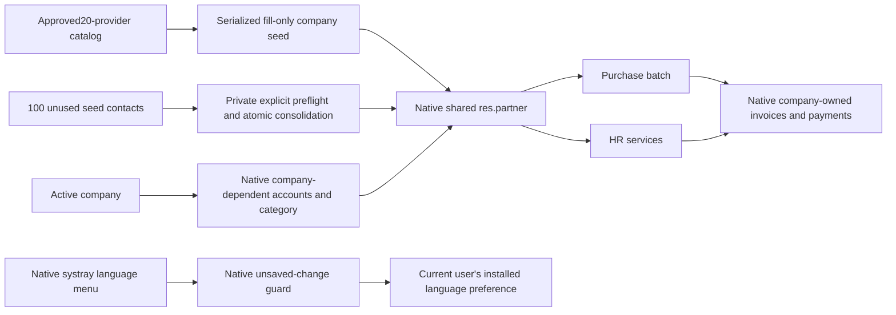

# SP1 — shared seed providers and bilingual supplier identity

2026-09-09. Delta to CSS1/HRS1; native Odoo 19 remains accounting authority.
Scope: baseer_service_seed19.0.1.1.0, baseer_purchase_batch19.0.1.2.3,
baseer_hr_services19.0.1.1.0, baseer_web_navigation19.0.1.1.0. QA only.

## Ownership and invariants

- Shared identity is company_id=False, independent commercial partner, catalog global XMLID. Company aliases resolve to that same identity. New company setup reuses20contacts and creates only its own mappings/properties.
- Native payable/receivable/payment terms/fiscal position/category fields remain company-dependent. No historical invoice/payment/employee/loan partner IDs are rewritten. Financial reads retain native company ACLs.
- Private suppliers remain valid only for their company. Sharing a provider does not share bills or employee services. HRS proposals prefer global then legacy aliases.
- Arabic/English optional fields compose native searchable name when explicitly set. Native name-only edits remain respected; seed is fill-only for existing masters.
- Header exposes installed Arabic/English only. Native user preference write, no sudo or new RPC method; native clearUncommittedChanges before reload.

## Controlled migration

User authorized deleting old duplicates instead of archival. Inventory showed100contacts with only native creation chatter/tags/self commercial links. Fresh20canonical contacts were created to avoid sharing private content. All source properties transferred by company; aliases retargeted; sources deleted with native ORM unlink. Backup and100-row lineage retained outside application records.

Private migration method is not a public UI endpoint. It rejects any business FK, generic reference, private attachment/chatter, unrelated XMLID, identity mismatch or conflicting property. One savepoint covers all families, including late failures. RepeatableRead serialization retry and unique global XMLID prevent concurrent duplication. Upgrade alone does not delete existing legacy contacts on another database.

## Evidence and limits

Release evidence: docs/releases/2026-09-09-shared-partners. 37 rollback workflow/ACL checks,23 migration rejection/future-company checks,16 real concurrency assertions on disposable clone. Dry-run and applied migration verify100deletions,20canonical contacts, exact explicit property transfer, no dangling aliases, rerun idempotence. Browser verifies native card/search/navigation, Arabic/English, mobile menu, failed-save guard and VAT115=100+15.

Capacity assumption retained from CSS1:100companies/1000employees/20000HRservices peryear.20sharedmaster rows instead of20percompany; no production load certification. Backup is pg_dump custom format plus filestore/hash; concurrency clone restore validates pg_dump/restore path, not a timed disaster-recovery rehearsal of the before-migration backup. No core/vendor or dependency changes. Main database is outside deployment scope.
