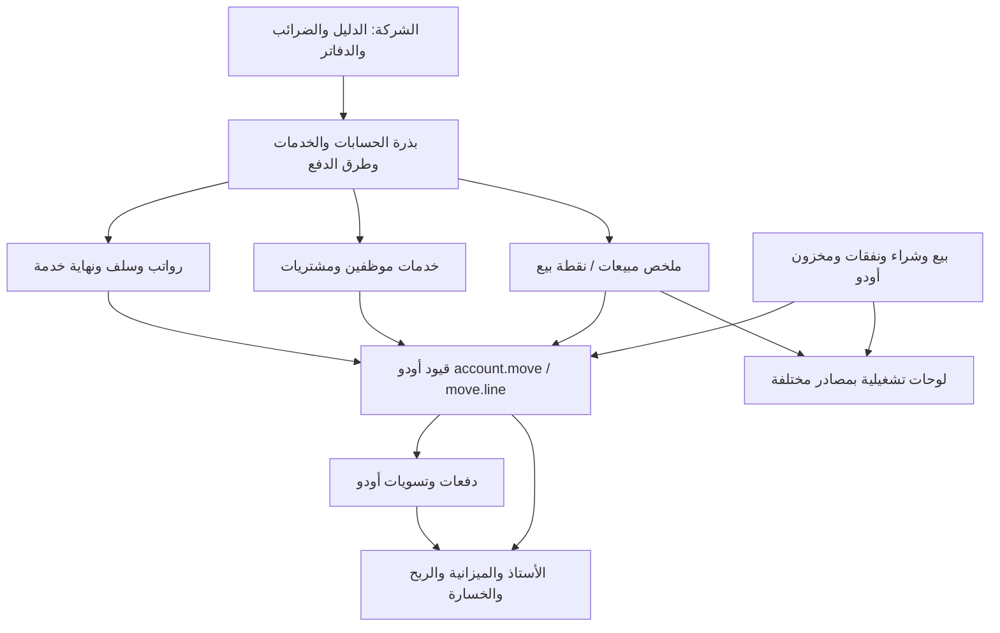

# نطاق التدقيق المحاسبي وERP

2026-09-09 — فحص قراءة فقط قبل بدء التشغيل. أكد المستخدم أن الأصلية لم تُسجل فيها عمليات نهائياً؛ خلو الجداول مقصود وليس عيباً. المطلوب تقييم الجاهزية، لا تدقيق قوائم مالية تاريخية أو إصدار شهادة امتثال قانوني.

المصدر المجمد: `8aff2c48f66df5925cf9dd98e9e7f11b55741f50`، قاعدة `baseer_dev`، الأصلية على المنفذ18069. أثبت `verify_provenance.py` تطابق1106ملفات مع مرشح الإصدار،166وحدة مثبتة، وعدم وجود تحديثات وحدات معلقة. المصدر مركب للقراءة فقط. الدليل: `provenance.json`.

الشركات: ARZ، المعلم الشامي، دوحة المستهلك. يشمل النطاق جميع حساباتها ودفاترها وربط الأنظمة المالية المخصصة، والإعدادات المالية للوحدات الأصلية المثبتة. لا ينقل هذا الفحص بيانات ولا يعيد إنشاء بيانات الاختبار التي طلب المستخدم حذفها.

## الفريق وملكية العمل

| الدور | النطاق | المخرج |
|---|---|---|
| كبير المحاسبين / حارس الحقيقة الحسابية | الشجرة، الدفاتر، الضرائب، الحسابات الافتراضية، الاتساق المالي بين الشركات | chief-accountant.md وأدلته |
| مدير ERP / مختبر الدورات | الرواتب والسلف ونهاية الخدمة والخدمات والمشتريات وملخصات المبيعات، الاعتماد والعكس والسداد | erp-workflows.md وأدلته |
| خبير أودو / حارس الروابط والصلاحيات | الوحدات الأصلية، تكامل التقارير، عزل الشركات، صلاحيات القراءة وجاهزية الرقابة | odoo-integration.md وأدلته |
| قائد المراجعة / أمين الدليل | إثبات المصدر، مراجعة حدود الاستنتاج، جمع النتائج وإزالة التكرار | REPORT.md، provenance.json |

استُخدم منهج alpha-delivery-team بعمق محاسبي، مع توزيع الأدوار المتقاربة على ثلاثة وكلاء قائمين. لم يُنشأ فريق برمجة أو تُفتح دورة نشر. تبقى الموافقات السابقة أدلة للنطاق الذي اختبرته فقط، ولا تعني اعتماداً تلقائياً لكل النظام.

## خريطة التدفقات المرجعية

أعيد استخدام خريطة `docs/architecture/registry/INDEX.md` وسجلات الدورات المرتبطة بها؛ لم يتغير التصميم في هذا الفحص. الملخص التالي مشتق منها ومن الوحدات المثبتة، وليس محاكاة عملية جديدة:

مصدر الالتزام والمصروف والإيراد هو القيد الأصلي؛ السداد والمبالغ المتبقية مصدرها الدفعات والتسويات الأصلية. فئات الخدمات والموردون وملخصات العرض لا تستبدل حساب الأستاذ. صلاحية هذا العقد لكل تدفق تُفصل في تقارير المختصين.

## حدود الإثبات

- جرد شامل للإعدادات والحسابات متاح؛ عدد القيود والأسطر والمدفوعات صفر كما هو مقصود.
- مراجعة المصدر الحالي وأدلة الاختبارات السابقة متاحة؛ لا تُعرض اختبارات سابقة كأنها أُجريت اليوم.
- لم تُنشأ عمليات اختبار على الأصلية ولم تُشغّل QA المتوقفة. أي اختبار يتطلب كتابة بيانات أو سجلات تشغيل مستبعد من الجولة.
- لا يكفي خلو النتائج من أخطاء لإثبات فصل المهام أو دورة مالية تشغيلية لم تُجرب؛ هذه حدود تغطية تُذكر مستقلة عن العيوب المثبتة.
- لوحات البيانات ليست كلها قوائم محاسبية؛ الدراسة المحفوظة في `docs/operations/2026-09-09-dashboard-review.md` ما زالت مرجعاً لنطاق كل لوحة.
- أحكام الجاهزية لا تشمل تلقائياً الامتثال الضريبي، أو دقة التقييمات والأرصدة الافتتاحية، أو اختبار الأداء تحت حمل، أو مطابقة البنك الخارجي.

مراجع أودو الرسمية المستخدمة لتفسير عقد الحساب والتقارير: [دليل الحسابات](https://www.odoo.com/documentation/19.0/applications/finance/accounting/get_started/chart_of_accounts.html)، [الدفعات](https://www.odoo.com/documentation/19.0/applications/finance/accounting/payments.html). خصائص Enterprise المذكورة في الوثائق لا تُفترض متاحة في هذه النسخة؛ الوحدات المثبتة والمصدر المحلي هما دليل التوافر.
