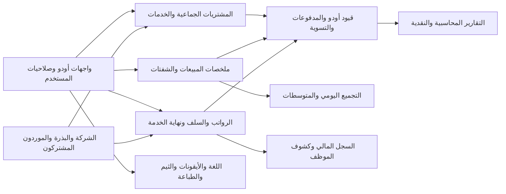

# FA1 — نطاق التدقيق وخطة التغطية

بدأ التنفيذ بتفويض المستخدم «ممتاز ابدء». هذا تدقيق مستقل للنسخة الحالية، وليس نشرًا أو إصلاحًا للتطبيق. مرجع التكليف docs/build-governance/ODOO-FULL-AUDIT-MANDATE.md.

## تثبيت النسخة

candidate.json يجرد1082ملفًا مخصصًا/خارجيًا و21إضافة مصدرية؛ QAيشغل113إضافة إجمالًا.11من12إضافة بصير مثبّتة، baseer_coreغيرمثبتة. OpenHRMSالأربع موجودة مصدرًا ولكن غيرمثبتة ولا ضمنaddons_pathالحالي؛ لا تمنح قبولًا تشغيليًا. Odooالمحلي commit1a13ceeaee12fe5cc50f287c31f217d4be2a2eaf وشجرته نظيفة؛ التشغيل يستخدمصورةDockerموثقة بصورةIDولا نفترضتطابقالمصدرالمحليمعها. المستودعالأعلى دونHEADنسخةالتدقيقZIPوبصماتوليسcommitمختلق.

## الفريق المستقل الفعلي

| المسار | المراجع | الملكية | العمق |
|---|---|---|---|
| الرواتب والسلف ونهاية الخدمة وأغراض الحسابات | audit_payroll_accounting | payroll-*؛ baseer_payroll/company_setup وOdooMates | عميق حسابيًا |
| عزل الشركات والصلاحيات وجودة الكود | audit_security_quality | security-*؛ مراجعةحدودكلالإضافات والإضافاتالعرضية | عميق أمنيًا ومركز للجودة |
| المبيعات والتقارير النقدية والمتوسطات | audit_sales_reports | sales-*؛ pos_summary/cash_categories والتكامل | عميق حسابيًا |
| سلامة المصدر والتشغيل والبذرة والمشتريات والخدمات | قائدالتدقيق root | core-* والجردوالخطةوالتقريرالمجمع | عميق للبيانات والمعاملات |

أدوار ألفا الأساسية مجمعة ضمنهذهالمسارات بحسبالخطر دونتضخيمعددالوكلاء. الوكلاءالثلاثةجددلم يكتبواالتخصيصات؛ rootيراجعالملفاتالتيكتبهاالمساهمونالآخرون، ومراجعالأمانيراجعإضافةالهدرالتيكتبهاroot. مراجعةالنتائجمتقاطعةقبلالحكم. لا وكلاءاحتياطجددخارجالاختصاصاتالأساسية.

## خريطة مرجعية محدثة بالنطاق

أُعيد استخدام docs/architecture/registry/INDEX.md ومراجعCSS1/HRS1/SP1/POS/BP. SP1هوالمرجعالأحدثلملكيةالموردالمشترك، ويحل محلعباراتprivateprovidersفيالمراجعالأقدم. لا تعديلمعماري فيمرحلةالتدقيق.

العقدالمثبتة: nativeledgerمصدرالقيود والمدفوعات؛ ملخصاليوميعتمدسجلاتالمبيعاتالمعتمدة؛ كشوفالموظفجزءمنالرواتب. النقاطالتيتحتاجإثباتًا: اتساقالملخصاتمععكسالقيود، معنىمسددعندoutstanding، حدودإجازاتالموظف والأيامونهايةالخدمة، نطاققراءةأبناءكشوفالمرتبات.

## بيئات التحقق

قراءة فقط QAعلى18070 وmainعلى18069. snapshot/baselineمنالماليةوالماسترتحفظبصماتها. pg_dumpمتسقمنQAإلىأربعقواعدمعزولة baseer_audit_{core,payroll,sales,security}_20260909، دونHTTPودونcron. اختباراتSQL/ORMتُشغلضداختصاصالمراجعبحارسdbnameصارم. لا إرسالبريد/واتساب ولا تغييرالتطبيق؛ fixturesrollbackأوcommitحصريداخلcloneلاختبارالتزامنثمإزالةclonesبعدجمعالأدلة.

## قرار القبول

لاGOبوجودخطأمحاسبيجوهري أوتسرببيانات أوتعارضمعالدليل. المقترحاتالموروثةتُصنّفسياسة/قيودمعلنة،ولاتتحوللنجاحضمني. الإصلاحخطةلاحقةمرتبطبالملاحظةواختبارإغلاق، بعدعرضنتيجةالتدقيق. لم يُمنحاعتمادإنتاجيأوحدسعةبعد.
