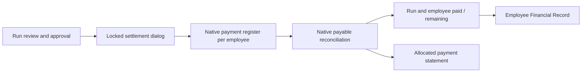

# BP-S2 — unified settlement and employee financial record

G0 user contract: implement agreed run create/review -> approval -> one batch settlement dialog -> return to run. Preserve separate native payment per employee. Run list/form shows draft, awaiting payment, partial, paid and paid/remaining totals. One native view of payment history; aggregate printable voucher over actual payments. Employee tab must be named Financial Record / السجل المالي and show monthly gross, other deductions, advance recovery, net, paid, remaining, payment stage, link to payslip/source run. Existing advance history retained. QA only, main untouched. No external bank transfer, new invoice, invented real salary/account mappings or editing posted salary sources.

G1 existing 100-employee measured payroll capacity remains. New settlement bounded by one run, employee child lists native pagination, source payment lookup through indexed relations/reconciliation. No global scan, frontend arithmetic, extra package or cache. Exercise multiple employees, six-month scenario reuse, partial/cash/bank, same-wizard replay/stale-balance rejection and independent transaction concurrency. No new seven-year performance claim.

G2 ARCHITECTURAL delta. Native account.move payable residual remains authority for salary amount paid; bank liquidity matching is separate and must never be relabeled as matched by UI. Computed nonstored presentation stages from immutable payroll state and native amounts. Related employee read-only One2many on existing hr.payslip; no duplicate ledger. Batch transient lines are proposed amounts only, never payment authority. Server Decimal <=2dp, nonnegative amount <= current residual, current company/approved managed run/employee membership enforced after locks. Native payment.register executed per selected employee once, same date/journal/payment method; transaction atomic. Existing native wizard replay guard retained. Parent wizard row lock plus employee locks, private results identity and immutable completed dialog guard; reject arbitrary children/reparent/context result injection. Distinct stale dialogs must fail instead of repeating a reduced balance unexpectedly. Return to run without automatic navigation into payments; source history explicitly opened on demand. Partial allocations per employee visible before confirmation.

Bank semantics: direct confirmed payment uses the journal's native bank/cash liquidity account via configured native payment method. No arbitrary state overwrite or custom ledger bank amount. Direct-bank configuration for QA demo company10 may be set after verifying native method and journal identities; other companies untouched. Existing outstanding demo payments may be settled only by a balanced native bank/outstanding transfer and reconciliation after source review, never through resetting/reposting a salary payment or relabeling its state. Exact pending payment ids/amounts to be frozen in operations evidence before mutation. If native controls prevent valid reconciliation, preserve records and report limitation instead of bypassing guards.

G3 direct path: extend existing baseer_payroll addon and native OM/Odoo models/views/report engine. No vendor changes or new dependencies. Native list/form/kanban/monetary/date/statusbar and related fields. Six-month base salary/advance calculations unchanged; focused settlement regressions plus existing suite if public action compatibility changes require it. New addon version19.0.1.1.0; preserve prior artifacts; coherent QA/source backup before edits.

G4 native scoped UI: one dialog with journal/method/date and employee allocated amounts+total; remaining shown readonly; labels Arabic/English and Western digits. Mobile native cards/form for allocation and financial history; no global CSS/newJS. FinancialRecord and focusedPayslip views retain manager restrictions; payment roles native accounting required. Review within draft; no extra verification state/button. Monthly run status computed, never manually editable. Aggregate receipt includes company/date/method/employee amount and bank completion distinction; no double counting old+new installments.

Ownership: root owns integration, models/financial_record.py (stages, history/navigation), tests/evidence/backup/security additions/manifest. Finance worker owns models/settlement.py only after gates. UI worker owns views/settlement_views.xml, report/payment_receipt.xml and i18n/ar.po after frozen API; avoid existing shared view edits via inheritance. Independent om_review owns BASEER-PAYROLL-FLOW-REVIEW.md. No agent overwrites another owner.

Acceptance: actual UI newbatchpartial and full payment returnsrun; statuses agree table/form/employee; zero-net approved run paid without payment; canceled excluded; employeehistory opens correctemployee/source; unsupported/foreign/unposted/duplicate/negative/>2dp/overpay/stale requests fail atomically; histories/PDF reflect sources; main and earlier source salary/loan records unchanged except precisely audited QA native bank-settlement additions and reconciliation.

G5–G7 execution: implemented four new model/view/report files plus registration/security/translations in19.0.1.1.0.92 focused checks passed over six rollback months; atomic failure, sharedpayment allocation, company/access/input guards and zero-net cases included. OctoberQA107 created/approved via UI,500 each paid through unifieddialog, then independent concurrent requests completed3400 exactlyonce. Native final4400 paid and0remaining; employee31 FinancialRecord→Octoberdetails→originalpayments verified. Desktop and390px mobile inputs/navigation and four Arabic/English PDFs inspected. Bank operation trial+commit and cash account configuration approved by reviewerR2/R4, natively executed. Preservation passed, mainexact, oldfinancial amounts immutable. Artifacts and operating instructions in separate flowrelease directory; independent G8 pending final fingerprint review.

