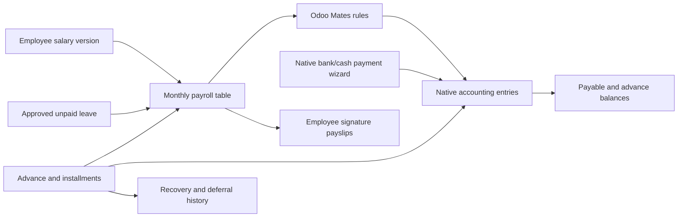

# Baseer payroll and advances — implementation contract 2026-09-08

## G0 scope and acceptance
User authorized planning and full QA implementation of agreed simplified payroll inside existing Payroll app: company automatic current company; monthly run creates eligible employee rows automatically; table gross/basic-included-OT/allowances, due loan deduction with defer checkbox, other deduction+reason, net; totals gross/deductions/loans/net; approve once; bulk employee payslips with signature; partial bank/cash salary settlement. Interest-free employee advances: create/disburse, installments, partial standalone repayment, defer and payroll deductions, aggregate remaining balances and employee history with source links. QA baseer_reports_qa_20260907/18070 only, main unchanged. No actual bank transfer, real salary setup, external mail, legal conformity assertion or unrelated app rewrite.

## G1 capacity
Assume3companies,900staff,3operators,10800slips/year,7-year retention. Bounded QA6-month fixtures plus100employee calculation and replay/concurrency test. Targets100slips<30sec local, list<2sec aspirational not SLA. Native paginated views, indexed employee/company/date/state. No new cache/queue/library. Coherent preinstall QA DB+filestore backup; rollback requires no intervening user writes, otherwise preserve candidate first.

## G2 data/control architecture
One addon baseer_payroll depends om_hr_payroll_account, baseer_core, baseer_purchase_batch (existing latin date widget), baseer_report_layout. No upstream edits. Native hr.version salary setup with opt-in baseer_payroll_enabled on employee/version; wage is gross excluding separately entered allowances. Optional included overtime split using legacy208hours/26days/8hours/1.5 coefficient, Decimal arithmetic in custom boundaries; monthly gross+dailyhours+monthlyworkdays. Currency2dp; backend validates raw money max2dp and rounds calculated results; native Odoo monetary ORM boundary retained. Native OM rule engine computes configured Baseer rules from locked snapshot components; frontend no business calculations.

Monthly cycle: create run(month first day/company=current) -> automatically build actual hr.payslip rows for enabled active employees with a contract overlapping period; draft rows editable deduction amount/reason and defer choice. Load/refresh employees explicit action available without losing manual edits (only rebuild on confirmed draft refresh, preserve existing matching rows). No current-month automatic selection based on attendance. Calendar-day proration default documented in company setting; alternative fixed30 can be configured, clamped0..1. Approved unpaid leave dates exclude pay; paid leave preserved. Native leave type has explicit Baseer unpaid flag; don't infer from text. Unsupported partial-day unpaid leave or mid-period wage version changes block with explanatory error rather than silently wrong salary. User reviews monthly calculated values before approval.

Company config: salary expense, salary payable (reconcile), other deduction recovery account, employee loan receivable (reconcile), payroll general journal, eligible bank/cash journals native. Configurable not hardcoded IDs, no automatic real account setup. Employee work_contact_id is partner for payable/receivable. Native accounting is balance authority. Payroll accrual rules: earnings Drsalaryexpense/Crpayable; otherdeduction Drpayable/Crrecovery; loan deduction Drpayable/Crloanreceivable. Net displayed equals sum payable credits-debits. Loan recovery lines reconciled to that loan's disbursement receivable; payroll does not duplicate cash. Native account.payment.register settles net liability partially or across bank/cash actions; residual from payable lines, no manual paid toggle. Batch prints one report over all slips, employee signature space. No extra vendor bill+accrual.

Advance cycle: baseer.hr.loan company/employee/principal/date/first_due_date/installment_count/journal -> draft -> disburse creates ONE native balanced ledger operation tied to treasury and loanreceivable -> running until residual0. Installment schedule with amount and due date; amounts exactly conserve principal. Worker may reuse native account.payment where correct, otherwise native account.move cash/bank journal entry with explicit statement/transfer semantics and no claim external bank transfer. Repayment via wizard amount/date/journal supports partial standalone payment; credit loanreceivable reconciles original debit. Payroll also credits same receivable. Allocation records link installment+sourceaccountmove+optionalpayslip, immutable and only private methods create; sum recovered must reconcile with ledger. Both standalone and payroll recoveries reduce same outstanding. Loan history via chatter/events retains original due date and every defer date/reason; no pretending deferred installment paid. Loan outstanding/source balances must agree; rounding residual assigned final installment. No interest, topup or arbitrary schedule rewrite required.

Shared interfaces (freeze before parallel implementation): baseer.hr.loan has company_id, employee_id, currency_id, amount, date, first_due_date, installment_count, journal_id, state(draft/running/closed/cancel), move_id, line_ids, paid_amount, balance; methods action_disburse(), action_repay() wizard, _due_amount(date_to), _apply_payroll(slip, move), _defer_due(date_to, reason), action_view_moves(). Loan uses E['res.company'] fields baseer_loan_account_id; employee work_contact_id. hr.payslip has baseer_managed, baseer_gross, baseer_basic, baseer_overtime, baseer_allowance, baseer_loan_amount, baseer_defer_loan, baseer_deduction, baseer_deduction_reason, baseer_net, baseer_paid, baseer_residual. Payslip _apply_payroll can locate loan creditlines via account_id and partner_id, allocate across due loans oldestfirst, guard no double allocation. Payroll caller locks employee/company globally before loan/slip work; shared advisory lock helper in models/common.py `lock_employee(env, employee_id, company_id)` and object token `INTERNAL` passed by Python-only context key baseer_payroll_internal; JSON cannot forge identity. Helpers `money(value)` Decimal2 rounding, `decimal(value)` conversion and `validate_money(value)` rejecting >2dp; `require_manager(record)` rights/company guard. Loan worker owns loan-specific child invariants and account.move loan guards; root owns payroll-related guards.

Controls apply to native OM slips as well: approval idempotent under employee advisory/row lock, valid state checks, backend payroll manager+accounting rights, global company rules for payslip/run/lines/inputs/workeddays/loans/installments/allocations; validate cross-company FK relations. Lock both parent and affected employee for all financial writes, due loan allocations and repayments; acquire consistent sorted employee locks for batch. Deny posted-source mutation and direct deletion of financial children. No caller-supplied boolean bypass. Protect linked posted accounting moves/lines from manual cancel/reset/delete/financial mutation (native reconciliation-only fields allowed). Safe correction: only unpaid salary accrual may be reversed with linked native reversal and loan-allocation reversal, then corrected replacement; paid salary reversal blocked until native payments un-reconciled/reversed through approved flow. If full reversal coupling cannot be sound within slice, explicitly block and report; do not retain upstream destructive cancel/refund. Draft cancel/delete safe, no invisible empty drafts.

## G3 direct path and source
Installed OM commit bf4b5867315da40466c2a830a087986427c61b9a, source frozen210files; no new paid/loan vendor, no second payrollengine. Odoo19native ORM/views/QWeb/accounting/payment wizards, stdlibDecimal. Reuse existing Baseer native UI/latin-date/fonts; nofrontenddependency. Full custom payroll engine rejected; thin custom workflow and advance register share native accounting.

## G4 design
Native form/list editable payroll rows, desktop wide sheet, mobile readable stacked native forms/row editor, month selector, footer totals, 3actions approve/pay/print. Salarysettings employee form; loans list totals/group employee and employee smartbutton history; actions drilldown originalledger. Englishsource+ArabicPO, RTL/LTR, Westernnumericwidgets inherited from existing Baseerpattern and PDFs formattedserver-side. Reuse native components, no animations. UIworker reads emil-design-eng andcentralcatalog; no libraryselection needed as no new UIlibrary.

## Owners/gates
Root owns models/common.py, models/payroll.py, addon manifest/init integration, tests/install/evidence. Loanworker owns models/loan.py and its linkedaccount guards+wizard Python; UIworker owns views/security/report/i18n/static files only. Independent om_review owns BASEER-PAYROLL-REVIEW.md gates and delivery (never its own implementation). G0-G4 pending independent review before app edits. Sixmonthsevidence expected: principal1200 six200installments, Jan200deduct, Febdefer, Marchstandalone50+dueadjustment, Aprilpartialrepayment, monthlymanualdeductions, salarypartbank/partcash, final outstanding compares sumledger; test separate loans/employee/companies, late payments/retry/negative/overpayment/locks and rollback. Expectations frozen in test before execution.

## Ledger
BP-001: User approved implementation and sixmonth tests. Read alpha-build/governance and OMinstallation/review context; existingnative/source identified. Contractprepared; no appcode yet. Next: independentG0-G4 review, oldcalculator/sourcefinancial API reads, coherentQAbackup, parallel implementation with explicit ownership.

BP-002 correction to G2 salary wording after reading actual legacy apps/web/src/hr-salary-tools-calculations.ts: wage is TOTAL INCLUDING allowances, not excluding allowances. Fixedbasic=gross-allowances. InclusiveOT hours=(dailyhours-8)*min(days,26)+max(days-26,0)*dailyhours; k=OThours/208; basic=(gross-allowances*(1+k))/(1+1.5*k); Overtime=gross-basic-allowances residual to preserve2dp total. Dailyhours9..12/workingdays1..31 for inclusive mode, schedule assumptions no statutory claim. Prorated component residual preserves eligiblegross.

BP-003 implementation completed on QA. Final direct dependencies: om_hr_payroll_account, hr_holidays, baseer_report_layout (the latter owns Latin date widgets/shared Arabic PDF fonts and requires the existing ERP Heritage report stack). No dependency on purchase batch or baseer_core needed. All posted payroll/advance cancellation, refund and reversal are explicitly blocked for this slice as accepted in review R1. This supersedes the provisional reversal design above. No real employee or original-company salary/account configuration set. Native Odoo source remains unchanged, including 210 pinned OM files.

BP-004 validation: baseer_payroll_checks.json passes 105 assertions across January–June2026 with two employees, manual deductions, direct partial loan repayment, installment deferral, partial bank/cash salary payments and replay guards. Additional baseer_payroll_focused.json passes five tests for post-draft salary version/period changes and locked dates for payroll/disbursement/repayment. Tests run as a nonsuperuser payroll/accounting manager with rollback. 100-employee computation measured 2.096seconds, not a production SLA or proof at projected seven-year volume. Payroll/loan company isolation, protected source/child/default-value guards, native payslip bulk PDF Arabic+English (2 employees/2 pages), full unpaid leave exclusion and 15-day return verified.

BP-005 real two-transaction concurrency evidence baseer_payroll_concurrency.json: same run approval produces only two employee entries; concurrent deferral creates one history row; concurrent submission of one partial salary payment wizard returns the same single payment. Native serialization retry retained. Persistent synthetic demonstration company10 «تجربة الرواتب والسلف», employees31/32, January run48 approved, February run49 approved with1,000 salary paid, March run61 draft; advance13 principal1,200/recovered350/outstanding850. No external bank transfer or employee messages sent. Trial company creation adds native stock defaults for that company on existing partners and admin company access; existing-company stock-property values are checked separately.

BP-006 delivery candidate: docs/releases/2026-09-08-baseer-payroll/candidate.json pins all15 addon source files and ZIP SHA256. Workspace has no Git commits, so a source hash manifest is the honest candidate identity. Original main database snapshot exact, all76 originalQA entries/180lines/28payments unchanged; only synthetic demo entries appended. Backup manifest+DB/filestore/config under .local-backups/baseer-payroll-20260908/preinstall. UI evidence: desktop/mobile, loan overview/recovery history, employee salary tab; reviewed Arabic PDF. Final independent G8 decision recorded separately by om_review.

## Final map (scoped to this addon)

All arrows are implemented paths; projected900employees/7years is a capacity assumption, not executed load evidence. UI/backend business calculations remain server-owned with Decimal conversion at the native monetary boundary.

BP007: Independent R4 delivery review accepted G5-G8: GO for the frozen QA candidate only. Source/ZIP, four backup files and 20 evidence hashes verified; 105+5 checks and three concurrency scenarios reviewed. No open blocking findings within scope. Approved-operation correction remains blocked; production promotion remains separate. See BASEER-PAYROLL-REVIEW.md.
