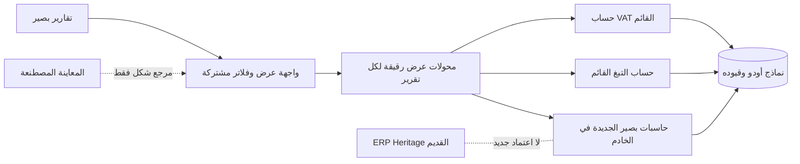

# حزمة تقارير بصير المستقلة — عقد بناء وسجل حي

المعرف: `BASEER-REPORT-SUITE-20261007`
أساس المصدر: `9ca026f611354b23adc660bd4a67e3fe8c40d1f9`
الفرع: `codex/baseer-report-suite-build`
التصنيف: `ARCHITECTURAL` — تقارير مالية ومصدر أرقام وواجهة مشتركة.
الحالة: **الحزمة المالية العشرية NO-GO للحاسبات الجديدة؛ شريحة الواجهة المشتركة وصلت ملفاتها إلى QA للاختبار عبر إصدار محمي، لكن قبول العرض وPDF/Excel والإنتاج غير مثبت.**

## G0 — عقد البناء والرحلات

- المستخدمون: مالك الشركة، المحاسب، ومراجع التقارير وفق مجموعات أودو وصلاحيات الشركة الفعلية.
- الهدف: حزمة صغيرة مترابطة من تقارير بصير الحقيقية، بواجهة Odoo عربية/إنجليزية موحدة، قابلة للتفصيل والتصدير، مستقلة عن ERP Heritage. ليست إعادة بناء كل تقارير الطرف الثالث.
- الحزمة المعتمدة من المالك: تقرير ضريبة القيمة المضافة السعودي، رسوم التبغ من POS، الربح والخسارة، دفتر الأستاذ العام، **العمليات الإجمالية الشاملة للضريبة، والمقبوضات والمدفوعات المسجلة كتقرير مستقل**، مديونيات العملاء، مديونيات الموردين، الميزانية العمومية، وميزان المراجعة. عددها **عشرة تقارير**. الفواتير في تقرير العمليات بتاريخ ترحيلها، و**كل بيع POS معتمد بتاريخ البيع المسجل** سواء حُصّل فورًا أو كان آجلًا؛ لا ينتظر فاتورة POS اللاحقة أو قيد جلسته أو دفعة تطبيق التوصيل. النقد/المقبوضات يُفصلان عن البيع، ولا يُقدّم هذا التقرير على أنه كشف رصيد البنك أو قائمة تدفقات نقدية نظامية. تظهر الميزانية ضمن القوائم المالية الأساسية، وميزان المراجعة ضمن أدوات المراجعة المحاسبية؛ لا تشمل الحزمة سائر تقارير ERP Heritage.
- **قرار المالك الأحدث (2026-10-07؛ يصحح شرط «المدفوع» السابق في تقرير العمليات):** يريد ظهور الفاتورة غير المرتبطة بـPOS في تقرير العمليات بإجماليها الشامل للضريبة عند **ترحيلها** ولو تأخر تحصيلها شهرًا؛ وظهور **أي بيع POS معتمد عند تسجيل البيع** ولو كان آجلًا، بما فيه مبيعات تطبيقات التوصيل مثل هنقرستيشن. لا تُنشئ المسودة أو عرض السعر عملية، ولا يجعل تسجيل تحصيل المنصة أو فاتورة POS لاحقة بيعًا ثانيًا. التحصيل يظهر في التقرير المستقل حسب حدث الدفع الحقيقي؛ لا يُجمع مبلغ العملية ومبلغ الدفع في إجمالي واحد.
- الضريبة والتبغ تقريران حقيقيان قائمـان؛ التغيير المقصود لهما توحيد العرض والتفاعل دون تبديل معادلاتهما أو مصدرهما ضمن الشريحة الأولى. الربح والخسارة والأستاذ في `baseer_report_ui_preview` بيانات مصطنعة وليسا تقارير تشغيلية. تقرير المقبوضات والمدفوعات وتقريرا المديونيات تحتاج جميعها حاسبات ومصادر مستقلة.
- رحلة أساسية: فتح التقرير من «تقارير بصير» ← اختيار الفترة/الشركة والمرشحات المناسبة من أدوات Odoo ← قراءة ملخص ثابت العرض ← فتح بند إلى قيوده أو عملياته المصرح بها ← الرجوع/تصدير PDF وXLSX من الفترة ذاتها. لا يغيّر التقرير أي مستند أو قيد.
- معيار قبول مالي: كل رقم يُحسب في الخادم ويُعاد ربطه بمصدره، ويُطابق اختبارًا مستقلًا على نسخة معزولة؛ لا يُستدل على صحة المال من نجاح الواجهة أو بيانات المعاينة. تُختبر المردودات، الإلغاء، السداد الجزئي، العملات، الفترات، عزل الشركات، والصلاحيات بحسب التقرير.
- معيار قبول الواجهة: نفس شريط الفترة والخيارات، بطاقة متوسطة متمركزة، صفوف قابلة للفتح باللمس ولوحة المفاتيح، أصفار هادئة، السالب/الخارج أحمر مع إشارة نصية، أرقام غربية، RTL/LTR، جوال وسطح مكتب، وحالات فراغ/تحميل/خطأ. لا تعتمد الوظائف على hover وحده.
- خارج النطاق الآن: حذف ERP Heritage، تغيير قيود أو فواتير أو ضرائب أو طلبات POS، تقديم إقرار رسمي، اعتبار المعاينة بيانات حقيقية، ترحيل بيانات أعمال، أو النشر إلى الإنتاج.

### خريطة الدورة والرقابة المحاسبية

| التقرير | الحدث/المستند والسلطة الحالية | رقابة مرحلة البناء |
| --- | --- | --- |
| ضريبة القيمة المضافة | `account.move.line` المرحّل ووسوم `l10n_sa.tax_report_vat_filing` واستحقاق Odoo؛ التقرير الحالي `baseer_tax_report` | الحفاظ على الصناديق الـ16 والاستثناءات غير الموسومة ونطاق الشركة والدفتر؛ لا اعتماد إقرار من الواجهة |
| رسوم التبغ | طلبات وسطور POS المكتملة في `baseer_pos_tobacco_report`؛ رسم السطر مشتق من pipeline POS الحالي وقد يختلف تاريخيًا مع تغيّر إعداد الضريبة | إبقاء تحذير فروق إعادة الحساب، المردودات وحدود الصفحات؛ مطابقة إجمالي العرض وPDF قبل/بعد |
| الربح والخسارة والأستاذ العام | قيود أودو المرحّلة؛ تعريف المجموعات والفترة والعملة والأرصدة الافتتاحية يُثبّت في G2 لكل تقرير | لا استعارة لنتائج أو handler من ERP Heritage؛ مطابقة الحسابات وميزان القيد والربط بالسطر |
| الميزانية العمومية وميزان المراجعة | أرصدة الحسابات من قيود أودو المرحلة بتاريخ قطع محدد؛ تصنيف الحسابات والسنة المالية والإقفال من إعدادات أودو | معادلة الأصول = الالتزامات + حقوق الملكية، وتوازن المدين/الدائن مع معالجة نتيجة السنة وفق عقد Odoo؛ تفصيل كل رصيد إلى مصدره |
| العمليات الإجمالية شاملة الضريبة | فاتورة عميل/مورد مرحلة بتاريخها المحاسبي، أو بيع POS أصلي **معتمد بتاريخ البيع المسجل سواء دُفع أو كان آجلًا**؛ القيد المباشر المصنف فقط عند ثبوت أنه حدث تجاري أصلي | مبلغ البيع/الشراء الشامل للضريبة مرة واحدة؛ تُستبعد الدفعة والتسوية وفاتورة POS اللاحقة وقيد الجلسة المكرر والتحويل الداخلي. يُختبر مصدر الملخص المعتمد وروابطه وفرق توقيته عن الأستاذ في G2 |
| المقبوضات والمدفوعات المسجلة | أحداث التحصيل والصرف الحقيقية فقط؛ POS النقد/البطاقة عند تأكيد الدفع وفق عقد القناة، بينما حساب العميل الآجل وتخصيص تطبيق التوصيل غير المحصّل ليسا قبضًا بمجرد تسجيل بيع POS | مصدر الحدث لكل قناة وحالته وتاريخه يُثبّت في G2؛ دفعة المنصة وتسوية البطاقة والتحويل الداخلي لا تضاعف القبض. هذا تقرير أحداث دفع، لا كشف رصيد بنك ولا قائمة تدفقات نقدية نظامية |
| مديونيات العملاء والموردين | الفواتير المعتمدة غير المسددة عند تاريخ القطع؛ الدفعات المقدمة/الأرصدة الدائنة في قسم مستقل، بلا خصم صامت من قيمة الفاتورة المفتوحة | فصل كل فاتورة عن المقدمات، ومعالجة الدفعات الجزئية والإشعارات الدائنة والعملات وتاريخ القطع دون ازدواج |

### تعديل عقد تقرير العمليات بعد قرار المالك — مرشح G0/G2

- مثال قبول: فاتورة عميل مرحّلة بقيمة `115` (أساس `100` وضريبة `15`) في سبتمبر، تُظهر «مبيعات شاملة الضريبة 115» ومديونية `115` في سبتمبر حتى لو وصل الدفع في أكتوبر؛ تحصيل أكتوبر `115` يُصفّر الذمة ولا يزيد مبيعات أكتوبر. يُظهر P&L الإيراد دون ضريبة وفق قيوده، ويظل تقرير VAT خاضعًا لوسومه واستحقاقه الفعلي؛ لا يُشتق الإقرار الضريبي من إجمالي هذا التقرير.
- مثال POS: بيع معتمد بمبلغ `115` مسجل ليوم 30 سبتمبر، ورُحّل قيد جلسته أو صدرت فاتورته يوم 1 أكتوبر، يُعرض **مرة واحدة في عمليات سبتمبر** وفق قرار المالك، سواء دُفع فورًا أو سُجل آجلًا. إذا كان آجلًا فلا مقبوضات في سبتمبر وتبقى المطالبة على العميل/المنصة حتى تحقق التحصيل؛ إذا دُفع فعليًا في سبتمبر يظهر `115` في تقرير المقبوضات المستقل دون إضافته مرة ثانية إلى المبيعات. تُعرض فجوة توقيت POS التشغيلي مقابل الأستاذ المرحّل للمراجعة ولا تُخفى.
- **تطبيقات التوصيل:** التسجيل في POS أو ملخص المبيعات المعتمد هو حدث البيع، لا تسوية حساب المنصة. مصدر بصير الحالي `baseer_pos_summary` ينشئ طلب POS واحدًا وقيد جلسة بتاريخ العمل مع `to_invoice=False` دون فاتورة عميل مستقلة؛ لذا لا يُفترض وجود فاتورة لكل ملخص، ولا يُحوّل تخصيص طريقة دفع «هنقرستيشن» إلى قبض نقدي. إن وُجدت فاتورة حقيقية مرتبطة بالبيع لاحقًا، تُعرض كمستند داعم لا كعملية ثانية. يلزم مطابقة هذا المسار مع إعدادات QA الفعلية قبل اعتماد G2.
- شراء مورد مرحّل بقيمة `115` يظهر ضمن المشتريات/العملية الإجمالية في تاريخ القيد، ودينه حتى السداد؛ دفعه لاحقًا لا يزيد مشتريات فترة الدفع. المصروف المباشر المرحّل بلا فاتورة يدخل مرة واحدة فقط إذا كان إيرادًا أو تكلفة/مصروفًا حقيقيًا بمصدر محاسبي قابل للتفصيل، ولا تعاد إضافته من كشف البنك أو سداد الفاتورة. التحويل الداخلي بين صندوق وبنك لا يصنع بيعًا أو مصروفًا.
- التصحيح/المردود يكون بمستند أو قيد عكس مرحّل ومربوط بالأصل، وبإشارته وتاريخه المحاسبيين. إذا كان شهر سبتمبر مقفلًا وصدر إشعار دائن `15` في أكتوبر: يبقى سبتمبر `115` ويظهر أكتوبر `−15`، ولا يُعاد كتابة سبتمبر بصمت. إذا سُمح قانونيًا وتشغيليًا بتأريخ التصحيح في سبتمبر غير المقفل، يظهر أثره في سبتمبر وفق القيد الفعلي. قواعد قفل VAT الحالية مستقلة ولا تُبدلها هذه الواجهة.
- **G2 لم تُعتمد:** قرار دخول POS المعتمد ولو آجلًا محسوم؛ يلزم إثبات تاريخ البيع المسجل وحالته في نسخة QA وعقد مصدر واحد لكل بيع/شراء POS أو فاتورة، ومنع تكرار فاتورة POS وقيود الجلسة والدفع، وتمييز تخصيص المنصة/`pay_later` عن قبض فعلي، وتصنيف القيد المباشر وفرق الصرف والإشعارات. تقرير المقبوضات مستقل بقرار المالك، لكن قواعد حدث الدفع فيه لا تُستنتج من تقرير العمليات. اختبار الحسابات والحقوق والشركات ونسخة QA الفعلية شرط قبل أي كود مالي. لا تنسخ خوارزمية ERP Heritage.

## G1 — ملف السعة والاستمرارية (مسودة افتراضات)

- القراءات أكثر من الكتابات؛ التقارير قراءة فقط ولا تنشئ حركة أعمال. حجم القيود وطلبات/دفعات POS الفعلي وتزامن المستخدمين غير مثبتين لهذه الحزمة بعد. افتراض تصميم أولي قابل للقياس: 10 قراء متزامنين، حتى 100,000 سطر مصدر في فترة كبيرة؛ **ليس شهادة أداء**.
- الواجهة لا تحمل القيود كلها: إجماليات خادمية وصفحات تفاصيل محدودة، مع حدود فترة ونتائج معلنة. احتفظ بسقف التبغ الحالي (100 صف معاينة/صفحة و5,000 سطر مصدر) ومسار تقسيم الفترة إلى أن يثبت قياس بديل.
- هدف أولي للقراءة التفاعلية 3 ثوانٍ لعينة QA المعزولة بعد تحديد حجمها؛ قياس 100,000 سطر والتزامن والاستعلامات والفهارس مطلوب قبل وعد السعة. PDF/XLSX الكبير يحتاج حدًا واضحًا أو تنفيذًا قابلاً للاستئناف بحسب القياس.
- الاستمرارية: لا migrations لبيانات الأعمال في شريحة الواجهة؛ الفروع وPR وفحوص CI، ثم QA بسياسة موديولات محددة وزوج DB/filestore للاسترجاع. لا إنتاج بلا طلب وقرار تسليم مستقل.

## G2 — الحدود والعقود (مسودة)

- المشترك هو عقد العرض: تعريف التقرير، فترة مطبقة، خيارات، صفوف/أقسام، قيم منسقة، إجراء فتح التفاصيل، وصفحات التصدير. **ليس** معادلة مالية عامة واحدة. لكل تقرير مالك حسابات واختبارات مستقلة؛ جميع التجميعات والتقريب والتحقق والصلاحيات في الخادم. لا `float` ثنائي كمصدر لمبالغ التقرير؛ التمثيل الدقيق والعقد النقدي يحتاجان تحديدًا في كل adapter.
- لا تعتمد التقارير الحية على `baseer_report_ui_preview` ولا تستورد `SAMPLE_REPORTS` أو `SAMPLE_ITEMS`. يستخرج هيكل عرض صغير مستقل عند إثبات قابليته لإعادة الاستخدام، مع إبقاء المعاينة معنونة كبيانات تجريبية أو إيقافها بعد قبول البدائل.
- لا يعتمد أي تقرير جديد على `eh_account_base` أو `eh_account_dynamic_reports`. `baseer_report_layout` و`baseer_arabic_ui` و`baseer_cash_categories` لا تزال مرتبطة بالطرف الثالث؛ لا تُزال قبل جرد المستهلكين وتكافؤ البدائل وتجربة الرجوع.
- الشركة والفترة والدفتر والمستخدم تُتحقق على الخادم؛ فتح التفاصيل يستخدم نطاقًا خادميًا لا معرف صف قادمًا من DOM وحده. الشركة المتعددة لا تُجمع بلا عقد عملة وسياسة مفوضة.
- G2 **غير مكتملة** للحاسبات الجديدة حتى تحديد: تاريخ القطع والرصيد الافتتاحي للربح والخسارة/الأستاذ/ميزان المراجعة والميزانية، خريطة أحداث الدفع الخادمية وحالات POS ومنع ازدواج التسجيل/التسوية، تعتيق الفواتير والمقدمات والعملات والتسويات، ومستوى المقارنة المرجعي لكل تقرير. قرارا توقيت POS وفصل المقدمات أدناه لا يعتمدان خوارزمية التقرير وحدهما.

### نتائج استكشاف G2 للنقد والذمم — مرشحة، لا عقد معتمد

- فرضية الاستكشاف السابقة بأن صافي التقرير يساوي تغير `asset_cash` **لم تُعتمد**: بطاقة POS المؤكدة تُحسب عند تسجيل الدفع ولو تأخرت تسوية البنك، لكن **تخصيص طريقة تطبيق توصيل آجل في طلب POS ليس إثبات تحصيل من المنصة**. تُعرض مطابقة البنك مستقلة ولا يوصف إجمالي التقرير بأنه رصيد سيولة مصرفية.
- **لتقرير المقبوضات والمدفوعات وحده:** تدخل دفعة POS النقدية أو البطاقة المحصلة مرة واحدة عند تأكيد حدث الدفع، لا عند قيد جلسة POS أو تسوية البطاقة لاحقًا. طلب POS الآجل أو تخصيص منصة توصيل غير محصّل يدخل تقرير **العمليات**، لا المقبوضات؛ تُسجّل المقبوضات عند حدث تحصيل المنصة الحقيقي المثبت، وبقدره عند الجزئي. الفاتورة غير المدفوعة لا تدخل المقبوضات، والمردود يدخل عند رد المال بإشارة خارجة. `pos.payment` وحده ليس دليلًا كافيًا لتحصيل المنصة لأن مسار الملخص يُنشئه أيضًا للتخصيص؛ يلزم رابط خادمي بين الحدث الأصلي والتسوية لمنع التكرار. حالات الطلب، `pay_later`، الباقي النقدي `is_change`، وتاريخ الدفع مقابل تأخر مزامنة POS تحتاج عقد G2 صريحًا.
- لا يُستخدم `baseer_cash_categories` أو `baseer_financial_register` كمحرك جديد: الأول يرث handler من ERP Heritage، والثاني لا يثبت عقد منع الازدواج المطلوب هنا. يمكن قراءة مسارات أودو الأصلية للمطابقة فقط دون اعتماد جديد على Heritage.
- مرشح مصدر الذمم التاريخية هو سطور `asset_receivable` و`liability_payable` المرحّلة والتسويات حتى تاريخ القطع، لا `amount_residual` الحالي وحده. الفاتورة التي سُددت بعد تاريخ القطع يجب أن تظهر مفتوحة في التقرير التاريخي. **قرار المالك:** تُعرض الفواتير المفتوحة والدفعات المقدمة/الأرصدة الدائنة في قسمين مستقلين؛ لا تصفّي المقدمات قيمة الفاتورة بصمت. تعتيق كل قسم والعملات والإشعارات الدائنة تحتاج اختبارًا وعقدًا نهائيًا في G2.
- عقود الاختبار المطلوبة: دفعة POS بطاقة `115` عند البيع ثم تسوية بنكية `115` لاحقًا تُنتج قبضًا واحدًا `115` في فترة الدفع، لا `230` ولا تأخيرًا إلى فترة البنك؛ **بيع POS آجل/منصة `115` يُنتج عمليات `115` و«مقبوضات صفر» حتى إثبات التحصيل، رغم وجود سطر تخصيص POS**. فاتورة `115` وسداد `40` **مطابق لها قبل تاريخ القطع وبالعملة نفسها ودون إشعار/شطب/فرق** تُنتج قبضًا `40` ودين فاتورة `75`. أما `40` غير المطابقة فتظل مقدمة مستقلة وتبقى الفاتورة `115` مفتوحة؛ ويُختبر تحويل منصة جزئي وعمولتها دون افتراض أن صافي التحويل يساوي إجمالي البيع. إشعار دائن وشطب، دفعة قبل الفاتورة وبعد تاريخ القطع، POS متعدد طرق الدفع وتأخر التسوية، تحويل داخلي عبر فترتين، رد مال، عدة شركات وعملات، وإشارة VAT والتقريب. لا يبدأ تنفيذ هذه الحاسبات قبل تثبيت جدول أحداث دفع وحيد لكل قناة، مفتاح منع تكرار واستبعاد التسوية اللاحقة، تاريخ/منطقة الحدث والتصحيح والعكس، ثم مراجعة العقود التقنية.

#### خريطة أحداث مرشحة من مصدر Odoo المحلي — تنتظر مطابقة محرك QA

| القناة | سجل الحدث المرشح الوحيد | ما لا يُحسب ثانية وما بقي غير محسوم |
| --- | --- | --- |
| POS نقد/بطاقة محصّلة | `pos.payment` مرشح بعد إثبات أن طريقة الدفع قبض حقيقي لا تخصيص منصة أو `pay_later`، مع مبلغ وتاريخ مثبتين؛ يُطرح `is_change` من المقبوض الصافي | تسوية جلسة POS و`account.payment`/كشف البنك وفاتورة POS لا تضاعف القبض؛ يجب إثبات روابطها على QA والتزامن المتأخر |
| منصة توصيل/حساب عميل آجل | **بيع POS عند اعتماده للعمليات فقط**؛ تخصيص `pos.payment` في ملخص بصير لا يُعامل قبضًا؛ تحصيل المنصة/العميل ينتظر تحديد سجله الأصلي المثبت على QA | فاتورة POS أو قيد جلسته لا ينشئان بيعًا جديدًا، وتسوية التحصيل الجزئي/العمولة/الباقي لا تُفترض من قيمة البيع الإجمالية |
| دفع فاتورة عميل/مورد غير POS | `account.payment` أصلي مرحّل غير ناتج عن POS، مع الشركة والعملة والتاريخ ورابط القيد | المطابقة اللاحقة لا تولد تدفقًا جديدًا؛ توقيت `in_process` مقابل تأكيد البنك قرار مالك معلق، ولا يُفترض من قرار POS |
| قبض/صرف في كشف بنك دون دفع أصلي | `account.bank.statement.line` مرحّل بشرط غياب دفع أصلي محسوب | إن وُجد `payment_ids` أو مطابقة لاحقة لا يُجمع الاثنان؛ إثبات الهوية/الربط على QA لازم |
| قيد نقدي مباشر أو تحويل داخلي | لا يدخل تلقائيًا؛ يحتاج إثبات حدث خارجي وتمييز طرفي التحويل | قاعدة إدخاله قرار مالك معلق؛ التحويل بين حسابات الشركة لا يضاعف الداخل/الخارج |

مفتاح منع التكرار المرشح `(company_id, source_model, source_id)` مع رابطة المصدر/العكس والحدث المحاسبي المقابل، لا مجرد استبعاد بالنص أو نوع الحساب. يبقى **مرشح تصميم** إلى أن تُقرأ نسخة Odoo المثبتة على QA وأنواع طرق الدفع وروابطها الفعلية؛ `odoo/` المحلي ليس إثباتًا لنسخة الخادم. يلزم فصل تاريخ البيع المسجل عن تاريخ مزامنة POS وترحيل الجلسة وتاريخ تحصيل المنصة وتسوية البنك، وإظهار جسر فروق توقيت POS مع الأستاذ وبيان إعادة عرض الفترة بعد التصحيح. في الذمم: رصيد الفاتورة عند القطع من التسويات المرحلة حتى القطع لا من `amount_residual` الحالي وحده، مع مقدمة/إشعار غير مطابق في قسم مستقل؛ **إثبات مطالبة منصة التوصيل وPOS الآجل وتعتيقها** ينتظر فحص QA، لا قرار شمول البيع في العمليات. لا G2 GO من هذا الجدول وحده.

### شريحة B المرشحة — الميزانية العمومية وميزان المراجعة الحقيقيان

- أساس كلا التقريرين `account.move.line` لقيود `account.move` **المرحّلة** في شركة واحدة وعملة الشركة؛ تاريخ القطع من التاريخ المحاسبي للقيود، لا تاريخ إنشاء السطر أو تاريخ الفاتورة. الفترة الشهرية/الربعية تضبط الحركة؛ الميزانية لقطة «حتى» نهاية الفترة، وميزان المراجعة يظهر افتتاحي الفترة وحركتها وختاميها. المسودات، حسابات خارج الميزانية، والشركات الأخرى لا تدخل افتراضيًا. لا تجميع عملات شركات متعددة في رقم واحد.
- ترتيب الميزانية من `account.account.account_type` الفعلي (الأصول، الالتزامات، حقوق الملكية) مع نتيجة السنة الجارية ديناميكيًا عند تاريخ القطع. يجب أن يتحقق: الأصول = الالتزامات + حقوق الملكية شاملًا نتيجة الفترة/السنوات السابقة، بالدقة النقدية للشركة. لا يُعوَّل على جمع كل قيود الإيراد/المصروف منذ بدء قاعدة البيانات مباشرة؛ سلوك إقفال السنة وحسابات تخصيص الربح في Odoo 19 يحتاج مطابقة مستقلة.
- ميزان المراجعة لكل حساب: افتتاحي مدين/دائن، حركة الفترة مدين/دائن، وختامي مدين/دائن؛ إجماليا الحركة متساويان. الحسابات الميزانية ترحّل افتتاحيها عبر السنة؛ حسابات الربح والخسارة تبدأ سنة مالية جديدة بصفر، مع سطر «نتيجة مرحلة من السنة السابقة» الديناميكي وفق Odoo 19 كي يبقى الميزان متزنًا. يفتح الحساب إلى قيوده الخادمية في الفترة نفسها بعد التحقق من الشركة والصلاحيات.
- قبول إلزامي قبل GO: اختبار قيد افتتاحي متزن، سنة مالية متقاطعة بلا قيد تخصيص ثم بعده، فواتير ومردودات وضريبة، حساب أرصدة صفرية، شركتان، مبلغ بعملة أجنبية مع رصيد عملة الشركة، مسودة مستبعدة، وقيد على آخر يوم. تقارن كل خانة بمجموع قيود مستقل وتثبت معادلة الميزانية وتوازن الميزان عند حدود التقريب. الحد/الترقيم والأداء لعدد حسابات وقيود QA الحقيقي يُقاسان قبل وعد السرعة.
- هذه **مسودة G2 فقط**؛ لا تبدأ حاسبة B قبل جرد شجرة حسابات الشركة الفعلية وإقفالها، تثبيت الصياغة الدقيقة لنتيجة السنة، اختبار إمكانية العزل والأداء، وموافقة حارس البوابات المستقل. وثائق Odoo 19 الرسمية مرجع تعريف لا بديل عن إثبات قاعدة المستخدم.

#### عقد حساب شريحة B المرشح للمطابقة على QA

- مفتاح كل رصيد `(company_id, account_id)`؛ المصدر `account.move.line` المرحّل بتاريخ `date` المحاسبي وبقيم `debit/credit/balance` بعملة الشركة. `amount_currency` تفصيل لا يُجمع مع `balance`. القيد الافتتاحي الحقيقي يدخل مرة من أسطره؛ لا افتتاحي اصطناعي مضاف إليه. تُستبعد `off_balance` من القوائم الأساسية. نطاق شركة واحدة ودفاتر محددة بصراحة في الطلب، ولا `sudo` يتجاوز قواعد الوصول.
- بداية السنة من `company.compute_fiscalyear_dates(cutoff)` في محرك Odoo المثبت بعد التحقق من إعدادات الشركة/أي سنة مخصصة. أنواع `asset*` و`liability*` و`equity*` ذات افتتاحي مستمر حسب قاعدة النوع، بينما `income*` و`expense*` و`equity_unaffected` لا تُرحَّل افتتاحيًا بالطريقة نفسها؛ يجب إثبات الحالة الفعلية قبل/بعد تخصيص الربح. الفترة العابرة للسنة لا تُعرض كميزان سنوي واحد صامت؛ تُقسّم أو تُرفض برسالة واضحة بعد اختبار/قرار G2.
- ميزان المراجعة: افتتاحي صافي لكل حساب، حركة مدين ودائن كما في القيود (بما فيها storno إن وجد)، وختامي صافي = الافتتاحي + المدين − الدائن؛ عرض الافتتاحي/الختامي في جهة واحدة لا يغيّر إشارة القيمة الأصلية. سطر «نتيجة مرحلة من السنة السابقة» عند الحاجة **ديناميكي للعرض والتوازن**، ليس حسابًا أو قيدًا ينشئه التقرير؛ يجب مطابقته قبل وبعد قيد تخصيص الأرباح الحقيقي.
- الميزانية لقطة حتى القطع مصنفة بنوع الحساب الفعلي، مع فصل الحقوق الحقيقية عن نتيجة السنة والنتائج السابقة غير المخصصة. `balance = debit - credit`: الأصل المدين موجب، والالتزام/الحق الدائن سالب في المصدر؛ **قيمة عرض** الالتزامات والحقوق تقلب إشارتهما مرة واحدة فقط. يثبت اختبار مستقل أن مجموع أرصدة القيود المرحلة في نطاق التقرير يساوي صفرًا، ثم أن الأصول المعروضة = الالتزامات المعروضة + الحقوق المعروضة + النتيجة الديناميكية، ضمن دقة عملة الشركة؛ لا يُعد السطر الديناميكي قيدًا أو حسابًا حقيقيًا. بعد قيد التخصيص لا تُساوى نتيجة الميزانية بصافي P&L مباشرة دون جسر أثر `equity_unaffected`؛ صافي ربح الفترة يستبعد حساب التخصيص. تُثبت صيغة الجسر وشكل السطر من قيود QA لا من تقرير Heritage.
- مجموعة القبول الذهبية: شركتان بسنتين ماليتين مختلفتين، قيد افتتاحي، سنتان قبل/بعد تخصيص الربح، فاتورة ومردود وضريبة، قيد آخر يوم، مسودة مستبعدة، رصيد صفري، عملة أجنبية، وstorno إن وجد. لكل حساب تُطابق الخانات بمجموع AML مستقل؛ إجماليات افتتاحي/حركة/ختامي الميزان متوازنة، وحركة الأستاذ = حركة الميزان بنفس الشركة/الدفتر/الفترة، وختامي حسابات الميزانية = لقطة الميزانية؛ أي فرق معلل لا يُخفى. شجرة الحسابات وسنوات QA المثبتة لم تُفحص بعد، فلا يبدأ كود الحاسبتين قبل قرار الحارس.

#### ملف G1 ومسار G3 لشريحة B — للمراجعة، لا تصريح كود

- افتراض G1 المعلن بدل ادعاء قياس QA: التقرير قراءة فقط لشركة واحدة وعملتها في الطلب، و10 قارئين متزامنين، و100,000 سطر قيد مصدر لفترة كبيرة و5,000 حساب كحد تصميم أولي. للتخطيط فقط يُفترض نمو حتى 100,000 سطر قيد جديد/شركة/شهر وقراءة تقرير واحدة/مستخدم/30 ثانية في الذروة (نحو 0.34 طلب/ثانية عند 10 مستخدمين)؛ أحجام QA ومعدلها الحقيقيان غير مقاسين. لا تُحمّل التفاصيل كلها إلى المتصفح؛ إجماليات الخادم وقائمة حسابات محدودة وتفاصيل قيود بصفحات لا تتجاوز 100 سطر، مع نطاق تاريخ ومؤشر «المزيد». 3 ثوانٍ هدف مبدئي للتفاعل لا شهادة أداء؛ يُقاس على نسخة معزولة مع حجم/تزامن/خطة استعلام قبل G6.
- لا تنشئ هذه الشريحة بيانات مالية أو cache دائمًا أو تغيّر سجلات أودو: احتفاظ القيود كما في قاعدة أودو القائمة بلا حذف جديد، ومسؤول التشغيل هو مالك تشغيل قاعدة أودو الحالية. لا حالة تقرير منفصلة تستعاد؛ RPO/RTO لبيانات الأصل هما RPO/RTO منصة أودو نفسها، وللكود مسار الرجوع عبر الإصدار السابق. **افتراض تخطيط لا ضمان تشغيلي:** نسخة DB/filestore متسقة يوميًا (RPO مستهدف ≤24 ساعة) واستعادة خدمة خلال يوم عمل (RTO مستهدف ≤8 ساعات)؛ يجب على التشغيل إثبات السياسة والقدرة الفعلية قبل أي QA/Live. لا تُستنتج من نجاح النسخة المحلية أو تُقدَّم كوعد إنتاج.
- G3 المرشح: Odoo 19 Community `account` و`baseer_reports_menu` فقط، Python/Odoo ORM وQWeb/Owl/SCSS الموجودة؛ لا اعتماد على ERP Heritage أو أصول Enterprise ولا مكتبة جديدة. المسار المباشر هو وحدة مالية مستقلة ذات حاسبتين متمايزتين وقالب عرض مشترك؛ لا محرك حساب عام ولا تكرار بيانات القيود. قبل تثبيت أسماء الملفات وأوامر أول شريحة، يُقفل عقد G2 ويختار مالك الحسابات والخادم مسار الاستعلام الآمن للصلاحيات والفترة، ثم يراجعه حارس G3.

## G3 — التقنية والمسار المباشر (مسودة)

- الإبقاء على Odoo 19 Community وOwl/QWeb وBootstrap الموجودة؛ لا مكتبة UI جديدة ولا محرك ERP Heritage. أدوات بحث/فلاتر أودو الأصلية حيث يمكن، مع شريط خيارات متخصص للفترة والتقرير لا يكرر نموذج المعالج القديم.
- أقصر شريحة أولى: استخراج هيكل العرض المستقل، ثم تطبيقه على تقرير التبغ القائم مع ثبات `_build_report` وPDF A4 والاسم والصلاحيات؛ يليها VAT بعد اختبار الصناديق والحفر. لا تُبدّل خوارزميتا التقريرين في تعديل الشكل.
- الحاسبات الجديدة تُضاف تقريرًا واحدًا في كل شريحة رأسية (بيانات، اختبارات أرقام وصلاحيات، واجهة، تفصيل، PDF/XLSX)، ثم مقارنة تاريخية على QA مع المصدر المستقل/القيود. لا نسخ لأصول Odoo Enterprise أو شيفرتها؛ الصور مرجع واجهة فقط.
- الفحوص المرشحة: اختبارات Odoo المعزولة لكل تقرير، XML/JS/assets، تطابق totals والتفاصيل والتصدير، AR/EN وRTL/LTR والجوال، وقياس فترة كبيرة. أوامر الفحص الدقيقة تثبت عند تحديد ملفات الشريحة.

### شريحة C المرشحة — عمليات فواتير العملاء فقط (قرار تنفيذ 2026-10-07)

هذه **شريحة جزئية** من «العمليات الإجمالية شاملة الضريبة»، وليست تقرير العمليات الكامل أو واحدًا من التقارير العشرة المكتملة. يظل قرار بوابتها **NO-GO للكود المالي** إلى أن تُفحص أدلة QA أدناه ويصدر حكم مستقل؛ لا يُنشر تقرير جزئي باسم يوحي بتغطية POS أو المشتريات أو النقد.

| البوابة | عقد الشريحة المختصر | الحكم الحالي |
| --- | --- | --- |
| G0 | للمحاسب المخوّل شركة واحدة وفترة محددة: عرض فواتير العملاء والإشعارات الدائنة المرحلة غير المرتبطة ببيع POS، مع مجموع إجمالي شامل للضريبة وتفصيل إلى المستند. يُذكر على الواجهة صراحة استبعاد POS والموردين والقيود المباشرة. لا يُغيَّر مستند ولا قيد. | نطاق جزئي واضح؛ يحتاج اعتماد الحارس |
| G1 | قراءة فقط؛ افتراض تخطيط 10 قراء و100,000 مستند في فترة كبيرة، وليس قياسًا. مجموع خادمي وتفاصيل مرقمة بحد 100 مستند/صفحة، دون تحميل كامل السجلات إلى المتصفح. قبل GO يُوثق معدل الطلب ونمو الفواتير والاحتفاظ، وسقف وسلوك PDF/XLSX الكبير، وسياسة DB/filestore واستعادتها وRPO/RTO الفعليين. هدف 3 ثوانٍ لا يُعلن حتى قياس QA/نسخة معزولة. | **NO-GO** حتى ملف السعة/التصدير والاستعادة |
| G2 | المصدر `account.move` لا جمع سطور القيد؛ `state=posted`، و`move_type` في `out_invoice,out_refund`، و`company_id` مصرح بها، و`date` المحاسبي داخل الفترة شاملًا الطرفين. مفتاح العد `move.id`؛ `amount_total_signed` بعملة الشركة بعد اختبار إشارة الفاتورة/الإشعار والعملات؛ لا يُستخدم `amount_residual` الذي يتغير بالسداد. تُفحص روابط `pos_order_ids` و`pos.order.account_move` وفاتورة المردود/`reversed_pos_order_id` على QA لمنع إدراج فاتورة POS اللاحقة؛ **غياب الرابط وحده ليس إثباتًا أنها غير POS**. لا تُدرج دفعة أكتوبر لفاتورة سبتمبر عملية ثانية. التفسير الضريبي وP&L والنقد منفصل. | **NO-GO** حتى فحص QA واختبار مستقل للأرقام والعزل |
| G3 | وحدة مستقلة مرشحة `baseer_operations_report` تعتمد `account` و`point_of_sale` (لحقل الربط) و`baseer_reports_menu`، بلا Heritage أو مكتبة جديدة؛ `account.move` وصلاحياته الفعلية دون `sudo`، وفلاتر Odoo الأصلية وحفر إلى المستند. الملفات المقترحة: manifest، نموذج قراءة إن لزم، view/action/menu، ACL عند إنشاء نموذج، واختبارات Odoo معزولة. فحوص الحد الأدنى: XML وPython و`git diff --check` ثم تثبيت واختبارات الموديول على DB معزولة، ومطابقة الإجمالي والتفاصيل والتصدير، AR/EN وRTL/LTR و375/1280px. | **NO-GO** حتى إغلاق G1/G2 وتثبيت الملفات/الأوامر |

أدلة القبول المطلوبة قبل قلب G2 إلى GO: عينة QA قراءة فقط لفاتورة عادية مرحلة وإشعارها الدائن، وطلب POS مفوتر وآخر غير مفوتر ومردود POS، مع `move.id`, `move.date`, `move_type`, `state`, `company_id`, `amount_total_signed` ورابط `pos_order_ids`/`account_move`، بعد إخفاء بيانات العميل. اختبار مستقل لفاتورة 115 في سبتمبر ثم تحصيل أكتوبر، وإشعار دائن −15 في أكتوبر؛ مسودة/إلغاء، حدود التاريخ، اختلاف `invoice_date`، شركتين وصلاحيات RPC/التصدير، عملة أجنبية وتقريب، ودفعة جزئية. لا تُستخدم بيانات عملاء QA للتعديل أو fixtures دائمة. مصدر Odoo 19 المحلي يؤكد الحقول والعلاقة، لكنه **لا يثبت** محتوى QA أو يعوّض الموافقة المحاسبية على العينة.

قرار مراجعة المحاسبة المستقلة للشريحة: العقد الجزئي قابل للتحديد، لكن **G2 NO-GO** حتى إثبات الإشارة وروابط POS والصلاحيات في QA. أداة المتصفح لم تتصل في هذه المحاولة بسبب فشل تهيئة بيئتها قبل أي تفاعل؛ موصل QA المتاح يعيد ملخصات مبيعات/قيود فقط ولا يعيد الروابط اللازمة. لذلك لا تبدأ الحاسبة، ويُطلب مسار قراءة QA مصرح به أو عينة مستخرجة من التشغيل للمراجعة؛ لا يُستنتج GO من المصدر المحلي وحده.

**حكم الحارس المستقل لشريحة C:** ‏G0 ‏GO للنطاق الجزئي فقط، وG1/G2/G3 ‏NO-GO للأسباب المحددة في الجدول. غياب رابط POS لا يكفي لإثبات أن الفاتورة مستقلة عنه؛ يلزم مطابقة المسار الفعلي والمردود. يبقى قرار عدم بدء الكود المالي نافذًا، ولا يمتد GO الجزئي إلى بقية الحزمة.

قرار قائد المتابعة المؤقت لـG1، وليس اعتماد بوابة أو قيدًا على المستخدم النهائي: شركة واحدة/طلب، 10 قراء، 100,000 مستند/فترة، نمو تخطيطي 8,000/شهر، 100 صف تفاصيل/صفحة، ربع سنة افتراضي وحد تفاعلي 12 شهرًا. إذا تجاوز التصدير 1,000 صف PDF أو 10,000 صف XLSX فلا يُرسل ملف ناقص بصمت؛ يُعرض سبب واضح وخيار تضييق الفترة/تقسيمها. تُراجع الحدود بعد عدد QA الحقيقي وقياس معزول وخطة استعادة DB+filestore؛ G1 تبقى NO-GO حتى ذلك الحين.

مسار تحقق G2 الذي أمر به قائد المتابعة: قراءة QA مؤكدة من مشغّل مخوّل فقط، بمعاملة SQL `READ ONLY` ثم `rollback`، ومستخدم محاسبة حقيقي ونطاق شركة دون `sudo`. تُستخرج معرفات مجردة وحالات وتواريخ ومبالغ مستند عميل وإشعاره وطلب POS مفوتر وغير مفوتر ومردوده، وروابط `pos_order_ids`/`account_move` و`baseer_pos_summary_id`/`baseer_summary_id` و`session_id.move_id` والعكس؛ بلا أسماء عملاء أو مراجع شخصية. يفحص المختص وجود رابط من الطرفين واختلاف الصلاحيات بين شركتين. هذا **أمر فحص مقترح لمشغّل QA** لا نتيجة منفذة: الموصل الحالي مجاميع فقط، والمتصفح تعطل قبل الاتصال، ولم يثبت shell مباشر آمن في هذه الجلسة؛ G2 تبقى NO-GO.

## سجل البوابات

| البوابة | الحالة | المالك | المراجع المستقل | ما ينقص |
| --- | --- | --- | --- | --- |
| G0 العقد والرقابة | قيد المراجعة | قائد البناء وخبير ERP | حارس البوابات | مراجعة مستقلة للحزمة العشرية والرقابة |
| G1 السعة والنمو | مسودة | مهندس السعة | كبير المعماريين | حجم QA الفعلي وحدود القياس ومراجعة مستقلة |
| G2 مصدر الأرقام والعقود | مسودة | كبير المعماريين وخبير ERP | مهندس السعة/حارس البوابات | عقود الحاسبات الجديدة، خاصة النقد والذمم، ومراجعة مستقلة |
| G3 الرصة والمكتبات | مسودة | أمين المكتبات | كبير المعماريين وخبير الواجهة | مراجعة مستقلة ومسارات/أوامر أول شريحة |
| G4–G8 | غير مبدوءة | أصحاب الشرائح | حسب البوابة | لا يبدأ الكود قبل اعتماد G0–G3 |

### قرار حارس البوابات الأول للحزمة الكاملة

المراجعة المستقلة الأولى لـG0–G3 على نطاق **تسعة تقارير آنذاك**: **NO-GO للحاسبات المالية الجديدة**. بعد إضافة تقرير العمليات صار النطاق عشرة، ويحتاج حكمًا مستقلًا جديدًا؛ لا تُنسب مراجعة التسعة إلى العشرة. بقيت موانع G0 لدورة المستند/الصلاحيات/القبول التفصيلية، وG1 للحجم والنمو وRPO/RTO، وG2 لعقود تاريخ القطع والنقد والذمم والتوازن والعملات ومنع تكرار الأحداث، وG3 ينتظر العقود وأوامر الشريحة الدقيقة. لا يعني ذلك رفض الواجهة؛ يمكن عقد شريحة عرض ضيقة مستقلة لا تغير الحسابات.

**مراجعة مستقلة لاحقة لنطاق العشرة (2026-10-07):** فصل العمليات عن المقبوضات قرار مالك واضح (`G0 GO` لهذا القرار المحدد فقط)، لكن بوابات **G0–G3 لتقرير العمليات الكامل NO-GO**. ينقص G0 حصر أنواع المصادر والاستثناءات وصلاحياتها، وينقص G1 حجم المصدر الإضافي والسعة والاستعادة، وينقص G2 أسبقية طلب POS/فاتورته/قيد جلسته والقيد التجاري المباشر والعكس ومطابقة التفاصيل، وينقص G3 مسار التطبيق والفحوص الدقيقة بعد عقد المصدر. شريحة بناء مرشحة، وليست مصرحًا بكودها بعد: فواتير العملاء المرحلة وإشعاراتها الدائنة فقط، ثم POS في شريحة لاحقة بعد اختبار QA. **القرار الأحدث** حسم دخول كل بيع POS معتمد بتاريخ البيع المسجل ولو كان آجلًا، ولا يرفع ذلك بقية موانع G2. في الملخص المعتمد يُختبر يوم الأعمال الموثق مقابل وقت الاعتماد الفعلي، ويُعرض فرق توقيت المصدر عن الأستاذ بدل إخفائه.

### لجنة بناء ومراجعة تقارير بصير

بناءً على طلب المالك، تعمل اللجنة مع قائد البناء على **التقارير العشرة المتفق عليها فقط**. أعضاؤها أدوار مراجعة متخصصة، وليست إقرارًا بأن وكلاء المراجعة محاسبون بشريون مرخصون أو بديلًا عن اعتماد مهني بشري عند الإقرار الضريبي أو اعتماد القوائم الرسمية.

| الدور | مسؤولية الدليل والمراجعة | حد الاستقلال والقرار |
| --- | --- | --- |
| قائد فريق ألفا للبناء | يثبت نطاق كل شريحة، مالك مصدر الرقم، الطريق المباشر، سجل العمليات والبوابات قبل التنفيذ؛ ينسق التنفيذ بعد GO للشريحة | لا يعتمد حسابًا بناه بنفسه؛ لا يتجاوز G0–G3 أو يوسّع النطاق بلا قرار المالك |
| مراجع محاسبة النقد ونقاط البيع والذمم | يراجع حدث الدفع الفعلي، ضريبة المبلغ الشامل، منع ازدواج POS/البنك، المردود والباقي النقدي؛ ويفصل الفواتير المفتوحة عن المقدمات بتاريخ قطع تاريخي | يطلب جدول الأحداث ومفتاح منع التكرار وأمثلة رقمية مستقلة؛ يوصي GO/NO-GO فنيًا، وقرار البوابة النهائي للحارس |
| مراجع محاسبة القوائم والضرائب | يراجع تصنيف الحسابات والإقفال ونتيجة السنة، توازن الميزانية والميزان، مطابقة الأستاذ والربح والخسارة؛ وثبات صناديق VAT ورسوم التبغ ومصادرها | يطلب مطابقة كل مجموع بخطوط القيود/الطلبات وعينات مردود وعملات وشركات؛ لا يفترض صحة ضريبية من نجاح الواجهة |
| مهندس التقارير والسعة | يصمم واجهة عرض موحدة وحاسبات خلفية منفصلة، حدود الترقيم والصلاحيات والتصدير، ويقيس الأداء على حجم موصوف | لا يغير مصدر الحقيقة المحاسبي ولا يقدّم افتراض السعة كشهادة قياس؛ يراجع معماري مستقل G1 وحارس الجودة G6 |
| حارس بوابات ألفا المستقل | يراجع أدلة G0–G3 لكل شريحة وقرار الاختبارات G4–G7، ويسجل GO/NO-GO والموانع | لا يعتمد دليلًا أنشأه؛ رفضه يمنع كود الحاسبة أو توسع الشريحة |
| فريق ألفا للتسليم المستقل | يراجع مرشح الإصدار ودليل المصدر والفحوص وQA والرجوع قبل قرار النشر | ليس هو منفذ الشريحة؛ لا يساوي نجاح CI باكتمال القبول المالي أو صلاحية الإنتاج |

آلية العمل: تُفتح شريحة بتعريف الرقم ومصدره وحالاته السلبية ومعيار مطابقته؛ يراجعها المحاسب المختص والحارس قبل كود مالي. بعد التنفيذ يُفحص فرق الكود والقيود/المستندات والعزل والتفصيل وPDF/XLSX على نسخة معزولة، ويُسجَّل كل اعتراض وقرار ومالكه هنا. يُعاد فتح G2 إن تغيّر حدث مالي أو تاريخ قطع أو قاعدة تصنيف، وG4 عند تغيير الواجهة. الخلاف في سياسة محاسبية أو ضريبية يعود للمالك ومحاسبه البشري المعتمد، ولا يحسمه اجتهاد الوكلاء. الشريحة A الخاصة بالشكل لا تمنح GO لأي حاسبة جديدة؛ يبقى حكم الحزمة الكامل NO-GO إلى إغلاق أدلتها.

### قائد المتابعة والتفويض السريع — قرار المالك 2026-10-07

يُعيَّن وكيل «قائد متابعة تقارير بصير» مسؤولًا عن إصدار أوامر عمل محددة لوكلاء المصدر، المحاسبة، الواجهة، الاختبار، وحارس البوابات، وعن ترتيب الشرائح ودمج نتائجهم في هذا السجل. لا ينتظر رد المالك على اختيار تنفيذي قابل للعكس ضمن عقد سبق اعتماده؛ يحدد صاحب الملف، الدليل، الاختبار، والموعد العملي ثم يواصل مسارًا مستقلًا إذا تعذر مسار آخر. يحتفظ حارس البوابات باستقلال قراره ولا يعتمد القائد عمله بنفسه. هذا دور تنسيق لوكلاء AI، وليس توظيف محاسبين بشريين أو تفويضًا بإقرار ضريبي.

| القرار | من يحسمه دون انتظار المالك | حد الصلاحية والدليل |
| --- | --- | --- |
| ترتيب المهام، تقسيم الشرائح، اختيار أبسط تنفيذ قائم، أسماء الملفات والفلاتر وطريقة عرض محلية | قائد المتابعة مع مالك الشريحة | داخل التقارير العشرة والعقود المعتمدة؛ يسجل السبب وأثر الرجوع، ويعمل على فرع وPR لا على `main` أو ملفات QA/Live |
| تفسير حقل Odoo، منع التكرار، عملة أو إشارة مبلغ، عزل شركة، عقد بيانات | المختص المحاسبي/المعماري يوصي، والقائد يختار تنفيذًا فقط بعد دليل ومراجعة حارس G0–G3 | لا تُعد فرضية أو مثالًا حسابيًا موافقة مالية؛ عند نقص QA يُفصل ما يمكن بناؤه بأمان ويُحافظ على NO-GO للحاسبة المتأثرة |
| موانع الوصول أو فشل أداة/اختبار | قائد المتابعة يكلف وكيلًا بمسار بديل قراءة فقط ويواصل عملاً مستقلًا | لا يعيد الفحص نفسه بلا سبب جديد، ولا يستبدل QA بدليل غير مكافئ أو يغيّر بيانات التشغيل لتوليد عينة |
| سياسة محاسبية أو ضريبية جديدة، تغيير حدث الاعتراف أو مجموع التقرير، إدخال تقرير خارج العشرة، تغيير صلاحيات أو بيانات قائمة، تكلفة جديدة، دمج أو نشر إنتاج | المالك أو المختص البشري المخوّل بحسب الأثر | يُطرح سؤال واحد محدد مع توصية وأثر البدائل؛ لا يختار الوكيل نيابة عنهم ولا يتجاوز رفض البوابة |

التشغيل: يفتح قائد المتابعة مهمة مستقلة فقط عندما يوفر التوازي وقتًا، ويعيد استخدام مراجعات اللجنة الحالية. عند كل جولة يقدم حالة مختصرة: ما أُنجز فعلًا، قرار اتخذه، المانع الذي يستلزم سلطة جديدة فقط، والخطوة التالية؛ لا يكرر تحديث «لا جديد». استمرار المتابعة لا يجيز تجاوز بوابات G0–G8 أو نشر إصدار غير مقبول، ولا يغيّر الشريحة C ‏G1/G2/G3 ‏NO-GO المسجلة أعلاه.

## شريحة A — توحيد عرض التبغ القائم، دون تغيير الحساب (عقد للمراجعة)

| بوابة | العقد والدليل المطلوب | الحالة |
| --- | --- | --- |
| G0 | تقرير التبغ الحقيقي وحده؛ المستخدم المحاسب/مراجع POS المخول، الشهر والشركة والمنتج الاختياري كما هي. تحويل معاينة QWeb الحالية إلى بطاقة وسطية وجدول **مسطح** واضح من نمط بصير؛ لا تجميع أو حفر جديد في هذه الشريحة، ولا تغيير `_build_report` أو `_month_range` أو حد المصدر أو الإجراءات أو مجموعات الوصول. لا تُخفى استثناءات فروق إعادة الحساب. القبول: نفس ترتيب صفوف الصفحة (حتى 100) وعدد صفحاتها وإجماليات **كامل الفترة** قبل/بعد، وظهور عدد الاستثناءات ورسالة وجود المزيد منها في PDF؛ PDF A4 واسمه وشعاره وقيمه تبقى كما هي؛ AR/EN، الجوال، لوحة المفاتيح، الصفر الباهت والسالب/الخارج الأحمر. | معتمدة لشريحة A فقط |
| G1 | نفس حد 100 صف معاينة/صفحة و5,000 سطر مصدر ومسار تقسيم الفترة، بلا طلب بيانات جديد أو جدول كامل في المتصفح. افتراض 10 قارئين لا يُقدّم كشهادة تزامن. تقاس معاينة سبتمبر QA الحالية ومعاينة 101 صف/صفحتين على نسخة معزولة: هدف ≤3 ثوانٍ لكل فتح/تبديل صفحة في العينة الموصوفة، مع تسجيل حجم المصدر والبيئة والاستعلامات؛ 375px و1280px بلا تمرير أفقي للصفحة. لا وعد بأداء سقف 5,000 قبل قياسه. | معتمدة لشريحة A فقط |
| G2 | المسار المثبت: `_compute_preview` في `models/tobacco_report_wizard.py` يستدعي `_build_report` ثم يقتطع `rows[start:start+100]` ويُرندر `preview_pos_tobacco_fees` إلى `preview_html`؛ إجماليات الفترة لا تُقتطع، والاستثناءات المعروضة أول 100 مع تنبيه الباقي في PDF. PDF قالب منفصل لا يُعدل. التغيير محصور في DOM لقالب المعاينة وCSS معزول تحت جذر بصير؛ تبقى أرقام الصفوف وترتيبها والصفحات والاستثناءات وصلاحيات الشركة والفلاتر والأفعال في معالج أودو كما هي. لا ORM/RPC أو حقول مالية جديدة ولا اعتماد على المعاينة المصطنعة أو Heritage. | معتمدة لشريحة A فقط |
| G3 | رصة Odoo 19 وQWeb/Bootstrap/SCSS المضمنة، بلا حزمة جديدة. ملفات الملكية: `baseer_reports_menu/static/src/report_shell.scss` للألوان/الهيكل المشترك تحت `.o_baseer_report`، وتسجيله في `baseer_reports_menu/__manifest__.py` ضمن `web.assets_backend`؛ `baseer_pos_tobacco_report/report/tobacco_report.xml` لقالب المعاينة فقط، ورفع نسخة manifest التبغ. `baseer_reports_menu` اعتماد قائم للتبغ والضريبة، فلا اعتماد جديد على التجربة. فحوص: XML parse للقالب، `git diff --check`، تجميع SCSS من أصول Odoo المثبتة على نسخة معزولة، `--test-tags /baseer_pos_tobacco_report` بعد ترقية الموديولين على قاعدة اختبار، مقارنة قيم `_build_report` والصفحة الأولى/الثانية والتحذير وPDF قبل/بعد، ثم قبول بصري QA عند النشر المحمي. | معتمدة لشريحة A فقط |

هذه الشريحة تؤسس الشكل المشترك ولا تدّعي اكتمال محرك الفلاتر/الحفر أو الحاسبات العشر. بعد قبولها يُعاد G2/G4 عند ترقية VAT أو إضافة تقرير جديد؛ لا تُستنتج موافقة مالية من موافقة الشكل.

## شريحة D المرشحة — عرض الضريبة الحقيقي دون تغيير الحساب

أسرع شريحة مستقلة بعد التبغ: إعادة عرض معاينة `baseer_tax_report` ضمن هيكل بصير المشترك فقط؛ تقرير VAT الحالي حقيقي، ولا تتحول بيانات `baseer_report_ui_preview` المصطنعة إلى مصدر له. **لا يبدأ تعديل القالب قبل حكم حارس مستقل G0–G3 لهذه الشريحة.**

| بوابة | عقد الشريحة ودليل القبول | الحالة |
| --- | --- | --- |
| G0 | محاسب مخوّل يفتح نفس تقرير الضريبة السعودي، الشهر/الربع والشركة والدفاتر والعرض المبسط/المفصل كما هي. يتغير تنظيم المعاينة المرئية فقط؛ لا إقرار رسمي ولا XLSX جديد. يقبل المستخدم بطاقة وسطية متسقة، وروابط الخانات الفعلية قابلة للفتح بلوحة المفاتيح واللمس، صفرًا هادئًا وسالبًا أحمر، وعربية/إنجليزية واتجاهين وجوال/سطح مكتب. لا يُوصف صف `<tr>` كله بأنه زر. | **GO لكود العرض فقط** بعد تصحيح 36 |
| G1 | تعاد استخدام حاسبة المعاينة واستعلاماتها القائمة بلا ORM/RPC جديد. قياسات سابقة معزولة في `TAX-REPORT-QA.md` مرجع مبدئي لا شهادة للشكل الجديد؛ يُقارن زمن فتح شهر وربع وعدد الاستعلامات قبل/بعد، ويُفحص 375/1280px. لا يعاد اختبار حمل الخلفية إذا لم يتغير كودها. | **GO لكود العرض فقط**؛ القياس اللاحق G5/G6 مطلوب |
| G2 | تبقى `_base_domain` و`_build_report` و`_compute_preview` و`action_open_cell` وصلاحيات الشركة، الـ16 خانة، الاستثناءات، ومبالغ Decimal دون تعديل. يسمح فقط بإضافة class دلالي على خلية المبلغ في `tax_table` المشترك استنادًا إلى `row['base']`/`row['tax']` المحسوبين مسبقًا (`None` ليس صفرًا)؛ لا جمع أو تقريب أو مصدر جديد في QWeb. CSS اللون محصور في معاينة `.o_baseer_report` فلا يتغير PDF. يقارن اختبار مستقل HTML وPDF والقيم والإجماليات والحفر قبل/بعد. | **GO لكود العرض فقط** بعد تصحيح 36 |
| G3 | Odoo 19/QWeb/SCSS الموجود دون حزمة جديدة أو Heritage. ملكية التعديل: `baseer_tax_report/report/tax_report.xml` في `preview_tax_report` ووسم مبلغ `tax_table` فقط، و`static/src/scss/tax_report.scss` المعزول مستفيدًا من `baseer_reports_menu/static/src/report_shell.scss`. لا تغيير لـJS أو نموذج المعالج أو محتوى/حساب PDF. فحوص XML، اختبارات الموديول المعزولة، أصول LTR/RTL، PDF A4 وقبول بصري ضيق. | **GO لكود العرض فقط** بعد تصحيح 36 |

الرجوع: إعادة القالب وSCSS للشريحة وحدهما؛ لا ترحيل بيانات ولا تعديل مستند مالي. حكم التسليم لا يُستنتج من نجاح XML أو CI، وتبقى QA/Live عبر السياسة المحمية.

## دفتر العمليات الحي

| رقم | تاريخ الرياض | المرحلة | النية/العمل | النتيجة والدليل | الأثر/التراجع |
| --- | --- | --- | --- | --- | --- |
| 1 | 2026-10-07 | G0 | قراءة `INDEX.md` وقرار استقلال تقارير بصير، عقد المعاينة، وعقود VAT/التبغ؛ جرد مستقل للموديولات والتبعيات؛ سؤال المالك عن نطاق الحزمة والمديونيات | أكد المالك إضافة مديونيات العملاء والموردين؛ الميزانية وميزان المراجعة ينتظران الجواب؛ الفرق بين التقرير الحقيقي والعينة مثبت في المصدر | قراءات فقط؛ لا تطبيق أو بيانات تغيرت |
| 2 | 2026-10-07 | G0–G3 | إنشاء فرع مستقل من `9ca026f6` وصياغة عقد الحزمة والبوابات قبل أي كود | هذا المستند مسودة قابلة للمراجعة، لا موافقة تنفيذ | توثيق فرع فقط؛ يمكن تصحيحه قبل PR؛ لا نشر |
| 3 | 2026-10-07 | G0 | توضيح الفرق بين الميزانية العمومية وميزان المراجعة وفق وثائق Odoo 19، ثم سؤال المالك عن إضافتهما | أجاب المالك «أضفها»؛ أصبحت الحزمة تسعة تقارير، والميزانية أساسية وميزان المراجعة تحت «مراجعة» | تعديل عقد النطاق فقط؛ لا كود أو بيانات أو نشر |
| 4 | 2026-10-07 | G0–G3 | مراجعة بوابات مستقلة للحزمة التساعية | NO-GO للحاسبات الجديدة بسبب عقود القطع والنقد/الذمم والسعة والقبول غير المكتملة؛ سُجلت شريحة عرض التبغ A للنظر مستقلًا | توثيق فقط؛ الكود ممنوع حتى اعتماد بوابات الشريحة |
| 5 | 2026-10-07 | G2 | جرد قرائي لمسارات POS والتسوية والذمم في أودو/بصير | رُشح مصدر السيولة المرحّل والذمم التاريخية، وثبت خطر ازدواج POS والبنك واعتماد محرك النقد القديم على Heritage؛ سُئل المالك عن توقيت البطاقة وتعريف المديونية | توثيق فقط؛ لا اعتماد معادلات أو تغيير بيانات |
| 6 | 2026-10-07 | G0–G3 شريحة A | مراجعة مستقلة أولى لعقد عرض التبغ ثم تصحيح النطاق والأدلة | حُذف وعد الجدول الهرمي/الحفر، وثُبتت صفحة 100 وإجماليات الفترة والاستثناءات، هدف قياس 3 ثوانٍ، مسار `_compute_preview`، الملفات والفحوص؛ إعادة مراجعة لازمة | توثيق فقط؛ لا كود |
| 7 | 2026-10-07 | G0–G3 شريحة A | إعادة مراجعة مستقلة بعد التصحيح، بالتتابع قبل كود التطبيق | قرار الحارس: G0 GO، G1 GO، G2 GO، G3 GO لواجهة التبغ وحدها؛ NO-GO الحزمة المالية باقٍ. تنبيه G5: لون السالب/المدين، الصفر، 375px، PDF والصفحة الثانية | أجيز كود واجهة الشريحة A فقط؛ لا نشر ولا تعديل حسابات |
| 8 | 2026-10-07 | G4–G5 شريحة A | إضافة CSS بصير المعزول وقالب معاينة التبغ واختبارات لون الصفر/العكس، صفحة 101 سطر، و101 استثناء؛ رفع نسختي الموديولين | XML وعبارات QWeb وmanifest وPython syntax و`git diff --check` نجحت محليًا؛ لم يتغير `_build_report` أو `_compute_preview` أو قالب PDF. مراجعة كود مستقلة: لا P1، G5 مشروط باختبار Odoo وتجميع الأصول والعرض | تغييرات مصدر الفرع فقط؛ لم تُرقَّ قاعدة QA/Live؛ التراجع بإلغاء diff الشريحة |
| 9 | 2026-10-07 | G5 شريحة A | تحسين اختبار شارة العدد المباشر وحد جدول سطح المكتب الداخلي استجابة للمراجعة | XPath يطلب `101` داخل شارة الاستثناءات تحديدًا؛ `min-width:720px` مع تمرير داخل الجدول عند ضيق حاوية النموذج. فحص 375px/1280px والأصول الفعلية ينتظر بيئة أودو | لا تغيير على البيانات أو حسابات التقرير |
| 10 | 2026-10-07 | G2 شريحة B | تحديد عقد مبدئي للميزانية وميزان المراجعة بعد موافقة المالك على إضافتهما | فصل لقطة الميزانية عن افتتاحي/حركة/ختامي الميزان، وسطر نتيجة السنة الديناميكي والتوازن وعزل الشركة؛ مرجع سلوك السنة [وثائق Odoo 19](https://www.odoo.com/documentation/19.0/applications/finance/accounting/reporting/year_end.html). يحتاج جرد حسابات واختبار/مراجعة قبل GO | توثيق فقط؛ لا حاسبة أو قائمة حية تُنشأ |
| 11 | 2026-10-07 | G5 مرشح مصدر مبكر | حفظ الشريحة A والعقد على `0825242b` وفتح [PR 212](https://github.com/hajrix01-star/abroj-baseer-production/pull/212) مسودة | فحص Source integrity نجح؛ مراجعة الكود المستقلة لا ترى P1، لكن اختبار Odoo وتجميع SCSS والعرض 375/1280 لم تُنفذ. لا تعتبر المسودة إصدارًا أو موافقة دمج | لا دمج ولا نشر QA/Live؛ تبقى الحاسبات الجديدة NO-GO |
| 12 | 2026-10-07 | G5 اختبار معزول | تثبيت التبغ في قاعدة Docker محلية جديدة بصورة Odoo `19.0-20260817` وPostgreSQL 16 | كشف التثبيت فشلًا موروثًا من `main`: سجل PDF ثانٍ يفرض `ar_001` قبل تثبيت اللغة، فينتج `Invalid language code: ar_001`. أزيل السجل المكرر؛ التعبير العربي نفسه باقٍ في السجل الأول. كشفت البيئة الجديدة أيضًا افتراض اختبارات سابقًا لعملة SAR ولغة عربية مثبتة وإعداد مستند مكتمل | إصلاح تعريف التقرير واختباراته على الفرع فقط؛ لا بيانات QA/Live تغيرت |
| 13 | 2026-10-07 | G5 تحقق مرشح محلي | إعادة تثبيت الموديول على قاعدة نظيفة ذات filestore مشترك؛ تشغيل اختبار أودو وتجميع الأصول وفحص Chrome محليًا | اكتُشف **21 اختبارًا: 17 منفذًا، 4 متجاوزة** لغياب fixture POS الحقيقي وشركة ثانية؛ 0 فشل/خطأ، خروج 0. تجميع `web.assets_backend` فعليًا LTR/RTL شمل `.o_baseer_report` (1,024,769/1,025,137 بايت). عند 1280px بطاقة 1040px متمركزة؛ وعند 375px بطاقة 343px ولا تمرير أفقي للمستند؛ الصفر `rgb(183,192,200)`. PDF محلي فعلي 28,895 بايت وصفحة A4 واحدة `595×842 pt`. معاينة 101 صفًا اصطناعيًا: 0.073 و0.0021 ثانية للصفحتين، والصفحة الثانية تعرض السطر 101؛ القياس لا يشمل استعلام POS. بيانات POS حقيقية وQA/القبول النهائي ما زالت غير مفحوصة | قاعدة وحاويات محلية مؤقتة؛ لا دمج ولا نشر. حكم التسليم المستقل: NO-GO للنهائي/الإنتاج الآن |
| 14 | 2026-10-07 | G0/G2 قرار مالك | تثبيت جواب المالك حول توقيت POS وتعريف المديونية، وإعادة صياغة عقد النقد والذمم قبل أي حاسبة | قيد التوثيق والمراجعة؛ G2 لم تُعتمد بعد | عقد مصدر أرقام فقط؛ لا تغيير كود أو بيانات |
| 15 | 2026-10-07 | G0/G2 تحديث عقد | تعديل العقد بعد قول المالك «عند الدفع في نقطة البيع» و«افصل بينهم»؛ جرد قرائي لـ`baseer_financial_register` و`baseer_cash_categories` لتفادي إعادة استخدام محرك موروث | ثُبت احتساب بطاقة/تطبيق POS عند تسجيل دفعة طلب مكتمل، لا تسوية البنك، وفصل الفواتير المفتوحة عن المقدمات. رُفضت مساواة هذا التقرير تلقائيًا بتغير رصيد البنك، وثُبت اختبار منع احتساب `115` مرتين. G2 تبقى مسودة حتى تعريف الأحداث والتواريخ والتسويات والعملات ومراجعة مستقلة | توثيق في الفرع فقط؛ لا تغيير حسابات أو بيانات أو QA/Live |
| 16 | 2026-10-07 | G0/G2 مراجعة مستقلة | مراجعة خبير المحاسبة لعقد قرار المالك وحدود تطبيقه | G0 **GO للقرارين فقط**؛ G2 **NO-GO للحاسبة** حتى جدول أحداث canonical و`is_change`/`pay_later` وتأخر POS والتسوية والعكس والعملات. صُحح مثال `115/40/75`: لا ينخفض دين الفاتورة إلا بتسوية الـ40 معها قبل القطع؛ غير المطابقة مقدمة مستقلة. أدلة المسار: `point_of_sale` في Odoo 19 و`baseer_pos_summary` وتصحيح POS | تصحيح عقد فقط؛ لا موافقة لبناء خوارزمية أو نشر |
| 17 | 2026-10-07 | G0 حوكمة | طلب المالك لجنة بناء تقارير ومحاسبين مختصين وفريق ألفا؛ تحديد أدوار مستقلة وحدود اعتمادها قبل التوسع في الحاسبات | أُنشئ ميثاق اللجنة أعلاه، وكُلّف مراجع النقد/الذمم ومراجع القوائم/الضريبة بتقييمين منفصلين؛ قرار الحارس ينتظر نتائجهما | توثيق ومراجعة فقط على الفرع؛ لا كود مالي أو بيانات أو نشر؛ يُصحح الميثاق بمدخل لاحق عند الحاجة |
| 18 | 2026-10-07 | G0/G2 مراجعة اللجنة | مراجعة مراجع النقد والذمم للقرارين الماليين، ومراجعة حارس ألفا لاستقلال الميثاق والبوابات | المراجع أوصى **NO-GO** للكود حتى تثبيت حدث الدفع ومنع تكرار POS/البنك، `pay_later` و`is_change` والتاريخ/التصحيح والعملات والتسوية التاريخية؛ أمثلة 115/40 مثبتة بشروطها. الحارس طلب أن تكون توصية المحاسب فنية لا قرار بوابة، وأن يراجع السعة معماري مستقل/حارس جودة؛ صُحح الميثاق. حكم الحارس للحزمة: G0–G3 **NO-GO**، وشريحة A وحدها GO سابقًا | لا كود مالي أو بيانات أو QA/Live تغيرت؛ مراجعة القوائم والضرائب المستقلة تنتظر الإغلاق |
| 19 | 2026-10-07 | G2 مراجعة محاسبة القوائم والضرائب | فحص مستقل لعقود الميزانية والميزان والأستاذ والربح والخسارة وثبات VAT/التبغ دون إنشاء اعتماد جديد على Heritage | التوصية **NO-GO للحاسبات الجديدة** إلى أن تُثبت سنة أودو الفعلية/الإقفال ونتيجة السنة ومطابقة TB↔GL↔BS↔P&L على شركة وتاريخ ودفتر وعملة واحدة؛ يلزم جرد حسابات شركتين، قيود قبل/بعد الإقفال ومردود وعملة ومسودة، وجسر استثناءات VAT/أساس الاستحقاق، وعينات بيع/رد التبغ وانحراف إعادة حسابه. **لا تغيير** لخوارزميتي VAT/التبغ من قبول واجهة التبغ A | مراجعة مصدر وعقد فقط؛ لا كود أو بيانات أو QA/Live تغيرت؛ قرار البوابات للحزمة يبقى بيد الحارس وNO-GO |
| 20 | 2026-10-07 | G0–G3 تنفيذ حكم اللجنة | تحويل موانع المراجعة إلى عقود وأدلة شريحة قابلة للفحص قبل أي حاسبة: خريطة أحداث النقد والذمم، وعقد الميزانية/ميزان المراجعة، وافتراضات السعة والمسار المباشر | قيد جرد مصدر أودو 19 ومراجعتين محاسبيتين مستقلتين؛ لا يُفترض GO من بدء العمل | قراءة وتوثيق على فرع PR 212 فقط؛ لا كود مالي أو قاعدة QA/Live أو نشر، والرجوع بتصحيح سجل لاحق لا محو التاريخ |
| 21 | 2026-10-07 | G0–G3 نتائج اللجنة | توثيق خريطة أحداث POS/الدفع/البنك ونطاق الذمم، وعقد ميزانية/ميزان مراجعة من مصدر أودو 19 المحلي، وافتراضات G1 وحدود G3؛ طرح أربعة أسئلة سياسة مالية على المالك | مراجع النقد والذمم: G2 **NO-GO** حتى جواب السياسات ومطابقة نسخة QA وروابط المصدر. مراجع القوائم: **NO-GO** حتى اختبار سنة/تخصيص وربط AML. الحارس المستقل: شريحة B ‏G0–G3 **NO-GO**؛ يلزم جرد شركتين وفترات وإشارات الأرصدة وافتتاحي/نتيجة مرحلة، وملف سعة/استعادة مثبت ثم أوامر شريحة محددة. شريحة A لم تتغير | توثيق فقط؛ لا حاسبة أو بيانات أو نشر. يصحح الحكم بمدخل لاحق بعد أدلة جديدة لا بمحو هذا القرار |
| 22 | 2026-10-07 | G2 فحص QA قرائي | اختيار موصل QA للقيود أو متصفح QA لفحص إعدادات السنة وشجرة الحسابات دون تعديلها | أدوات QA المقيدة تعرض ملخص قيود فقط ولا تكشف إعدادات السنة/الصلاحيات؛ تعذر تشغيل المتصفح المحلي بخطأ تهيئة sandbox قبل أي تفاعل مع QA. **لا ادعاء بفحص إعدادات QA**؛ يلزم مسار قراءة مصرح بديل أو مساعدة تشغيلية | لم تُرسل قراءة لقاعدة QA ولم يتغير تبويب المستخدم أو بياناته؛ يبقى حاجز G2 كما هو |
| 23 | 2026-10-07 | G0/G2 قرار مالك لاحق | طلب المالك تطبيق قاعدة ترحيل الفاتورة فورًا في تقرير العمليات شامل الضريبة، مع توضيح القيد المباشر والتصحيح؛ بدأ تعديل العقد وطلب حسم هل النقد يبقى تقريرًا مستقلًا | أُثبت مثال 115 في شهر الترحيل ولو دُفع الشهر التالي، وحُظر تكرار البيع عند الدفع؛ القيد المباشر المصنف مرة واحدة، والتصحيح بتاريخ قيده دون تعديل شهر مقفل بصمت. هذا يُعدّل قرار الأساس النقدي للتقرير المقصود ولا يُغيّر VAT أو P&L أو القيود الموجودة. مراجعة خبيرَي المحاسبة وحارس البوابات مطلوبة | توثيق على الفرع فقط؛ لا كود مالي أو بيانات أو QA/Live أو نشر؛ تقرير النقد مستقل أو مستبدل بانتظار جواب المالك |
| 24 | 2026-10-07 | G0/G2 حسم النطاق ومراجعة محاسبية | أجاب المالك صراحة «التقريران منفصلان: عمليات عند الترحيل، ونقد عند الدفع». صار النطاق عشرة؛ راجع مختص القوائم والضريبة فصل الحدثين ومثال فاتورة 115 في سبتمبر وتحصيلها في أكتوبر | العمليات +115 في سبتمبر فقط، والنقد +115 في أكتوبر فقط، والذمة تنتقل من 115 إلى صفر عند المطابقة؛ P&L يقرأ صافي الإيراد 100، وVAT يستقل بقاعدة استحقاقه. الحكم المحاسبي **G2 NO-GO للحاسبة** حتى إثبات أسبقية فاتورة POS على الطلب وقيد الجلسة، وتصنيف القيود المباشرة، واستبعاد التسويات والتحويلات والضريبة النقدية المكررة. مراجعة حارس البوابات للعشرة مطلوبة | عقد وسجل فقط؛ لا كود مالي أو بيانات أو QA/Live أو نشر |
| 25 | 2026-10-07 | G0–G3 مراجعة مستقلة للعشرة | راجع حارس البوابات فرق العقد والسجل بعد جواب المالك دون إعادة استخدام قرار التسعة | GO لقرار فصل التقريرين نفسه؛ **NO-GO لبوابات G0–G3 للحاسبة العاشرة** بسبب نطاق مصادر G0 وسعة G1 وأسبقية/تاريخ POS والقيد المباشر والمطابقة في G2 ومسار G3. أوصى بشريحة فواتير عملاء مرحلة وإشعارات دائنة أولًا، وسؤال المالك عن شهر POS المكتمل مقابل ترحيل الجلسة | لا كود أو بيانات أو QA/Live أو نشر؛ السؤال أُرسل للمالك دون تعطيل التوثيق |
| 26 | 2026-10-07 | G0/G2 قرار مالك POS | أجاب المالك بأن طلب POS المكتمل والمدفوع يوم 30 سبتمبر يظهر في **عمليات سبتمبر** ولو رُحلت الفاتورة أو قيد الجلسة يوم 1 أكتوبر | فصل تاريخ فاتورة أودو المحاسبي عن تاريخ إتمام POS؛ الطلب وفاتورته وقيد الجلسة حدث اقتصادي واحد لا ثلاثة. بقي إثبات حقل التاريخ/الحالة وروابط المصادر على QA ومنع تكرارها ومراجعة G2؛ لا يُفترض GO للكود | توثيق فقط على الفرع؛ لا كود مالي أو بيانات أو QA/Live أو نشر |
| 27 | 2026-10-07 | G0–G3 إعادة فحص قرار POS | أعاد حارس البوابات فحص العقد بعد جواب المالك | حُسم توقيت POS في G0 دون تغيير NO-GO لـG1/G2/G3 أو للحاسبة العاشرة. يلزم إثبات حالة وتاريخ الإتمام وروابط الطلب/الفاتورة/الجلسة على QA ومفتاح منع التكرار والمردود والقيد المباشر. اعتمد اسم العرض «العمليات الإجمالية شاملة الضريبة» مع شرح تاريخ الفواتير وPOS المختلف؛ لا تُجمع العمليات والنقد | لا كود أو بيانات أو نشر؛ قرار النطاق موثق فقط |
| 28 | 2026-10-07 | G0/G2 قرار مالك أحدث وفحص مصدر | أوضح المالك أن تطبيقات التوصيل مثل هنقرستيشن تدخل في البيع عند تسجيله لا تحصيل المنصة، ثم عمّم القاعدة على **كل POS المعتمد ولو آجلًا**. فُحص `baseer_pos_summary/models/summary.py` و`payment_seed.py` محليًا ووثائق POS الرسمية | مصدر ملخص بصير المعتمد طلب POS واحد `to_invoice=False` وقيد جلسة؛ لا يجوز افتراض فاتورة مستقلة. تاريخ `date_order` مشتق من يوم الأعمال، و`pos.payment` لتخصيص المنصة ليس بذاته إثبات قبضها. صُحح عقد العمليات ليشمل الآجل ومصدره الأصلي مرة واحدة، وعقد المقبوضات ليستبعد تخصيص المنصة غير المحصّل. مراجع المحاسبة وحارس البوابات: **GO لقرار G0 المحدد، G2 NO-GO للحاسبة** حتى مطابقة QA وروابط الطلب/الفاتورة/الجلسة/التحصيل والمرتجعات والذمم | تعديل عقد وسجل ومعمارية في الفرع فقط؛ لا كود مالي أو بيانات QA/Live أو نشر؛ تُراجع البوابات المتأثرة قبل التنفيذ |
| 29 | 2026-10-07 | G0 سؤال نطاق مباشر | عبارة المالك «تدخل الحسابات وقت التسجيل» قد تعني تقرير العمليات أو تغيير وقت إنشاء قيد اليومية لكل POS. توضح وثائق أودو أن إغلاق الجلسة يرحّل القيود؛ سُئل المالك عن المقصود | لا يُفسَّر قرار التقرير على أنه تفويض لتعديل ترحيل Odoo أو قيود POS. يبقى تغيير القيد الفوري خارج النطاق إلى جواب صريح وبوابات مستقلة؛ العقد الحالي يخص **عرض التقرير** فقط | سؤال غير حاجب لتوثيق قرار التقرير، لكنه حاجب لأي تغيير في آلية القيود؛ لا كود أو بيانات أو نشر |
| 30 | 2026-10-07 | بدء تنفيذ الحزمة — تحديد شريحة C | طلب المالك التنفيذ؛ جُردت وحدات التقرير الحقيقية والمعاينة، وراجعت المحاسبة عقد فواتير العملاء الجزئي، وثُبت من مصدر Odoo المحلي حقل ربط فاتورة POS بطلبه وإشارة `amount_total_signed`. صيغت بوابات G0–G3 واختبارات العينة أعلاه | الحارس المستقل: **G0 GO للنطاق الجزئي، G1/G2/G3 NO-GO للكود**؛ لا دليل QA لرابط الطلب بالفاتورة والمردود أو الإشارات والصلاحيات، ولا ملف سعة/تصدير/استعادة مكتمل. فشل اتصال المتصفح قبل الوصول وموصل QA الملخص لا يكفي. لا يُزعم اكتمال تقرير العمليات أو التقارير الثمانية المتبقية | توثيق الفرع فقط؛ لا حاسبة أو قاعدة بيانات أو تبويب مستخدم أو نشر تغيرت |
| 31 | 2026-10-07 | G0 تنظيم المتابعة | فوّض المالك قرارات التنفيذ اليومية إلى فريق متابعة سريع بدل تعليق كل خطوة على رده؛ عُيّن وكيل قائد متابعة لإصدار مهام مستقلة، وثُبتت مصفوفة الصلاحيات أعلاه | التفويض يسرّع الاختيارات القابلة للعكس وتحصيل الأدلة، ولا يحوّل NO-GO إلى GO أو يجيز سياسة مالية/نشرًا جديدًا؛ نتائج أوامر الوكلاء تُلحق بمدخل تالٍ | تنظيم العمل على فرع PR فقط؛ لا تغيير كود أو حسابات أو QA/Live؛ الرجوع بتعديل قرار التفويض في مدخل لاحق |
| 32 | 2026-10-07 | G1/G2 متابعة مفوضة | أصدر قائد المتابعة أمرين مستقلين: حدود سعة/تصدير أولية للشريحة C، ومسار قراءة QA آمن لربط فواتير POS وملخص بصير والعكس | ثُبتت فرضيات G1 وحدّ التصدير المقترح أعلاه؛ أثبت فحص المصدر حقول الربط لا بيانات QA. أوصي بفحص SQL قراءة فقط عبر مشغّل QA مخوّل؛ لم ينفذ لغياب وصول تفصيلي، وG1/G2/G3 تبقى NO-GO | تخطيط وتوثيق فقط؛ لا تشغيل shell ولا تغيير قاعدة أو كود أو نشر؛ تُراجع الفرضيات عند وصول قياس QA |
| 33 | 2026-10-07 | G0–G3 بدء شريحة D | طلب المالك أسرع تنفيذ؛ كلف قائد المتابعة مراجعة عرض VAT الحقيقي، وفُصل عقد الواجهة عن مصدر الـ16 خانة والحفر وPDF، مع تكليف مراجع مستقل قبل الكود | العقد أعلاه قيد حكم البوابة؛ لا يغير G2 للتقرير المالي C، ولا يجيز تغيير حساب VAT أو قالب PDF. بالتوازي يجري تجهيز fixture POS محلية لإتمام اختبارات التبغ المتجاوزة | توثيق واختبار على فرع PR فقط؛ لا QA/Live أو بيانات تشغيلية تغيرت |
| 34 | 2026-10-07 | G0–G3 حكم مستقل لشريحة D | راجع حارس مستقل عقد عرض VAT القائم والدليل السابق والسعة وحدود القالب/الاختبار | G0/G1/G2/G3 **GO لكود العرض المحدود فقط** في `preview_tax_report` وSCSS المعزول؛ حساب VAT و16 خانة وحفر وPDF وJS ثابتة. G5 يتطلب اختبارات Odoo/أصول/عرض 375 و1280 وRTL/LTR ومقارنة HTML/PDF والصلاحيات قبل أي قبول QA/Live | إذن كود على الفرع فقط؛ لا نشر أو تغيير بيانات، وأي تعديل حساب/استعلام يعيد البوابة |
| 35 | 2026-10-07 | G0/G2/G3 تصحيح حكم 34 قبل الكود | اكتشف الحارس أن `tax_table` لا يوسم خلايا الصفر والسالب، فلا يحقق العقد اللوني بتغيير الحاوية وحدها. اختير إبقاء الشرط الذي اعتمده المالك بدل إسقاطه؛ عُدّل العقد أعلاه للسماح بوسم دلالي بصري من قيم Decimal الموجودة وبـCSS للمعاينة فقط | **يلغي GO في 34 لـG0/G2/G3 حتى مراجعة مستقلة جديدة**؛ G1 باقية GO للنطاق الثابت. PDF والحساب والصلاحيات لا تتغير، ويجب اختبارها فعليًا بعد الكود | تصحيح عقد قبل أي كود؛ لا بيانات أو QA/Live تغيرت |
| 36 | 2026-10-07 | G0/G2/G3 إعادة حكم مستقل لشريحة D | راجع الحارس العقد المصحح بعد اكتشاف نقص وسم الصفر والسالب في الجدول المشترك | G0/G1/G2/G3 **GO لكود العرض المحصور فقط**: `None` بلا لون، صفر باهت، سالب أحمر، CSS للمعاينة ورابط القيمة داخلها فقط. لا تغير النص/التقريب/الرابط/PDF/المعادلات. G5 يحتاج اختبار QWeb للأنواع الأربعة في العمودين، قيم الصناديق والحفر والاستثناءات وPDF و375/1280 وRTL/LTR والصلاحيات | إذن كود على الفرع فقط؛ لا QA/Live أو تغيير بيانات؛ أي أثر مرئي في PDF أو مصدر الرقم يعيد G2/G3 |
| 37 | 2026-10-07 | تنفيذ واختبار شريحتي D/A محليًا | غُيّر قالب معاينة VAT وSCSS فقط مع فئات عرض للقيم الموجبة/الصفرية/السالبة/الخالية واختبار QWeb لها. استُبدلت 4 تجاوزات اختبار التبغ بعينات POS وشركة ثانية مستقلة. شُغّل Odoo 19 محليًا على قاعدة جديدة معزولة `baseer_reports_test_20261007_02` لتحديث الموديولين واختبارهما؛ الأمر انتهى exit 0 بعد تصحيح fixture بلد الضريبة السعودي. XML و`git diff --check` ناجحان، وجُمّع SCSS محليًا إلى 3535 بايت بلا خطأ | مراجعتا المحاسبة والتسليم المستقلتان: GO لفرق المصدر المحلي، **NO-GO لقبول G5/QA/Live** حتى فحص PDF المرئي وRTL/LTR و375/1280 والتفاعل. لا تتغير حاسبات VAT/التبغ أو صلاحياتها؛ نجاح الاختبارات ليس شهادة لكل العشرة | تغييرات مصدر واختبارات على فرع PR 212 فقط؛ لا بيانات QA/Live ولا نشر؛ يبقى مرشح الشريحة غير مقبول للإطلاق |
| 38 | 2026-10-07 | G5 فحص محلي بعد إصلاح الجوال | فُتح VAT الفعلي في Chrome headless على نفس قاعدة الاختبار Odoo 19: بطاقة 1040px بمنتصف 1280px و343px على 375px، صفحة بلا تمرير أفقي في LTR/RTL، 16 صفًا في المفصل، صفر باهت، وأعمدة القيم الثلاثة ظاهرة على الجوال بعد تعديل CSS. اختُبر فتح وإغلاق البند بالضغط Enter بلا خطأ متصفح. جُمّع SCSS النهائي بنجاح. وُلّد PDF من `report_tax` ورُندر بصريًا: صفحة واحدة A4 595×842pt، جدول 16 خانة بلا قص ظاهر | هذه أدلة محلية على تخطيط **فترة فارغة** لا تطابق بيانات QA المالية أو شعارها، ولا تقارن PDF قبل/بعد على نفس المعاملة؛ اختبار QWeb يغطي سالب/صفر/موجب/خاليًا لكن التلوين السالب لم يُر في بيانات المتصفح الفارغة. قبول QA/Live يبقى لحارس التسليم بعد فحص عينة حقيقية وPDF قبل/بعد وصلاحيات مستخدم محاسبة | لا تغيير على QA/Live؛ Chrome headless منفصل عن تبويبات المالك، وبيئة الاختبار محلية مؤقتة فقط |

## تصحيح رؤية QA وشريحة دفتر الأستاذ الأولى — 2026-10-07

بعد دمج مصدر العرض `f39cb1ef702dcca55cf5628cb2a73bc9898ff068` نُشرت سياسة QA `baseer-2026-10-07-report-preview-vat-tobacco` عبر التشغيل المحمي `37645010708`. أكد الخادم `QA_DEPLOY=GO` ونسخة مصدر QA نفسها، ومطابقة ملفات الموديولات الثلاثة للمصدر (8/8)، وسلامة زوج استرجاع قاعدة البيانات وملفاتها. بقي مصدر الإنتاج مختلفًا وغير معدّل. الإجراء `938` يخص `baseer_report_ui_preview` ببيانات مصطنعة ولم يكن ضمن فرق المصدر أو موديولات الترقية؛ لذلك لم يكن متوقعًا تغيره. الإجراءان الحقيقيان هما `936` للضريبة و`933` للتبغ. لا يُعاد نشر الإصدار نفسه لعلاج عدم تغير المعاينة، ولا يعني نجاح النشر قبول الأرقام وPDF والصلاحيات على QA.

### عقد G0–G3 مرشح لشريحة «حركة حساب» قبل دفتر الأستاذ الكامل

- **G0/القبول:** مستخدم محاسبة مخوّل يختار شركة واحدة وحسابًا متاحًا لها (`company in account.company_ids` في Odoo 19) وفترة تقع داخل سنة مالية واحدة. يرى افتتاحي الحساب، كل سطر قيد مرحّل ضمن الفترة، مدينًا ودائنًا ورصيدًا جاريًا، ثم الختامي؛ يفتح السطر الأصلي المصرح به. اسم الشريحة «حركة حساب» ولا تُعرض على أنها دفتر الأستاذ العام الكامل أو واحد من التقارير العشرة المكتملة. لا إنشاء أو تعديل قيد/فاتورة أو جمع شركات.
- **G1/الحدود:** افتراض تصميم 10 قراء متزامنين و100,000 سطر مصدر للفترة، مع 100 سطر تفاصيل/صفحة وترقيم مفتاحي `(date,id)` وإجماليات خادمية. الافتتاحي يُجمع على الخادم حسب `company/account/date` باستعلام مجمّع يحترم قواعد السجلات، ولا تُحمَّل قيود الماضي كاملة ولا يُقصَّر تاريخ الافتتاحي بصمت. هدف 3 ثوانٍ يستلزم قياس خطة الاستعلام والزمن على بيانات معزولة ممثلة تشمل تاريخًا افتتاحيًا كبيرًا، وليس وعدًا الآن؛ إن تجاوز القياس الهدف تُحجب جاهزية الإصدار ويُعالج الاستعلام، ولا تُحذف أرقام من التقرير. لا PDF/XLSX في هذه الشريحة؛ يوضع عقد حجم وصلاحية مستقل قبل أي تصدير. لا حالة مالية جديدة محفوظة ولا تعديل سياسة الاحتفاظ ببيانات أودو؛ الاستعادة من زوج DB/filestore وسياسة المنصة، ونسخة المصدر السابقة للرجوع.
- **G2/مصدر الرقم والصلاحيات:** `account.move.line` فقط مع `parent_state=posted` و`company_id` و`account_id` و`date` المحاسبي الشامل للطرفين؛ المفتاح `line.id`. بعملة الشركة `balance = debit - credit`، ولا يضاف `amount_currency` إلى الرصيد. افتتاحي حسابات `include_initial_balance` من جميع الأسطر المرحلة السابقة؛ حسابات الدخل/المصروف و`equity_unaffected` من بداية السنة الناتجة عن `company.compute_fiscalyear_dates(date_from)` حتى قبل بداية الفترة. الحركة مرتبة `(date,id)`، والختامي = الافتتاحي + مجموع `balance`، ويستمر الجاري بدقة عبر الصفحات؛ لا قيد افتتاحي اصطناعي. تُرفض فترة تعبر السنة المالية في هذه الشريحة برسالة واضحة، بما فيها حدود سنة مالية مخصصة. يُتحقق من `company in env.companies` و`company in account.company_ids` وحقوق قراءة الحساب والقيد وقواعد سجلاتهما، دون `sudo` أو توسيع `allowed_company_ids`؛ كل تجميع وتفصيل وفتح قيد يعمل بهوية المستخدم نفسها. تُجرى حسابات الجمع والجاري في Python بـ`Decimal(str(value))` دون جمع `float`، ويكون التقريب عند عرض مبلغ بعملة الشركة وفق `currency.rounding` لا لكل سطر قبل الجمع. تُختبر مطابقة الافتتاحي + الحركات = الختامي لأصغر وحدة عملة، ولا تُجاز عملة أو قيمة تُظهر فرق تقريب غير مفسّر.
- **G3/التنفيذ المباشر:** إضافة مستقلة تعتمد `account` و`baseer_reports_menu` فقط، بلغة Python/ORM وواجهات Odoo/QWeb القائمة؛ لا ERP Heritage، لا Enterprise، ولا مكتبة جديدة. اختبارات فشل معزولة قبل التنفيذ لشركتين وسنتين ماليتين، حساب أصل وآخر دخل/مصروف و`equity_unaffected`، قيد افتتاحي وقيود عند الحدود، مسودة وعكس، عملة أجنبية وstorno، قارئ مخوّل وغير مخوّل، وتلاعب معرّف الشركة/الحساب. تفحص XML/Python و`git diff --check`، ثم مطابقة مستقلة لحسابين على QA قبل قبول G5. لا يُعد غياب عينة FX/storno في QA نجاحًا لهما.
- **دليل الاستكشاف المحدود:** QA تضم 8 شركات، منها 6 ذات قيود؛ 21,278 سطر قيد مرحّل في العينة، وجميعها تحقق معادلة `balance=debit-credit`. كل الشركات المسجلة سنة 31/12 في العينة، ولا عينات عملة أجنبية أو storno. مصدر Odoo 19 المحلي يعرّف `include_initial_balance` و`compute_fiscalyear_dates`، لكن الاختبار المعزول يجب أن يثبت استعمالهما. هذا دليل قابل للبدء في الاختبارات، لا شهادة صحة مالية أو أداء لجميع الحالات.
- **حالة البوابة:** بعد تصحيح عضوية `account.company_ids` وحدود التجميع والدقة والصلاحيات، أعطى الحارس المستقل G0–G3 ‏GO **لكود شريحة حركة حساب فقط** بدءًا باختبارات فشل. يبقى G5 وQA وLive ‏NO-GO إلى نجاح الاختبارات والمطابقة والتسليم المستقل؛ ولا يشمل الحكم دفتر الأستاذ الكامل أو بقية الحاسبات.

| 39 | 2026-10-07 | G8/QA تشخيص ما بعد النشر | تحقق من GitHub وخادم QA وقاعدة الموديولات والإجراءات بعد بلاغ «لا تغير شيء» | نشر المصدر `f39cb1e` صحيح، لكن صفحة المستخدم `action-938` معاينة غير معدّلة؛ تقريري الضريبة والتبغ الحقيقيان `936/933`. لا إعادة نشر لنفس النسخة ولا قبول مالي من حالة workflow | قراءة فقط بعد النشر؛ الإنتاج لم يتغير، والاسترجاع محفوظ |
| 40 | 2026-10-07 | G0–G3 نية شريحة حركة حساب | توثيق عقد ضيق ومستقل أعلاه قبل أي كود، مع اختبار فشل معزول وحكم حارس مستقل | مسودة مراجعة؛ الحاسبات الثمانية الأخرى والعرض التجريبي لا تتحول إلى تقارير حقيقية بهذا العقد | وثيقة على فرع مستقل فقط؛ لا بيانات أو نشر |
| 41 | 2026-10-07 | G0–G3 حكم حارس مستقل لشريحة حركة حساب | عالج العقد `company_ids` وحقوق المستخدم والتجميع التاريخي والدقة و100 سطر/صفحة وغياب التصدير، وراجعه حارس غير المنفّذ | **GO للكود والاختبارات الحمراء للشريحة الضيقة فقط**؛ G5/QA/Live ودفتر الأستاذ الكامل وبقية التقارير NO-GO حتى تحققها المستقل | البدء في الفرع فقط؛ لا تغيير على قواعد QA/Live أو نشر في هذه المرحلة |
| 42 | 2026-10-07 | G5 قياس QA قراءة فقط | على 21,278 سطرًا مرحلًا، أكبر شركة/حساب 3,055 سطرًا؛ عينة 2026-Q3 لها 1,809 افتتاحيًا و1,246 في الفترة. `EXPLAIN ANALYZE BUFFERS` لتجميع الافتتاحي 2.009ms (412 hit)، والفترة 3.951ms (411 hit/8 read)، مع فهارس `account_move_line_account_id_date_idx` و`account_move_line__company_id_index`. Odoo 19 محليًا: 11/11 اختبارات، وSCSS وJS وXML صالحة | الأداء مثبت لحجم QA الحالي فقط، لا 100k أو 10 قراء، ولا تقبل الأرقام قبل مطابقة خادمية مستقلة وفحص واجهة؛ حارس التسليم أجاز الانتقال إلى QA **كبيئة اختبار فقط** بعد PR/CI والنشر المحمي، والإنتاج NO-GO | قراءات SQL فقط؛ لا مبالغ أو أسماء مستخرجة، لا تعديل قاعدة QA/Live |

## 2026-10-07 — اعتماد معاينة 938 مرجعًا بصريًا للتقارير الفعلية

- **G0 / قبول الشريحة:** وافق المالك على نمط معاينة 938: شريط أدوات مدمج، قائمة منسدلة لاختيار التقرير، وبطاقة تقرير متوسطة ومتمركزة، صفوف ذات حدود خفيفة وتظليل عند التفاعل، أصفار باهتة وسوالب حمراء. المعاينة تبقى بيانات مصطنعة؛ أول تطبيق حي هو «حركة حساب» 939. لا يُعاد تسميته «دفتر الأستاذ العام» ولا تُعرض تقارير لم تُبنَ على أنها جاهزة.
- **G1 / السعة:** هذه الشريحة عرض فقط؛ يظل حد 100 سطر/صفحة وحساب الإجماليات في الخادم كما هو. لا تحميل إضافيًا للقيود أو تغييرًا في هدف/دليل الأداء السابق. تختبر واجهة 375px و1280px في RTL/LTR؛ لا يُفرض تمرير أفقي على الجوال.
- **G2 / الحدود:** تبقى `baseer.account.activity.get_activity` والقيود والحقوق والفترة والعملة والرصيد كما هي. `baseer_reports_menu` يملك توكنات/غلاف التقرير المشترك، و`baseer_account_activity` يملك حقوله وتفاصيله. تبديل التقارير يفتح فقط إجراءات التقارير الحقيقية المتاحة؛ لا استيراد من `SAMPLE_REPORTS` ولا اعتماد على ERP Heritage أو Enterprise. لا PDF/XLSX مصطنع في 939.
- **G3 / المسار المباشر:** Odoo 19 Owl Dropdown/QWeb/SCSS القائمة؛ لا مكتبة جديدة، ولا تغيير schema أو ترحيل. المرجع البصري هو صورة المالك ومعاينة 938، لكن الكود العام يُستخرج في الموديول المالك بدل نسخ حزمة المعاينة التجريبية. فحوص الشريحة: تحميل XML/JS/SCSS، فتح القائمة والتنقل، صحة أرصدة الخادم بلا تغيير، خلو أخطاء المتصفح، سطح مكتب وجوال، عربي/إنجليزي، وتركيز لوحة المفاتيح.
- **حالة الحكم:** راجع حارس بوابات مستقل مصدر 938/939 والقائمة والعقد أعلاه، وأعطى G0–G3 ‏GO لشكل 939 فقط بشرط أن تستمد القائمة خياراتها من قوائم أودو المرئية للمستخدم، وألا يتغير `get_activity` أو مصدر أي رقم. G5 وQA/Live بحاجة تحقق وتسليم مستقل. نطاق هذا المدخل لا يمنح GO للحاسبات المالية التسع الباقية أو للإنتاج.

| 43 | 2026-10-07 | G0–G3 نية توحيد الشكل | قراءة صور المالك ومعاينة 938 ومصدر 939 و`baseer_reports_menu`، وتثبيت عقد العرض أعلاه | توثيق فقط على فرع مستقل قبل الكود؛ طلب مراجعة حارس بوابات مستقل | لا أثر على QA/Live؛ الرجوع بتعديل توثيقي لاحق |
| 44 | 2026-10-07 | G0–G3 حكم مستقل | راجع الحارس العقد والأصول وواجهة المعاينة والقائمة؛ أكد استخدام خدمة قوائم Odoo ذات التصفية حسب المستخدم وعدم نسخ الخيارات الوهمية | GO لكود العرض الضيق وNO-GO لأي حاسبة جديدة أو قبول QA/Live قبل G5؛ فحوص 375/1280 وRTL/LTR واللوحة والفراغ والترقيم وفتح القيد ومطابقة الأرقام | لا بيانات أو QA/Live تغيرت |
| 45 | 2026-10-07 | G4–G5 بناء ومراجعة واجهة 939 | نُقلت أدوات 939 إلى شريط بصير المشترك وبطاقة 900px؛ الخيارات من `menu` المرئي للمستخدم مع استبعاد معاينة 938؛ أضيف اختبار Hoot للقائمة. لا مساس بـ`get_activity`. اعترض مراجع مستقل على مجاميع الفترة داخل جدول الصفحات، فنُقلت إلى «ملخص الفترة كاملة» خارج الجدول وراجع الإصلاح | `git diff --check` وNode syntax وXML/manifest parse ناجحة. لا SCSS/Odoo browser compile أو اختبار بصري بعد بسبب تعذر اتصال أداة المتصفح وDocker؛ G5 البصري وQA قبول معلّقان | فرع مصدر مستقل فقط؛ لا QA/Live تغيرت؛ يمكن الرجوع عبر PR لاحق |
| 46 | 2026-10-07 | G5–G8 إصدار اختبار QA لواجهة 939 | نجح CI للمصدر [PR 216](https://github.com/hajrix01-star/abroj-baseer-production/pull/216)، وتجميع ملفّي SCSS في صورة Odoo بربط قراءة فقط؛ أجاز المراجع المستقل الدمج ونشر QA للاختبار فقط. دُمج المصدر `0bfc1c86d01d0fb6c518b0df4353aac212bc1170`، ثم سياسة [PR 217](https://github.com/hajrix01-star/abroj-baseer-production/pull/217)، وأرسل [Actions 37656938815](https://github.com/hajrix01-star/abroj-baseer-production/actions/runs/37656938815) طلبًا موقعًا عبر المسار المحمي | على QA: `QA_DEPLOY=GO`، و`RELEASE_COMMIT` يطابق المصدر، `baseer_reports_menu` و`baseer_account_activity` installed بالنسختين `19.0.1.0.3` و`19.0.1.0.1`، وأربع بصمات JS/XML/SCSS مطابقة للـGit، وتسجيل الدخول HTTP 200. قبول الشكل والتفاعل على 375/1280 وRTL/LTR والقائمة والترقيم وفتح القيد والصفر/السالب ومطابقة الأرقام قبل/بعد **لم يُثبت**؛ اختبار Hoot وتجميع حزمة Odoo الكاملة لم ينفذا؛ الإنتاج NO-GO | QA فقط، لا Live. نسخة الاستعادة محفوظة في `/srv/baseer-qa/backups/pre-0bfc1c86d01d-37656938815-20261007T171058Z`؛ أي تراجع عبر الغلاف المحمي، لا تعديل يدوي |

## 2026-10-07 — عقد نقل التقارير إلى الفواتير وصفحة بصير الموحدة

- **G0 / الهدف والقبول:** المستخدم المحاسبي يفتح «الفواتير ← التقارير ← تقارير بصير» كمدخل ظاهر واحد؛ تعرض الصفحة قائمة منسدلة للضريبة والتبغ وحركة حساب الحقيقية المسموح بها، وتُعرض واجهة التقرير المختار داخل الصفحة نفسها. لا تظهر «حركة حساب» أو التقارير الأخرى كأقسام علوية منفصلة، ولا يُقدم أي تقرير معاينة مصطنع على أنه رقم فعلي. تبقى الإجراءات/روابطها القديمة قابلة للفتح المباشر. لا إنشاء P&L أو GL كامل أو أي حاسبة جديدة. دورة الفاتورة وPOS والترحيل والتصحيح والإقفال لا تتغير.
- **G1 / السعة والنمو:** لا استعلامات قيود جديدة أو تحميل غير محدود؛ قائمة اختيار صغيرة (3 تقارير حقيقية مثبتة حاليًا) تُسجلها الموديولات المالكة، والواجهة المختارة وحدها تُحمّل. أهداف صفحات التقارير الحالية وترقيم حركة الحساب 100 سطر محفوظان؛ قياس السعة المالي السابق لا يُعاد تفسيره كشهادة لهذا التنقل. الدخول والتنقل لا يكتبان بيانات مالية، والاستعادة بنسخة QA المحمية.
- **G2 / حدود ومصدر الحقيقة:** `baseer_reports_menu` يملك المدخل وغلاف التنقل فقط؛ موديولات VAT والتبغ وحركة الحساب تملك أفعالها/واجهاتها وحساباتها وصلاحياتها. الخيارات في العميل تُصفّى وفق مجموعات المستخدم للتجربة، لكن ACL ورفض الخادم يظلان السلطة. تُضمّن نماذج معالجات أودو الأصلية للضريبة والتبغ أو مكوّن حركة الحساب من دون نسخ بيانات المعاينة أو تغيير `get_activity`/حساب VAT/POS. تظل معرفات الإجراءات والقوائم القديمة للحفاظ على الروابط والرجوع، وتُخفى القوائم المكررة فقط. عند غياب/رفض تقرير لا تظهر بياناته ولا يتسرب اسم/مبلغ من موديل آخر.
- **G3 / المسار المباشر:** إعادة استخدام `account.menu_finance_reports` وOdoo 19 Owl Dropdown و`View` وregistry الموجودة، ضمن الموديولات الحالية؛ لا اعتماد جديد أو ترحيل schema أو تعديل ERP Heritage. البديل المرفوض: تكرار صفحات أو تضمينها بـiframe أو إبقاء تطبيق بصير العلوي. تحقق مطلوب قبل QA: تثبيت/ترقية Odoo مع القوائم، تجميع أصول JS/XML/SCSS، تبديل الثلاثة في RTL/LTR و375/1280، صلاحيات قارئ محاسبة/مستخدم فواتير، حالات الفراغ والعودة والروابط المباشرة، وظائف PDF الحالية، ومطابقة المبالغ قبل/بعد.
- **حالة البوابات:** G0–G3 قيد مراجعة الحارس المستقل قبل أي كود. G4–G8 والنشر مرهونة بنتائج التنفيذ والفحص؛ لا تفويض للإنتاج من هذا العقد.

| 47 | 2026-10-07 | G0–G3 نية صفحة التقارير الموحدة | راجعنا `account.menu_finance_reports` ومالك القائمة وقوائم VAT/التبغ/حركة حساب/المعاينة وسجل الاستقلال؛ سجّلنا تعديل قرار المالك عن الموضع العلوي والعقد أعلاه | توثيق فقط على فرع مستقل؛ ينتظر حكم حارس البوابات قبل الكود | لا أثر على QA/Live أو الحسابات؛ الرجوع بتصحيح سجل لاحق |

### تصحيح G2/G3 بعد مراجعة الحارس المستقل

- **G0/G1:** GO للنطاق المحدد أعلاه؛ لا حاسبة أو استعلام قيود أو تحميل غير محدود جديد. **G2/G3 الأصليان:** NO-GO حتى التحديد التالي، ولا يُستمد قبول الكود من مجرد وجود اسم `View`.
- **عقد القائمة القابلة للنقر:** `baseer_reports_menu.menu_baseer_reports` عنصر نهائي `leaf` بإجراء عميل تحت `account.menu_finance_reports`؛ قائمة أودو الأم ذات الأطفال لا تُفتح بالنقر عليها كإجراء في شريط Odoo 19. تُحفظ XML IDs للقوائم الفردية والإجراءات للروابط/الرجوع، لكن عناصرها المكررة تُعطّل بصريًا. لذلك يُحظر استخدام `menu.getApps/getMenuAsTree` لاشتقاق خيارات الصفحة أو 939 بعد النقل. كل موديول تقرير حقيقي يسجّل وصفه (`key`, اسم عربي/إنجليزي، ترتيب، إجراء أو مكوّن، مجموعات مسموحة) في registry مشتركة؛ لا يسجل موديول المعاينة التجريبية شيئًا. يُحمّل التقرير المختار وحده؛ ولا يُعرض خيار قبل اجتياز مجموعاته، ورفض الخادم يظل حاسمًا حتى بالرابط المباشر.
- **عقد التضمين:** صفحة بصير المالكة تستخدم `actionService.loadAction(XMLID)` لمعالجي VAT والتبغ، ثم `View` الأصلي بخصائص `resModel=action.res_model`, `type='form'`, `viewId` من `action.views`, `resId=action.res_id || false`, `context=action.context`, `display.controlPanel=false`. `resId=false` يعني معالجًا مؤقتًا جديدًا، وعند تبديل التقرير يُعاد تركيبه بمفتاح التقرير لكي لا يُعاد استعمال نموذج/سياق سابق. لا يُمرر `arch` بلا `fields`. حركة حساب تُضمّن مكوّنها الحالي مع إخفاء منتقيها المكرر داخل الصفحة، مع إبقاء فتح 939 المباشر صالحًا. تعديل المرشحات غير المحفوظ يُفقد عند تبديل التقرير؛ لا يغيّر ذلك قيدًا أو قيمة مالية، ويجب إظهار/اختبار السلوك بوضوح. أزرار PDF والتفصيل وتقسيم الفترة التي تعيد إجراءات أودو قد تفتح عرضًا آخر؛ لا تُقبل الشريحة حتى يُختبر رجوع المستخدم إلى الصفحة وتبقى البيانات غير مضاعفة.
- **مصفوفة الوصول:** قارئ/مستخدم المحاسبة يرى VAT وحركة حساب والتبغ بحسب مجموعات كل مالك؛ مستخدم الفواتير وحده يرى التبغ ولا يرى VAT أو حركة حساب؛ والمستخدم بلا مجموعات محاسبة لا يرى المدخل. الاختبار يفرض السلوك بالصفحة وبالروابط القديمة لا بفلترة JS فقط. لا يُحذف أو يُورث ACL من ERP Heritage.
- **قرار التقنية:** Odoo 19 `View` و`action.loadAction` وOwl registry وDropdown ضمن الرصة الحالية، بلا مكتبة UI أو إطار جديد. لا iframe ولا نسخ معالجات Python/حسابات أو حزمة المعاينة. إذا لم يعمل تضمين نموذج أودو وأزراره واختبارات أدواره في بيئة Odoo محلية، تظل G5/QA NO-GO ولا يستبدل بتصفّح منفصل صامت يناقض هدف الصفحة الواحدة.

| 48 | 2026-10-07 | G0–G3 مراجعة وتصحيح عقد | حكم الحارس المستقل: G0/G1 GO، G2/G3 NO-GO لأن القوائم المخفية لن تظهر في menu service، ولأن `View` يحتاج props وسلوك معالج واضحًا؛ فحص Odoo 19 أكد أن قائمة ذات أطفال ليست عنصرًا قابلًا للنقر. أُضيف عقد registry مستقل وتضمين `View` ومصفوفة المجموعات أعلاه | تصحيح توثيقي فقط؛ إعادة مراجعة G2/G3 مطلوبة قبل الكود | لا أثر على بيانات أو QA/Live |
| 49 | 2026-10-07 | G0–G3 حكم الحارس بعد التصحيح | راجع الحارس المستقل عقد registry و`leaf` و`action.loadAction` وخصائص `View` ومصفوفة المجموعات في مدخل 48 | **G0/G1/G2/G3 GO لكود شريحة التنقل/التضمين فقط**؛ G5/QA/Live تبقى NO-GO حتى اختبارات القوائم `active=False`، المعالجات/PDF/الحفر/تقسيم التبغ، تبديل التقرير، الصلاحيات والروابط المباشرة، وعدم ظهور 938 | لا مصدر تطبيق أو QA/Live تغير قبل هذا الحكم؛ التراجع بإلغاء فرق الفرع إن فشل الاختبار |
| 50 | 2026-10-07 | G4–G5 نية البناء | تطبيق عنصر Odoo النهائي وصفحة تقارير واحدة بمنتقي Odoo الأصلي وبطاقة وسطية من `baseer_reports_menu`؛ كل تقرير يسجل واصفه من موديوله؛ لا مكتبة جديدة ولا حركة زخرفية. سيناريوهات 375/1280 وRTL/LTR واللوحة والتركيز والتقرير/الخطأ/الفراغ قبل مرشح الإصدار | بدء كود النطاق المعتمد فقط؛ تُسجل نتائج الفحص في مدخل لاحق، ولا يُفسَّر البدء كقبول QA أو Live | فرع مستقل؛ لا كتابة مالية أو تغيير معادلات، والرجوع بإلغاء PR/إصدار QA المحمي |
| 51 | 2026-10-07 | G5 تحقق محلي لشريحة المدخل الموحد | على قاعدة محلية مستنسخة `baseer_reports_hub_test_20261007` رُقيت الموديولات الخمسة؛ أثبت استعلام القوائم أن `menu_baseer_reports` فعّالة وابنة `account.menu_finance_reports`، وأن قوائم الضريبة/التبغ/حركة حساب/المعاينة غير فعّالة. نجحت اختبارات VAT وحركة الحساب، ثم نجحت اختبارات التبغ بعد إصلاح fixture قديم كان ينشئ ضريبة بلا `tax_group_id` في قاعدة خالية من التوطين. تجميع SCSS وNode syntax وXML و`git diff --check` ناجح، وHTTP 200 لأصول JS/CSS والإجراءات الأربعة. | الدليل الوظيفي للخادم والأصول **GO**؛ اختبار Hoot والتفاعل البصري RTL/LTR و375/1280 لم ينفذا لتعطل اتصال أداة المتصفح المحلية، فلا تُدّعى مشاهدتهما. يُطلب تحققهما في QA قبل قبول المنتج؛ إنتاج NO-GO. | قاعدة الاختبار منفصلة عن QA/Live؛ لا بيانات تشغيلية تغيرت. مفتاح رجوع QA هو إصدار المصدر السابق عبر الغلاف المحمي، وليس تعديلًا يدويًا. |
| 52 | 2026-10-07 | G5 صلاحيات ومراجعة تسليم مستقلة | اختُبر `ir.ui.menu.load_menus(False)` لمستخدمين مؤقتين داخل معاملة رجعت دون حفظ: مستخدم الفواتير وقارئ المحاسبة يريان مدخل بصير، ومستخدم بلا مجموعة محاسبة لا يراه؛ القوائم الأربع القديمة غير ظاهرة للأدوار الثلاثة. تحكم ACL الأصلي للمعالجات ورفض `get_activity` في الخادم بلا تغيير. راجع حارس تسليم مستقل فرق المصدر والاختبارات والسجل. | **GO مشروط** لمرشح PR وQA للاختبار بعد commit وCI؛ لا عيب P0/P1 مثبت. قبول المنتج أو Live **NO-GO** قبل مشاهدة التبديل وPDF والتفصيل وقسمة التبغ وRTL/375px في المتصفح. | لا مستخدم اختبار محفوظ، ولا تعديل لبيانات QA/Live؛ الفجوة بصرية/تفاعلية موثقة وليست نجاحًا مدعى. |

## 2026-10-07 — إصلاح العرض الحقيقي داخل صفحة تقارير بصير (G0–G3 للمراجعة)

- **G0 / المشكلة والقبول:** صفحة 940 تعرض نموذجَي VAT والتبغ القديمين داخل غلاف جديد؛ المستخدم وافق على أسلوب معاينة 938، لا على تضمين النماذج. النطاق هو التقارير الثلاثة الموجودة فقط: VAT والتبغ وحركة حساب، داخل الفواتير ← التقارير ← تقارير بصير. تظهر شريط الخيارات الفعلية والتقرير ببطاقة متوسطة وسط الصفحة، مع صفوف قابلة للتوسيع/فتح مصدرها حين يدعمها التقرير، أصفار باهتة وسوالب أو مبالغ خارجة حمراء، بالعربية والإنجليزية وRTL/LTR وعلى 375/1280. لا تُعرض أرقام 938 التجريبية ولا تُعلن التقارير السبع الأخرى جاهزة. الإجراءات القديمة وPDF تبقى صالحة، ولا تغيير لقواعد الضريبة أو التبغ أو حركة الحساب.
- **G0 / دورة الرقابة:** VAT يقرأ قيود `account.move.line` المرحلة ووسوم التوطين السعودي من `_build_report` الحالي؛ التبغ يقرأ أوامر POS المدفوعة/المكتملة من `_build_report` الحالي مع حدود 5000؛ حركة حساب تقرأ القيود المرحلة من `get_activity` الحالي بحد 100 سطر/صفحة. الوثيقة/قيد الأستاذ والتصحيح المالي والصلاحية والفترة والإقفال لا تتغير. PDF من الإجراءات الحالية، وفتح التفاصيل يخضع للتحقق الخادمي الحالي؛ لا حساب مالي جديد في المتصفح.
- **G1 / السعة والنمو:** لا تغيير لنموذج البيانات أو الفهارس أو كتابة مالية. طلب بيانات التقرير المحدد فقط بعد اختيار المرشحات، ولا تحميل لجميع التقارير. VAT عدد خاناته 16؛ التبغ يظل بحد 5000 سطر مصدر و100 سطر معاينة/صفحة، وحركة حساب 100 سطر/صفحة. البيانات الحالية وحجمها من قياسات الحزمة أعلاه، ولا شهادة أداء لحجم أكبر. الاستعادة عبر إصدار QA المحمي، لا تعديل مباشر أو إنتاج.
- **G2 / الملكية والعقد:** `baseer_reports_menu` يملك المنتقي والغلاف والتوكنات البصرية؛ موديولا VAT والتبغ يملكان واجهة Owl خفيفة لكل تقرير وRPC قراءة فقط يعيد JSON من `_build_report` الحالي بعد التحقق من صلاحية الشركة والمستخدم. لا يُرسل ORM record أو Domain غير مصرح أو HTML من المتصفح، ولا حساب/تقريب مالي في JS. يُحفظ PDF والتفصيل بإجراءاتهما الخادمية على معالج transient عند الطلب فقط؛ يُرفض أي اختيار شركة أو فترة أو مدخل مخالف بالخادم. `baseer_account_activity` يبقى ببياناته الحالية ويُضبط مظهره في الغلاف فقط. قد تُضاف هوية صف مصدر التبغ لأمر POS الموجود لغرض فتحه بسلطة ACL نفسها، دون تغيير المجاميع.
- **G3 / المسار المباشر:** Odoo 19 Owl + `orm` + Dropdown + SCSS المشروع؛ لا مكتبة إضافية ولا React ولا Enterprise/ERP Heritage. مكونات الواجهة المحلية لكل نوع تقرير لأن الجداول مختلفة، مع غلاف وتوكنات مشتركة فقط. البديل المرفوض: CSS فوق نموذج أودو القديم أو نسخ بيانات معاينة 938 أو إعادة كتابة حسابات Python في JS. فحص المرشح: Python/JS/XML/SCSS، اختبار الأرقام والمجاميع والصلاحيات والتبديل/PDF والتفصيل، QA بصري في RTL/LTR و375/1280. إذا تعذر فحص بصري أو بيانات QA، يُذكر صراحة ولا يُعلن قبول نهائي.
- **حالة البوابات الآن:** G0–G3 قيد مراجعة حارس مستقل؛ لا كود تطبيق قبل حكمه. G4–G8 وQA/Live لا تُستنتج من هذا العقد.

| 53 | 2026-10-07 | G0–G3 نية إصلاح العرض | ثبتت صورة المالك وسبب الخلل في `Hub` (`kind=form` و`View`) مع خرائط المصادر الحالية؛ وثق عقد العرض والحدود أعلاه قبل كود التطبيق | مراجعة حارس مستقل مطلوبة؛ لا تغيير مالي أو QA/Live | فرع `codex/baseer-reports-real-layout` منفصل؛ الرجوع عبر فرق المصدر/سياسة QA المحمية |

### تصحيح G2/G3 استجابة للحارس المستقل — عقد RPC وPDF

- **مدخل القراءة العام:** لكل معالج method عامة من نوع model تقبل قاموسًا محدود المفاتيح والقيم البدائية فقط: `company_id` عدد صحيح، وقيم الفترة/السنة/الشهر/الربع/التفصيل/صفحة المعاينة والدفاتر المسموحة لنوع التقرير. تُرفض المفاتيح والأنواع والقيم الخارجة قبل أي قراءة. تُنشئ method معالجًا افتراضيًا `new()` دون حفظ، وتستدعي تحققات ACL والشركة والفترة الأصلية ثم `_build_report` القائم؛ للتبغ يظل `wizard.check_access('read')` داخل المحرك نفسه. يحول كل موديول الناتج صراحة إلى JSON محدود من نصوص وأعداد وبُنى بسيطة فقط؛ لا recordsets أو Decimal أو Domain أو HTML خام. لا `sudo` ولا تصدير صفوف التبغ كلها؛ الصفحة المطلوبة 100 صف بحد المصدر الحالي.
- **PDF والتفصيل:** زر PDF يستدعي method خادمية منفصلة بالمرشحات نفسها، تُجري التحقق الأصلي أولًا ثم تنشئ معالجًا `TransientModel` محفوظًا فقط عند طلب الطباعة، وتستدعي `action_print` أو `action_print_report` الموجودين. PDF يعيد الحساب من المصدر الحالي وليس JSON المعاينة. فتح خلية VAT المباشرة يستدعي `action_open_cell` على معالج افتراضي متحقق من الصلاحيات؛ صف التجميع يكشف مكوناته ولا يخترع نطاق قيود. لا إجراء طباعة أو تفاصيل وهمي للتبغ، وأي فتح لأمر POS يتطلب ID صادرًا من الخادم مع فحص ACL.
- **ظهور خيار التبغ:** مرشح القائمة يجب أن يطابق شرط المحاسبة **و** شرط مجموعة POS؛ `groups` بدائل ضمن الفئة الأولى و`requiredGroups` بدائل ضمن الفئة الثانية. يُبقي الخادم التحقق الحاسم من المجموعتين وACL أوامر/سطور POS. تفاصيل أمر التبغ ليست شرط قبول لهذه الشريحة ما لم يُنشأ عقد فتح مصدر مستقل؛ لا زر وهمي.

| 54 | 2026-10-07 | G2/G3 تصحيح عقد قبل الكود | الحارس المستقل أوقف العقد الأول لأن تحويل recordsets/Decimal/Domain واحتياج PDF لمعالج محفوظ لم يكونا مثبتين؛ أُضيف عقد المدخل/الإخراج وPDF أعلاه | ينتظر إعادة الحكم المستقل؛ لا كود تطبيق بدأ | لا بيانات أو QA/Live تغيرت |

| 55 | 2026-10-07 | G0–G3 حكم حارس مستقل بعد التصحيح | راجع الحارس عقد المدخل البدائي وJSON وPDF transient وظهور التبغ بشرطي المحاسبة وPOS | **GO لكود إصلاح العرض الضيق فقط**؛ G5 يتطلب اختبار `new()`/ACL للتبغ على Odoo حقيقي، مطابقة PDF والمرشحات، حدود 100/5000، حالات الفراغ، والصلاحيات وRTL/LTR و375/1280. QA/Live غير معتمدين بهذا الحكم | لا أثر بيانات/نشر؛ الحارس مستقل ولم يغير ملفات |

### G4 — عقد المظهر الموحد قبل استكمال الشاشة

مرجع التصميم صورة المالك ومعاينة 938، لا بياناتها ولا أزرارها التجريبية. `baseer_reports_menu/static/src/report_shell.scss` يملك الغلاف، عرض الورقة 900px، التوكنات الدلالية، تنسيق الصفر/السالب، الشريط وحالات التركيز؛ كل موديول يملك فقط جدول نوع تقريره ومرشحاته العملية. يظل منتقي التقرير في Hub مرة واحدة. يستخدم Odoo Owl/Dropdown الموجود؛ لا مكتبة واجهة إضافية وفق فحص `pick-ui-library` لأن قائمته الموصى بها موجهة إلى React وغير لازمة هنا. لا حركة زخرفية؛ hover لون خفيف وتركيز مرئي، والتوسيع متاح بزر ولوحة مفاتيح/لمس. النصوص AR/EN من قاموس كل واجهة، الأرقام 0–9 من الخادم، والفترات ظاهرة. لا XLSX ما دام غير منفذ.

| 56 | 2026-10-07 | G4 نية بناء الواجهة | راجعنا 938 و939 و940 وكتالوج التصميم المركزي؛ حُدد غلاف واحد ومكونات نوعية للضريبة والتبغ دون نسخ القيم التجريبية أو مكون وهمي | بدأ تعديل Hub فقط بعد GO G0–G3، وتنتظر الشاشة مراجعة جودة مستقلة واختبار 375/1280 | لا بيانات تشغيلية تغيرت؛ فرق الفرع قابل للإلغاء |

| 57 | 2026-10-07 | G5 مرشح العرض الحقيقي | في قاعدة Odoo محلية معزولة رُقيت وحدات القائمة والضريبة والتبغ، ونجحت 44 حالة اختبار خلفية بعد إصلاح إعداد اختبار عضوية الشركة؛ خرج أمر الاختبار بالرمز 0. جُمّع SCSS للملفات الثلاثة بعد إصلاح تعبير `min()` غير المدعوم، واجتازت قوالب XML وفحوص صياغة JavaScript و`git diff --check`. كشف مراجع تسليم مستقل سباقًا عند تغيير فلاتر التبغ، فأُبطل الطلب السابق وأضيف اختبار Hoot للانحدار | **GO مشروط لمرشح PR ونشر QA للاختبار، لا قبول نهائي للشكل أو للإنتاج**. لم يُشغّل Hoot بصريًا، وتعذر الاتصال بمتصفح التطبيق؛ تبقى مشاهدة التبديل وPDF وRTL/LTR و375/1280 على QA شرط قبول مستقل. لا تغيير لحسابات الضريبة أو التبغ أو بيانات التشغيل | الفرع المعزول فقط حتى سياسة نشر QA المحمية؛ التراجع بإصدار المصدر السابق، ولا تعديل مباشر على QA/Live |

## 2026-10-07 — عقد إعادة بناء شكل التقارير والتصدير وفق مرجع أودو الاحترافي (مسودة)

### سبب إعادة البوابات وحدود النطاق

صور المالك لميزان المراجعة ودفتر الأستاذ وتفاصيله والميزانية العمومية، مع صور QA للضريبة والتبغ وحركة حساب، أصبحت مرجع قبول للشكل. الورقة المتمركزة والصفر الباهت موجودان جزئيًا، لكن Hub يحقن مكونات تملك أدوات وصفوفًا مختلفة، ومعاينة 938 ذات الصفوف الهرمية بيانات تجريبية منفصلة. نجاح 44 اختبار حساب وتجميع SCSS لم يثبت المطابقة البصرية أو جودة الطباعة. لذلك **تعاد G2/G3/G4 لعقد مكونات العرض والتصدير**؛ لا تكفي تعديلات CSS عشوائية، ولا يُفتح مصدر رقم مالي دون GO مستقل لشريحته.

النطاق يبقى التقارير العشرة في G0؛ «حركة حساب» تفصيل مساعد وليست دفتر الأستاذ الكامل أو تقريرًا حادي عشر. المدخل الواحد `الفواتير ← التقارير ← تقارير بصير` لا يتغير، ولا تُعرض خيارات لغير التقارير الحقيقية المكتملة أو أزرار تصدير غير عاملة. أول شريحة واجهة تخص VAT والتبغ وحركة حساب الموجودة فقط، بلا تغيير حاسباتها أو ACL أو ترقيمها. التقارير الثمانية الأخرى لا تتحول إلى حقيقة بنسخ نموذج 938 ولا باعتماد ERP Heritage؛ لكل حاسبة بوابتها المالية.

### مواصفات الشاشة المشتركة — G0/G4

| العنصر | معيار قبول قابل للفحص |
| --- | --- |
| الطباعة والخط | وراثة خط واجهة Odoo بالعربية والإنجليزية، لا خط بصير مفصول ولا ادعاء اسم خط من صورة. النص العادي صغير ومقروء، والوزن الثقيل للعناوين/الأقسام/الإجماليات فقط. الأرقام الغربية `0–9` ومحاذاة عددية ثابتة، مع عزل LTR للقيم داخل RTL. تقاس أحجام الخط والصف من DOM عند إمكان فحصه قبل قفل قيم CSS النهائية. |
| شريط الأدوات | منتقي التقرير والفترة والفلاتر والبحث الفعلي في شريط واحد متناسق؛ يظهر PDF أو XLSX **لكل تقرير على حدة عند عمله واختباره فقط**. لا شريط Hub فوق شريط آخر، ولا مقارنة/تحليلي/حفظ تجريبية. التفاف مرتب على 375px بلا قص أو تمرير أفقي للصفحة. |
| الورقة | بطاقة بيضاء متوسطة ومتمركزة وحد رقيق وخلفية خارجية فاتحة؛ عرض أساس نحو 900px، مع متغير موثق للأعمدة الكثيفة. تستلهم نسب ومحتوى A4 دون فرض طول أو عرض بالمليمتر على شاشة متجاوبة ذات تمرير؛ A4 الفعلي في إعدادات PDF والطباعة. شاشة تفصيل قيود الحساب قد تكون بعرض الصفحة مثل مرجع أودو. |
| بناء الصف | صف عادي أبيض بفاصل أفقي رقيق وارتفاع متقارب؛ شريط رمادي قصير للقسم الرئيسي فقط؛ إزاحة للتابع بحسب العمق؛ إجمالي بخط أوضح وفاصل لا كتلة رمادية لكل إجمالي. رأس متعدد المستويات وتظليل أعمدة أرقام خفيف لميزان المراجعة؛ أسهم صغيرة للتوسيع في الأستاذ والميزانية. |
| دلالة المبلغ والتفاعل | صفر باهت مقروء، سالب/خارج أحمر، ولا يُلوّن كل دائن آليًا. اللون والرابط فقط لرقم قابل للحفر فعليًا. Hover هادئ للصف القابل للفعل وfocus مرئي، وتوسيع بلوحة المفاتيح واللمس؛ لا موشن زخرفي متكرر. |
| الحالات | شريط معلومة/تحذير عند سبب بيانات حقيقي فقط، وليس لافتة «بيانات تجريبية». حالات تحميل وفراغ وخطأ ومنع صلاحية واضحة؛ فشل الاستعلام لا يتحول إلى صفر. |

تحتفظ VAT ببنودها النظامية الستة عشر وأعمدة بند/أساس/ضريبة وفتح القيود؛ التبغ بسجل POS والافتتاحي/داخل/خارج/ختامي والاستثناءات؛ حركة حساب بحساب واحد وترقيم 100 سطر. لا يُفرض على هذه الجداول هرم ميزانية غير مناسب. في التقارير الجديدة: الربح والخسارة والميزانية هرميان، ميزان المراجعة برأس رصيد افتتاحي/مدين/دائن/ختامي، ودفتر الأستاذ يعرض **كل الحسابات** ويفتح حركات الحساب في قائمة تفاصيل واسعة. «حركة حساب» لا تُعاد تسميتها لتعويضه.

| تقرير الحزمة | نمط الورقة وأسطرها والتفصيل المطلوب | المصدر/حالة التنفيذ |
| --- | --- | --- |
| ضريبة القيمة المضافة | جدول بند/أساس/ضريبة، فئات وإجماليات خفيفة، فتح خانة القيود المصرح بها، تحذير الاستثناءات | حقيقي قائم؛ حاسبة VAT وPDF الحاليان محفوظان |
| رسوم التبغ | رأس إجمالي مضغوط وسجل POS بتاريخ/طلب/نوع/داخل/خارج/رصيد، مع صفحات سجل مرقّمة واستثناءات؛ لا زر فتح أمر POS بلا عقد صلاحية مستقل | حقيقي قائم؛ حاسبة POS وPDF الحاليان محفوظان |
| الربح والخسارة | شجرة الإيرادات والمصروفات والإجماليات وصافي النتيجة، مع فتح الخطوط المصدرية عند اعتمادها | بيانات 938 اصطناعية؛ مصدر حقيقي G2 مالي مطلوب |
| دفتر الأستاذ العام | صفوف كل الحسابات برصيد افتتاحي وحركة مدين/دائن ورصيد ختامي، سهم توسيع، وقائمة حركات واسعة للحساب | غير مبني؛ «حركة حساب» الحالي تفصيل لحساب واحد فقط |
| العمليات الشاملة للضريبة | مجموعات عمليات مع تفصيل بيع POS والفاتورة غير POS والمردود وفق عقد الاعتراف دون ازدواج | غير مبني؛ توقيت الحدث معتمد وبعض عقود الربط G2 معلقة |
| المقبوضات والمدفوعات | مجموعات داخل/خارج بتاريخ الدفع الحقيقي، مع فتح المصدر وفصلها عن تقرير العمليات | غير مبني؛ عقد مصدر النقد G2 معلق |
| مديونيات العملاء | قائمة شركاء/فواتير مفتوحة ومستحقة مع العمر والمدفوع جزئيًا وتفصيل المستند؛ قسم منفصل للمقدمات والأرصدة الدائنة | غير مبني؛ عقد تاريخ القطع/العملة/التعتيق G2 معلق |
| مديونيات الموردين | قائمة التزامات وفواتير الموردين المفتوحة مع المقدمات والأرصدة الدائنة في قسم منفصل، دون افتراض تماثل المصدر أو الإشارة | غير مبني؛ G2 مستقل عن العملاء |
| الميزانية العمومية | شجرة أصول/خصوم/حقوق ملكية بأشرطة أقسام محدودة وإزاحات وإجماليات متوازنة | غير مبني؛ مرجع صورة المالك، وعقد الإقفال/الأستاذ G2 معلق |
| ميزان المراجعة | حسابات برأس متعدد: افتتاحي، حركة مدين/دائن، ختامي، وإجمالي توازن | غير مبني؛ مرجع صورة المالك، وعقد الافتتاحي/الأستاذ G2 معلق |

### عقد A4 وPDF وXLSX — إضافة المالك

تعتمد الورقة المرئية نسب ومساحة محتوى A4 دون قفل قياسات الشاشة. PDF صفحة **A4 حقيقية 210×297mm** (أو 297×210mm عند الاتجاه الأفقي): عمودي للتقارير قليلة الأعمدة، وأفقي للجداول الكثيفة (مثل الأستاذ وميزان المراجعة وتفصيل التبغ) عندما تمنع الأعمدة قراءة العمودي. يجب أن يظهر اسم التقرير والشركة والعملة والفترة والفلاتر المؤثرة، وتسلسل الأقسام والأعمدة والإجماليات والأرقام والإشارات نفسها التي يراها المستخدم. تتكرر رؤوس الجدول وتظهر أرقام الصفحات؛ لا ينفصل عنوان مجموعة عن أول صف لها أو إجماليها إن أمكن ضبط فواصل الصفحات. تُفحص العربية وRTL والخط والهوامش بصريًا بملف A4 فعلي، وليس بفحص وجود PDF فقط.

الضريبة والتبغ يملكان PDF حقيقيًا حاليًا على A4 Portrait؛ الضريبة تطبع 16 خانة حتى عند إخفاء الصفر في العرض المبسط، بينما PDF التبغ يطبع كل صفوف الفترة حتى حد 5000 لا صفحة الشاشة ذات 100. قرار العرض القابل للعكس: تُحفظ خانات VAT الست عشرة في PDF الكامل، وتعرض الشاشة «معاينة طباعة كاملة» بالنمط نفسه عند طلبه؛ لا يُقدَّم PDF على أنه نسخة من الوضع المبسط. ويذكر PDF التبغ «تفصيل كامل الفترة» مقابل ترقيم شاشة المعاينة. تظل قيم الفترة والإجماليات والتحذيرات متساوية؛ لا تُقص بيانات التصدير إلى صفحة المتصفح ولا تُغير حسابات QWeb أثناء تجميله. إذا تجاوز مصدر التبغ حد 5000 يُرفض التصدير برسالة واضحة، لا ينتج ملفًا ناقصًا صامتًا. حركة حساب لا تملك PDF حاليًا، فيبقى زرها غائبًا إلى أن يُبنى عقد ومولد خادمي.

XLSX مطلوب لكل تقرير مكتمل لكنه غير موجود للضريبة أو التبغ أو حركة حساب حاليًا. يبنى خادميًا بصفوف **كامل الفترة المسموحة** وقيم رقمية وتواريخ أصلية قابلة للحساب والفرز، لا نصوص مصورة أو تصدير HTML. يحتفظ بترتيب البنود والتدرج والإجماليات والأعمدة والمرشحات والشركة والعملة، مع رأس ثابت وعرض أعمدة مناسب ومنطقة طباعة A4 وتكرار الرأس. قد يختلف توزيع الخلايا عن PDF حتى يبقى الملف قابلًا للتحليل؛ المطابقة الملزمة هي `قيمة/إشارة/مجموعة/عدد سجلات/فترة/شركة`، لا تشابه بكسلات. قبل كوده يلزم G1 لحد الصفوف والذاكرة والمهلة وسلوك تجاوز السقف لكل تقرير، وG2 لفلاتر موحدة وعزل الشركة والصلاحيات ومنع حقن الصيغ من خلايا النص، وG3 لاختيار مولد غير معتمد على Heritage؛ لا يظهر زر قبل نجاحه. تقارن **إجماليات كامل الفترة** في الشاشة وPDF وXLSX والخادم على بيانات اختبار ثابتة وبفلاتر متطابقة؛ في التشغيل الفعلي يثبت وقت/حد قطع القراءة أو يظهر وقت التوليد بوضوح لأن قيدًا جديدًا بين طلبين قد يغير الناتج. صفوف الصفحة الحالية ليست إجمالي الفترة.

### الملكية التقنية والمسار المباشر — G2/G3 للمراجعة

- `baseer_reports_menu` يملك مكونات صغيرة مشتركة: ReportToolbar/ReportPaper/ReportTable/ReportRow/ReportAmount وحالات التحميل والفراغ والتنبيهات وتوكنات الخط/المسافة/اللون والطباعة. لا يملك مصدر رقم أو بنود VAT؛ لا يُبنى مكوّن عملاق لكل التقارير.
- موديول كل تقرير يملك مرشحاته وحقول أعمدته وأنواع صفوفه وأفعال التفصيل وملفات PDF/XLSX. البيانات والحساب والتقريب والصلاحيات والترقيم في الخلفية. الواجهة تعرض استجابة موثوقة ولا تعيد جمع أو تقريب القيم.
- يُعاد استخدام Odoo 19 Owl/QWeb/SCSS وقدرات التصدير الموجودة بقدر ملاءمتها، بلا مكتبة جديدة أو اعتماد على كود Enterprise/Heritage. لا تُستورد `SAMPLE_REPORTS` أو أزرار 938 المعطلة. يُقيّم مولد XLSX الموجود في المشروع قبل اختيار اعتماد آخر.
- تصنيف الأثر `ARCHITECTURAL` للمكونات المشتركة والتصدير عبر الموديولات؛ شريحة CSS/HTML وحدها `CONTROLLED` إذا ثبت عدم تغيير العقود. القرار السابق «غلاف وتوكنات فقط» لم يحقق مرجع الصور؛ يعاد عرضه على حارس البوابات قبل الكود.

### ترتيب التسليم ومعايير إغلاق كل مرحلة

1. يراجع حارس مستقل هذه G0–G4 ويصدر GO/NO-GO منفصلًا لشريحة واجهة التقارير الثلاثة، وPDF القائم، وXLSX الجديد، ثم الحاسبات الثمانية. لا يُفهم من GO التصميم GO الحساب أو التصدير.
2. تُبنى مكونات الواجهة الصغيرة ويُربط بها VAT والتبغ وحركة حساب من مصادرها الحالية. مقارنة قبل/بعد لنفس الفلاتر تشمل الأرقام والحقوق والصفحات والتحذيرات. اختبار لقطات RTL/LTR عند 1280 و375 وحالات العادي/القسم/الإجمالي/الصفر/السالب/hover/التوسيع/الفراغ/الخطأ، ثم مراجعة بصرية مستقلة قبل اعتبار QA مقبولًا؛ يجوز نشر مرشح إلى QA للاختبار عبر المسار المحمي لا بوصفه قبولًا.
3. يُضبط PDF القائم أولًا ويُقارن بصريًا ووظيفيًا مع الشاشة على A4؛ يُنشأ PDF حركة حساب وXLSX لكل واحد بشرائح منفصلة مع عقد حجم وصلاحية واختبار مطابقة؛ لا تُعرض أدوات غير عاملة.
4. تُبنى الحاسبات الثمانية الباقية تباعًا بعد G0–G3 مالية مستقلة: الربح والخسارة، الأستاذ الكامل، العمليات الشاملة للضريبة، النقد عند الدفع، مديونيات العميل والمورد، الميزانية العمومية وميزان المراجعة. يرتبط كل تقرير بالمصدر ويفتح تفاصيله وفق صلاحياته، ثم يعتمد الشاشة وPDF/XLSX بنفس معيار التطابق.
5. مرشح كل شريحة عبر فرع وPR ناجح، مراجعة `alpha-delivery-team` مستقلة، وسياسة QA المحمية. لا ادعاء قبول نهائي من CI أو HTTP 200؛ قبول العرض والتفاعل والطباعة/Excel وعينات المال على QA منفصل، والإنتاج NO-GO حتى اكتماله.

| 58 | 2026-10-07 | G0–G4 نية عقد التصميم والتصدير | قراءات registry والعقد وصور المالك ومصادر Hub/preview/VAT/التبغ/حركة حساب وPDF؛ إضافة معيار Odoo للأسطر والخط وA4 وExcel وترتيب التنفيذ | مسودة وثائق على فرع مستقل، تنتظر حارسًا مستقلًا؛ لا GO لكود أو QA/Live من هذا المدخل | لا تعديل تطبيق أو بيانات؛ تصحيح العقد بمدخل لاحق دون محو التاريخ |
| 59 | 2026-10-07 | G0 تصحيح عدد النطاق | صحح عدد غير المبني من «سبعة» إلى «ثمانية» في العقد الجديد: عشرة تقارير متفق عليها، VAT والتبغ فقط حقيقيان، وحركة حساب تفصيل إضافي لا يحل محل الأستاذ | مدخل 58 وملاحظة الشريحة الضيقة القديمة 309 لا يغيران هذا الحساب؛ لا تقرير أضيف أو حذف | توثيق فقط، بلا أثر تطبيق أو بيانات |

### حكم حارس البوابات المستقل على هذا العقد

| الشريحة | قرار البوابات الآن | شرط الإغلاق التالي |
| --- | --- | --- |
| واجهة VAT والتبغ وحركة حساب فقط | G0–G3 **GO للكود البصري دون تغيير الأرقام/الحقوق/الترقيم**؛ G4 المواصفة GO مدخلًا للتنفيذ لا قبول عرض نهائيًا | G5 اختبار مكونات/تفاعل ولقطات RTL/LTR و375/1280 ومقارنة الأرقام، ثم قبول QA بصري مستقل |
| PDF القائم للضريبة والتبغ | GO مشروط لتحسين قوالب العرض فقط؛ **NO-GO** لادعاء مطابقة الطباعة أو قبول QA | فصل التفصيل الكامل عن المبسط، مقارنة إجماليات/فترة/شركة، ورندر A4 فعلي للخط والصفحات والعربية |
| PDF حركة حساب وXLSX لكل التقارير | **NO-GO للكود/الزر** حتى عقد G1–G3 مستقل لكل مسار | حدود السعة والتجاوز، ACL وعزل الشركة، مصدر الصفوف كلها، المولد الآمن، ومراجعة محاسبية/تقنية |
| الحاسبات الثمانية الباقية | **NO-GO**؛ جدول G0–G8 العام أعلاه يصف الحزمة المالية الكاملة، ولا ينقض GO الشرائح الضيقة | إغلاق عقود المصدر والقطع/الافتتاحي ومنع التكرار والسعة والمراجعة المستقلة لكل شريحة |

| 60 | 2026-10-07 | G0–G4 مراجعة مستقلة وتصحيح مسودة | راجع حارس غير منفذ العقد الجديد؛ أقر كود الواجهة الضيقة فقط واعترض على زر XLSX الافتراضي، وحد A4 للشاشة، اختلاف تفصيل PDF/صفحة الشاشة، حدود XLSX وتوقيت المطابقة | صُححت الشروط أعلاه وأضيف جدول حكم منفصل؛ G4 قبول QA وPDF المطابق وXLSX والحاسبات الثمانية ما زالت NO-GO | وثائق فقط؛ لا كود تطبيق أو بيانات أو نشر |
| 61 | 2026-10-07 | G0 مراجعة مصفوفة العشرة | أضيفت مصفوفة أشكال التقارير وحالاتها، ثم راجعها حارس مستقل؛ صححت عبارتها لئلا توحي بفتح POS بلا ACL، أو إسقاط المقدمات والأرصدة الدائنة، أو إغفال افتتاحي الأستاذ | لا تغيير لنطاق العشرة أو عقد رقم مالي؛ المصفوفة مرجع عرض فقط، والبوابات المالية السابقة باقية | وثائق فقط؛ لا تطبيق أو بيانات أو نشر |

### شريحة تنفيذ الواجهة بعد عقد التصميم — حالة غير مكتملة

نُفذ منتقي مشترك واحد للتقارير الثلاثة الحقيقية، وأزيل ازدواج شريط الصفحة عند تضمينها في صفحة بصير، وضُبطت كثافة الصفوف وعرض الورقة والخط الموروث من أودو. بقيت قوالب الشريط والورقة والصف داخل موديولات التقارير؛ لذلك لم يكتمل بعد عقد `ReportToolbar/ReportPaper/ReportTable/ReportRow/ReportAmount` المشترك، ولا تُسمى هذه الشريحة مطابقة نهائية لمرجع أودو. لم يتغير حساب أو ACL أو مصدر صف أو PDF أو XLSX. أزيل استخدام `min()` من SCSS بسبب عدم توافق مترجم أصول Odoo المثبت سابقًا، وأُعيدت قابلية تركيز علامتي مساعدة VAT بلوحة المفاتيح.

اجتاز الفرق فحوص صياغة JavaScript وXML و`git diff --check`، واختبارًا وحدويًا لعنوان المنتقي وإرسال مفتاح الاختيار. لم ينفذ تجميع أصول Odoo أو اختبار Hoot لنقر القائمة وإعادة تركيب التقارير أو فحص RTL/LTR بعرض 375/1280 أو مطابقة PDF A4 وExcel؛ لا تُفسر الفحوص الساكنة قبولًا لهذه الرحلات. قرار الحارس المستقل **GO مشروط لشريحة واجهة محلية محدودة، وNO-GO للقبول البصري/التصدير/الإنتاج** حتى الأدلة المذكورة. لا زر Excel جديد ولا ادعاء أن تقارير الحزمة الثمانية غير المبنية جاهزة.

| 62 | 2026-10-07 | G5 شريحة الواجهة المشتركة الأولى | منتقي موحد، إزالة ازدواج الشريط، ضبط المظهر في VAT والتبغ وحركة حساب؛ مراجعة مستقلة اكتشفت `min()` وعودة الوصول بلوحة المفاتيح فعولجا. فحوص JS/XML/فرق المصدر ناجحة، لكن أصول Odoo والمتصفح وHoot غير مثبتة | مرشح محلي جزئي فقط؛ QA للاختبار وقرار إصدار منفصلان، ولا GO لملفات PDF/XLSX أو الحاسبات المالية | فرع مستقل؛ لا كتابة بيانات أو نشر؛ الرجوع بإلغاء فرق المصدر |

| 63 | 2026-10-07 | G6–G8 طلب إصدار QA لشريحة الواجهة | اجتاز مصدر [PR 223](https://github.com/hajrix01-star/abroj-baseer-production/pull/223) فحص Source integrity ودُمج إلى `6fb3eacce8cb84b610b56dc0d6eefe0ef3ff5ab2`. جُمّعت ملفات SCSS الثلاثة في صورة Odoo محلية معزولة بـlibSass 0.22.0. أجاز مراجع مستقل QA للاختبار فقط بلا P0/P1 مثبت. اجتازت سياسة [PR 224](https://github.com/hajrix01-star/abroj-baseer-production/pull/224) حارس QA وCI وحددت الموديولات الأربعة فقط؛ نجح [طلب الإصدار 37675512367](https://github.com/hajrix01-star/abroj-baseer-production/actions/runs/37675512367) بـ`QA_REQUEST=QUEUED`. شوهدت ملفات `report_selector.js/xml` و`report_hub.js` و`report_shell.scss` الجديدة مقدمة من QA عبر HTTP 200 وبالمحتوى الجديد | **وصول مصدر الواجهة إلى QA مثبت**؛ نتيجة الغلاف `QA_DEPLOY=GO` وتحديث قاعدة الموديولات لم تُقرأ من خادم QA لغياب دخول SSH، وتعذر متصفح Codex الآلي. قبول التبديل وRTL/375/1280 والأرقام وPDF/Excel لا يُدّعى، والإنتاج NO-GO | لم يتغير Live؛ الرجوع عبر سياسة QA المحمية لا تعديل حي مباشر |

## 2026-10-07 — عقد شريحة تصدير ضريبة القيمة المضافة XLSX (G0–G3 قيد المراجعة)

**بطاقة الأثر المعماري:** `BASEER-REPORTS-EXPORT-VAT-20261007`؛ التصنيف `ARCHITECTURAL` لأن الملف يحمل أرقامًا ضريبية وصلاحيات تنزيل. مرجع المصدر الأخير `6fb3eacce8cb84b610b56dc0d6eefe0ef3ff5ab2`. يملك `baseer_tax_report` توليد ملفه وزرّه ومسار تنزيله؛ `baseer_reports_menu` يملك المنتقي والغلاف فقط. لا تتغير حاسبة VAT أو مصدر القيود أو بقية التقارير أو ERP Heritage. هذه شريحة عمودية واحدة من الحزمة، وليست اعتمادًا تلقائيًا لتصدير التبغ أو حركة حساب.

- **G0 / رحلة القبول:** من تقرير VAT الحقيقي يختار المستخدم الشركة والفترة والدفاتر والتفصيل، ثم ينزّل XLSX يذكر الشركة والعملة والفترة والفلاتر ووقت التوليد، ويعرض الخانات النظامية الست عشرة بنفس ترتيب PDF الكامل، الأساس والضريبة كخلايا رقمية لا كنص. عند **أي اختيار لدفاتر** (`journal_ids` غير فارغة)، ولو اختيرت جميعها يدويًا، يظهر في رأس الملف التحذير الصريح الموجود في PDF: هذا **تحليل للدفاتر المختارة وليس إقرار ضريبة كاملًا**. يحفظ فراغ الخانة النظامية `None` كخلية فارغة لا كصفر؛ الصفر الحقيقي رقم `0.00` باهت. يظل وضع الشاشة المبسط مستقلاً: الملف الكامل لا يدّعي أن صفوفه هي الصفحة الظاهرة فقط. الاستثناءات تعرض عدداً ورصيداً وتحذيراً، لا بيانات قيود غير مفوضة. المستخدم غير المخول لا يرى الزر ولا يستطيع تنزيل الملف بمعرفة الرابط؛ فشل التوليد يظهر خطأ واضحًا ولا يترك ملفًا جزئياً. لا كتابة أثر مالي أو تغيير قيود.
- **G1 / الحجم والاستمرارية:** مصدر XLSX هو `_build_report()` الحالي ذو 16 صفاً ثابتاً ومُلخّصي استثناءات، بعد `_hub_wizard(options)` وحده الذي يقيّد الشركة والفترة والدفاتر (100 دفتر كحد أعلى في طلب Hub). لا يُحمّل تفصيل `account.move.line` إلى المصنف ولا يكرر صفحات المتصفح. افتراض إطلاق محافظ: 10 طلبات تصدير متزامنة، لا طلبات خلفية دورية، والملف الواحد ≤1 MiB والذاكرة الإضافية لكل طلب ≤16 MiB؛ الهدف ≤3 ثوانٍ للتوليد عند 10 طلبات في اختبار معزول، وليس شهادة قدرة إنتاج قبل القياس. تجاوز الحجم أو المهلة أو تعذر المكتبة يرفض بخطأ مفهوم ولا يصدر ملفاً ناقصاً؛ تُسجل مدة التوليد والحجم وحالات الرفض دون بيانات مالية حساسة. يُقاس الزمن/ذروة الذاكرة/الحجم على 0 و16 خانة وتحذيرات، وعند 1 و10 طلبات متزامنة في حاوية Odoo معزولة؛ نتيجة تخالف الحد تعيد G1/G5 للمراجعة قبل QA. الاستعادة عبر مصدر سابق؛ ملف التنزيل transient يُزال بسياسة تنظيف Odoo، ولا يُحتفظ به كمرفق دائم أو يُرسل إلى خدمة خارجية.
- **G2 / الحقيقة والصلاحيات:** المدخل قاموس الفلاتر المحدود نفسه في `_hub_wizard(options)`؛ تُعاد فحوص مجموعة المحاسبة، الشركة السعودية المسموحة، الفترة والدفاتر عند الإنشاء والتنزيل، بلا `sudo` أو model/domain/field قابل لاختيار العميل. `_build_report()` يعطي `Decimal` الخام في `rows[*].base/tax` و`exception.amount/other_amount`؛ لا يستخدم `get_hub_report` النصي ولا تحويل `float` للحساب. Excel يحتفظ بأرقام ذات دقة عملية تقارب 15 خانة مهمة؛ حد التصدير ديناميكي حسب `currency_id.decimal_places`: إذا كان عدد المنازل `d`، ترفض أي خلية مالية مقدارها المطلق `>= 10^(14-d)` من وحدات العملة، بما يترك هامش خانة مهمة فوق المنازل المطلوبة؛ لا تختزل العملة إلى SAR افتراضًا. يُختبر أيضاً حفظ/إعادة فتح القيم إلى دقة العملة، ويُرفض أي فقد مثبت لدقتها بدلاً من تحويل المبلغ إلى نص مخفي. يُكتب النص غير الموثوق كخلية نصية صريحة مهما بدأ بـ`= + - @` أو محارف خفية، بلا صيغة أو رابط. ملف transient مملوك للمستخدم والشركة، ومسار `auth=user` يعيد فحص المالك/الشركة/الحقوق ويخدم `application/vnd.openxmlformats-officedocument.spreadsheetml.sheet` كتنزيل `private/no-store`؛ طلب مستخدم آخر أو شركة أخرى يرفض دون تسريب وجود الملف. يجب فحص مسار `/web/content` العام على حقل الملف نفسه، لا الاكتفاء بحماية route المخصص؛ إن أتاح تجاوز المالك/الشركة فهو مانع لا استثناء. لا حساب نهائي في JavaScript.
- **G3 / أقصر تقنية:** استخدام `openpyxl` الموجود بالفعل في صورة Odoo المحلية (`3.1.2`) ونمط التنزيل المحمي في `abroj_project_costing`، مع واجهة ضيقة داخل موديول VAT؛ لا استخدام `baseer_cash_categories` لأنه يرث كاتب ERP Heritage، ولا مكتبة جديدة أو تصدير HTML/CSV متنكر. المصنف RTL بالعربية وLTR بالإنجليزية، قيم رقمية وتواريخ Excel أصلية، صف رأس ثابت، `print_title_rows` و`print_area` وA4 portrait بعرض صفحة واحدة، مع صفر باهت وسالب أحمر وخطوط أقسام/إجماليات خفيفة. هذه إعدادات طباعة Excel لا وعد بتشابه بكسلي مع PDF.

**حراس G5 قبل ظهور الزر:** اختبارات Odoo لعينة ثابتة تطابق الخانات الـ16 وإجمالياتها مع `_build_report()` وPDF بنفس الفلاتر، وتشمل `None` مقابل صفر وسالب وفترة فارغة، وتحذير الدفاتر المختارة، ورفض تجاوز دقة Excel، وعزل الشركة والمستخدم، تنزيل ID متلاعب وملف مستخدم آخر عبر المسار المخصص و`/web/content`، وفحص كل خلية نص مصدرية بأنها ليست formula أو hyperlink. اختبار فتح المصنف وخصائص A4/RTL/LTR/الأرقام والتواريخ، وقياس الحجم/الذاكرة/الوقت في حاوية محلية. يُفحص ملف مطبوع أو معاينة صفحات Excel بصريًا قبل قبول QA. لا يُنشأ زر أو كود قبل حكم حارس G0–G3 مستقل.

**حدود الشرائح التالية (غير معتمدة للكود):** التبغ يحتاج ملف كل الفترة لا 100 صف شاشة، رفضاً عند 5001 مصدر بدلاً من ملف مقطوع، وقياس 5000 صف وA4 أفقي؛ حركة حساب تحتاج حد تصدير مستقلاً (اقتراح 10000 حركة) وقراءة خادمية دفعات بمؤشر `(date,id)` دون تكرار تجميع `get_activity` لكل صفحة، مع رفض 10001. يُراجع G1–G3 لكل منهما قبل التنفيذ.

| 64 | 2026-10-07 | G0–G3 نية XLSX الأولى | استؤنف العمل بطلب المالك؛ قرئ registry وسجل الحزمة ومصادر PDF/الحاسبات ونمط XLSX المستقل، وتحقق وجود openpyxl 3.1.2 في حاوية Odoo محلية. سُجل عقد VAT الضيق والحدود والتجارب المطلوبة | **مسودة قيد مراجعة مستقلة؛ NO-GO للكود/الزر الآن**، ولا تغيير QA/Live | توثيق فقط على فرع مستقل، والرجوع بمدخل تصحيح لا محو سجل |

| 65 | 2026-10-07 | حكم مستقل لعقد VAT XLSX | راجع حارس مستقل G0–G3 وأوقف المسودة لنقص تحذير الدفاتر وحدود السعة ودقة Excel ومسار `/web/content`؛ صُححت الوثيقة ثم أعاد الفحص: تحذير عند أي دفاتر مختارة، حد دقة ديناميكي بحسب عملة الشركة، سقف حجم/ذاكرة/وقت/تزامن، وحراس التنزيل | **G0–G3 GO لبدء كود VAT XLSX الضيق فقط**؛ لا GO لظهور الزر أو QA أو التبغ/حركة حساب قبل G5 ومراجعة التسليم | لا تعديل للحاسبة أو بيانات العمل؛ الرجوع بحذف شريحة التصدير من فرعها إن فشلت البوابات |

### G5 — دليل مرشح VAT PDF/XLSX وحدود حكم التسليم

تدفق الشريحة المحدودة: مرشحات Hub المصرح بها ← `_hub_wizard` ← `_build_report` ذو قيم `Decimal` الست عشرة ← الشاشة/PDF A4/XLSX A4. مسار XLSX ينشئ transient خاصًا بالمستخدم والشركة ثم يعيد التحقق عند التنزيل؛ لا يقرأ ملف Excel من `get_hub_report` النصي، ولا يغيّر قيود المحاسبة. أصلح فرق العملة ذات ثلاث منازل بين الشاشة وQWeb وExcel، دون تغيير الحساب الخام. يذكر الملف وقت التوليد وتحذير الدفاتر المختارة والاستثناءات.

| 66 | 2026-10-07 | G5 مرشح VAT PDF/XLSX | نجح تحديث `baseer_tax_report` واختباراته في قاعدة Odoo معزولة، وفحص JS/XML و`git diff --check`. رُندر PDF عربي/إنجليزي صفحة A4 واحدة لكل لغة، ووُلّد XLSX عربي/إنجليزي وفتح بـ`openpyxl` ورُندر بصريًا بخاناته الست عشرة وأرقامه الحقيقية ومحاذاة عنوان/تاريخ واضحة. قياس محلي 10 طلبات متزامنة: أقصى طلب 0.429s، وملف نحو 7 KiB، دون تعميم النتيجة على الإنتاج. راجع مراجع تسليم مستقل فروق الدقة والزر والاسم ورسالة الفشل بعد إصلاحها | **GO لمرشح PR ثم QA للاختبار فقط** بعد CI وسياسة النشر المحمية؛ **NO-GO لقبول QA النهائي/Live** حتى تجربة نقر XLSX داخل Owl على QA، ومعاينة طباعة Excel الحقيقية A4 للغتين، والتحقق من `openpyxl` في صورة QA، ومقارنة عينة مال حقيقية للشاشة/PDF/XLSX | لا تعديل بيانات تشغيلية أو main أو QA بهذا المدخل؛ ملف transient خاص، والاستعادة عبر المصدر السابق وسياسة QA |

## 2026-10-07 — شريحة رسوم التبغ التالية: حدود ما قبل بواباتها (دون إذن للكود)

بعد VAT، يكون XLSX التبغ **سجل رسوم فترة** لا نسخة من صفحة المعاينة ذات 100 صف: يضم حتى 5000 سطر رسوم كاملة بتاريخ طلب POS ورقمه والمنتج اختياريًا، داخل/خارج، الرصيد التراكمي، الإجماليات والاستثناءات، وفق مصدر PDF الحالي نفسه. مصدر `_build_report()` للتبغ ينسّق المبالغ إلى نص قبل إرجاعها؛ لذلك يلزم عند G2 فصل مبالغ `Decimal` الخام للتصدير عن نص الشاشة/PDF من دون إعادة حساب أو تغيير صيغة الرسوم، مع منع إرسال `Decimal` إضافية عبر RPC الصفحة دون عقد. يظل SAR بمنزلتين، وبيع POS عند التسجيل والمرتجع بالسالب، ولا يفسَّر السداد كبيع جديد. الصفر باهت والسالب أحمر، والطباعة A4 (اتجاهها يقرره اختبار كثافة أعمدة المنتجات) مع خطوط وأقسام متسقة مع شاشة التقرير، وExcel خلايا رقمية حقيقية.

حدود المصدر الحالية: 366 يومًا و5000 طلب/سطر مصدر، وفشل صريح عند التجاوز؛ لا قصّ صامت إلى صفحة واحدة. يجب قبل G1 وضع وقياس هدف حجم/زمن/ذاكرة وتزامن عند 0 و5000 سطر مع أسماء منتجات طويلة، ثم قبل G2 تثبيت صلاحيات المحاسبة **ونقاط البيع معًا** وعزل الشركة ومالك التنزيل والمسار العام `/web/content`، والحماية من صيغ Excel في أسماء المنتج والطلب. هذا **اكتشاف فجوة وعقد مرشح فقط**؛ لا GO لـG0–G3 أو كود التبغ ولا نقل الحاسبة من موضعها حتى يراجعه حارس مستقل.

## 2026-10-08 — عقد دفتر الأستاذ العام المستقل: GL-1

حكم المراجع المستقل `vat_tobacco_ui_gate_oct8`: **GO لـG0–G3 لبدء دفتر الأستاذ العام فقط**. يصحح هذا حكم المنع المجمع السابق؛ جرد QA ومطابقة أرقامه شروط قبول ونشر لاحقة. Excel مؤجل بقرار المالك. لا يتضمن الحكم ميزان المراجعة أو الميزانية أو نشرًا.

- G0: تقرير كل الحسابات داخل منتقي تقارير بصير، شركة واحدة وعملة الشركة وفترة داخل سنة مالية واحدة؛ صفوف حسابات قابلة للتوسيع إلى القيود، بداية/مدين/دائن/نهاية وإجمالي. RTL/LTR، ورقة وسطية وخطوط وفواصل وفق مرجع أودو المعتمد، صفر باهت وسالب أحمر.
- G1: 100k سطر مرحّل و5k حساب و10 قراء فرضيات قياس معزول؛ حسابات وقيود بصفحات خادمية من 100 دون قص الإجماليات، مع ترتيب ثابت. قياس الوقت/الذاكرة/الاستعلامات شرط G6؛ لا حمل على QA/Live.
- G2: المصدر `account.move.line` المرحّل بتاريخ `date`، بلا Heritage أو sudo. افتتاحي الحساب من كل الماضي إن `include_initial_balance=True`، وإلا من بداية السنة المعادة من `compute_fiscalyear_dates(start)` إلى ما قبل الفترة؛ الختامي = الافتتاحي + المدين − الدائن. لا تُجمع `amount_currency` في عملة الشركة. يبقى الحساب المؤرشف ذو حركة ظاهرًا. سطر ديناميكي مستقل «نتيجة مرحلة من السنة السابقة» يحسب رصيد القيود السابقة لبداية السنة للحسابات التي `include_initial_balance=False`، مع مصدر قابل للتدقيق واختبار قبل/بعد تخصيص النتيجة، دون إنشاء قيد أو استخدام فرق إجمالي لإخفاء عدم التوازن. فلاتر الدفاتر تسري على كل الأجزاء وتوسم النتيجة الجزئية. ترفض فترة تعبر السنة وشركة/دفتر/حسابًا غير مسموح. ACL وقواعد AML وmove/account/journal تطبق على الإجماليات والتفصيل مع فشل مغلق عند تعذر إثبات حقوق المصدر. الحساب والتقريب في الخلفية، والتنسيق بأرقام 0–9.
- G3: إضافة مستقلة على `account` و`baseer_reports_menu` وORM/Owl الحاليين، بلا schema أعمال أو اعتماد جديد. يعاد استخدام الغلاف/المنتقي/التوكنات؛ بنية مالية محلية محدودة لا مكوّن مركزي ضخم. المالية لا تُحسب في JS.
- G5/G6: fixtures لسنتين قبل/بعد التخصيص، الافتتاحي والعكس والمسودة وFX والمؤرشف وعزل الشركات وقواعد السجل وسرية المجاميع والتوسيع/المصدر، ثم التشغيل الحقيقي وقياس السعة وRTL والجوال. مطابقة GL↔TB مؤجلة إلى وجود مرشح TB، ولا يُدّعى اكتمال الحزمة قبلها. مرجع السطر المرحّل: https://www.odoo.com/documentation/19.0/applications/finance/accounting/reporting/year_end.html .
- النطاق التنفيذي: `codex/baseer-general-ledger-report` فقط. التراجع عبر المصدر؛ لا حذف للتقارير القائمة أو بيانات أو تغيير QA/Live. حارس البوابات أجاز البناء بهذا العقد، وG5/G6/G8 لم تعتمد بعد.

### GL-2 — حارس اكتمال المصدر ومرشح CI المعزول

حكم المراجع المستقل `pl_capacity_cloud`: **GO لرفع مرشح GL إلى CI المعزول فقط**، لا قبول G5/G6 ولا نشر QA. قبل أي مبلغ أو تفصيل، يقارن الخادم عدد أسطر `account.move.line` المرحّلة التي يراها المستخدم عبر ORM بعد قواعد السجلات بعددها الداخلي لنفس الشركة والفترة والدفاتر المصرح بها؛ الاستعلام الداخلي `COUNT(*)` فقط بمعاملات محددة، بلا `sudo` لجمع الأرقام أو عرض سجلات محجوبة. اختلاف العدد، ولو أخفي طرفا قيد متوازن، يوقف التقرير برسالة عامة لا تكشف العدد أو المعرفات أو المبالغ. يُعاد التحقق قبل إرجاع كل مسار؛ Odoo 19 يستخدم لقطة PostgreSQL متسقة داخل الطلب. اختبارات إخفاء طرف واحد وزوج متوازن مطلوبة في CI. لا يُعامل هذا الحارس بديلًا عن قياس 100k/5k، مطابقة القيود الحقيقية، أو قبول واجهة الجوال وRTL.

### GL-3 — تصحيح رحلة التفاصيل الكثيفة

بعد مقارنة المرجع بأودو، يظل دفتر الأستاذ ملخص حسابات قابلًا للتوسيع في مستوى
الحساب فقط، لكن الضغط على حساب يفتح صفحة **قيود اليومية** الأصلية مفلترة بالشركة
والفترة والحساب والدفاتر بدل إدراج قيود كثيرة أسفل التقرير. يولد الفعل من الخادم
بعد `_line_domain` والتحقق من كل مصدر مقروء، ولا يستخدم `sudo`. أضيفت تغطية
للشركة والحالة المرحّلة والحساب والتاريخ ومصدر الرصيد المرحّل من السنوات السابقة؛
الفحص التشغيلي وCI ثم مراجعة مستقلة ما زالت مطلوبة قبل QA.

### GL-4 — G6 قياس دفتر الأستاذ العام المعزول (مرشح، لا نتيجة)

بتفويض عقد GL-1، أضيف مشغل يدوي فقط في GitHub Actions لقاعدة `baseer_gl_capacity_ci` المؤقتة. ينشئ في عملية Odoo أولى 5,000 حساب اصطناعي و100,000 سطر قيد متوازن ومرحّل، ثم يقيس في عملية جديدة أول صفحة، الصفحة 50، تفصيل حساب، وفعل فتح قيود اليومية بهوية محاسب قراءة فقط غير خارق. يسجل زمن الطلب، عدد استعلاماته، RSS وحدود cgroup، ثم يجرب قارئين وعشرة قراء عند سماح حد الوقت والذاكرة؛ أي تخطٍّ يخرج بفشل صريح ولا يعد G6 GO. يمنع اسم قاعدة البيانات والمرحلة تشغيل السكربت على QA/Live، ولا يتضمن workflow أي سر أو اتصال بهما. حجم 100k/5k وهدف 3 ثوانٍ افتراضات العقد لا شهادة سعة؛ لا حكم سعة أو QA حتى تشغيل القياس ومراجعته مستقلًا. التراجع بحذف ملفي الاختبار وworkflow من المصدر فقط، دون بيانات أعمال.

### GL-5 — مسار مصدر الحساب ذي الرصيد الافتتاحي فقط

كشفت مراجعة التسليم المستقلة أن زر الحساب كان يفشل إذا ظهر برصيد افتتاحي دون حركة في الفترة. عُدّل فعل فتح قيود اليومية ليعود إلى قيود الافتتاح المرحّلة لنفس الشركة/الدفاتر والحساب عند خلو الفترة، مع حد بداية السنة للحساب غير الحامل لرصيد أول المدة. ولإتاحة تدقيق الافتتاح حتى عند وجود حركة دورية، أصبح مبلغ الافتتاح نفسه يفتح مصدره الأصلي في صفحة قيود اليومية. تُعطل الواجهة الحساب الذي لا يحمل مصدرًا افتتاحيًا أو دوريًا، ويختبر Odoo وHoot المسارين. هذه معالجة مرشح؛ يلزم CI وقياس G6 ومراجعة مستقلة للفرق قبل أي GO لـQA.

### GL-6 — نتيجة قياس أولى وتصحيح حارس الذاكرة

تشغيل CI `37821061924` أنشأ 100,000 سطر مرحّل و5,000 حساب في قاعدة مؤقتة خلال أقل من ثلاث دقائق. القراءة الأولى 2.1099 ثانية/862 استعلامًا، الصفحة الخمسون 1.9689 ثانية/843، التفصيل 0.0773 ثانية، والفعل 0.0714 ثانية؛ قارئان متزامنان 2.9191 ثانية كحد أقصى. **فشل القياس** لأن حارس الاختبار افترض 256 MiB لكل قارئ رغم أن أعلى نمو مقاس 48.82 MiB، فطلب 4,864 MiB تحت حد عنوان Odoo البالغ 2,560 MiB وتخطى اختبار العشرة صراحةً. عُدل الحارس المرشح إلى حد أدنى 64 MiB للقارئ وهامش مضاعف مع 512 MiB احتياطي؛ لا GO للسعة حتى تشغيل جديد للعشرة وتحليل زمنهم/ذاكرتهم ومراجعة مستقلة. لم يمس القياس QA أو بيانات الأعمال.

### GL-7 — قياس العشرة وعنق استعلامات الوصول

نجح تشغيل CI المعزول `37821812474` في إتمام المراحل كافة، لكن النتيجة التشخيصية **ليست G6 GO**: الطلب الفردي الأول 2.668 ثانية/862 استعلامًا، الصفحة الخمسون 2.6892 ثانية/843، قارئان 3.85 ثانية كحد أقصى، وعشرة قراء 19.8689 ثانية كحد أقصى و843 استعلامًا لكل قارئ. ذروة RSS نحو 601 MiB تحت حد العنوان 2,560 MiB؛ لا دليل على نفاد ذاكرة، لكن زمن التزامن غير مقبول دون تحسين. مصدر كثرة الاستعلامات هو حارس التحقق من روابط كل دفعة من قيود اليومية مع تجميعها، عند 1,000 سطر/دفعة. رُفع حجم دفعة التحقق المرشح إلى 2,500 فقط، مع إبقاء تحقق ACL/قواعد السجل والروابط والمطابقة الحسابية نفسه؛ يتطلب ذلك CI وقياس 100k/10 جديدًا ومراجعة أثر الذاكرة/الزمن مستقلة قبل QA. القياس في runner مؤقت، لا QA/Live.

### GL-8 — فشل تكبير الدفعة وتصحيح موضع التجميع

أثبت تشغيل CI `37822740975` أن حجم 2,500 خفّض استعلامات أول طلب من 862 إلى 379، لكنه أبطأه إلى 3.8714 ثانية والصفحة 50 إلى 3.9384؛ قارئان نحو 4.98 ثانية، وتخطى حارس الزمن العشرة بوضوح، فأصدر CI فشلًا صريحًا. لذلك **لم يعتمد G6**. عاد حد التحقق إلى 1,000، لكن جُعل التجميع المالي `_read_group` مرة واحدة على domain المصرح به بعد تحقق الروابط والحقوق لكل دفعة. يحتفظ الخادم بعداد أسطر لكل حساب فقط ويطابقه بعد التجميع؛ أي اختلاف يفشل التقرير، ولا يستخدم `sudo` أو SQL للأرقام أو يحتفظ بأسطر 100 ألف في ذاكرة Python. يلزم تشغيل G5/G6 من جديد ومراجعة مستقلة لثبات ACL والمبالغ والسعة؛ لا QA قبل ذلك.

### GL-9 — إعادة فتح G2 لدقة الجمع الكبيرة (قرار قبل التعديل)

كشف المراجع المستقل أن `_read_group` الواحد يعيد مجموع NUMERIC عبر محول float في Odoo 19؛ مثال 99,999 سطرًا × 1,000,000,000.01 قد يفقد هللة. لذلك **NO-GO** للمرشح `d16e8215` مهما كانت نتيجة قياسه. حكم G2 المستقل: **GO ضيق للكود فقط** لتجميع كل دفعة من 1,000 سطر بـSQL مُعامل على `lines.ids` التي أعادها ORM بعد قواعد السجل وفحص حقوق قراءة `account_id,debit,credit` وروابط move/account/journal؛ تُهيأ الحقول المخزنة ذات الصلة قبل بدء المسح، ولا كتابة أو commit أو sudo بين التحقق والجمع في المعاملة نفسها. يُحوّل `SUM(debit)::text` و`SUM(credit)::text` إلى Decimal، وتُطابق أعداد كل حساب مع الدفعة ويرفض الاختلاف. يُعدل قيد GL-2 السابق «SQL COUNT فقط» هنا إلى **COUNT عام لاكتمال المصدر، وSUM مالي فقط لمعرفات AML المتحقق منها تحت الحقوق**، دون SQL مالي على domain غير مثبت. يلزم G5 لإخفاء سطر/زوج متوازن وروابطه، وحد 1000/1001، وFX ودقة المبالغ الكبيرة، ثم G6 جديد 100k/10 قراء ومراجعة مستقلة؛ لا GO لـQA أو النشر الآن.

### GL-10 — تنفيذ دقة الجمع المرشح

أضيف فحص `fields_get` لحقول الحساب والمدين والدائن، و`flush_model` للحقول المخزنة قبل مسح الدفعات، ثم SQL مُعامل مقيد بمعرّفات الدفعة المسموحة فقط يعيد مجموع NUMERIC كنص عشري وعدد الأسطر لكل حساب. تُرفض دفعة لا تطابق أعداد ORM قبل إضافتها للإجماليات، وتُجمع النصوص في `Decimal` بدقة موسعة. أضيف اختبار تكامل 99 × 1,000,000,000,000.01 عبر مصدر مرحّل، واختبار 1000/1001، واختبار رفض اختلاف العدد؛ اختبارات إخفاء AML وروابطه السابقة باقية. نجح فحص Python النحوي وفرق المصدر، ولم تُشغّل اختبارات Odoo أو قياس السعة لهذا الفرق بعد؛ لا G5/G6 أو QA GO حتى CI ومراجعة مستقلة.

### GL-11 — نتيجة CI للمرشح `651f6044` وفجوة السعة

نجحت فحوص المصدر واختبارات Odoo المالية وHoot على commit الدقة، وأعطى مراجع مستقل GO للكود الضيق G2 دون مانع P1 بالقراءة. قياس CI المعزول `37824619409` أنشأ 100 ألف AML مرحّل و5 آلاف حساب؛ أول تقرير 3.3491 ث/870 استعلامًا، الصفحة 50 نحو 3.254 ث/843، وقارئان بحد أقصى 4.7694 ث. حارس السعة أوقف العشرة صراحةً بعد تجاوز حد الفردي، مع هامش ذاكرة كافٍ؛ **G6 NO-GO وQA NO-GO**. عنق الزجاجة الموثق هو مئات استعلامات مسح/تحقق الدفعات. لا يُعاد الاختبار على الكود نفسه؛ يُراجع تحسين محدود يزيل الاستعلامات مع بقاء حقوق المصدر ودقة Decimal قبل إعادة قياس واحدة على فرق جديد.

### GL-12 — تجربة دفعة 5,000 بعد الجمع العشري المقيد

رفض مراجع G2 المستقل تجميع 100 ألف ID في الذاكرة؛ وسمح **بتجربة كود/قياس معزول فقط** لنافذة تحقق ORM محدودة لا تتجاوز 10 آلاف سطر، ثم تجميع عشري على مجموعات 1,000 ID بعد اكتمال حقوق وروابط النافذة. اختيرت نافذة محافظة 5,000 (`SECURITY_BATCH`) مع `AGGREGATE_BATCH=1000`، فتحصر الذاكرة في 5,000 وتخفض دورات التحقق من 100 إلى 20 نظريًا، دون SQL `ANY(5000)` ثقيل؛ ليس وعد أداء. وسّع اختبار حد النافذة إلى 5,001 AML لحساب واحد مع سطر موازنة، ويعاد اختبار الدقة الكبيرة والإخفاء وروابط المصدر. إن ساء الزمن أو الذاكرة، يعود الحد إلى 1,000 ثم يُجمع تصنيف استعلامات profiler بدل تكبير أعمى. لا GO لـG6 أو QA حتى نتيجة CI ومراجعتها مستقلاً.

### GL-13 — فشل نافذة 5,000 والعودة إلى التشخيص

نجحت Source/Odoo/Hoot على `85665708`، وراجعه حارس G2 مستقل بلا P1 ظاهر. لكن قياس `37825928274` المعزول خفّض الاستعلامات إلى 306/279 وأبطأ أول تقرير إلى 3.6936 ث والصفحة 50 إلى 3.7208 ث، وقارئين إلى 4.8335 ث؛ تخطّى حارس الزمن العشرة، مع ذاكرة كافية. **G6 وQA NO-GO**؛ خفض الاستعلامات وحده لا يثبت السرعة. عاد حد النافذة إلى 1,000 وسطر الاختبار إلى 1,001، وأضيف تصنيف SQL profiler في سكربت CI فقط، ينفذ بعد القياس الفاشل على قاعدة 100k/5k المعزولة، دون كتابة ملف profile أو أرقام مالية إلى QA. نتيجة profiling ليست قياس سعة ولا تُكرر التجربة بلا سبب جديد؛ تُستخدم لاختيار علاج واحد مُثبت قبل الاختبار التالي.

### GL-14 — العشرة أكملوا لكن الزمن مانع سعة

نجح workflow `37827245739` تقنيًا على `f96cd232`: أول تقرير 2.2629 ث، صفحة 50 2.25 ث، قارئان 2.9732 ث، وعشرة قراء حدهم الأقصى **15.3982 ث**، ~843 استعلامًا للقارئ، وذروة RSS نحو 599 MiB. راجع حارس تسليم مستقل النتيجة وأصدر **G6 NO-GO وG8/QA NO-GO**: نجاح workflow لا يعني قبول زمن العشرة؛ ولا يُستنتج من RSS وحدها هامش الذاكرة عند حد address-space. اعتمد مراجع G1 مستقل معيار المرشح الصريح: أول تقرير وآخر صفحة ≤3 ث، قارئان ≤5 ث، عشرة قراء ≤5 ث على 100k/5k ودون تخطي مرحلة، مع حد VMS/`RLIMIT_AS` وcgroup/حاويته ≤75% كلٌّ بمقياسه؛ الحد غير المقيّد يوسم صراحةً لا نجاحًا صامتًا. صار CI يفشل عند تجاوز الزمن أو حد الذاكرة المتاح، ويطبع عند الفشل فقط تصنيف SQL profiler بعد القياس الأصلي لتحديد السبب؛ profiler تشخيصي لا شهادة أداء. لا دمج PR #233 أو QA قبل علاج موجّه وقياس 100k/10 جديد ومراجعة مستقلة. تظل فحوص المالية/Odoo/Hoot الناجحة تخص SHA السابق ولا تغطي فرق القياس التالي آليًا.

### GL-15 — جذر الاستعلامات من SQL profiler المعزول

تشغيل `37828477770` على `54965c3f` فشل كما ينبغي: أول تقرير 3.4218 ث/870 استعلامًا، صفحة 50 نحو 3.2854 ث/843، قارئان 4.8965 ث، وتخطى العشرة لأن الفردي فوق 3 ث؛ VMS أقل من 75% لحد العنوان، وcgroup غير مقيد وموسوم. نفذ profiler قراءة تشخيصية منفصلة بعد القياس: 843 استعلامًا في 3.5081 ث، منها `_verify_links` **606 استعلامات/1.1401 ث SQL**؛ هناك 100 قراءة مستقلة لكل من `journal_id` و`move_id` و`account_id` و`company_id` لسجلات AML، و100 SQL `SUM::text`/0.4817 ث. هذا دليل عنق ORM fields المبعثرة، لا عيب SUM المالي أو الذاكرة. المرشح التالي يستخدم `Model.fetch` الرسمي لحقول العلاقات الأربع داخل كل دفعة 1,000 مع إبقاء `check_access` لكل السجلات والروابط؛ ينتظر حكم G2 مستقل قبل تعديل الكود. لا QA أو قبول أداء من profiling.

### GL-16 — تجربة جلب حقول الروابط دفعة واحدة

أصدر مراجع G2 مستقل GO ضيقًا **للتجربة والقياس المعزول فقط**: `Model.fetch` للحقول الأربع داخل `_verify_links` قبل فحوص الروابط، مع بقاء `lines.check_access('read')`، وفحوص move/account/journal، وحد 1,000، و`SUM::text` وCounter دون تعديل. يتحقق Odoo 19 في هذا المسار من حقول القراءة وقواعد السجلات؛ `fetch` ليس بديلًا عن صلاحيات الروابط. لا G5/G6 أو QA GO قبل اختبارات ACL والدقة وقياس عشرة قراء على نفس commit وحكم مستقل لاحق.

### GL-17 — نتيجة الجلب المسبق ومنع قياس مكرر

على `ce9777e7` نجحت Source/Odoo/Hoot، لكن قياس `37829874747` فشل G6: أول تقرير 2.9964 ث/670 SQL، الصفحة 50 نحو 2.8358 ث/643، قارئان 4.0053 ث، وعشرة قراء **21.171 ث**/643 SQL لكل قارئ؛ VMS ضمن حد العنوان، وcgroup غير مقيد. أظهر profiler 406 استعلامات داخل `_verify_links` بدل 606، لكن الجلب المسبق وحده لم يحل زمن التزامن. **G6 وQA NO-GO**، وأعيد التصميم إلى مراجع G2 مستقل. أوصى المراجع كذلك باختبار حجب حقل ربط AML صراحةً قبل G5 النهائي؛ أضيف اختبار محصور في `journal_id` للمحاسب المحدود. ولمنع توليد 100k في كل commit اختبار دون تغيير مسار الحساب، صار workflow السعة يدوي التشغيل فقط؛ يشغّل من جديد عند علاج مسبب الأداء وبعد فحوص Odoo، لا يُعاد لفشل بلا سبب جديد.

### GL-18 — تجربة نافذة تحقق 5,000 مع تجميع 1,000

حكم G2 المستقل بعد GL-17 هو GO **لتجربة واحدة معزولة**: نافذة ORM/ACL وروابط حتى 5,000 قيد، مع `fetch` الجديد، ثم تقسيم المعرّفات المتحققة إلى دفعات SQL من 1,000 فقط. يبقى `SUM::text` وCounter لكل دفعة، ويقارن Counter الأجزاء بنافذة السجلات قبل الجمع؛ لا sudo أو تجاوز لحارس الروابط ولا حفظ أكثر من نافذة واحدة. فشل 5,000 القديم سبق إضافة `fetch`، لذا يوجد سبب تقني جديد لتجربة محددة. أضيف اختبار عتبة 5,001 بجانب عتبة 1,001 والحجب والدقة. لا يُعتبر هذا GO للسعة أو QA؛ إذا فشل معيار عشرة قراء ثانية فلا تكبير للنافذة تلقائيًا، بل تصنيف CPU/SQL والانتظار وعقد G2 جديد لأي بنية أعمق.

### GL-19 — نافذة 5,000 لم تعالج السعة

نجحت Source/Odoo/Hoot على `914522df` بما فيها عتبة 5,001، لكن قياس `37831683831` فشل: أول تقرير 3.7028 ث/266 SQL، الصفحة 50 نحو 3.7397 ث/239، قارئان 5.9511 ث؛ حارس الزمن منع العشرة. VMS ضمن الحد وcgroup غير مقيد. في profiler التشخيصي: 239 استعلامًا/3.86 ث، وقت SQL نحو 1.525 ث، منها `_verify_links` 82 استعلامًا/0.828 ث و`_group_verified` 123/0.577 ث. انخفض عدد الاستعلامات مقابل نافذة 1,000 لكن زادت مدة الطلب، فلا استنتاج أن تكبير الدفعات يحسن السعة. **G6 وQA NO-GO**؛ لا تعاد نفس التجربة. طُلب حكم G2 مستقل حول الرجوع إلى 1,000 وتحليل CPU مقابل SQL/الانتظار قبل أي تغيير معماري.

### GL-20 — الرجوع إلى أسرع مرشح وفصل سبب التزامن

أصدر مراجع G2 مستقل حكمًا بالرجوع إلى حد 1,000 مع `fetch` من `ce9777e7`، مع إبقاء اختبارات حجب الحقل ودقة 5,001 سطر؛ لا يحمل مرشح 5,000 إلى QA. profiler يثبت أن نحو 1.525 من 3.86 ث وقت تنفيذ SQL في تجربة 5,000؛ بقية الزمن **غير مصنفة** بعد ولا يجوز وصفها كلها CPU. التشخيص التالي مرة واحدة على 1,000+fetch يقيس `perf_counter` و`thread_time` ووقت SQL لكل قارئ، CPU للعمليات و`cpu.stat` للحاوية، و`pg_stat_activity.wait_event` قراءة فقط إن تيسر أثناء عشرة قراء. الهدف فصل Python/ORM عن انتظار SQL/الموارد قبل أي إعادة تصميم G2؛ لا GO للسعة أو QA من هذا الرجوع.

### GL-21 — أداة قياس تشخيصية للتزامن دون تغيير التقرير

أُضيف إلى سكربت CI فقط مدخل `diagnostic_ten` يدوي، يجيز اختبار عشرة قراء إذا سمحت الذاكرة حتى لو فشل حد زمن الفردي، ويضع وسم **تشخيصي لا G6 GO**. يسجل زمن CPU لكل thread، CPU العملية و`cpu.stat`/`cpu.max` للحاوية قبل التزامن وبعده؛ وبعد عينة العشرة غير المراقبة يشغّل عينة منفصلة بمراقب Odoo SQL لكل قارئ ويُميّز كلفة profiler، فلا تخلط الأزمنة المراقبة مع شهادة السعة. لم يُضف أخذ `pg_stat_activity` لأن الاستعلام العيّني أثناء الحمل قد يؤثر في القياس؛ يُنظر إليه فقط إن بقي سبب الانتظار ملتبسًا. لا تغير الحاسبة أو الواجهة أو الحقوق أو قاعدة QA، ولا يبدأ القياس قبل فحوص المصدر للمقترح.

### GL-22 — قياس CPU/SQL تحت عشرة قراء

نجحت Source/Odoo/Hoot على `5c2b22a7`، وفشل تشغيل التشخيص `37833311967` **عمداً كقبول سعة**: أول تقرير 1.7657 ث وCPU thread 1.127 ث، صفحة 50 نحو 1.8439 ث؛ قارئان حتى 2.5426 ث، وعشرة قراء غير مراقبين حتى **13.3834 ث**/643 SQL لكل قارئ. مجموع CPU threads للعشرة ~13.64 ث، وCPU العملية ارتفع ~13.76 ث خلال جدار 13.41 ث؛ `cpu.max=max` و`nr_throttled=0`، والذاكرة ضمن الحد. عينة SQL المراقبة **منفصلة وبها overhead**: نحو 11.8–13.1 ث SQL wall لكل قارئ، 14.55 ث إجمالي؛ الفردي المراقب 0.837 ث SQL من 1.813 ث. هذا يبين تزاحمًا على مورد تسلسلي في القراءة، ولا يثبت وحده موضعه الدقيق بين GIL/ORM وانتظار قاعدة البيانات؛ رُفعت الأرقام لمراجع G2 مستقل قبل أي علاج معماري. **G6 وQA NO-GO**، ولا يعاد نفس الحمل دون تغيير مبرر.

### GL-23 — هيئة تشغيل QA الفعلية وحد السعة

بحساب قراءة فقط على QA: `workers = 2` في إعداد Odoo الفعلي، المضيف `nproc = 2`، وحاوية Odoo بلا CPU quota أو cpuset صريح. يرى المراجع المستقل أن مجموع CPU العملية ~13.76 ث خلال 13.41 ث في benchmark ذي الخيوط العشرة يدل بقوة على مورد تسلسلي داخل عملية Python واحدة، متسق مع GIL لكنه ليس إثباتًا حصريًا. المثال المحلي workers=2 ليس مصدر الحكم؛ القراءة من QA هي الدليل. لو بقي عمل CPU لكل عشرة قراء ~13.64 ث، فعاملان على نواتين يعطيان حدًا نظريًا ~6.82 ث قبل أي انتظار، فلا يكفي تغيير harness وحده لإثبات ≤5 ث. هذا **استدلال لا قياس QA**، ولا يصرح بحمل QA أو رفع العاملين أو تخفيف معيار G1. أُعيد إلى مراجع G2 طلب تجربة `search_fetch` المحدودة لتقليل CPU قبل تشخيص متعدد العمليات على قاعدة مؤقتة؛ G6 وQA NO-GO.

### GL-24 — تجربة `search_fetch` الموضعية

أصدر مراجع G2 مستقل **GO للتجربة والاختبارات المعزولة فقط** لاستبدال `AML.search(...)` في `_group_verified` بـ`AML.search_fetch(...)` للحقول الأربع نفسها داخل نافذة 1,000. يبقى `_verify_links` بكل `check_access` و`fetch` الاحتياطي، و`SUM::text` وCounter دون تغيير. مصدر Odoo 19 الرسمي يمر بـ`_search` وقواعد السجل وحقوق الحقول في `search_fetch`، لكن G5 الموجّه يجب أن يثبت حجب الحقل/AML/الروابط وحدود 1,000/1,001 ودقة Decimal، ثم يقاس 100k/5k. هدف CPU تحت عاملَي QA يحتاج عملًا إجماليًا لا يتجاوز ~10 CPU-ث للعشرة كحد نظري أولي؛ لا يُوعَد به من التعديل. تشخيص عاملين مماثلين لـQA يبقى مطلوبًا قبل أي حكم G6 نهائي، وQA **NO-GO**.

### GL-25 — عقد تشخيص HTTP بعاملين مماثلين لـQA

أوصى مراجع G6 مستقل باختبار على runner وقاعدة مؤقتين فقط، بعد نتيجة `search_fetch` الجارية: Odoo 19 وPostgres بصور مثبتة، 100k/5k، `--workers=2` وموارد نواتين مع إثبات affinity/cpuset، وليس على QA. تُنشأ عشر جلسات مستقلة لمحاسب read-only `su=False`، ويُسجّل الدخول قبل ساعة القياس وتتحقق الهوية والشركة؛ ثم يبدأ عشرة طلبات HTTP متزامنة إلى `get_report(filters,1)` بحاجز. تقاس الطلبات والاستجابات فقط مع p50/max/wall وHTTP/JSON errors وCPU/RSS/VMS لكل عامل وPostgres وwait events والذاكرة. يُثبت تطابق `account_count=5000` و`page_count=50` و100 سطر ومجاميع التقرير بين العشرة وعينة أساسية؛ لا يكفي HTTP 200. تُقاس صفحة 50 ورفض مستخدم محجوب خارج توقيت العشرة، ولا يدخل تسجيل الدخول أو توليد seed أو تحميل JS في الزمن. هذا **عقد قياس تشخيصي** لا يغيّر معيار ≤5ث أو يجيز QA آليًا؛ لا يفتح تنفيذًا إضافيًا إن لم توجد فائدة بعد قياس `search_fetch`.

### GL-26 — أثر `search_fetch` وحد G1 المقاس

نجحت Source/Odoo/Hoot على `f192c001`. قياس `37834771976` المعزول فشل معيار G6 المبدئي لكنه أثبت تحسنًا واضحًا: الفردي **1.4619 ث**/470 SQL وCPU 1.0252 ث؛ صفحة 50 **1.4406 ث**/443 SQL؛ قارئان **2.2173 ث**؛ عشرة خيوط في عملية واحدة **11.5748 ث** مع ~1.19 CPU-ث لكل قارئ، مجموع ~11.9 CPU-ث، بلا throttling أو تجاوز ذاكرة. profiler الفردي: 0.5406 ث SQL من 1.4805 ث و443 استعلامًا. عاملان/نواتان في QA يعطيان حدًا نظريًا ~5.95 ث قبل overhead لو بقي عمل CPU نفسه؛ هذا ليس قياس HTTP ولا شهادة أن 5 ث مستحيلة بعد علاج آخر. طلبنا حكم G1/G2 مستقل: هل نشغّل HTTP بعاملين على runner الآن، وهل يجوز تعديل هدف سعة وضعه الفريق نفسه استنادًا إلى قياس مماثل للعتاد دون إضعاف تجربة المستخدم؟ **QA والدمج NO-GO** حتى جواب المراجع ودليل القبول.

### GL-27 — معيار G1 المنقح قبل قياس HTTP

أصدر مراجع G1/G2 مستقل GO تقنيًا لعقد HTTP المعزول بعاملَي أودو ونواتين يطابقان QA الفعلي، **وقبل تشغيله** اعتمد معيارًا مهنيًا ثابتًا لهذا التكوين: 100k سطر مرحّل/5k حساب، أول تقرير وصفحة 50 ≤3 ث لكل منهما، قارئان max≤5 ث، وعشرة طلبات HTTP متزامنة p50≤5 ث وmax≤8 ث، مع 10/10 ردود صحيحة بلا error/timeout أو تخطٍ، محاسب غير sudo، تطابق digest/الإجماليات والصفحات، وحدود ذاكرة متجانسة دون restart. تسجيل الدخول والتهيئة والـseed خارج الساعة. الهدف القديم max≤5 ث للعشرة يبقى **هدف تحسين لاحق غير حاجز لهذا العتاد فقط**؛ سبب المراجعة عاملان/نواتان وخمس موجات لعشرة طلبات وخدمة مفردة ~1.46 ث (حد طابور مثالي ~7.3 ث) ومجموع CPU ~11.9 ث (حد أدنى استدلالي ~5.95 ث). لا يعد 8 ث خيارًا اختير بعد رؤية HTTP؛ يُوثق هنا قبل تشغيله. إذا p50>5 أو max>8 أو أي إخفاق مالي/حقوق/ذاكرة فـG6 وQA NO-GO. وحتى عند نجاح HTTP يحتاج قبولًا مستقلًا وQA ماليًا/RTL ومسار نشر محميًا؛ لا GO تلقائيًا.

### GL-28 — نتيجة HTTP بعاملين: فشل السعة، لا النتيجة المالية

توقف [التشغيل الأول 37836908679](https://github.com/hajrix01-star/abroj-baseer-production/actions/runs/37836908679) قبل ساعة القياس لأن `docker top` لم يُظهر عناوين `WorkerHTTP` رغم جاهزية الخادم والجلسات؛ صُحح الرصد ليتحقق من ابني master غير `gevent` بالضبط، بمراجعة مستقلة GO لإعادة واحدة فقط. في [الإعادة 37837798931](https://github.com/hajrix01-star/abroj-baseer-production/actions/runs/37837798931) على `48210924` اكتملت 100k سطر/5k حساب، وعاملان/نواتان وعشر جلسات محاسب read-only مستقلة. اجتاز أول تقرير **2.5157 ث** وصفحة 50 **2.4623 ث** وقارئان **4.348 ث**، ونجح رفض مستخدم بلا حق بـ`AccessError`. أعادت الطلبات العشرة 10/10 digest وإجماليات متطابقة دون OOM أو restart، لكن **p50=13.4516 ث وmax=22.4135 ث** مقابل حدّي 5 و8 ث؛ لذا **G6 وQA NO-GO** بلا إعادة معيار بعد رؤية النتيجة. سجل القياس لعشرة قراء CPU عاملي Odoo **33.0 ث** وPostgres المتعقَّب **8.18 ث**، وذروة RSS للعاملين نحو **163 و160 MiB**؛ عينات `pg_stat_activity` تجميعية بلا نص استعلام. الأرقام تشخّص ارتفاع كلفة العمل والتزاحم في هذه البيئة ولا تثبت وحدها أن PostgreSQL أو Python بعينه هو السبب. يلزم تحليل موجّه وتحسين يحفظ ORM وحقوق القراءة ودقة Decimal، ثم G5/G6 ومراجعة مستقلة قبل أي نشر.

### GL-29 — تشخيص CPU قبل اقتراح تحسين صلاحيات الروابط

نجح [تشخيص runner المعزول 37839357947](https://github.com/hajrix01-star/abroj-baseer-production/actions/runs/37839357947) على `54da1378`: قرأ محاسب غير sudo التقرير الكامل على 100k/5k مع تطابق الإجماليات. استخدم `cProfile` مؤقّت `time.thread_time` فبلغت القراءة تحت الأداة **23.38 CPU-ث** و470 SQL؛ هذا الزمن يتضمن overhead كبيرًا ولا يقارن بعتبات G6. في الترتيب النسبي التراكمي داخل الأداة، `_group_verified` **19.54 ث** و`_verify_links` **14.63 ث** و`check_access` في Odoo **13.66 ث**؛ الأرقام متداخلة وليست قابلة للجمع. قراءة ثانية بمجمّع SQL فقط بلغت **2.00 CPU-ث**، منها **0.898 ث** مجموع SQL و**0.530 ث** لمئة استعلام `SUM::text`. يرجح ذلك كلفة التحقق المتكرر من الروابط عبر دفعات الحسابات الاصطناعية المتكررة، ولا يثبت بعد وفرًا فعليًا من أي تعديل. أجاز مراجع G2 مستقل **تجربة ضيقة في الفرع المعزول فقط** لحفظ IDs الحساب/الدفتر التي اجتازت `exists` و`check_access` داخل استدعاء `_group_verified` الواحد مع ثبات env/uid/context/company/cursor؛ تبقى `AML.search_fetch` و`lines.check_access` وحق `move_id` لكل دفعة، ولا يمتد التخزين إلى طلب آخر. اشترط اختبارات الرابط المحجوب أولًا أو في دفعة متأخرة، شركتين/سياقين، حدود 1000/1001، ودقة المبلغ الكبير وCounter، وفحص غياب قاعدة وصول ديناميكية تعتمد على ساعة خارجية أو أثر جانبي؛ عند وجودها يبقى إعادة الفحص. **لا GO لـG5/G6/QA** قبل التنفيذ والقياس.

## 2026-10-08 — VAT-UI-1 تحسين نسب تقرير الضريبة

حكم `vat_tobacco_ui_gate_oct8` المستقل: GO لشريحة عرض محلية فوق PR221/223 المدمجين، دون إعادة بناء الحاسبة. نطاقها ملفا XML/SCSS لتقرير الضريبة: ورقة بعرض أقصى 840px، صفوف أضيق وفواصل رفيعة وأعمدة رقمية مصطفّة، عزل اتجاه المبالغ، وصفر باهت داخل المكونات الموسعة. لا حسابات أو ACL أو PDF/XLSX جديدة. Excel مؤجل وفق توجيه المالك إلى اكتمال التقارير.

فحوص المصدر JS/XML وdiff نجحت. أضيف Hoot لتركيب QWeb الحقيقي في RTL/LTR والتحقق من الأعمدة والألوان وصفر المكوّن بعد النقر، وCI منفصل على Odoo19 مؤقت مع desktop/mobile. تجميع SCSS والعرض الفعلي وقرار التسليم المستقل لم ينجزا بعد؛ PR مرشح فقط ولا نشر QA/Live. التراجع بفرق المصدر، لا تغيير بيانات.

VAT-UI-2: شغّل CI `37775439077` القالب وCSS في desktop/mobile؛ نجحت 6 من 8 حالات. فشل اختبار العربية لأن QWeb حذف aria-expanded حين القيمة boolean false، واختبار الإنجليزية لأن المحدد طابق خليتي الأساس والضريبة. أُصلح التصريح النصي true/false لتحسين الإتاحة وحدد الاختبار خلية الأساس. النتيجة الجديدة معلقة، لا نشر بعد.

## 2026-10-08 — متابعة تفاعل VAT XLSX بعد وصوله إلى QA

| المرحلة | النية والدليل | الحكم والحدود | التراجع |
|---|---|---|---|
| G5 إعداد فحص واجهة محلي | إضافة اختبار Hoot لنقر XLSX الحقيقي من مرشحات VAT، مع جلب XML الفعلي وORM/action وهميين فقط. مصدر الفرع من `official/main` بعد PR 227. إن احتاج تشغيل Odoo، يكون على منفذ محلي منفصل وقاعدة اختبار clone، لا QA/Live، ثم يُعطل مستخدم الاختبار ويوقف الخادم | **قيد الفحص**؛ لا تغيير حاسبة، ولا ادعاء قبول QA أو طباعة Excel من اختبار Hoot | حذف فرق الاختبار/التوثيق من الفرع؛ إيقاف خدمة الاختبار وإزالة نسخها المؤقتة |
| G5 نتيجة فحص الواجهة المحلي | شُغّل Odoo 19 منفصلًا بمصدر هذا الفرع على clone `baseer_tobacco_xlsx_test_20261007` ومنفذ 8079 خلف proxy loopback. اختبارات `/web/tests?filter=saudi_vat_report` المجمعة **6/6 أخضر** بلا أخطاء صفحة، وفيها نقر XLSX مع الربع الافتراضي 3/2026 بعد تغيير العرض إلى المفصل واختيار دفترَي 5 و7؛ تحقق الاختبار من حمولة RPC، تعطيل الزر ومنع النقر المكرر، استدعاء إجراء تنزيل وهمي، وإعادة التمكين. أُعيد تعطيل مستخدم الاختبار 118 وأُوقف الخادم/proxy وحُذفت الملفات المؤقتة من الحاوية | **دليل محلي للنقر فقط**؛ GET التنزيل الحقيقي وقبول QA المصادَق عليه والطباعة الفعلية A4 بالعربية والإنجليزية وفتح الملف في Excel وعينة مالية حقيقية مستقلة ما زالت مطلوبة. لم يتصل متصفح Codex بهذه الجولة بسبب خلل تهيئة أداته؛ لا يُستبدل ذلك بادعاء فحص QA | لا تغيير حاسبة أو قيود أو QA/Live؛ فرق اختبار/وثيقة في فرع مستقل قابل للرجوع |

## 2026-10-08 — الربح والخسارة الحقيقي: عقد شريحة القراءة

- **G0، القبول:** من «الفواتير ← التقارير ← تقارير بصير» يختار المحاسب الربح والخسارة، شركة واحدة، فترة ودفاتر مسموحة. بطاقة أودو المتوسطة تعرض الإيرادات، الإيرادات الأخرى، تكلفة المبيعات، إجمالي الربح، المصروفات والاستهلاك، وصافي الربح؛ تفتح الأقسام إلى الحسابات وروابط قيودها. الأرقام من المصدر الحقيقي لا معاينة 938؛ صفر باهت وسالب أحمر، RTL/LTR وجوال ولوحة مفاتيح. عنوان الفترة يعني حركة القيود المرحلة بتاريخها المحاسبي كما هي وقت تشغيل التقرير، لا لقطة تاريخية مجمدة. عند اختيار بعض الدفاتر تظهر عبارة «نتيجة الدفاتر المختارة» بدل إيحاء أنها نتيجة الشركة الكاملة. لا يظهر التقرير في القائمة حتى نجاح G5، ولا تظهر أزرار PDF/XLSX قبل بوابتيهما المنفصلتين.
- **G1، السعة:** أول طلب يعيد مجاميع الأقسام فقط؛ حسابات كل قسم تُحمّل عند فتحه بصفحات خادمية ≤100 حساب، وإجمالي القسم مستقل عن الصفحة. شركة واحدة وفترة ≤366 يومًا، وما زاد يرفض صراحة بلا قص. هدف 3 ثوانٍ و100,000 سطر فرضيتان غير مثبتتين؛ قبل QA يُقاس أول طلب والتوسيع والصفحة المتأخرة و10 قراء على clone ممثل، مع زمن/ذاكرة/عدد استعلامات. لا اختبار حمل على QA/Live.
- **G2، الحقيقة والحقوق:** المصدر `account.move.line` المرحّل فقط (`parent_state=posted`) بتاريخ `date` وشركة واحدة من `env.companies` وعملة الشركة، بلا `sudo` أو ERP Heritage. المدخل الخادمي يطلب إحدى مجموعات المحاسبة `account.group_account_readonly/user/manager` صراحةً، ويتحقق من حق قراءة الشركة والدفاتر والحسابات والقيود والحركات. تُطبّق ACL وقواعد السجل على الإجماليات والحسابات والتفصيل وروابط فتح المصدر؛ لا يعاد إجمالي يضم حركة مخفية عن الدور، ولا يقبل معرّف دفتر أو حساب محجوب أو شركة غير مصرح بها. `income` و`income_other` = دائن−مدين، و`expense_direct_cost` و`expense` و`expense_depreciation` = مدين−دائن. إجمالي الربح = الإيراد−التكلفة المباشرة؛ صافي الربح = الإجمالي+الإيراد الآخر−المصروفات−الاستهلاك. تُستبعد حسابات الميزانية/الضريبة و`equity_unaffected` و`off_balance` والمسودات، وتبقى المردودات والعكوس المرحلة بإشارتها. فلتر الدفاتر نفسه في الإجمالي والتفصيل؛ تظل نتيجة الدفاتر الجزئية موسومة بأنها جزئية. الحساب المؤرشف ذو حركة لا يختفي، و`amount_currency` لا يدخل إجمالي العملة الأساسية. تجمع قيم `debit`/`credit` لكل فئة دون تقريب وسيط ثم يقرب العرض فقط وفق عملة الشركة؛ يُختبر اختلاف مجموع الصفوف المعروضة المقربة عن المجموع الخام، والمبلغ الكبير وعملة 3 منازل. التقرير لا يجمد تاريخيًا: القيد المتأخر المرحّل أو إعادة تصنيف الحساب يغير إعادة تشغيل الفترة، ويُشرح ذلك للمستخدم ولا يتجاوز القفل المحاسبي. POS غير المرحّل لا يُضاف اصطناعيًا ولا يُجمع طلبه أو فاتورته ثانية فوق AML؛ تقرير العمليات الشاملة للضريبة مستقل ويكشف فرق التوقيت عند المطابقة، بما في ذلك طلب اعتمد قبل ترحيل قيد جلسة `business_date`.
- **G3، التنفيذ:** وحدة مستقلة على Odoo 19 `account` و`baseer_reports_menu`، تجميع `_read_group` خادمي للأقسام وتجميع مؤجل للحسابات، ومكوّن Owl يستعمل الغلاف/المنتقي الحاليين؛ لا اعتماد جديد ولا schema ولا تعديل VAT/التبغ/حركة حساب. يثبت التصميم أن مسار التجميع يطبق قواعد قراءة AML والدفتر والحساب لا مجرد `check_access` النموذجي، ويتحقق من كل مرشح قبل الحساب، مع روابط تفصيل لا تتجاوز قيود `account.move`. لا حسبة في JS ولا حلقة N+1. فحوص G5: بيع/شراء بضريبة، مردود، تكلفة ومصروف واستهلاك، عكس ومسودة، أول/آخر يوم وعبور سنة وقيد متأخر، شركتان ودور غير محاسب ودفتر/حساب محجوب، حساب مؤرشف، دقة وعملة، ومطابقة خام مستقلة إلى AML بنفس الشركة والدفاتر والفترة مع الفرق المحتمل عن مجموع الصفوف المقربة؛ ثم Hoot و375/1280 وAR/EN. التراجع بنزع الوحدة وتسجيلها من Hub عبر Git فقط، بلا تغيير بيانات الأعمال.
- **حالة البوابات:** مسودة G0–G3 لشريحة شاشة القراءة فقط. **لا كود مالي حتى حكم محاسبي/أمني وحارس بوابات مستقل**؛ PDF/XLSX والنشر يحتاجان قبولًا منفصلًا.

| PL-1 | 2026-10-08 | G0–G3 نية الربح والخسارة | قراءتا registry وسجل الحزمة ومرجع 938 ومصدر `baseer_account_activity` وOdoo 19؛ اختيرت أصغر شريحة مالية حقيقية بعقد السعة والحقوق أعلاه | توثيق على فرع `codex/baseer-profit-loss-report` قبل الكود؛ المراجعة المستقلة معلقة | لا تطبيق أو QA/Live أو بيانات تغيرت؛ التصحيح بمدخل لاحق |

| PL-2 | 2026-10-08 | G0 ترتيب التنفيذ بتوجيه المالك | تبنى التقارير العشرة الحقيقية كاملة، بحساباتها وعرضها وتفاصيلها واختباراتها، قبل إضافة تصدير Excel. يبقى Excel مرحلة لاحقة بعقد وتحقق مستقلين؛ لا يُعرض زر غير عامل ولا يدّعي أحد أن الحزمة اكتملت قبل اكتمال التقارير العشرة. PDF القائم لا يُعطَّل؛ طباعة التقارير الجديدة تخضع لقبولها المنفصل. | ترتيب أولوية فقط، لا تغيير لمعادلات الحساب أو نطاق العشرة أو صلاحيات النشر؛ شاشة الربح والخسارة أول شريحة قيد مراجعة G0–G3 | لا كود أو بيانات أو QA/Live تغيرت؛ يمكن إعادة ترتيب الشرائح اللاحقة بسجل قرار جديد |

| PL-3 | 2026-10-08 | G0–G3 تصحيح بعد مراجعة مستقلة | حكم الحارس الأول NO-GO لغياب تفصيل سرية الإجماليات والتاريخ؛ أضيف تصريح المحاسب وحقول القراءة/قواعد السجل، تسمية الدفاتر الجزئية، طبيعة التقرير غير المجمدة، مطابقة خام غير مقربة واختبارات الحدود الزمنية وفرق توقيت POS. | إعادة G2/G3 إلى المراجعة المستقلة؛ لا كود مالي حتى GO جديد صريح | وثيقة فقط؛ لا تطبيق أو بيانات أو QA/Live تغيرت |

| PL-4 | 2026-10-08 | G0–G3 حكم إعادة مراجعة مستقل | راجع حارس غير منفذ تصحيحات PL-3 وأصدر **GO لبدء كود P&L للقراءة فقط**؛ اشترط في G5 أن إجمالي `_read_group` لا يتضمن حركة يحجبها حق قراءة `account.move` أو الحساب أو الدفتر، وأن يرفض الطلب مغلقًا إن تعذر الإثبات. صحح تفسير `baseer_pos_summary.action_approve`: يرحّل قيد جلسة تاريخ العمل قبل اعتماد الملخص ذريًا؛ فجوة الطلب قبل ترحيل الجلسة تخص POS العادي أو تدفقًا آخر. | G0–G3 معتمدة لشريحة P&L القراءة فقط؛ G5/QA/PDF/XLSX والنشر غير معتمدة | لم يحدث تعديل تطبيق عند القرار؛ بدء الكود على الفرع المستقل فقط |

| PL-5 | 2026-10-08 | G5 تنفيذ مرشح الربح والخسارة | أضيفت وحدة `baseer_profit_loss_report` المستقلة: مصدر القيود المرحلة وفلاتر الشركة/الفترة/الدفاتر، فحص ACL وقواعد روابط move/journal/account قبل تجميع مالي `_read_group` لكل دفعة، حسابات وأسطُر مرقمة، تحقق خادمي من سطر المصدر قبل فتح قائمة Journal Items، وواجهة بطاقة RTL/LTR مشتركة بلا Excel/PDF جديد. أضيفت اختبارات Odoo وHoot للمعادلات والحقوق ونقرة المصدر، ونجحت AST وNode syntax وXML و`git diff --check`؛ لم تنفذ اختبارات Odoo/Hoot داخل تشغيل أودو. | مراجعة مستقلة ثانية أعطت **GO إلى G5 المحلي فقط**؛ لا P0/P1 ثابت بالقراءة، لكن قبول G5 وQA **NO-GO** حتى تشغيل Odoo، نقر QWeb، RTL/375px، قياس 100k/10 قراء ومطابقة الأرقام. | Docker Desktop API غير متاح محليًا (`docker ps` لا يصل إلى المحرك)، فلا يُدّعى اختبار تشغيل أو أداء؛ لا بيانات أو QA/Live تغيرت. الرجوع عبر فرع المصدر المستقل. |

| PL-6 | 2026-10-08 | G2 إعادة فتح تصنيف مصروفات أخرى | اكتشف إعداد عقد الميزانية/ميزان المراجعة أن نوع حساب Odoo 19 `expense_other` غائب من `SECTION_KEYS` في مرشح PR #230؛ إن وُجدت له حركة سيقل صافي الربح وينكسر جسر P&L مع الميزانية. التصحيح المقترح: قسم مستقل «مصروفات أخرى / Other Expenses» بعد المصروفات العادية وقبل الاستهلاك، بمبلغ عرض سالب، وصافي الربح = إجمالي الربح + الإيرادات الأخرى − تكلفة الأقسام التشغيلية الأخرى بما فيها `expense_other` والاستهلاك؛ نفس مصدر AML والحقوق/الفترة والصفحات، واختبار نوع الحساب صراحةً ومطابقة BS/TB. | **G2 قيد مراجعة مستقلة؛ NO-GO لدمج PR #230 أو QA** حتى الحكم وتصحيح الحاسبة والواجهة والاختبارات. CI Source integrity الناجح لا يثبت الأرقام. | اكتشاف فقط، لا تغيير تطبيق في هذا المدخل؛ PR #230 يبقى Draft ولا أثر على البيانات أو QA/Live. |

| PL-7 | 2026-10-08 | G2 حكم مستقل وتصحيح `expense_other` | راجع حارس غير منفذ PL-6 ونوع الحساب الرسمي في Odoo 19؛ أصدر **GO لتعديل الحاسبة والواجهة فقط**. الصيغة المصححة صراحةً: `net = income + income_other - expense_direct_cost - expense - expense_other - expense_depreciation`، ويعرض `expense_other` قسمًا سالبًا مستقلًا. نُفذ تعديل `SECTION_KEYS` و`EXPENSE_KEYS` والتسميات AR/EN، وأضيفت حالة مرحلة/عكس/حساب مؤرشف/دفتر محدد ومطابقة خام إلى الاختبارات. | G2 مصححة للمرشح؛ G5 الفعلي وQA/دمج PR ما زالت **NO-GO** حتى تشغيل الاختبارات والتحقق من الجسر عند بناء BS/TB. | فرع PR #230 فقط؛ لا أثر قاعدة أو QA/Live، والفحص الثابت لا يُعد قبولًا محاسبيًا. |

| PL-8 | 2026-10-08 | G5 نية اختبار أودو معزول خارج جهاز المالك | توقف Docker Desktop المحلي؛ أضيف مسار GitHub Actions ضيق لـPR #230 يشغل Odoo 19 وPostgres بإصداري الصور المثبتين في `compose.production.yaml` على قاعدة مؤقتة داخل runner، ويثبت `baseer_profit_loss_report` ثم يجري اختبارات وحدته. لا أسرار ولا اتصال QA/Live، ولا يغير CI العام؛ اختبار الأداء 100k/10 قراء والتفاعل البصري يبقيان منفصلين. | فحص التشغيل لم يحدث بعد؛ نتيجته وحدها لا تعني قبول G5/QA/دمج PR | فرع المصدر فقط؛ فشل runner يعالج هناك دون تحميل جهاز المالك أو تغيير بياناته. |

| PL-9 | 2026-10-08 | G5 تصحيح مشغل CI المعزول | فشل تشغيل PR #230 في [Actions 37771046500](https://github.com/hajrix01-star/abroj-baseer-production/actions/runs/37771046500) قبل تهيئة قاعدة الاختبار: مدخل صورة Odoo ينتظر مضيف `db` الافتراضي رغم وسيطة `--db_host`. يُمرر `HOST=127.0.0.1` وبيانات خدمة PostgreSQL المؤقتة غير السرية إلى الحاوية ويُعاد الفحص على runner؛ لم تنفذ اختبارات الحاسبة بعد. | G5 قيد الفحص؛ QA/دمج NO-GO | تغيير workflow فقط في فرع PR؛ لا مساس بقاعدة QA/Live أو ملفات جهاز المالك. |

| PL-10 | 2026-10-08 | G5 أول اختبار Odoo وعيب fixture الصلاحية | نجح تثبيت الموديول وبدأت 11 اختبارات في [Actions 37771317090](https://github.com/hajrix01-star/abroj-baseer-production/actions/runs/37771317090): عشرة نجحت وواحد فشل لأن اختبار رفض شركة أخرى استُدعي بمستخدم الاختبار الخارق الذي يملك الشركات كلها. حُصر التصحيح في تشغيل تأكيدي الرفض بمستخدم محاسب لا يملك الشركة الأخرى، دون تخفيف `_company` أو تغيير معادلة مالية؛ ستعاد اختبارات Odoo المعزولة. | G5 قيد إعادة الفحص؛ QA/دمج NO-GO | ملف اختبار فقط في فرع PR؛ لا بيانات QA/Live ولا تشغيل محلي ثقيل. |

| PL-11 | 2026-10-08 | G5 نتيجة Odoo المعزولة | اجتاز [Actions 37771639633](https://github.com/hajrix01-star/abroj-baseer-production/actions/runs/37771639633) تثبيت الموديول و11 اختبارًا بعد التثبيت، `0 failed / 0 errors`، واجتاز Source integrity لنفس PR #230. يشمل الفحص الصيغة والمرحّل/المسودة/العكس/`expense_other` والصفحات والصلاحيات وعزل الشركة؛ يجري الآن حكم مستقل على كفاية G5. | G5 اختبارات الخلفية ناجحة؛ G6 السعة وG4 تفاعل/RTL والجسر مع TB/BS وQA ما زالت مفتوحة، ولا GO للدمج أو النشر | فرع PR فقط؛ لا أثر على QA/Live أو بيانات المالك. |

| PL-12 | 2026-10-08 | G5 قرار المراجع واختبار فواتير الضريبة | المراجع المستقل أجاز الانتقال إلى قياس G6 المعزول ولم يجز QA بعد؛ اختبارات Odoo السابقة لا تثبت النقر الفعلي أو فاتورة بيع/شراء ضريبية أو عملة مختلفة. أضيف اختبار تكامل ينشئ فاتورة بيع وشراء مرحلتين، كل منهما أساس 100 وضريبة 15 وإجمالي 115، ويثبت أن P&L يعرض الإيراد 100 والمصروف −100 ولا يدخل ضريبة الميزانية في الربح. الاختبار لم ينفذ بعد، وقياس G6 منفصل. | G5 معاد الفحص؛ QA/دمج NO-GO | بيانات اصطناعية داخل قاعدة CI المؤقتة فقط؛ لا تغيير للحاسبة أو QA/Live. |

| PL-13 | 2026-10-08 | G5 نتيجة اختبار فاتورتي الضريبة | نجح [Actions 37772327217](https://github.com/hajrix01-star/abroj-baseer-production/actions/runs/37772327217) بـ12 اختبارًا بعد التثبيت و`0 failed / 0 errors`، كما نجح Source integrity لنفس commit `5da16adf`. ثبتت فاتورتا البيع والشراء الضريبيتان المعادلة الصافية على قاعدة CI المؤقتة؛ لا يُنسب ذلك إلى QA ولا يحسم السعة أو النقر الفعلي. | G5 المالي لهذه الحالة ناجح؛ G4/G6 وجسر TB/BS وقرار QA المستقل باقية | فرع PR فقط، لا أثر بيانات دائم. |

| PL-14 | 2026-10-08 | G6 نية قياس سحابي معزول | بقرار المراجع المستقل GO للقياس فقط، أضيف workflow منفصل ينشئ قاعدة مؤقتة في GitHub runner، يولد 100k سطر P&L مرحّلًا موزعًا على 5k حساب اصطناعي، ويقيس أول تقرير وصفحتين والاستعلامات/الذاكرة؛ يختبر قارئين ثم عشرة فقط إذا سمحت حواجز زمن/ذاكرة. زمن توليد البيانات محدود بـ40 دقيقة ومعلن في السجل؛ لا اختبار على QA/Live أو جهاز المالك. | القياس لم يعمل بعد؛ نتيجته تشخيصية ولا تعني G6 GO آليًا | ملف workflow وسكربت اختبار فقط، لا تغيير حسابات التطبيق أو بيانات خارج runner. |

| PL-15 | 2026-10-08 | G4/G5 نية اختبار واجهة Hoot سحابي | أضيف اختبار يركب مكوّن P&L وQWeb فعليًا، يفتح قسمًا ثم حسابًا ثم يتحقق من نقر القيد وحصره بمعرّف AML من الخادم، ويفحص وسوم AR/EN واتجاه RTL/LTR والأصفار والسالب. بيانات العرض الوهمية متسقة حسابيًا، ويجري workflow منفصل لاختبار Odoo Hoot على سطح المكتب و375px في runner مؤقت باستخدام حزمة Odoo 19 المثبتة ببصمتها؛ لم ينفذ بعد. | G4/G5 الواجهة قيد الفحص؛ QA/دمج NO-GO | اختبار وCI فقط، لا تغيير UI الإنتاجية أو بيانات QA/Live. |

| PL-16 | 2026-10-08 | G6 منع إعادة توليد حمل السعة لكل commit | حدث PR يعيد تشغيل workflow السعة على كامل فرق PR عند كل رفع، وألغى العمل الجاري وفق مجموعة التزامن. حُصر workflow السعة في `workflow_dispatch` فقط؛ التشغيل الحالي [37773460222](https://github.com/hajrix01-star/abroj-baseer-production/actions/runs/37773460222) على runner مؤقت، وأي إعادة لاحقة تُطلب يدويًا بعد سبب جديد. | لا نتيجة سعة بعد؛ G6 قيد القياس | تغيير مشغل CI فقط، دون أثر على التطبيق أو QA/Live. |

| PL-17 | 2026-10-08 | G4/G5 فشل مشغل Hoot قبل التنفيذ | [Actions 37773460307](https://github.com/hajrix01-star/abroj-baseer-production/actions/runs/37773460307) ثبّت حزمة Odoo 19 ووصل إلى WebSuite لكنه **تخطى** اختبارَي سطح المكتب والجوال لغياب مكتبة `websocket-client` في runner؛ رفض workflow النجاح الوهمي لعدم ظهور نتيجة Hoot. أضيفت حزمة Ubuntu `python3-websocket` في CI فقط مع فحص استيرادها ثم إعادة الاختبار. | G4/G5 الواجهة غير منفذة بعد؛ QA/دمج NO-GO | تبعية اختبار runner فقط، لا تبعية تطبيق ولا أثر QA/Live. |

| PL-18 | 2026-10-08 | G4/G5 تصحيح تعارض منفذ الاختبار | فشل [Actions 37773854649](https://github.com/hajrix01-star/abroj-baseer-production/actions/runs/37773854649) قبل اختبارات الواجهة لأن خدمة حزمة Odoo حجزت 8069. خُصص للاختبار عنوان loopback والمنفذ 8079، دون إيقاف خدمة أو تغيير التطبيق. نجح فحص الخلفية لنفس المصدر؛ إعادة Hoot لازمة بعد التصحيح. | الواجهة قيد الفحص؛ لم ينشر تغيير جديد على QA | workflow فقط؛ يمكن الرجوع بالفرق، لا بيانات دائمة. |

| PL-19 | 2026-10-08 | G6 تشخيص نفاد ذاكرة runner | [Actions 37773460222](https://github.com/hajrix01-star/abroj-baseer-production/actions/runs/37773460222) ولّد 100k سطر خلال نحو 226 ثانية، ثم فشل بـMemoryError أثناء اختبار قارئين. كُلّف مهندس السعة بفصل ذاكرة التوليد عن القياس وطباعة قياسات الطلب الفردي قبل التزامن وتسجيل الحدود؛ لا تعديل حاسبة أو ادعاء نجاح G6. | G6 غير مقبول؛ الفشل في runner المعزول | لا ضغط على جهاز المالك أو QA/Live؛ Excel باقٍ مؤجلًا وفق PL-2. |

| PL-20 | 2026-10-08 | G4/G5 إصلاح fixture العرض وتوسيع حالات الحقوق/العملة | شغّل [37774507407](https://github.com/hajrix01-star/abroj-baseer-production/actions/runs/37774507407) Chrome بنجاح: 3 Hoot نجحت و2 فشلتا أثناء mount لغياب نموذج discuss.channel في الخدمات التلقائية. عُزل تركيب App/QWeb الفعلي إلى ORM/action وهميين فقط كما في اختبار VAT القائم، مع انتظار ظهور الأسطر بعد النقر وحفظ diagnostics في CI. أضيف اختبار قيود فعلية بعملة أجنبية يثبت اعتماد مبلغ عملة الشركة، واختبار قاعدة AML تخفي مصدرًا ويستبعد من كل الإجماليات. | الفحوص الجديدة قيد التشغيل؛ لا قبول QA أو G6 بعد | اختبارات وCI فقط؛ لا تعديل للحاسبة أو بيانات الأعمال. |

| PL-21 | 2026-10-08 | G6 تصحيح عزل القياس وهوية القارئ | فصل مهندس السعة توليد البيانات عن قياسها إلى عمليتي Odoo مستقلتين، وألزم قارئًا محاسبًا غير خارق مع su=False. تُطبع قياسات الفردي أولًا، ثم تُسجل حدود RSS/cgroup/RLIMIT ومساحة التزامن قبل تشغيله؛ التخطي لا يعد قبولًا. AST وdiff ناجحان، والتشغيل الجديد مطلوب لتحديد إن كان تحسين مسار القراءة لازمًا. | G6 قيد القياس ولا شهادة سعة بعد | سكربت وworkflow داخل قاعدة CI المؤقتة؛ لا تعديل الحاسبة أو بيانات QA/Live. |

| PL-22 | 2026-10-08 | إصلاح P2 من المراجعة المستقلة | أثبت مراجع التسليم أن تغيير الفلاتر أثناء طلب تفاصيل يترك accountLoading/lineLoading معلقتين ويمنع إعادة الطلب. تصفر invalidate الخريطتين، مع اختبار مؤجل يثبت إعادة التحميل ورفض الرد القديم وعدم إلغاء تحميل الطلب الجديد. يصرح القالب أيضًا aria-expanded='false' بدل حذف السمة. اختبارات الخلفية الـ14 نجحت على a6ba0695؛ تعديل الواجهة يحتاج Hoot جديدًا. | G4/G5 الواجهة قيد إعادة الفحص؛ G6/QA معلقة | إصلاح حالة واجهة فقط، لا حسابات أو بيانات. |

| PL-23 | 2026-10-08 | G0–G3 مطابقة الربح والخسارة الأصلية | بعد تحليل مرجع Odoo، حدد عقد مستقل هيكل الدخل/التكلفة/الإجماليات والنتيجة الأخرى، والفترة والتنقل والمقارنة الخادمية حتى أربع فترات، واتحاد الحسابات بين الأعمدة وPDF/A4 اللاحق؛ Excel مؤجل. راجع حارس مستقل العقد وأصدر GO لـG0 وG1 للتصميم وG2 وG3 فقط. | يبدأ كود الشريحة على فرع مستقل؛ G4/G5/G6 وQA/Live NO-GO حتى أدلة جديدة، ولا تغير معادلة صافي الربح أو بيانات الأعمال. | تفاصيل العقد والحكم في `PROFIT-LOSS-ODOO-PARITY-20261008.md`؛ الرجوع Git فقط. |

### GL-30 — نية تحسين تحقق الروابط وفق حجم QA الفعلي

قراءة QA فقط عبر حاوية PostgreSQL أظهرت 21,278 سطرًا مرحّلًا و1,497 حسابًا و122 دفترًا؛ قواعد `ir.rule` للحساب والدفتر هي نطاق الشركة الثابت (`company_ids`/`company_id parent_of company_ids`) بلا وقت أو أثر جانبي. محاولة DNS ثم محاولتا دور `odoo` و`postgres` فشلتا دون تعديل؛ نجحت القراءة بمتغيرات الحاوية دون عرض سر. أجاز مراجع G2 مستقل تجربة تخزين معرفات الحساب/الدفتر التي اجتازت `exists` و`check_access('read')` داخل استدعاء `_group_verified` الواحد فقط، مع إبقاء فحص AML والحركة لكل دفعة، وSQL المبلغ بعد فحص الروابط، وCounter/Decimal. النية الآن تعديل الفرع واختباره بحجب أول/متأخر وتغير شركة/سياق وحدود الدفعات والدقة؛ لا قياس حمل جديد ولا QA/دمج قبل حكم G5/G6 مستقل. التراجع فرق Git؛ لا أثر بيانات أو نشر.

تنفيذ GL-30 في فرع PR #233: أضيف cache محلي لمعرفات الحساب/الدفتر بعد `exists` و`check_access` الناجحين، ولم تُخزّن حركات أو مبالغ أو أخطاء، وبقي AML والحركة مفحوصين في كل دفعة. أضيف اختبار حجب الحساب بعد حد 1000، والدفتر بعد 5001، وتبديل السياق بين استدعاءين؛ اختبارات أول دفعة وCounter والدقة الكبيرة موجودة مسبقًا. نجح `py_compile` و`git diff --check`؛ اختبار Odoo المعزول عبر CI مطلوب قبل أي قبول. تعذر Python النظام الافتراضي، فاستُخدم Python المضمّن في بيئة Codex للفحص الثابت فقط. لا QA/Live ولا بيانات أعمال تغيرت.

### GL-31 — بوابة سعة QA التجريبية قبل القياس

نجح commit `e2ab2e39` في اختبارات Odoo وHoot وSource integrity ضمن PR #233؛ أعطى مراجع G5 مستقل **GO إلى قياس G6 المعزول فقط**. أجاز مراجع G1 تعريف بوابة منفصلة لتجربة QA المحدودة وفق الحجم المرصود، دون تغيير أو محو فشل GL-27: قاعدة CI مؤقتة ≥30,000 AML مرحّل و2,000 حساب، شركة واحدة ودفتر/فترة ممثلان، عاملان/نواتان، مستخدم محاسبة غير sudo وجلسات مصادقة مستقلة؛ أول تقرير والصفحة الأخيرة رقم 20 ≤3 ث لكل منهما، قارئان max≤5 ث، `account_count=2000` و`page_count=20` و100 حساب في الصفحة الأخيرة وإجماليات وحقوق صحيحة ودون OOM/restart. هذا عقد **QA pilot فقط**؛ معيار 100k/5k/10 يبقى NO-GO للسعة العامة. النية إضافة وضع اختيار صريح إلى مشغل القياس المعزول القائم، لا تشغيل حمل على QA/Live أو جهاز المالك؛ النتيجة تحتاج مراجعة G6 مستقلة ثم مسار QA المحمي. التراجع فرق Git فقط.

أضيف `qa_pilot` كخيار يدوي فقط في workflow السعة المعزول، مع حجم 30k/2k وجلسَتَي HTTP وصفحة أخيرة محسوبة والتحقق من 100 صف ومجاميع وحقوق مستخدم مرفوض وثبات العاملين؛ المسار الافتراضي 100k/5k/10 لم يُغيّر عقده. نجح `py_compile` لسكريبتَي القياس و`git diff --check`؛ فحص YAML المحلي تعذر لغياب حزمة `yaml` المضمنة، وسيتحقق GitHub من الملف عند التشغيل. لا نتيجة أداء بعد ولا تغيير QA/Live.
