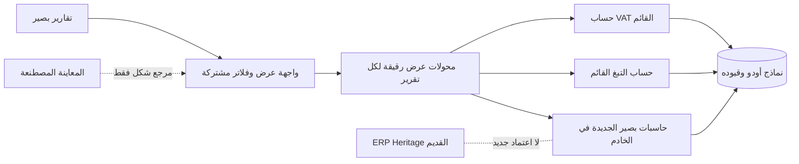

# حزمة تقارير بصير المستقلة — عقد بناء وسجل حي

المعرف: `BASEER-REPORT-SUITE-20261007`
أساس المصدر: `9ca026f611354b23adc660bd4a67e3fe8c40d1f9`
الفرع: `codex/baseer-report-suite-build`
التصنيف: `ARCHITECTURAL` — تقارير مالية ومصدر أرقام وواجهة مشتركة.
الحالة: **الحزمة المالية العشرية NO-GO للحاسبات الجديدة؛ شريحة A للواجهة فقط اجتازت G0–G3، دون إذن نشر QA/Live بعد.**

## G0 — عقد البناء والرحلات

- المستخدمون: مالك الشركة، المحاسب، ومراجع التقارير وفق مجموعات أودو وصلاحيات الشركة الفعلية.
- الهدف: حزمة صغيرة مترابطة من تقارير بصير الحقيقية، بواجهة Odoo عربية/إنجليزية موحدة، قابلة للتفصيل والتصدير، مستقلة عن ERP Heritage. ليست إعادة بناء كل تقارير الطرف الثالث.
- الحزمة المعتمدة من المالك: تقرير ضريبة القيمة المضافة السعودي، رسوم التبغ من POS، الربح والخسارة، دفتر الأستاذ العام، **العمليات الإجمالية الشاملة للضريبة، والمقبوضات والمدفوعات المسجلة كتقرير مستقل**، مديونيات العملاء، مديونيات الموردين، الميزانية العمومية، وميزان المراجعة. عددها **عشرة تقارير**. الفواتير في تقرير العمليات بتاريخ ترحيلها، و**كل بيع POS معتمد بتاريخ البيع المسجل** سواء حُصّل فورًا أو كان آجلًا؛ لا ينتظر فاتورة POS اللاحقة أو قيد جلسته أو دفعة تطبيق التوصيل. النقد/المقبوضات يُفصلان عن البيع، ولا يُقدّم هذا التقرير على أنه كشف رصيد البنك أو قائمة تدفقات نقدية نظامية. تظهر الميزانية ضمن القوائم المالية الأساسية، وميزان المراجعة ضمن أدوات المراجعة المحاسبية؛ لا تشمل الحزمة سائر تقارير ERP Heritage.
- **قرار المالك الأحدث (2026-10-07؛ يصحح شرط «المدفوع» السابق في تقرير العمليات):** يريد ظهور الفاتورة غير المرتبطة بـPOS في تقرير العمليات بإجماليها الشامل للضريبة عند **ترحيلها** ولو تأخر تحصيلها شهرًا؛ وظهور **أي بيع POS معتمد عند تسجيل البيع** ولو كان آجلًا، بما فيه مبيعات تطبيقات التوصيل مثل هنقرستيشن. لا تُنشئ المسودة أو عرض السعر عملية، ولا يجعل تسجيل تحصيل المنصة أو فاتورة POS لاحقة بيعًا ثانيًا. التحصيل يظهر في التقرير المستقل حسب حدث الدفع الحقيقي؛ لا يُجمع مبلغ العملية ومبلغ الدفع في إجمالي واحد.
- الضريبة والتبغ تقريران حقيقيان قائمـان؛ التغيير المقصود لهما توحيد العرض والتفاعل دون تبديل معادلاتهما أو مصدرهما ضمن الشريحة الأولى. الربح والخسارة والأستاذ في `baseer_report_ui_preview` بيانات مصطنعة وليسا تقارير تشغيلية. تقرير المقبوضات والمدفوعات وتقريرا المديونيات تحتاج جميعها حاسبات ومصادر مستقلة.
- رحلة أساسية: فتح التقرير من «تقارير بصير» ← اختيار الفترة/الشركة والمرشحات المناسبة من أدوات Odoo ← قراءة ملخص ثابت العرض ← فتح بند إلى قيوده أو عملياته المصرح بها ← الرجوع/تصدير PDF وXLSX من الفترة ذاتها. لا يغيّر التقرير أي مستند أو قيد.
- معيار قبول مالي: كل رقم يُحسب في الخادم ويُعاد ربطه بمصدره، ويُطابق اختبارًا مستقلًا على نسخة معزولة؛ لا يُستدل على صحة المال من نجاح الواجهة أو بيانات المعاينة. تُختبر المردودات، الإلغاء، السداد الجزئي، العملات، الفترات، عزل الشركات، والصلاحيات بحسب التقرير.
- معيار قبول الواجهة: نفس شريط الفترة والخيارات، بطاقة متوسطة متمركزة، صفوف قابلة للفتح باللمس ولوحة المفاتيح، أصفار هادئة، السالب/الخارج أحمر مع إشارة نصية، أرقام غربية، RTL/LTR، جوال وسطح مكتب، وحالات فراغ/تحميل/خطأ. لا تعتمد الوظائف على hover وحده.
- خارج النطاق الآن: حذف ERP Heritage، تغيير قيود أو فواتير أو ضرائب أو طلبات POS، تقديم إقرار رسمي، اعتبار المعاينة بيانات حقيقية، ترحيل بيانات أعمال، أو النشر إلى الإنتاج.

### خريطة الدورة والرقابة المحاسبية

| التقرير | الحدث/المستند والسلطة الحالية | رقابة مرحلة البناء |
| --- | --- | --- |
| ضريبة القيمة المضافة | `account.move.line` المرحّل ووسوم `l10n_sa.tax_report_vat_filing` واستحقاق Odoo؛ التقرير الحالي `baseer_tax_report` | الحفاظ على الصناديق الـ16 والاستثناءات غير الموسومة ونطاق الشركة والدفتر؛ لا اعتماد إقرار من الواجهة |
| رسوم التبغ | طلبات وسطور POS المكتملة في `baseer_pos_tobacco_report`؛ رسم السطر مشتق من pipeline POS الحالي وقد يختلف تاريخيًا مع تغيّر إعداد الضريبة | إبقاء تحذير فروق إعادة الحساب، المردودات وحدود الصفحات؛ مطابقة إجمالي العرض وPDF قبل/بعد |
| الربح والخسارة والأستاذ العام | قيود أودو المرحّلة؛ تعريف المجموعات والفترة والعملة والأرصدة الافتتاحية يُثبّت في G2 لكل تقرير | لا استعارة لنتائج أو handler من ERP Heritage؛ مطابقة الحسابات وميزان القيد والربط بالسطر |
| الميزانية العمومية وميزان المراجعة | أرصدة الحسابات من قيود أودو المرحلة بتاريخ قطع محدد؛ تصنيف الحسابات والسنة المالية والإقفال من إعدادات أودو | معادلة الأصول = الالتزامات + حقوق الملكية، وتوازن المدين/الدائن مع معالجة نتيجة السنة وفق عقد Odoo؛ تفصيل كل رصيد إلى مصدره |
| العمليات الإجمالية شاملة الضريبة | فاتورة عميل/مورد مرحلة بتاريخها المحاسبي، أو بيع POS أصلي **معتمد بتاريخ البيع المسجل سواء دُفع أو كان آجلًا**؛ القيد المباشر المصنف فقط عند ثبوت أنه حدث تجاري أصلي | مبلغ البيع/الشراء الشامل للضريبة مرة واحدة؛ تُستبعد الدفعة والتسوية وفاتورة POS اللاحقة وقيد الجلسة المكرر والتحويل الداخلي. يُختبر مصدر الملخص المعتمد وروابطه وفرق توقيته عن الأستاذ في G2 |
| المقبوضات والمدفوعات المسجلة | أحداث التحصيل والصرف الحقيقية فقط؛ POS النقد/البطاقة عند تأكيد الدفع وفق عقد القناة، بينما حساب العميل الآجل وتخصيص تطبيق التوصيل غير المحصّل ليسا قبضًا بمجرد تسجيل بيع POS | مصدر الحدث لكل قناة وحالته وتاريخه يُثبّت في G2؛ دفعة المنصة وتسوية البطاقة والتحويل الداخلي لا تضاعف القبض. هذا تقرير أحداث دفع، لا كشف رصيد بنك ولا قائمة تدفقات نقدية نظامية |
| مديونيات العملاء والموردين | الفواتير المعتمدة غير المسددة عند تاريخ القطع؛ الدفعات المقدمة/الأرصدة الدائنة في قسم مستقل، بلا خصم صامت من قيمة الفاتورة المفتوحة | فصل كل فاتورة عن المقدمات، ومعالجة الدفعات الجزئية والإشعارات الدائنة والعملات وتاريخ القطع دون ازدواج |

### تعديل عقد تقرير العمليات بعد قرار المالك — مرشح G0/G2

- مثال قبول: فاتورة عميل مرحّلة بقيمة `115` (أساس `100` وضريبة `15`) في سبتمبر، تُظهر «مبيعات شاملة الضريبة 115» ومديونية `115` في سبتمبر حتى لو وصل الدفع في أكتوبر؛ تحصيل أكتوبر `115` يُصفّر الذمة ولا يزيد مبيعات أكتوبر. يُظهر P&L الإيراد دون ضريبة وفق قيوده، ويظل تقرير VAT خاضعًا لوسومه واستحقاقه الفعلي؛ لا يُشتق الإقرار الضريبي من إجمالي هذا التقرير.
- مثال POS: بيع معتمد بمبلغ `115` مسجل ليوم 30 سبتمبر، ورُحّل قيد جلسته أو صدرت فاتورته يوم 1 أكتوبر، يُعرض **مرة واحدة في عمليات سبتمبر** وفق قرار المالك، سواء دُفع فورًا أو سُجل آجلًا. إذا كان آجلًا فلا مقبوضات في سبتمبر وتبقى المطالبة على العميل/المنصة حتى تحقق التحصيل؛ إذا دُفع فعليًا في سبتمبر يظهر `115` في تقرير المقبوضات المستقل دون إضافته مرة ثانية إلى المبيعات. تُعرض فجوة توقيت POS التشغيلي مقابل الأستاذ المرحّل للمراجعة ولا تُخفى.
- **تطبيقات التوصيل:** التسجيل في POS أو ملخص المبيعات المعتمد هو حدث البيع، لا تسوية حساب المنصة. مصدر بصير الحالي `baseer_pos_summary` ينشئ طلب POS واحدًا وقيد جلسة بتاريخ العمل مع `to_invoice=False` دون فاتورة عميل مستقلة؛ لذا لا يُفترض وجود فاتورة لكل ملخص، ولا يُحوّل تخصيص طريقة دفع «هنقرستيشن» إلى قبض نقدي. إن وُجدت فاتورة حقيقية مرتبطة بالبيع لاحقًا، تُعرض كمستند داعم لا كعملية ثانية. يلزم مطابقة هذا المسار مع إعدادات QA الفعلية قبل اعتماد G2.
- شراء مورد مرحّل بقيمة `115` يظهر ضمن المشتريات/العملية الإجمالية في تاريخ القيد، ودينه حتى السداد؛ دفعه لاحقًا لا يزيد مشتريات فترة الدفع. المصروف المباشر المرحّل بلا فاتورة يدخل مرة واحدة فقط إذا كان إيرادًا أو تكلفة/مصروفًا حقيقيًا بمصدر محاسبي قابل للتفصيل، ولا تعاد إضافته من كشف البنك أو سداد الفاتورة. التحويل الداخلي بين صندوق وبنك لا يصنع بيعًا أو مصروفًا.
- التصحيح/المردود يكون بمستند أو قيد عكس مرحّل ومربوط بالأصل، وبإشارته وتاريخه المحاسبيين. إذا كان شهر سبتمبر مقفلًا وصدر إشعار دائن `15` في أكتوبر: يبقى سبتمبر `115` ويظهر أكتوبر `−15`، ولا يُعاد كتابة سبتمبر بصمت. إذا سُمح قانونيًا وتشغيليًا بتأريخ التصحيح في سبتمبر غير المقفل، يظهر أثره في سبتمبر وفق القيد الفعلي. قواعد قفل VAT الحالية مستقلة ولا تُبدلها هذه الواجهة.
- **G2 لم تُعتمد:** قرار دخول POS المعتمد ولو آجلًا محسوم؛ يلزم إثبات تاريخ البيع المسجل وحالته في نسخة QA وعقد مصدر واحد لكل بيع/شراء POS أو فاتورة، ومنع تكرار فاتورة POS وقيود الجلسة والدفع، وتمييز تخصيص المنصة/`pay_later` عن قبض فعلي، وتصنيف القيد المباشر وفرق الصرف والإشعارات. تقرير المقبوضات مستقل بقرار المالك، لكن قواعد حدث الدفع فيه لا تُستنتج من تقرير العمليات. اختبار الحسابات والحقوق والشركات ونسخة QA الفعلية شرط قبل أي كود مالي. لا تنسخ خوارزمية ERP Heritage.

## G1 — ملف السعة والاستمرارية (مسودة افتراضات)

- القراءات أكثر من الكتابات؛ التقارير قراءة فقط ولا تنشئ حركة أعمال. حجم القيود وطلبات/دفعات POS الفعلي وتزامن المستخدمين غير مثبتين لهذه الحزمة بعد. افتراض تصميم أولي قابل للقياس: 10 قراء متزامنين، حتى 100,000 سطر مصدر في فترة كبيرة؛ **ليس شهادة أداء**.
- الواجهة لا تحمل القيود كلها: إجماليات خادمية وصفحات تفاصيل محدودة، مع حدود فترة ونتائج معلنة. احتفظ بسقف التبغ الحالي (100 صف معاينة/صفحة و5,000 سطر مصدر) ومسار تقسيم الفترة إلى أن يثبت قياس بديل.
- هدف أولي للقراءة التفاعلية 3 ثوانٍ لعينة QA المعزولة بعد تحديد حجمها؛ قياس 100,000 سطر والتزامن والاستعلامات والفهارس مطلوب قبل وعد السعة. PDF/XLSX الكبير يحتاج حدًا واضحًا أو تنفيذًا قابلاً للاستئناف بحسب القياس.
- الاستمرارية: لا migrations لبيانات الأعمال في شريحة الواجهة؛ الفروع وPR وفحوص CI، ثم QA بسياسة موديولات محددة وزوج DB/filestore للاسترجاع. لا إنتاج بلا طلب وقرار تسليم مستقل.

## G2 — الحدود والعقود (مسودة)

- المشترك هو عقد العرض: تعريف التقرير، فترة مطبقة، خيارات، صفوف/أقسام، قيم منسقة، إجراء فتح التفاصيل، وصفحات التصدير. **ليس** معادلة مالية عامة واحدة. لكل تقرير مالك حسابات واختبارات مستقلة؛ جميع التجميعات والتقريب والتحقق والصلاحيات في الخادم. لا `float` ثنائي كمصدر لمبالغ التقرير؛ التمثيل الدقيق والعقد النقدي يحتاجان تحديدًا في كل adapter.
- لا تعتمد التقارير الحية على `baseer_report_ui_preview` ولا تستورد `SAMPLE_REPORTS` أو `SAMPLE_ITEMS`. يستخرج هيكل عرض صغير مستقل عند إثبات قابليته لإعادة الاستخدام، مع إبقاء المعاينة معنونة كبيانات تجريبية أو إيقافها بعد قبول البدائل.
- لا يعتمد أي تقرير جديد على `eh_account_base` أو `eh_account_dynamic_reports`. `baseer_report_layout` و`baseer_arabic_ui` و`baseer_cash_categories` لا تزال مرتبطة بالطرف الثالث؛ لا تُزال قبل جرد المستهلكين وتكافؤ البدائل وتجربة الرجوع.
- الشركة والفترة والدفتر والمستخدم تُتحقق على الخادم؛ فتح التفاصيل يستخدم نطاقًا خادميًا لا معرف صف قادمًا من DOM وحده. الشركة المتعددة لا تُجمع بلا عقد عملة وسياسة مفوضة.
- G2 **غير مكتملة** للحاسبات الجديدة حتى تحديد: تاريخ القطع والرصيد الافتتاحي للربح والخسارة/الأستاذ/ميزان المراجعة والميزانية، خريطة أحداث الدفع الخادمية وحالات POS ومنع ازدواج التسجيل/التسوية، تعتيق الفواتير والمقدمات والعملات والتسويات، ومستوى المقارنة المرجعي لكل تقرير. قرارا توقيت POS وفصل المقدمات أدناه لا يعتمدان خوارزمية التقرير وحدهما.

### نتائج استكشاف G2 للنقد والذمم — مرشحة، لا عقد معتمد

- فرضية الاستكشاف السابقة بأن صافي التقرير يساوي تغير `asset_cash` **لم تُعتمد**: بطاقة POS المؤكدة تُحسب عند تسجيل الدفع ولو تأخرت تسوية البنك، لكن **تخصيص طريقة تطبيق توصيل آجل في طلب POS ليس إثبات تحصيل من المنصة**. تُعرض مطابقة البنك مستقلة ولا يوصف إجمالي التقرير بأنه رصيد سيولة مصرفية.
- **لتقرير المقبوضات والمدفوعات وحده:** تدخل دفعة POS النقدية أو البطاقة المحصلة مرة واحدة عند تأكيد حدث الدفع، لا عند قيد جلسة POS أو تسوية البطاقة لاحقًا. طلب POS الآجل أو تخصيص منصة توصيل غير محصّل يدخل تقرير **العمليات**، لا المقبوضات؛ تُسجّل المقبوضات عند حدث تحصيل المنصة الحقيقي المثبت، وبقدره عند الجزئي. الفاتورة غير المدفوعة لا تدخل المقبوضات، والمردود يدخل عند رد المال بإشارة خارجة. `pos.payment` وحده ليس دليلًا كافيًا لتحصيل المنصة لأن مسار الملخص يُنشئه أيضًا للتخصيص؛ يلزم رابط خادمي بين الحدث الأصلي والتسوية لمنع التكرار. حالات الطلب، `pay_later`، الباقي النقدي `is_change`، وتاريخ الدفع مقابل تأخر مزامنة POS تحتاج عقد G2 صريحًا.
- لا يُستخدم `baseer_cash_categories` أو `baseer_financial_register` كمحرك جديد: الأول يرث handler من ERP Heritage، والثاني لا يثبت عقد منع الازدواج المطلوب هنا. يمكن قراءة مسارات أودو الأصلية للمطابقة فقط دون اعتماد جديد على Heritage.
- مرشح مصدر الذمم التاريخية هو سطور `asset_receivable` و`liability_payable` المرحّلة والتسويات حتى تاريخ القطع، لا `amount_residual` الحالي وحده. الفاتورة التي سُددت بعد تاريخ القطع يجب أن تظهر مفتوحة في التقرير التاريخي. **قرار المالك:** تُعرض الفواتير المفتوحة والدفعات المقدمة/الأرصدة الدائنة في قسمين مستقلين؛ لا تصفّي المقدمات قيمة الفاتورة بصمت. تعتيق كل قسم والعملات والإشعارات الدائنة تحتاج اختبارًا وعقدًا نهائيًا في G2.
- عقود الاختبار المطلوبة: دفعة POS بطاقة `115` عند البيع ثم تسوية بنكية `115` لاحقًا تُنتج قبضًا واحدًا `115` في فترة الدفع، لا `230` ولا تأخيرًا إلى فترة البنك؛ **بيع POS آجل/منصة `115` يُنتج عمليات `115` و«مقبوضات صفر» حتى إثبات التحصيل، رغم وجود سطر تخصيص POS**. فاتورة `115` وسداد `40` **مطابق لها قبل تاريخ القطع وبالعملة نفسها ودون إشعار/شطب/فرق** تُنتج قبضًا `40` ودين فاتورة `75`. أما `40` غير المطابقة فتظل مقدمة مستقلة وتبقى الفاتورة `115` مفتوحة؛ ويُختبر تحويل منصة جزئي وعمولتها دون افتراض أن صافي التحويل يساوي إجمالي البيع. إشعار دائن وشطب، دفعة قبل الفاتورة وبعد تاريخ القطع، POS متعدد طرق الدفع وتأخر التسوية، تحويل داخلي عبر فترتين، رد مال، عدة شركات وعملات، وإشارة VAT والتقريب. لا يبدأ تنفيذ هذه الحاسبات قبل تثبيت جدول أحداث دفع وحيد لكل قناة، مفتاح منع تكرار واستبعاد التسوية اللاحقة، تاريخ/منطقة الحدث والتصحيح والعكس، ثم مراجعة العقود التقنية.

#### خريطة أحداث مرشحة من مصدر Odoo المحلي — تنتظر مطابقة محرك QA

| القناة | سجل الحدث المرشح الوحيد | ما لا يُحسب ثانية وما بقي غير محسوم |
| --- | --- | --- |
| POS نقد/بطاقة محصّلة | `pos.payment` مرشح بعد إثبات أن طريقة الدفع قبض حقيقي لا تخصيص منصة أو `pay_later`، مع مبلغ وتاريخ مثبتين؛ يُطرح `is_change` من المقبوض الصافي | تسوية جلسة POS و`account.payment`/كشف البنك وفاتورة POS لا تضاعف القبض؛ يجب إثبات روابطها على QA والتزامن المتأخر |
| منصة توصيل/حساب عميل آجل | **بيع POS عند اعتماده للعمليات فقط**؛ تخصيص `pos.payment` في ملخص بصير لا يُعامل قبضًا؛ تحصيل المنصة/العميل ينتظر تحديد سجله الأصلي المثبت على QA | فاتورة POS أو قيد جلسته لا ينشئان بيعًا جديدًا، وتسوية التحصيل الجزئي/العمولة/الباقي لا تُفترض من قيمة البيع الإجمالية |
| دفع فاتورة عميل/مورد غير POS | `account.payment` أصلي مرحّل غير ناتج عن POS، مع الشركة والعملة والتاريخ ورابط القيد | المطابقة اللاحقة لا تولد تدفقًا جديدًا؛ توقيت `in_process` مقابل تأكيد البنك قرار مالك معلق، ولا يُفترض من قرار POS |
| قبض/صرف في كشف بنك دون دفع أصلي | `account.bank.statement.line` مرحّل بشرط غياب دفع أصلي محسوب | إن وُجد `payment_ids` أو مطابقة لاحقة لا يُجمع الاثنان؛ إثبات الهوية/الربط على QA لازم |
| قيد نقدي مباشر أو تحويل داخلي | لا يدخل تلقائيًا؛ يحتاج إثبات حدث خارجي وتمييز طرفي التحويل | قاعدة إدخاله قرار مالك معلق؛ التحويل بين حسابات الشركة لا يضاعف الداخل/الخارج |

مفتاح منع التكرار المرشح `(company_id, source_model, source_id)` مع رابطة المصدر/العكس والحدث المحاسبي المقابل، لا مجرد استبعاد بالنص أو نوع الحساب. يبقى **مرشح تصميم** إلى أن تُقرأ نسخة Odoo المثبتة على QA وأنواع طرق الدفع وروابطها الفعلية؛ `odoo/` المحلي ليس إثباتًا لنسخة الخادم. يلزم فصل تاريخ البيع المسجل عن تاريخ مزامنة POS وترحيل الجلسة وتاريخ تحصيل المنصة وتسوية البنك، وإظهار جسر فروق توقيت POS مع الأستاذ وبيان إعادة عرض الفترة بعد التصحيح. في الذمم: رصيد الفاتورة عند القطع من التسويات المرحلة حتى القطع لا من `amount_residual` الحالي وحده، مع مقدمة/إشعار غير مطابق في قسم مستقل؛ **إثبات مطالبة منصة التوصيل وPOS الآجل وتعتيقها** ينتظر فحص QA، لا قرار شمول البيع في العمليات. لا G2 GO من هذا الجدول وحده.

### شريحة B المرشحة — الميزانية العمومية وميزان المراجعة الحقيقيان

- أساس كلا التقريرين `account.move.line` لقيود `account.move` **المرحّلة** في شركة واحدة وعملة الشركة؛ تاريخ القطع من التاريخ المحاسبي للقيود، لا تاريخ إنشاء السطر أو تاريخ الفاتورة. الفترة الشهرية/الربعية تضبط الحركة؛ الميزانية لقطة «حتى» نهاية الفترة، وميزان المراجعة يظهر افتتاحي الفترة وحركتها وختاميها. المسودات، حسابات خارج الميزانية، والشركات الأخرى لا تدخل افتراضيًا. لا تجميع عملات شركات متعددة في رقم واحد.
- ترتيب الميزانية من `account.account.account_type` الفعلي (الأصول، الالتزامات، حقوق الملكية) مع نتيجة السنة الجارية ديناميكيًا عند تاريخ القطع. يجب أن يتحقق: الأصول = الالتزامات + حقوق الملكية شاملًا نتيجة الفترة/السنوات السابقة، بالدقة النقدية للشركة. لا يُعوَّل على جمع كل قيود الإيراد/المصروف منذ بدء قاعدة البيانات مباشرة؛ سلوك إقفال السنة وحسابات تخصيص الربح في Odoo 19 يحتاج مطابقة مستقلة.
- ميزان المراجعة لكل حساب: افتتاحي مدين/دائن، حركة الفترة مدين/دائن، وختامي مدين/دائن؛ إجماليا الحركة متساويان. الحسابات الميزانية ترحّل افتتاحيها عبر السنة؛ حسابات الربح والخسارة تبدأ سنة مالية جديدة بصفر، مع سطر «نتيجة مرحلة من السنة السابقة» الديناميكي وفق Odoo 19 كي يبقى الميزان متزنًا. يفتح الحساب إلى قيوده الخادمية في الفترة نفسها بعد التحقق من الشركة والصلاحيات.
- قبول إلزامي قبل GO: اختبار قيد افتتاحي متزن، سنة مالية متقاطعة بلا قيد تخصيص ثم بعده، فواتير ومردودات وضريبة، حساب أرصدة صفرية، شركتان، مبلغ بعملة أجنبية مع رصيد عملة الشركة، مسودة مستبعدة، وقيد على آخر يوم. تقارن كل خانة بمجموع قيود مستقل وتثبت معادلة الميزانية وتوازن الميزان عند حدود التقريب. الحد/الترقيم والأداء لعدد حسابات وقيود QA الحقيقي يُقاسان قبل وعد السرعة.
- هذه **مسودة G2 فقط**؛ لا تبدأ حاسبة B قبل جرد شجرة حسابات الشركة الفعلية وإقفالها، تثبيت الصياغة الدقيقة لنتيجة السنة، اختبار إمكانية العزل والأداء، وموافقة حارس البوابات المستقل. وثائق Odoo 19 الرسمية مرجع تعريف لا بديل عن إثبات قاعدة المستخدم.

#### عقد حساب شريحة B المرشح للمطابقة على QA

- مفتاح كل رصيد `(company_id, account_id)`؛ المصدر `account.move.line` المرحّل بتاريخ `date` المحاسبي وبقيم `debit/credit/balance` بعملة الشركة. `amount_currency` تفصيل لا يُجمع مع `balance`. القيد الافتتاحي الحقيقي يدخل مرة من أسطره؛ لا افتتاحي اصطناعي مضاف إليه. تُستبعد `off_balance` من القوائم الأساسية. نطاق شركة واحدة ودفاتر محددة بصراحة في الطلب، ولا `sudo` يتجاوز قواعد الوصول.
- بداية السنة من `company.compute_fiscalyear_dates(cutoff)` في محرك Odoo المثبت بعد التحقق من إعدادات الشركة/أي سنة مخصصة. أنواع `asset*` و`liability*` و`equity*` ذات افتتاحي مستمر حسب قاعدة النوع، بينما `income*` و`expense*` و`equity_unaffected` لا تُرحَّل افتتاحيًا بالطريقة نفسها؛ يجب إثبات الحالة الفعلية قبل/بعد تخصيص الربح. الفترة العابرة للسنة لا تُعرض كميزان سنوي واحد صامت؛ تُقسّم أو تُرفض برسالة واضحة بعد اختبار/قرار G2.
- ميزان المراجعة: افتتاحي صافي لكل حساب، حركة مدين ودائن كما في القيود (بما فيها storno إن وجد)، وختامي صافي = الافتتاحي + المدين − الدائن؛ عرض الافتتاحي/الختامي في جهة واحدة لا يغيّر إشارة القيمة الأصلية. سطر «نتيجة مرحلة من السنة السابقة» عند الحاجة **ديناميكي للعرض والتوازن**، ليس حسابًا أو قيدًا ينشئه التقرير؛ يجب مطابقته قبل وبعد قيد تخصيص الأرباح الحقيقي.
- الميزانية لقطة حتى القطع مصنفة بنوع الحساب الفعلي، مع فصل الحقوق الحقيقية عن نتيجة السنة والنتائج السابقة غير المخصصة. `balance = debit - credit`: الأصل المدين موجب، والالتزام/الحق الدائن سالب في المصدر؛ **قيمة عرض** الالتزامات والحقوق تقلب إشارتهما مرة واحدة فقط. يثبت اختبار مستقل أن مجموع أرصدة القيود المرحلة في نطاق التقرير يساوي صفرًا، ثم أن الأصول المعروضة = الالتزامات المعروضة + الحقوق المعروضة + النتيجة الديناميكية، ضمن دقة عملة الشركة؛ لا يُعد السطر الديناميكي قيدًا أو حسابًا حقيقيًا. بعد قيد التخصيص لا تُساوى نتيجة الميزانية بصافي P&L مباشرة دون جسر أثر `equity_unaffected`؛ صافي ربح الفترة يستبعد حساب التخصيص. تُثبت صيغة الجسر وشكل السطر من قيود QA لا من تقرير Heritage.
- مجموعة القبول الذهبية: شركتان بسنتين ماليتين مختلفتين، قيد افتتاحي، سنتان قبل/بعد تخصيص الربح، فاتورة ومردود وضريبة، قيد آخر يوم، مسودة مستبعدة، رصيد صفري، عملة أجنبية، وstorno إن وجد. لكل حساب تُطابق الخانات بمجموع AML مستقل؛ إجماليات افتتاحي/حركة/ختامي الميزان متوازنة، وحركة الأستاذ = حركة الميزان بنفس الشركة/الدفتر/الفترة، وختامي حسابات الميزانية = لقطة الميزانية؛ أي فرق معلل لا يُخفى. شجرة الحسابات وسنوات QA المثبتة لم تُفحص بعد، فلا يبدأ كود الحاسبتين قبل قرار الحارس.

#### ملف G1 ومسار G3 لشريحة B — للمراجعة، لا تصريح كود

- افتراض G1 المعلن بدل ادعاء قياس QA: التقرير قراءة فقط لشركة واحدة وعملتها في الطلب، و10 قارئين متزامنين، و100,000 سطر قيد مصدر لفترة كبيرة و5,000 حساب كحد تصميم أولي. للتخطيط فقط يُفترض نمو حتى 100,000 سطر قيد جديد/شركة/شهر وقراءة تقرير واحدة/مستخدم/30 ثانية في الذروة (نحو 0.34 طلب/ثانية عند 10 مستخدمين)؛ أحجام QA ومعدلها الحقيقيان غير مقاسين. لا تُحمّل التفاصيل كلها إلى المتصفح؛ إجماليات الخادم وقائمة حسابات محدودة وتفاصيل قيود بصفحات لا تتجاوز 100 سطر، مع نطاق تاريخ ومؤشر «المزيد». 3 ثوانٍ هدف مبدئي للتفاعل لا شهادة أداء؛ يُقاس على نسخة معزولة مع حجم/تزامن/خطة استعلام قبل G6.
- لا تنشئ هذه الشريحة بيانات مالية أو cache دائمًا أو تغيّر سجلات أودو: احتفاظ القيود كما في قاعدة أودو القائمة بلا حذف جديد، ومسؤول التشغيل هو مالك تشغيل قاعدة أودو الحالية. لا حالة تقرير منفصلة تستعاد؛ RPO/RTO لبيانات الأصل هما RPO/RTO منصة أودو نفسها، وللكود مسار الرجوع عبر الإصدار السابق. **افتراض تخطيط لا ضمان تشغيلي:** نسخة DB/filestore متسقة يوميًا (RPO مستهدف ≤24 ساعة) واستعادة خدمة خلال يوم عمل (RTO مستهدف ≤8 ساعات)؛ يجب على التشغيل إثبات السياسة والقدرة الفعلية قبل أي QA/Live. لا تُستنتج من نجاح النسخة المحلية أو تُقدَّم كوعد إنتاج.
- G3 المرشح: Odoo 19 Community `account` و`baseer_reports_menu` فقط، Python/Odoo ORM وQWeb/Owl/SCSS الموجودة؛ لا اعتماد على ERP Heritage أو أصول Enterprise ولا مكتبة جديدة. المسار المباشر هو وحدة مالية مستقلة ذات حاسبتين متمايزتين وقالب عرض مشترك؛ لا محرك حساب عام ولا تكرار بيانات القيود. قبل تثبيت أسماء الملفات وأوامر أول شريحة، يُقفل عقد G2 ويختار مالك الحسابات والخادم مسار الاستعلام الآمن للصلاحيات والفترة، ثم يراجعه حارس G3.

## G3 — التقنية والمسار المباشر (مسودة)

- الإبقاء على Odoo 19 Community وOwl/QWeb وBootstrap الموجودة؛ لا مكتبة UI جديدة ولا محرك ERP Heritage. أدوات بحث/فلاتر أودو الأصلية حيث يمكن، مع شريط خيارات متخصص للفترة والتقرير لا يكرر نموذج المعالج القديم.
- أقصر شريحة أولى: استخراج هيكل العرض المستقل، ثم تطبيقه على تقرير التبغ القائم مع ثبات `_build_report` وPDF A4 والاسم والصلاحيات؛ يليها VAT بعد اختبار الصناديق والحفر. لا تُبدّل خوارزميتا التقريرين في تعديل الشكل.
- الحاسبات الجديدة تُضاف تقريرًا واحدًا في كل شريحة رأسية (بيانات، اختبارات أرقام وصلاحيات، واجهة، تفصيل، PDF/XLSX)، ثم مقارنة تاريخية على QA مع المصدر المستقل/القيود. لا نسخ لأصول Odoo Enterprise أو شيفرتها؛ الصور مرجع واجهة فقط.
- الفحوص المرشحة: اختبارات Odoo المعزولة لكل تقرير، XML/JS/assets، تطابق totals والتفاصيل والتصدير، AR/EN وRTL/LTR والجوال، وقياس فترة كبيرة. أوامر الفحص الدقيقة تثبت عند تحديد ملفات الشريحة.

## سجل البوابات

| البوابة | الحالة | المالك | المراجع المستقل | ما ينقص |
| --- | --- | --- | --- | --- |
| G0 العقد والرقابة | قيد المراجعة | قائد البناء وخبير ERP | حارس البوابات | مراجعة مستقلة للحزمة العشرية والرقابة |
| G1 السعة والنمو | مسودة | مهندس السعة | كبير المعماريين | حجم QA الفعلي وحدود القياس ومراجعة مستقلة |
| G2 مصدر الأرقام والعقود | مسودة | كبير المعماريين وخبير ERP | مهندس السعة/حارس البوابات | عقود الحاسبات الجديدة، خاصة النقد والذمم، ومراجعة مستقلة |
| G3 الرصة والمكتبات | مسودة | أمين المكتبات | كبير المعماريين وخبير الواجهة | مراجعة مستقلة ومسارات/أوامر أول شريحة |
| G4–G8 | غير مبدوءة | أصحاب الشرائح | حسب البوابة | لا يبدأ الكود قبل اعتماد G0–G3 |

### قرار حارس البوابات الأول للحزمة الكاملة

المراجعة المستقلة الأولى لـG0–G3 على نطاق **تسعة تقارير آنذاك**: **NO-GO للحاسبات المالية الجديدة**. بعد إضافة تقرير العمليات صار النطاق عشرة، ويحتاج حكمًا مستقلًا جديدًا؛ لا تُنسب مراجعة التسعة إلى العشرة. بقيت موانع G0 لدورة المستند/الصلاحيات/القبول التفصيلية، وG1 للحجم والنمو وRPO/RTO، وG2 لعقود تاريخ القطع والنقد والذمم والتوازن والعملات ومنع تكرار الأحداث، وG3 ينتظر العقود وأوامر الشريحة الدقيقة. لا يعني ذلك رفض الواجهة؛ يمكن عقد شريحة عرض ضيقة مستقلة لا تغير الحسابات.

**مراجعة مستقلة لاحقة لنطاق العشرة (2026-10-07):** فصل العمليات عن المقبوضات قرار مالك واضح (`G0 GO` لهذا القرار المحدد فقط)، لكن بوابات **G0–G3 لتقرير العمليات الكامل NO-GO**. ينقص G0 حصر أنواع المصادر والاستثناءات وصلاحياتها، وينقص G1 حجم المصدر الإضافي والسعة والاستعادة، وينقص G2 أسبقية طلب POS/فاتورته/قيد جلسته والقيد التجاري المباشر والعكس ومطابقة التفاصيل، وينقص G3 مسار التطبيق والفحوص الدقيقة بعد عقد المصدر. شريحة بناء مرشحة، وليست مصرحًا بكودها بعد: فواتير العملاء المرحلة وإشعاراتها الدائنة فقط، ثم POS في شريحة لاحقة بعد اختبار QA. **القرار الأحدث** حسم دخول كل بيع POS معتمد بتاريخ البيع المسجل ولو كان آجلًا، ولا يرفع ذلك بقية موانع G2. في الملخص المعتمد يُختبر يوم الأعمال الموثق مقابل وقت الاعتماد الفعلي، ويُعرض فرق توقيت المصدر عن الأستاذ بدل إخفائه.

### لجنة بناء ومراجعة تقارير بصير

بناءً على طلب المالك، تعمل اللجنة مع قائد البناء على **التقارير العشرة المتفق عليها فقط**. أعضاؤها أدوار مراجعة متخصصة، وليست إقرارًا بأن وكلاء المراجعة محاسبون بشريون مرخصون أو بديلًا عن اعتماد مهني بشري عند الإقرار الضريبي أو اعتماد القوائم الرسمية.

| الدور | مسؤولية الدليل والمراجعة | حد الاستقلال والقرار |
| --- | --- | --- |
| قائد فريق ألفا للبناء | يثبت نطاق كل شريحة، مالك مصدر الرقم، الطريق المباشر، سجل العمليات والبوابات قبل التنفيذ؛ ينسق التنفيذ بعد GO للشريحة | لا يعتمد حسابًا بناه بنفسه؛ لا يتجاوز G0–G3 أو يوسّع النطاق بلا قرار المالك |
| مراجع محاسبة النقد ونقاط البيع والذمم | يراجع حدث الدفع الفعلي، ضريبة المبلغ الشامل، منع ازدواج POS/البنك، المردود والباقي النقدي؛ ويفصل الفواتير المفتوحة عن المقدمات بتاريخ قطع تاريخي | يطلب جدول الأحداث ومفتاح منع التكرار وأمثلة رقمية مستقلة؛ يوصي GO/NO-GO فنيًا، وقرار البوابة النهائي للحارس |
| مراجع محاسبة القوائم والضرائب | يراجع تصنيف الحسابات والإقفال ونتيجة السنة، توازن الميزانية والميزان، مطابقة الأستاذ والربح والخسارة؛ وثبات صناديق VAT ورسوم التبغ ومصادرها | يطلب مطابقة كل مجموع بخطوط القيود/الطلبات وعينات مردود وعملات وشركات؛ لا يفترض صحة ضريبية من نجاح الواجهة |
| مهندس التقارير والسعة | يصمم واجهة عرض موحدة وحاسبات خلفية منفصلة، حدود الترقيم والصلاحيات والتصدير، ويقيس الأداء على حجم موصوف | لا يغير مصدر الحقيقة المحاسبي ولا يقدّم افتراض السعة كشهادة قياس؛ يراجع معماري مستقل G1 وحارس الجودة G6 |
| حارس بوابات ألفا المستقل | يراجع أدلة G0–G3 لكل شريحة وقرار الاختبارات G4–G7، ويسجل GO/NO-GO والموانع | لا يعتمد دليلًا أنشأه؛ رفضه يمنع كود الحاسبة أو توسع الشريحة |
| فريق ألفا للتسليم المستقل | يراجع مرشح الإصدار ودليل المصدر والفحوص وQA والرجوع قبل قرار النشر | ليس هو منفذ الشريحة؛ لا يساوي نجاح CI باكتمال القبول المالي أو صلاحية الإنتاج |

آلية العمل: تُفتح شريحة بتعريف الرقم ومصدره وحالاته السلبية ومعيار مطابقته؛ يراجعها المحاسب المختص والحارس قبل كود مالي. بعد التنفيذ يُفحص فرق الكود والقيود/المستندات والعزل والتفصيل وPDF/XLSX على نسخة معزولة، ويُسجَّل كل اعتراض وقرار ومالكه هنا. يُعاد فتح G2 إن تغيّر حدث مالي أو تاريخ قطع أو قاعدة تصنيف، وG4 عند تغيير الواجهة. الخلاف في سياسة محاسبية أو ضريبية يعود للمالك ومحاسبه البشري المعتمد، ولا يحسمه اجتهاد الوكلاء. الشريحة A الخاصة بالشكل لا تمنح GO لأي حاسبة جديدة؛ يبقى حكم الحزمة الكامل NO-GO إلى إغلاق أدلتها.

## شريحة A — توحيد عرض التبغ القائم، دون تغيير الحساب (عقد للمراجعة)

| بوابة | العقد والدليل المطلوب | الحالة |
| --- | --- | --- |
| G0 | تقرير التبغ الحقيقي وحده؛ المستخدم المحاسب/مراجع POS المخول، الشهر والشركة والمنتج الاختياري كما هي. تحويل معاينة QWeb الحالية إلى بطاقة وسطية وجدول **مسطح** واضح من نمط بصير؛ لا تجميع أو حفر جديد في هذه الشريحة، ولا تغيير `_build_report` أو `_month_range` أو حد المصدر أو الإجراءات أو مجموعات الوصول. لا تُخفى استثناءات فروق إعادة الحساب. القبول: نفس ترتيب صفوف الصفحة (حتى 100) وعدد صفحاتها وإجماليات **كامل الفترة** قبل/بعد، وظهور عدد الاستثناءات ورسالة وجود المزيد منها في PDF؛ PDF A4 واسمه وشعاره وقيمه تبقى كما هي؛ AR/EN، الجوال، لوحة المفاتيح، الصفر الباهت والسالب/الخارج الأحمر. | معتمدة لشريحة A فقط |
| G1 | نفس حد 100 صف معاينة/صفحة و5,000 سطر مصدر ومسار تقسيم الفترة، بلا طلب بيانات جديد أو جدول كامل في المتصفح. افتراض 10 قارئين لا يُقدّم كشهادة تزامن. تقاس معاينة سبتمبر QA الحالية ومعاينة 101 صف/صفحتين على نسخة معزولة: هدف ≤3 ثوانٍ لكل فتح/تبديل صفحة في العينة الموصوفة، مع تسجيل حجم المصدر والبيئة والاستعلامات؛ 375px و1280px بلا تمرير أفقي للصفحة. لا وعد بأداء سقف 5,000 قبل قياسه. | معتمدة لشريحة A فقط |
| G2 | المسار المثبت: `_compute_preview` في `models/tobacco_report_wizard.py` يستدعي `_build_report` ثم يقتطع `rows[start:start+100]` ويُرندر `preview_pos_tobacco_fees` إلى `preview_html`؛ إجماليات الفترة لا تُقتطع، والاستثناءات المعروضة أول 100 مع تنبيه الباقي في PDF. PDF قالب منفصل لا يُعدل. التغيير محصور في DOM لقالب المعاينة وCSS معزول تحت جذر بصير؛ تبقى أرقام الصفوف وترتيبها والصفحات والاستثناءات وصلاحيات الشركة والفلاتر والأفعال في معالج أودو كما هي. لا ORM/RPC أو حقول مالية جديدة ولا اعتماد على المعاينة المصطنعة أو Heritage. | معتمدة لشريحة A فقط |
| G3 | رصة Odoo 19 وQWeb/Bootstrap/SCSS المضمنة، بلا حزمة جديدة. ملفات الملكية: `baseer_reports_menu/static/src/report_shell.scss` للألوان/الهيكل المشترك تحت `.o_baseer_report`، وتسجيله في `baseer_reports_menu/__manifest__.py` ضمن `web.assets_backend`؛ `baseer_pos_tobacco_report/report/tobacco_report.xml` لقالب المعاينة فقط، ورفع نسخة manifest التبغ. `baseer_reports_menu` اعتماد قائم للتبغ والضريبة، فلا اعتماد جديد على التجربة. فحوص: XML parse للقالب، `git diff --check`، تجميع SCSS من أصول Odoo المثبتة على نسخة معزولة، `--test-tags /baseer_pos_tobacco_report` بعد ترقية الموديولين على قاعدة اختبار، مقارنة قيم `_build_report` والصفحة الأولى/الثانية والتحذير وPDF قبل/بعد، ثم قبول بصري QA عند النشر المحمي. | معتمدة لشريحة A فقط |

هذه الشريحة تؤسس الشكل المشترك ولا تدّعي اكتمال محرك الفلاتر/الحفر أو الحاسبات العشر. بعد قبولها يُعاد G2/G4 عند ترقية VAT أو إضافة تقرير جديد؛ لا تُستنتج موافقة مالية من موافقة الشكل.

## دفتر العمليات الحي

| رقم | تاريخ الرياض | المرحلة | النية/العمل | النتيجة والدليل | الأثر/التراجع |
| --- | --- | --- | --- | --- | --- |
| 1 | 2026-10-07 | G0 | قراءة `INDEX.md` وقرار استقلال تقارير بصير، عقد المعاينة، وعقود VAT/التبغ؛ جرد مستقل للموديولات والتبعيات؛ سؤال المالك عن نطاق الحزمة والمديونيات | أكد المالك إضافة مديونيات العملاء والموردين؛ الميزانية وميزان المراجعة ينتظران الجواب؛ الفرق بين التقرير الحقيقي والعينة مثبت في المصدر | قراءات فقط؛ لا تطبيق أو بيانات تغيرت |
| 2 | 2026-10-07 | G0–G3 | إنشاء فرع مستقل من `9ca026f6` وصياغة عقد الحزمة والبوابات قبل أي كود | هذا المستند مسودة قابلة للمراجعة، لا موافقة تنفيذ | توثيق فرع فقط؛ يمكن تصحيحه قبل PR؛ لا نشر |
| 3 | 2026-10-07 | G0 | توضيح الفرق بين الميزانية العمومية وميزان المراجعة وفق وثائق Odoo 19، ثم سؤال المالك عن إضافتهما | أجاب المالك «أضفها»؛ أصبحت الحزمة تسعة تقارير، والميزانية أساسية وميزان المراجعة تحت «مراجعة» | تعديل عقد النطاق فقط؛ لا كود أو بيانات أو نشر |
| 4 | 2026-10-07 | G0–G3 | مراجعة بوابات مستقلة للحزمة التساعية | NO-GO للحاسبات الجديدة بسبب عقود القطع والنقد/الذمم والسعة والقبول غير المكتملة؛ سُجلت شريحة عرض التبغ A للنظر مستقلًا | توثيق فقط؛ الكود ممنوع حتى اعتماد بوابات الشريحة |
| 5 | 2026-10-07 | G2 | جرد قرائي لمسارات POS والتسوية والذمم في أودو/بصير | رُشح مصدر السيولة المرحّل والذمم التاريخية، وثبت خطر ازدواج POS والبنك واعتماد محرك النقد القديم على Heritage؛ سُئل المالك عن توقيت البطاقة وتعريف المديونية | توثيق فقط؛ لا اعتماد معادلات أو تغيير بيانات |
| 6 | 2026-10-07 | G0–G3 شريحة A | مراجعة مستقلة أولى لعقد عرض التبغ ثم تصحيح النطاق والأدلة | حُذف وعد الجدول الهرمي/الحفر، وثُبتت صفحة 100 وإجماليات الفترة والاستثناءات، هدف قياس 3 ثوانٍ، مسار `_compute_preview`، الملفات والفحوص؛ إعادة مراجعة لازمة | توثيق فقط؛ لا كود |
| 7 | 2026-10-07 | G0–G3 شريحة A | إعادة مراجعة مستقلة بعد التصحيح، بالتتابع قبل كود التطبيق | قرار الحارس: G0 GO، G1 GO، G2 GO، G3 GO لواجهة التبغ وحدها؛ NO-GO الحزمة المالية باقٍ. تنبيه G5: لون السالب/المدين، الصفر، 375px، PDF والصفحة الثانية | أجيز كود واجهة الشريحة A فقط؛ لا نشر ولا تعديل حسابات |
| 8 | 2026-10-07 | G4–G5 شريحة A | إضافة CSS بصير المعزول وقالب معاينة التبغ واختبارات لون الصفر/العكس، صفحة 101 سطر، و101 استثناء؛ رفع نسختي الموديولين | XML وعبارات QWeb وmanifest وPython syntax و`git diff --check` نجحت محليًا؛ لم يتغير `_build_report` أو `_compute_preview` أو قالب PDF. مراجعة كود مستقلة: لا P1، G5 مشروط باختبار Odoo وتجميع الأصول والعرض | تغييرات مصدر الفرع فقط؛ لم تُرقَّ قاعدة QA/Live؛ التراجع بإلغاء diff الشريحة |
| 9 | 2026-10-07 | G5 شريحة A | تحسين اختبار شارة العدد المباشر وحد جدول سطح المكتب الداخلي استجابة للمراجعة | XPath يطلب `101` داخل شارة الاستثناءات تحديدًا؛ `min-width:720px` مع تمرير داخل الجدول عند ضيق حاوية النموذج. فحص 375px/1280px والأصول الفعلية ينتظر بيئة أودو | لا تغيير على البيانات أو حسابات التقرير |
| 10 | 2026-10-07 | G2 شريحة B | تحديد عقد مبدئي للميزانية وميزان المراجعة بعد موافقة المالك على إضافتهما | فصل لقطة الميزانية عن افتتاحي/حركة/ختامي الميزان، وسطر نتيجة السنة الديناميكي والتوازن وعزل الشركة؛ مرجع سلوك السنة [وثائق Odoo 19](https://www.odoo.com/documentation/19.0/applications/finance/accounting/reporting/year_end.html). يحتاج جرد حسابات واختبار/مراجعة قبل GO | توثيق فقط؛ لا حاسبة أو قائمة حية تُنشأ |
| 11 | 2026-10-07 | G5 مرشح مصدر مبكر | حفظ الشريحة A والعقد على `0825242b` وفتح [PR 212](https://github.com/hajrix01-star/abroj-baseer-production/pull/212) مسودة | فحص Source integrity نجح؛ مراجعة الكود المستقلة لا ترى P1، لكن اختبار Odoo وتجميع SCSS والعرض 375/1280 لم تُنفذ. لا تعتبر المسودة إصدارًا أو موافقة دمج | لا دمج ولا نشر QA/Live؛ تبقى الحاسبات الجديدة NO-GO |
| 12 | 2026-10-07 | G5 اختبار معزول | تثبيت التبغ في قاعدة Docker محلية جديدة بصورة Odoo `19.0-20260817` وPostgreSQL 16 | كشف التثبيت فشلًا موروثًا من `main`: سجل PDF ثانٍ يفرض `ar_001` قبل تثبيت اللغة، فينتج `Invalid language code: ar_001`. أزيل السجل المكرر؛ التعبير العربي نفسه باقٍ في السجل الأول. كشفت البيئة الجديدة أيضًا افتراض اختبارات سابقًا لعملة SAR ولغة عربية مثبتة وإعداد مستند مكتمل | إصلاح تعريف التقرير واختباراته على الفرع فقط؛ لا بيانات QA/Live تغيرت |
| 13 | 2026-10-07 | G5 تحقق مرشح محلي | إعادة تثبيت الموديول على قاعدة نظيفة ذات filestore مشترك؛ تشغيل اختبار أودو وتجميع الأصول وفحص Chrome محليًا | اكتُشف **21 اختبارًا: 17 منفذًا، 4 متجاوزة** لغياب fixture POS الحقيقي وشركة ثانية؛ 0 فشل/خطأ، خروج 0. تجميع `web.assets_backend` فعليًا LTR/RTL شمل `.o_baseer_report` (1,024,769/1,025,137 بايت). عند 1280px بطاقة 1040px متمركزة؛ وعند 375px بطاقة 343px ولا تمرير أفقي للمستند؛ الصفر `rgb(183,192,200)`. PDF محلي فعلي 28,895 بايت وصفحة A4 واحدة `595×842 pt`. معاينة 101 صفًا اصطناعيًا: 0.073 و0.0021 ثانية للصفحتين، والصفحة الثانية تعرض السطر 101؛ القياس لا يشمل استعلام POS. بيانات POS حقيقية وQA/القبول النهائي ما زالت غير مفحوصة | قاعدة وحاويات محلية مؤقتة؛ لا دمج ولا نشر. حكم التسليم المستقل: NO-GO للنهائي/الإنتاج الآن |
| 14 | 2026-10-07 | G0/G2 قرار مالك | تثبيت جواب المالك حول توقيت POS وتعريف المديونية، وإعادة صياغة عقد النقد والذمم قبل أي حاسبة | قيد التوثيق والمراجعة؛ G2 لم تُعتمد بعد | عقد مصدر أرقام فقط؛ لا تغيير كود أو بيانات |
| 15 | 2026-10-07 | G0/G2 تحديث عقد | تعديل العقد بعد قول المالك «عند الدفع في نقطة البيع» و«افصل بينهم»؛ جرد قرائي لـ`baseer_financial_register` و`baseer_cash_categories` لتفادي إعادة استخدام محرك موروث | ثُبت احتساب بطاقة/تطبيق POS عند تسجيل دفعة طلب مكتمل، لا تسوية البنك، وفصل الفواتير المفتوحة عن المقدمات. رُفضت مساواة هذا التقرير تلقائيًا بتغير رصيد البنك، وثُبت اختبار منع احتساب `115` مرتين. G2 تبقى مسودة حتى تعريف الأحداث والتواريخ والتسويات والعملات ومراجعة مستقلة | توثيق في الفرع فقط؛ لا تغيير حسابات أو بيانات أو QA/Live |
| 16 | 2026-10-07 | G0/G2 مراجعة مستقلة | مراجعة خبير المحاسبة لعقد قرار المالك وحدود تطبيقه | G0 **GO للقرارين فقط**؛ G2 **NO-GO للحاسبة** حتى جدول أحداث canonical و`is_change`/`pay_later` وتأخر POS والتسوية والعكس والعملات. صُحح مثال `115/40/75`: لا ينخفض دين الفاتورة إلا بتسوية الـ40 معها قبل القطع؛ غير المطابقة مقدمة مستقلة. أدلة المسار: `point_of_sale` في Odoo 19 و`baseer_pos_summary` وتصحيح POS | تصحيح عقد فقط؛ لا موافقة لبناء خوارزمية أو نشر |
| 17 | 2026-10-07 | G0 حوكمة | طلب المالك لجنة بناء تقارير ومحاسبين مختصين وفريق ألفا؛ تحديد أدوار مستقلة وحدود اعتمادها قبل التوسع في الحاسبات | أُنشئ ميثاق اللجنة أعلاه، وكُلّف مراجع النقد/الذمم ومراجع القوائم/الضريبة بتقييمين منفصلين؛ قرار الحارس ينتظر نتائجهما | توثيق ومراجعة فقط على الفرع؛ لا كود مالي أو بيانات أو نشر؛ يُصحح الميثاق بمدخل لاحق عند الحاجة |
| 18 | 2026-10-07 | G0/G2 مراجعة اللجنة | مراجعة مراجع النقد والذمم للقرارين الماليين، ومراجعة حارس ألفا لاستقلال الميثاق والبوابات | المراجع أوصى **NO-GO** للكود حتى تثبيت حدث الدفع ومنع تكرار POS/البنك، `pay_later` و`is_change` والتاريخ/التصحيح والعملات والتسوية التاريخية؛ أمثلة 115/40 مثبتة بشروطها. الحارس طلب أن تكون توصية المحاسب فنية لا قرار بوابة، وأن يراجع السعة معماري مستقل/حارس جودة؛ صُحح الميثاق. حكم الحارس للحزمة: G0–G3 **NO-GO**، وشريحة A وحدها GO سابقًا | لا كود مالي أو بيانات أو QA/Live تغيرت؛ مراجعة القوائم والضرائب المستقلة تنتظر الإغلاق |
| 19 | 2026-10-07 | G2 مراجعة محاسبة القوائم والضرائب | فحص مستقل لعقود الميزانية والميزان والأستاذ والربح والخسارة وثبات VAT/التبغ دون إنشاء اعتماد جديد على Heritage | التوصية **NO-GO للحاسبات الجديدة** إلى أن تُثبت سنة أودو الفعلية/الإقفال ونتيجة السنة ومطابقة TB↔GL↔BS↔P&L على شركة وتاريخ ودفتر وعملة واحدة؛ يلزم جرد حسابات شركتين، قيود قبل/بعد الإقفال ومردود وعملة ومسودة، وجسر استثناءات VAT/أساس الاستحقاق، وعينات بيع/رد التبغ وانحراف إعادة حسابه. **لا تغيير** لخوارزميتي VAT/التبغ من قبول واجهة التبغ A | مراجعة مصدر وعقد فقط؛ لا كود أو بيانات أو QA/Live تغيرت؛ قرار البوابات للحزمة يبقى بيد الحارس وNO-GO |
| 20 | 2026-10-07 | G0–G3 تنفيذ حكم اللجنة | تحويل موانع المراجعة إلى عقود وأدلة شريحة قابلة للفحص قبل أي حاسبة: خريطة أحداث النقد والذمم، وعقد الميزانية/ميزان المراجعة، وافتراضات السعة والمسار المباشر | قيد جرد مصدر أودو 19 ومراجعتين محاسبيتين مستقلتين؛ لا يُفترض GO من بدء العمل | قراءة وتوثيق على فرع PR 212 فقط؛ لا كود مالي أو قاعدة QA/Live أو نشر، والرجوع بتصحيح سجل لاحق لا محو التاريخ |
| 21 | 2026-10-07 | G0–G3 نتائج اللجنة | توثيق خريطة أحداث POS/الدفع/البنك ونطاق الذمم، وعقد ميزانية/ميزان مراجعة من مصدر أودو 19 المحلي، وافتراضات G1 وحدود G3؛ طرح أربعة أسئلة سياسة مالية على المالك | مراجع النقد والذمم: G2 **NO-GO** حتى جواب السياسات ومطابقة نسخة QA وروابط المصدر. مراجع القوائم: **NO-GO** حتى اختبار سنة/تخصيص وربط AML. الحارس المستقل: شريحة B ‏G0–G3 **NO-GO**؛ يلزم جرد شركتين وفترات وإشارات الأرصدة وافتتاحي/نتيجة مرحلة، وملف سعة/استعادة مثبت ثم أوامر شريحة محددة. شريحة A لم تتغير | توثيق فقط؛ لا حاسبة أو بيانات أو نشر. يصحح الحكم بمدخل لاحق بعد أدلة جديدة لا بمحو هذا القرار |
| 22 | 2026-10-07 | G2 فحص QA قرائي | اختيار موصل QA للقيود أو متصفح QA لفحص إعدادات السنة وشجرة الحسابات دون تعديلها | أدوات QA المقيدة تعرض ملخص قيود فقط ولا تكشف إعدادات السنة/الصلاحيات؛ تعذر تشغيل المتصفح المحلي بخطأ تهيئة sandbox قبل أي تفاعل مع QA. **لا ادعاء بفحص إعدادات QA**؛ يلزم مسار قراءة مصرح بديل أو مساعدة تشغيلية | لم تُرسل قراءة لقاعدة QA ولم يتغير تبويب المستخدم أو بياناته؛ يبقى حاجز G2 كما هو |
| 23 | 2026-10-07 | G0/G2 قرار مالك لاحق | طلب المالك تطبيق قاعدة ترحيل الفاتورة فورًا في تقرير العمليات شامل الضريبة، مع توضيح القيد المباشر والتصحيح؛ بدأ تعديل العقد وطلب حسم هل النقد يبقى تقريرًا مستقلًا | أُثبت مثال 115 في شهر الترحيل ولو دُفع الشهر التالي، وحُظر تكرار البيع عند الدفع؛ القيد المباشر المصنف مرة واحدة، والتصحيح بتاريخ قيده دون تعديل شهر مقفل بصمت. هذا يُعدّل قرار الأساس النقدي للتقرير المقصود ولا يُغيّر VAT أو P&L أو القيود الموجودة. مراجعة خبيرَي المحاسبة وحارس البوابات مطلوبة | توثيق على الفرع فقط؛ لا كود مالي أو بيانات أو QA/Live أو نشر؛ تقرير النقد مستقل أو مستبدل بانتظار جواب المالك |
| 24 | 2026-10-07 | G0/G2 حسم النطاق ومراجعة محاسبية | أجاب المالك صراحة «التقريران منفصلان: عمليات عند الترحيل، ونقد عند الدفع». صار النطاق عشرة؛ راجع مختص القوائم والضريبة فصل الحدثين ومثال فاتورة 115 في سبتمبر وتحصيلها في أكتوبر | العمليات +115 في سبتمبر فقط، والنقد +115 في أكتوبر فقط، والذمة تنتقل من 115 إلى صفر عند المطابقة؛ P&L يقرأ صافي الإيراد 100، وVAT يستقل بقاعدة استحقاقه. الحكم المحاسبي **G2 NO-GO للحاسبة** حتى إثبات أسبقية فاتورة POS على الطلب وقيد الجلسة، وتصنيف القيود المباشرة، واستبعاد التسويات والتحويلات والضريبة النقدية المكررة. مراجعة حارس البوابات للعشرة مطلوبة | عقد وسجل فقط؛ لا كود مالي أو بيانات أو QA/Live أو نشر |
| 25 | 2026-10-07 | G0–G3 مراجعة مستقلة للعشرة | راجع حارس البوابات فرق العقد والسجل بعد جواب المالك دون إعادة استخدام قرار التسعة | GO لقرار فصل التقريرين نفسه؛ **NO-GO لبوابات G0–G3 للحاسبة العاشرة** بسبب نطاق مصادر G0 وسعة G1 وأسبقية/تاريخ POS والقيد المباشر والمطابقة في G2 ومسار G3. أوصى بشريحة فواتير عملاء مرحلة وإشعارات دائنة أولًا، وسؤال المالك عن شهر POS المكتمل مقابل ترحيل الجلسة | لا كود أو بيانات أو QA/Live أو نشر؛ السؤال أُرسل للمالك دون تعطيل التوثيق |
| 26 | 2026-10-07 | G0/G2 قرار مالك POS | أجاب المالك بأن طلب POS المكتمل والمدفوع يوم 30 سبتمبر يظهر في **عمليات سبتمبر** ولو رُحلت الفاتورة أو قيد الجلسة يوم 1 أكتوبر | فصل تاريخ فاتورة أودو المحاسبي عن تاريخ إتمام POS؛ الطلب وفاتورته وقيد الجلسة حدث اقتصادي واحد لا ثلاثة. بقي إثبات حقل التاريخ/الحالة وروابط المصادر على QA ومنع تكرارها ومراجعة G2؛ لا يُفترض GO للكود | توثيق فقط على الفرع؛ لا كود مالي أو بيانات أو QA/Live أو نشر |
| 27 | 2026-10-07 | G0–G3 إعادة فحص قرار POS | أعاد حارس البوابات فحص العقد بعد جواب المالك | حُسم توقيت POS في G0 دون تغيير NO-GO لـG1/G2/G3 أو للحاسبة العاشرة. يلزم إثبات حالة وتاريخ الإتمام وروابط الطلب/الفاتورة/الجلسة على QA ومفتاح منع التكرار والمردود والقيد المباشر. اعتمد اسم العرض «العمليات الإجمالية شاملة الضريبة» مع شرح تاريخ الفواتير وPOS المختلف؛ لا تُجمع العمليات والنقد | لا كود أو بيانات أو نشر؛ قرار النطاق موثق فقط |
| 28 | 2026-10-07 | G0/G2 قرار مالك أحدث وفحص مصدر | أوضح المالك أن تطبيقات التوصيل مثل هنقرستيشن تدخل في البيع عند تسجيله لا تحصيل المنصة، ثم عمّم القاعدة على **كل POS المعتمد ولو آجلًا**. فُحص `baseer_pos_summary/models/summary.py` و`payment_seed.py` محليًا ووثائق POS الرسمية | مصدر ملخص بصير المعتمد طلب POS واحد `to_invoice=False` وقيد جلسة؛ لا يجوز افتراض فاتورة مستقلة. تاريخ `date_order` مشتق من يوم الأعمال، و`pos.payment` لتخصيص المنصة ليس بذاته إثبات قبضها. صُحح عقد العمليات ليشمل الآجل ومصدره الأصلي مرة واحدة، وعقد المقبوضات ليستبعد تخصيص المنصة غير المحصّل. مراجع المحاسبة وحارس البوابات: **GO لقرار G0 المحدد، G2 NO-GO للحاسبة** حتى مطابقة QA وروابط الطلب/الفاتورة/الجلسة/التحصيل والمرتجعات والذمم | تعديل عقد وسجل ومعمارية في الفرع فقط؛ لا كود مالي أو بيانات QA/Live أو نشر؛ تُراجع البوابات المتأثرة قبل التنفيذ |
| 29 | 2026-10-07 | G0 سؤال نطاق مباشر | عبارة المالك «تدخل الحسابات وقت التسجيل» قد تعني تقرير العمليات أو تغيير وقت إنشاء قيد اليومية لكل POS. توضح وثائق أودو أن إغلاق الجلسة يرحّل القيود؛ سُئل المالك عن المقصود | لا يُفسَّر قرار التقرير على أنه تفويض لتعديل ترحيل Odoo أو قيود POS. يبقى تغيير القيد الفوري خارج النطاق إلى جواب صريح وبوابات مستقلة؛ العقد الحالي يخص **عرض التقرير** فقط | سؤال غير حاجب لتوثيق قرار التقرير، لكنه حاجب لأي تغيير في آلية القيود؛ لا كود أو بيانات أو نشر |
