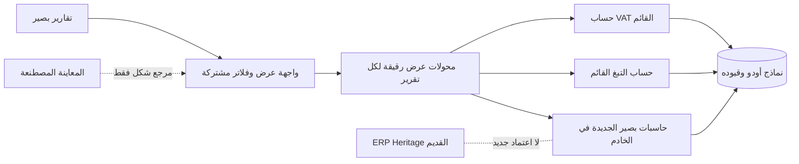

# حزمة تقارير بصير المستقلة — عقد بناء وسجل حي

المعرف: `BASEER-REPORT-SUITE-20261007`
أساس المصدر: `9ca026f611354b23adc660bd4a67e3fe8c40d1f9`
الفرع: `codex/baseer-report-suite-build`
التصنيف: `ARCHITECTURAL` — تقارير مالية ومصدر أرقام وواجهة مشتركة.
الحالة: **الحزمة المالية التساعية NO-GO للحاسبات الجديدة؛ شريحة A للواجهة فقط اجتازت G0–G3، دون إذن نشر QA/Live بعد.**

## G0 — عقد البناء والرحلات

- المستخدمون: مالك الشركة، المحاسب، ومراجع التقارير وفق مجموعات أودو وصلاحيات الشركة الفعلية.
- الهدف: حزمة صغيرة مترابطة من تقارير بصير الحقيقية، بواجهة Odoo عربية/إنجليزية موحدة، قابلة للتفصيل والتصدير، مستقلة عن ERP Heritage. ليست إعادة بناء كل تقارير الطرف الثالث.
- الحزمة المعتمدة من المالك: تقرير ضريبة القيمة المضافة السعودي، رسوم التبغ من POS، الربح والخسارة، دفتر الأستاذ العام، الداخل والخارج النقدي الفعلي شامل الضريبة، مديونيات العملاء، مديونيات الموردين، الميزانية العمومية، وميزان المراجعة. تظهر الميزانية ضمن القوائم المالية الأساسية، وميزان المراجعة ضمن أدوات المراجعة المحاسبية؛ لا تشمل الحزمة سائر تقارير ERP Heritage.
- الضريبة والتبغ تقريران حقيقيان قائمـان؛ التغيير المقصود لهما توحيد العرض والتفاعل دون تبديل معادلاتهما أو مصدرهما ضمن الشريحة الأولى. الربح والخسارة والأستاذ في `baseer_report_ui_preview` بيانات مصطنعة وليسا تقارير تشغيلية. التقرير النقدي والمديونيات تحتاج بناء بيانات وحسابات مستقلة.
- رحلة أساسية: فتح التقرير من «تقارير بصير» ← اختيار الفترة/الشركة والمرشحات المناسبة من أدوات Odoo ← قراءة ملخص ثابت العرض ← فتح بند إلى قيوده أو عملياته المصرح بها ← الرجوع/تصدير PDF وXLSX من الفترة ذاتها. لا يغيّر التقرير أي مستند أو قيد.
- معيار قبول مالي: كل رقم يُحسب في الخادم ويُعاد ربطه بمصدره، ويُطابق اختبارًا مستقلًا على نسخة معزولة؛ لا يُستدل على صحة المال من نجاح الواجهة أو بيانات المعاينة. تُختبر المردودات، الإلغاء، السداد الجزئي، العملات، الفترات، عزل الشركات، والصلاحيات بحسب التقرير.
- معيار قبول الواجهة: نفس شريط الفترة والخيارات، بطاقة متوسطة متمركزة، صفوف قابلة للفتح باللمس ولوحة المفاتيح، أصفار هادئة، السالب/الخارج أحمر مع إشارة نصية، أرقام غربية، RTL/LTR، جوال وسطح مكتب، وحالات فراغ/تحميل/خطأ. لا تعتمد الوظائف على hover وحده.
- خارج النطاق الآن: حذف ERP Heritage، تغيير قيود أو فواتير أو ضرائب أو طلبات POS، تقديم إقرار رسمي، اعتبار المعاينة بيانات حقيقية، ترحيل بيانات أعمال، أو النشر إلى الإنتاج.

### خريطة الدورة والرقابة المحاسبية

| التقرير | الحدث/المستند والسلطة الحالية | رقابة مرحلة البناء |
| --- | --- | --- |
| ضريبة القيمة المضافة | `account.move.line` المرحّل ووسوم `l10n_sa.tax_report_vat_filing` واستحقاق Odoo؛ التقرير الحالي `baseer_tax_report` | الحفاظ على الصناديق الـ16 والاستثناءات غير الموسومة ونطاق الشركة والدفتر؛ لا اعتماد إقرار من الواجهة |
| رسوم التبغ | طلبات وسطور POS المكتملة في `baseer_pos_tobacco_report`؛ رسم السطر مشتق من pipeline POS الحالي وقد يختلف تاريخيًا مع تغيّر إعداد الضريبة | إبقاء تحذير فروق إعادة الحساب، المردودات وحدود الصفحات؛ مطابقة إجمالي العرض وPDF قبل/بعد |
| الربح والخسارة والأستاذ العام | قيود أودو المرحّلة؛ تعريف المجموعات والفترة والعملة والأرصدة الافتتاحية يُثبّت في G2 لكل تقرير | لا استعارة لنتائج أو handler من ERP Heritage؛ مطابقة الحسابات وميزان القيد والربط بالسطر |
| الميزانية العمومية وميزان المراجعة | أرصدة الحسابات من قيود أودو المرحلة بتاريخ قطع محدد؛ تصنيف الحسابات والسنة المالية والإقفال من إعدادات أودو | معادلة الأصول = الالتزامات + حقوق الملكية، وتوازن المدين/الدائن مع معالجة نتيجة السنة وفق عقد Odoo؛ تفصيل كل رصيد إلى مصدره |
| الداخل والخارج النقدي | الحركة النقدية الفعلية فقط، شاملة الضريبة؛ الفاتورة غير المدفوعة ليست تدفقًا نقديًا، والسداد الجزئي بقدره | G2 يحدد مصدر الدفع/التسوية/POS دون ازدواج مع قيد البنك أو التحويل الداخلي، ثم اختبارات الاسترداد والتسوية |
| مديونيات العملاء والموردين | الفواتير/القيود المرحلة وما بقي مفتوحًا بعد التسويات في تاريخ القطع | فصل الذمم عن النقد المدفوع، معالجة الدفعات الجزئية والإشعارات الدائنة والعملات وتاريخ القطع |

## G1 — ملف السعة والاستمرارية (مسودة افتراضات)

- القراءات أكثر من الكتابات؛ التقارير قراءة فقط ولا تنشئ حركة أعمال. حجم القيود وطلبات POS الفعلي وتزامن المستخدمين غير مثبتين لهذه الحزمة بعد. افتراض تصميم أولي قابل للقياس: 10 قراء متزامنين، حتى 100,000 سطر مصدر في فترة كبيرة؛ **ليس شهادة أداء**.
- الواجهة لا تحمل القيود كلها: إجماليات خادمية وصفحات تفاصيل محدودة، مع حدود فترة ونتائج معلنة. احتفظ بسقف التبغ الحالي (100 صف معاينة/صفحة و5,000 سطر مصدر) ومسار تقسيم الفترة إلى أن يثبت قياس بديل.
- هدف أولي للقراءة التفاعلية 3 ثوانٍ لعينة QA المعزولة بعد تحديد حجمها؛ قياس 100,000 سطر والتزامن والاستعلامات والفهارس مطلوب قبل وعد السعة. PDF/XLSX الكبير يحتاج حدًا واضحًا أو تنفيذًا قابلاً للاستئناف بحسب القياس.
- الاستمرارية: لا migrations لبيانات الأعمال في شريحة الواجهة؛ الفروع وPR وفحوص CI، ثم QA بسياسة موديولات محددة وزوج DB/filestore للاسترجاع. لا إنتاج بلا طلب وقرار تسليم مستقل.

## G2 — الحدود والعقود (مسودة)

- المشترك هو عقد العرض: تعريف التقرير، فترة مطبقة، خيارات، صفوف/أقسام، قيم منسقة، إجراء فتح التفاصيل، وصفحات التصدير. **ليس** معادلة مالية عامة واحدة. لكل تقرير مالك حسابات واختبارات مستقلة؛ جميع التجميعات والتقريب والتحقق والصلاحيات في الخادم. لا `float` ثنائي كمصدر لمبالغ التقرير؛ التمثيل الدقيق والعقد النقدي يحتاجان تحديدًا في كل adapter.
- لا تعتمد التقارير الحية على `baseer_report_ui_preview` ولا تستورد `SAMPLE_REPORTS` أو `SAMPLE_ITEMS`. يستخرج هيكل عرض صغير مستقل عند إثبات قابليته لإعادة الاستخدام، مع إبقاء المعاينة معنونة كبيانات تجريبية أو إيقافها بعد قبول البدائل.
- لا يعتمد أي تقرير جديد على `eh_account_base` أو `eh_account_dynamic_reports`. `baseer_report_layout` و`baseer_arabic_ui` و`baseer_cash_categories` لا تزال مرتبطة بالطرف الثالث؛ لا تُزال قبل جرد المستهلكين وتكافؤ البدائل وتجربة الرجوع.
- الشركة والفترة والدفتر والمستخدم تُتحقق على الخادم؛ فتح التفاصيل يستخدم نطاقًا خادميًا لا معرف صف قادمًا من DOM وحده. الشركة المتعددة لا تُجمع بلا عقد عملة وسياسة مفوضة.
- G2 **غير مكتملة** للحاسبات الجديدة حتى تحديد: تاريخ القطع والرصيد الافتتاحي للربح والخسارة/الأستاذ/ميزان المراجعة والميزانية، تعريف النقد المحصل/المدفوع ومنع ازدواج POS والبنك، قاعدة تعتيق الذمم والعملات والتسويات، ومستوى المقارنة المرجعي لكل تقرير.

### نتائج استكشاف G2 للنقد والذمم — مرشحة، لا عقد معتمد

- مرشح مصدر النقد هو سطور القيود **المرحّلة** على حسابات السيولة `asset_cash` للشركة والفترة؛ تُستخدم الفواتير وPOS لتفسير الحركة لا كأرصدة تضاف إليها. يجب أن يتصالح صافي الداخل والخارج مع تغير رصيد السيولة. التحويل الداخلي بين البنك والصندوق لا يعد إيرادًا أو مصروفًا جديدًا؛ يحتاج عرضًا منفصلًا أو استبعادًا متوازنًا من الإجمالي وفق القاعدة المعتمدة.
- لا يُستخدم `baseer_cash_categories` أو `baseer_financial_register` كمحرك جديد: الأول يرث handler من ERP Heritage، والثاني قد يعامل قيود منصة الدفع وسيطًا على أنها نقد قبل وصول البنك. توقيت احتساب البطاقة/التطبيق ينتظر قرار المالك؛ النقد المباشر عند الاستلام.
- مرشح مصدر الذمم التاريخية هو سطور `asset_receivable` و`liability_payable` المرحّلة والتسويات حتى تاريخ القطع، لا `amount_residual` الحالي وحده. الفاتورة التي سُددت بعد تاريخ القطع يجب أن تظهر مفتوحة في التقرير التاريخي. تعريف «المديونية» — فواتير مفتوحة مع عرض مستقل للمقدمات/الأرصدة الدائنة أو صافي الشريك كاملًا — ينتظر قرار المالك.
- عقود الاختبار المطلوبة: فاتورة `115` وسداد جزئي `40`، إشعار دائن وشطب، دفعة قبل الفاتورة وبعد تاريخ القطع، POS متعدد طرق الدفع وتأخر التسوية، تحويل داخلي عبر فترتين، رد مال، عدة شركات وعملات، وإشارة VAT والتقريب. لا يبدأ تنفيذ هذه الحاسبات قبل تثبيت هذه العقود ومراجعتها.

### شريحة B المرشحة — الميزانية العمومية وميزان المراجعة الحقيقيان

- أساس كلا التقريرين `account.move.line` لقيود `account.move` **المرحّلة** في شركة واحدة وعملة الشركة؛ تاريخ القطع من التاريخ المحاسبي للقيود، لا تاريخ إنشاء السطر أو تاريخ الفاتورة. الفترة الشهرية/الربعية تضبط الحركة؛ الميزانية لقطة «حتى» نهاية الفترة، وميزان المراجعة يظهر افتتاحي الفترة وحركتها وختاميها. المسودات، حسابات خارج الميزانية، والشركات الأخرى لا تدخل افتراضيًا. لا تجميع عملات شركات متعددة في رقم واحد.
- ترتيب الميزانية من `account.account.account_type` الفعلي (الأصول، الالتزامات، حقوق الملكية) مع نتيجة السنة الجارية ديناميكيًا عند تاريخ القطع. يجب أن يتحقق: الأصول = الالتزامات + حقوق الملكية شاملًا نتيجة الفترة/السنوات السابقة، بالدقة النقدية للشركة. لا يُعوَّل على جمع كل قيود الإيراد/المصروف منذ بدء قاعدة البيانات مباشرة؛ سلوك إقفال السنة وحسابات تخصيص الربح في Odoo 19 يحتاج مطابقة مستقلة.
- ميزان المراجعة لكل حساب: افتتاحي مدين/دائن، حركة الفترة مدين/دائن، وختامي مدين/دائن؛ إجماليا الحركة متساويان. الحسابات الميزانية ترحّل افتتاحيها عبر السنة؛ حسابات الربح والخسارة تبدأ سنة مالية جديدة بصفر، مع سطر «نتيجة مرحلة من السنة السابقة» الديناميكي وفق Odoo 19 كي يبقى الميزان متزنًا. يفتح الحساب إلى قيوده الخادمية في الفترة نفسها بعد التحقق من الشركة والصلاحيات.
- قبول إلزامي قبل GO: اختبار قيد افتتاحي متزن، سنة مالية متقاطعة بلا قيد تخصيص ثم بعده، فواتير ومردودات وضريبة، حساب أرصدة صفرية، شركتان، مبلغ بعملة أجنبية مع رصيد عملة الشركة، مسودة مستبعدة، وقيد على آخر يوم. تقارن كل خانة بمجموع قيود مستقل وتثبت معادلة الميزانية وتوازن الميزان عند حدود التقريب. الحد/الترقيم والأداء لعدد حسابات وقيود QA الحقيقي يُقاسان قبل وعد السرعة.
- هذه **مسودة G2 فقط**؛ لا تبدأ حاسبة B قبل جرد شجرة حسابات الشركة الفعلية وإقفالها، تثبيت الصياغة الدقيقة لنتيجة السنة، اختبار إمكانية العزل والأداء، وموافقة حارس البوابات المستقل. وثائق Odoo 19 الرسمية مرجع تعريف لا بديل عن إثبات قاعدة المستخدم.

## G3 — التقنية والمسار المباشر (مسودة)

- الإبقاء على Odoo 19 Community وOwl/QWeb وBootstrap الموجودة؛ لا مكتبة UI جديدة ولا محرك ERP Heritage. أدوات بحث/فلاتر أودو الأصلية حيث يمكن، مع شريط خيارات متخصص للفترة والتقرير لا يكرر نموذج المعالج القديم.
- أقصر شريحة أولى: استخراج هيكل العرض المستقل، ثم تطبيقه على تقرير التبغ القائم مع ثبات `_build_report` وPDF A4 والاسم والصلاحيات؛ يليها VAT بعد اختبار الصناديق والحفر. لا تُبدّل خوارزميتا التقريرين في تعديل الشكل.
- الحاسبات الجديدة تُضاف تقريرًا واحدًا في كل شريحة رأسية (بيانات، اختبارات أرقام وصلاحيات، واجهة، تفصيل، PDF/XLSX)، ثم مقارنة تاريخية على QA مع المصدر المستقل/القيود. لا نسخ لأصول Odoo Enterprise أو شيفرتها؛ الصور مرجع واجهة فقط.
- الفحوص المرشحة: اختبارات Odoo المعزولة لكل تقرير، XML/JS/assets، تطابق totals والتفاصيل والتصدير، AR/EN وRTL/LTR والجوال، وقياس فترة كبيرة. أوامر الفحص الدقيقة تثبت عند تحديد ملفات الشريحة.

## سجل البوابات

| البوابة | الحالة | المالك | المراجع المستقل | ما ينقص |
| --- | --- | --- | --- | --- |
| G0 العقد والرقابة | قيد المراجعة | قائد البناء وخبير ERP | حارس البوابات | مراجعة مستقلة للحزمة التساعية والرقابة |
| G1 السعة والنمو | مسودة | مهندس السعة | كبير المعماريين | حجم QA الفعلي وحدود القياس ومراجعة مستقلة |
| G2 مصدر الأرقام والعقود | مسودة | كبير المعماريين وخبير ERP | مهندس السعة/حارس البوابات | عقود الحاسبات الجديدة، خاصة النقد والذمم، ومراجعة مستقلة |
| G3 الرصة والمكتبات | مسودة | أمين المكتبات | كبير المعماريين وخبير الواجهة | مراجعة مستقلة ومسارات/أوامر أول شريحة |
| G4–G8 | غير مبدوءة | أصحاب الشرائح | حسب البوابة | لا يبدأ الكود قبل اعتماد G0–G3 |

### قرار حارس البوابات الأول للحزمة الكاملة

المراجعة المستقلة لـG0–G3: **NO-GO للحاسبات المالية الجديدة**. نطاق التقارير التسعة واضح، لكن G0 يحتاج دورة مستند/صلاحيات/قبول تفصيلية، وG1 يحتاج حجم ونمو واحتفاظ وRPO/RTO مقاسين أو افتراضات مكتملة، وG2 يحتاج عقود تاريخ القطع والنقد والذمم والتوازن والعملات، وG3 ينتظر تلك العقود وأوامر الشريحة الدقيقة. لا يعني ذلك رفض الواجهة؛ يمكن عقد شريحة عرض ضيقة مستقلة لا تغير الحسابات.

## شريحة A — توحيد عرض التبغ القائم، دون تغيير الحساب (عقد للمراجعة)

| بوابة | العقد والدليل المطلوب | الحالة |
| --- | --- | --- |
| G0 | تقرير التبغ الحقيقي وحده؛ المستخدم المحاسب/مراجع POS المخول، الشهر والشركة والمنتج الاختياري كما هي. تحويل معاينة QWeb الحالية إلى بطاقة وسطية وجدول **مسطح** واضح من نمط بصير؛ لا تجميع أو حفر جديد في هذه الشريحة، ولا تغيير `_build_report` أو `_month_range` أو حد المصدر أو الإجراءات أو مجموعات الوصول. لا تُخفى استثناءات فروق إعادة الحساب. القبول: نفس ترتيب صفوف الصفحة (حتى 100) وعدد صفحاتها وإجماليات **كامل الفترة** قبل/بعد، وظهور عدد الاستثناءات ورسالة وجود المزيد منها في PDF؛ PDF A4 واسمه وشعاره وقيمه تبقى كما هي؛ AR/EN، الجوال، لوحة المفاتيح، الصفر الباهت والسالب/الخارج الأحمر. | معتمدة لشريحة A فقط |
| G1 | نفس حد 100 صف معاينة/صفحة و5,000 سطر مصدر ومسار تقسيم الفترة، بلا طلب بيانات جديد أو جدول كامل في المتصفح. افتراض 10 قارئين لا يُقدّم كشهادة تزامن. تقاس معاينة سبتمبر QA الحالية ومعاينة 101 صف/صفحتين على نسخة معزولة: هدف ≤3 ثوانٍ لكل فتح/تبديل صفحة في العينة الموصوفة، مع تسجيل حجم المصدر والبيئة والاستعلامات؛ 375px و1280px بلا تمرير أفقي للصفحة. لا وعد بأداء سقف 5,000 قبل قياسه. | معتمدة لشريحة A فقط |
| G2 | المسار المثبت: `_compute_preview` في `models/tobacco_report_wizard.py` يستدعي `_build_report` ثم يقتطع `rows[start:start+100]` ويُرندر `preview_pos_tobacco_fees` إلى `preview_html`؛ إجماليات الفترة لا تُقتطع، والاستثناءات المعروضة أول 100 مع تنبيه الباقي في PDF. PDF قالب منفصل لا يُعدل. التغيير محصور في DOM لقالب المعاينة وCSS معزول تحت جذر بصير؛ تبقى أرقام الصفوف وترتيبها والصفحات والاستثناءات وصلاحيات الشركة والفلاتر والأفعال في معالج أودو كما هي. لا ORM/RPC أو حقول مالية جديدة ولا اعتماد على المعاينة المصطنعة أو Heritage. | معتمدة لشريحة A فقط |
| G3 | رصة Odoo 19 وQWeb/Bootstrap/SCSS المضمنة، بلا حزمة جديدة. ملفات الملكية: `baseer_reports_menu/static/src/report_shell.scss` للألوان/الهيكل المشترك تحت `.o_baseer_report`، وتسجيله في `baseer_reports_menu/__manifest__.py` ضمن `web.assets_backend`؛ `baseer_pos_tobacco_report/report/tobacco_report.xml` لقالب المعاينة فقط، ورفع نسخة manifest التبغ. `baseer_reports_menu` اعتماد قائم للتبغ والضريبة، فلا اعتماد جديد على التجربة. فحوص: XML parse للقالب، `git diff --check`، تجميع SCSS من أصول Odoo المثبتة على نسخة معزولة، `--test-tags /baseer_pos_tobacco_report` بعد ترقية الموديولين على قاعدة اختبار، مقارنة قيم `_build_report` والصفحة الأولى/الثانية والتحذير وPDF قبل/بعد، ثم قبول بصري QA عند النشر المحمي. | معتمدة لشريحة A فقط |

هذه الشريحة تؤسس الشكل المشترك ولا تدّعي اكتمال محرك الفلاتر/الحفر أو الحاسبات التسع. بعد قبولها يُعاد G2/G4 عند ترقية VAT أو إضافة تقرير جديد؛ لا تُستنتج موافقة مالية من موافقة الشكل.

## دفتر العمليات الحي

| رقم | تاريخ الرياض | المرحلة | النية/العمل | النتيجة والدليل | الأثر/التراجع |
| --- | --- | --- | --- | --- | --- |
| 1 | 2026-10-07 | G0 | قراءة `INDEX.md` وقرار استقلال تقارير بصير، عقد المعاينة، وعقود VAT/التبغ؛ جرد مستقل للموديولات والتبعيات؛ سؤال المالك عن نطاق الحزمة والمديونيات | أكد المالك إضافة مديونيات العملاء والموردين؛ الميزانية وميزان المراجعة ينتظران الجواب؛ الفرق بين التقرير الحقيقي والعينة مثبت في المصدر | قراءات فقط؛ لا تطبيق أو بيانات تغيرت |
| 2 | 2026-10-07 | G0–G3 | إنشاء فرع مستقل من `9ca026f6` وصياغة عقد الحزمة والبوابات قبل أي كود | هذا المستند مسودة قابلة للمراجعة، لا موافقة تنفيذ | توثيق فرع فقط؛ يمكن تصحيحه قبل PR؛ لا نشر |
| 3 | 2026-10-07 | G0 | توضيح الفرق بين الميزانية العمومية وميزان المراجعة وفق وثائق Odoo 19، ثم سؤال المالك عن إضافتهما | أجاب المالك «أضفها»؛ أصبحت الحزمة تسعة تقارير، والميزانية أساسية وميزان المراجعة تحت «مراجعة» | تعديل عقد النطاق فقط؛ لا كود أو بيانات أو نشر |
| 4 | 2026-10-07 | G0–G3 | مراجعة بوابات مستقلة للحزمة التساعية | NO-GO للحاسبات الجديدة بسبب عقود القطع والنقد/الذمم والسعة والقبول غير المكتملة؛ سُجلت شريحة عرض التبغ A للنظر مستقلًا | توثيق فقط؛ الكود ممنوع حتى اعتماد بوابات الشريحة |
| 5 | 2026-10-07 | G2 | جرد قرائي لمسارات POS والتسوية والذمم في أودو/بصير | رُشح مصدر السيولة المرحّل والذمم التاريخية، وثبت خطر ازدواج POS والبنك واعتماد محرك النقد القديم على Heritage؛ سُئل المالك عن توقيت البطاقة وتعريف المديونية | توثيق فقط؛ لا اعتماد معادلات أو تغيير بيانات |
| 6 | 2026-10-07 | G0–G3 شريحة A | مراجعة مستقلة أولى لعقد عرض التبغ ثم تصحيح النطاق والأدلة | حُذف وعد الجدول الهرمي/الحفر، وثُبتت صفحة 100 وإجماليات الفترة والاستثناءات، هدف قياس 3 ثوانٍ، مسار `_compute_preview`، الملفات والفحوص؛ إعادة مراجعة لازمة | توثيق فقط؛ لا كود |
| 7 | 2026-10-07 | G0–G3 شريحة A | إعادة مراجعة مستقلة بعد التصحيح، بالتتابع قبل كود التطبيق | قرار الحارس: G0 GO، G1 GO، G2 GO، G3 GO لواجهة التبغ وحدها؛ NO-GO الحزمة المالية باقٍ. تنبيه G5: لون السالب/المدين، الصفر، 375px، PDF والصفحة الثانية | أجيز كود واجهة الشريحة A فقط؛ لا نشر ولا تعديل حسابات |
| 8 | 2026-10-07 | G4–G5 شريحة A | إضافة CSS بصير المعزول وقالب معاينة التبغ واختبارات لون الصفر/العكس، صفحة 101 سطر، و101 استثناء؛ رفع نسختي الموديولين | XML وعبارات QWeb وmanifest وPython syntax و`git diff --check` نجحت محليًا؛ لم يتغير `_build_report` أو `_compute_preview` أو قالب PDF. مراجعة كود مستقلة: لا P1، G5 مشروط باختبار Odoo وتجميع الأصول والعرض | تغييرات مصدر الفرع فقط؛ لم تُرقَّ قاعدة QA/Live؛ التراجع بإلغاء diff الشريحة |
| 9 | 2026-10-07 | G5 شريحة A | تحسين اختبار شارة العدد المباشر وحد جدول سطح المكتب الداخلي استجابة للمراجعة | XPath يطلب `101` داخل شارة الاستثناءات تحديدًا؛ `min-width:720px` مع تمرير داخل الجدول عند ضيق حاوية النموذج. فحص 375px/1280px والأصول الفعلية ينتظر بيئة أودو | لا تغيير على البيانات أو حسابات التقرير |
| 10 | 2026-10-07 | G2 شريحة B | تحديد عقد مبدئي للميزانية وميزان المراجعة بعد موافقة المالك على إضافتهما | فصل لقطة الميزانية عن افتتاحي/حركة/ختامي الميزان، وسطر نتيجة السنة الديناميكي والتوازن وعزل الشركة؛ مرجع سلوك السنة [وثائق Odoo 19](https://www.odoo.com/documentation/19.0/applications/finance/accounting/reporting/year_end.html). يحتاج جرد حسابات واختبار/مراجعة قبل GO | توثيق فقط؛ لا حاسبة أو قائمة حية تُنشأ |
