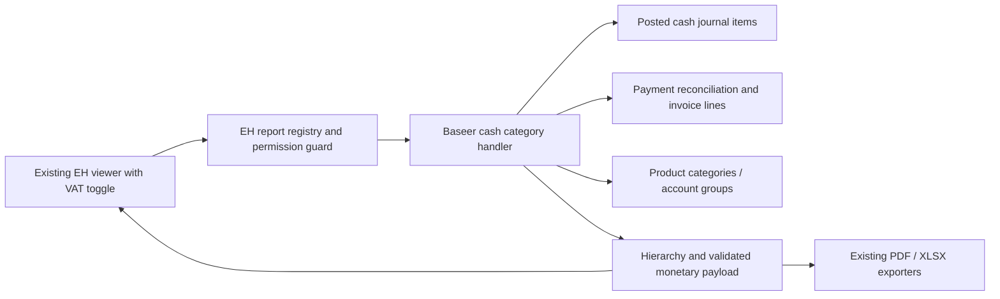

# Baseer cash movement by category — QA build contract

Reference: BASEER-CASH-1. Status: G0–G3 approved by independent gate_review for synthetic QA preview on 2026-09-07. No production policy approval inferred.
User authorized a working preview in the existing QA database, not main deployment.

## G0 / journeys

Monthly posted cash/bank movement, receipts by treasury journal, payments by product category ancestor tree or accounting group/account when no product, expandable parent/child totals. Default gross VAT-inclusive, native export PDF/XLSX and a VAT inclusion toggle. Receivables not yet received and payables not yet paid do not enter cash movement. Internal cash transfers net out. Refunds reverse direction explicitly. Unknown allocations must be visible, never dropped or silently guessed.

Partial-payment assumption for synthetic preview: proportional to invoice line gross values, then proportionally remove each line's actual invoice tax. An optional user preference question is pending; the preview may demonstrate this assumption without treating silence as approval of a production policy. Do not divide all transactions by 1.15; no-tax and unknown-tax transactions retain their evidenced gross value. Ex-VAT net movement is an administrative subtotal; show excluded VAT as a bridge to actual cash movement and closing cash.

## G1 / capacity and recovery

Local QA only, one tester, SAR company ledger, monthly scope. Start with a bounded read limit and fail clearly rather than truncate. Test on small synthetic ledgers plus representative repeated rows if needed. No promise of production-scale throughput. Read-only reporting; report execution audits are existing vendor behavior. Rollback by uninstalling the new module in QA; retain original report modules and dev database. Backup QA before installation if modifying existing data is necessary.

## G2 / architecture

New module `baseer_cash_categories`, no schema, no external calls, no vendor edits. All new arithmetic is backend Decimal; proportional rounding distributes cents with exact remainder reconciliation. Native journal items remain financial truth. One company in SAR required initially, reject unsupported combinations and filters rather than silently misstate balances. Reports cannot bypass current-user record access. Pending/outstanding payment chains either trace to evidence or appear as unclassified with a clear diagnostic; no claim that payment registration alone is cash.

## G3 / dependencies and direct path

Reuse installed `eh_account_dynamic_reports` and `baseer_report_layout`. New handler + report registry/menu + small OWL extension; no UI framework, no copied report engine, no Python library. Existing layout/font inherited for the new report. Source truth unchanged. Existing report tax/float paths are not reused as a new financial calculator.

## Acceptance

1. Sale115 at15VAT, received115 -> inclusive115/exclusive100; unpaid0.
2. Mixed category/tax supplier invoice partially paid -> proportional exact total and parent sums (not double counted).
3. Prior-month invoice paid this month -> payment month cash only.
4. Refunds, unclassified direct transactions, internal transfers, outstanding settlement, cash opening/closing bridge.
5. Multiple category levels, accounting-only expenses and empty report.
6. Cross-company rejection and no main changes.
7. Arabic/English, desktop/mobile, gross/net toggle, expand/collapse, PDF/XLSX values and labels.
8. Independent evidence review before QA handover; no main installation.

## BASEER-CASH-1 implementation and evidence, 2026-09-07

Module 19.0.1.0.0 installed only in `baseer_reports_qa_20260907`; action322, synthetic company9 `QA الفئات النقدية`. Existing report viewer, category/account models, PDF/XLSX, Arabic Plex font reused. No vendor file edits. Local source snapshot hashes are in `cash_categories_candidate_hashes.json` because the repository has no initial commit; this is a QA candidate, not a production release.

User added salaries, electricity and telecommunications during implementation. These appear as distinct accounting expense accounts under an operating expense group; this test does not claim payroll-slip installation. Product payments demonstrate مشروبات > مشروبات غازية / مياه and مواد غذائية.

September synthetic gross receipts460, payments731, net-271; opening1000, closing729. Excluding evidenced invoice VAT: receipts400, payments677, net-277; VAT bridge+6 restores actual net-271. Unreconciled advance40 remains visibly unclassified. Direct entries retain full amounts when no invoice tax evidence exists. Unpaid bills excluded; prior-month bills paid this month included.

Validation: initial fixture34 checks; supplemental48 checks with synthetic ledger/config changes rolled back. Native durable failure audit rows from intentional rejection tests may remain in QA. Two review findings fixed: largest-remainder cent allocation prevents phantom signs, and signed zero-net invoice categories retain their values. Author algorithm9933 randomized cases and independent reviewer5052 checks passed. Existing P&L700/cash150 unaffected. Native four PDF/XLSX exports in Arabic/English and both tax modes passed value/font checks; each PDF two pages. Main read-only check confirms zero moves, three original companies and no new module registration.

Known preview limits: exactly one SAR company, at most366-day period,10,000-record read/trace ceilings and depth6 reconciliation traversal. Foreign invoice currency, incomplete evidence and adjusted tax rounding may remain unclassified. No large-ledger throughput claim. Production requires actual policy/data review and separate user deployment authorization; synthetic company/transactions must not be copied to main.

## User steering: native source drilldown

User explicitly requested every monetary number to open its original operations. Independent gate_review approved the narrow G0–G3 delta: reuse EH `get_drilldown_for_line` and native Odoo form/list actions, no new endpoint/schema. Recompute sources server-side under effective company/ACL options; reject invented line IDs and note rows. Categories/parents open original invoices or expense entries; receipts/net/opening/closing open cash journal items; VAT bridge opens invoices with tax evidence. Reconciliation zero opens cash items for verification, not a false zero-sum claim. Empty scope must use explicit `id in []`. Sources of a partial allocation can have original document totals different from displayed paid portions; action names explain this. Numeric zero remains actionable and native keyboard handling is retained. No source IDs supplied by the browser are trusted.
