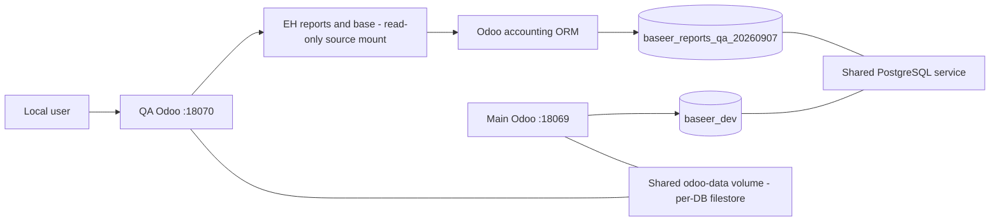

# ERP Heritage — isolated evaluation

Status: CONDITIONAL GO for local preview, 2026-09-07. Not approved or installed in baseer_dev.

## Contract and independent gates

User authorization: try the ready-made Profit and Loss and actual Cash Flow reports, minimize changes, use an isolated test database. No bespoke report engine or UI.

G0: two reporting journeys; posted accrual P&L versus actual cash, partial collection, expense/payment, internal transfers, refunds, and per-company access isolation.
G1: local Docker Odoo 19/PostgreSQL 16; one tester and a small synthetic ledger. No production capacity claim. A failed evaluation is recoverable by stopping the dedicated test container. Existing baseer_dev is outside the write scope.
G2: standard account.move/account.move.line remain the source; all reporting uses the supplied backend handlers. SAR currency rounding follows native Odoo. No new financial schema or rounding engine is designed for this evaluation. Vendor model overrides are evaluated as part of the install, not assumed to be read-only.
G3: user-supplied official-store archives, LGPL-3. Dependencies: eh_account_dynamic_reports -> eh_account_base -> account. Existing official Odoo Docker image. No full suite, no new Python packages until actually required. Source remains unchanged during evaluation.

Independent gate reviewer: /root/gate_review approved G0–G3 for isolated evaluation only. Required extra coverage: ordinary invoice/register-payment lifecycle because base overrides posting, payment and reconciliation operations.

## Inputs

- eh_account_dynamic_reports 19.0.1.8.1 archive SHA256: 3348C7E071E33046F8B8ECE108952EBC8D5C73768CE891A99C972ED8E7EB62FF.
- eh_account_base 19.0.1.8.0 archive SHA256: 2FD1B92D51A51E1F753DC2266A3AFEEACD4713A7514E42C4FCD3602170F299EB.
- Reports archive already bundles base; extracted once into third_party_addons/erp_heritage_19.
- Official module pages: https://apps.odoo.com/apps/modules/19.0/eh_account_dynamic_reports and https://apps.odoo.com/apps/modules/19.0/eh_account_base.
- Test database: baseer_reports_qa_20260907. Main service remains at localhost:18069.

## Acceptance

Run supplied P&L/cashflow tests and add a reproducible Saudi SAR scenario: unpaid invoice, partial receipt, vendor bill, outgoing payment, cash/bank transfer, refund, opening + movement = closing, correct balances in each of three independent companies, restricted-user cross-company rejection. Verify ordinary posting and reconciliation, JSON results and export, English/Arabic UI, desktop/mobile. No assertion of passed checks until recorded below.

## Observations

- Installation seeds a vendor contact and EH privilege groups; the report hook adds IAS7 tags based on configured accounts.
- Extensive native model overrides exist. Treat this as a financial extension rather than a display-only add-on.

## Verified outcome and independent review

- Official Odoo image tested: sha256:f99ffac95cb39a0924622ea4118481c95651d9c84187e5b30a21c2cc4419c7dd (runtime 19.0-20260817). Workspace has no committed release candidate; this is an archive-based evaluation, not a release.
- Independent reviewer /root/gate_review compared all 208 extracted vendor files with the supplied archive: zero differences. Both ZIP hashes above match. No vendor code changes or additional Python packages.
- Supplied TestProfitAndLossHandler and TestCashFlowHandler: 81 tests, zero failures/errors (erp-heritage-upstream-tests.log). The broader suite is outside this result.
- qa_sa_reports.py completed 46 assertions, recorded in sa_scenarios.json and erp-heritage-sa-scenarios.log. It uses normal posting/payment/reconciliation and public report render with user/company context.
- Three synthetic Saudi companies (6, 7, 8), separate roots and native sa chart, SAR. No taxes on the synthetic invoices to isolate the report calculations. This is not tax acceptance.
- In QA ARZ: invoice 1,000 unpaid yields profit 1,000 and zero cash movement; partial receipt 400 leaves invoice residual 600; bill 200/payment 150, internal cash-bank transfer 75, and credit/refund 100 produce profit 700, cash movement 150, opening 1,000, closing 1,150, balance check zero. Other companies repeat at factors 2 and 3.
- Restricted report user: own-company report permitted; another company rejected with AccessError for both reports.
- Cash classification uses native cash_flow_reconciled=True (UI: Reconciliation-accurate / دقيق التسوية). This traces payments to source account types. Default false shows receivable/payable categories. Tick this filter when opening a fresh report; it is not a new custom calculation.
- Four native PDFs generated successfully (both reports, en_US and ar_001). Both Arabic PDFs rendered with bundled Poppler and visually inspected: connected Arabic text, legible totals, no row clipping. Layout is landscape with whitespace for short reports; metadata retains English Yes and mixed-direction timestamp.
- Both XLSX exports opened with openpyxl. P&L total 700; cash net 150/opening 1,000/closing 1,150/check 0. Values are numeric cells.
- English and Arabic desktop report UI opened successfully. Arabic language installed only in QA; existing session required Update Preferences to refresh language. Some advanced filter labels remain English.
- Mobile viewport 390x844 checked for both reports. Filters occupy most or all first screen; P&L grid requires horizontal scrolling. Mobile needs layout improvement before a polished mobile delivery. Screenshots retained; viewport restored.
- Read-only main check after evaluation (erp-heritage-main-check.log): the same three independent companies, zero account.move records, no EH modules registered. Main addons path excludes this vendor directory.

## Architecture and boundaries (evidence map)

Evidence: compose.yaml, compose.reports-qa.yaml, vendor manifests/hooks and test script. Database, Odoo process and port are separate; PostgreSQL service/credentials and odoo-data volume are shared. This is not an infrastructure security sandbox. Cron is disabled and QA mail servers are disabled. No external report integration is configured. Small synthetic dataset and one tester are the measured scope; concurrency and large-ledger capacity remain unmeasured.

## Review disposition and remaining scope

Independent gate and evidence review covered source provenance, calculation assertions, public company authorization, install hooks and operational separation. Lead verified desktop/mobile and export rendering independently of the report authors. No extra specialist skill/agent was installed. Existing reviewer was reused; no reserve-role addition needed.

| ID | Finding | Severity within preview | Owner / disposition |
|---|---|---|---|
| EH-01 | Ready-made calculations match targeted synthetic scenarios | Passed | Independent evidence reviewer |
| EH-02 | Incomplete advanced-filter translations, mixed metadata direction | P2 presentation | Vendor / future small translation extension |
| EH-03 | Mobile filters dominate screen and report grid can scroll horizontally | P2 preview; open mobile acceptance gap | Vendor / future bounded layout extension |
| EH-04 | Base changes posting/payment/reconciliation and attachments beyond report display | Deployment limitation | Evaluate wider ordinary accounting lifecycle before main activation |
| EH-05 | Shared infrastructure and unmeasured load | Explicit evaluation limit | Separate services/credentials and load profile for production |

Final decision: CONDITIONAL GO for local desktop preview with the presentation limitations disclosed. No demonstrated financial blocker for this dataset. No approval of main installation, tax operations, bank outstanding-account settlement lifecycle, stock valuation/COGS, multi-currency, all vendor features, Decimal-only arithmetic, production security or capacity. Financial truth remains posted Odoo journal items; vendor handlers aggregate them and Odoo currency rounding is used.

## Reproduction and operation

1. Extract the supplied reports ZIP once into third_party_addons/erp_heritage_19; it includes base. Keep archive hashes above.
2. Installation/test command used: `docker compose run --rm --no-deps odoo odoo --config=/etc/odoo/odoo.local.conf --addons-path=/usr/lib/python3/dist-packages/odoo/addons,/mnt/baseer-addons,/mnt/third-party-addons/erp_heritage_19 -d baseer_reports_qa_20260907 -i eh_account_dynamic_reports --without-demo=all --stop-after-init --max-cron-threads=0 --test-enable --test-tags /eh_account_dynamic_reports:TestProfitAndLossHandler,/eh_account_dynamic_reports:TestCashFlowHandler`.
3. Install l10n_sa into that QA database before running the fixture. qa_sa_reports.py intentionally refuses a second successful run. Initial fixture attempts failed on missing equity type and auto-reconciled refund and rolled back; fixes use a QA opening-capital account and native unmatching before explicit cash refund. The fixture disables partner auto-enrichment after an initial failed synthetic lookup; no real customer data was supplied.
4. Preview start: `docker compose -f compose.yaml -f compose.reports-qa.yaml up -d reports_qa`.
5. Preview stop (no data deletion): `docker compose -f compose.yaml -f compose.reports-qa.yaml stop reports_qa`. Do not use down or remove shared volumes.
6. Open http://127.0.0.1:18070/odoo/action-307 for P&L or http://127.0.0.1:18070/odoo/action-313 for cash flow. Using 127.0.0.1 avoids sharing the main localhost cookie hostname. QA login uses the existing local admin credential; no secrets in this evidence package. Companies prefixed QA contain artificial test data.
