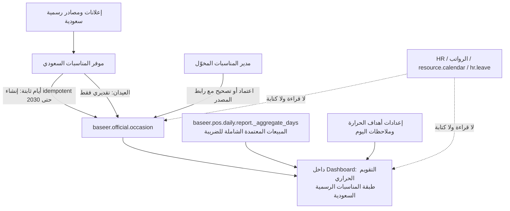

# HC-1 — لجنة مراجعة بنية التقويم الحراري والمناسبات الرسمية السعودية

**تاريخ:** 2026-09-14  
**الحالة:** ديمو معزول عامل وقابل لمراجعة المالك؛ لا تثبيت أو تعديل بيانات أو نسخة أصلية قبل قرار تسليم مستقل لاحق.  
**قرار المالك المؤكد:** الهدف تحليل أثر العطل والمناسبات الرسمية السعودية على المبيعات فقط. لا أثر على الرواتب أو الإجازات أو ساعات العمل أو `resource.calendar`.

## قرار اللجنة

**لا نعدل تقويم Odoo القياسي ولا نجعل `calendar.event` مصدر الحقيقة مباشرة.**

تنشأ إضافة مستقلة باسم مقترح `baseer_sales_heat_calendar`، تملك موديلها `baseer.official.occasion` وجداولها الخاصة فقط. لا تنشئ تطبيقاً أو قائمة مستقلة للمناسبات: تظهر **شبكة شهرية حرارية** وإدارة مناسبات محدودة داخل Dashboard فقط.

الشبكة مكوّن OWL محلي بمظهر Odoo، وليست تضميناً لـ Calendar الأصلي: تقويم Odoo القياسي هو تطبيق كامل مبني على أحداث واجتماعات وصلاحياتها، ولا يلائم خلية تجمع مبيعات وعملاء وحالة تشغيل. لا يرث موديولنا أو يكتب `calendar.event` أو `resource.calendar` أو HR. لذلك تعديل الإضافة أو إلغاء تثبيتها يزيل لوحة الداشبورد وبياناتها الخاصة وحدها، ولا يغير بيانات أو شاشات Odoo الأصلية.

## لماذا عُدلت فكرة استخدام `calendar.event` كمصدر وحيد

| البديل | الفائدة | المانع المثبت | القرار |
|---|---|---|---|
| `calendar.event` القياسي مباشرة | يظهر في تطبيق Calendar المعتاد | مصمم لاجتماعات ومنظم/حضور/تنبيهات ومزامنات؛ لا يملك `company_id`؛ مستخدمو Odoo الداخليون يملكون إنشاء/تعديل/حذف الأحداث، وقاعدة القراءة العامة تعرضها للموظفين. تأمين المناسبات فوقه يتطلب تعديل صلاحيات ومسارات قياسية هشة. | لا يكون مصدر الحقيقة. قد يستقبل لاحقاً نسخة عرض أحادية الاتجاه فقط إذا لزم ظهورها داخل تطبيق Calendar نفسه. |
| تطبيق Odoo Apps `sa_public_holidays` | يورد 2026–2035 ويحتوي على آلية تحديث | يعتمد HR ويكتب العطل في `resource.calendar.leaves` وله مهمة سنوية؛ يغير تقاويم العمل المحتملة، وتواريخ العيدين تقديرية، وترخيصه OPL-1. | لا يثبت لهذا النطاق. |
| سجل بصير صغير مع Calendar view القياسي | مصدر واحد، عزل شركات، صلاحيات مخصصة، بلا HR، ويعيد استعمال واجهة Odoo | يتطلب موديل محدوداً وعقد بيانات واضحاً | **الموصى به.** |

## مخطط البنية المعتمد مبدئياً

## مصدر الحقيقة والحدود

| المعلومة | المالك الوحيد |
|---|---|
| نوع المناسبة وتاريخها وحالتها ومصدرها ونطاق شركاتها | `baseer.official.occasion` |
| المبيعات وحالة اكتمال اليوم | `baseer.pos.daily.report._aggregate_days` |
| هدف الحرارة وملاحظات التحليل | موديول التقويم الحراري فقط |
| الدوام والإجازات والرواتب | Odoo HR فقط، خارج النطاق كلياً |

لا تُكتب المناسبة بأثر رجعي داخل ملخصات المبيعات أو الفواتير، ولا يفترض التقويم أن العطلة تعني إغلاق الفرع أو صفراً في المبيعات. حالة التشغيل (مفتوح/مغلق/جزئي/غير مؤكد) معلومة اختيارية يقررها المالك لاحقاً.

## نموذج البيانات الأدنى

| الحقل | الغرض |
|---|---|
| الاسم العربي والإنجليزي + الرمز | عرض واضح وهوية مستقرة، مثل `FOUNDING_DAY` و`EID_FITR`. |
| البداية والنهاية (`Date`) | حدث طوال اليوم بتوقيت الرياض، بلا ساعات أو حضور. |
| النوع | عطلة رسمية / مناسبة وطنية / موسم تجاري؛ المرحلة الأولى تزرع العطل الرسمية فقط. |
| الحالة | تقديري / معتمد / ملغى أو مستبدل. |
| نطاق الشركات | «كل الشركات» أو شركات محددة، كي لا تتسرب مناسبة خاصة مستقبلاً. |
| المصدر والرابط وتاريخ المراجعة | تدقيق التاريخ القانوني وتثبيت الإعلان المعتمد. |
| مفتاح خارجي فريد | يمنع التكرار عند توليد أو تحديث السنوات. |
| النشط/المؤرشف | حفظ الأثر دون حذف التاريخ. |

صلاحيات المرحلة الأولى: القراءة فقط للمستخدمين داخل شركاتهم؛ مديرو «المناسبات والتقويم الحراري» وحدهم ينشئون أو يعتمدون أو يعدلون. أي endpoint للوحة يطبق شركة المستخدم المختارة وقواعد السجل، بلا `sudo` من العميل.

## تغذية المناسبات 2025–2030

1. مولّد idempotent ينشئ الأيام الوطنية الثابتة المعتمدة لكل سنة حتى 2030.
2. ينشئ عيد الفطر وعيد الأضحى بحالة **تقديري** من تقدير يدوي واضح؛ لا يدّعي مصدر تاريخ رسمي ولا يحولهما تلقائياً إلى «معتمد».
3. عند صدور الإعلان الرسمي، يثبت المدير التاريخ أو يصححه من سجل المناسبة نفسه، مع رابط المصدر وتاريخ الاعتماد.
4. تستبعد المرحلة الأولى يوم العلم ورمضان وموسم الحج ومواسم المدارس؛ يمكن إضافتها لاحقاً كمواسم تحليل تجارية واضحة، لا كعطلات رسمية.

مراجع السياسة: [لائحة العطل الرسمية — وزارة الموارد البشرية](https://www.hrsd.gov.sa/en/knowledge-centre/articles/322)، [يوم التأسيس — منصة السعودية](https://my.gov.sa/en/events/13399)، [اليوم الوطني — منصة السعودية](https://my.gov.sa/en/content/139). لا يعالج مولدنا «يوم تعويض» أو إغلاق فرع كحقيقة عامة بلا مصدر رسمي وحالة تشغيل معتمدة.

## تصنيف الأثر والبوابات

**التصنيف: ARCHITECTURAL.** السبب: موديل بيانات جديد، صلاحيات وعزل شركات، وربط مصدر مناسبات مستقل بلوحة مبيعات. أما واجهة الحرارة بعد اعتماد العقد فهي CONTROLLED.

قبل أي كود:

- **G0:** اعتماد نطاق العطل الرسمية فقط ومعايير القبول وعدم أثر HR.
- **G1:** حد قراءة 5 سنوات، المستخدمون المتزامنون المفترضون، وزمن تحميل التقويم؛ لا cron خارجي ولا حمل إنتاجي.
- **G2:** عقد السجل والمفتاح الفريد والعزل والصلاحيات ومسار اعتماد العيدين، ومصدر `amount_gross` في لوحة الحرارة.
- **G3:** إعادة استخدام Odoo و`baseer_sales_dashboard` و`spreadsheet_dashboard` وOWL، مع شبكة شهرية محلية بلا مكتبة أو تطبيق سوق جديد، وتحديد ترجمة AR/EN وRTL/LTR والجوال.

## الاختبارات المطلوبة في المرشح المعزول

- توليد مكرر لا ينتج صفاً ثانياً، وتصحيح العيد المعتمد لا يغير حدثاً آخر.
- عرض السنوات 2026–2030 والأحداث متعددة الأيام والسنوات الكبيسة بتوقيت الرياض.
- قارئ شركة لا يرى مناسبة مقيدة لشركة أخرى، وغير المخول لا ينشئ/يعدل/يعتمد.
- لا رسالة بريد ولا attendee ولا reminder ولا `calendar.event` ولا `resource.calendar.leave` ولا `hr.leave` ولا سجل رواتب نتيجة لهذه الميزة.
- التقويم الحراري يطابق مبيعات `amount_gross` المعتمدة، ويعرض التقديري بوسم واضح، ولا يفترض أن المناسبة تعني صفراً أو إغلاقاً.
- واجهة عربية وإنجليزية وجوال 390px وتقويم/جدول بديل متاح.

## التسليم المتدرج

1. نبني ونتحقق من `baseer_sales_heat_calendar` داخل Dashboard: تقويم حراري شهري للمبيعات مع طبقة مناسبات؛ نثبت أن التثبيت والإلغاء لا يمسان نماذج أو قوائم Odoo وHR الأصلية.
2. نعرض جدول 2026–2030 للمالك لاعتماد الدفعة الأولى، ثم يُنشر على الأصل كبيانات مستقلة فقط.
3. نبني التقويم الحراري قارئاً للسجل ولمبيعات اليوم، دون نسخ بيانات أو اتصال HR.
4. مراجعة تسليم مستقلة قبل النشر الحي.

---

## HC-D1 — عقد ديمو عمودي للتقويم الحراري

**طلب المالك:** 2026-09-14. يبدأ التنفيذ بديمو محلي معزول، احترافي داخل Dashboard، تكون المبيعات وملخصات المبيعات المعتمدة أساسه؛ المناسبات طبقة تحليل فوقها فقط.

### G0 — الحوكمة وعقد البناء

**الحالة: معتمد للديمو المعزول.** استوعب العقد مراجعات البيانات والواجهة: لا يظهر تقييم حراري بلا أساس معلن، ولا تتسرب معرفات الملخصات غير المعتمدة إلى العميل، ولا يضمّن Calendar الأصلي.

### الهدف والمستخدم

المالك ومديرو التشغيل يفتحون Dashboard ويختارون شركة وشهراً. يرون شبكة شهرية احترافية من مربعات الأيام؛ كل مربع يبين إجمالي المبيعات الشامل للضريبة، وعدد العملاء، وحالة اكتمال اليوم، ولون الأداء. الضغط على المربع يفتح تفاصيل اليوم والمناسبات ذات الصلة. لا يكون التقويم شاشة إجازات أو شاشة إدخال مبيعات.

### أول رحلة مكتملة للديمو

1. يفتح المستخدم Dashboard المنشور **«التقويم الحراري»** للشركة النشطة والشهر المختار.
2. الخلفية تقرأ فقط `baseer.pos.daily.report._aggregate_days(company, from, to)`، وتعيد إجمالي `amount_gross` الشامل للضريبة و`customer_count` المسجل وحالة اليوم. لا تصف العملاء بأنهم فريدون؛ قد يكون العدد مجموع ورديات اليوم.
3. الخلفية تربط المناسبات الظاهرة من `baseer.official.occasion` وفق نطاق الشركة والتاريخ؛ لا تكتب في ملخص اليوم أو الفواتير.
4. تعرض الواجهة مربع اليوم: التاريخ بالأرقام الغربية، مبيعات اليوم، العملاء، اللون والوسم النصي، وشارة مناسبة عند وجودها.
5. الضغط يعرض Dialog تفاصيل: المبيعات الإجمالية، العملاء، مقارنة خط الأساس، حالة اليوم، والمناسبة/المصدر. لا توجد كتابة في هذه الرحلة.
6. مدير المناسبات فقط يستطيع من Dashboard تشغيل تغذية تجريبية مكررة بأمان أو تحرير مناسبة داخل بيانات الإضافة.

### نطاق الديمو

- إضافة منفصلة `baseer_sales_heat_calendar` تعتمد `baseer_sales_dashboard` (ومن خلاله `baseer_pos_summary` و`spreadsheet_dashboard`) عبر `selection_add` لنوع Dashboard جديد؛ لا تعدل مصادره أو `baseer.pos.summary`.
- Dashboard منشور جديد من نوع `sales_heat_calendar` داخل مجموعة Dashboards؛ لا تطبيق مستقل للمناسبات.
- عرض شهري حراري هو الأساس. واجهة الأسبوع لإدارة المناسبات مؤجلة حتى تؤكد الرحلة الأساسية؛ لا تدّعى كجزء من الديمو قبل بنائها.
- بيانات المبيعات الفعلية في المرشح المحلي فقط. أثبتت قراءة المرشح السابقة أن أول ملخص معتمد متاح هو 2025-07-31؛ تغطي دفعة المناسبات 2025–2030 كامل نطاقها. يعاد فحص هذا الحد قبل التشغيل، وإذا ظهر مصدر أقدم من 2025 يوسّع سجل المناسبات أو يوسم النطاق غير المغطى بوضوح قبل اعتماد التحليل. لا يقتصر على 2026 أو المستقبل ولا تُنقل بيانات الديمو للأصل في هذه المرحلة.
- تحليل أثر المناسبة في الديمو: فرق اليوم/نطاق المناسبة عن خط أساس مرجعي؛ يسمى **«فرق ملحوظ»** وليس سببية أو توقعاً. خط الأساس: نفس الشركة ونفس يوم الأسبوع، أيام مكتملة فقط من الأسابيع الثمانية السابقة، حد أدنى ثلاث عينات، والوسيط باستخدام `Decimal` في الخلفية. تستبعد العينة أي يوم له مناسبة أخرى أو إغلاق مؤكد. عند غياب العينات تعرض «لا يوجد خط أساس».

### خارج النطاق

- أي كتابة أو قراءة من `account.move` أو الفواتير أو التحصيلات أو المخزون أو الرواتب أو HR أو `resource.calendar` أو `calendar.event`.
- API خارجي أو scraping أو cron أو مزامنة حيّة أو تثبيت تطبيق سوق أو تغذية قانونية نهائية 2026–2030.
- افتراض أن العطلة تعني إغلاق الفرع، أو أن فرق المبيعات يثبت السببية.
- تعديل النسخة الأصلية أو الإنتاج أو بياناتهما.

### القبول والتراجع

- كل رقم يومي يطابق إجمالي `amount_gross` والعملاء من الملخصات المعتمدة للشركة واليوم؛ اليوم الناقص/المفقود/المغلق لا يصبح صفراً صامتاً.
- `complete` فقط يأخذ لون حرارة. `incomplete` يعرض المبلغ الجزئي ووسم «غير مكتمل» بلا تقييم؛ `closed` و`missing` يعرضان وسمهما بلا صفر أو لون أداء؛ ويظهر وسم منفصل عند الإغلاق الجزئي.
- تظهر المناسبة فوق مربع اليوم من مصدر إضافة الديمو فقط، ولا تغير أي سجل مبيعات.
- مدير الإضافة فقط يكتب المناسبات؛ قارئ Dashboard لا يكتب أو يرى مناسبة مقيدة خارج شركته.
- Arabic RTL وEnglish LTR والأرقام الغربية، سطح المكتب و390px، مع بديل نصي لتفسير اللون.
- إلغاء تثبيت الإضافة أو حذف بيانات الديمو يزيل جداول/لوحات الإضافة فقط؛ لا أثر في موديولات Odoo الأصلية. المرشح المحلي هو بيئة التراجع بالديمو.

### G1 — ملف السعة والنمو

**الحالة: معتمد للديمو المعزول؛ Docker والتحقق الوظيفي متاحان محلياً.** الافتراض المحافظ للديمو: 5 شركات، 31 خلية شهرية أو حد أقصى 366 خلية لنطاق قراءة، حتى 10 مستخدمين متزامنين، وقراءة يومية مقيّدة بمصدر `_aggregate_days` الموجود. لا pagination في شبكة الشهر، ولا cache أو queue أو cron. هدف العرض المحلي الدافئ أقل من 1.5 ثانية في الديمو؛ يسجل القياس ولا يدّعى على الإنتاج. البيئة المعتمدة: قاعدة `baseer_heat_calendar_demo_20260914`، نسخة قراءة فقط من `baseer_integrated_release_candidate_20260914`، منفذ `127.0.0.1:18087`، ومصدر منفصل عند `production_source@91e1b8d`. الاحتفاظ: مناسبات قليلة ومؤرشفة؛ كل تحديث يكون idempotent بمفتاح مصدر فريد.

### G2 — عقد البيانات والعزل

**الحالة: معتمد للديمو المعزول.** مصدر المبيعات/العملاء الوحيد هو تجميع الأيام المعتمد. الحسابات والوسيط والنسب والتنسيق المالي تنفذ في الخلفية باستخدام `Decimal`؛ لا حساب أعمال في JavaScript ولا `float` مصدر حقيقة. موديل المناسبة يملك فقط التواريخ والحالة والمصدر والنطاق والمفتاح الخارجي غير الفارغ؛ فهرس/قيد فريد على المفتاح ومعالجة تعارض إنشاء متزامن للتغذية المتكررة. الشركة الفارغة تعني كل الشركات، وإلا يلزم تقاطعها مع الشركة النشطة في قاعدة السجل والendpoint. يملك `baseer.heat.calendar.target` هدفاً عاماً للشركة/السنة/الشهر وأهداف أيام الأسبوع اختيارياً؛ أساس اللون هو الهدف إن وجد، وإلا خط الأساس المتاح، وإلا لا تقييم. قواعد اللون: أقل 80% أحمر، 80–99% أصفر، 100–119% أخضر، و120% فأعلى أزرق. القراءة من endpoint تتحقق من Dashboard المنشور وصلاحية POS والشركة المختارة، وتحد 366 يوماً؛ لا تقبل شركة أو نتائج مرسلة من العميل ولا `sudo` غير مقيد. لا تعيد `summary_ids` أو أي معرف مسودة؛ زر المصدر، إن وجد، يفتح الملخصات المعتمدة وحدها داخل الشركة. لا migrations إلى جداول أصلية.

### G3 — الرصة والمكتبات

**الحالة: معتمد للديمو المعزول.** نعيد استعمال Odoo 19 و`baseer_sales_dashboard` و`spreadsheet_dashboard` وOWL وChart.js الموجودة في المشروع وGrid محلي ضمن إضافة الديمو؛ لا تثبيت مكتبة أو تطبيق Marketplace أو طلب شبكة. البدائل المرفوضة: `calendar.event` (صلاحيات/حضور/لا شركة)، `sa_public_holidays` (HR وOPL-1)، وواجهة مستقلة خارج Dashboard (تخالف رحلة المستخدم). لا توجد حركة مطلوبة في الديمو؛ تقتصر الاستجابة على تحميل وفتح Dialog قياسيين.

### G4 — تجربة الواجهة

**الحالة: معتمد للديمو المعزول.** يستخدم الديمو PageHeader وFilterBar ومبدل الشركة/الفترة وButton/Badge/Tooltip وحالات Empty/Loading/Error المتاحة في Odoo؛ لا يعيد تصميمها. مكون HeatDayCell محلي للميزة لأنه فريد، ويتضمن التاريخ، مبيعات، عملاء، شارة مناسبة أعلى يسار اليوم، وصف حالة نصي، وحالة selection/focus/loading. تفاصيل اليوم نافذة عائمة محلية لا تستخدم خدمة Dialog العالمية غير المتاحة داخل Dashboard؛ تُغلق بوضوح وتبقى منفصلة عن Calendar القياسي. لا لون وحيد للمعلومة؛ لكل مستوى label/tooltip وجدول بديل. لا رسوم متحركة عند تبديل الشهر بلوحة المفاتيح، مع احترام reduced motion.

### سجل العمل الحي

| المعرّف | المرحلة | النوع | النية/النطاق | النتيجة والدليل | الأثر والتراجع | المنفذ/المراجع |
|---|---|---|---|---|---|---|
| HC-D1-01 | G0–G4 | قرار وقراءة | توثيق طلب الديمو، قراءة عقد HC-1 وكتالوج التصميم ومصدر Dashboard وملخصات اليوم | هذا العقد؛ لم يكتب أي كود أو بيانات | وثائق فقط؛ لا أثر تطبيق | قائد البناء؛ مراجعة مستقلة مطلوبة |
| HC-D1-02 | G0 | قرار نطاق | المالك يطلب تغذية المناسبات بأثر رجعي، لا المستقبل فقط | نطاق الديمو توسع إلى كامل فترة المبيعات التاريخية المتاحة + سنة مصدر سابقة إن وجدت، ومناسبات مستقبلية حتى 2030 | وثائق فقط؛ أعيدت G0 للمراجعة المستقلة | قائد البناء؛ مراجعة مستقلة مطلوبة |
| HC-D1-03 | G0/G2 | مراجعة مستقلة | فحص مصدر التجميع اليومي والعزل | Conditional GO: أضيفت دلالة العملاء، اعتماد `baseer_sales_dashboard`، حارس حالات اليوم، إعدادات هدف الحرارة، منع تسريب المسودات، واستبعاد المناسبات/الإغلاقات الأخرى من خط الأساس | وثائق فقط؛ لا كود أو بيانات | مراجع البيانات المستقل؛ قائد البناء |
| HC-D1-04 | G1/G3/G4 | مراجعة مستقلة | فحص بيئة الديمو ونمط دمج واجهة Dashboard | Conditional GO عولج في العقد: قاعدة ديمو جديدة معزولة عند `18087`، ومكوّن OWL محلي يعتمد `baseer_sales_dashboard`؛ لا تضمين لـ Calendar الأصلي، مع Dialog ووصول باللوحة المفاتيح | وثائق فقط؛ لا كود أو بيانات | مراجع البيئة والواجهة؛ قائد البناء |
| HC-D1-05 | G0–G4 | بناء مرشح | إضافة `baseer_sales_heat_calendar` في worktree مستقل من `91e1b8d` | ثُبّتت الشفرة في `a70d273`؛ موديلات مناسبة/هدف معزولة، Dashboard منشور، مصدر يومي معتمد فقط، واجهة Owl شهرية، تغذية 2025–2030، بلا Calendar/HR/حسابات أو شبكة خارجية | لم يثبت في قاعدة أو أصل؛ إلغاء المرشح يحذف مصدر الكود فقط | قائد البناء |
| HC-D1-06 | G2/G4 | مراجعة بيانات/أمان/واجهة مستقلة | فحص الشفرة بعد البناء | عولج: عدم الكتابة فوق اعتماد يدوي، تعارض التغذية، عزل المدير والشركة، تسريب المسودات، فتح الإدارة داخل Dialog، AR/EN، تفاصيل الورديات، والأهداف. النتيجة Conditional GO رهن فحص تاريخ المصدر وتشغيل الديمو | لا تعديل بيانات؛ المراجعة ساكنة فقط | لجنة التسليم المستقلة |
| HC-D1-07 | G1/G3 | مراجعة تشغيل مستقلة | فحص الحاويات والاستعادة | Conditional GO للعقد: SHA ونظافة worktree، حاوية/volume DB مسميان ومتحقق منهما، clone محروس، backup+SHA، لقطات invariants، filestore فارغ مقصود، cron/loopback/read-only. لا تشغيل حتى الآن لأن Docker Desktop يفشل قبل المحرك؛ يلزم Docker سليم وقياس فعلي | لا قاعدة ديمو ولا HTTP تم إنشاؤهما | حارس المرشح/السعة |
| HC-D1-08 | G1/G3/G5 | تشغيل وتحقق | بعد جاهزية Docker أُنشئت قاعدة الديمو المنفصلة من المصدر المسمى فقط، وحُفظ backup قبلها، وثُبّتت الإضافة دون cron أو اتصال خارجي | HTTP المحلي نجح؛ عدّادات النماذج المحمية في المصدر لم تتغير. تطلب تشغيل الأصول نسخة filestore محصورة من `filestore/baseer_integrated_release_candidate_20260914` إلى `filestore/baseer_heat_calendar_demo_20260914` داخل volume الديمو فقط؛ تساوى الفحص في 549 ملفاً و46,685,801 بايت | لا كتابة في volume أو قاعدة المصدر؛ التراجع بحذف DB/volume الديمو المحددين فقط | مهندس التشغيل؛ فحص التنفيذ المحلي |
| HC-D1-09 | G4/G5 | تحديث واجهة واختبار | استبدال بطاقة التفاصيل السفلية بنافذة عائمة، وإظهار المناسبة/العطلة في أعلى يسار اليوم | أصلح فحص build خطأ SCSS موضعي («%» مع `rem`) قبل إعادة توليد أصول الديمو. دُققت نافذة 23/09/2026: اليوم الوطني ظاهر في الشارة والتفاصيل، الموضع `fixed`، الإغلاق يعمل، و390×844 لا يسبب overflow للصفحة | تغيير عرض محلي في الإضافة فقط؛ عكسه بإعادة commit المرشح أو إزالة الإضافة من DB الديمو | بنّاء الواجهة؛ اختبار متصفح محلي |
| HC-D1-10 | G2/G4/G5 | تحديث واجهة واختبار | نقل «معدل اليوم» من خلايا التقويم إلى أسفل اسم كل يوم أسبوع | يُحسب المتوسط في الخلفية بـ`Decimal` من الأيام المكتملة فقط للشهر المختار؛ لا يظهر متوسط عام أعلى التقويم ولا رقم مكرر داخل الخلايا. دُققت العربية، عدم fallback في CSS، شارات العطل الرسمية، والنافذة العائمة على 390×844 بلا overflow للصفحة | تغيير عرض وقراءة محلية في الإضافة المرشحة فقط؛ لا كتابة في قاعدة أو ملفات الأصل؛ عكسه بالعودة للـcommit السابق أو إزالة الإضافة من DB الديمو | بنّاء الواجهة؛ اختبار متصفح محلي |
| HC-D1-11 | G4/G5 | إصلاح رحلة الإدارة واختبار | إزالة حوار القائمة المتداخل من أهداف ومناسبات التقويم واستعمال مسار Odoo القياسي | فُحص «إدارة الأهداف ← جديد» و«إدارة المناسبات ← جديد»: كلاهما ينتقل إلى نموذج إدخال حقيقي بلا إنشاء سجل تجريبي. لم تتغير ACL أو النماذج أو مصدر أرقام المبيعات | تغيير واجهة/Action محلي في المرشح فقط؛ التراجع بالـcommit السابق أو إزالة الإضافة من DB الديمو | بنّاء الواجهة؛ اختبار متصفح محلي |
