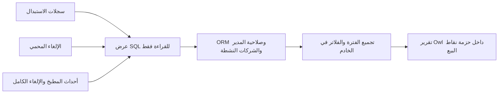

# تقرير متابعة الإلغاءات — 2026-10-02

مرجع POS-CANCELLATION-FOLLOWUP-20261002؛ أثر ARCHITECTURAL محدود: تقرير قراءة وتجميع وعزل شركات، دون تغيير عمليات البيع أو الطباعة أو القيود. الفرع codex/pos-cancellation-followup-20261002، الأساس 082f18628df95fe67e8536cd555abb2f3eddc35c المطابق لمصدر Live ضمن نطاق المطابقة السابقة. تفويض المستخدم: «نفذها وخلنا نشوف»؛ التسليم للمعاينة المحلية، والنشر الخارجي خارج هذا التفويض الجديد.

## G0 — العقد والدورة

تقرير واحد باسم «تقرير متابعة الإلغاءات»، مؤشرات أعلى الصفحة، تفاصيل الاستبدال وإلغاء الأصناف وإلغاء الطلبات، أسباب الإلغاء ورسمها، مؤشرات استبدال ثم إلغاء في الطلب نفسه، وتوزيع حسب الكاشير والنقطة والصباح/المساء. مجاميع الفترة المختارة: يوم/شهر/نطاق تاريخ ووقت. الصباح والمساء قابلان للتحديد. الموضع المفترض حزمة نقاط البيع بجانب سجلات التدقيق؛ سؤال تحديد الموضع أُرسل للمستخدم ويظل قابلاً للتعديل.

المستخدم مدير POS أو مدير النظام بنفس صلاحيات السجلات الحالية؛ لا منح الكاشير صلاحية تقرير رقابي. الطلب draft → استبدال/إلغاء موثق بالخادم → سجلات immutable → التقرير قراءة فقط. الدفع والترحيل والمخزون والطلبات وإرسال المطبخ تبقى مساراتها الحالية. المؤشر لا يصنف تلاعباً، بل يعرض الدليل والتسلسل للمراجعة.

القبول: مصدر واحد لكل عملية رغم سجل المطبخ المكرر؛ تعدد طابعات الطلب لا يضاعف الكميات؛ تفاصيل الأصل/البدائل والكاشير والسبب والوقت؛ حدود الوقت نصف مفتوحة بالتوقيت المختار؛ الاستبدال السابق خارج الفترة يبقى أساس الربط بإلغاء داخلها؛ وقت متساوٍ لا يدعي تسلسلاً مؤكداً. مجاميع كاملة ولو كانت التفاصيل مرقمة. إظهار الفراغ والخطأ وإعادة المحاولة والتحميل، عربية/إنجليزية وRTL/LTR والجوال.

## G1 — السعة والاحتفاظ

افتراض تصميم قابل للقياس: حتى 100,000 حدث تدقيق و20 مستخدم تقرير متزامن؛ لا ادعاء قياس هذه السعة في الإنتاج. نافذة حتى 366 يوماً، تفاصيل 50 صفاً (سقف100)، تجميع PostgreSQL دون تحميل كل الأحداث إلى الواجهة. السجلات الأصلية والاحتفاظ لا تتغير، ولا cache أو queue جديد. مستهدف محلي للتقرير الشهرى أقل من2s ببيانات اختبار ممثلة؛ يسجل الحجم المقاس والحدود الفعلية، ولا يشغل حمل QA/Live. الرجوع بإزالة موديول التقرير الجديد؛ لا حذف مصدر تدقيق ولا migration تشغيلية.

## G2 — مصادر الحقيقة والعقد

موديول قراءة مستقل baseer_pos_cancellation_report يعتمد baseer_pos_suite؛ لا يثقل الموديول التجميعي بمنطق أعمال. نموذج SQL view للقراءة فقط عبر ORM وACL مدير POS/النظام وقاعدة عامة company_id in company_ids. كل RPC يتحقق الدور والسياق ومجالات النقطة/الكاشير قبل القراءة؛ لا sudo عام. لا بيانات خارج الشركات النشطة المسموح بها.

المصادر: baseer.pos.substitution (event_at)، baseer.pos.protected_item_cancellation (event_at)، baseer.print.preparation.event (create_date، cancel/reduce)، baseer.print.cancellation (create_date). أولوية الإلغاء المحمي على حدث المطبخ بالمفتاح company+order+action_uuid+line_uuid. خفض الكمية مستقل عن الإلغاء الكامل. snapshot.destinations[].lines لإلغاء الطلب الكامل يدمج line_uuid عبر الوجهات؛ التعارض يعرض فجوة ولا يخترع كمية. لا تعداد اعتماداً على print jobs أو copies أو pos.order.state.

الربط: طلب/شركة متطابقان واستبدال أسبق زمنياً من الإلغاء؛ إلغاء البديل تحديداً يحتاج UUID في replacement_snapshot. وقت متساوٍ يعرض تسلسلاً غير محسوم. تظل كل الأحداث قابلة لفتح المصدر الأصلي بالقراءة والصلاحية الأصلية.

الأعداد = عمليات موثقة بعد الدمج، والكميات = مجموع وحدات POS مسجلة وليست وحدة مخزون متجانسة. النسب = حصة نوع العملية من العمليات الموثقة؛ يوضح المقام، ولا يخترع نسبة مبيعات. «أصناف حالية دون استبدال موثق» إن عُرضت مصدرها سطور الطلبات الحالية وتستثني UUID البدائل، وليست إعادة بناء للأصناف المحذوفة. حذف غير محمي وغير مرسل للمطبخ لا يترك سجلاً؛ تُذكر تغطية الإلغاءات الموثقة صراحة. لا قيمة مالية شاملة لأن بعض المصادر لا تحفظ السعر/العملة.

get_report(filters): preset today/month/custom؛ range محلي from/to، timezone من سياق المستخدم؛ morning_start/evening_start بصيغة HH:mm، point/cashier وtype وshift وreview filters؛ offset/limit. يرجع filters المعتمدة، kpis نصوص بأرقام0–9 وDecimal بتقريب عرض منزلتين، reasons/shifts/cashiers/registers/timeline وdetails وpagination. الحساب والتجميع وتصنيف الفترات والربط بالخادم. الواجهة تعرض النتائج وتجمع مدخلات خام فقط. التاريخ UTC في المصادر، العرض بتوقيت التقرير.

## G3/G4 — الطريق المباشر والتجربة

هل هذه الطريقة الأصح والأقصر والأقل مخاطرة؟ نعم: SQL view + ORM + Owl داخل Odoo19 الحالي؛ لا خدمة/حزمة/مكتبة جديدة. استخدام CSS/Bootstrap وتوكنات Odoo وأزراره وخدمات orm/action/notification وDateTimeInput/Pager القياسية حيث تلائم العقد. الرسم أعمدة دلالية ثابتة من نتائج الخادم مع قيم نصية؛ لا يتطلب React/Recharts أو حركة. كتالوج المكونات: Odoo web/core للمدخلات والصفحات والخدمات، Bootstrap المتضمن للبطاقات/الأزرار/حالات alert؛ تركيب الرسم والتقرير خاص بهذه الميزة. تطبيق emil-design-eng: ترتيب بصري واضح، حالات تفاعل وإتاحة وتركيز، دون حركة تعطل قراءة التقرير.

الفحوص: تركيب الموديول على قاعدة محلية معزولة؛ اختبارات Odoo للدور/الشركة/التكرار/الفترة/النطاق الليلي/الربط/الكمية/الفراغ/ترقيم التفاصيل ومجاميعها؛ تجميع Owl الفعلي (فشل not السابق يمنع الاكتفاء بصحة XML)، المصدر، وفحص العرض الضيق والعربي/الإنجليزي. alpha-delivery-team مستقلاً قبل التسليم؛ لا ادعاء طباعة فعلية أو نشر Live.

## سجل البوابات

G0/G1/G2/G3: قيد المراجعة؛ دليل العقد أعلاه وتحليل kitchen_print_diagnosis المستقل لحقول مصادر التدقيق ومسارات كتابتها. لا كود تطبيق قبل قرار permission_review. G4 قيد المراجعة؛ G5–G8 غير مبدوءة.

## دفتر التنفيذ

1. قراءة: سجل INDEX، manifests/menus/ACL/sources/immutable workflows واختبارات POS، وبيئة Docker المحلية؛ المصدر التنفيذي يؤكد مفاتيح الربط وتغطية الحذف المحدودة. لا تغيير خدمات أو قواعد.
2. إعداد: إنشاء worktree مستقل داخل workspace من082f1862، مع حفظ الفرع المعتمد السابق؛ قراءات homogenuous جمعت، ولم يبدأ تطبيق.
3. مراجعة: اختصاص ERP/data كشف قفل UUID البدائل، التكرار بين إلغاء محمي ومطبخ، وغياب أسعار/عملة في إلغاء الطلب الكامل. أدرجت في العقد قبل التنفيذ.
4. نية: مراجعة G0–G4 مستقلة ثم تنفيذ backend/frontend بملكية منفصلة، وبعدها فحص معزول وتسليم مرشح للمعاينة.
5. مراجعة مستقلة permission_review: التصميم مدعوم مع تثبيت ثلاث قواعد قبل الكود: KPI يعد distinct operation_key وليس صفوف تفاصيل أصناف المطبخ؛ reason charts تذكر إن كانت خطوط أصناف أو عمليات. هوية الطلب المحذوف تأتي من snapshot.order.id مع الشركة، ولا تُربط الطلبات ذات NULL أو بالمرجع النصي وحده. SQL view IDs ثابتة بمصدر السجل ورقمه، والدمج يسبق فلترة الفترة. رابط prior خارج الفترة ينفذ في SQL ضمن هوية الشركة/الطلب، لا تحميل history إلى Python. أدلة المراجع: عقد المصدر وACL وline_uuid ثابت، protected→prep مثبت. تضاف اختبارات تعدد الأصناف/الوجهات والهوية المحذوفة والاستقرار.
6. قرار حارس البوابات المستقل permission_review: GO G0–G4 للمعاينة المحلية مع الضوابط في5. الحالات معتمدة؛ G5–G8 تبقى غير مقفلة حتى الفحوص والمراجعة. يبدأ التطبيق الآن؛ لا تفويض نشر خارجي مستنتج.
7. تنفيذ G4: manifest/action/menu وOwl/SCSS ومكونات Pager/DateTimeInput القياسية،53 عبارة واجهة مترجمة ar/ar_001، دون اعتماد جديد؛ النتائج القادمة للخادم هي مصدر أرقام البطاقات والرسوم. نية التحقق: تجميع القالب ثم رحلة فعلية على أودو.
8. فحص: compile_owl.cjs على Owl المثبت2.8.4 نجح compiled=true؛ اختبار تجميع حقيقي في متصفح اختبار مستقل، لا يثبت بيانات التقرير أو الصلاحية. لا تغيير في ملفات runtime الأصلية.
9. تجهيز: قاعدة محلية baseer_cancellation_report_test_20261002 من قاعدة اختبار تاريخية؛ حاوية معاينة منفصلة baseer-cancellation-report-preview على127.0.0.1:18097 ومصدر الفرع readonly وvolume جديد. إعداد DB المنقول بالذاكرة إلى ملف600 داخل الحاوية، بلا كلمات مرور في السجل، cron=0. لم تبدأ ترقية QA/Live أو أي خدمة قائمة.
10. فشل أداة معاينة داخلية: الاتصال لم يبدأ بسبب kernel sandbox apply deny-read ACLs؛ لا ادعاء قبول مرئي. البديل فحص Chromium مستقل محلي ثم فتح رابط المعاينة في كودكس. يبقى فحص العربية/الجوال مطلوباً.
11. المراجعة المستقلة وجدت P2 ترقيم مع مرشحات غير معتمدة؛ أُصلح بأن updatePage يستخدم payload.filters ويحتفظ بمسودة المستخدم. نجحت6 حالات Node على الكود نفسه للاستجابات المتأخرة والفلاتر والرفض؛ لا ادعاء Odoo runtime.
12. فحص تصميم افتراضي فقط: render_layout.cjs على عرض1440 و390 بالعربية؛ errors=[]، لا تمرير أفقي. أصلحت أسماء حقول ARIA المميزة وترتيب نصوص البطاقات بعد فحص الصور. Pager/DateTimeInput استبدلا بمحاكاة في هذا الفحص؛ نتائج الصورة لا تعتمد مكونات Odoo الفعلية. الصور فيoutput/cancellation-report-20261002.
13. مانع runtime: نقص db_host/db_user في ملف إعداد النسخة المحلية؛ رُفض تلقائياً استخراج كلمة مرور منproc، ثم رُفض تجهيز دور وملكية قاعدة الاختبار دون تفويض محدد. لم ينفذ أي منهما. أُرسل سؤال موافقة محدد لحساب baseer_report_preview_20261002 وقاعدة الاختبار المنسوخة وحدها؛ الانتظار لا يعد موافقة. تُستكمل فحوص المصدر والتصميم غير المتأثرة.
14. عائق كتابة لدى المنفذ المستقل: apply_patch بقي معلقاً1754s ثم أُجهض دون كتابة؛ exec_command العادي عنده setup refresh errors. استلم قائد البناء حفظ source المرسل منه بالأداة العاملة؛ لا صلاحية إضافية أو مسار credentials بديل. لم يُنشر شيء.
15. تصحيح14: أكد المنفذ أنه لا توجد مسودة backend مكتوبة؛ استلم القائد تنفيذها بالكامل. أُضيف models/report_query.py لدمج المصادر وSQL view ثابت IDs، وreport.py للفلاتر والتجميع المقيد بـORM rules، وACL/RPC مدير/نظام فقط وقاعدة الشركات. لا sudo أو تغيير مصدر تدقيق أو صلاحيات كاشير.
16. تصحيح9: إعداد المعاينة السابق غير مكتمل (db_host/db_user غير متوفرين)، ولم يُشغّل أودو عليه. بقيت حاوية المعاينة sleep فقط؛ إنشاء الحساب وتغيير ملكية قاعدة الاختبار لم ينفذا. موافقة السؤال المحدد لم تصل؛ غياب الرد لا يعد تفويضًا.
17. فحوص مصدر الخلفية:17 حالة PostgreSQL فعلية في جداول TEMP تحجب أسماء المصادر داخل المعاملة ثم ROLLBACK، عبر tests/run_projection.py. لا منح حساب أو تغيير ملكية أو قراءة كلمة مرور. تثبت SQL والدمج والكميات والهوية والوقت المتساوي والربط خارج الفترة، ولا تثبت Odoo ACL/registry.7 اختبارات دوال المصدر AST للفترة/UTC/month/DST/الأرقام نجحت داخل حاوية أدوات دون اتصال ORM.
18. مراجعة alpha-delivery مستقلة محدودة كشفت ثلاث P2 إضافية: retry بعد pagination فاشل يستخدم المسودة، quantity_reduce يظهر كإلغاء بديل، snapshot جزئي مشوه يظهر كاملًا. عولجت في المصدر مع اختبارات؛ frontend7 حالات، SQL17 حالة. القالب Owl2.8.4 compiled؛ XML3 وPython9 فُحصت صياغتها،87 عبارة عربية في ملفي ترجمة بلا أخطاء Babel. التصميم العربي1440/390 بلا overflow مع nativewidgets محاكاة صريحة؛ لا قبول أودو من الصور.
19. تفويض لاحق: «موافف» استجابة للسؤال المحدد عن إنشاء baseer_report_preview_20261002 وملكية قاعدة الاختبار baseer_cancellation_report_test_20261002 وحدها. نُفذ الحساب دون superuser/createdb/createrole، والملكية داخل القاعدة المنسوخة فقط. المحاولة الأولى تراجعت بالكامل عند sequence تابع؛ الثانية استبعدت التوابع التي تنتقل مع جدولها ونجحت. إعداد الاتصال600 داخل حاوية المعاينة، بلا طباعة أو حفظ أسرار في مخرجات المضيف. فُتح Odoo على127.0.0.1:18097؛ cron=0، والمصادر readonly.
20. تكامل فعلي: تركيب registry وتشغيل6 ثم10 اختبارات Odoo ناجحة. أضيفت حالات TEMP داخل ORM لعزل الشركة وأعداد العمليات والكميات وترقيم التفاصيل وثبات المجاميع ووردية الليل والاستبدال السابق خارج الفترة. سجل الاختبارات يحوي تحذير filestore تاريخي مفقود في النسخة المنسوخة؛ لا ادعاء استعادة المرفقات كاملة.
21. تصحيح ترجمة وتجربة: تسجيل الموديول في frontend translation modules، markers odoo-python في87 عبارة ترجمة، دوال التحقق instance لضمان لغة المستخدم، description HTML لتفادي parsing README؛ استثناء checkbox من ارتفاع حقول النموذج. لا تغيير موديولات أخرى أو لغة التاريخ العامة.
22. معاينة تشغيلية: بيانات اختبار واضحة في قاعدة النسخة المحلية وحدها،60 استبدالًا و22 إلغاءً، و82 صف تفاصيل. UI العربية والإنجليزية على1440/390 تستخدم DateTimeInput/Pager الأصليين؛50/32 صفًا، ثبات المؤشرات، بلا overflow أو pageerrors. تقويم العربية كشف serialization بأرقام عربية؛ عولج setDate بـnumberingSystem=latn محليًا للمكوّن، وأُعيد تحديث asset وفحص تغيير1أكتوبر إلى2أكتوبر بنجاح في اللغتين. الصور الفعلية odoo-desktop/mobile/details-ar/en داخل output/cancellation-report-20261002، وتستبدل دليل التصميم المحاكى للقبول المرئي.
23. نية قياس السعة:100k حدث في جداول TEMP وROLLBACK فقط، دون بيانات حمل دائمة. القياس الأول تجاوز15s؛ التشخيص أظهر indcheckxmin=true لأن إنشاء الفهارس كان بعد HOT updates داخل معاملة Odoo repeatable-read. لا يمثل فهارس مصدر مثبتة مسبقًا؛ صُحح fixture بإنشاء الفهارس قبل الإدخال/التحديث ثم ANALYZE، دون تعطيل seqscan أو تغيير إعدادات المصدر.
24. قياس صحيح قبل تحسين المصدر: get_report الكامل [7.675,7.569,7.762]s على100,012 صفًا منها100k أحداث حمل. تقرير العمليات كان يعيد إسقاط المصادر للاستعلامات المنفصلة. وافق المراجع المستقل على تقييم نطاق ORM مرة واحدة في WITH scoped AS MATERIALIZED داخل statement واحد للمجاميع والرسوم والمجموعات والتفاصيل، دون cache أو TEMP DML في التطبيق. datetime ISO يعاد إلى datetime للعرض، وJSON نص مع parse_float=Decimal يحافظ على الدقة، والترقيم الأخير في SQL يتطابق مع normalized offset.
25. تنفيذ وفحص التجميع: models/report.py فقط في موديول التقرير؛ لا تغيير sources/REPORT_QUERY أو فهارس تشغيلية أو configuration. قياس المصدر الحالي JIT الافتراضي [3.938,3.957,3.852]s لطلب الشهر الكامل على100,012 صفًا. مستهدف2s الأصلي غير متحقق، ولا إثبات20 مستخدمًا متزامنًا أو بيانات إنتاج. تشخيص SET LOCAL jit=off أعطى [2.111,2.057,2.010]s داخل معاملة الاختبار فقط؛ لم يدخل المصدر أو يُعتمد معيار أداء. مرجع تفسير كلفة الترجمة: https://www.postgresql.org/docs/16/jit-decision.html . حفظ benchmark_report.py لإعادة القياس على القاعدة المنسوخة المحددة فقط.
26. قبول الفرق:11 post-tests،0failed/0errors في odoo-integration-aggregate-final.log. تشمل grouping للكاشير/النقطة، offset999→الصفحة الأخيرة10، emptyoffset0، وتقريب15.005→15.01 عبر Decimal. أُعيدت7 اختبارات دوال الفترة بعد تغيير تعريفها؛ نجحت. بعد إعادة تشغيل خدمة المعاينة المحددة فقط أُعيدت رحلة UI كاملة ar_001/en_US؛ nativeCalendarChanged=true وerrors=[]،50/32 صفًا ومجاميع82، الجوال بلا تمرير أفقي. لم تغلق أي تبويبات للمستخدم؛ متصفح الاختبار headless المخصص وحده انتهى.
27. مراجعة alpha-delivery مستقلة للفرق الجديد: لا finding جديد في الصلاحيات أو الحسابات أو JSON أو grouping أو الترميز أو الترقيم. القرار CONDITIONAL GO للمعاينة المحلية بعد نجاح26، مع الإفصاح عن3.9s وعدم ادعاء2s/20 concurrent. خريطة الإضافة المعتمدة لم تتغير؛ التجميع أصبح قراءة واحدة داخل نفس حدود ORM. QA/Live والنشر خارج نطاق المرشح.
28. تفويض النشر اللاحق: المستخدم «انشر عليهم» بعد عرض حالة المعاينة؛ يشمل QA ثم Live. جهز فرع codex/pos-cancellation-report-release-20261002 من official/main87b29055 ونقل23ملف موديول التقرير من59238aaf المطابق للاختبارات وسجل التقرير وحده؛ إلغاء التواريخ082f1862 يبقى محليًا ولا يدخل PR النشر. مراجع ألفا المستقل CONDITIONAL GO لمسارQA أولًا؛ Live ينتظر أدلةQA الجديدة. مقارنة Git blobs تتجاوز اختلاف CRLF للمجلدات فقط ولا تغير المحتوى.
29. قراءة مسبقة مصرح بها من الخادم: QA/Live عند إصدار7f74bd0d، baseer_pos_suite1.3.0 وprint_bridge7.8.23 وsubstitution2.0.3 مثبتة؛ التقرير غير مثبت. QA:0 استبدال/0إلغاء محمي/43حدث مطبخ/3إلغاء طلب، Live:29/4/172/3. تنفيذ Odoo shell بمعاملة READ ONLY وrollback دون إنشاء طلب أو طباعة أو تغيير تشغيل؛ المساحة المتاحة30,809,944KiB. دليل output/cancellation-report-release-20261002/preflight-result.log. الغلافان يدعمان تثبيت الموديول الجديد بـ-i وقائمة MODULES ستقتصر عليه، وتبقى الاعتماديات المثبتة بلا ترقية.
30. اعتماد المصدر والسياسة: [PR137](https://github.com/hajrix01-star/abroj-baseer-production/pull/137) اجتازت CI36984756604، ودمج المصدر المجمد ee2c099cac956cb03b466fa928f147834794783e؛ إلغاء التواريخ المحلي خارج الفرق. التغيير الوحيد في أداة القياس إزالة blank EOF للـCI، وملفات التطبيق مطابقة للمصدر المختبر. [PR138](https://github.com/hajrix01-star/abroj-baseer-production/pull/138) اجتازت CI36985276518 ودمج السياسة a9495b06؛ MODULES=baseer_pos_cancellation_report فقط في QA/Production.
31. نشرQA عبر [Actions36985420211](https://github.com/hajrix01-star/abroj-baseer-production/actions/runs/36985420211) والغلاف المحمي نجح فعليًا QA_DEPLOY=GO. الإصدار `/srv/baseer-qa/releases/ee2c099cac95-run-36985420211-20261002T084129Z`، الاسترجاع `/srv/baseer-qa/backups/pre-ee2c099cac95-36985420211-20261002T084129Z`؛ DB/filestore اجتازاSHA256 وHTTP200. المصدر23/23ملفًا مطابقًا لـGit، بقيةcustom_addons/third_party_addons لم تتغير، والاعتماديات بقيت بإصدارات29. تقرير19.0.1.0.0 مثبت؛ مدير قائم مخول للشركة1 عرض17حدثًا فعليًا لشهر09/2026 في0.019s مع ترقيم2صف وتطابق العدد بالـview وثبات المؤشرات عبر الصفحة التالية. رفض الكاشير والكتابة/الحذف/الإنشاء، عزل الشركات النشطة، حدود366يومًا/100صف، والترجمة العربية/الإنجليزية نجحت بمعاملة READ ONLY وrollback. فشل اختيار حساب التحقق المباشر الأول لأنه تجاهل مجموعات implied، وصُحح اختيار الحساب القائم بـhas_group دون تغيير source/roles أو إنشاء مستخدم.
32. قرار ألفا المستقل بعد قراءة qa-verification.json/shelllog ومسارات25ملفًا: GO للنشر الحي المحدود لنفسee2c099c وموديول التقرير وحده. حد3.85–3.96s/100k وعدم إثبات20concurrent معلنان، وليسا شهادة سعة. ذكر المستخدمERP Heritage أثناء العمل؛ أُرسل توضيح اختياري ولم يُستنتج منه نقل التقرير أو تحديث حزمة المحاسبة؛ مصادرها ضمنthird_party بقيت مطابقة. اعتماد سياسةLive [36986223692](https://github.com/hajrix01-star/abroj-baseer-production/actions/runs/36986223692) نجح؛ تشغيل [36986695509](https://github.com/hajrix01-star/abroj-baseer-production/actions/runs/36986695509) مصرح به ونفسالمصدر، وحكم الاكتمال ينتظر إيصال الغلاف والفحص النهائي.
33. إغلاق النشر الفعلي: Actions36986695509 SUCCESS وإيصالالخادم LIVE=GO للموديول19.0.1.0.0. الإصدار `/srv/abroj-baseer-production/releases/ee2c099cac95-run-36986695509-20261002T085424Z`، الاسترجاع `/srv/abroj-baseer-production/backups/pre-ee2c099cac95-36986695509-20261002T085424Z`؛ DB/filestore اجتازاSHA256. المصدر23/23ملفًا يطابقGit وQA، بقيةالموديولات/third_party دون تغيير، PROTECTED_DATA_UNCHANGED وDEPENDENCIES_NOT_UPGRADED=YES وHTTP200. التحقق READ ONLY بمديرقائم للشركة1 أعاد41صفًا فعليًا لأكتوبر2026 في0.034s؛ paging2صف معKPIsثابتة، مقارنةعددview، رفضالكاشير/الكتابة/الشركةالخارجية/الفترةغيرالمحدودة، وترجمةAR/EN ناجحة. لا seed أو طلب أو دفع أو طباعة اختبار. رابطالتقرير https://baseer.abroj.sa/odoo/action-932 ؛ الموضع حزمةنقاطالبيع→تقريرمتابعةالإلغاءات. دليل live-verification.json وverify-release-live-36986695509.log فيoutput/cancellation-report-release-20261002. قراءةألفاالمستقلة أكدت GO لإغلاق النطاق المنشور دون مانع جديد؛ لا شهادة20concurrent أو تحقيق2s/100k. المتاح29,666,580KiB بعد النسختين الجديدتين.

## مرجع خريطة الإضافة

المثبت: مصادر التدقيق الحالية، تعريف العرض والأمن وواجهات الربط والفحوص المذكورة أعلاه. غير المثبت: تركيب registry فعلي وصحة ACL داخل أودو ومكونات Pager/DateTimeInput الأصلية وأداء البيانات التشغيلية. مستهدف السعة لا يُدّعى قبل قياس على قاعدة مثبتة؛ تكرار إسقاط العرض في التجميع يحتاج قياسًا محليًا. لا خدمات جديدة أو تغييرات في مسارات المصدر.

## الحالة قبل التسليم المحلي

G0–G4 GO مستقل. G5 المصدر مكتمل وفحوصه المحدودة ناجحة. G6 مراجعة المصدر والأدلة مستقلة مع إغلاق P2 المذكورة؛ G7 اختبار Odoo/المعاينة التشغيلية معلق على تفويض حساب قاعدة الاختبار. G8 غير منفذ. الحكم **NO-GO للاستخدام الفعلي أو النشر** حتى إغلاق تكامل Odoo والرحلة الأصلية وقياس التجميع المناسب. المرشح محلي للمراجعة فقط؛ لم يتغير QA/Live أو يُرفع شيء إلى GitHub. screenshot أرقام افتراضية واضحة لا بيانات أعمال.

## تحديث حالة التسليم — بعد التفويض والفحص

تصحيح الحالة السابقة بالدليل19–27: G5–G7 أُنجزت للمعاينة المحلية؛ G8 **CONDITIONAL GO للمعاينة المحلية فقط** بقرار المراجع المستقل. تركيب Odoo والصلاحيات والشركات والتجميع والرحلتان العربية/الإنجليزية والجوال والتقويم الأصلي نجحت. يبقى مستهدف2s/100k غير محقق (3.85–3.96s مقاس)، واختبار20 concurrent وبيانات التشغيل غير منفذ. لا عيب سلوكي مانع مفتوح ضمن المعاينة المحلية الصغيرة؛ لا ترخيص إنتاج أو ادعاء قبول سعته. محفوظ في فرع مستقل، بلا push أو نشر QA/Live. الصور الحالية من Odoo فعلي ببيانات اختبار واضحة.

## إغلاق QA وLive — بعد التفويض اللاحق

### تجميع التفاصيل حسب اليوم والجلسة — عقد البناء المحدود

الطلب اللاحق: تجميع تفاصيل العمليات حسب يوم الحدث في منطقة التقرير الزمنية، وتحت اليوم جلسات نقاط البيع؛ الضغط على الجلسة يفتح عملياتها. الأحدث بالأعلى: يوم الحدث تنازلياً ثم آخر حدث للجلسة تنازلياً مع معرّف ثابت لكسر التعادل، والتفاصيل event_at DESC,id DESC. الجدول يبقى لسطح المكتب والبطاقات للجوال. المجاميع والمؤشرات الحالية تخص كامل الفترة ولا تتغير عند فتح الجلسة. النطاق موديول التقرير فقط؛ لا تغيير للفواتير أو الدفع أو المطبخ أو ACL.

G0–G3 قيد مراجعة مستقلة قبل كود التطبيق. G0: الخريطة الحالية صالحة؛ أثر العقد محدود في report_query/report.py/report.js/XML/SCSS وترجمات واختبارات الموديول. مصادر التدقيق الأربعة تحفظ session_id مباشرة، بما يشمل حذف الفاتورة؛ session_id غير المعروف يبقى مجموعة معلنة دون تخمين. الرحلة قراءة فقط: المرشحات → مجموعات اليوم/الجلسة → تفاصيل الجلسة المرقمة → رابط المصدر.

G1: القراءة محدودة بفترة366يوماً، قائمة50مجموعة لكل صفحة وبحد100، وتفاصيل50صفاً لكل جلسة وبحد100. لا تحميل جميع التفاصيل ولا استعلام لكل جلسة في الصفحة. متوسط100k السابق3.9s لا يمثل وعداً جديداً؛ سنقيس الاستعلام المعدل على النسخة المحلية المعزولة ونحافظ على حدود التزامن المعلنة. لا حمل على QA أو الإنتاج.

G2: إضافة session_id إلى الإسقاط من المصدر مباشرة، مع بقاء IDs وoperation_key وإزالة التكرار والمجاميع كما هي. get_report يضيف session_days/group_pagination من SQL scoped المادي نفسه، counts DISTINCT operation_key وdetail_count منفصل، وتجميع (اليوم المحلي، الشركة، نقطة البيع، الجلسة) قبل ترقيم المجموعات. get_session_details يعيد التفاصيل المرقمة لمجموعة محددة فقط بعد نفس ACL/الشركات/الفترة/المرشحات، ولا يثق بأرقام أو تسميات المجموعة القادمة من المتصفح. التفاصيل تُعرض عبر مُنسق الخلفية الحالي. غياب الجلسة أو النقطة مجموعة صريحة. استجابات متأخرة لا تستبدل حالة مرشحات أحدث؛ فشل جلسة له إعادة محاولة محلية دون إسقاط التقرير.

G3/G4: إبقاء Odoo19/Owl2.8.4 وBootstrap ومكونات Pager/DateTimeInput وتوكنات أودو القائمة، دون حزمة جديدة. فتح الجلسة بزر دلالي aria-expanded وaria-controls، حد لمس44px، RTL/LTR وعناوين وأرقام0–9 من الخلفية. قالب تفاصيل واحد للجدول/البطاقات يعاد استخدامه لكل جلسة. لا حركة جديدة. مراجعة pick-ui-library لا تقترح إضافة React/base-ui إلى أودو لحالة طي محلية بسيطة؛ أقصر مسار هو مكونات المنصة الحالية.

التحقق المطلوب: إسقاط الجلسة دون فقد الحدث المحذوف أو تغيير العد؛ مجموعات عدة أيام/جلسات/شركات، يوم محلي قرب منتصف الليل، مجموعة غير مسجلة، ترقيم المجموعة وتفاصيلها، مجاميع ثابتة، رفض كاشير أو شركة غير مخولة، استجابات متأخرة/فشل وإعادة محاولة، وفتح/طي فعلي بالعربية والإنجليزية والجوال والكمبيوتر. مراجعة تسليم مستقلة ثم إصدار موديول واحد على QA واللايف بالمصدر المجمد والمسار المعتمد، ضمن تفويض التنفيذ والنشر القائم. الرجوع بالإصدار السابق مع النسخة الاحتياطية المحمية.

دفتر القراءة: قُرئ registry وreport.py/report_query.py/report.js ومصدرsession_id في substitution/protected_item_cancellation/preparation_event/cancellation، مع fixture واختبارات التقرير. النتيجة: المصدر يحفظ هوية الجلسة دون الحاجة لربط فاتورة محذوفة؛ قائمة التفاصيل الحالية مرقمة عالمياً، لذلك تجميع صفوف الصفحة في المتصفح وحده سيعطي جلسات ناقصة. يُجهز التجميع في الخادم بدلاً منه. لم يبدأ كود التطبيق أو نشر جديد بعد.

قرار البوابات اللاحق: permission_review راجع العقد والـregistry وأعطى G0–G4 GO للشريحة المحدودة. ثُبّت ترتيب الأحدث، يوم الحدث لا يوم الوردية، scoped ORM دونsudo، وفتح جلسة واحدة فقط في الذاكرة ومسحها عند تغيير الفلاتر أو صفحة المجموعات. بدأ تنفيذ منفذ backend المستقل لmodel/query/fixture/tests، وقائد البناء للواجهة/الترجمة/الإصدار. JS يستعمل الفترة المطبقة كـcustom عند ترقيم المجموعات أو فتح التفاصيل حتى لا تتحول today عند منتصف الليل. القالب المشترك Owl2.8.4 جُمّع بنجاح، و14حالةNode للمسار القديم والجلسات/retry/late response/appliedfilters نجحت. المصادر لم تنشر بعد؛ التحقق الفعلي على النسخة المعزولة تالٍ.

G5–G7 دليل التنفيذ النهائي:17اختبارOdoo على clone نجحت0failed/0errors؛ تشمل6حالاتجلسات جديدة وإبقاء11حالة قديمة. المصدرview يضيفsession_id فقط؛ الدورة والتدقيق وإزالة التكرار محفوظة. fallback للجلسة المسجلة بلا اسم أو'/' يعرضSession %s مع أرقامالخلفية؛ ليس مجموعة غير معروفة. العربية والإنجليزية فيtest_session_odoo_ui.cjs نجحتا فعلياً: يومان مرتبانOct2 ثمOct1 وجلسات2، فتح2صف ثمجلسة82صفًا بترقيم50/32، مؤشراتالفترةثابتة، جلسةواحدةبالذاكرة، طي/فتحEnter، فراغلايحتفظجلساتقديمة، وثلاثRPC بنطاقcustom المعتمد. فحص7عروض/لغة320..1440 دونتداخلأوتجاوز، معصورsessions-mobile/desktop-ar/en. فشلEN أولي كانassert فوري قبلrenderOwl؛ أضيفانتظارDOM للطي وأُعيدت الرحلتان النهائيتان بنجاح، دونتغييرUIلهذاالسبب. Babelفحص2catalogs نجح.

G6 قياسالمصدرالنهائي:100ksynthetic events/100012details/3388groups بجداولTEMP وROLLBACK فقط. التقرير[4.082,4.095,4.176]s، تفاصيلجلسة[0.028,0.027,0.034]s،50مجموعة/صفحةو50تفصيلًا/صفحة، مقابل3.9sالسابق. مستهدف2sغيرمتحقق،20concurrentغيرمختبر، ولابياناتحملإنتاج؛ لاشهادةسعةجديدة. الأدلةmobile-preview-update.log وsession-ui-results-ar/en.json وsessions-benchmark.json فيoutput/cancellation-report-20261002. مراجعةالمصدرالمستقلةبلامانع، والقرارالنهائي والنشرالمحمي بعدربطالمرشح بـGit/CI وفحصQAالقرائي تالٍ.

### إصلاح تداخل تفاصيل الجوال — 2026-10-02

أُغلق الإصلاح: المراجع المستقل permission_review منح GO لنفس الفرق المثبت158fe872. دُمج المصدر عبرPR141 إلىfdb30cd1421503480fd2846aa3e26ce233c35fb2 بعدCI، والسياسة عبرPR142 إلىddc23df12fbfdd83a5dc7c0caadaf57c2fdd9af7. QA36989547223=GO، اعتمادLive36989708417 ناجح، وLive36989770127=GO. النسخة1.0.1 مثبتة بالـregistry، action932/menu670 محفوظان، ومصادر23/23مطابقةGit في البيئتين، HTTP200، وDB/filestore checksum سليم. بقية مصادر الموديولات مطابقة للنسخة السابقة، والبيانات المحمية الحية لم تتغير. الأدلة verify-release-qa/live وsource-proof-qa/live داخلoutput/cancellation-mobile-release-20261002؛ الفحص الحي قراءة فقط وROLLBACK. فحص المتصفح الفعلي محلي؛ لا ادعاء اختبار جهاز المستخدم أو جلسة متصفحQA/Live.

صورة المستخدم 311378 أظهرت تداخل عناوين وقيم التفاصيل. الإصلاح محصور في قالب وتنسيق التقرير مع رفع الإصدار إلى 19.0.1.0.1: بطاقات article/dl مستقلة للجوال بدلاً من تحويل خلايا الجدول وإضافة عناوين pseudo-elements. يبقى الجدول للشاشات الأكبر من1100px. خريطة المعمارية والحسابات وJS وACL ومصادر التدقيق لم تتغير؛ لا حاجة لإعادة فحص الخلفية أو الحمل.

الدليل: compile_mobile_owl.cjs نجح على Owl2.8.4، وtest_mobile_odoo_ui.cjs على أودو المحلي الفعلي ببيانات الاختبار القائمة. نتيجتا odoo-ui-results-ar.json وodoo-ui-results-en.json في output/cancellation-report-20261002 تثبتان7عروض لكل لغة:320/390/430/768/1024/1280/1440، العناوين فوق القيم، احتواء النصوص والأزرار، عدم تقاطع البطاقات أو التمرير الأفقي، وترقيم50/32 وتقويم أصلي سليم. صورة odoo-mobile-details-ar.png فُحصت بصرياً؛ النص الطويل ملتف داخل البطاقة. المتصفح Chromium؛ لم يُختبر هاتف المستخدم نفسه. المراجعة المستقلة والنشر المحمي للموديول الواحد يجريان قبل إغلاق الإصلاح.

تصحيح الحالة المحلية السابقة بالأدلة28–33: G8 **GO للنطاق المنشور المحدود**. المصدرee2c099c مثبت في QA وLive بسياسةالموديولالواحد، زوجاالاستعادةسليمان، مصادرهما23/23مطابقة، والبياناتالمحمية وبقيةالموديولات/ERP Heritage لم تتغير. مصادقةالمستخدم بالنشر قائمة، وGitHub يحتوي PR137/138 مدموجتينبعدCI؛ إلغاءالتواريخالمحلي خارج النشر. التقرير صالحللقراءةبالصلاحياتالمحددةوالحجمالتشغيليالمتحقق؛ التحقق الأخيرليس اختبارحمل، وحدودالسعةوالتغطيةفيG1/G2تبقىمعلنة. فحصUIالأصلي المحلي المعتمدلايتحولإلىادعاءمتصفحQA/Live، لكنالمصدر/registryوالـRPCالحيةومسارالدخولالحيتمالتحققمنهاكمافي33. يُحدّثالمستخدمالصفحةلتحميلالأصولالجديدة.
