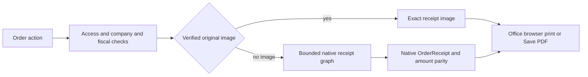

# إيصال نقاط البيع من المكتب — 2026-10-09

## عقد البناء G0–G3 (معتمد للمسار المركّز)

- الطلب المعتمد: الجلسات ← الطلبات ← الطلب ← الترس ← طباعة الإيصال؛ عرض نسخة مطابقة للقالب الأصلي بكل تفاصيله، والطباعة محلياً أو الحفظ PDF من المتصفح، أثناء الجلسة وبعد إغلاقها.
- العمق مركّز: قائد البناء يملك التنفيذ والسجل؛ المراجع المستقل يملك مراجعة المعمارية والبوابات وتطابق الإيصال والصلاحيات. لا مكتبات أو خدمات جديدة.
- المصدر المالي: طلب أودو المحفوظ وخطوطه ومدفوعاته؛ عملية قراءة فقط، بلا تغيير حالة الطلب أو جلسة أو قيد أو إرسال مهمة إلى Agent.
- G1: افتراض استخدام مكتب إداري واحد، 1–5 قارئين متزامنين، طلب واحد لكل معاينة. حجم القراءة مرتبط بخطوط الطلب وعلاقاتها، لا بتاريخ المبيعات أو العملاء الكامل. لا ادعاء سعة جديدة ولا اختبار حمل دون خطر محدد.
- G2: إعادة استخدام مكوّن `point_of_sale.OrderReceipt` مع إضافات بصير والسعودية المثبتة، في صفحة مستقلة لا تفتح جلسة POS ولا تبدأ مزامنة الكاشير. التحقق الخادمي من صلاحيات الطلب والشركة وحالة paid/done/invoiced قبل أي عرض، مع Cache-Control no-store. لا sudo لقراءة طلبات أو عملاء شركات أخرى.
- G3: Odoo 19 / Owl / QWeb والأصول الموجودة. خيار الطباعة يفتح المعاينة التي تستخدم window.print لاختيار طابعة الجهاز أو Save as PDF. لا إنشاء قالب إيصال بديل يكرر الحسابات والتنسيقات.
- G4: إجراء عربي/إنجليزي، عرض RTL/LTR وقالب الإيصال نفسه؛ شريط أدوات خارج الطباعة، عرض ضيق، دعم لوحة المفاتيح. تفاصيل الورقة تعتمد القالب الأصلي.
- قبول: طلب مفتوح الجلسة وطلب مغلق، الأصناف/الملاحظات/الخصومات/الضرائب/الدفعات/الباقي/الهوية/الشعار/QR والتاريخ، رفض المسودة والشركة غير المسموحة، وعدم تغيير أي بيانات أو مهام مطبخ. مراجعة مستقلة قبل مرشح التسليم.
- حدود تاريخية: إعادة توليد القالب الحالي لا يمكنها استرجاع بيانات شركة أو قالب تغيرا بعد البيع دون لقطة أصلية محفوظة. تستخدم الصورة الأصلية عند توفرها إن كانت أنسب للمطابقة، دون اعتمادها أساساً وحيداً للطلبات القديمة.

## دفتر العمليات

قرار المراجع المستقل `receipt_architecture`: G0–G3 معتمدة لبدء التنفيذ بعد قراءة العقد والمصدر. شروط G2 المعتمدة: الصورة الأصلية schema 4 لها الأولوية بعد التحقق من الطلب والشركة وSHA256؛ مسار إعادة التوليد يقارن إجمالي/ضريبة الطلب ومبالغ خطوطه بالقيم المحفوظة ويرفض الاختلاف؛ تحميل رسم علاقات محدود بقائمة مسموحة وحد أقصى، دون خدمات الكاشير أو الكتابة في nb_print أو المهام. استخدام حساب أودو الأصلي في العرض فقط لا يغير سلطة الأرقام الخادمية ولا يضيف قواعد حساب جديدة. لا ترحيل أو تغيير لدقة حقول Odoo الأصلية.

1. قراءة المصدر: تعريفات قوائم الجسر وبصير، ACL، action_reprint، سجل ترحيل 2026-09-24، قالب وتنسيق baseer_pos_receipt_layout؛ ثبت أن مهام الطباعة تخص Agent وليست طباعة المكتب.
2. قراءة التصميم: alpha-build-team ومراجع البوابات والمعمارية والسعة وERP، ملفات Odoo المحلية controller/main.py وpos_session.py وpos_order.py وOrderReceipt وrelated_models وmanifest وdata_service. مسار POS المعتاد يفتح جلسة، لذا مستبعد.
3. المصدر: فرع مستقل `codex/pos-office-receipt` من فرع العمل القائم. هناك تعديلات سابقة كثيرة خارج النطاق؛ تبقى دون تعديل أو إدراج في مرشحنا. ملفات موديولات الإيصال/الجسر/الحزمة المتعقبة سليمة عند البداية.
4. البيئة: فحص Docker للقراءة فقط؛ نسخة محلية للمصدر الحي موجودة على 18095. لا تعديل على نسخة اللايف ولا اعتماد نتائج قبل تنفيذها. المراجع `receipt_architecture` يعمل للقراءة فقط.
5. تنفيذ G5: إضافة إجراء الترس وصفحة Owl مستقلة داخل موديول قالب الإيصال. الصورة الأصلية أولاً، وإعادة التوليد مع تحقق مبالغ خادمي. لا خدمات كاشير ولا طباعة Agent. فحص node --check نجح؛ Python الافتراضي غير متاح، سيستخدم Python الحاوية.
6. مبرر بيئة QA: الفرق مسار عرض مستقل جديد للقالب الأصلي؛ الخطر غير المغطى هو تحميل أصول Owl والتوطين والعلاقات لطلب من جلسة مغلقة، مع صلاحيات الشركة؛ حجم المالك مكتب واحد مفترض و1–5 قارئين. تنسخ قاعدة QA المحلية إلى `baseer_office_receipt_20261009` دون تعديل الأصل، وتشغل على 18097. لا فحص حمل.

## مرشح التنفيذ والمراجعة G4–G8

- المصدر النهائي: فرع `codex/pos-office-receipt-main` من main المعتمد `475ca3edc9c0ac37b2f2857118c8b73631ff2fe7`؛ الجسر الأصلي `19.0.7.8.23` بلا تعديل. الفرع الأول ونسخة المكتب القديمة ليسا مصدر النشر.
- G5: `baseer_pos_receipt_layout` إصدار `19.0.1.1.0`. إجراء form في الترس يفتح صفحة مستقلة، والصورة schema 4 الأصلية أولاً بعد تحقق بصمتها. لا فتح جلسة أو تشغيل خدمات الكاشير أو إرسال مهام طباعة أو تعديل الطلب. البيانات البديلة محصورة بعلاقات الإيصال وتتحقق من الأرقام المحفوظة؛ عدم اكتمال الفاتورة السعودية الموقّعة يمنع العرض بحسب السياسة الحالية.
- G6: على قاعدة QA منفصلة `baseer_office_receipt_20261009`، مرشح الكود النهائي نجح في 10 اختبارات Odoo فعلية: 0 failed / 0 errors. سجل `tmp/office-receipt-candidate-tests-v2.log`. التشغيل الأول لم يحمّل addons ونتيجة 0 tests مستبعدة؛ صُحح مسار الإضافات ثم أعيد الفحص المناسب فقط.
- G7: متصفح اختبار منفصل على localhost:18097 تحقق من الإجراء العربي في الترس وفتح النافذة واستدعاء window.print، وتطابق بايتات الصورة مع أصل JPEG، وعرض المرتجع والتقريب النقدي وQR دون تجاوز عرض 390px. سجل `tmp/office-receipt-ui-accepted.log`، أخطاء الصفحة صفر. PDF الأصلي صفحة A4 واحدة ونهايته كاملة بعد تحجيم تناسبي بحد270mm؛ أدوات المعاينة لا تدخل الورقة. فُحصت الصورة الناتجة من PDF بصرياً.
- الأدلة المحلية: `tmp/office-receipt-evidence/original-copy.pdf` و`accepted-pdf.png` و`backend-print-action.png`؛ عينات مصطنعة فقط، ولا تُضم ملفات tmp للمصدر. تطابق الصورة الأصلية SHA256: `c79a542ac720e33d4554ec0acd991380a63e226be66b3d28afe257b942e022e6`.
- G8: مراجع `receipt_architecture` مستقل للقراءة أصدر GO للمراجعة المركّزة بعد الفحص الساكن ونجاح الاختبارات الحقيقية، مع إكمال فحص PDF الذي اكتمل أعلاه. جاهز لطلب مراجعة المصدر؛ ليس قرار نشر إنتاج. لا تغيير لسياسة الإصدار أو ملفات النشر.
- حدود القبول: الصورة المحفوظة نسخة مطابقة ببياناتها وتنسيقها. الطلب التاريخي دون صورة يُعرض بمكوّن الإيصال الأصلي الحالي ويُرفض عند اختلاف المبالغ؛ لا يمكن ضمان استرجاع شعار أو قالب أو معلومات شركة قديمة تغيرت دون لقطة أصلية. الطباعة الفعلية على جهاز المالك لم تُنفذ في هذه البيئة.

