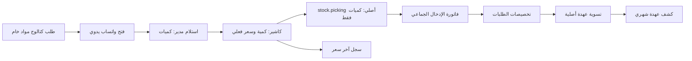

# مراجعة تسليم ألفا — طلبات المشتريات والعهدة (QA)

تاريخ المراجعة: 2026-09-11.  
المرشح: `baseer_procurement_requests 19.0.4.0.0` (PRC-UI1) من شجرة العمل المحلية غير المثبتة في Git، ومثبت بهوية SHA-256 في `docs/releases/2026-09-11-procurement-pos-ui/candidate.json`.  
البيئة: قاعدة QA المعزولة `baseer_procurement_qa_20260911` فقط. لا تشمل هذه المراجعة أوامر نشر أو تغييراً على قاعدة الأصلية.

## خريطة النطاق

مثبت من المصدر: الطلب وسجل السعر والتخصيصات ضمن الإضافة؛ الكميات في `stock.picking` الأصلي؛ الفاتورة والقيود والمصالحة في نماذج Odoo الأصلية.  
قيد معتمد: المخزون **كمي فقط** ولا يحدّث قيمة مخزون محاسبية أو `standard_price`.

## الأدلة والتغطية

| المسار الحرج | الدليل |
| --- | --- |
| كتالوج/واتساب/صلاحية الشركة | إنشاء خادمي محكوم وبحث خادمي من المصدر؛ فحص المستودع والمندوب ضمن الشركة النشطة. |
| استلام مدير ثم كاشير | اختبارات رفض الزيادة، قفل الطلب، وإنشاء سند استلام واحد وسجل سعر واحد. |
| كاشير محدود الصلاحية | اختبار يرفض تعديل السعر أو سجل السعر مباشرة، ويثبت نجاح الإجراء المحمي فقط. |
| دورة الطلب والتدقيق | اختبارات رفض إنشاء حالة مكتملة أو سطر فعلي عبر ORM، ورفض حذف الطلب/السطر بعد المسودة. |
| العهدة والفاتورة | تخصيص 8+12، منع الدفع المباشر، تسوية وعكس وإعادة تسوية، وإقفال فترة محاسبية: ضمن اختبارات الإضافة. |
| القيم الرقمية | اختبار رفض `Infinity` و`NaN` قبل الاستلام وسجل السعر. |
| تشغيل QA | ترقية الموديول واختبارات الإضافة: 10 حالات، 0 فشل و0 خطأ. صفحة الدخول QA ترد HTTP 200. |
| واجهة PRC-UI1 | Playwright على 1280 و390 و360 بكسل، عربي/إنجليزي، بحث وإضافة بلوحة المفاتيح وتدرج كمية وسلة مستقلة على الجوال بلا overflow أو CSS/console/page errors. |
| التزامن والسعة | مكالمتان متزامنتان بنفس UUID أعادتا نفس ID وسجلاً واحداً؛ 10 قراءات متزامنة. أسوأ p95 مرصود مع تشغيل فحوص المتصفح بالتوازي: صفحة 104.59ms، بحث 38.76ms، تسعير 20.88ms. |

## مراجعة الفريق المستقل

- رقيب الجودة/حارس الأمان/الحقيقة الحسابية: لا P0 متبقٍ بعد حراس الإنشاء، الصلاحيات المحدودة، العكس، والقيم غير المنتهية.
- مختبر الرحلات: لا P0 متبقٍ بعد منع الحذف خادمياً؛ سُلّمت شاشة الكاشير، الاستلام، التقرير، العهدة، والتخصيص.
- حارس البيانات والسعة: الكتالوج صار بحثاً خادمياً بدفعات 80؛ لا ادعاء بقياس حمل واسع.

## القيود المتبقية

1. لا توجد هوية Git/commit للمرشح لأن شجرة العمل الحالية لا تحوي `HEAD`؛ عوضها مرشح QA مؤقتاً ببيان 20 ملفاً وبصماتها، لكن يلزم commit قبل أي ترقية إنتاجية.
2. قبول المستخدم الفعلي على جهازه هو خطوة UAT بعد مشاركة رابط QA، وليس مانعاً لمعاينة QA.
3. تقييم المخزون المحاسبي الفوري خارج النطاق المعتمد؛ يتطلب عقداً جديداً لتوزيع الفاتورة الإجمالية على الأصناف.

## القرار

**GO لمعاينة وقبول المستخدم على QA فقط.**

لا يوجد P0 أو P1 مانع في نطاق QA الكمي والعهدة أو PRC-UI1. المراجع العام أقفل G4/G5/G6 كـGO بعد إثبات بصمات المصدر، صورة Odoo المثبتة، mounts المقروءة فقط، وغياب أي فرق في POS/Odoo core. لا يوجد قرار إطلاق للأصلية قبل تثبيت مرشح Git وإجراء قبول المستخدم واتباع مسار نشر مستقل.
