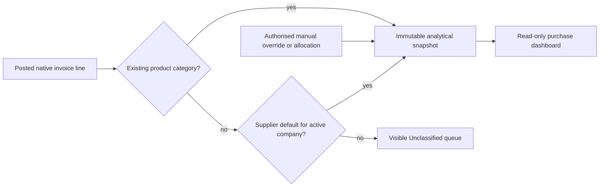

# PCL-001 — Supplier-assisted purchase classification

Status: **Build candidate authorised; production dashboard and historic writes remain blocked pending review.** Classification: **ARCHITECTURAL**. Reference: `docs/architecture/registry/INDEX.md`; published dashboard candidate `f54d83b`.

## G0 — build contract

- **Goal:** classify historic supplier invoices that have no meaningful product category, and classify future supplier purchases consistently, without altering posted accounting, tax, payments, products, or stock.
- **Users:** accounting manager owns defaults, historical review and corrections; authorised accountant may make a permitted draft-line override; cashier has no administration or correction access.
- **Existing capability to reuse:** `baseer_purchase_batch` already owns a company-scoped default on the supplier: `res.partner.baseer_purchase_category_map_id → baseer.purchase.category.map → product.category`.  It is a useful suggestion source, not a historical reporting authority.
- **Out of scope:** guessing from a supplier name, copying tax/accounting tags, modifying historic `account.move`, `account.move.line`, product categories, taxes, journal entries, payments, or creating synthetic stock/products merely to make a chart non-empty.

### Authoritative classification order

1. Explicit analytical override on the invoice line.
2. Explicit approved allocation for a mixed line, whose percentages total exactly `100.00%`.
3. Native product category where a proper product category exists.
4. Active company-specific supplier default, captured at posting time.
5. `Unclassified` visibly, never silently guessed.

The purchase amount, currency, VAT and refund sign always remain those of the native invoice line.  A classification record owns only the classification and its audit metadata.

### Approved two-axis design (PCL-007)

- **Management taxonomy:** the supplier's existing company-specific **Default Purchase Category** is the source of the classification. Its native Product Category parent/child hierarchy is used for reporting roll-up: the parent is the primary grouping and the child is available beneath it. Contact Tags remain contact metadata only and are never an analytical source.
- **Reporting type:** every configured reporting category is independently typed as `purchase`, `expense`, or `excluded`; it is not inferred from the tag name or made a root of the Contact Tag tree.
- **Snapshot authority:** a posted supplier-bill line receives an immutable analytical snapshot. It records the reporting type and tag hierarchy selected at that time; changing a supplier tag later cannot rewrite prior reporting.
- **Direct path:** reuse the existing `baseer_purchase_classification` candidate and Odoo ORM/views/security. No third-party package, no change to `account.move`, `account.move.line`, taxes, payments, stock, products, or native posting.

### G0 cycle, accounting controls and acceptance

| Item | Approved contract |
| --- | --- |
| Future invoice path | Posted supplier-bill line is classified from native product category when meaningful, otherwise from an active company-scoped approved supplier-category rule; a multi-purpose supplier must be explicitly classified or allocated, never guessed. |
| Historic path | Manager receives a read-only, company/month-bounded preview. An approved run creates analytical snapshots only and is idempotent; source accounting is not edited. |
| Financial authority | `account.move.line` remains authority for amount, tax, currency, refund sign and posting state. The classification layer holds no balance and creates no journal entry. |
| Roles | Accounting manager configures rules, previews and approves bounded historical runs. Accountant can read; cashier cannot configure, classify or correct. |
| Correction | Snapshots are immutable. A later correction is a versioned analytical record with actor/time/reason; it never overwrites a posted source line. |
| Acceptance | Company isolation; no duplicate source-line snapshot; classified + unclassified equals the native scoped source total; visible excluded total; Arabic/English and mobile/desktop management UI; all source records byte-for-byte unchanged by a run. |

### G1 capacity and continuity profile

The initial operating assumption is 10 internal reporting users, up to 3 concurrent accounting managers, monthly historic previews constrained to 500 source lines, and at least 250,000 retained supplier-bill lines across companies. The critical reads are a company/month preview and dashboard aggregation; all remain backend-scoped and indexed by company, source line and invoice date. Historical writes use a unique source-line identity and row locking; the first wave is one company/month with an explicit recovery receipt. These are conservative design assumptions, not a production capacity claim; measured isolated evidence is required before release.

### G2 data and lifecycle contract

1. **Reporting rule registry:** `baseer.purchase.reporting.rule` is company-scoped and uniquely identifies either a supplier's existing `baseer.purchase.category.map` default or a native Product Category. Every rule selects one active company category map, whose Product Category is the reporting child and whose parent is the reporting group. The unique identity is `(company, target_kind, target_id)`. Every rule stores the approved reporting type (`purchase`, `expense`, `excluded`), category parent/child identity, activation state and audit metadata. Contact Tags are not read by this feature. Rules do not change a supplier, product, category or financial document.
2. **Case, immutable snapshots and allocation legs:** one `baseer.purchase.line.classification.case` exists per eligible native source line. It points to its latest immutable snapshot. Each snapshot has an increasing version, decision source and reason. A snapshot owns one or more immutable allocation legs; each leg stores the rule/type/leaf/parent identity and the exact percentage in integer basis points (`0..10000`), so percentages are precise to two decimals and must total exactly `10000`. A fully unclassified snapshot is represented by one `unclassified` leg, not an omitted record. The analytical dashboard always derives a signed VAT-inclusive gross amount from the native source line exactly once. It allocates server-side using `Decimal` and the source currency rounding: all ordered legs except the final stable leg are rounded individually; the final leg receives the signed native remainder. Therefore all allocated legs reconcile exactly to the source amount for bills, refunds and currencies with non-standard decimal rounding, without making an allocation amount a financial authority.
3. **Source eligibility:** only posted vendor bills/refunds (`in_invoice`, `in_refund`) and their product display lines are considered. Section, note, tax, payment, receivable/payable and rounding lines are excluded. Native product category is a decision source only after an explicit company-scoped reporting rule exists for it; Odoo's generic root category is never treated as meaningful. No inference is made from a supplier name.
4. **Future lifecycle:** snapshot creation runs inside the successful native posting transaction, after Odoo has created the posted source lines. It creates a new snapshot version: manager-approved override/allocation first; otherwise an approved product rule; otherwise an approved rule for the supplier's active company-specific Default Purchase Category; otherwise one visible unclassified leg. If the snapshot cannot be created, the entire posting transaction fails and rolls back, so no posted bill can silently lack an analytical case. The internal hook is idempotent by source-line case and cannot be called through a public create route. Reset/repost and manager corrections create later immutable versions and update only the non-financial case pointer after all legs pass validation. A refund is a separately classified native source line and retains its native sign. Dashboard queries only posted native lines joined to their case current snapshot.
5. **Supplier ambiguity:** a supplier with no active company-specific Default Purchase Category, or with a default that has no active approved rule, receives an unclassified snapshot unless an authorised manager supplies an explicit rule/allocation. No category is guessed from a Contact Tag or supplier name.
6. **Access, concurrency and receipt:** company derives server-side from the source line; manager-only configuration, preview, historical run, override/allocation and correction in v1; accountant read-only; cashier has no access. Source ACLs/rules are applied before any read. A unique case key, row lock and bounded company/month run prevent duplication. Every historical run records its exact scope, counts and reconciliation result; it creates analytical records only.

### Existing-candidate recovery decision

The pre-existing `baseer_purchase_classification` candidate is not approved for use as-is. It is retained only as a starting point for its safe read-only bounded-run concepts; it must use the existing company-specific purchase-category map rather than Contact Tags before isolated testing.

### G3 stack decision and G4 experience contract

- **G3:** reuse Odoo 19 ORM, native account document lifecycle, Odoo list/form/search views, existing `account` and `baseer_purchase_batch` dependencies. No client library, reporting library or external service is added. The direct path is a small modular-monolith addon because the data is company-scoped, transactional and already lives in Odoo.
- **G4:** management uses native responsive list/form/search screens: Rules, Cases, Snapshots and bounded Historical Runs. The dashboard groups amounts by the category parent and exposes its child categories beneath it. Arabic and English labels are translatable; RTL/LTR are native Odoo responsibilities; money, dates, counts and basis-point percentages are formatted by server-owned contracts using Western digits. The first candidate has no custom visual component or animation. It supplies explicit empty, access-denied, validation and reconciliation states; narrow screens use standard Odoo form/list presentation without a feature-owned fixed-width grid.

## Proposed architecture (G2 draft)

Create one independent owner module, proposed name `baseer_purchase_classification`.

- One analytical snapshot per eligible invoice line, with `company_id`, supplier, category, source (`product`, `supplier_default`, `line_override`, `allocation`, `unclassified`), original rule, actor/time/reason and an immutable correction/version trail.
- Unique source-line identity, company record rules and server-derived active company; no dashboard-side inference and no `sudo` expansion.
- The dashboard reads the snapshot for category grouping but retains the native invoice line as the sole amount authority.
- Supplier-default changes affect only subsequently posted invoices.  A historic record stays unchanged until an authorised, reasoned correction creates a later audit version.

## Historical-data procedure

1. Read-only inventory: group uncategorised posted purchase/refund lines by company, supplier, date and amount; detect suppliers whose history spans more than one intended category.
2. Configure/review the existing company-scoped supplier defaults.  A clearly single-purpose supplier can provide a proposal; multi-purpose suppliers stay in the review queue.
3. Preview the result: proposed category totals, remaining `Unclassified`, document/line count, and refund impact.  The accounting manager explicitly approves a bounded company/period batch.
4. Run an idempotent, company-locked migration that creates analytical snapshots only.  It must not write source invoice/product/accounting fields.
5. Reconcile: native purchase total before and after is identical; sum of classified allocations plus `Unclassified` equals the native total; retain the run receipt and audit trail.
6. Start with one company/month, then widen only after review.

## Future-data procedure

- For normal new purchases, the existing supplier default pre-fills the category only when a product category is absent.
- For invoices that have true products, use the product category first.
- Require an explicit category or allocation for a supplier marked multi-purpose; do not post a silent supplier guess.
- Capture the result at posting in the analytical snapshot; changes to supplier setup cannot rewrite history.

## Gates and acceptance

| Gate | Status | Evidence needed before approval |
| --- | --- | --- |
| G0 | Under independent review | Owner approved the two-axis design; contract, authority and acceptance are recorded above. |
| G1 | Under independent review | Bounded company/month processing, 500-line cap, recovery receipt and conservative capacity profile are recorded above. |
| G2 | Conditionally accepted for isolated candidate | Two-axis target registry, immutable versions/allocation legs, precise rounding/remainder policy, atomic posting lifecycle, source scope, ambiguity, company rules and bounded-run receipt are specified above. Production data, dashboard consumption and historic writes remain blocked pending candidate tests and delivery review. |
| G3 | Conditionally accepted for isolated candidate | Reuse Odoo 19, existing `account`/`baseer_purchase_batch` and native views; no library or external service. |
| G4 | Conditionally accepted for isolated candidate | Native responsive manager screens, translated labels and server-owned numeric formatting; independent visual check remains required. |
| G5 | Candidate dashboard adapter verified | The read-only dashboard consumes current immutable snapshot legs, groups by parent category and exposes child detail. |
| G6–G8 | Not started | Historical rehearsal, reconciliation, delivery review and then release decision. |

## Decisions

| ID | Decision | Why |
| --- | --- | --- |
| PCL-001 | Supplier category is a default suggestion, never a timeless reporting lookup. | A supplier can sell more than one kind of item. |
| PCL-002 | Keep classification separate from posted accounting documents. | Preserves financial auditability and avoids silent historic mutation. |
| PCL-003 | Reuse the existing supplier default/category-map setup. | It avoids a duplicate configuration surface. |
| PCL-004 | Historic classification is previewed and approved in bounded batches. | It makes uncertainty visible and permits reconciliation/rollback. |

## Proposed supplier-classification tree (owner review required)

The current 56 supplier tags are mostly detailed leaves, not useful reporting parents.  The proposed normalised reporting tree has nine parents.  A supplier is assigned to a leaf only; its parent is derived for roll-up reporting.

| Reporting parent | Proposed child tags |
| --- | --- |
| Food and beverages | بضاعة تموينية، خضار وفواكه، دجاج، شحم، قهوة بن، لحوم، مشروبات، مواد غذائية، مواد غذائية أخرى، مياه |
| Packaging and operating supplies | أكياس، بلاستيكات، تعبئة وتغليف، خامات، علب وأكواب، غازيات، مستلزمات تشغيل مطبخ |
| Shisha and tobacco | شيشة، معسل، فحم |
| Facilities and logistics | إيجارات، كهرباء، غاز طبخ، وقود ومواصلات، مقدمو الكهرباء، مقدمو المياه |
| Assets and maintenance | أثاث، أجهزة وإلكترونيات، أصول ومعدات، معدات مكتبية، قطع غيار، صيانة آلات، صيانة سيارات، صيانة وترميم، صيانة وتشغيل |
| People and workforce | التأمينات الاجتماعية (GOSI)، تأمين طبي، إقامات وجوازات، تذاكر سفر الموظفين، رواتب وأجور، منصة قوى |
| Government and compliance | الجهات الحكومية، المنصات الحكومية، رخصة بلدية، رخصة تجارية، رسوم منصات حكومية، ضرائب ورسوم أخرى، غرامات |
| Professional, digital and marketing services | اتصالات، مقدمو الاتصالات والإنترنت، رسوم إدارة حساب، رسوم تطبيقات، تسويق وهدايا |
| Review / excluded from operating-purchase analysis | قروض، فواتير نقدية صغيرة |

`مقدمو الخدمات` is a supplier-type umbrella in the existing data, not a financial category in the reporting tree.  `قروض` and `فواتير نقدية صغيرة` need an accounting-owner decision before inclusion in purchase-to-sales analysis; they must not be silently treated as operating purchasing.

## Operations log

| ID | Time (Asia/Riyadh) | Type | Result |
| --- | --- | --- | --- |
| PCL-001 | 2026-09-15 | G0 discovery | The purchase dashboard currently groups `account.move.line` by native product category. Existing production has company-scoped category maps and seven supplier defaults, but historic invoice products lack categories. No application or production-data change was made. |
| PCL-002 | 2026-09-15 | Independent review | Alpha ERP and architecture reviewers rejected supplier-as-the-only-source and recommended an immutable analytical snapshot, supplier default proposals, reviewable historic batches, company isolation and audit corrections. |
| PCL-003 | 2026-09-15 | G0/G1 read-only inventory | Owner authorised the first historical wave: suppliers with exactly one existing supplier classification only. Production inventory found 205 such suppliers, 2,186 eligible uncategorised product lines and gross `SAR 1,613,241.34` across the active historical companies. Multi-tag suppliers and three untagged lines are excluded. No production data changed. |
| PCL-004 | 2026-09-15 | G0 taxonomy proposal | Current supplier-tag tree was inspected: 56 tags, of which 51 are roots and five are children of a supplier-type umbrella. A nine-parent reporting map was drafted; it is not yet applied to production tags or invoices. |
| PCL-005 | 2026-09-15 | ERP/UI baseline and first controlled wave | The production Contacts app's native **Contact Tags** screen was used. It confirmed that the nine proposed reporting parents did not exist. Two roots were then created there: `الأغذية والمشروبات` and `التعبئة ومستلزمات التشغيل`. No supplier was assigned, no existing leaf tag was moved, and no invoice, accounting, product, tax, or payment record was changed. The screen now contains 58 tags. |
| PCL-006 | 2026-09-15 | ERP/UI supplier-tag hierarchy | The nine approved reporting parents now exist in the native production Contact Tags screen. All 55 mapped detailed tags were verified as direct children of their intended parent; `مقدمو الخدمات` deliberately remains a standalone supplier-type tag. The final screen contains 65 tags. This changes tag hierarchy only: no supplier assignment, invoice, accounting, product, tax, payment, stock, or dashboard data was changed. Dashboard consumption and historic analytical classification remain explicitly pending owner review. |
| PCL-007 | 2026-09-15 | G0/G1 candidate reopening | Owner authorised the two-axis analytical design: management taxonomy plus `purchase`/`expense`/`excluded` reporting type. The live tag hierarchy remains configuration only; the candidate must preserve native invoice lines as the financial authority and cannot write historic accounting. G0/G1 were reopened for independent review before implementation. |
| PCL-008 | 2026-09-15 | G2 contract and candidate recovery | Independent Alpha reviews found that the existing candidate lacks reporting type/versioned allocations and contains an English tag-tree writer that must not run against the Arabic production hierarchy. G2 now defines the separate company rule registry, immutable case/snapshot/allocation model, source lifecycle, exact ambiguity handling and bounded run receipt. No candidate or production database has been written. |
| PCL-009 | 2026-09-15 | G2 independent conditions resolved | Alpha architecture and ERP reviews required a typed product-category rule, exact monetary allocation/remainder policy, atomic posting failure handling, manager-only v1 corrections and VAT-inclusive native-line metric. The contract now resolves all five. G2 is conditionally accepted only for an isolated candidate; no live dashboard/historical run is authorised. |
| PCL-010 | 2026-09-15 | G3/G4 candidate decision | The direct path reuses Odoo 19 ORM, native posting lifecycle and responsive list/form/search views. No dependency, external service, client analytics calculation or custom animation is authorised. The candidate management screens use the existing Odoo design system; isolated visual and bilingual checks remain required. |
| PCL-011 | 2026-09-15 | Verification | First isolated install exposed an XML schema incompatibility in the configuration search view (`group expand`). Removed the unsupported presentation attribute; no production database, source transaction, dashboard, or live configuration was touched. | Candidate-only | Re-run the isolated module test suite. |
| PCL-012 | 2026-09-15 | Verification | The isolated behavioral suite then exposed that Odoo 19 `action_post()` returns an action boolean, not the posted recordset. The hook now derives its posted moves from `self` after the native call and preserves the native return value. | Candidate-only | Re-run the isolated behavioral suite. |
| PCL-013 | 2026-09-15 | Candidate test | Fresh isolated upgrade plus 4 focused behavioral tests passed: exact supplier rule, explicit product-category priority, visible unclassified fallback, refund isolation, immutable snapshots and cashier configuration denial. Python compilation and whitespace validation also passed. | Candidate-only | Owner review of reporting-type mapping; historical run, dashboard consumption and production release remain blocked. |
| PCL-014 | 2026-09-15 | Production taxonomy correction | Owner-directed native Contact Tags edit: renamed the parent `الجهات الحكومية والامتثال` to `جهات حكومية`; moved `التأمينات الاجتماعية (GOSI)` to that parent; and moved `غازيات` to `الأغذية والمشروبات`. The refreshed live list confirmed all three relations. No supplier assignment, invoice, account, tax, payment, product, stock, dashboard or candidate-release change was made. | Live taxonomy only | Stop for owner review. |
| PCL-015 | 2026-09-15 | Production taxonomy clarification | The owner clarified that `التأمينات الاجتماعية (GOSI)` belongs under the distinct parent `رسوم حكومية`, not directly under `جهات حكومية`. Created that one root and moved GOSI beneath it. A refreshed live list confirmed `GOSI → رسوم حكومية`, `غازيات → الأغذية والمشروبات`, and the root `جهات حكومية`. PCL-014 is superseded only for the GOSI parent relation. No supplier assignment, invoice, account, tax, payment, product, stock, dashboard or candidate-release change was made. | Live taxonomy only | Stop for owner review. |
| PCL-016 | 2026-09-15 | Production taxonomy refinement | After reviewing the Noorix reference, the owner approved the employee-cost classification. Renamed the existing parent `الموظفون والقوى العاملة` to `تكاليف الموظفين والتزامات نظامية` and moved `التأمينات الاجتماعية (GOSI)` beneath it. The refreshed live list confirmed the parent plus GOSI, employee insurance, tickets, wages, Qiwa and iqama children. PCL-015 is superseded only for the GOSI relation; its temporarily created `رسوم حكومية` root remains unused and was not deleted. No supplier assignment, invoice, account, tax, payment, product, stock, dashboard or candidate-release change was made. | Live taxonomy only | Review any future use of the unused root before removal. |
| PCL-017 | 2026-09-15 | Production taxonomy cleanup | Owner-authorised deletion of the empty root `رسوم حكومية` and the redundant leaf `الجهات الحكومية` beneath `جهات حكومية`, performed through the native live Contact Tags screen. A refreshed list confirmed 64 tags and neither deleted tag remains. | Live taxonomy only | Continue with the approved taxonomy review when requested. |
| PCL-018 | 2026-09-15 | Live Contact-Tag review | Native Contacts grouped by tag render parent/leaf paths for contact metadata. This is read-only evidence only; Contact Tags are not the source of the supplier's Default Purchase Category. The `لا شيء` group contains 11 untagged contacts and is outside the purchase-category work. | Read-only | Ignore these contact tags unless separately requested. |
| PCL-019 | 2026-09-15 | G0/G2 contract revision | Owner clarified that the analytical source is the supplier's company-specific Default Purchase Category, not a Contact Tag. The direct design uses its native Product Category hierarchy: parent as the main report group and child as the drill-down/detail. Contact Tags, supplier records, products and native accounting rows remain unchanged by the classifier. G0/G2 and G4 are reopened for the candidate refactor and isolated verification. | Candidate only | Verify the refactored source in an isolated database before any dashboard or historic-data release. |
| PCL-020 | 2026-09-15 | Candidate refactor and G5 check | Refactored `baseer_purchase_classification` to read only the supplier's active company-specific Default Purchase Category map; removed Contact Tag fields from the analytical rules and snapshot legs. Each leg now records the Product Category parent and child, and the manager UI exposes a grouped parent/child allocation view. Fresh isolated upgrade and four focused lifecycle/security tests passed (`0 failed, 0 errors`); Python compilation and a scan confirming no Contact Tag analytical fields remain also passed. No live module, dashboard, supplier, invoice, product category or historical record was changed. | Candidate only | Add the read-only dashboard adapter and complete isolated acceptance before release review. |
| PCL-021 | 2026-09-15 | Candidate dashboard adapter | Recovered the deployed purchase dashboard only into the isolated candidate and made it depend on the classifier. Its category query now reads the current immutable classification leg for each native posted product line, uses the native line only for gross amount authority, groups by Product Category parent and renders child categories beneath it. A missing snapshot stays visibly `Unclassified`; the dashboard never re-reads a supplier's current default for old invoices. Fresh isolated upgrade ran 10 focused tests across both modules with `0 failed, 0 errors`; Python compilation and whitespace validation passed. No live module, supplier, invoice, product, category or historical record was changed. | Candidate only | Perform the owner visual check, then historical preview/reconciliation rehearsal and independent delivery review before any release. |
| PCL-022 | 2026-09-15 | Production defect discovery and G0–G3 reopening | The published dashboard visibly returned `Unclassified` for historic bills. Read-only production evidence: `0` reporting rules, `7` supplier default maps, `0` analytical cases and `0` snapshots. The native supplier-tag hierarchy is therefore not currently consumed by the classifier. The owner’s earlier rule is clarified for the historic path: a supplier with exactly one assigned leaf tag under the approved parent/child hierarchy may create one immutable analytical snapshot in a manager-approved bounded run; suppliers with multiple, root-only or no tags remain visibly unclassified. The run creates no product, changes no partner/tag, invoice, line, tax, journal entry, payment or stock record. It stores the selected tag parent/leaf names and identifiers in the immutable analytical leg, so later tag edits do not rewrite history. The direct path reuses Odoo ORM and the existing classifier/dashboard without dependencies; each preview/run is capped at 500 eligible lines per company/date range, is company-locked and idempotent by source line. | Candidate only; no live historical write authorised by this log entry. | Implement native manager preview/apply screens, access rules and tests; rehearse a bounded preview before any production apply. |
