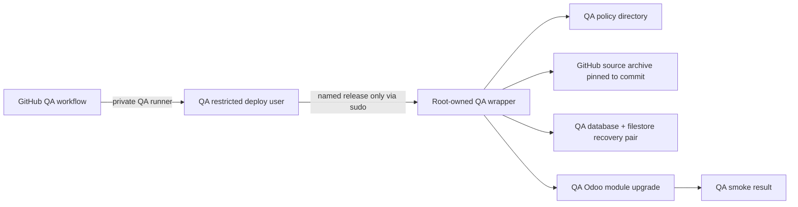

# QA GitHub deployment — build contract

**Scope:** QA only.  This contract never authorizes a production deployment,
production credential, production database, or a change to a production
workflow.

## G0 — governance and journey

The owner needs to deploy a reviewed Baseer Odoo candidate to QA from GitHub
without an interactive Hostinger terminal.  The critical journey is:

1. An authorized maintainer dispatches a named QA release from `main`.
2. A restricted GitHub runner on the QA host runs only the reviewed QA job.
3. A root-owned QA wrapper verifies the named policy, fetches the pinned
   commit, takes a database + filestore recovery pair, and upgrades only the
   policy's allowed modules.
4. The wrapper reports a machine-readable result; failure restores the
   recovery pair and previous source release.

### Acceptance criteria

- A QA workflow cannot run on or reach the production runtime, or use a
  production key.
- It accepts only a reviewed, named policy in `ops/qa/release-policies`.
- The QA host, exact database name, Docker project, port, source key, and
  known-host key are configured only on the QA host/GitHub environment; they
  are not committed.
- The first policy will permit `baseer_pos_print_bridge` only, pinned to the
  already merged candidate `b75be6fba5fdea398e9e7f281a4ca04f23093c85`.
- Before any QA module upgrade, a coherent database + filestore restore pair
  exists.  A failed upgrade restores that pair; there is no module downgrade.
- The workflow produces a bounded, auditable success/failure result and has a
  single deployment concurrency lock.

### Out of scope

- Installing SSH keys, a root-owned wrapper, or source credentials on the QA
  host; that is a one-time host bootstrap and cannot safely be inferred from
  a source repository.
- Changing production, its `production` environment, or
  `PRODUCTION_SSH_KEY`.
- POS data, printer/agent settings, orders, payments, stock, or accounting.

## G1 — capacity and continuity

This is a low-frequency operator workflow: assume one deployment at a time,
at most a few dispatches per day.  The critical workload is source checkout,
backup, one Odoo module upgrade, and smoke check.  GitHub Actions uses one
QA-specific concurrency group; the QA wrapper additionally takes a host lock
so a manual invocation cannot overlap it.

The recovery boundary is a pair of the QA PostgreSQL database and its matching
filestore plus the prior source release identifier.  The deployment wrapper
must verify the archive digests before a restore.  It must not run a wide
backup cleanup policy during a deployment.  Runner logs contain only release
IDs and status values, never credential material, database URLs, or Odoo
passwords.

## G2 — architecture and trust boundary

- GitHub is a dispatcher only.  It never sends a shell string or module list
  supplied by a user directly to the host.
- The QA host owns the effective policy and validates the release identifier,
  policy revision, commit, allowed modules, prior-source ancestry, and source
  paths before stopping Odoo.
- The policy names a precise commit and a fixed module allowlist.  Candidate
  source changes outside the allowlist cause a fail-closed exit.
- `qa` is a separate GitHub environment and its private runner has the unique
  `baseer-qa` label. It cannot read a production secret or run production
  workflows. Production workflow files are not reused or called.
- Odoo remains the source of truth for operational data.  This workflow only
  upgrades source modules and never imports QA fixtures or mutates business
  rows deliberately.

**Direct-path decision:** reuse the reviewed production release pattern with
separate QA names, keys, host policy directory, lock, and environment.  A
generic remote-command workflow is rejected because it would let a workflow
input become server authority.  Reusing the production key is rejected because
it would erase the QA/production trust boundary.

## G3 — technology and verification

No packages, UI library, or Odoo dependency are added.  The implementation is
GitHub Actions YAML plus POSIX shell using the existing Odoo/Docker/Git
deployment conventions.  Verification will run `bash -n`, `git diff --check`,
the repository source-integrity workflow, and a QA-only dry validation after
the one-time host bootstrap.

## G4 — operator experience

The operator-facing interface is GitHub Actions.  It has exactly two required
inputs: a bounded QA release ID and the confirmation word `DEPLOY_QA`.  The job
name and result distinguish QA clearly from production.  No mobile browser
layout is owned by this repository; GitHub's native responsive interface owns
that experience.

## Gate log

| Gate | State | Evidence |
| --- | --- | --- |
| G0 | accepted | This scope, isolation boundary, journey, and acceptance criteria. |
| G1 | accepted | Bounded low-frequency workflow and recovery-pair design above. |
| G2 | accepted | Separate QA trust boundary and policy-owned contract above. |
| G3 | accepted | Existing GitHub Actions/POSIX/Docker stack; no dependency added. |
| G4 | accepted | Native GitHub dispatch form with explicit QA status. |
| G5 | implemented; verification pending | Bounded dispatcher, approval wrapper, deployment wrapper, and QA-only policy are present. |
| G6–G8 | pending | Requires QA-host bootstrap, dry deployment, recovery proof, and independent delivery review. |

## Live log

| ID | Stage | Type | Result and evidence |
| --- | --- | --- | --- |
| QAD-001 | G0–G4 | decision | Owner authorized a QA-only GitHub deployment path after confirming that interactive QA terminal access is unavailable. Production remains excluded. |
| QAD-002 | G0–G3 | inspection | Reviewed the existing production workflow/wrappers and GitHub repository environments. Only `production` and `PRODUCTION_SSH_KEY` exist; no QA host credential is present. The implementation must fail closed until an independent QA bootstrap supplies QA-only credentials. |
| QAD-003 | G5 | implementation | Added the QA-only GitHub dispatcher, root-owned policy/deployment wrappers, bootstrap installer, pinned bridge-only policy, and source-integrity shell validation. Static validation is `bash -n` for all wrappers, YAML parsing for all workflows in the pinned Odoo image, and `git diff --check`. No host, QA database, QA secret, or production resource changed. |
| QAD-004 | G5 | security correction | Independent review found that root could execute mutable QA compose/env files. The deploy path now accepts only fixed `/etc/baseer-qa` root-owned, non-group/non-other-writable files, requires the QA-only base/database/runtime namespace and loopback health URL, and bootstrap rejects a deploy user with supplementary privileges. PR CI now parses changed workflow YAML and runs a policy/shell static guard whenever QA deployment source changes. |
| QAD-005 | G5 | architecture correction | QA is reachable only through its private network, so a hosted GitHub runner cannot safely SSH to it. The dispatcher now uses a restricted, QA-labelled self-hosted runner under the limited deploy account. This removes public-host/SSH secrets from GitHub while preserving the root-owned allowlist and recovery boundary. |
