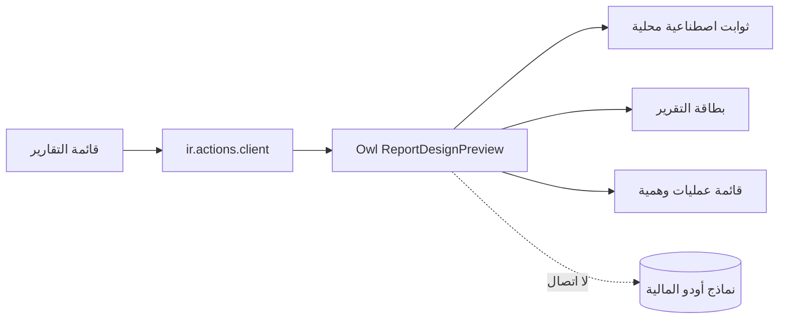

# أساس تصميم تقارير بصير، معاينة غير مرتبطة

معرّف الأثر: `REPORT-UI-PREVIEW-20261006`
أساس المصدر: `official/main` عند `0e6d30b8269a48a030befdc480ea91a43744525b`
التصنيف: `CONTROLLED`، واجهة مستقلة في Odoo، بلا تغيير مصدر بيانات أو حساب مالي.

## G0: عقد البناء وخريطة الرقابة

- الهدف: بناء أساس واجهة تفاعلي يُراجع بصريًا قبل ربط تقارير الربح والخسارة، الضريبة، رسوم التبغ، ودفتر الأستاذ ببياناتها الحقيقية.
- المستخدم: صاحب النظام ومراجعو التقارير؛ المعاينة في قائمة منفصلة بعنوان صريح «معاينة تصميم التقارير، بيانات تجريبية» ولا تحل محل أي تقرير قائم.
- الرحلة: فتح المعاينة ← تبديل التقرير والفترة المرئية ← تمرير المؤشر أو التركيز على سطر ← فتح مجموعة داخل الجدول ← «عرض العمليات» في قائمة تجريبية كاملة العرض مع مسار رجوع.
- الشكل المعتمد من صور المالك: شريط خيارات أودو أعلى الصفحة، تنبيه سياقي، بطاقة تقرير بيضاء متوسطة العرض ومتمركزة، تدرج أقسام وصفوف وإجماليات، لون أحمر للخارج/السالب وصفر هادئ. العربية RTL والإنجليزية LTR، وأرقام غربية `0–9`.
- القبول: تعمل أدوات المعاينة والفتح والعودة بلوحة المفاتيح واللمس؛ لا تتطلب `hover` للعمل؛ تظهر علامة «بيانات تجريبية» طوال الرحلة؛ الأزرار غير المربوطة مثل PDF/XLSX غير مفعلة بوضوح.
- خارج النطاق: ORM/RPC مالي، قواعد VAT أو التبغ، قيود حقيقية، فلاتر محفوظة في قاعدة أودو، تصدير فعلي، تعديل التقارير الحالية، وترقية الإنتاج. لا تُستنتج صحة مبالغ العينة من هذه المعاينة.
- خريطة الدورة المحاسبية: المعاينة لا تنشئ مستندًا أو قيدًا، ولا تقرأ `account.move.line` أو `pos.order`، ولا تؤثر في الاعتماد أو الترحيل أو الإقفال أو التصحيح. تبقى سلطات التقارير الحالية دون تغيير؛ أي ربط لاحق يفتح G0–G3 مجددًا بمراجعة ERP.

## G1: السعة والاستمرارية

- افتراضات المعاينة: أربع شاشات، بحد 30 صفًا تجريبيًا ظاهرًا لكل شاشة، وعمق فتح لا يزيد على مستويين، و40 سطرًا في قائمة العمليات الوهمية؛ لا حفظ أو نمو بيانات. أصول الموديول المستهدفة أقل من 150 KiB قبل ضغط Odoo. تُقاس الأصول بعد البناء ولا يُقدَّم الرقم كإنجاز قبل القياس.
- افتراض استخدام المعاينة: حتى 10 مراجعين متزامنين، وكل التبديل/التوسيع محلي داخل المتصفح. لا عمليات قراءة/كتابة بيانات أعمال خادمية، ولا مهام خلفية أو إعادة محاولة؛ طلبات Odoo العادية لفتح action/assets مستثناة. لا ادعاء بسعة محرك التقارير الحقيقي.
- هدف قابل للفحص على حاسوب QA المعتاد: تفاعل تبديل التقرير أو فتح الصف يظهر خلال 200 ms بعد حدث المستخدم، وفتح أولي خلال 2 s بعد اكتمال تحميل أصول Odoo؛ يسجل القياس الفعلي والبيئة قبل قبول المرشح. عند ربط البيانات لاحقًا، يُعاد G1 لأحجام القيود، التزامن، حدود الصفحات والزمن والاستعادة.

## G2: الحدود والعقود

خريطة المعاينة، مثبتة من ملفات الإضافة الجديدة؛ خطوة تثبيت Odoo في QA لم تُنفّذ بعد:

- Addon اختياري مستقل `baseer_report_ui_preview` يملك وحده action/menu/assets/fixtures. يعتمد Odoo `web` و`account` للتنقل فقط. لا يرث عارض ERP Heritage ولا يستورد نماذج تقارير الضريبة أو التبغ.
- `ir.actions.client` يعرض مكوّن Owl مسجلًا في action registry. حالة الفلاتر، التقرير المختار، الصفوف المفتوحة، وقائمة العمليات كلها داخل الذاكرة في المتصفح، من بيانات نموذجية ثابتة. لا `orm`, `rpc`, `fetch`, controllers, models, schema أو صلاحيات بيانات جديدة.
- قائمة المعاينة تحت `account.menu_finance_reports`، بمجموعات `account.group_account_readonly,account.group_account_user,account.group_account_manager` مثل نمط تقرير الضريبة الحالي. علامة المعاينة موجودة في رأس التقرير وقائمة التفاصيل؛ لا روابط إلى قيود حقيقية. جميع أسماء وأرقام العينة مصطنعة وغير منسوخة من الصور أو QA أو عميل أو فاتورة حقيقية.
- شريط الفلاتر هنا محاكاة للتفاعل وليست فلاتر `ir.filters` الأصلية؛ حفظ الفلاتر الحقيقي والتوافق مع الحسابات/PDF قرار وربط لاحق. لا نقل معادلات أو أرقام إلى العميل في مرحلة الربط.
- CSS محصور بنطاق الموديول، ولا يغيّر أصول Odoo العامة أو تطبيقات QA الأخرى. الرجوع: إلغاء تثبيت المعاينة أو إزالة الإضافة من QA بعد حفظ المصدر؛ لا بيانات أعمال لترحيلها.

## G3: التقنية والمسار المباشر

- استخدام Owl وBootstrap و`Dropdown` المضمّنة في Odoo 19، بلا مكتبة UI أو حزمة جديدة. يثبت الإصدار المحلي من manifest بصير `19.0.*`، وصورة Odoo المثبتة في `compose.production.yaml` ذات digest محدد؛ لا تحديث لها ضمن المعاينة. مهارة اختيار المكتبات لا تغطي مكوّنات Owl؛ استخدام مكوّنات Odoo المضمنة أقصر وأقل مخاطرة من إضافة React/base-ui إلى تطبيق Odoo. المرجع الرسمي: [Odoo client actions](https://www.odoo.com/documentation/19.0/developer/reference/frontend/javascript_reference.html#client-actions)، [Odoo Dropdown](https://www.odoo.com/documentation/19.0/developer/reference/frontend/owl_components.html#dropdown)، و[assets](https://www.odoo.com/documentation/19.0/developer/reference/frontend/assets.html).
- لا نسخ لشيفرة Enterprise أو أصولها؛ الصور مرجع بصري وسلوكي فقط. الاستفادة من نمط Odoo الرسمي للـclient action ومن نمط addons بصير الحالي.
- فحوص المرشح القابلة للإعادة من جذر worktree: `node --check custom_addons/baseer_report_ui_preview/static/src/report_preview.js`، و`[xml](Get-Content -Raw custom_addons/baseer_report_ui_preview/views/preview_views.xml)` مع نظير template، و`git diff --check`؛ مراجعة manifest مقارنةً بنمط `baseer_pos_cancellation_report`. اختبار Hoot في `web.assets_unit_tests` لتبديل التقرير/الفترة وفتح/طيّ الصف والرجوع، وفحص عدم وجود `orm`/`rpc`/`fetch`/`account.move.line` وطلبات البيانات المالية. تثبيت وفحص أصول/تفاعل Odoo على QA أو نسخة تطوير معزولة شرط لاحق قبل ادعاء نجاح المعاينة، لا يُفترض مسبقًا. فحص AR/EN وRTL/LTR وسطح المكتب والجوال شرط قبول. لا نشر QA قبل اجتياز الفحوص المناسبة ومراجعة مرشح التسليم، ولا إنتاج دون طلب جديد.
- المسار المباشر: المكوّن داخل Odoo نفسه حتى يمكن ربطه لاحقًا، لكن مستقل عن محركات البيانات الآن. بديل HTML منفصل رُفض لأنه سيحتاج إعادة بناء داخل Odoo؛ تعديل التقارير الحالية رُفض لأنه يخلط المعاينة بالوظيفة الحية.

## سجل البوابات

| البوابة | الحالة | المالك | المراجع المستقل | دليل القرار |
|---|---|---|---|---|
| G0 | معتمدة | قائد البناء وخبير ERP | حارس البوابات | GO مستقل لعقد النطاق وخريطة عدم المساس بالمالية، 2026-10-06 |
| G1 | معتمدة | مهندس السعة | كبير المعماريين | GO مستقل بعد G0 للحدود الرقمية والهدف القابل للقياس، 2026-10-06 |
| G2 | معتمدة | كبير المعماريين | خبير ERP ومهندس السعة | GO مستقل بعد G1 لحدود addon وعزل البيانات، 2026-10-06 |
| G3 | معتمدة | أمين المكتبات | خبير الواجهة وكبير المعماريين | GO مستقل بعد G2 لـOwl المضمن ومراجع/أوامر الفحص، 2026-10-06 |
| G4 | معتمدة | خبير الواجهة وتجربة المستخدم | حارس البوابات | GO مستقل بعد إضافة كتالوج المكونات ودلالة السالب النصية؛ المعاينة فقط |
| G5 | منفذة محليًا | مطور الواجهة | رقيب التسليم المستقل | Addon اختياري بأصول Owl وقائمة منفصلة وثوابت فقط؛ لم يثبت على Odoo بعد |
| G6 | فحص ساكن جزئي، التشغيل معلّق | رقيب الجودة ومختبر الرحلات | رقيب التسليم | JS syntax وXML parse نجحا؛ Hoot وتجميع Odoo وAR/EN/390px لم تجرِ |
| G7–G8 | غير مبدوءة | فريق البناء والتسليم | مستقل حسب البوابة | PR مرشح وQA وقبول المستخدم لاحقًا؛ لا إنتاج |

## G4: مواصفة واجهة المعاينة

- صفحة Odoo مستقلة، شريط أدوات بعرض المساحة: عنوان التقرير وتبديله بين أربعة أمثلة، PDF/XLSX معطّلان بعبارة واضحة، خيارات فترة محلية (شهر/ربع/سنة/مخصص) وأزرار مقارنة/دفاتر/تحليلي/قيود مرحلة/عملة تُظهر الحالة فقط، لا تغيّر الأرقام النموذجية ولا تحفظها.
- شريط تنبيه مختصر واضح «معاينة تصميم — بيانات تجريبية» فوق بطاقة التقرير وفي شاشة تفاصيل العمليات. لا يقدّم أي مبلغ بوصفه نتيجة مالية حقيقية.
- بطاقة بيضاء متمركزة بعرض متوسط لا يتجاوز 900px على سطح المكتب، ولا يقل اتساع الجدول بسبب عدد الأسطر أو نصوص التنبيه. خلفية فاتحة، فواصل رفيعة، عنوان قسم رمادي، صفوف متدرجة الإزاحة، إجماليات داكنة، أصفار رمادية، وقيم خارجة أو سالبة حمراء فقط. لا تُلوَّن خانة الدائن أو المصروف بالأحمر تلقائيًا لمجرد اسمها؛ الدلالة للعدد/الاتجاه.
- يبرز الصف القابل للتفاعل عند hover وfocus-visible؛ يفتح الزر داخل السطر مستوى تفصيل لا يزيد عن مستويين، ويعرض رابط «عرض العمليات» الذي ينقل إلى قائمة تجريبية كاملة العرض مع مسار رجوع. لا يتطلب التفاعل hover: نقر/لمس/Enter/Space يعمل. تبقى كل أدوات فتح الصف أزرارًا معنونة.
- شاشة القائمة: عنوان ومسار رجوع للتقرير، بحث محلي في أسطر العينة، عدد الصفوف/تنقل بسيط، أعمدة التاريخ والمرجع والحساب والبيان والمدين والدائن؛ مساحة مرفقات تجريبية غير نشطة. لا `doAction` أو مصدر قيود حقيقية.
- العربية RTL والإنجليزية LTR، الأرقام الغربية ثابتة ومحاذاة المبالغ بنهاية العمود بحسب اتجاه القراءة، وضوح جيد عند 1280px و390px؛ عند الضيق تتحول الصفوف إلى وحدات قابلة للقراءة ولا يظهر تمرير أفقي للصفحة. حالات فارغة ومحدودية العرض متاحة.
- حقل الحالة الوحيد في الواجهة: التقرير، الفترة، الخيارات المرئية، مجموعة الأسطر المفتوحة، وشاشة التفاصيل/البحث. كل أرقام العينات ثوابت نصية؛ تغير الفترة لا يعيد حسابها، ويظهر تنبيه بأنها نموذجية. لا نسخ لأصل Enterprise أو صوره.
- كتالوج المكوّنات المعتمد داخل `static/src/report_preview.js` و`report_preview.xml`: `ReportShell/Toolbar` يستقبل التقرير والفترة والخيارات و`onChange`؛ `ReportPaper/ExpandableRow` يستقبل الصفوف والمفتوح و`onToggle/onDetails`؛ `MockJournalList` يستقبل الأسطر والبحث و`onBack`؛ `SampleBanner` ثابت. تُجسّد كأجزاء من قالب Owl واحد أولًا لتفادي تغليف زائد، مع واجهات/حالة واضحة لإمكان الفصل عند الربط. حالات `default/hover/focus/open/empty/mobile` في `report_preview.scss` فقط. توكنات CSS محصورة بـ`--baseer-preview-ink`, `--baseer-preview-muted`, `--baseer-preview-line`, `--baseer-preview-negative`, `--baseer-preview-surface` تحت جذر المعاينة؛ لا تعديل لـBootstrap/Odoo عالميًا.
- يظهر السالب بإشارة `−` نصية إضافة إلى الأحمر، فلا يعتمد فهم الاتجاه على اللون وحده. الخيارات غير المربوطة تظل معنونة «تجريبي» في حالتها المتغيرة ويظل تنبيه أن الأرقام لا تتغير حاضرًا.

## دفتر العمليات الحي

| رقم | الوقت | النية والنطاق | النتيجة والدليل | الأثر والتراجع |
|---|---|---|---|---|
| 1 | 2026-10-06 | قراءة صور المالك ومرجع `INDEX.md` ومهارات البناء/المعمارية والتصميم/الكتابة، وفحص فرع المصدر ونمط addons؛ فتح فرع مستقل | النطاق `CONTROLLED`؛ worktree `codex/report-ui-design-foundation` من `0e6d30b8` | قراءة وإنشاء worktree فقط؛ لا تطبيق أو بيانات تغيرت |
| 2 | 2026-10-06 | تحرير عقد G0–G3 هذا للمراجعة قبل الكود | مسودة قابلة للتدقيق؛ لا بوابة معتمدة بعد | ملف توثيق جديد فقط؛ قابل للإزالة من الفرع |
| 3 | 2026-10-06 | مراجعة مستقلة G0–G3 وتصحيح الأدلة | G0 مضمونها كافٍ؛ أضيفت حدود G1 الرقمية، أسماء مجموعات G2، مراجع وأوامر G3 بعد ملاحظات حارس البوابات | توثيق فقط؛ إعادة مراجعة مطلوبة قبل اعتماد البوابات |
| 4 | 2026-10-06 | إعادة مراجعة مستقلة متسلسلة G0 ثم G1 ثم G2 ثم G3 | GO لكل بوابة بعد سابقتها؛ المرجع المصدر `0e6d30b8`، بلا إذن نشر أو قبول تنفيذ | يسمح ببدء G4/الكود ضمن العقد فقط؛ ربط البيانات يعيد البوابات |
| 5 | 2026-10-06 | مواصفة G4 ثم مراجعة مستقلة وتصحيح كتالوج المكونات والحالات والتوكنات | GO لتنفيذ واجهة تجريبية فقط، مع أحمر السالب/الخارج وإشارة `−`؛ لا قبول QA بعد | توثيق فقط، لا ربط بيانات |
| 6 | 2026-10-06 | تنفيذ Addon المعاينة وفحص ساكن ومراجعة تسليم مستقلة | نحو 35 KiB ملفات الإضافة؛ JS `node --check` للمكوّن والاختبار، XML parse للمنظر والقالب ناجحة. المراجع لم يجد P0/P1 في المصدر وأوقف قبول QA حتى التثبيت والفحص الفعلي. عولجت ملاحظته P2 حول RTL الجوال بعزل الرقم `dir=ltr` فقط، وأقرّت المراجعة الموضعية إصلاحها. محرك Docker المحلي متوقف، فلا ادعاء اختبار Odoo/Hoot محلي. | كود فرع مستقل فقط؛ لا بيانات أو QA أو إنتاج تغيرت |
