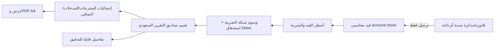

# TAXR1 — التقرير الضريبي المحاسبي (QA فقط)

## TAXR2 — العرض المبسّط والتفصيل المباشر (مرشح QA)

- **المرجع:** TAXR1، أساس المصدر `b4322d24c0c6f6393cf47548673c9e7982a06b22`؛ التصنيف `CONTROLLED` لأن التغيير يمس رحلة فتح القيود، مع بقاء الحساب المالي ومصدر البيانات والصلاحيات دون تغيير.
- **الأثر:** `baseer_tax_report` فقط. العرض الافتراضي يخفي الخانات صفرية القيمة ويُبقي استثناءات الوسوم ظاهرة؛ العرض المفصّل يعرض الخانات الـ16. PDF يبقى كاملًا للرجوع المحاسبي.
- **التفصيل:** الضغط على مبلغ خانة مباشرة يفتح قيودها بعد حفظ فلاتر النافذة المؤقتة. الخانة التجميعية تكشف مساهمات الخانات المباشرة بإشاراتها، ومن كل مساهمة يُفتح قيدها؛ لا تُعرض قائمة قيود مجمّعة مضللة.
- **الضوابط:** التحقق من الصندوق والعمود والصلاحيات والشركة والفترة في الخادم؛ DOM لا يحدد نطاق الاستعلام. لا تعديل لأي قيد أو معادلة ضريبة. اختبار الصفر/التفصيل/الإشارات/القفز المباشر وQWeb والجوال مطلوب قبل النشر على QA. الإنتاج خارج النطاق.

## عقد البناء

- **الهدف:** كشف VAT سعودي عربي/إنجليزي قابل للتدقيق يعيد صناديق تقرير Odoo السعودي الـ16 لفترة شهرية أو ربع سنوية، مع تفصيل القيود وPDF A4.
- **المستخدمون:** المحاسب والمدير المالي ممن يملكون صلاحية قراءة المحاسبة.
- **النطاق:** إضافة Baseer مستقلة؛ اختيار شهر أو ربع سنة ودفاتر يومية اختيارية؛ قراءة تعريف `l10n_sa.tax_report_vat_filing` وصيغ tax tags/aggregation الموجودة في قاعدة Odoo؛ حسابات وإجماليات في الخلفية فقط؛ عرض وPDF A4؛ فتح القيود الداعمة لكل صندوق. وضع تقريرَي الضريبة والتبغ أولًا في قائمة التقارير.
- **خارج النطاق:** إنشاء إقرار ZATCA أو تقديمه، تعديل الضرائب/الفواتير/القيود، قراءة مسودات أو مبيعات POS غير المرحلة، تغيير الإنتاج، أو تغيير معادلة رسوم التبغ.
- **قرار محاسبي:** التقرير يعتمد القيود **المرحّلة** فقط و`account.move.line.date` المحاسبي و`_get_tax_exigible_domain()` الأصلي للاستحقاق النقدي. القيم في صناديق 1–16 هي قيم وسوم شبكة الضريبة، لا مجموع `tax_line_id` وحده. الصندوق 16 = 13 + 14 + 15. لا ينشئ هذا الكشف إقرارًا أو يقفل فترة.
- **فجوة بيانات مثبتة:** QA يحتوي ضريبة VAT مخصصة بلا وسوم شبكة؛ في سبتمبر لدى الشركة 1 ثلاثة أسطر VAT غير موسومة وصافي رصيد `-7.17` ريال. تظهر هذه كاستثناء مستقل ولا تُدخل بصمت في الصناديق الرسمية. يلزم تصحيح إعداد الضريبة/التاريخ عبر مسار محاسبي معتمد قبل اعتماد كشف الفترة للإقرار.

## خريطة الدورة والرقابة المحاسبية — G0

- المستند القابل للتعديل: مسودة فقط؛ لا يقرأ التقرير المسودات.
- الأثر المالي مصدره القيد المرحّل؛ التقرير قراءة فقط ولا ينشئ قيودًا أو يعدّلها.
- التصحيح يكون عبر مستند محاسبي مصحح/عكسي معتمد، ويظهر في الفترة المحاسبية الخاصة به.
- صلاحية التقرير تساوي صلاحية قراءة المحاسبة؛ لا يوسّع الوصول إلى مستندات شركة أخرى.

## معايير القبول

1. اختيار شهر أو ربع سنة يعيد نطاق تاريخ صحيحًا ويعرضه بوضوح.
2. جميع الإجماليات تستخرج من القيود المرحّلة للشركة المختارة فقط، مع استحقاق الضريبة الأصلي، وتعريفات الصناديق السعودية المحفوظة في Odoo؛ لا حساب مالي في JavaScript.
3. المذكرات الدائنة/المدينة تقلل أو تزيد الرصيد وفق إشارة وسوم الشبكة الفعلية.
4. تفصيل كل صندوق يفتح أسطر القيد التي تحمل وسمه، بتاريخها ومستندها؛ الصناديق التجميعية تشير إلى مكوّناتها ولا تضاعف الأسطر.
5. تطابق تفاصيل الصناديق المباشرة مجموعها، والصناديق 6/12/13/16 تحسب من الصيغ الأصلية بدقة عملة الشركة.
6. الشهور/الأرباع الفارغة تعرض صفرًا بلا خطأ؛ الفترة المغلقة لا تُعدلها الأداة.
7. RTL/LTR، أرقام غربية، سطح مكتب وجوال، PDF A4 باسم الفترة المختارة.
8. تقريرا «الضريبة» و«رسوم التبغ» يظهران أعلى قائمة التقارير دون تغيير صلاحيات التقارير الأخرى.
9. أسطر VAT التي لا تحمل وسم شبكة تظهر كاستثناء محسوب ومنفصل ولا تختفي من مراجعة المحاسب.

## سجل البوابات

| البوابة | الحالة | المالك | المراجع المستقل | الدليل |
|---|---|---|---|---|
| G0 الحوكمة | معتمدة | قائد البناء وخبير المحاسبة | حارس البوابات المستقل | 2026-10-06: العقد وخريطة الدورة مقبولان للشريحة الأولى؛ الإجمالي الأساسي يشمل جميع الدفاتر، وفلتر الدفتر تحليل اختياري لا يحل محل الإجمالي الأساسي؛ استثناء VAT غير الموسوم ظاهر. |
| G1 السعة | معتمدة | مهندس السعة | حارس البوابات المستقل | 2026-10-06: نطاق شركة/تاريخ إلزامي، تجميع الوسوم في الخلفية، وتفاصيل مُرقّمة؛ قياس الأداء الفعلي مؤجل إلى G6 قبل وعد السعة. |
| G2 البيانات | معتمدة | بنّاء الخدمة | حارس البوابات المستقل | 2026-10-06: تعريف Odoo 19 السعودي وQA: 16 صندوقًا، 152 علاقة وسم في سبتمبر، و3 أسطر VAT بلا وسم؛ يلزم تطبيق إشارة كل تعبير ضريبي و`_get_tax_exigible_domain()` الأصلي واختبار المردودات وCABA والصناديق 14–16 قبل قبول G5. |
| G3 التقنية | معتمدة | أمين المكتبات | حارس البوابات المستقل | 2026-10-06: استخدام metadata `account.report` في Odoo Community مع ORM/QWeb؛ لا اعتماد جديد ولا افتراض وجود محرك واجهة `account_reports`. |
| G4 التجربة | مرشح | مصمم التجربة | حارس الجودة | نموذج شهر/ربع، عرض 16 خانة بأسماء عربية محلية لا تغير الصيغ، PDF A4، وترجمة `ar_001` محمّلة؛ فحص الشاشة في QA العاملة لم يكتمل بعد. |
| G5 الشريحة العمودية | معتمدة للمرشح | بنّاءا الخدمة/الواجهة | حارس الجودة | 9 اختبارات أودو على نسخة QA معزولة: صفر فشل/أخطاء؛ شملت بيعًا ومردودًا ومشتريات ومسودة، CABA قبل التسوية وبعدها للأساس والضريبة، عزل الشركة، وصنف VAT غير موسوم. قراءة سبتمبر من النسخة المعزولة طابقت المصدر. |
| G6 السعة | معتمدة للمرشح | مهندس السعة | حارس الجودة | 3 قراءات متتالية: شهر سبتمبر 136/66/78ms، الربع الثالث 120/119/124ms على نسخة QA المعزولة؛ لا ادعاء حد إنتاجي عام. |
| G7 البناء | قيد المراجعة | قائد البناء | حارس البوابات | PR #194 مفتوح؛ فحص CI والفرق النهائي قبل الدمج. |
| G8 التسليم | غير مبدوءة | مهندس التشغيل | فريق التسليم | مرشح QA |

## ملف السعة والنمو — G1

- **رحلة حرجة:** فتح تقرير شهر أو ربع سنة ثم تصدير PDF.
- **حدود الوصول:** الشركة + نطاق تاريخ إلزاميان؛ تجميع رصيد الوسوم عبر ORM في الخلفية؛ تفاصيل صندوق واحد مُرقّمة؛ لا تحميل سنوات كاملة للمتصفح.
- **الافتراضات:** نمو السجلات شهري ومستمر؛ لذلك ستجمع الاستعلامات حسب الشركة/الحالة/التاريخ وتُعرض التفاصيل بحد/ترقيم صفحات عند الحاجة.
- **الهدف الأولي:** الاستجابة للاستخدام اليومي للمحاسب دون أي job خلفي أو cache؛ لا يُدّعى حد سعة قبل قياس معزول.
- **التزامن والاستعادة:** قراءة فقط، بلا أثر قابل للتكرار أو حاجة لترحيل؛ الرجوع بإزالة الموديول/الإصدار من QA مع بقاء القيود كما هي.

## قرار المسار المباشر — G0/G1

إعادة استخدام تعريف الصناديق ووسوم الضرائب والاستحقاق النقدي في Odoo 19، والقيود المرحّلة وQWeb الموجودين، هي الطريق المباشر. طبقة العرض فقط جديدة لأن محرك واجهة `account_reports` غير موجود في نسخة Community. لا تضاف مكتبة أو خدمة أو جدول محاسبي جديد.

## دفتر العمليات الحي

| المعرّف | البوابة | النوع | النية/النتيجة | الأثر والتراجع |
|---|---|---|---|---|
| TAXR1-001 | G0 | قرار | طلب المالك تقرير ضرائب شهري/ربعي بديل عن Enterprise؛ حُددت القراءة المحاسبية المرحّلة كافتراض محافظ حتى فحص QA. | لا تعديل تطبيق أو بيانات؛ العقد فقط. |
| TAXR1-002 | G0 | قراءة | فُحصت الإضافة الحالية على QA: `account_reports` غير موجودة و`eh_account_dynamic_reports` موجودة ولا يظهر فيها تقرير ضرائب جاهز. | لا تغيير. |
| TAXR1-003 | G0–G3 | قراءة وتصحيح | راجع حارس بوابات مستقل العقد ورفض تجميع tax lines السطحي؛ قورنت تعريفات Odoo السعودي الأصلية بقاعدة QA، وثُبت وجود 16 صندوقًا، 152 علاقة وسم في سبتمبر، و3 أسطر VAT بلا وسم. صُحح تصميم المصدر إلى الوسوم والاستحقاق الأصلي مع استثناء ظاهر. | توثيق فقط؛ لا تغيير محاسبي. |
| TAXR1-004 | G0–G3 | اعتماد مستقل | 2026-10-06: اعتمد حارس البوابات G0–G3 للشريحة الأولى بعد مراجعة تعريف `l10n_sa.tax_report_vat_filing` ومصدر الاستحقاق الأصلي؛ الإجمالي الأساسي لكل الدفاتر. شرط قبول G5: إشارات الوسوم، الاستحقاق النقدي، اختبارات المردودات وCABA والصناديق 14–16، وتطابق التفاصيل مع الإجماليات، مع إبراز VAT غير الموسوم. | إذن لبدء كود الشريحة الأولى على فرع QA؛ لا تعديل للقيود أو البيانات ولا اعتماد لإقرار ضريبي أو للإنتاج. |
| TAXR1-005 | G5 | مراجعة وتصحيح | رصدت المراجعة المستقلة تعارض وصول مستخدم الفوترة إلى metadata وغياب تغطية مجموعات VAT المخصصة واختبار CABA. قُصر الوصول على قارئ المحاسبة/المحاسب/المدير، وفُصلت الضرائب غير الموسومة إلى VAT مرشح وغير VAT، وأضيفت اختبارات قيود فعلية. أول تشغيل معزول كشف قيمة `False` للتجميع الفارغ، ثم اختبار الأدوار كشف تصادم اسم `_check_access` مع ORM؛ صُحح الاثنان قبل الإصدار. | لم تتغير QA العاملة ولا الإنتاج. |
| TAXR1-006 | G5–G6 | اختبار | قاعدة مؤقتة `baseer_tax_test_20261006` من QA، حاوية محدودة 2GB/2CPU، 9 اختبارات ناجحة؛ سبتمبر الشركة 1: الصندوق 1 = 53,137.05/7,970.55، الصندوق 7 = 14,136.41/2,120.45، الصندوق 16 = 5,850.10؛ 3 أسطر VAT بلا وسم برصيد موقّع -7.17 منفصلة. عُرض HTML وولد PDF فعلي، وثبتت تسمية عربية للخانات دون تغيير الصيغ. قراءة شهر/ربع 3 مرات كما في G6. | كل معاملات الاختبار ضمن قاعدة منفصلة؛ ملف PDF الاختباري بدون شعار لأن filestore النسخة المعزولة لا يحمل مرفقات QA، وفحص الشعار النهائي مؤجل إلى QA العاملة. |
| TAXR1-007 | G4–G5 | ضبط فلتر | أضيف اختيار دفاتر يومية اختياري كما في فلاتر Odoo. الوضع الافتراضي «جميع الدفاتر» للإجمالي الرسمي؛ الاختيار الجزئي مُعلَّم صراحة كتحليل غير إجمالي الإقرار لأنه قد يستبعد قيد CABA المقابل. اختبر الاختيار على قيود مرحلة: 9 اختبارات أودو، صفر فشل وأخطاء. | لا يؤثر على القيود أو البيانات. |
