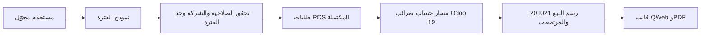

# TAX-TOBACCO-REPORTS-20261006 — تقرير التبغ التشغيلي على QA، والضرائب مؤجل لقرار المالك

> تصحيح العقد بتاريخ 2026-10-06: المدخلات 001–007 أدناه توثق التصميم المحاسبي الأول ولا تُحذف. اختيار المالك اللاحق غيّر تقرير التبغ جذرياً: مصدره مبيعات POS المكتملة، سواء رُحّلت أم لا، مع رصيد افتتاحي صفر داخل كل فترة. لا يُستخدم حساب 201021 كمصدر لحركة التقرير. تصميم تقرير الضرائب لا يزال منفصلاً ومفتوح القرار.

## عقد البناء G0 (مسودة مصححة للمراجعة المستقلة)

- الهدف الحالي: تقرير عمليات رسوم التبغ للمدير/المحاسب المخوّل، شبيه بتقرير سبتمبر القديم من حيث شعار الشركة، العنوان، فترة من–إلى، تفاصيل العمليات، المدين/الدائن والرصيد الجاري، مع رصيد بداية **0.00** لكل فترة. يُجرب على QA فقط. تقرير الضرائب طلب منفصل بعد حسم معناه.
- النطاق: مبيعات POS الأصلية المكتملة (`paid`/`done`) داخل الفترة، مع المرتجعات بعكس الإشارة؛ لا تتطلب قيداً مرحّلاً. تُستبعد المسودات/الإلغاءات وطلبات `baseer_summary` الخارجية لتفادي ازدواج/تحريف تفصيل عمليات الكاشير. اختيار الشركة والتاريخ من واجهات أودو الأصلية، مع طباعة PDF.
- مصدر التشغيل: `pos.order` و`pos.order.line` و`account.tax` المرتبطة بالسطر. مبلغ الرسم الفردي غير مخزن عموماً في Odoo؛ يعاد اشتقاقه **بنفس pipeline الضريبة في POS** من بيانات الطلب، **ولا يوصف بأنه مبلغ ضريبة تاريخي محفوظ**. تتحقق الخلفية من توافق إجمالي الطلب المعاد مع إجمالي الطلب المحفوظ؛ الاختلاف يظهر بعدد استثناءات واضح، لكن صفه يدخل في المجموع المسمى «إجمالي مُعاد حسابه» لا «مبلغاً تاريخياً مؤكداً». لا يُستخدم `pos.order.amount_tax` أو الفرق بين الإجمالي/الأساس كرسم تبغ لأنهما يشملان VAT. لا كتابة على الطلب/القيد/الفاتورة أو تغيير المعادلة في هذه الشريحة.
- تعريف رسم التبغ: مبالغ توزيع الضريبة **المطبقة فعلياً** على السطر عندما يكون حساب `tax_reps_data.account.code` هو `201021` للشركة، لا الاسم المترجم أو معرّف ثابت. يمكن وجود تعريفات ضريبة أخرى غير مستخدمة؛ لا تُرفض إلا نتيجة ملتبسة مطبقة فعلياً.
- مصدر النموذج البصري: `SEP2026.pdf` للنظام السابق (3 صفحات، الثالثة شبه فارغة لا تُكرر). **صف لكل سطر صنف عليه رسم** حتى لا يصافي البيع والمرتجع داخل الطلب نفسه؛ الأعمدة: تاريخ العملية، رقم الطلب، المنتج/الكمية، رسم مدين للمرتجع، رسم دائن للبيع، التراكمي داخل الفترة. الاستثناءات تعرض بقسم مستقل حتى لو أصبح الرسم المعاد صفراً؛ لا نضع «رقم قيد» وهمياً لطلب غير مرحّل. التاريخ 00:00:00 بداية اليوم حتى نهاية اليوم محلياً بتوقيت Asia/Riyadh، دون قيد مرحّل.
- تقرير الضرائب المقترح لاحقاً: **حركة الضرائب المرحّلة** (`tax_line_id`) مع أساس الضريبة ومبلغها، المجموعة ونوع الاستخدام (بيع/شراء)، وقيود الاسترداد بعكس الإشارة. هذا عرض محاسبي وليس إقراراً ضريبياً رسمياً أو تصديق امتثال. سُئل المالك صراحة هل يقصد ذلك أم إقرار VAT رسمي؛ لا يبدأ بناؤه حتى يحسمه. لا يُخلط بهذا التقرير التشغيلي للتبغ.
- خارج النطاق الحالي: تسويات حساب الالتزام اليدوية، الإقرار الرسمي، تعديل التاريخ أو رسم التبغ نفسه، backfill/snapshot للطلبات القديمة أو تغيير تدفق إكمال POS، نشر الإنتاج، وتقرير الضرائب حتى يحسم المستخدم نوعه. تقرير POS ليس بديلاً عن دفتر الأستاذ أو الإقرار الضريبي.
- القبول: من–إلى يضمان اليومين كاملين بتوقيت الرياض وفق `date_order` لا وقت الإكمال، الافتتاحي صفر، عمليات POS الأصلية المكتملة فقط، المرتجع مدين، البيع دائن، جمع وتراكمي دقيقان بمنزلتين، شعار الشركة، الصفحات متصلة بلا صفحة فارغة، صلاحيات/شركات معزولة، ووسم بارز «كشف تشغيلي غير محاسبي — مبالغ الرسم معاد احتسابها من إعداد الضريبة الحالي» مع عدد الاستثناءات. تجربة QA فقط.
- خريطة الدورة: سطر بيع/مرتجع POS → إكمال الطلب → قراءة ضريبته المرتبطة وإعادة حسابها القياسي → سجل تقرير قراءة فقط. الترحيل المحاسبي مستقل ولا يشترط؛ التقرير لا ينشئ حركة مالية.

## G1 — الحجم والاستمرارية (مسودة مصححة)

- قياس QA بتاريخ 2026-10-06: في سبتمبر 78 طلب POS، منها 16 مكتمل أصلي و40 ملخص خارجي مكتمل و22 أصلي ملغي؛ **سطر تبغ أصلي مكتمل واحد فقط**. في أكتوبر سطر رسم أصلي واحد. لذا لا يمكن إثبات مطابقة PDF القديم ذي نحو 100 عملية من بيانات QA الحالية؛ لا تُختلق صفوف.
- افتراض نمو مؤقت: 1,000,000 سطر POS و20 مستخدم تقرير متزامناً. الاستعلام إلزامياً بالفترة والشركة، بحد **366 يوماً و5,000 سطر POS في PDF** ورسالة تطلب تقسيم الفترة عند تجاوزه؛ لا قراءة غير محدودة لكل التاريخ.
- هدف QA: شهر البيانات الحالية خلال 3 ثوانٍ بلا أخطاء؛ قياس نمو مستقبلي معزول لا على QA المشتركة أو الإنتاج. لا ادعاء أداء على مليون سطر دون G6.
- الاستعادة: غلاف QA القائم يأخذ زوج DB/filestore قبل ترقية الموديول ويعيد الإصدار/البيانات عند فشل النشر؛ هدف تشغيلي مؤقت هو اكتشاف الفشل والرجوع ضمن 30 دقيقة، لا SLA إنتاج. يعتمد G8 فقط مع دليل النسخة ونجاح فحص الاستعادة/التراجع المناسب.
- لا كتابة من التقرير؛ لا retry أو jobs أو cache جديد. نسخ QA واستعادة إصدارها تتم بواسطة غلاف النشر المحمي القائم، وقياس الزمن/الأخطاء عبر سجلات Odoo الموجودة.

## G2 — معمارية البيانات والعقود (مسودة مصححة)

```text
Odoo accounting/report menu → native date-range wizard → server report builder → QWeb PDF
      → company-scoped completed native pos.order/pos.order.line
      → Odoo POS tax pipeline per order (base lines → tax details → rounding → tax reps)
      → compare recomputed order total to saved order total; label estimates/exceptions
```

- موديول مستقل صغير تحت `custom_addons` يعتمد `point_of_sale` و`account`، بلا JS/مكتبة جديدة. `TransientModel` لفترة/شركة و`AbstractModel` لقيم QWeb؛ لا SQL view ولا تعديل سطر POS. الحساب والتجميع في الخلفية بـDecimal أو دقة عملة Odoo؛ الواجهة لا تحسب.
- مصدر الزمن: `date_order` UTC **وقت الطلب لا وقت إكماله**، مع حدود ثابتة Asia/Riyadh محوّلة UTC: `[00:00:00 في from, 00:00:00 في اليوم التالي لـto)`؛ لا شرط `move.state`. العرض بتوقيت الرياض صراحة.
- لكل طلب، نفّذ مسار Odoo 19 POS ذاته: `order.lines._prepare_tax_base_line_values()` ثم `account.tax._add_tax_details_in_base_lines(base_lines, company)` ثم `_round_base_lines_tax_details(...)` ثم `_add_accounting_data_in_base_lines_tax_details(...)`. هذا يحمل `extra_tax_data.manual_tax_amounts` والتقريب على مستوى الطلب. من `tax_details.taxes_data.tax_reps_data` اجمع `tax_amount_currency` للتوزيعات التي `account.with_company(order.company_id).code == '201021'` فقط، دون جمع VAT أو مضاعفة التوزيعات؛ **طبّق `refund_factor` الخاص بالطلب على هذا المبلغ عند `order.is_refund` أو `order.amount_total < 0` كما في `_compute_prices`**، ثم صنف المبلغ النهائي إلى مدين/دائن. لا `compute_all` منفرداً ولا `price_subtotal_incl-price_subtotal`.
- أعد تكوين إجمالي الطلب من `account.tax._get_tax_totals_summary` مع cash rounding كما في `_compute_prices` ثم طبّق `refund_factor = -1` عند `order.is_refund` أو `order.amount_total < 0` كما يفعل Odoo قبل المقارنة بـ`order.amount_total` المحفوظ بدقة العملة. إذا تجاوز الفرق نصف أصغر وحدة عملة، سجّل استثناء الطلب وأظهر عدده وتفاصيله في PDF **حتى لو لم يُكتشف توزيع رسم تبغ في الطلب بعد تغير الإعدادات**؛ لا تضف صف رسم وهمياً في هذه الحالة. **كل سطور الرسم المكتشفة، بما فيها المختلف، تدخل المجموع المسمى «إجمالي مُعاد حسابه من إعداد الضريبة الحالي»**؛ لا يُدعى أنه إجمالي محفوظ أو رسمي. لا تعتمد مطابقة الإجمالي دليلاً على صحة توزيع كل ضريبة تاريخياً.
- طلبات `source='pos'` فقط لتقرير عمليات الكاشير؛ `baseer_summary` تمثل ملخصات خارجية وقد تكرر النشاط. إضافة المصدر الخارجي لاحقاً تحتاج سياسة منع ازدواج. إشارة المبلغ تأتي من base-line الفعلي **مضروبة مرة واحدة في `refund_factor` للطلب**، ثم موجب→دائن وسالب→مدين؛ اختبر refund order وnegative line وpartial refund. الترتيب `date_order,id,line.id` لتراكم حتمي.
- فرض **تقاطع** صلاحية المحاسبة وقراءة POS داخل builder الخادمي، إضافة إلى قائمة menu؛ تحقق `check_access('read')` على الطلب/السطر والشركة ضمن `env.companies`، بلا `sudo` في report render/RPC. Odoo menu groups وحدها ليست تقاطعاً. اختبر شركة محجوبة والوصول المباشر لطلب التقرير.
- فهرس POS القائم على `(company_id,date_order,state)` يُفحص قبل إضافة جديد؛ احسب بتجزئة محدودة أو حد صفوف PDF. لا schema معاملات ولا migration للقديم في هذه الشريحة.
- مخاطر معلنة: إذا تغير تكوين الضريبة منذ عملية قديمة، فالاشتقاق قد لا يطابق رسمها الأصلي؛ QA لا يحوي حجم سبتمبر المرجعي للمضاهاة؛ تقرير POS لا يشمل التسويات المحاسبية. تخزين snapshot وقت إكمال POS مرشح لمرحلة لاحقة مستقلة بعد اختبار hooks ودقة الضريبة، ولا يُتسلل إلى هذا التقرير القرائي.

## G3 — الرصة والمسار المباشر (مسودة مصححة)

- أودو 19 الموجود، ORM ومسار POS للـbase lines/tax details والـrounding وQWeb/`web.external_layout` وحقول تاريخ Odoo الأصلية؛ لا مكتبة جديدة أو OWL/JS أو إعادة بناء منتقي ERP Heritage.
- البديل المرفوض: حساب الفرق بين gross/net كرسم، لأنه يضم VAT؛ البديل المرفوض: `account.move.line` وحده، لأنه يسقط POS المكتمل غير المرحّل الذي اختاره المالك؛ البديل المرفوض: backfill صامت أو تعديل POS التاريخي.
- الفحص: اختبارات Odoo لحدود الشهر/الشركات/الصلاحيات/refund order/negative line/partial refund/manual tax/توزيع التقريب/استثناء الانحراف/التبغ مع VAT؛ `--test-tags`، وQA smoke، وPDF مرئي AR/EN بلا صفحة فارغة. لا اختبار حمل على QA المشتركة.
- القرار المباشر: تقرير POS قرائي واحد بطباعة أصلية؛ تقرير الضرائب ينتظر قرار المالك. لا تثبيت مكتبات.

## G4 — عقد الواجهة (مسودة مصححة)

- مكونات/مسارات أودو المركزية: `ir.ui.view` form بـ`sheet/group` و`fields.Date/Selection` و`button` الأصلي دون عرض ثابت، قائمة المحاسبة، و`web.html_container` مع `web.external_layout` للشعار/الهيدر وقالب QWeb خاص بالصفوف. لا JS ولا مكتبة أو مكون عام جديد؛ CSS محلي للجدول المطبوع فقط. كرر رأس الجدول عند انتقال الصفحة، وامنع صفحة أخيرة فارغة كما في PDF القديم.
- العربية والإنجليزية من source strings و`i18n/ar.po`؛ `dir` RTL/LTR حسب اللغة مع إبقاء معرف الطلب والعملة/الأرقام معزولة LTR. تنسيق مركزي خادمي واحد يحوّل الأرقام/التواريخ المعروضة إلى ASCII `0–9`، ومبالغ SAR بمنزلتين، ولا يعتمد وحده على locale العربية. وسم بارز «كشف تشغيلي غير محاسبي؛ مُعاد حسابه من إعداد الضريبة الحالي» في نموذج الفترة والـPDF، وعدد الاستثناءات **بعد الحساب في PDF**. التراكمي ليس رصيد حساب مستحق.
- الحالات: فترة صحيحة بحد 366 يومًا، رسالة `ValidationError` عند عكس التاريخ أو تجاوز 366 يومًا/5,000 سطر، و`AccessError` عند نقص المحاسبة أو POS أو الشركة، وصفحة PDF فارغة محترمة تقول لا توجد عمليات تبغ للفترة، واستثناءات واضحة إذا اختلف الإجمالي المعاد عن المحفوظ. فحص form عند عرض 375px وسطح مكتب، وPDF AR/EN بعدة صفحات ورأس متكرر؛ PDF ليس واجهة تفاعلية للجوال.

## سجل البوابات

| البوابة | الحالة | المالك | المراجع المستقل | دليل الدخول/النتيجة |
|---|---|---|---|---|
| G0 | معتمدة لشريحة التبغ فقط؛ تقرير الضرائب NO-GO منفصل | قائد البناء/خبير المحاسبة | حارس البوابات | اختيار المالك لمبيعات POS المكتملة وصفر افتتاحي، ومصدر PDF؛ قرار المراجع في 015 |
| G1 | معتمدة لشريحة التبغ | مهندس السعة | حارس البوابات المستقل | قياس QA وحد 366 يومًا/5,000 سطر؛ قرار 015 |
| G2 | معتمدة للتصحيح 022 | كبير المعماريين/الخدمة | حارس البوابات المستقل | pipeline وrefund 017، صف لكل سطر واستثناء الصفر 023 |
| G3 | معتمدة لشريحة التبغ | أمين المكتبات | حارس البوابات المستقل | الرصة الأصلية بلا تبعيات جديدة؛ قرار 015 |
| G4 | معتمدة للتصحيح 022 | مصمم التجربة | حارس البوابات المستقل | المكونات واللغات 020؛ موقع الاستثناء وتصحيح الأرقام/الفترة 023 |
| G5 | GO لمرشح QA فقط | البناء/الجودة | حارس البوابات | 12 اختبار Odoo ناجح على استنساخ QA ومراجعة مستقلة بلا P0/P1؛ الدليل 024–030 |
| G6 | تحقق وظيفي وPDF منجز على الاستنساخ | مختبر الرحلات | مستقل | عينة سبتمبر وصفحة واحدة، ومحاكاة 100 صف بأربع صفحات؛ الدليل 025–028 |
| G7–G8 | لم يعتمد النشر بعد | التسليم/التشغيل | مستقل | ينتظر مراجعة المرشح وCI ومسار QA المحمي؛ الإنتاج خارج النطاق |

## سجل العمليات الحي (إضافة فقط)

| # / وقت الرياض | البوابة | النية والمنفذ | العملية/الدليل | النتيجة والأثر والتراجع |
|---|---|---|---|---|
| 001 / 2026-10-06 | G0 | قائد البناء: بدء جرد المصدر دون تغيير | registry GL، جرد `eh_account_dynamic_reports` والـQA ORM؛ قراءة وثائق Odoo 19 | لا تقرير Tax/Tobacco موجود؛ منتقي Heritage مخصص، وفلتر Search الأصلي يدعم الشهور/الأرباع/السنوات. لا تغيير بيانات. |
| 002 / 2026-10-06 | G0–G2 | خبير المحاسبة/السعة: تحديد المصدر والحجم | QA ORM مع rollback؛ 7 شركات، 7 حسابات `201021`، توزيعات ضريبة الرسم، 21,282/2,893/4 بند | المصدر محاسبي مرحّل؛ 201021 ليس ID ثابتاً. لا تغيير بيانات أو إنتاج. |
| 003 / 2026-10-06 | G0 | قائد البناء: عزل التنفيذ | `git fetch official main` ثم فرع `codex/tax-tobacco-reports-qa` من `9b4f1599` | شجرة العمل الرئيسية المتسخة لم تُمس؛ فرع مستقل نظيف، الرجوع بتغيير الفرع. |
| 004 / 2026-10-06 | G0–G3 | قائد البناء: إنشاء عقد البوابات قبل الكود | هذا الملف | مسودات للمراجعة المستقلة، لم يبدأ كود/حزمة/نشر. |
| 005 / 2026-10-06 | G0–G2 | حارس البوابات المستقل: مراجعة العقد | مراجعة منفصلة للمصدر والوثيقة | NO-GO للكود: مفتاح code_store للشركة الفرعية غير صحيح، ومعنى تقرير الضرائب وقيود النقد/اليدوي وهدف الاستعادة تحتاج ضبطاً. لا نشر أو تعديل بيانات. |
| 006 / 2026-10-06 | G0–G2 | قائد البناء: تصحيح المسودة بعد المراجعة | فحص QA لـ`root_id` و`parent_path` مع rollback؛ تحديث هذا العقد | `root_id` غير مخزن، `parent_path` مخزن؛ صُحح مسار SQL، وأضيفت حدود الحركة/الاستعادة/اختبار ACL. G0 لا يزال مفتوحاً لقرار المالك، ولم يبدأ الكود. |
| 007 / 2026-10-06 | G0–G3 | حارس البوابات المستقل: إعادة مراجعة التصحيح | مراجعة العقد والمصدر بعد المدخل 006 | G1–G3 جاهزة للاعتماد تصميمياً؛ G0 NO-GO حتى يحدد المالك هل التقرير الضريبي حركة قيود أم إقرار VAT رسمي. لم يبدأ الكود أو النشر. |
| 008 / 2026-10-06 | G0 | المالك: تصحيح مصدر تقرير التبغ | طلب أن تبدأ الفترة من صفر دون قيد مرحّل؛ اختيار صريح «مبيعات POS المكتملة ولو لم تُرحّل» | أعيد فتح G0–G3 للتبغ، وفُصل عن تقرير الضرائب المفتوح. لا يُنفّذ التصميم المحاسبي القديم للتبغ. |
| 009 / 2026-10-06 | G0–G2 | قائد البناء/خبير المحاسبة: فحص المصدر القديم وQA قراءة فقط | `SEP2026.pdf` 3 صفحات؛ QA ORM مع rollback؛ كود تقرير Odoo POS القياسي | PDF فيه رصيد افتتاحي صفر وتفصيل يومي وصفحة أخيرة شبه فارغة. QA: سطر رسم مكتمل واحد في سبتمبر وآخر أكتوبر، ولا `extra_tax_data` محفوظ؛ `compute_all` أعاد للثاني 100.00 رسم و28.70 VAT وطابق إجمالي السطر 220.00. لا يمكن إثبات مطابقة كامل سبتمبر على QA الحالية. |
| 010 / 2026-10-06 | G0–G3 | قائد البناء: تحديث عقد الشريحة | هذا التصحيح للمصدر والحدود والتقنية والمخاطر | التقرير التبغي للـPOS قراءة فقط؛ لا كود/نشر حتى مراجعة حارس البوابات المستقل. |
| 011 / 2026-10-06 | G2 | حارس البوابات المستقل: مراجعة مصدر الحساب | مقارنة عقد `compute_all` بمسار Odoo 19 POS الفعلي | NO-GO: `compute_all` منفرداً يسقط `manual_tax_amounts` وتقريب الطلب/إشارات المرتجع. أوصى بالـpipeline الكامل، حساب التوزيع الفعلي، وتوضيح الاستثناء/الصلاحية/المعنى التشغيلي. |
| 012 / 2026-10-06 | G0–G3 | قائد البناء: تصحيح العقد مرة ثانية | فحص QA read-only لبنية `tax_details/tax_reps_data`، وتحديث النص أعلاه | عينة QA أظهرت `tax_reps_data.account=201021` بمبلغ 100.00 وVAT منفصلة 28.70 مع إجمالي 220.00. لا كود/نشر حتى إعادة مراجعة مستقلة. |
| 013 / 2026-10-06 | G0–G3 | حارس البوابات المستقل: إعادة مراجعة العقد | مراجعة المدخل 012 مع كود `_compute_prices` وPOS tax pipeline | G0/G2 في الجوهر GO؛ طلب حد PDF رقمي، استبدال ذكر `compute_all` في G3، و`refund_factor` عند مقارنة الإجمالي. |
| 014 / 2026-10-06 | G1–G3 | قائد البناء: إغلاق الملاحظات النصية | حد 366 يومًا/5,000 سطر، pipeline في G3، `refund_factor` في G2 | ينتظر اعتماد المراجع المستقل؛ لا كود أو نشر بعد. |
| 015 / 2026-10-06 | G0–G3 | حارس البوابات المستقل: قرار دخول التنفيذ | مراجعة المدخل 014 وتصحيحات G1/G2/G3 | **GO / اعتماد G0–G3 لشريحة التبغ التشغيلية فقط**. تقرير الضرائب NO-GO منفصل إلى أن يحدد المالك نوعه. بدء G4/G5 مسموح للتبغ، بلا نشر إنتاج. |
| 016 / 2026-10-06 | G2 | قائد البناء: إعادة فتح تفصيل إشارة المرتجع | محاكاة read-only في QA لمسار POS بعينة تبغ 4×55؛ sale=100.00، refund_order base-line=+100.00 قبل `refund_factor`، negative_line=-95.65 | تأكد أن tax_reps_data وحدها لا تحمل إشارة refund_order النهائية؛ أضيف ضرب `refund_factor` على الرسم أيضاً. إيقاف الكود حتى مراجعة التصحيح. |
| 017 / 2026-10-06 | G2 | حارس البوابات المستقل: مراجعة إشارة المرتجع | تدقيق المحاكاة والعقد 016 | **GO / اعتماد G2 المصححة**: مجموع tax_reps_data لرسم التبغ × refund_factor مرة واحدة لكل سطر؛ اختبار sale/refund_order/negative_line إلزامي في G5. G0/G1/G3 باقية معتمدة. |
| 018 / 2026-10-06 | G4 | حارس البوابات المستقل: مراجعة عقد الواجهة | مراجعة المكونات والأرقام/اللغات والحالات | NO-GO شكلياً للشاشة: تنسيق الأرقام الغربية وحالات الفراغ/الخطأ/المنع وحد PDF ومسارات المكونات كانت غير محددة. |
| 019 / 2026-10-06 | G4 | قائد البناء: إغلاق مراجعة الواجهة | إضافة مسارات Odoo المركزية وformatter الخادمي وحالات ValidationError/AccessError/فراغ وفحص 375px/PDF AR/EN | ينتظر المراجع المستقل قبل تنفيذ واجهة الفترة والقالب. |
| 020 / 2026-10-06 | G4 | حارس البوابات المستقل: قرار الواجهة | مراجعة العقد بعد المدخل 019 | **GO / اعتماد G4** لتنفيذ شاشة الفترة وQWeb PDF؛ لا يدل على اختبار العرض بعد. |
| 021 / 2026-10-06 | G5 | قائد البناء/حارس الجودة: أول تنفيذ وتدقيق مستقل | موديول `baseer_pos_tobacco_report` وشاشة فترة وقالب QWeb واختبارات أولية؛ مراجعة مستقلة للكود | NO-GO للمرشح: صف واحد صافي لكل طلب يخفي اتجاهي البيع/المرتجع داخل الطلب؛ استثناء طلب قد يختفي إذا صار الرسم صفرًا؛ الاختبارات الوهمية غير كافية. لا نشر. |
| 022 / 2026-10-06 | G2–G5 | قائد البناء: إصلاح عقد العرض والتفسير | صف لكل سطر رسم، قسم استثناءات لكل الطلبات المختلفة حتى لو رسمها صفر؛ وقت preset من الرياض، تطبيع أرقام المنتج، حصر الحالات paid/done | الفحوص المحلية النحوية نجحت؛ G2/G4 المتأثرتان قيد المراجعة مع كود G5، ولا نشر قبل الاختبارات الحقيقية. |
| 023 / 2026-10-06 | G2/G4 | حارس البوابات المستقل: مراجعة التصحيح 022 | مراجعة الصفوف والاستثناءات والتوقيت والأرقام | **GO / إعادة اعتماد G2/G4** ضمن التصحيح. G5 غير معتمدة حتى اختبار pipeline الحقيقي والطلب المختلط/استثناء الصفر/الصلاحيات/PDF. |
| 024 / 2026-10-06 | G5 | قائد البناء: اختبار تثبيت حقيقي على استنساخ QA | قاعدة `baseer_tobacco_test_8b0bad92` مع crons معطلة، موديول في `/tmp` فقط؛ منفذ داخلي 8079 | كشف التثبيت ملف PO غير مطابق لمراجع Odoo 19. لم تتغير قاعدة QA التشغيلية ولا ملفات إضافاتها. |
| 025 / 2026-10-06 | G5–G6 | قائد البناء: تصحيح الترجمة واختبار المصدر | دمج 43 ترجمة قائمة مع POT مصدّر من Odoo 19، ثم `-u baseer_pos_tobacco_report --test-tags /baseer_pos_tobacco_report` | مر ملف العربية؛ 11 اختبار post-install بلا فشل، وتشغيل التقرير لشهر سبتمبر أعطى افتتاحي 0.00 ورسمًا 25.00 واستثناءات 0، مع `rollback` لسجل الفترة. |
| 026 / 2026-10-06 | G4–G6 | مختبر PDF: شعار وهامش الفترة | PDF بعينة QA المستنسخة؛ تبين فقد شعار النسخة بسبب filestore المستنسخ، فقُرئ شعار QA فقط ونُسخ إلى الاستنساخ؛ أضيف عرض الشعار صراحة وهوامش A4 محلية | صفحة واحدة باللغة العربية، شعار ARZ والفترة ورأس الجدول ظاهرون. لا كتابة إلى قاعدة التشغيل. |
| 027 / 2026-10-06 | G4–G6 | مختبر PDF: ضغط تخطيط 100 صف في الذاكرة | محاكاة صفوف عبر patch مؤقت أثناء rendering مع `rollback`، لا إنشاء مبيعات | كشف إجماليًا وحيدًا على صفحة أخيرة؛ جُمعت آخر 4 صفوف والإجمالي في `tbody` محمي، ثم أعيد PDF: 4 صفحات، رأس الجدول متكرر، والصفحة الأخيرة تحتوي صفوفًا وإجماليًا لا إجماليًا يتيمًا. |
| 028 / 2026-10-06 | G5–G6 | قائد البناء: حارس توزيع ضريبي بلا حساب وإعادة الفحوص | تجاهل `tax_reps_data` بلا حساب؛ اختبار وحدة جديد؛ إعادة `-u` على الاستنساخ | 12 اختبار post-install، 0 failed و0 errors؛ 14 في إحصاء الموديول الشامل. الإنتاج وQA التشغيلي بلا تثبيت جديد حتى الآن. |
| 029 / 2026-10-06 | G6 | مختبر PDF: artifact نهائي من نفس مصدر الاختبارات | سبتمبر 1 صفحة SHA-256 `16EB63A2497D5E2570059D7E919BB6AE22DAEB4042B4ED6C7D3B743B7F9300BD`؛ محاكاة 100 صف 4 صفحات SHA-256 `B8975C218001AC44CFF7237430C1BA76753E0B98767F72A050FDCBEDCD790889` | الصورة الأخيرة تثبت شعار ARZ والفترة والصفر والصفوف والإجمالي، وتكرار رأس الجدول وعدم وجود صفحة ختامية فارغة؛ ملفات PDF مؤقتة للاختبار لا تدخل في الموديول. |
| 030 / 2026-10-06 | G5–G7 | حارس البوابات/التسليم المستقل: مراجعة المرشح `f489ec50` | فرق المصدر، مسار POS/Odoo 19 لإشارة المرتجع، ACL والشركة، PDF العينة/100 صف، و`git diff --check` | **GO لدمج PR ونشر QA فقط** بعد CI واجتثاث `tmp/` المؤقت؛ لا P0/P1. P2 مفتوح: PDF إنجليزي وواجهة 375px يُفحصان على QA، والتقرير تشغيلي يعيد الحساب بإعداد الضريبة الحالي، لا بيانًا محاسبيًا تاريخيًا رسميًا. |

## خريطة مرشح التبغ — مراجعة تسليم مركزة

المثبت من الموديول: نموذج الفترة وصلاحية المحاسبة+POS والشركة في `models/tobacco_report_wizard.py`، وقراءة `pos.order` المكتملة من الشركة والفترة في `models/tobacco_report.py`، وإعادة حساب ضريبة Odoo لكل سطر وتصفية حساب الرسم `201021`، ثم QWeb/PDF في `report/tobacco_report.xml`. لا كتابة إلى المبيعات أو القيود؛ إنشاء نموذج الفترة مؤقت. الافتراض المعلن: إعدادات الرسم الحالية قد لا تطابق التاريخ، لذلك يعرض التقرير أنه تشغيلي مُعاد الحساب ويسرد الطلبات ذات فرق الإجمالي.



حد السعة الحالي 366 يومًا و5,000 سطر POS؛ لا تُستنتج قدرة حمل أعلى من نجاح عينة QA أو محاكاة تخطيط PDF. مرشح تقرير الضرائب منفصل وينتظر قرار نوعه، ولا يدخل في نشر التبغ.

## امتداد الواجهة الشهرية — إعادة فتح G0–G4

- **031 / 2026-10-06 / G0–G4، قائد البناء:** أظهرت صورة المالك على QA أن إجراء النموذج `target=current` يعرض الصفحة كاملة بينما زر PDF داخل `footer` الخاص بالحوار، لذلك لم يظهر. أثبت فحص XML وجود زر واحد في `footer` وصفر في `header`. هذا عيب في الشريحة الجديدة، لا دليل على أنه عمل سابقًا. بدأ تصحيح موضعي للرأس في فرع `codex/pos-tobacco-report-print-button`، ثم أوضح المالك طلبًا أوسع قبل أي نشر: اختيار شهر من قائمة وإظهار جدول التقرير أسفله. التصحيح المحلي لم يُنشر بعد، وأعيدت G0–G4 للجزء الجديد إلى قيد المراجعة.
- **عقد G0 الجديد:** نفس المستخدم المخوّل وشركة أودو المختارة؛ اختيار السنة والشهر، مع شهر حالي افتراضي حسب الرياض. الشهر قائمة بأسماء الأشهر الاثني عشر، وسنة قابلة للاختيار؛ التغطية دائمًا من أول يوم 00:00 إلى أول يوم من الشهر التالي حصريًا بتوقيت الرياض، والافتتاحي `0.00`. عند تغيير الشهر/السنة/الشركة تظهر المعاينة أسفل المرشحات تلقائيًا: الشعار، عنوان الكشف، الفترة، إجمالي الشهر، صف لكل سطر عليه رسم تبغ، والمدين/الدائن والتراكمي والاستثناءات. زر PDF ظاهر في رأس الصفحة ويصدر الشهر المختار نفسه. لا تغيير لمصدر POS أو معادلة الرسم أو شرط الصلاحية أو بيانات الطلبات؛ تقرير الضرائب والإنتاج خارج هذه الشريحة.
- **G1 السعة:** حد التقرير القائم 5,000 سطر POS، والشهر الأقصى 31 يومًا، ومستخدمو التقرير المتزامنون المفترضون 20 كما في العقد السابق. لا تُحمّل سنة كاملة أو تواريخ حرة من الواجهة الجديدة. معاينة جميع صفوف الشهر حتى الحد القائم تحتاج اختبار متصفح ضيق/واسع وقياس 100 صف على نسخة معزولة؛ قد تكون أشهر عند سقف 5,000 ثقيلة للمتصفح، ويجب تسجيلها كمخاطرة بدل الادعاء بسعة غير مقاسة. لا اختبار حمل على QA المشتركة.
- **G2 المصدر والعقد:** يظل `AbstractModel._build_report` مصدر أرقام المعاينة وPDF الوحيد. نموذج الفترة المؤقت ينشئ سجلاً افتراضيًا `new()` عند المعاينة، بلا حفظ طلب أو حركة، وقد ثبت على QA للقراءة فقط أنه يعطي صف سبتمبر `25.00` مع `NewId`. تحقق الصلاحيات والشركة وحد الصفوف والعملة والاستثناءات يبقى على الخادم؛ اختيار الشهر/السنة يُحوّل إلى حدود تاريخ بخادم أودو لا في العميل. عند طباعة PDF يضبط المعالج المؤقت الفترة الشهرية ثم يستدعي إجراء الطباعة القائم. لا schema معاملات أو migration.
- **G3 المسار المباشر:** الإبقاء على `ir.actions.act_window` الحالي ورابط action-933، واستخدام مكونات Odoo الأصلية `Selection` للشهر و`Integer` للسنة و`Html` للمعاينة مع QWeb للعرض؛ لا OWL جديد ولا مكتبة أو اعتماد. HTML من QWeb مع escaping تلقائي، وليس تجميعًا من مدخلات POS غير موثوقة. يثبت اختبار Odoo صلاحية تحويل الشهر/السنة ومطابقة المعاينة للـPDF وموضع زر الرأس؛ يختبر العرض RTL/LTR و375px والحالة الفارغة والاستثناءات. بديل client action رُفض لأنه يغيّر رابط القائمة ويضاعف عقد الواجهة لهذا الطلب المحدود.
- **G4 المطلوب قبل القبول:** استعمال أصناف أودو المركزية للحقول والزر والجدول والتنبيه، وأرقام غربية `0–9` من تنسيق الخادم كما في PDF. على الجوال تُعرض الصفوف كبطاقات بدل تمرير جدول أفقي، مع تحميل/فراغ/خطأ واضحين. نصوص عربية وإنجليزية قصيرة. لا حركة زخرفية أو اعتماد واجهة جديد. القرار المستقل على G0–G3 مطلوب قبل استكمال كود الميزة؛ G4 تُراجع قبل التسليم.
- **032 / 2026-10-06 / G0–G3، تصحيح بعد NO-GO المستقل:** قياس READ ONLY على إنتاج Odoo خلال الأشهر المتاحة أظهر سبتمبر 2026: 18 طلبًا/22 سطرًا، وأكتوبر الجاري: 255 طلبًا/738 سطرًا؛ لم تُعدّل قاعدة الإنتاج. حد 5,000 الحالي قد يُبلَغ مع نمو أكتوبر، فلا يُعد الشهر الكبير تقريرًا فارغًا أو يحمل DOM كاملًا. يبقى الحد الآمن الحالي 5,000 سطر مصدر للشهر في هذه الشريحة إلى حين قياس سعة أكبر على نسخة معزولة؛ تعرض الشاشة أول 100 صف في الصفحة مع تنقل داخلي وإجمالي الشهر كله. عند تجاوز الحد تُعرض حالة واضحة ورابط/إجراء «تقسيم الفترة» إلى النموذج المتقدم من–إلى المحفوظ كمسار احتياطي، مع نفس صلاحيات الخادم، لكي يظل الوصول إلى كل عمليات الشهر ممكنًا على أجزاء، ولا يُصدر PDF شهري ناقص. لا يُقال إن PDF لشهر فوق الحد كامل. الاختيار الشهري هو الواجهة الافتراضية، والتقسيم استثناء نادر آمن. لا polling أو JS مخصص؛ تحديث واحد عند تغيير اختيار Odoo الأصلي، وتغيير الصفحة بطلب صريح. يُقاس زمن معاينة العينة الحالية و100 صف على نسخة معزولة ويُرفض المرشح إن تجاوز هدف 3 ثوانٍ لعينة QA؛ اختبار 5,000 صف أو مرور أشهر كبيرة ليس مدّعى. السنة تُحصر في `2000..2100` قبل حساب نهاية الشهر لتجنب overflow؛ يحتاج المسار الاحتياطي إلى اختبار وصول فعلي وصلاحيات مطابق للواجهة الشهرية.
- **033 / 2026-10-06 / G0–G3، حارس البوابات المستقل:** **GO لبدء الامتداد الشهري** بعد 032؛ زال تناقض حد 5,000 بتقسيم متقدم فعّال، ومعاينة 100 صف/صفحة، وسنة محددة. G4 والعرض الفعلي ما زالا قيد المراجعة. شرط قبل QA: اختبار أن تجاوز الحد يُظهر إجراء التقسيم ولا يمنع فتح الصفحة، وأن المعاينة وصفحاتها وإجمالي الشهر وPDF تخضع لنفس صلاحيات المستخدم والشركة؛ لا تخزين HTML كامل 5,000 مخفيًا، ولا ادعاء أداء عند السقف بلا قياس.
- **034 / 2026-10-06 / G4–G6، مرشح الامتداد الشهري:** عُزل المصدر المعدل في `/tmp/baseer_tobacco_monthly_addons_20261006` وقاعدة مستنسخة `baseer_tobacco_monthly_test_20261006` من QA، دون تغيير إضافة QA التشغيلية أو الإنتاج. ترقية الموديول واجتاز **19 اختبار Odoo** (0 فشل؛ 1.30 ثانية/937 استعلامًا للاختبارات). اختبر اختيار فبراير الكبيس، رؤوس أزرار الصفحة الكاملة، المعاينة 101 صف/صفحتين وإجمالي الشهر، تجاوز حد المصدر ومسار التقسيم، رفض حساب بلا صلاحية POS، وPDF الشهري. معاينة ARZ لسبتمبر 2026: صف رسوم واحد، `25.00`، 0.214 ثانية؛ أكتوبر: صف واحد، 0.032 ثانية. PDF سبتمبر `01–30` سبتمبر، إجمالي `25.00`، ملف `%PDF` صالح 32,987 بايت. عرض العربية لأسماء «يناير/سبتمبر» والعنوان والسطور والأرقام الغربية ثبت عبر Odoo `ar_001`. شعار الشركة غير محفوظ في قاعدة QA لشركة ARZ حاليًا، لذلك يظهر الاسم احتياطيًا؛ لا تُنشأ صورة غير معتمدة. اختبار 375px بصري وتحقق النشر على QA التشغيلية ما زالا مطلوبين؛ لا ادعاء سعة 5,000 صف أو حمل 20 مستخدمًا.
- **035 / 2026-10-06 / تعديل عرض التقرير بطلب المالك:** بعد نشر الامتداد الشهري على QA بإصدار `baseer-2026-10-06-pos-tobacco-monthly-preview` و`QA_DEPLOY=GO`، طلب المالك إزالة الشروح المطولة، وإخفاء عمود الصنف افتراضيًا مع خيار «إظهار الأصناف»، وحذف رقم الصنف عند عرضه. عُدّل قالب المعاينة وPDF معًا دون تغيير الحساب أو مصدر POS. يستخدم اسم المنتج الأصلي بسياق Odoo `display_default_code=False` بدل `display_name` ذي الرمز. اختبار نسخة QA المعزولة بعد التحديث: **20 اختبار Odoo** دون فشل (1.32 ثانية)، وPDF صالح في حالتي الإخفاء والإظهار؛ إجمالي سبتمبر بقي `25.00`، ولم يظهر رمز `ARZ-PRD-` أو الشرح في المعاينة، واسم الصنف ظهر فقط عند تفعيل الخيار. هذا المرشح لم يُنشر بعد عند تدوين السطر؛ يلزم PR وفحوص CI ونشر QA المحمي والتحقق النهائي، ولا إنتاج.
