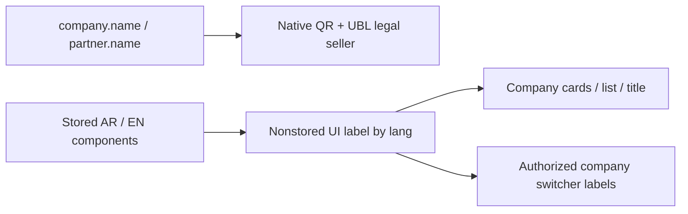
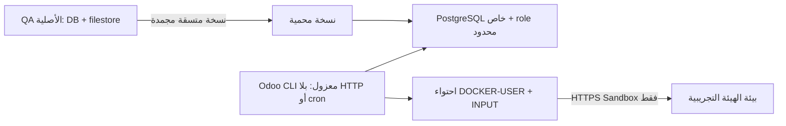

# رحلة الفوترة الإلكترونية — المرحلة الثانية

مرجع موحد للبحث وتجربة QA وخطة التطبيق الحي، بدأ بتاريخ 2026-10-04.
المعرف المعماري: ZATCA-MIXED-PHASE-QA-20261004. النطاق الحالي QA فقط؛ لا نشر حي مصرح لهذه الرحلة.

## البداية: طلب البحث وما وجدناه

### ملحق العمل الحالي — إصلاح هوية QR، 2026-10-04

هذا المدخل يصحح النطاق الحالي دون محو تاريخ التجربة أدناه: اعتمد المالك إصلاح اختلاف اسم البائع، ثم طلب «صحح هذا وانشرها في اللايف بعد». التفويض الجديد لنشر **إصلاح الأسماء فقط**؛ لا تفعيل المرحلة الثانية أو تغيير VAT أو الشهادات في اللايف، ولا استبدال VAT ببيانات Sandbox التجريبية.

- G0 (قيد المراجعة): عيب عقد مثبت، لا انحدار Phase2 مثبت. تخصيص `res.company.display_name` يختلف حسب اللغة، بينما XML القانوني يأخذ `partner.name`. إصلاحنا يعيد السلوك الأصلي لحقل display_name وينقل تسمية الواجهة وحدها إلى `baseer_display_name` المحسوب غير المخزن. القبول: اسم QR يطابق XML بالعربية والإنجليزية، وتبقى بطاقات/عنوان/قائمة/تبديل الشركات محلية اللغة، دون أي كتابة لهوية أو حركة مالية أو شهادة.
- G1 (قيد المراجعة): نفس قاعدة البيانات والرصة وحجم العضوية. قراءة batched للأسماء الموجودة بالفعل في جلسة المستخدم، O(n) بعدد الشركات المصرح بها؛ افتراض 100 شركة/جلسة، بلا نمو مستندات/مهام/cache إضافي أو استعلام لكل شركة. لا ادعاء سعة/تزامن جديدة، لا اختبار حمل إنتاجي.
- G2 (قيد المراجعة): الاسم القانوني المخزن `company.name == partner.name` يبقى المصدر. الواجهة تستعمل الحقل الجديد في المواضع الثلاثة الحالية وsession relabel فقط. Native QR/UBL والتوقيع والضريبة والدقة والترحيل والمرتجعات والدفاتر/ACL تبقى أصلية؛ لا تعديل ملفات Saudi ولا تجاوز تحققها. الحقل nonstored لا يحتاج عمود SQL أو ترحيل قيم. Generic many2one غير المخصص يعود للاسم الأصلي. أي QR قديم موقع/مرفق/مرحّل لا يعاد توليده أو إرساله؛ التحقق معاينة محلية وrollback فقط.
- G3 (قيد المراجعة): Odoo19/Python/XML والإضافات القائمة فقط، إصدار seed المقترح 19.0.1.6.2. لا مكتبة أو JS أو تبعية Saudi جديدة. أقل مسار مباشر: تصحيح مصدر تخصيص العرض، لا override مالي جديد. التحقق: اختبارات Odoo المحددة، معاينة QR/XML أصلية بلا API، ثبات snapshots المالية/الهوية/EDI/الشهادات، أرشفة Git مجمدة ثم PR/CI وسياسة النشر المحمية إلى QA وبعدها LIVE. يُراجع توافق upgrade مع وراثة onboarding المنجرفة قبل التشغيل، ولا يعاد تحميل الموديول الأب.
- G4: نفس مكونات أودو وتنسيقها، تغيير اسم الحقل فقط؛ لا إعادة تصميم أو حركة. فحص AR/EN للـarch/session، مع عدم ادعاء فحص متصفح حين لا تتاح أذوناته.
- المراجعة المستقلة: حارس البوابات/خبير ERP `heat_gate_review` قبل الكود وعند التسليم، ومختبر العقود `heat_tests` لخريطة الفرق والاختبارات؛ قائد البناء منفذ الكود. بقية الأدوار مجمعة بقدر الفرق، لا دورة إعادة تدقيق المشروع.
- النية التالية: بعد اعتماد G0–G3 تنفذ الملفات المحددة، وتجمد وتختبر على النسخة المعزولة OFFLINE فقط. مشكلة `certificate-permissions` تظل مانعًا منفصلًا لا يعالجها إصلاح الاسم؛ لا إعادة إرسال للهيئة ضمن هذا الإصلاح.

قراءات التخطيط المجمعة: سجل المعمارية/سجل إصدار الأسماء الحالي، company_names.py وir_http.py وres_partner_views.xml واختبارات الشركة وmanifest وmigrations1.6.1؛ مختبر مستقل أكد المصدر الأصلي للـQR في المرحلتين. إنشاء فرع codex/company-qr-identity-20261004 من53511cd2، ونسخ سجل الرحلة الحالي دون تغيير تاريخها؛ لا كود تطبيقي أو نشر حتى اعتماد البوابات.

قرار مستقل لاحق: heat_gate_review اعتمد G0–G3 للإصلاح المحدود قبل الكود، مع حفظ الرقابة والهوية/ACL/EDI والشهادات. وافق على تكرار pre/post1.6.1 حرفيًا تحت1.6.2 كاستثناء توافق ترقية محدد، أقل أثرًا من إعادة هيكلة helper مشترك، لأن XML الخدمات غير متغير؛ exact XMLID/parent/arch guard وnoupdate restore إلزاميان. GO للبناء فقط؛ النشر ينتظر المصدر المجمد والفحوص والمراجعة المستقلة. النية الآن تنفيذ الملفات الأربعة+tests/version ونسخ migration نفسه؛ لا تعديل للأب أو موديول Saudi.

تصحيح حدود QR لاحق بناء على مراجعة المختص: native `l10n_sa_qr_code_str` غير مخزن؛ استعادة display_name قد تغير إسقاط QR الديناميكي عند قراءة/طباعة فاتورة Phase1 قديمة. لا force recompute أو تعديل حركة/مرفق/ملف XML موقع/PDF محفوظ أو إعادة إرسال. لذلك لا ندعي ثبات العرض الديناميكي القديم، بل ثبات المستندات والهوية والأثر المخزن. هذا يصحح العبارة المطلقة في عقد G2 أعلاه.

تنفيذ المصدر: f421624f1ffe013053f1cbb1872134d905b65b6c، seed1.6.2، tree11e6d59b6a3e18a01f49d535fec477097087a657؛ migration1.6.2 مطابق حرفيًا1.6.1. PR165 وفحص Source integrity37164718960 ناجح. archiveGitLF SHA2561f181f9452536f8e91b40774f1ab35461aee4a1c2146ba83fa23283e6e742740. helperoffline syntax/ASTPASS؛ النية ترقية النسخة الخاصة فقط من frozenmodule، backupcloneثم protected hashes wholefinance/EDI/cert/key/identity/partners/membership/attachments/onboardingflags/othermodules، اختبار9Odoo ومقارنة4دوراتAR/EN للواجهة ومعاينةPhase2QR بتوقيعnativeمحليحقيقي وPhase1QRأصلي. لا اتصالAPI أو شهاداتSandboxللإنتاج؛ لا ادعاء قبول الهيئة من هذه المعاينة.

نتائج فعلية لاحقة: BEFORE أعاد إثبات اختلاف native tag1 source عن XML. الترقية المحدودة نجحت و9اختباراتOdoo:0failed/0error. AFTER توقف fail-closed لأن native module load أعاد cron40 لرد بيانات Google reviews في النسخة؛ لم يعمل worker أو API. المقارنة كشفت res_partner أربعةسجلات وir_attachment سجلين لها write_date جديد فقط. استعيد pre-qr-fix.dump إلى private baseline audit، وقورنت كل الأعمدة/IDsets والمحتوى/روابطالمرفقات؛ لا فرق آخر. سجلmetadata-audit.json محمي يحفظ exactbefore/afterhash والستةIDs/columns؛before.json الأصلي لم يعدل. راجع المختص الدليل مستقلًا واعتمد delta المحددة، لا تجاهل عام للحقول أو الجداول. جرى إطفاء cron40 وحده فيclone ثمAFTERreadonly، دون إعادةupgrade/tests.

AFTER النهائي PASS: أربع دوراتAR/EN بالتناوب، nativePhase2QR9tags بتوقيعمحليحقيقي يطابقXMLlegal/company.name وnativePhase1QR5tags يطابقالهوية؛ views3/sessionmembershipmetadata/localizedlabelsPASS. حسابات8585حركة/21276سطر،122دفتر،EDI1،cert6/key3،company8/عضويات/onboardingflags/إصداراتبقيةالموديولات مطابقة. محتوى/روابطالشركاءوالمرفقات ثابتة باستثناءwrite_dateللسجلاتالمدققة.0API؛ هذا توافق أسماء محلي وليس قبولSandboxولاProduction. الدليل المحمي /srv/baseer-qa/zatca-phase2-test-20261004/{QR_TESTS.log,QR_restore-cron.log,pre-qr-fix.sha256}، ومجلد company-qr-proof فيvolumeالخاصة. نسخة المصدر لم تتغير أثناءالفحوص.

موافقة المالك اللاحقة «موافق» على حدود QR الديناميكي وعدم تغيير الملفاتالمحفوظة. فحص قبلالنشر READONLY علىQA/LIVE:seed1.6.1 وPhase2uninstalled؛ البصمتان f8be0afc674e38ba57af227e9928ff5284bb6527676688980b26d44403c00292 / baef4c110cb832e907f579e948e4f931ae884dbb5ff00b48d955cb7a2021e886. النية التالية: مراجعةتسليممستقلة ثمدمجPR165وبناءسياسةseedفقط للمصدرالمجمد،QAactualacceptanceثمLIVE؛ لا تفعيلPhase2فيهما.

مراجعةalpha-deliveryمستقلةقرأتالأدلةالفعليةوالاسترجاعوالمصدر: GO QA، وGO LIVEمشروطQAactualPASS وحمايةsource/recovery/البيانات/المرفقات/cronخاصلكلبيئة، دونتعميمmetadatahashclone. PR165دمج9ae952005d03c941495e332b507f725577c2a6d4؛ moduletree11e6d59 مطابقللمختبرf421. النية: سياسةQA/Production releasebaseer-2026-10-04-company-qr-identity لهذاالمصدروseedوحده،مسارPR/CI ثمGitHubActionsالمحمي. لاG4visualPASS ولاPhase2/certصلاحيةأوAPIretry.

طلب المالك التحقق من مشكلة سابقة: عند تفعيل المرحلة الثانية لشركة في قاعدة متعددة الشركات، كان الربط يبدو مفروضًا على بقية الشركات التي تستخدم الضريبة والمرحلة الأولى فقط. سمع المالك عن إصلاح من أودو وطلب البحث ومقارنة ذلك بالنسخة الحالية. هذه رواية تاريخية من المالك، وليست إثباتًا أن العطل قائم الآن أو أن سببه واحد في كل إصدار.

النتائج الموثقة:

1. إصلاح أودو الرسمي **[FIX] l10n_sa_edi, l10n_sa_edi_pos: patch up POS usability** موجود في سلسلة الإصدار 19.0: [PR246932](https://mergebot.odoo.com/odoo/odoo/pull/246932)، commit الدمج `595355948380a3121e05b3bc6f43a42f68bdf338`، والمصدر الأصلي [PR234945](https://mergebot.odoo.com/odoo/odoo/pull/234945). يعالج ظهور QR بعد إعادة الطباعة، والرجوع إلى مسار المرحلة الأولى عندما يكون دفتر الفواتير غير مهيأ والربط الإلكتروني غير مفعّل. **ليس وعدًا بفصل الشركات تلقائيًا عند تثبيت الموديول.**
2. إصلاح رسمي منفصل **[FIX] l10n_sa: Fixed Phase 1 QR code disappearing** يحافظ على عرض QR المناسب لفواتير المرحلة الأولى والثانية عند وجود موديول EDI: [PR223935](https://mergebot.odoo.com/odoo/odoo/pull/223935)، وأصله للإصدار18.0 [PR222285](https://github.com/odoo/odoo/pull/222285). لا يُخلط إصلاح العرض هذا مع إثبات إعداد عزل الشركات.
3. أودو يفصل التوطين `l10n_sa` ودعم POS `l10n_sa_pos` عن ربط المرحلة الثانية `l10n_sa_edi` و`l10n_sa_edi_pos`. الربط يهيأ على دفتر فواتير المبيعات، وبيئة API تابعة للشركة. [وثائق السعودية لأودو19](https://www.odoo.com/documentation/19.0/applications/finance/fiscal_localizations/saudi_arabia.html)، [إعداد الشركة](https://github.com/odoo/odoo/blob/19.0/addons/l10n_sa_edi/models/res_config_settings.py).
4. شرط منع فتح POS في [الكود الرسمي](https://github.com/odoo/odoo/blob/19.0/addons/l10n_sa_edi_pos/models/pos_config.py) يعتمد على تفعيل `sa_zatca` في دفتر فواتير ذلك POS وعدم اكتمال تهيئته. تعطيل اختيار EDI ليس تعطيلًا للضريبة.
5. EDI يستطيع التفعيل افتراضيًا على دفاتر متوافقة عند إنشاء/إعادة حساب الإعداد؛ لذلك لا يكفي عدم تسجيل شركة في فوترة. يجب جرد دفاتر كل شركة وضبط اختيار EDI والتحقق من المستندات المعلقة قبل أي تعديل. [قارئ الإعداد الافتراضي](https://github.com/odoo/odoo/blob/19.0/addons/account_edi/models/account_edi_format.py)، [حساب إعداد الدفتر وحماية الوثائق المعلقة](https://github.com/odoo/odoo/blob/19.0/addons/account_edi/models/account_journal.py).

### المقارنة الفعلية قبل التجربة

فحص قرائي على اللايف بتاريخ2026-10-04: أودو `19.0-20260817`؛ `l10n_sa 19.0.2.2` و`l10n_sa_pos 19.0.1.0` مثبتان. `account_edi` و`l10n_sa_edi` و`l10n_sa_edi_pos` غير مثبتة. لم تُغيّر إعدادات أو تُنشأ فاتورة أو يُستدعَ تسجيل ZATCA. إذن لا يوجد إثبات لتداخل المرحلة الثانية الحالي في هذه القاعدة؛ لا يُنسب لها عطل حاضر اعتمادًا على رواية الماضي.

فحص مصدر الموديولات الموجودة في صورة الخادم أكد شرط الدفتر المستقل في `l10n_sa_edi_pos/models/pos_config.py`، وإعداد API مرتبطًا بالشركة، وتوافق دفاتر المبيعات السعودية مع EDI. وجود الملفات في صورة أودو **لا يعني أن الموديول مثبت في قاعدة البيانات**. لم نفحص كل تعديلات صورة الخادم ولا ندّعي تطابقها الكامل مع أحدث upstream.

## عقد التجربة — الشركات الموجودة، لا شركات جديدة

طلب المالك استخدام الشركات الموجودة نفسها على QA:

| الشركة | company_id في QA | دفتر المبيعات | الحالة المطلوبة |
|---|---:|---:|---|
| ARZ / أرز | 1 | 8 | المرحلة الأولى؛ ضريبة وQR دون ربط مرحلة ثانية |
| المعلم الشامي | 2 | 18 | المرحلة الثانية على Sandbox فقط |
| دوحة المستهلك | 3 | 28 | المرحلة الثانية على Sandbox فقط |
| أبرج | 56 | 414 | المرحلة الثانية على Sandbox فقط؛ لا POS قائم |

الضريبة وقيودها تبقى تحت سلطة أودو الأصلية. لا خلط للشركات أو الشهادات أو الدفاتر. لا استخدام لمفاتيح أو شهادات الإنتاج، ولا تغيير رقم ضريبة/عنوان واقعي دون اختيار صريح من المالك. أي بيانات افتراضية معتمدة للتجربة تكون واضحة بأنها QA/Sandbox، ولا تُنسخ لاحقًا للايف.

معايير القبول: فاتورة وPOS للشركتين المرتبطتين يمشيان في المسار التجريبي؛ أرز تعمل بالمرحلة الأولى دون طلب تهيئة ZATCA؛ فشل ربط إحدى شركتي المرحلة الثانية لا يفرضه على أرز أو يستخدم شهادة الشركة الأخرى. توازن القيود، عدم مضاعفة الإرسال، وQR المناسب مصادر قبول مستقلة. اختبار فشل مصطنع يوثّق كمحاكاة ولا يقدم بوصفه استجابة حقيقية من الهيئة.

## G0–G3: خريطة الأثر والقرارات قبل التنفيذ

التصنيف ARCHITECTURAL: تثبيت تكامل مالي على قاعدة QA مشتركة. لا بناء واجهة أو موديول جديد مخطط.

الخريطة: الشركة -> دفتر فواتيرها / إعداد POS -> مستند Odoo وقيوده -> مستند EDI عند التفعيل -> شهادة دفتر الشركة -> API Sandbox. أرز: مستند وضريبة/QRالمرحلةالأولى، دون مسار EDI. التثبيت على مستوى القاعدة، لكن التفعيل والتهيئة على الشركة/الدفتر؛ الخطر هو الإعداد الافتراضي، لا ضرورة إنشاء قواعد منفصلة.

G0: هدف وحدود وبيئة قبول كما أعلاه؛ لا LIVE ولا وثائق/حركات أصلية معدلة. G1: تجربة محدودة بثلاث شركات ومستخدم اختبار واحد وعمليات قليلة، لا اختبار حمل أو شهادة سعة؛ نسخة قاعدة+filestore متسقة ومحمية قبل التثبيت، وقفل يمنع تعارض نشر QA. G2: النماذج والضرائب والترحيل والتقريب الأصلية تبقى مصدر الحقيقة؛ لا سياسة ضريبية جديدة، ولا حذف وثائق EDI معلقة، ولا تخطي التحقق. إعداد الشركات غير الداخلة في المرحلة الثانية يجب ألا يتغير نتيجة التثبيت الافتراضي. G3: القدرة الأصلية في أودو19 هي المسار الأقصر؛ لا اعتماديات UI أو طبقة تكامل مخصصة. التثبيت عبر مسار أودو المعتمد، لا نسخ/تعديل ملفات موديولات QA يدويًا ولا توسيع غلاف النشر للتحايل على قائمته.

اختبارات مالية مؤقتة داخل savepoint/rollback حيثما أمكن، بدون التزام حركات مالية نموذجية مشتركة بالخطأ. إرسال Sandbox الحقيقي قد يترك أثرًا خارجيًا حتى عند rollback محلي؛ يسجل منفصلًا ولا يُعَد قابلًا للمحو. عند الحاجة لوثائق عرض QA دائمة يجب وسمها كتجربة وتوثيق مصدرها. لا تغيير تواريخ/فترات أصلية ولا إغلاق جلسة كاشير قائمة.

| البوابة | الحالة | الدليل/الحد |
|---|---|---|
| G0–G3 | GO مستقل — النسخة المعزولة فقط، 2026-10-04؛ heat_gate_review | يعتمد نطاق البندين15/16 بدل خطة QA المشتركة السابقة: `zatca_phase2_qa_test_20261004` بقاعدة/container/volume مستقلة، صورة ومصدر QA الحاليين دون تعديل، ولا منافذ/HTTP/cron. قبل التثبيت: نسخة DB+filestore متسقة محمية وhash/manifest؛ pg_dump مع نسخ ملفات دون إثبات اتساق لا يكفي. التثبيت الأصلي بلا egress أو مكتبات/كود مضاف؛ أثر post_init العام/default EDI يجرد داخل النسخة فقط. قبل أي ترحيل أو اتصال خارجي: sa_zatca على18/28/414 وحدها، جميع الدفاتر الأخرى off، فحص queue ومنع إرسال أي مستند تاريخي من النسخة، ثم Sandbox الأصلي فقط وشهادات مستقلة لكل شركة/دفتر؛ ARZ1/8 مرحلة أولى والمصدر وجلسة QA دون تغيير. VAT الحقيقي ثابت؛ متطلب VAT بديل أو اعتماديات ناقصة يوقف المسار. يسمح اختصار اسم CSR في النسخة إلى مكوّن إنجليزي موجود ومعتمد فقط عبر ORM، مع حفظ هوية الشركة والشريك والمكوّنين واستعادتها ومطابقة snapshot قبل فاتورة/قيد اختبار محاسبي؛ وثائق compliance الأصلية أثناء onboarding أثر Sandbox موثق، ولا تجاوز للتحقق أو ادعاء نجاح بعد الاستعادة قبل G5. مشغل واحد وعمليات قليلة، أسرار ونسخ محمية؛ لا اعتماد لتثبيت/تهيئة QA المشتركة أو LIVE ولا ادعاء G4/G5 أو امتثال إنتاجي؛ انتقال QA الفعلية يحتاج مراجعة مستقلة لاحقة. |
| G4 | غير مبدوءة | واجهة أودو الأصلية؛ لا ادعاء فحص بصري، ولا تجاوز حماية المتصفح |
| G5 | NO-GO للمرحلة الثانية؛ قبول جزئي فقط | تسجيل الدفاتر نجح؛ أول فاتورة Sandbox رُفضت HTTP400، واختبار بقية الفواتير/POS متوقف. لا اعتماد QAالمشتركة أوLIVE. |
| G6 | غير مبدوءة | قياس محدود للتجربة، ليس اختبار حمل |
| G7–G8 | غير مبدوءة | أدلة التنفيذ ومراجعة التسليم المستقلة |

## فحص QA الأولي والعائق قبل التثبيت

قاعدة QA `baseer_live_qa_clean_20260928`، أودو`19.0-20260817`؛ حالة الموديولات كما في اللايف: توطين السعودية/POSمثبت، المرحلةالثانية/EDIغيرمثبتة. الشركات الثلاث موجودة ودفاترها مستقلة بالمعرفات أعلاه.

- المعلم الشامي ودوحة المستهلك: رقم الضريبة بصيغته الحالية لا يجتاز فحص15رقمًا يبدأ وينتهي بـ3؛ `state_id` و`street` غير مكتملين. لا نشر لهذه القيم في السجل ولا استنتاج أرقام بديلة.
- أرز: الرقم يجتاز فحص الصيغة فقط؛ ذلك ليس تحقق تسجيل قانوني. العنوان ناقص أيضًا، لكنها ليست هدف الربط التجريبي ولا يغير بياناتها الاختبار.
- يوجد على POS`ARZ2` جلسة غير مغلقة في QA. لا تغلق ولا تستخدم حركاتها لاختبار ترحيل/دفع؛ تختار رحلة لا تمسها.
- المطلوب حسم الاختيار: بيانات Sandbox افتراضية مؤقتة للشركتين على QA مع حفظ الأصل، أم بيانات صحيحة يقدمها المالك. هذا عائق إعداد مدعوم بدليل، لا عطل مثبت في أودو.

## سجل العمليات الحي

1. بحث2026-10-04: المصادر الرسمية أعلاه؛ النتيجة إصلاحات محددة موجودة، مع ضرورة إعداد كل دفتر، وليس ضمان فصل تلقائي. فحص LIVEقرائي فقط؛ لا تغيير.
2. تجهيز2026-10-04: قراءة تعليمات المشروع ومهارات البناء/المعمارية والبوابات وERPوالسعة والاختبار. فرع مستقل `codex/zatca-mixed-phase-qa-20261004` من`official/main b90c0f3b` في`C:/w/ec-restore`؛ مساحة المستخدم الأصلية غير معدلة.
3. فحص QAقرائي: `/tmp/zatca-qa-preflight-20261004.log`، معاملةREADONLYثمrollback. كشف الموديولات غير المثبتة ونقص بيانات الربط وجلسةQAالمفتوحة. لا مفاتيح/قيم VATمطبوعة، لا تسجيل/إرسال/فواتير.
4. عقد قبل التنفيذ: سجل المستخدم الشركات2/3مرحلةثانية والشركة1مرحلةأولى، وطلب جمع البحث والإصلاح والتجربة وخطةاللايف في هذا المرجع. السؤال عن بياناتSandboxموجّه قبل أي تغيير. لا تثبيت بعد ولا ادعاء نجاح.
5. توضيح بناء على سؤال المالك عن وجود الأرقام: فحص قرائي مستقل للوجود/طول الرقم فيQAواللايف يؤكد أن VATللشركتين2/3 **فارغ تمامًا**، لا رقم مدخل بصيغة خاطئة. VATأرز1 موجود وطوله15وصيغته تجتاز الفحص، وليس ذلك تحقق تسجيل قانوني لدى الهيئة. هذا يوضح استنتاج فحص الصيغة في البند3 ولا يغيّر بيانات. الأدلة `/tmp/zatca-qa-preflight-20261004.log` و`/tmp/zatca-readonly-20261004.log`؛ لم تطبع قيمVAT.
6. استئناف بتوجيه المالك «جرب على QA» ثم «ابدأ»: تحديث VAT والسجل التجاري للشركات2/3/56 من الشهادات سبق وحُفظ في QA واللايف، ولذلك لا يعتمد نقص VAT التاريخي أعلاه كحالة راهنة. انتهى نشر عرض أسماء الشركات بالإصدار19.0.1.6.1 منفصلًا؛ لم يثبت أو يفعّل EDI. النية الحالية: إعادة تشغيل فحص QA القرائي الموجود لعناوينCSR والدفاتر والموديولات والجلسات؛ لا تثبيت أو تغيير عنوان أو تسجيل/إرسال خارجي قبل اعتماد حدود العزل وحسم بيانات الربط الناقصة. قراءة العقد والبوابات وERP والسعة والمعمارية مجمعة قبل هذا الفحص؛ اللايف خارج التجربة.
7. الفحص القرائي بعد الاستئناف نجح: VAT للشركتين2/3 موجود وطوله15 وصيغته تجتاز الفحص؛ لا تحقق تسجيل خارجي. state_id وstreet لا يزالان ناقصين في الشركتين؛ دفاتر18/28 مستقلة، EDI/المرحلةالثانية غيرمثبتة، POS3/4 ملخصات وليسا كاشير تجربة مباشرًا. جلسةARZ2/23 القائمة باقية دون تغيير. دليل /tmp/zatca-qa-preflight-20261004.log؛ READ ONLY ثم rollback، ولا تثبيت/تهيئة/فاتورة/إرسال. تجربة الربط الفعلي متوقفة قبل G2/G3 حتى اختيار عناوين QA التجريبية المؤقتة أو تقديم العناوين الصحيحة؛ بيانات التسجيل الحقيقية واللايف لم يتغيرا.

8. قدم المالك صورتين منفصلتين لإثبات العنوان الوطني للشركتين2/3، ثم صرح صراحة بتحديث العناوين في QA واللايف. التفويض محدود بالعناوين، وليس تفعيل المرحلةالثانية على اللايف. النية: اكتشاف حقول العنوان السعودية الأصلية وقراءة القيم الحالية، حفظ نسخة قيم محمية، تحديث كل شركة من صورتها بمعاملة مستقلة متحققة، ثم إعادة قراءة ومقارنة هوية الشركات/الأرقام الضريبية/السجلات/الدفاتر. الإثباتان قديمان بحسب تاريخ الانتهاء المطبوع؛ نستخدمهما كمصدر البيانات الذي قدمه المالك، ولا ندعي تحقق صلاحية إثبات حديث أو تسجيل خارجي. لا نسخ لرقم مبنى شركة إلى الأخرى، ولا تحديث لأرز أو أبرج أو عناوين فروع أخرى. مراجعة مختص مستقلة محصورة بالتغيير التشغيلي، دون تثبيت EDI أو تغيير مصدر التطبيق.

9. توسعة صريحة محصورة بالعناوين: قدم المالك صورة عنوان أبرج وطلب تحديث الشركة56 في QA واللايف أيضًا. نضيفها إلى نطاق2/3 دون اعتبارها هدف ربط مرحلةثانية. الفحص القرائي اكتشف أن قاعدة الدول السعودية الحالية تعرض الظهران بسجل state أصلي DHA؛ ولا توجد حقول مبنى/رقمفرعي/عنوانمختصر مستقلة قبل تثبيت EDI. لذلك تستخدم حقول العنوان الأصلية المتاحة مع حفظ مكونات الصور بشكل منظم في النسخة المحمية لإعادة استخدامها عند تهيئة QA لاحقًا؛ لا تثبيت حقول/موديول على اللايف لأجل العنوان. مراجعة الخريطة والمصدر المتاح محصورة، وإعادة قراءة عنوان الشركة56 قبل الحفظ.

10. CHECK على QA نجح عبر ORM الأصلي ثم rollback؛ أعيدت قراءة العناوين من الشركة والشريك المرتبط، وقورنت أسماء/VAT/سجلات/علاقات الشركات والشركاء وجميع الدفاتر وحالة EDI والعناوين غير المستهدفة ولم تتغير. لا حفظ بعد. البيانات الجديدة تتضمن المبنى في street والحي/الرقم الفرعي/العنوان المختصر في street2، والمدينة والرمز البريدي وسجل الظهران الأصلي DHA. عند تركيب EDI على QA لاحقًا، يلزم نقل المكونات المحفوظة إلى حقول المبنى/Plot المستقلة وتنقية حقول الشارع/الحي؛ لا يعد العنوان النصي الحالي إثبات جاهزية ZATCA. المراجع المستقل heat_gate_review يفحص سكربت التشغيل المحدود قبل APPLY؛ لا Git/source release مطلوب لبيانات أودو التشغيلية، ولا EDI مرشح هنا.

11. طلب المالك لاحقًا «شف أبرج كذلك المرحلةالثانية»: إضافة الشركة56 إلى أهداف اختبار المرحلةالثانية على QA مع2/3، وأرز1 تبقى مرحلةأولى. هذا يصحح حدود العقد السابقة التي جعلت56 عنوانًا فقط؛ لا يلغي التاريخ ولا يفسر طلب عنوانLIVE كتصريح بتفعيلEDIالإنتاج. تعاد G0/G2 إلى قيد المراجعة للنطاق الموسع، ويلزم جرد دفتر56/POS/متطلبات التسجيل والعزل قبل أي تثبيت. لا أثر على عملية تحديث العناوين الثلاثة المصرح بها في البيئتين.

12. مراجعة مستقلة heat_gate_review: GO لتحديث العناوين المحدود للشركات2/3/56 في QA ثمLIVE، بعد CHECK/rollback الناجح؛ القرار لا يعتمد بوابات تثبيتEDI ولا يفعله. التحذير: accepted.json يكتب قبلcommit للحماية؛ أي فشل يلزم فحص حالة المعاملة قبل إعادةAPPLY، وأي فشل يمنع الانتقال للبيئة التالية. النسخ المحمية على volumes دائمة، لا source release. جرد أبرج56 القرائي: دفترSales414 قائم، لا POS، VATصيغته تجتازالفحص. النية الآن APPLY وVERIFY علىQA ثمAPPLY وVERIFY علىLIVE فقط إذانجحالأول.

13. QA APPLY حفظ العناوين الثلاثة ونجح فحص داخل المعاملة؛ VERIFY الأول توقف بسبب تمثيل العلاقات: tuples من ORM مقابل lists في JSON، لا اختلاف بيانات مثبت. أوقف انتقالLIVE، ولم يعاد APPLY علىQA. طُبّع snapshot إلى JSON دون حذف أي حقل أو شرط، ثم VERIFY القرائي نجح بمطابقة accepted كاملًا وhash الهوية نفسه. heat_gate_review راجع التعديل الصغير واعتمد GO إلىLIVE؛ الإقفال التشغيلي مشروط بنجاحVERIFYفيLIVE وحفظ النسخ. النية APPLYثمVERIFYعلىLIVE الآن.

14. اكتمل تحديث العناوين2/3/56 فيQAواللايف؛ APPLY وVERIFY فيLIVE نجحا، وVERIFY النهائي فيQA سبق ونجح. أسماءالشركات/VAT/السجلات/الدفاتر/حالةEDI وعناوين بقيةالشركات والشركاء دون تغيير؛ حفظ القيم السابقة والمكونات وaccepted في /var/lib/odoo/zatca-address-update-20261004 على volume دائم لكلبيئة. أدلة /tmp/zatca-address-update-QA-APPLY-20261004.log وQA-VERIFY وLIVE-APPLY وLIVE-VERIFY. قرارالمراجع المشروط تحقق فإقفال تحديث العنوان GO؛ ليس إقفالG0–G3لتكاملEDI، ولم تثبت أوتفعلالمرحلةالثانية فيأيبيئة.

15. أعاد المالك تأكيد أن الاختبار ينفذه الوكيل على QA للشركات2/3/56 فقط، وطلب تحديث هذا المرجع باستمرار. خطة دخول G0–G3 الموسعة: مصدرQA الحالي readonly كماهو؛ لا بناءموديول أوتغييركود أوتوسيعسياسةالنشر. تبدأ التجربة بنسخةDB+filestore معزولة منQA، في قاعدة/container/volume مسماةzatca_phase2_qa_test_20261004، دونHTTP أوcron ودونportعام. النسخ يحفظالمصدر ولا يغير جلسةARZالمفتوحة. أصلالمال والترحيل والتقريب Odoonative؛ العملياتالاختبارية فيالنسخة فقط، بإعدادSandboxpercompany/دفتر18/28/414، وتعطيلEDI لجميعالدفاترغيرالمستهدفة قبلأيترحيل. لا تعديلVATالأصلي لتجاوزتحقق؛ إن تطلبSandbox VATتجريبيًا يتوقف هذا المسار لقرارالمالك بدلاًمنإخفاءالتغيير. الوصولAPI تجريبيمحدود بالعنوانSandboxالأصلي فقط، ولم يبدأبعد؛ نتائجمحاكاةلا تقدمكاستجابةحقيقية.
16. ملفG1مركزعلىالتجربة: مشغلواحد/طلبواحدفيكللحظة،3شركاتPhase2وشركةARZPhase1،فاتورةقياسيةومبسطة قليلةلكلشركةمعقيدمتوازن، وPOSتجريبيمستقلإذااجتازتهيئةالدفتر،دونلمسconfigsالملخصات. المصدرQAنفسimage/addons/sourceالمعلن؛ صلاحياتSQLمحددةللقاعدةالمعزولة،القراءةعنالحمايةمختصرةبمعرفاتوشا. الاحتفاظبنسخةمصدرمحميّةومخرجاتمنقحة؛لاوعودأداءإنتاج. الاستعادة:حذف/تعطيلالمواردالمعزولةبعدحفظالنتائجفقطبطلب/مسارصريح،لاتستعملdumpقديمفوقQAبعدعملياتمستخدمين. قبلتهيئةQAالفعلية لاحقًا،يلزمG5عزل/توازنناجح،backupمتسق/نافذةتوقفلـQAوقفلنشر،وcron/outboundمحصورانأثناءالتثبيت؛فحصqueueقبلإعادةالخدمةومراجعةمستقلةتخصهذاالانتقال. G0–G3قيدالمراجعةالآن لمسارالنسخةالمعزولة،لاLIVE.

17. حارسالبواباتheat_gate_review اعتمدG0–G3للنسخةالمعزولة وحدّثالصف؛ لاQAمشتركة/LIVE. أضيفالحدNative64bytesلـCSR:اختصار مؤقت للمكوّن الإنجليزي الموجود والمعتمد داخلالنسخة فقط،استعادة اسم/مكوّنين/شريك مطابقينقبل أي فاتورة اختبار،لا VATبديل أو bypass. النيةالأولى الآن: توقفQAقصير تحتtrapيعيدالخدمة،pg_dump+filestoreمعhashفي /srv/baseer-qa/zatca-phase2-test-20261004،إنشاءcloneجديدإنلميكنموجودًا،ثمCLIinstallالأصليl10n_sa_edi_posعلىbackendinternalدونHTTP/cron/egress. source/imageمثبتانبالguards،لا修改ملفاتإصدار.

18. نسخةالمصدرالمتسقة نجحت: DBdumpقرابة32MiB وfilestoreقرابة102MiB وSHAmanifest؛ توقفتQAأثناءنسخالمصدر وعادتتلقائيًاقبلrestore/test. الأصلQAcontainer running؛ لمتتغيرجلسةARZأوsource/image. تثبيتl10n_sa_edi_posومعتمدياتهاالأصلية نجحفي zatca_phase2_qa_test_20261004:211modules/registryloaded،CLIstop-after-init,noHTTP,noCron,backendinternalonly. توجدتحذيراتموديلاتpurchaseقديمةمفقودة فيsourceQAمنقبل،لمتغيّرمصدرهاولاتعنيصلاحيةتلكالوظائف؛ خارجنطاقالتجربة. لميفتحnetworkSandboxبعدولاonboarding/API/fiscaltest. الأدلة /srv/baseer-qa/zatca-phase2-test-20261004/install.log وbackup.sha256 وbackup-verify.log وsource.meta.

## قرار مستقل — تصحيح عزل موارد النسخة قبل API

2026-10-04، heat_gate_review: GO لتجهيز PostgreSQL مستقل للنسخة، بحاوية/volume/network داخلية وهوية اعتماد عشوائية محمية، وبنفس صورة PostgreSQL الثابتة المخزنة في QA؛ ينقل dump النسخة المثبتة إلى `zatca_phase2_qa_test_20261004` داخل هذا cluster فقط. لا اعتماد قاعدة أو config أو backend QA الأصلي في التشغيل الجديد، ولا تغيير لأدوار/pg_hba QA، ولا تشغيل النسخة القديمة. هذا يصحح حد SQL دون تعديل المصدر أو توسيع النطاق إلى QA المشتركة/LIVE.

لا GO لـONBOARD/INVOICES أو API حتى مراجعة helper المجمد والتحقق الفعلي من الاحتواء: فتح frontend مؤقتًا للنسخة وحدها، jump/chain مملوكان للاختبار دون flush عام، يسمح TCP443 فقط لعناوين IPv4 المحلولة لـSandbox مع رفض بقية egress واستثناء اتصال PostgreSQL الخاص اللازم. يجب أن يشمل المنع جميع مسارات الخروج والوصول إلى خدمات host؛ DOCKER-USER وحده لا يثبت منع host INPUT. حارس HTTP يثبت المضيف/مسار Sandbox ويمنع redirects، والبريد الصادر معطل في النسخة ومحجوب شبكيًا. تثبت السياسة قبل أي طلب ويثبت رفض وجهة غير مسموحة دون بيانات أعمال؛ cleanup يزيل قواعد الاختبار المحددة فقط. تظل مقارنة الهوية/المال، منع الوثائق التاريخية، حالات المراحل وعلامات النجاح المطلوبة للمراجعة التالية؛ هذا قرار تجهيز لا دليل نجاح G5 أو اتصال بالهيئة.

19. تصحيحاحتواءمعتمد:SQLالcloneالأولكانفيclusterQAبـroleمشترك؛نقلتدقائقالcloneالمثبتفقطإلىPostgreSQLخاصبcontainer/volume/networkbaseer-zatca-phase2-test-20261004. runtimezatca_runnerبـNOSUPERUSER/NOCREATEDB/NOCREATEROLE/NOREPLICATION وauthخاصمحمي؛لاQArolesأواعتاداتالأصلداخلruntime. تعثرالتهيئةالأولىعندpg_isreadyعلىunixأثناءinitالمؤقت،قبلCREATErole؛فحصوجدroleغيرموجود،استئنافمحددموثقعلىTCPlistenerالنهائيأنشأrole+DBواستعادالدَمبفنجح. لمتحذفمواردقديمة أوتعيدAPPLY/تهيئةعمياء. وثقprivate-role-proof.log وinstalled-clone.sha256. harnessمجمدSHA07cbe752f4778c4eba81b501d887754ef954548871c723be4ff3d2c067e5c1e3،قرأهالقائدكاملاًواجتازAST. النيةPREPAREبلاegress:تعطيلcron/mail،EDI18/28/414وحدها،nativeCRNمنالسجلالموجود،العنوانالمطبع،snapshotprotectedللهويةوالقيود،قبلأيAPI. لااعتمادAPIبعد.

20. PREPARE نجح فعليًا على PostgreSQL المعزول: الشركات2/3/56 ودفاتر18/28/414 وحدها في Sandbox؛ سجل الهوية والقيود التاريخية ثابت، وتعطيل cron والبريد الصادر ومنع الوثائق التاريخية. فحص الاحتواء الأول توقف قبل بدء أي API لأن Docker يعرض `invalid IP` لحاوية created غير مشغّلة؛ لم يُرسل أي طلب. صُحح المشغّل بانتظار بوابة محدود60ثانية لا يشغّل probe أوOdoo حتى تركيب قواعد الاختبار. NETWORKCHECK نجح: PostgreSQL الخاص وSandbox443 متاحان؛ HTTPS الآخر وSMTP وخدماتhost محجوبة. أزيلت الحاوية والقواعد الخاصة بعد توقفها، والأصل QA running. أدلة prepare.pass/networkcheck.pass وNETWORKCHECK.log وNETWORKCHECK-forward-proof.log وNETWORKCHECK-host-proof.log في المجلد المحمي نفسه. ONBOARD/INVOICES لم يبدأا بعد؛ ينتظران مراجعة مستقلة للشيفرة المجمدة والاحتواء، ولا اعتماد QAمشتركة أوLIVE.

21. ONBOARD نجح فعليًا مرة واحدة بعد GO مستقل: ثلاث دفاتر18/28/414؛ لكل دفتر8طلبات Sandboxحقيقية (CCSID+ستةcompliance+PCSID)، إجمالي24. native compliance_passed/PCSID/certificate/chain كلها true والأخطاء صفر؛ انتهى المشغّلexit0 وحفظonboard.pass. استعيدت أسماء ومكوّنا اللغتين للشركات والشركاء إلىsnapshot كامل، والهوية والقيود التاريخية متطابقة. هذا تهيئة تجريبية فيclone فقط، لا شهادات إنتاج ولا تثبيتQAالمشتركة. أدلةONBOARD.log وonboard-results.json وonboard-network.json محفوظة محميّة؛ لا ينشر CSR/CSID/المفاتيح فيGit. اختباراتINVOICES وPOS لم تبدأ بعد.

### قرار مستقل — دخول اختبار الفواتير المعزول بعد تحقق الاحتواء

2026-10-04، heat_gate_review: مراجعة كاملة لـhelper المجمد SHA256 `07cbe752f4778c4eba81b501d887754ef954548871c723be4ff3d2c067e5c1e3` والغلاف/probe؛ تحقق SSH قرائي مستقل من PREPARE وNETWORKCHECK وrole `zatca_runner` بلا superuser/createdb/createrole/replication، والشبكتين بلا IPv6، ورفض HTTPS الآخر/SMTP/host مع وصول PostgreSQL الخاص وSandbox443. مصدر الصورة يستعمل `requests.request` الأصلي فعلًا؛ المراقب يفوض الطلب الحقيقي ويمنع redirects ولا يختلق استجابة، وnative action_post يجهز الوثائق دون إرسال web-service، ثم processing محصور بوثائق الفاتورة المعينة. وافق المراجع على ONBOARD مرة واحدة، ثم قرأ ONBOARD.log الفعلي وonboard.pass: نجحت الشركات2/3/56 والدفاتر18/28/414، ثمانية طلبات لكل دفتر/24 إجمالًا، compliance وPCSID/certificate/chain مكتملة دون أخطاء، مع استعادة الهوية وثبات القيود التاريخية.

GO لـINVOICES مرة واحدة داخل النسخة وبنفس المصدر المراجع فقط: ست فواتير B2B/B2C اختبارية وواحدة ARZ مرحلةأولى؛ هويات المشترين الجديدة fixtures وهمية موسومة، وأرقام VAT الخاصة بها اصطناعية لا تعد ادعاء تسجيل ولا بديلًا عن VAT الشركات/العملاء الأصليين، ولا تنقل للايف. فشل التحقق الأصلي يوقف المسار دون bypass أو retry. attempt flags محفوظة قبل الاتصال؛ يحفظ القيد المرحل قبل طلب الهيئة، وتقبل النتيجة فقط بعد استجابة reporting/clearance حقيقية ناجحة وdoc sent مع XML/QR والتوازن وثبات الهوية والتاريخ، بينما ARZ بلا EDI/API. أي نتيجة خارجية غير مؤكدة تبقى حالة توقف ومراجعة لا إعادة إرسال تلقائية. هذا إذن إجراء اختبار G5 وليس نجاح الفواتير/QR/POS أو إقفال G5 كاملًا؛ لا فحص بصري ولا اعتماد QA المشتركة/LIVE. المراجعة طبق alpha-architects-team وبوابات alpha-build-team على الفرق المعزول، دون تغيير مصدر أو قاعدة من المراجع.

22. محاولةINVOICES الأولى توقفتValueError قبل إنشاء أول partner/move أوطلبAPIفاتورة؛ لاinvoices.pass. التشخيص الداخلي المعتمد، بلاfrontend وrequests/Sessionharddeny، أعاد EXISTING=[] وإطاراتdomainlookup عندhelper338 وROLLBACK=PASS؛ مصدرOdoo19 يعرّفaccount.account.active ولاdeprecated. العطل توافقfixtureالاختبار، لا عطلEDI أوبياناتمالك مثبت. حُفظINVOICES.log وDIAGNOSE.log ولمتمسحattemptflag أوتعادONBOARD. r2مجمدSHA14ed392e805f4dae1121e66ae5a8b7ea298fca5374e14c71da1dbf9ef1eb60d8، ASTناجح، يحصرالتغييرفيactive=True واستئنافINVOICES_RESUMEمرةواحدة. يرفضأيtaggedmove أوnetworkproofسابق، يقارنالهويةوالتاريخ، يحفظresumeattemptflagقبلالعمل دونتصفيرالمحاولةالأولى، ويفصلLOG/network/results للاستئناف. ينتظرمراجعةالفرقالمستقلةقبلالإرسال.

### قرار مستقل — استئناف واحد لفشل fixture دون أثر خارجي

2026-10-04، heat_gate_review: تحقق قرائي مستقل من DIAGNOSE.log: لا tagged moves، والخطأ ValueError في domain حساب الإيراد عند أول search قبل إنشاء الشريك/الفاتورة أو الاتصال، وrollback ناجح. مصدر الصورة يعرّف account.account.active؛ deprecated ليس حقل المجال المعتمد في19. روجع فرق helper-r2 المجمد SHA256 `14ed392e805f4dae1121e66ae5a8b7ea298fca5374e14c71da1dbf9ef1eb60d8` والغلاف، وطابق SHA الخادم؛ الأصل `07cbe752…` بقي دون تعديل. GO تنفيذ `INVOICES_RESUME` مرة واحدة داخل النسخة فقط: active=True بدل deprecated=False، ولا تعديل للضرائب أو VAT الشركات أو جسم مسار الفاتورة الأصلي. يرفض الاستئناف أيًا من المراجع السبعة أو دليل شبكة سابق، ويبقي invoice_attempted الأصلية ويحفظ invoice_resume_attempted قبل العمل؛ stage حصري في r2 وnetwork/results/log مستقلة تحفظ آثار الفشل الأولى. الغلاف يثبت hash وnetworkcheck/onboard.pass وغياب invoices.pass، وحواجز الشبكة/الانتظار/cleanup كما روجعت. لا إعادة onboarding أو مسح flags أو retry خارجي؛ أي فشل جديد يتوقف للتشخيص. القرار إذن اختبار محروس لا نجاح فواتير/G5 أو اعتماد QA المشتركة/LIVE.

### توقف مستقل — رفض فاتورة Sandbox فعلي، لا قبول G5

2026-10-04، heat_gate_review: قرأ مستقلًا INVOICES_RESUME.log وinvoices_resume-network.json المنقح من النسخة. حدث طلب واحد حقيقي فقط، POST invoices/reporting/single للشركة2/دفتر18/الفاتورة15329؛ الرد HTTP400، NOT_REPORTED، validation ERROR، بخطأي sellerName_QRCODE_INVALID وcertificate-permissions. توجد رسالة XSD_ZATCA_VALID وصفر warnings؛ صلاحية XSD ليست قبولًا ماليًا أو قبول الهيئة. حفظ القيد الاختباري قبل الاتصال، ثم توقف المسار دون invoices.pass أو إرسال الشركات الأخرى؛ لا إعادة إرسال أو POS/API لاحقًا، ولا اعتبار onboarding الناجح إثبات قبول الفواتير. التشخيص اللاحق قرائي/داخلي فقط، ويحافظ على artifact والـattempt flags وcron off.

المصدر الفعلي يبين أن QR tag1 في l10n_sa_edi/account_move.py يستخدم company.display_name، بينما XML RegistrationName يستخدم commercial_partner.name؛ موديول عرض الأسماء يترجم الأول حسب اللغة ويحفظ الثاني ثنائيًا. هذا مسار اختلاف محدد يستلزم مقارنة QR/XML بالـequality/sha قبل إثبات السبب، لا نسبة العطل لأودو أو لخطوة CSR المؤقتة بلا دليل. certificate-permissions سبب منفصل لم يحسم: يلزم فحص هوية CSR/PCSID وVAT في subject OID2.5.4.97 وSAN DirectoryName UID ومفتاح الشهادة ونوع الفاتورة، بمقارنات منقحة دون كشف القيم/المفاتيح/XML. لا إصلاح native مثبت ولا تغيير بيانات أو مصدر مصرح من هذا التشخيص؛ G5 غير مقبول وQA المشتركة/LIVE خارج التجربة. استخدمت alpha-bug-resolution للتشخيص المحدود.

23. الاستئناف المحروس INVOICES_RESUME، بعد GO مستقل للـr2، أرسل **طلب فاتورة واحدًا فقط**: الشركة2/الدفتر18/الفاتورة15329، مبسطة بمبلغ115 شامل ضريبة15. الرد الحقيقي HTTP400 وNOT_REPORTED/ERROR، بأكواد sellerName_QRCODE_INVALID وcertificate-permissions؛ XSD_ZATCA_VALID وصفرwarnings. أوقفت بقية6اختبارات الفواتير ولم تعاد المحاولة ولاالتسجيل. الفاتورة الجديدة كانت مرحّلة ومحفوظة قبلAPI؛ بعد فشلAssertion رُجعت تحديثات استجابةEDI، لذلك بقيت to_send داخلclone فقط مع cron/mail معطلين، بينما الرد الحقيقي محفوظ في invoices_resume-network.json. لا تخلط حالةقاعدةالنسخة مع قبولالهيئة، ولا تشغلcron أوتعيد إرسال15329. سجل المحاولة الأولى والتشخيص محفوظان منفصلين؛ invoices.pass غيرموجود.

24. تشخيص قرائي داخلي دونAPI أثبت: VATالبائع داخلXML يطابق VATالشركة؛ CSR org_id/UID يطابقان VATالأصلي ومفتاحCSR يطابقالمفتاحالخاص، لكنPCSIDUID لايطابقVAT/CSR، ومفتاحشهادةPCSID لايطابقCSR/المفتاحالخاص. كلاهما invoice_type1100. المصدرالمترجم لـQRtag1 (`company.display_name`) يختلف عنXMLRegistrationName (`commercial_partner.name`):19بايتًا مقابل97، دونتعديلالهوية. QRالمُرسل نفسه ليس محفوظًا بعدrollback؛ المقارنة هي مصدرQRالأصلي معXMLمولد Native، وليستادعاءفحصpacketمحفوظ. أولتشخيص توقفIndexError لأنQRغيرموجود؛ التشخيص الآمن المصحح أكملROLLBACK=PASS معتطابق كلصفوفالمالالحالية بمافيها15329. الأدلة REJECTION_DIAGNOSE_SAFE.log؛ لا أسرارأوأرقامVATخام بالتوثيق.

25. البحث الرسمي الإضافي: [وثائق أودو19 — السعودية، Sandbox/Simulation](https://www.odoo.com/documentation/19.0/applications/finance/fiscal_localizations/saudi_arabia.html) تصفSandboxبأنه مشتركمسبقتهيئته وتوصيVATتجريبيًا محددًا، بينماSimulation بيئةخاصةبالمستخدم. هذايدعم حدودشهادةSandbox، لايعني أنVATالمالكغيرصحيح، ولايثبت أنتبديلVATوحدهيعالجكلقيودالمفتاح. استخدامرقمSandboxفيالشركاتالمستهدفة يحتاجقرارالمالك لأنالعقد الحالي يحفظVATالأصلي؛ لا تغييرحتىالموافقة. تصحيحQRالمالي يجبأنيوحداسمهويةالبائعدونإلغاءلغةواجهةالشركات أوتغييرالاسمقسرًا. لمينفذأيإصلاحمصدر/monkeypatchQR أوتبديلVAT. نجاحSandboxبهويةمشتركةلايثبتاستقلالشهاداتالشركاتالحقيقية؛ ذلكيتطلبSimulationبتهيئةمنفصلةومفاتيحمطابقة.

## خريطة التجربة المتحققة وحدود القبول

المصدر والصورة مطابقان لـQA الحاليين؛ لا تغيير ملفات إصدار. الخريطة تحديث محدود لحدودSQL والشبكة الموثقة سابقًا، لا إعادة رسم للمشروع. مصدر المال: Odoo الأصلي للترحيل والضريبة والتقريب؛ تحقق Decimal100+15=115 وتوازن SUM(balance)=0 في fixture. مصدر قبول الفاتورة: ردAPIالحقيقي وEDI/XML/QR معًا، وليس نجاحonboarding. الاختبار مشغلواحد وطلباتقليلة؛ لا شهادةحمل/سعة/تزامن أوفحصواجهةجوال.

| المسار | النتيجة الفعلية | ما لم يُثبت |
|---|---|---|
| تسجيل المعلم الشامي/دوحة/أبرج فيSandbox | PASS؛24طلبًا حقيقيًا | مطابقة شهادةSandbox لـCSRالخاص؛ ليستشهاداتإنتاج |
| فاتورة المعلم الشامي المبسطة | REJECTED؛HTTP400/NOT_REPORTED | قبولPhase2، تطابقQR، صلاحيةشهادةلبائعفعلي |
| بقيةفواتيرالمعلم/دوحة/أبرج وPOS | لم تُرسل/لم تُختبر | أيادعاءنجاحأوقبولكامل |
| أرزPhase1 | PASS مستقل؛ فاتورة15330/دفتر8، إجمالي115 وضريبة15، قيدمتوازن وQRخمسةtags و0API | لا قبولقانونيلـsellerName أوواجهةPOS أوPhase2؛ الفاتورةالمرفوضة15329 وكلEDIوالمالالقائم دونتغيير |
| QAالمشتركة/اللايف | لم تُثبتPhase2 | لا انتقالإعدادات/شهادات أوتفعيلربط |

اختبار أرز المستقل أُجري مرة واحدة بعد GO/hash/AST على network الداخلية فقط وrequests+Session harddeny؛ ARZ_PHASE1.log وphase1-independent.json دليلان محميان. قدّم fixtureخاصًا ولميعالج فاتورةالمعلم المرفوضة. كلصفوفEDI الحالية والتاريخ المالي والهوية متطابقةقبلcommit، ومن ثم نُفذcommitلفواتيرfixtureأرزفقط. POShelper جاهز محليًا خارجالموديولات لكنلميرفع أوينفذ؛ guardsتمنعه حتىقبولالفواتيروخلوEDIqueue. لاكودمنتجأوموديولجديدأوتغييرLIVE.

قرار التسليم الحالي: **NO-GO لتفعيل المرحلة الثانية علىQAالمشتركة أواللايف**؛ يحفظ نجاحالتسجيل الجزئي والرفض الفعلي والتشخيص، ولايعلن اكتمالالتجربة. الخطوةالمتوقفةعلىاختيارالمالك: السماحبـVATتجريبي داخلcloneفقط وتصحيحعقدQR، أوSimulationخاصبأرقامالشركاتالحقيقية معOTP/صلاحياتالبيئة الرسمية. المستندات والأرقام الضريبية الحقيقية فيQAواللايف لمتتغير بهذهالتجربة.

تصنيف العطل وفق alpha-bug-resolution: أول تجربة Phase2 الحالية، ولا يوجد دليل نجاح سابق بنفس البيئة والبيانات؛ لا يصنف انحدارًا من ربط عامل. تعارض مصادر اسم البائع مثبت في التنفيذ الحالي، وقيد شهادةSandbox منفصل عن صحة الرقم الحقيقي. يوقف المسار قبل تغييرVATأومصدرQR المالي لطلبتفويضمحدد، ولايعاملتشخيصالتعارضكإذنإصلاحأونشر. مراجعةalpha-delivery-team محدودة بهذهالتجربة، وتعتمدالخريطةوالأدلةالقائمة لا دورةتدقيقإنتاجيةشاملة.

## إقفال مستقل محدود — alpha-delivery-team

2026-10-04، heat_gate_review: القرار **NO-GO للمرحلة الثانية**؛ القبول جزئي للدليل فقط: ONBOARD للدفاتر18/28/414، واختبار ARZ Phase1 الداخلي. قرأ مستقلًا ARZ_PHASE1.log وphase1-independent.json وطابق SHA helper: الفاتورة15330/دفتر8 بإجمالي115 وضريبة15، قيد متوازن، خمسة QR tags، صفر API، وثبات المال القائم بما فيه15329 وكل صفوفEDI. هذه بنية QR وليست قبولًا قانونيًا لاسم البائع أو دليل POS. أعاد قراءة حالة الموديولات بمعاملتين READ ONLY/ROLLBACK: account_edi وl10n_sa_edi وl10n_sa_edi_pos غير مثبتة في QA الأصلية وLIVE، والحاويتان تعملان بالصورة الثابتة الموثقة؛ قواعد الاختبار غائبة. تحقق SHA نسختي DB/filestore المحميتين أيضًا، لا إعادة اختبار/إرسال أو تعديل تشغيل.

راجعت الخريطة والمصفوفة القائمة والفرق فقط، مع الحقيقة المالية، العزل/الأسرار/الشبكة، حماية البيانات، provenance helpers والصورة، والتشغيل وقبول الأعمال. لا مصدر منتج جديد أو artifact إصدار/CI جديد؛ لا شهادة حمل أو فحص بصري/POS. المانعان P1: اختلاف مصدر اسم QR المترجم عن هوية XML المثبت بالتشخيص، وPCSID Sandbox لا يطابق VAT/CSR/key؛ QR المرسل نفسه لم يبق بعد rollback، فلا ادعاء فحص packet. الشهادة المشتركة لا تثبت عزل شهادات الشركات الحقيقية. بقية فواتير المرحلة الثانية لم تختبر، والرد الوحيد NOT_REPORTED وليس قبولًا.

لا استثناء أو LIVE Phase2 مصرح. تبقى15329 محفوظة pending في النسخة مع cron/mail off ولا يعاد إرسالها. يلزم اختيار المالك قبل متابعة تغيير VAT في النسخة أو إصلاح عقد QR؛ Simulation الخاص يحتاج صلاحيات/OTP وشهادات مطابقة، ولن يغلق مانع QR وحده. راجعت الأدلة دون إصلاح أو تغيير قاعدة أو commit؛ يحفظ هذا الإقفال النجاح الجزئي والفشل ولا يعلن اكتمال الرحلة.

## خطة التطبيق الحي لاحقًا — ليست تصريح تنفيذ

يُعاد استخدام هذا المرجع ونتائج QA المثبتة؛ لا تعاد السيناريوهات غير المتغيرة من الصفر. لكن Sandboxليس إثبات امتثال إنتاجي ولا تُنقل شهاداته للايف.

1. اختيار الشركات الملزمة بالربط وفق توجيه المالك وإشعار الهيئة؛ تحديد دفاتر وأجهزة كل شركة ومهلة الربط.
2. مقارنة نسخة أودو/مصدر التكامل والأثر مع مرشح QAالمقبول. إذا تغيرت، يعاد الاختبار المتأثر فقط؛ جرد الدفاتر/وثائقEDIالمعلقة والشركات/الفروع قبل التغيير.
3. بيانات صحيحة ومراجعة المختص البشري، وشهادات وOTPالإنتاج من المسار الرسمي لكلشركة/دفتر. لا يستنتج النظام سياسة قانونية ولا يعدّل بيانات تسجيل إنتاجية لأجل تمرير اختبار.
4. نسخة استرجاع قاعدة+filestore، نافذة نشر، موافقة LIVEصريحة، وسياسة/PR/CIومراجعةتسليم متناسبة عند تغير المصدر. بيانات إعداد أودو عبر مساراته المعتمدة لا Git.
5. تحقق الاستقلال والتشغيل والبيانات بعد التنفيذ، بأدلة قراءة وقيود إرسال/إعادةمحاولة؛ لا إرسال اختباري لمنصة الإنتاج بالخطأ.
6. الرجوع قبل إرسال إنتاجي يختلف عنه بعده: سند/فاتورة أرسلت للهيئة لا يمحوها استرجاعقاعدة؛ لا حذف آثار قانونية أو إعادة تسلسل/إرسال. يقرر المختص مسار التصحيح المعتمد.

## ما يبقى محفوظًا / ما لا يحفظ هنا

المعلومات الدائمة: روابط البحث، هوية المرشح والنسخة، ملكية الشركات/الدفاتر، الخطوات المنقحة، نتائج الاختبارات والفشل والرجوع، والقيود. الأسرار والشهادات وOTPورقمVATالكامل والعناوين الحساسة تحفظ في مخزن محمي عند الحاجة، لا هذا الملف ولا Gitولا المحادثة. المرجع إضافة فقط؛ تصحح الاستنتاجات بمدخل لاحق، لا بحذف نتائج سابقة.
