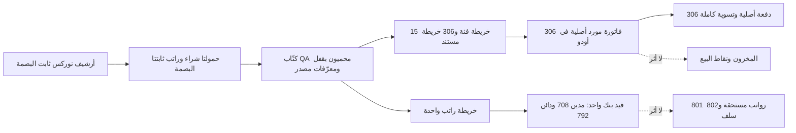

# تقرير تنفيذ ترحيل مشتريات وراتب وقت الكرك — QA فقط

التاريخ: 2026-09-13 — البيئة: `baseer_noorix_data_migration_qa_20260912` على `127.0.0.1:18082`.

## القرار والنطاق

نُفذ على نسخة الترحيل المعزولة فقط:

- 306 مستندات شراء/مصروف/مصروف ثابت لنشاط وقت الكرك، من مارس إلى يوليو 2026.
- قيد واحد لصافي الراتب القديم `PR-2605-001` بقيمة 10,216.67 ريال، بناءً على إقرار المالك أنه دُفع من البنك بتاريخ إكمال المسير 2026-05-06.
- لم يُنفذ أي ترحيل إلى `baseer_dev`، ولم تُنشأ حركة مخزون أو نقطة بيع ضمن هذه الموجة.

الحكم النهائي لفريق التسليم: **GO للاحتفاظ بالنتيجة في QA المعزولة فقط**. لا يجيز هذا الحكم النقل إلى `baseer_dev` أو الإنتاج؛ أي ترقية تحتاج موجة مستقلة وموافقة جديدة.

## هوية المرشح والأدلة المجمدة

| العنصر | الهوية |
| --- | --- |
| المرشح | `NSM-KARAK-FINANCIAL-v15` |
| شجرة `custom_addons` | 313 ملفًا؛ `6ad802d48ca0d23759820096c3650d6ee2ae4d984d79477e0d58611f6e88bdc4` |
| وحدة الترحيل | `baseer_noorix_migration 19.0.8.0.0`؛ 10 ملفات؛ `8c334d2b90090067f87dfd786372820d6c618278ed3be7cad27e8aae295fb222` |
| كاتب المشتريات | `fbf7e0f5f9c4177305c7d49618f9006b8a88f5de258df967ea6019348b419dba` |
| كاتب الراتب | `8a5509465feb92c3ff5782e3cfb00f102dd4e2bb89e7c24bb1a0ffd086cb79fc` |
| أداة بصمة الشجرة | `tools/release/hash_candidate_tree.py`؛ `645e34a26d560eea39caa01232ca85701adab59f3c576297d7eca4830bac633e` |
| حمولة المشتريات | `c6fc968d3b014213113b386ec1a53cc7e4f26930fc1bd828dd5c58b8df6d6785` |
| حمولة الراتب | `5657a4d93119a0a9faf1e35ebe80649ee390975ed61e3de0c3aade5eda0217df` |
| بيان المرشح المصحح | `d874224d72b9c0e324b9a40f2734ca810d39e924a7d8c251c8da626776bb9bcc` |
| تصحيح سلسلة المصدر | `a0a7f83fe5ea57fc78c0b80e85daf109aa8d2842ba46a25abd4ec94aeab4c4c9` |
| دليل الاستعادة الخام | `31503b789debfab99db130586cff5b5c70de53b86921ce2a6e407400d51be0ce` |
| صورة مصدر نوركس | `024606ADD82DCD78DC1835828A12D7B22C56E34924FF998ABF752134160E79E2` |

المسار المركب الفعلي داخل حاوية QA يطابق `candidate-v15/custom_addons`، وصورة Odoo مثبتة عند `sha256:f99ffac95cb39a0924622ea4118481c95651d9c84187e5b30a21c2cc4419c7dd`.

أثناء المراجعة المستقلة اتضح أن بصمتي الشجرة المنشورتين أولًا لم تكونا قابلتين لإعادة الحساب بسبب عدم تثبيت تنفيذ طريقة التجميع واختلاف فواصل المسار. لم يتغير أي ملف من ملفات المرشح ولم تُعد كتابة البيانات؛ أضيفت أداة بصمة ذات نسخة وإيصالات كاملة لكل ملف، وصُحح البيان فقط. يحتفظ `checkpoint-manifest.json` بهوية البيان السابقة كدليل تاريخي، ويربطها [تصحيح سلسلة المصدر](provenance-amendment.json) بالبيان الحالي والإيصالات القابلة لإعادة الفحص.

## خريطة التنفيذ المعتمدة

المثبت بالدليل: الأرشيف والحمولات وبصماتها، جداول التتبع، الفواتير والدفعات والقيد والتسويات في QA. الافتراض الوحيد المعلن هو واقعة دفع صافي الراتب من البنك؛ مصدرها إقرار المالك لا حركة بنكية في أرشيف نوركس.

## الاستعادة قبل التنفيذ

أُنشئت نقطة رجوع متماسكة بعد إيقاف كتابة تطبيق QA مؤقتًا:

| العنصر | القيمة |
| --- | --- |
| المسار | `.local-backups/noorix-migration/20260913-karak-financial-prewrite-qa-1` |
| قاعدة البيانات | `dbc137e8afe689e5aeb13e9840fcc813fc81dd6c923b2b0fde3c6d0a74f47d39` |
| أرشيف filestore | `4d294b6b937176783abd100b36d66e8260e8a6fb10142f8688168f6eac13b84a` |
| خط الأساس | 4 شركات، 352 جهة، 583 منتجًا، 2,548 حركة، 1,229 دفعة، 0 مخزون/استلام، 669 أمر POS، 670 جلسة POS |

استُعيد dump في قاعدة مؤقتة ثانية، وطابقت الأعداد `4|352|583|2548|1229|0|0|669|670` ثم حُذفت قاعدة فحص الاستعادة. حُفظ [دليل الاستعادة الخام](restore-smoke-evidence.json): `RESTORE_OK`، عدد TOC يساوي 17,589 وأرشيف filestore يحوي 1,022 مدخلًا، مع إثبات حذف قاعدة وdump الفحص المؤقتين. لم يُستخرج filestore ويُفتح attachment عبر Odoo من زوج الاستعادة؛ هذا لا يمنع قبول QA، لكنه اختبار إلزامي قبل أي ترقية. لم يُختبر rollback على QA الفعلي لأن الاستعادة المؤقتة أثبتت صلاحية المصدر دون المخاطرة بالنتيجة المنفذة.

## الاختبارات والبروفة

- مرشح v15: 25 اختبارًا محددًا للمشتريات والراتب، `0 failed / 0 errors`.
- البروفة على clone منفصل نفذت الأشهر الخمسة والقيد، ثم أعادت تشغيلها كـ`already_reconciled` بلا تكرار.
- البروفة كشفت قبل QA اعتمادًا غير متوافق على `account.payment.method.line.active` في Odoo 19؛ أُصلح في v15، وأعيدت الاختبارات والبروفة بنجاح.
- كل شهر نفذ في معاملة مستقلة. الكتّاب لا يملكون `commit` أو savepoint داخليًا؛ نقطتا التشغيل تملكان commit بعد نجاح النتيجة وrollback عند الاستثناء.

## تسوية المشتريات

| المقياس | النتيجة |
| --- | ---: |
| خرائط الفئات | 15 قرارًا → 14 منتج خدمة، منها 12 منتجًا جديدًا |
| خرائط المستندات | 306/306، وكل source ID وcanonical key وbill ID وpayment ID فريد |
| الخاضع للضريبة | 228/228 على ضريبة الشراء 15% |
| بدون ضريبة | 78/78 بقائمة ضريبة فارغة |
| صافي الهدف | 56,425.71 |
| ضريبة الهدف | 6,686.59 |
| إجمالي الهدف | 63,112.30 |
| الفواتير | 306 منشورة من أصل 306 |
| الدفعات | 306 مدفوعة؛ 62 بنك و244 نقد |
| المتبقي/الدائن غير المسوّى | 0.00 / صفر سطر |
| أثر المخزون والاستلام | صفر؛ بقيت `stock_move=0` و`stock_picking=0` |
| أثر POS | صفر؛ بقيت 669 أوامر و670 جلسة |

التوزيع الشهري مطابق للحمولة: مارس 3/2,951.03؛ أبريل 144/25,771.75؛ مايو 104/21,213.50؛ يونيو 53/9,851.44؛ يوليو 2/3,324.58.

المستندان ذوا القيمة 1,322.50 محفوظان منفصلين:

- `EXP-20260323-001`، source ID `cmnylglul000avtjyzo1u3z7b`، فاتورة QA 2552، دفعة 1231.
- `EXP-20260323-002`، source ID `cmnyo8tox000f9abseyg43zdg`، فاتورة QA 2554، دفعة 1232.

## تسوية الراتب

| المقياس | النتيجة |
| --- | --- |
| خريطة المصدر | 1/1 لـ`PR-2605-001` |
| الحركة | `account.move` رقم 3162، منشورة، journal `BNK1/62`، 2026-05-06 |
| المدين | الحساب 708 / `400003`، 10,216.67 |
| الدائن | الحساب 792 / `101001`، 10,216.67 |
| الشريك | لا يوجد على الحركة أو السطرين |
| الأثر على 801/`201090` | صفر |
| الأثر على 802/`102090` | صفر |
| كائنات إضافية | لا دفعة، لا فاتورة مورد، لا موظف/مسير، لا مخزون |

القيد يمثل الصافي النقدي فقط. لا يعيد إنشاء إجمالي الرواتب 19,266.67 ولا خصومات السلف 9,050.00.

## الحماية وإعادة التشغيل

- أعيد تشغيل الأشهر الخمسة والراتب بعد التنفيذ؛ أعادت كلها `already_reconciled` مع نفس run/map/move identities.
- قاعدة الأصل `baseer_dev` بعد التنفيذ: 3 شركات، 80 جهة، 89 منتجًا، حركتان محاسبيتان، وصفر حركة مخزون؛ وهي نفس بصمة خط الحماية السابقة.
- خدمة QA عادت HTTP 200 بعد تعافي Docker. خدمة الأصل على 18069 كانت متوقفة قبل هذا التنفيذ وبقيت غير مشغلة؛ فحص قاعدة بياناتها تم مباشرة وبالقراءة فقط.
- أثناء التنفيذ تعطل Docker Desktop بسبب ملفات socket مؤقتة تالفة. أزيلت الملفات المؤقتة المحددة فقط، وعُطلت ميزتا Docker AI ودمج Ubuntu في إعداد Docker Desktop لتثبيت التشغيل؛ لم تُحذف حاويات أو أحجام بيانات. يمكن إعادة الميزتين لاحقًا بعد تحديث/إصلاح Docker Desktop.

## الاستلام والرجوع

الاحتفاظ بنتيجة QA لا يعني ترقية الأصل. الرجوع الكامل يكون باستعادة زوج `database.dump` و`filestore.tar` من نقطة الرجوع أعلاه. الرجوع الجزئي الشهري لا يُجرى بحذف SQL يدوي؛ إما تشغيل إجراء محاسبي معتمد لعكس شهر محدد مع إبقاء provenance، أو استعادة QA كاملة.

أي انتقال إلى الأصلية يحتاج موجة مستقلة: clone حديث من الأصل، مقارنة المعرفات والحسابات والدفاتر والضرائب، بروفة replay، نقطة رجوع جديدة، ثم موافقة صريحة جديدة.

## قرار المراجعة المستقلة

- مصدر البيانات وتسويته: **GO لنطاق QA فقط**؛ لا مستند مفقود ولا دمج خاطئ لمستندي 1,322.50.
- المحاسبة وسلامة المرشح: **GO لنطاق QA فقط** بعد تصحيح سلسلة البصمة وإثبات الاستعادة.
- الموانع: لا يوجد P0 أو P1. يبقى قيد الراتب موثقًا كأساس من إقرار المالك، لا كحركة بنك موجودة في أرشيف نوركس، ويبقى اختبار قراءة attachment من زوج الاستعادة مطلوبًا قبل الأصلية.
- حارس replay الحالي يمنع التكرار ويكشف تغير هوية/بصمة المصدر والإجماليات، لكنه ليس مدقق drift محاسبيًا كاملًا بعد التنفيذ. أثبتت SQL مستقلة أن الحالة الحية الآن صحيحة صفًا وتسويةً؛ قبل الأصلية يجب تشديد replay ليراجع حساب/ضريبة سطر الفاتورة، حالة وتاريخ وشريك الدفعة، `full_reconcile_id` المشترك وحساب السيولة.
