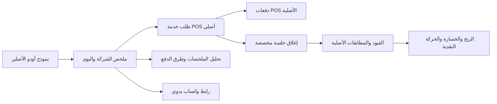

# POS-S1 QA1 — ملخصات المبيعات الخارجية

مرشح معاينة على قاعدة `baseer_reports_qa_20260907` والمنفذ18070 فقط. لا تثبيت للموديول الجديد في الأصلية. هوية المصدر: ملف SHA256 وأرشيف؛ لا يوجد commit إصدار في مساحة العمل الحالية.

## الاستخدام

من **نقطة البيع → ملخصات المبيعات الخارجية → جديد**. تؤخذ الشركة المفعّلة تلقائيًا. حدد تاريخ المبيعات واليوم كاملًا أو الوردية، ومرجع التقرير وعدد العملاء. أضف مبالغ طرق الدفع شاملة الضريبة. الحفظ العادي مسودة؛ الاعتماد ينشئ طلب خدمة أصليًا ودفعاته ويغلق جلسة مخصصة ويرحّل القيود بالتاريخ نفسه. الملخص المعتمد وروابط مصدره محمية من التعديل المباشر والحذف.

زر **فتح واتساب**، أو **اعتماد وفتح واتساب**، يجهز رابط WhatsApp Web برسالة الملخص. الموظف يختار المحادثة ويرسل بنفسه. لم يُرسل الاختبار أي رسالة، ولم يُختبر الإرسال بحساب واتساب حي.

معاينة معتمدة: http://127.0.0.1:18070/odoo/action-490/82، شركة QA ARZ، تاريخ2026-09-07، كاش500، بنك700، هنقرستيشن600، إجمالي1800، ضريبة234.78، صافي1565.22، عملاء60، متوسط30. رصيد هنقرستيشن600 في حساب تسوية أصول متداولة؛ النقد الفعلي1200. رسوم التطبيقات وتسويتها للبنك تستعمل المحاسبة الأصلية لاحقًا، دون إعادة إثبات المبيعات. لا يفترض التقرير أن التطبيق قد وصل للبنك بمجرد إثبات البيع.

**إعداد التقارير** يحتوي المبيعات والعملاء، والمبيعات حسب طريقة الدفع. بيانات العملاء على مستوى الملخص حتى لا تتكرر مع كل طريقة دفع. تحليل طرق الدفع يجمع فئة التطبيقات ثم كل تطبيق؛ النقر على الأرقام يفتح سجلات المصدر. تقرير الحركة النقدية السابق يتعرف إلى تحصيلات POS المثبتة ويربطها بقيودها. الطلب الأصلي والجلسة والقيود متاحة من أزرار الملخص.

## خريطة المصدر وحدودها

لا تعديل لنواة أودو أو المصدر المالي لإضافات ERP Heritage أو محرك التقرير النقدي القديم. الموديول الجديد يرث مصادر POS والتقرير. نُقل مكوّن التاريخ الموجود في المشتريات إلى `baseer_report_layout` لتسجيله مرة واحدة وإعادة استعماله في الشاشتين؛ ملف المشتريات القديم يستورد المكوّن المشترك للتوافق. إصدارlayout19.0.1.1.1، purchase19.0.1.2.2، POSsummary19.0.1.0.0. اعتماد POS الفعلي لا يعتمد على موديول المشتريات.

إعداد الملخصات للمحاسب ومدير POS: نقطة مخصصة واحدة للشركة، خدمة مرتبطة بحساب الإيراد، ضريبة مبيعات أصلية بسيطة، وتصنيف كل طريقة نقد/بنك/تطبيق. الكاش والبنك لحسابات سيولة؛ لكل تطبيق حساب تسوية مستقل قابل للمطابقة. إعداد QA موجود لشركة6 فقط؛ إعداد الحسابات الحقيقية لباقي الشركات يتطلب ربط حساباتها الأصلية قبل استخدامها.

المعاملات المسموحة: SAR، حتى25طريقة، مبلغ موجب حتى999999999.99 ومنزلتين، عملاء0–10000000. لا عملة أجنبية أو rounding نقدي أو fiscal position أو split payment أو payment terminal في مسار الملخص. POS المباشر يبقى أصليًا. اختيار تاريخ مقفل يُرفض بدل تغيير تاريخ القيد. عمولات المنصات تسجل كمصروفات مستقلة؛ فصل العمولة تلقائيًا من تسوية صافية ليس ضمن هذا الإصدار.

## أدلة القبول

- `pos_summary_acceptance.json`: 41فحصًا لدورة الملخص و76فحصًا للتقرير النقدي، جميعها PASS؛ إجمالي117.
- `pos_summary_backend_checks.json`: 42فحصًا للصلاحيات، التواريخ المقفلة، المصادر، حذف السياق المصطنع، والرجوع الكامل عند فشل دفعة متأخرة.
- `pos_summary_concurrency.json`: اعتمادان متزامنان لنفس الملخص ينتجان طلبًا وجلسة مرة واحدة؛ إنشاء ALL/MORNING المتعارض بالتزامن يسمح بواحد فقط باستخدام إعادة المحاولة الأصلية.
- `pos_summary_capacity.json`: اعتماد1/10/25طريقة في نحو0.27/1.30/3.31ثانية محليًا، مع التراجع؛ ليست شهادة حمل إنتاجي.
- `pos_summary_native_install_preservation.json`: قبل تثبيت POS وبعده،59قيدًا و136سطرًا قديمًا متطابقًا في جميع أعمدته السابقة. الأعمدة التي يضيفها POS جديدة وليست تغييرات مبالغ.
- `pos_summary_source_preservation.json`: فحص229ملف تقارير سابق؛ التغيير الوحيد في ملف قديم هو manifest لتسجيل مكوّن التاريخ المشترك، مع إضافة ملف المكوّن نفسه. لا تغيير بالمصدر المالي السابق.
- واجهة فعلية بعرض390للجوال و1280للكمبيوتر، عربيRTL وإنجليزيLTR، بلا تجاوز لعرض الصفحة. إنشاء بطاقة115ريالًا/15ضريبة/10عملاء وحفظها وإعادة فتح تاريخها نجح؛ حُذفت مسودة الاختبار فقط بعد إثباتها. الملخص الفارغ مرفوض برسالة عربية. عُرضت التقارير ومبالغها وروابطها الفعلية.

حصة الضريبة تُقرّب لكل تحصيل فعلي؛ تقسيم600إلى3دفعات200قد ينتج فرق هللة مقارنة بتقريب المصدر كاملًا. يظهر توضيح في التقرير ولا يتغير رصيد النقد. المحاسب دون صلاحية POS يرى النقد كاملًا مع بيان تعذر إثبات الضريبة، بدل تعطل التقرير أو تجاوز الصلاحيات.

## التشغيل والتراجع

النسخة السابقة: `.local-backups/pos-summary-preinstall/database.dump` SHA256 `931318bd61baa894f598d4a3dfca19412100874e524191e14df2d4920e48fb44`. جميع اختبارات المال تتراجع، باستثناء الملخص المعتمد82 المحتفظ به كمعاينة واضحة. لا إنشاء رسائل أو اتصالات خارجية.

الترقية المستخدمة في QA: تحديثlayout وpurchase الموجودين ثم تثبيت/تحديثPOSsummary، وإعادة تحميل الأصول. المصدر المشترك للتاريخ يجب أن ينتقل مع ملف توافق المشتريات إذا كانت المشتريات مثبتة. مرشحZIP يضم الوحدات الثلاث بهوياتها، ولا يعني وجوب تثبيت المشتريات لاستخدام POSsummary.

التراجع المقبول لهذه المعاينة هو استعادة قاعدة QA السابقة مع مصدرها الموافق؛ حذف الموديول وحده ليس مسار تراجع معتمدًا. الإضافة تضبط domain لعملية لوحة POS الأصلية لاستبعاد الإعداد المخصص، فيلزم استعادة الإعداد أيضًا إذا أُزيلت الإضافة يدويًا. لا نقل للأصلية ضمن هذا التسليم.

قرار المراجعة المستقلة وموانعه إن وجدت في `docs/build-governance/POS-SUMMARY-REVIEW.md`؛ بصمات المرشح وأدلته في `manifest.json`.
