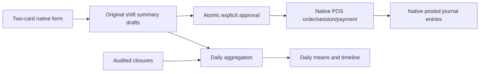

# Baseer POS summaries QA2 — 2026-09-07

Candidate: baseer_pos_summary 19.0.1.1.0, QA database baseer_reports_qa_20260907 only, http://127.0.0.1:18070. Source identity and archive digest in manifest.json; workspace is uncommitted, so no commit identity is claimed. Independent decision: ../../build-governance/POS-SUMMARY-S2-REVIEW.md. Reference POS-S2 extends POS-S1 and its proven native accounting.

## Delivered journeys
- Native POS menu **إدخال المبيعات اليومية** (action497): one active-company/date form, morning and evening cards, each with customers/amounts/notes/explicit no-sales flag. All-day and single-shift modes supported. Native MonetaryField boxes prefill configured active payment methods; reference/category inputs omitted. Four columns on desktop and two on mobile. The form has one visible **حفظ الملخصات** button; the native transient-save icon is hidden only in this form.
- Save creates one/two original summary drafts atomically; incomplete second card saves neither. After saving, cards become readonly, with one explicit **اعتماد الملخصات** button. Both approvals use the existing native POS engine inside one transaction. Repeated/concurrent save or approval does not duplicate documents. If a source draft changed separately, approval requests review of the original record instead of approving stale amounts.
- Original summaries remain durable history and per-shift reporting; the combined entry and daily report are native transient workspaces. Native vacuum cleanup is tested and does not delete original summaries. Source links open the original summaries and their native POS order/session/journal entries. WhatsApp compose remains manual on approved original summaries; no message was sent.
- Closure action495: inclusive date range up to366days, full day or morning/evening, Eid/holiday/maintenance/other reason and notes. Confirmed/cancelled records immutable; manager cancellation has reason/user/time audit. Conflicts with existing draft or approved summaries are blocked in both directions, including concurrent requests. No ledger for closures.
- Daily report action496: active company/date range up to366days, approved sales including VAT and declared customer totals. A date counts once despite two shifts. Day schedule explicitly distinguishes single-shift operation from a missing second shift. Both half closures constitute full closure; a half closure can complete the other approved shift. Explicit zero-sales operation counts when the day is complete; absence of approved data is not silently zero or closed.
- Daily averages use complete-day numerator AND complete operating-date denominator. Incomplete sales are shown in recorded totals separately; missing/closed cells are blank and unavailable averages explicitly labelled. Native timeline has categorical ISO dates for complete operating days, avoiding synthetic zero values for excluded dates. The same backend aggregation is available for future dashboards; no separate custom dashboard was added.
- Monthly native sales/customers report action491 has morning/evening/all-day quick filters, sales-date filter and shift grouping. All-day sales are never guessed into morning/evening.

## Source/data map

Only custom_addons/baseer_pos_summary changed. Existing report layout, purchase module, cash category module, vendor/native sources unchanged. Native platform clearing versus actual bank cash policy remains from QA1. Decimal boundary validation and native tax authority retained; no additional libraries.

## Acceptance evidence
All executable scripts/logs/JSON below are in docs/build-governance:
- pos_s2_summary_checks:25 pass (zero declarations, precision, slots, native positive posting, immutable approved fields).
- pos_s2_operations_checks:46 pass (closure overlap/permissions/cancel, completeness, averages, reports and source links). 366-day aggregation over the QA fixture set measured0.002786seconds; this is a local measurement, not a production load guarantee.
- pos_s2_regression:41 native checks +76 cash-report checks passed, original sales1800/native VAT234.78/platform clearing600 preserved.
- pos_s2_day_entry_checks:38 pass including real first approval then forced late second failure rolling both back, repeat approval, per-shift monthly totals, one-day averages, hostile contexts/ACL, and native vacuum of saved entry/result rows.
- pos_s2_concurrency:3 true two-cursor closure/summary races; pos_s2_day_entry_concurrency:2 simultaneous saves of the same entry, exactly2drafts. All showed native serialization retry then correct result.
- Actual desktop UI partial Save left0summaries; successful Save created227/228 with115/230SAR and10/20customers. Actual390px English mobile Save created120/240SAR and12/24customers; exact mobile test artifacts removed after verification (pos_s2_mobile_save.json).
- Arabic/English desktop and mobile images, closure/report/shift-filter screenshots;339 PO entries,0untranslated/0fuzzy. DOM390px confirmed2cards,1visibleSave,hidden native cloudSave,no horizontal overflow,no Arabic-Indic numerals. Arabic restored at finish.
- Original native financial fingerprints before/after identical:63account.move,147account.move.line,1pos.order. Main readonly evidence:0moves/0lines and new addon absent. No main service/DB changes.

## QA preview and boundaries
Company QA ARZ (6) only has configured demonstration payment methods/accounts. Other companies need their native configuration before entry. Approved preview82 remains1800SAR/60customers. Combined preview28 has two saved drafts227/228 on2026-09-04 (115+230SAR,10+20customers), clearly QA data. No new financial documents were committed by this release. Temporary closure16 was confirmed/cancelled via UI then exact test-only cleanup; single-card179 and mobile229/230 test drafts removed. Independent tests rolled back or cleaned exact fixture IDs. An unsaved transient preparation may remain until native vacuum; it is not a saved sales summary.

Primary entry URL: http://127.0.0.1:18070/odoo/action-497
Daily report: http://127.0.0.1:18070/odoo/action-496
Per-shift monthly report: http://127.0.0.1:18070/odoo/action-491

## Run/rollback
QA upgrade uses compose.yaml + compose.reports-qa.yaml, service reports_qa, addon path /mnt/baseer-addons and existing dependencies baseer_cash_categories/baseer_report_layout/nativepoint_of_sale. Upgrade only baseer_pos_summary. Scripts run via /entrypoint.sh odoo shell with QA database and --no-http --max-cron-threads=0. Native user-facing app remains available on18070.

Before-change DB backup .local-backups/pos-summary-s2/database.dump SHA25618ae7ee496c739f12ee80c24d2054d5fe8880ad5eb8cc1359469b7ce42c460fc; corresponding source-before.zip SHA2563220f1b47b28e03081069054914cff8843f4d983fa26de8a41879445ec565dde. Rollback is restoring this QA backup and matching source, not uninstalling financial addons. No production deployment approval is requested or implied.
