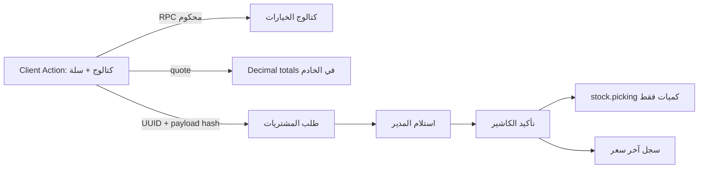

# تسليم PRC-UI1 — نقاط طلب المشتريات (QA)

التاريخ: 2026-09-11. القرار: **GO لمعاينة وقبول المستخدم على QA فقط**. الإنتاج خارج النطاق.

## المرشح والبيئة

- الإضافة: `baseer_procurement_requests 19.0.4.0.0`.
- القاعدة: `baseer_procurement_qa_20260911`.
- رابط QA: `https://desktop-cvc68i5.tail938958.ts.net:18081/`.
- صورة Odoo: `sha256:f99ffac95cb39a0924622ea4118481c95651d9c84187e5b30a21c2cc4419c7dd`.
- هوية المصدر: [candidate.json](candidate.json)، وبصمة البيان `7d991523d81f376a38ff40fbd4b66ff29e1d03a3a276a03788ed9331f0656ea3` مع نجاح فحص جميع بصمات المصدر.

## الخريطة المعتمدة

المثبت: واجهة OWL مستقلة ضمن `web.assets_backend`، ونماذج الإضافة تملك الطلب/الخيار/السعر، وOdoo الأصلي يملك حركة المخزون. `point_of_sale` ليس dependency ولا import ولم يتغير. الافتراض المحجوز: قياسات الأداء خاصة بـQA الحالية ولا تمثل SLA إنتاجيًا.

## قبول الأعمال

| المتطلب | الدليل | النتيجة |
| --- | --- | --- |
| تجربة كاشير POS للمشتريات | كتالوج، تصنيفات، بحث، بطاقات، سلة، stepper، إجمالي وإجراءات | PASS |
| العربية والإنجليزية | لقطتا `desktop-pos.png` و`desktop-en.png` | PASS |
| هاتف بلا سلة تغطي المواد | 390 و360: pane مواد/pane سلة وشريط سفلي، بلا overflow | PASS |
| بحث سريع | «طماطم» أعاد 6 نتائج صحيحة | PASS |
| لوحة مفاتيح ووصولية أساسية | Enter يضيف، stepper يعمل، Escape يرجع للمواد، focus/ARIA/44px | PASS |
| مصدر الحقيقة الرقمي | quote والإجماليات Decimal من الخادم؛ 105.80 × 2 = 211.60 | PASS |
| مقاومة النقر المتكرر | معاملتان متزامنتان بنفس UUID أعادتا ID واحداً وسجلاً واحداً | PASS |
| عدم لمس POS/Odoo core | manifest كامل + image digest + mounts للقراءة فقط + docker diff بلا core/POS | PASS |

## أدلة التحقق

- اختبارات Odoo: 10 حالات، 0 فشل، 0 خطأ.
- سباق حقيقي: مكالمتان متزامنتان، سجل واحد، نفس ID، ثم cleanup ناجح.
- السعة: 48 عنصراً/صفحة و10 قراءات متزامنة؛ أسوأ p95 مرصود مع تشغيل فحوص المتصفح بالتوازي: صفحة 104.59ms، بحث 38.76ms، quote 20.88ms.
- المتصفح: 1280 و390 و360؛ عربي/إنجليزي؛ لا تمرير أفقي ولا CSS fallback ولا page/console errors.
- الصور والسكربتات القابلة للإعادة في `docs/audits/2026-09-11-procurement-pos-ui/`.

## سلطة القيم

| القيمة | جهة الحساب والتحقق | مصدر الحقيقة |
| --- | --- | --- |
| خيار المادة وآخر السعر | RPC مع ACL والشركة والحالة النشطة | `baseer.procurement.purchase.option` |
| كمية السلة | تحقق Decimal موجب وبحد منزلتين في الخادم | payload يعاد التحقق منه قبل الإنشاء |
| إجمالي السطر والسلة | `ROUND_HALF_UP` إلى 0.01 في الخادم | `quote_catalog_cart`/سجل الطلب |
| منع التكرار | unique company/requester/token + hash + retry | PostgreSQL + خدمة Odoo |
| المخزون | تأكيد الكاشير فقط | `stock.picking` الأصلي، كميات فقط |

## النتائج المفتوحة

- لا P0 أو P1 ضمن PRC-UI1 وQA.
- P2 تشغيلي: لا ترقية إنتاجية قبل commit/tag ومسار نشر مستقل وقبول المستخدم.
- التقييم المحاسبي للمخزون خارج النطاق؛ السياسة المعتمدة كميات + آخر سعر فقط.

## التشغيل والرجوع

الخدمة `baseer_odoo_dev-procurement_qa-1` تستجيب HTTP 200. عند عيب عرض، يعاد نشر المصدر السابق `19.0.3.0.0` على QA وتزال مرفقات web assets المولدة ثم تعاد الخدمة؛ لا تحذف طلبات الأعمال. عند إيقاف الميزة، يُفضّل تعطيل قوائمها مع إبقاء بياناتها للقراءة بدل uninstall مباشر.

## قرار المراجعة المستقلة

المراقب العام أقفل G4/G5/G6 بـ**GO على QA** بعد دليل النطاق والأرقام والمتصفح. مراجع مطابقة POS أعاد PASS من الأدلة النصية؛ تعذر وصوله المباشر للملفات بسبب عطل أداة القراءة، لذلك اعتمد قرار التسليم النهائي على الاختبارات القابلة للإعادة، فحص المصدر من الوكيل الرئيسي، ودليل المراقب العام.
