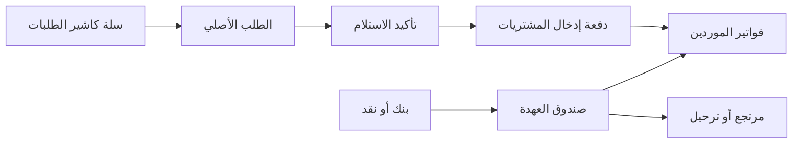

# تسليم PRC-REMEDIATION1 — QA فقط

## النتيجة

مرشح الإصلاح منشور ومتحقق على QA. أُغلقت موانع P1 بالاختبارات الآلية والحية ومراجعتين مستقلتين؛ القرار **GO لبيئة QA فقط**. لا يتضمن هذا أي إذن إنتاج، ولم تُلمس خدمة أو قاعدة الإنتاج.

## ما بقي في شاشة كاشير الطلبات

- الكتالوج يجمع المنتج في بطاقة واحدة ويعرض الحجم/الوحدة/التغليف كخيارات داخلها؛ مثال V60 يظهر بثلاثة خيارات.
- البحث خادمي ويشمل النتائج غير المحملة بعد، ومنها رقم الطلب والمندوب والمستودع والمادة والحجم والتغليف والوحدة.
- «الطلبات السابقة» مصفحة مع بحث ومرشح حالة، ولا تتوقف عند أول 50 سجلاً.
- فتح طلب سابق يعيد **السجل الأصلي نفسه** إلى سلة الكاشير للتعديل وتأكيد الاستلام، ولا ينشئ نسخة ولا يفتح نموذج Odoo التقليدي.
- النصوص المخصصة المعروضة مترجمة، والحالات تأتي بالعربية، ورمز العملة يأتي من الشركة.

## مسار العمل المثبت

1. ينشئ الكاشير طلب المواد ويرسله إلى مندوب المشتريات.
2. يعود الطلب الأصلي إلى سلة تأكيد الاستلام؛ تُعدّل الكميات والأسعار الفعلية ثم يُؤكد الاستلام.
3. يختار المحاسب الطلب المستلم مرة واحدة في رأس دفعة إدخال المشتريات؛ الحجز يمنع ربط الطلب بدفعة ثانية.
4. تُدخل فواتير الموردين الفعليين، وتطابق تخصيصاتها قيمة الطلب الفعلية.
5. التمويل يُرحّل من يومية البنك/النقد إلى حساب عهد المشتريات، ثم تُسوى الفواتير من العهدة بلا دفع مصرفي ثانٍ.
6. الرصيد المتبقي يُستلم إلى بنك/نقد أو يُرحّل، وتبقى كل حركة مرتبطة بقيدها ومرجعها.

## أدلة الاختبار

- fresh install وversioned migration نجحا على قواعد معزولة.
- الحزمة النهائية: 32 اختباراً مسجلاً؛ 26 منفذاً في القاعدة النظيفة، 0 فشل و0 خطأ. حالتا تكامل SAR تخطتهما القاعدة النظيفة لعدم وجود شركة SAR، وثبت مسارهما على قاعدة SAR ذات حمل تاريخي.
- اختبار وظيفي أنشأ 120 طلباً وتصفحها بلا تكرار أو فقد.
- اختبار التجميع أعاد 101 خياراً لمنتج واحد من دون تقسيمه بين الصفحات.
- سباق حقيقي باتصالين أثبت نتيجتي الإقفال/التسوية الحتميتين بلا قيد خاسر أو تسوية مكررة.
- على عينة 7 سنوات و1.533 مليون تسوية، اعتماد طلب واحد مع 20 فاتورة حقق p95 قدره 9.668 ثانية؛ 100 فاتورة/100 تسوية، جميع القيود متزنة، بلا دفعة مصرفية ثانية، والرصيد النهائي صفر.
- مسار الدفعات العادي بعد تحسين bulk حافظ على ترتيب السطر/الفاتورة ونجح في الدفع المباشر والآجل، ورفض التكرار، وأثبت التراجع الذري بلا مستندات متسربة.
- قبول متصفح فعلي على 1280 و390 و360: لا overflow ولا أخطاء console؛ الطلب `PRC/2026/00233` فتح داخل السلة نفسها بأربعة أسطر قابلة للتعديل.
- بعد آخر إعادة إنشاء للخدمة: HTTP 200 محلياً وعبر Tailscale، الحاوية healthy بلا restart، واتصال WebSocket الصحيح أعاد 101. لا ERROR/CRITICAL/Traceback تشغيلي في نافذة السجل النظيفة.
- ثوابت QA: 0 قيود عهدة غير متوازنة، 0 طلب مرتبط بأكثر من دفعة، 0 اختلاط شركات، و0 فرق بين الرصيد التشغيلي والدفتر.

التفاصيل القابلة لإعادة التنفيذ في [TEST-EVIDENCE.md](TEST-EVIDENCE.md). التحسينات P2 المؤجلة: تثبيت معرفات تقرير SQL الشهري، keyset pagination عند نمو أكبر، تحصين مسار الربط السطري القديم غير المستخدم، ومراقبة هامش هدف 10 ثوانٍ.

## البيانات والاستعادة

الترقية حافظت على السجلات الموجودة. يوجد طلب مسودة `PRC/2026/00369` أُنشئ عبر عميل أثناء جلسة QA المشتركة؛ لم نحذفه لأنه قد يكون للمستخدم. النسخة السابقة للترقية محفوظة في `.local-backups/procurement-remediation1-20260911/pre-upgrade`، وبصماتها في [candidate.json](candidate.json).

## الروابط

- QA المحلي: `http://localhost:18081`
- QA عبر Tailscale: `https://desktop-cvc68i5.tail938958.ts.net:18081/`
- عقد البناء: [PURCHASE-REQUESTS-AND-CUSTODY.md](../../build-governance/PURCHASE-REQUESTS-AND-CUSTODY.md#prc-remediation1--معالجة-موانع-العهدة-والطلبات-السابقة-qa-فقط)
