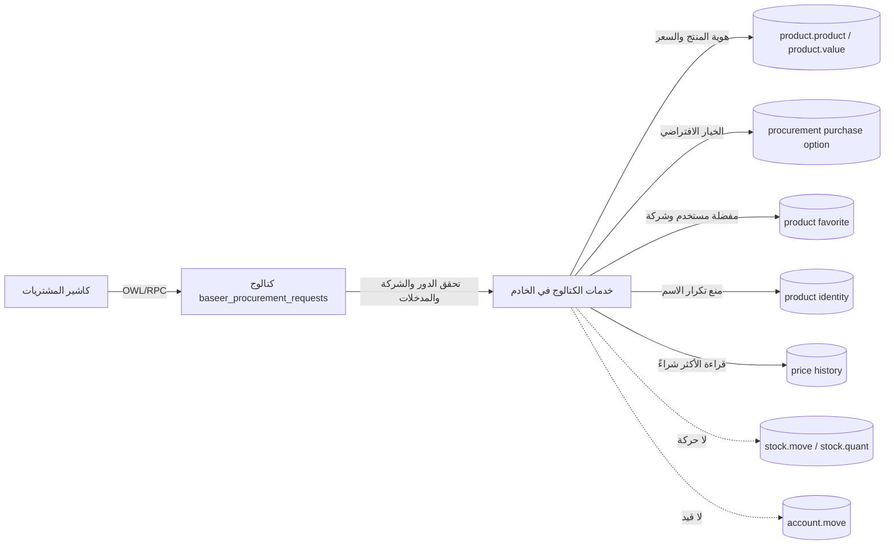

# خريطة PRC-CATALOG-QUICK1-v9

التاريخ: 2026-09-13. النطاق: إضافة المنتج السريع، المفضلة، والأكثر استخدامًا داخل كاشير المشتريات في QA المعزولة.

## المثبت بالدليل

- نقطة الدخول هي Client Action الحالية في `baseer_procurement_requests`؛ لا تعديل لـPOS أو Odoo core.
- الخادم، لا المتصفح، يتحقق من عضوية مجموعة الكاشير، الشركة النشطة، السعر، الفئة، وأهلية المنتج.
- المنتج الجديد تابع للشركة النشطة، للشراء فقط، وغير قابل للتخزين؛ المنتج الأصلي هو مصدر الحقيقة.
- هوية الاسم المطبّع محكومة بقيد فريد وقفل advisory، والمفضلة محكومة بالمستخدم والشركة وحالة مرغوبة صريحة.
- الأكثر استخدامًا تجميع قراءة محدود من سجل أسعار الشراء المؤكد؛ لا ينشئ عدادًا مشتقًا قابلًا للانحراف.
- حفظ المنتج والخيار والتكلفة والهوية في transaction/savepoint واحدة. لا stock move/quant أو account move في الإنشاء السريع.

## حدود الحكم

- الفئة في Odoo كيان مشترك، لذلك تُقرأ وتُتحقق ولا يُدّعى عزلها بالشركة.
- قياس «الأكثر» lifetime count لسجلات السعر المؤكدة، وليس كمية الشراء أو آخر 30 يومًا.
- اختبار السعة تحقق ساكنًا من الفهرس والحد 12؛ لم يُنفذ اختبار ضغط إنتاجي.
- الأصلية `baseer_dev` والإنتاج خارج نطاق هذا المرشح.

