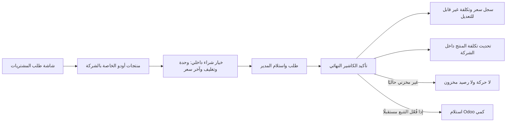

# PRC-PRODUCT-SOURCE1 — دليل التنفيذ والقبول

**القرار:** GO للنسخة التجريبية المعزولة فقط على `127.0.0.1:18082`. الأصلية `baseer_dev` خارج التفويض وقرارها NO-GO في هذا الإصدار.

## ما طُبّق

- أصبح `product.product` النشط، الشرائي، والبضاعة، والمملوك للشركة الحالية تحديدًا مصدر شاشة طلب المشتريات. خيار الشراء طبقة داخلية للوحدة/التغليف وآخر سعر، ويُنشأ افتراضيًا عند الحاجة.
- عُطّل تتبع المخزون لـ364 منتج شراء مرحّل من نوركس، مع إبقائها بضاعة لا خدمة. بقيت 103 منتجات بيع فقط دون هذا التغيير.
- تأكيد الكاشير النهائي يحفظ الكمية والسعر والتاريخ ويحدث `standard_price` داخل شركة المنتج. السعر يُحوّل بوحدة Odoo ثم يقرّب `ROUND_HALF_UP` إلى منزلتين، وهي دقة `Product Price` الفعلية في القاعدة والعقد الذي اعتمده المالك.
- المنتج غير المخزني لا ينشئ picking أو move أو quant. المسار المخزني المستقبلي يبقى اختياريًا ويستخدم استلام Odoo الأصلي مع منع التقييم الآلي.
- هوية خيار الشراء (`company/product/uom/packaging`) تتجمد بعد أول استخدام. آخر السعر ومفاتيح المصدر لا تقبل كتابة RPC مباشرة، حتى مع سياق مزور. سجل السعر يحتفظ بلقطة منتج مباشرة غير مرتبطة بخيار قابل للتعديل.



## هوية المرشح والتشغيل

- المرشح: `.local-backups/procurement-product-source1-20260913/candidate-v3`.
- `baseer_procurement_requests`: الإصدار `19.0.9.0.0`، 29 ملفًا، SHA-256 للشجرة `daba4c88809feaf16ae6ccfb02a247dbd78b9e77739118fa5150b7009f8c5052`.
- كل `custom_addons` المركب: 305 ملفات، SHA-256 `6b030f76558b413b9183e1147bf8c7a9386e9869b13db8243a86c07d0bd02485`، ولا ملفات `pyc`.
- third-party mount: 935 ملفًا، SHA-256 `606849d116e31a4471dffeb3819573f30db75338bd1a8d727eeed41b78ef3ca3`.
- الحاوية الفعلية تركب `candidate-v3/custom_addons` للقراءة فقط، وHTTP `/web/login` أعاد 200 بعد الترقية.

## الاختبارات المنفذة

الاختبار الكامل شُغّل على قاعدة جديدة مستقلة **من المرشح المجمّد نفسه**. سجّل Odoo 45 اختبارًا، حمّل 37 حالة، وتجاوز حالتي دمج purchase-batch فقط لعدم وجود شركة SAR في القاعدة الجديدة. النتيجة: `0 failed, 0 errors`، وخرجت الحاوية بالرمز 0. يشمل الاختبار:

- عزل الشركة ورفض المنتجات المشتركة والخدمية وغير النشطة وغير الشرائية.
- عدم إنشاء مخزون للمواد غير المتتبعة، واستلام واحد فقط للمادة المخزنية الدورية.
- تحويل UoM وتحديث التكلفة والتاريخ وإعادة التأكيد دون تكرار.
- منع التقييم اللحظي وطريقة التكلفة غير القياسية قبل أي أثر.
- تجميد الخيار ولقطة المنتج، ورفض سياق RPC المزور.
- خطأ مصطنع بعد إنشاء الاستلام وكتابة التكلفة لإثبات رجوع الحالة والاستلام والتكلفة والتاريخ كاملة.
- طلبان متتابعان لنفس المنتج لإثبات سلسلة التكلفة السابقة/الجديدة.

النص التنفيذي المختصر محفوظ في [FROZEN-V3-TEST-TRANSCRIPT.txt](FROZEN-V3-TEST-TRANSCRIPT.txt).

## ترقية QA والتسوية

ترقية `19.0.9.0.0` شغّلت pre/post migration بنجاح. التحقق بعد الترقية أعاد:

```json
{"catalog_products":{"1":279,"2":85},"default_options":{"1":279,"2":85},"mapped_templates":467,"opening_price_mismatches":0,"purchase_products":364,"sale_only_products":103,"status":"verified","stock_moves":0,"stock_quants":0,"tracked_purchase_products":0}
```

الثوابت بعد الترقية: حسابات `account_move=2` و`product_value=833` كما قبلها، و`stock_move=0` و`stock_quant=0` و`stock_picking=0` وطلبات المشتريات/سجل الأسعار التجريبيان صفر. لا يوجد تكرار في مفاتيح الخيارات الافتراضية.

## الاستعادة وحماية الأصلية

قبل أي كتابة حُفظ dump+filestore. استُعيدا إلى clone معزول، وقرأ Odoo كل عينة المرفقات المخزنة: 36/36 ملفًا بإجمالي 34,197,154 بايت، من أصل 302 مرفقًا. قاعدة clone وfilestore حُذفا بعد التحقق، وبقيت اللقطة الأصلية. الدليل الآلي في [RESTORE-SMOKE.json](RESTORE-SMOKE.json).

الأصلية بعد إتمام QA ما زالت: 80 جهة، 89 قالب منتج، 89 variant، 40 فئة، قيدان، و`baseer_procurement_requests 19.0.7.0.0`. لم تُكتب أو تُرقّ إلى هذا المرشح.

## الملاحظات غير المانعة

- اختبار التزامن متعدد جلسات PostgreSQL لم يُنفذ في هذه الشريحة؛ الأقفال المرتبة وقيد uniqueness واختبارات عدم التكرار المتسلسلة موجودة. صنفه مراجع ERP P2 غير مانع للـQA.
- توجد حالتا اسم متطابق في شركة 1 (`اكليل الجبل` و`بلوبري`) لكنهما مختلفتان في الفئة/التكلفة ومصدر نوركس؛ لم تُدمجا تلقائيًا تجنبًا لفقد معنى.
- فئة جذرية باسم `Goods 21` ما زالت إنجليزية في الواجهة العربية. لا تؤثر على مصدر الطلب أو التتبع، وتحتاج قرار تسمية بيانات منفصل.
- لا توجد أرصدة افتتاحية أو استهلاك أو تصنيع في هذا النطاق. السعر الصفري يبقى صفراً حتى أول تأكيد كاشير، ولا يُخمن أي معامل تغليف غير معرف في UoM.

