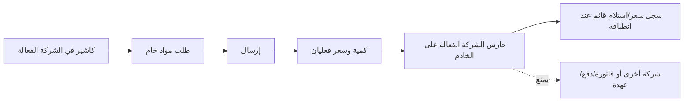

# تسليم صلاحية طلبات واستلام الكاشير

**المرشح:** `cashier-procurement-live-candidate-2026-09-14.2` عند commit
`863bd851dc107ba8911b417263f21b83270701f0` فوق خط الإنتاج الحي الفعلي
`4cd12588a2b447cb14f924f09c913b4fb7b24f43`.

**قرار التسليم:** **GO — منشور حيًا**. تمت البروفة المعزولة والنسخة الاحتياطية
المتسقة والترقية المقيدة وفحص الرابط العام على المصدر الحي الفعلي.

## النطاق المقبول

- دور الكاشير ينشئ، يرسل، ويؤكد الاستلام التشغيلي لطلبات المواد الخام.
- لا يمنح المدير أو الفواتير أو الدفعات أو العهد أو التسويات أو القيود.
- لا يسمح بتغيير الطلب أو أسطره خارج الشركة الفعالة، حتى مع وجود شركات أخرى
  في الجلسة، ولا يسمح بنقل مسودة من A إلى B.
- لا توجد تغييرات التقويم الحراري غير المنشورة في هذه الحزمة.

## الأدلة

| المجال | النتيجة | الدليل |
|---|---|---|
| مرشح نظيف | فرع/وسم وحزمة SHA متطابقة منشورة إلى GitHub | `PROVENANCE-MANIFEST.json` |
| الترقية | نجحت على clone محلي معزول من الخط الحي الفعلي | `cashier-procurement-live-candidate-upgrade-863bd85.log` |
| الدور والطلبات | 52 اختبارًا، 0 فشل، 0 خطأ | `cashier-procurement-live-candidate-tests-863bd85.log` |
| قبول/أمان | GO مستقل؛ مسار A→B محمي | مراجعة `cashier_release_acceptance` بتاريخ 2026-09-14 |
| البروفة المعزولة | ناجحة | قاعدة وfilestore وشبكة ومنفذ مستقلون؛ 52 اختبارًا، 0 فشل، 0 خطأ، وHTTP smoke ناجح |
| القطع الحي | ناجح | backup `cashier-procurement-20260914T190650Z`، SHA لقاعدة البيانات وfilestore سليم، وsnapshot الأعمال قبل/بعد متطابق |
| الرابط العام | ناجح | `https://baseer.abroj.sa/web/login` أعاد HTTP 200 بعد الترقية |

توجد قيم الـSHA وحالة الخدمات والـsnapshot والوحدات المثبتة في
[`HOSTINGER-READ-ONLY-EVIDENCE.md`](HOSTINGER-READ-ONLY-EVIDENCE.md)؛ لا يتضمن
الملف أسرارًا أو بيانات أعمال.

## ما نُفذ في القطع الحي

1. طابقت الحزمة والوسم وSHA مع GitHub، وجهزت مصدر `863bd85` دون لمس `current`.
2. نُفذت بروفة مستقلة بقاعدة وfilestore وnetwork ومنفذ منفصلين؛ نجحت الترقية
   المقيدة واختبارات الدور والطلبات 52/0.
3. أوقفت خدمة Odoo فقط، وأخذت زوج recovery متسقًا من `baseer_prod` وfilestore.
4. نُفذ `-u baseer_access_roles,baseer_procurement_requests` فقط، ثم تطابق
   snapshot نماذج الأعمال المحمية قبل/بعد.
5. حُول `current` ذريًا إلى `863bd85`، وعادت الخدمة مع HTTP 200 داخليًا وعامًا.

لا تنفذ هذه الخطوات على أي مشروع Hostinger آخر.
