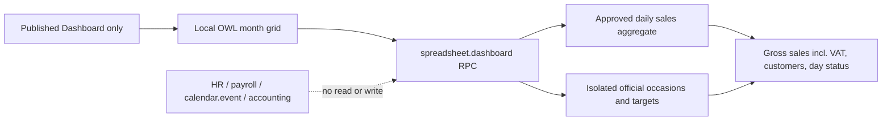

# Heat Calendar Demo — Independent Delivery Review

**Review date:** 2026-09-14  
**Candidate:** `release_candidates/2026-09-14-abroj-baseer/heat_calendar_demo_source`  
**Baseline:** `91e1b8d460541e31cce5881a16081cfbc12ea83a`  
**Reviewed runtime commit:** `2e89db543c094d182c78adfe7e4ea187f2d19bde`  
**Current candidate:** `90e5e0f15c8302c6cc4296892638570a5a3ed7d5` — changes the two management actions from nested dialogs to standard Odoo list/form routes; G8 remains required on this exact commit.  
**Decision:** **CONDITIONAL GO for owner review of the isolated demo; NO-GO for original release.**

## Delivery identity

The candidate adds `baseer_sales_heat_calendar`. Its declared dependency is only `baseer_sales_dashboard`. It owns `baseer.official.occasion` and `baseer.heat.calendar.target`; it adds one Dashboard type and no application menu. The source does not read or write `calendar.event`, `resource.calendar`, HR, payroll, accounts, invoices, inventory, or source sales records.

## Evidence reviewed

| Area | Result | Evidence |
|---|---|---|
| Data/audit | Conditional GO | Approved `amount_gross` and `customer_count` come from `_aggregate_days`; no source IDs or draft IDs are returned. Refeed skips existing source keys, preserves manual confirmation, and handles a unique-key race with a savepoint. |
| Access/isolation | Conditional GO | Endpoint checks dashboard access and rule, POS user/group and selected dashboard company. Occasion/target record rules now apply to both POS readers and the central heat-calendar manager. |
| UX/accessibility | Conditional GO | Arabic runtime verified. Each day opens a local fixed modal; close works and a 390×844 viewport keeps the page within the viewport. The official-occasion badge is shown at the upper-left of its day and the full source/status remains in the modal. Each weekday heading shows its selected-month average from complete days only, rather than repeating that value in day cells. |
| Operations/provenance | Conditional GO | Candidate is a separate worktree at the recorded commit. Compose is loopback-only, cron-disabled and targets the named clone DB. A source backup preceded the guarded clone; protected source-model counts remained unchanged. The source filestore was copied only into the separately named demo volume after an exact count/size check. |
| Runtime/performance | Conditional GO | Docker is healthy. The isolated clone installed and served HTTP 200. Browser checks proved the daily figure (SAR 5,678.00 and 70 recorded customers on 2026-09-01) matches its single approved summary; refeeding occasions is idempotent. No production performance claim is made. |

## Remaining gates

1. The owner reviews the isolated dashboard flow and the initial occasion data. No original data or production path is part of that review.
2. Complete a measured warm-load and authorization pass across each enabled company; do not generalize local timings to production.
3. Re-run an independent G8 review against this exact commit before any original release. The original database and production remain outside scope.

## Review artefacts

- [Committee architecture and gates](../../build-governance/HEAT-CALENDAR-COMMITTEE-REVIEW.md)
- [Controlled demo runbook](../../../release_candidates/2026-09-14-abroj-baseer/HEAT-CALENDAR-DEMO-RUNBOOK.md)
