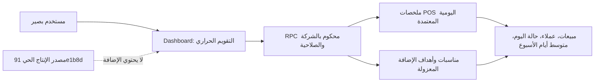

# HC-2 — مراجعة ألفا للتسليم الحي للتقويم الحراري

**التاريخ:** 2026-09-14  
**مرشح الكود:** `90e5e0f15c8302c6cc4296892638570a5a3ed7d5` (`codex/heat-calendar-demo`)  
**البيئة المفحوصة:** ديمو محلي معزول `baseer_heat_calendar_demo_20260914` على `127.0.0.1:18087`  
**القرار:** **NO-GO للإنتاج الآن.** لا يُنشر ولا تُكتب قاعدة الإنتاج ضمن هذه المراجعة.

## خريطة النطاق

المثبت: الأرقام تأتي من التجميع اليومي المعتمد فقط؛ الحساب الخلفي `Decimal`؛ الإضافة لا تكتب مبيعات أو فواتير أو قيوداً أو HR/payroll/calendar. المستنتج غير المقبول للإطلاق: أن الديمو يمثل artifact الإنتاج أو أداءه أو صلاحيات جميع شركاته.

## خطة التغطية

مراجعة مركزة-عميقة لأن التغيير يقرأ أرقام مبيعات فعلية، ينشئ نماذج جديدة عند التثبيت، ويستهدف بيئة حية متعددة الشركات. غطى فريق ألفا: حارس المرشح والتشغيل، حارس البيانات والحقيقة الحسابية والأمان، مختبر الرحلات والسعة، وأمين الدليل. لم ينفذ الفريق أي كتابة أو نشر أو ترقية قاعدة بيانات.

## النتائج

| المعرف | الشدة | الدليل | الأثر | الإغلاق المطلوب |
|---|---|---|---|---|
| HC-LIVE-01 | P1 مانع | المصدر الحي عند `91e1b8d` وإيصال payload الحي يثبت 853 ملفاً؛ المرشح `90e5e0f` يضيف 16 ملفاً لإضافة `baseer_sales_heat_calendar` ولا توجد في `production_source/custom_addons`. `compose.production.yaml` يركب مصدر الإنتاج فقط. | النشر الحالي لن يحتوي التقويم، وأي نسخ يدوي يكسر provenance والتراجع. | إنشاء artifact إصدار مجمد من المرشح، tag وhash، ودفعه إلى GitHub، ثم مطابقة artifact المضيف به حرفياً. |
| HC-LIVE-02 | P1 مانع | الإضافة تضيف نماذج وACL وبيانات Dashboard في `__manifest__.py`، بينما خدمة الإنتاج تبدأ Odoo بلا `-i` أو `-u`. | الكود وحده لا ينشئ جداول المناسبة/الهدف ولا لوحة التقويم ولا أصولها. | إجراء تثبيت one-off محكوم على نسخة rehearsal أولاً، ثم توثيق أمر التثبيت والتراجع؛ لا يطبق على الأصل قبل اكتمال G8. |
| HC-LIVE-03 | P1 مانع | تقرير الديمو يطلب warm-load وصلاحيات الشركات وG8 مستقل للـcommit نفسه. كما أن `SHAMI TAX` موجودة في ديمو البيانات لكن حساب المدير المفحوص لا يملكها ضمن الشركات المسموح بها. | لم يثبت الوصول والتجميع لكل شركة مطلوبة، ولا أن المستخدمين ذوي الصلاحيات المحدودة لا يتجاوزون العزل. | اختبار شركة/مستخدم محدود ومدير مناسبات وSHAMI TAX في rehearsal مطابق للـartifact، مع تثبيت سياسة من يملك تلك الشركة. |
| HC-LIVE-04 | P1 مانع | لا توجد اختبارات إضافة مستقلة أو قياس warm/cold وp95 في بيئة مطابقة للإنتاج؛ يوجد أصلًا بلاغ بطء حي. | لا يمكن إصدار حكم مهني أن القراءة الجديدة لن تزيد بطء Odoo الحي. | قياس الرحلة لكل شركة على rehearsal، مع تحليل استعلام التجميع وإقرار حد قبول قبل النشر. |
| HC-LIVE-05 | P2 | تغذية المناسبات فعل يدوي للمدير؛ سجلات العيد 2025–2030 تقديرية حتى مراجعتها. سياسة الوزارة تصف قاعدة مدة العيد لا تاريخاً منشوراً لكل سنة. | قد يبدأ التشغيل بلا مناسبات أو بتقديرات إذا لم تنفذ تغذية ومراجعة موثقتان. | خطوة post-install: تغذية واحدة، اعتماد التواريخ التاريخية المطلوبة من مصدر رسمي، وترك المستقبلي المقدر موسوماً بوضوح. |
| HC-LIVE-06 | P2 | تعارض `source_key` لمناسبة غير مرئية لمدير الشركة قد يجعل إعادة التغذية تفشل؛ النافذة لا تحبس التركيز أو تدعم Escape؛ شبكة الجوال تحتاج تمريراً داخلياً مقصوداً. | تحسينات موضعية بلا تسرب أو كتابة في المبيعات. | جدولتها بعد الإطلاق أو تضمينها في مرشح الإغلاق إن رغب المالك. |

## حقائق قبول مثبتة للديمو

- فحص Python/XML/JavaScript وGit whitespace للمرشح الحالي ناجح؛ وحدة الديمو مثبتة بإصدار `19.0.1.0.2`.
- مبيعات اليوم وبيانات العملاء تأتي من ملخصات معتمدة فقط. المتوسط تحت عنوان يوم الأسبوع يحسب بالخلفية من الأيام المكتملة فقط، ولا يدخل في خلية اليوم أو يغير مصدر الحقيقة.
- اختبر عرض العربية والعطل الرسمية والنافذة العائمة على 390×844 من دون overflow للصفحة.
- فحص الإضافة لم يجد Controllers أو cron أو عميل HTTP أو اتصال HR/payroll/accounting/calendar.

## مسار الإغلاق الأقصر

1. تثبيت مرشح إصدار قابل للتتبع: artifact من `90e5e0f`، hash وtag وGitHub؛ بلا نسخ يدوي إلى المضيف.
2. أخذ backup متسق حديث من الإنتاج واستعادته في rehearsal منفصل؛ تثبيت الإضافة هناك فقط وتوثيق migration/rollback.
3. اختبار الأرقام، العزل وصلاحيات الشركات الأربع بما فيها SHAMI TAX، وقياس warm/cold load قبل/بعد.
4. اعتماد المناسبات التاريخية التي ستستعمل في التحليل، ثم G8 مستقل على الـartifact نفسه.
5. بعد قرار GO فقط: نافذة نشر، backup جديد، تثبيت محكوم في الإنتاج، restart محدود لـOdoo، smoke للوحة، ومطابقة hash؛ التراجع إلى artifact السابق مع restore فقط إذا فشل التثبيت أو سلامة البيانات.

## القرار

لا يوجد P0 أو خلل مثبت في مصدر المبيعات أو الحساب أو عزل الديمو. لكن موانع P1 الأربع تعني أن التحديث الحي الآن غير آمن وغير قابل للإثبات. القرار لا يصبح GO إلا بعد إغلاقها وتكرار مراجعة التسليم على artifact المحدد.
