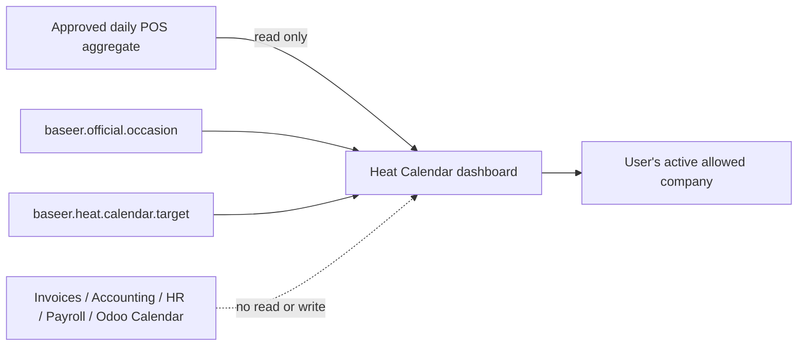

# HC-LIVE-1 — ترقية التقويم الحراري إلى الأصلية والإنتاج

**الحالة:** G8 = **GO** مستقل، وتم قطع مرشح التقويم الحراري إلى `baseer_prod` مع recovery جديد وsmoke ناجح؛ راقب التشغيل الحي وفق الدليل.  
**المرشح الوحيد:** `release_candidates/2026-09-14-abroj-baseer/heat_calendar_demo_source`، يبدأ من `90e5e0f15c8302c6cc4296892638570a5a3ed7d5`.  
**الأساس الحي الحالي:** artifact/tag `91e1b8d460541e31cce5881a16081cfbc12ea83a` في مشروع Hostinger `baseer-odoo-prod` وقاعدة `baseer_prod`.

هذا سجل ترقية مستقل ولا يبدل سجل الديمو أو أي إيصال نشر تاريخي.

## عقد البناء — G0 (مسودة للمراجعة المستقلة)

### الهدف

إتاحة `baseer_sales_heat_calendar` في لوحة بصير الحية: تقويم مبيعات شهري لكل شركة يعرض المبيعات الشاملة للضريبة والعملاء المسجلين وحالة اليوم، ويعرض العطل والمناسبات الرسمية للتحليل فقط. لا يدخل أثر المناسبة في أرقام المبيعات ولا يدّعي السببية؛ هو سياق قابل للتدقيق لتحليل لاحق.

### المستخدمون والرحلات الحرجة

1. مستخدم POS مخوّل يفتح لوحة التقويم لشركته ويرى مصدر اليوم المعتمد فقط.
2. مدير التقويم يفتح نموذج «الهدف» أو «المناسبة» القياسي، وينشئ أو يعدّل سجل الإضافة ضمن الشركات المخوّلة له.
3. مسؤول التشغيل يثبت الـartifact المعتمد على نسخة rehearsal مطابقة، ثم — بعد GO — يثبته مرة واحدة على الإنتاج مع backup حديث وفحص وتراجع محدد.

### النطاق ومعايير القبول

- نفس أرقام `baseer.pos.daily.report._aggregate_days` المعتمدة تظهر في خلية اليوم والتفاصيل؛ لا فواتير أو قيود أو ملخصات غير معتمدة.
- عزل الشركات مثبت للمستخدم العادي، مدير التقويم، والشركات الأربع بما فيها `SHAMI TAX` عندما تُمنح للمستخدم في إعدادات المستخدم صراحة.
- إنشاء الأهداف والمناسبات من الإجراءات يفتح نموذج Odoo قياسياً ويخضع لقواعد السجل.
- لا يضيف التثبيت أو يغير سجلات المبيعات، الفواتير، القيود، HR، الرواتب، `calendar.event` أو `resource.calendar`.
- artifact مشفّر بـcommit وtag وSHA وموجود في GitHub والمضيف نفسه، وخطوات التثبيت والتراجع قابلة للتكرار.
- يحقق القياس في rehearsal حد القبول المعلن في G1 ولا تظهر أخطاء وصول أو استعلامات غير محدودة.

### مصفوفة القبول والصلاحيات

| الشخصية | الشركات المخوّلة في الاختبار | يجب أن ينجح | يجب أن يُرفض |
|---|---|---|---|
| مستخدم POS محدود | شركة A فقط | قراءة لوحة A ومصدر يوم A المعتمد | فتح لوحة أو هدف/مناسبة أو RPC لشركة B |
| مدير التقويم | شركة A ثم A+B عند اختبار متعدد الشركات | إدارة أهداف/مناسبات الشركات المخوّلة وتغذية السجلات العامة | قراءة أو تعديل سجل شركة غير مخوّلة |
| مسؤول النظام | كل الشركات الأربع في rehearsal فقط | قراءة وإدارة ضمن `allowed_company_ids` وفتح النماذج القياسية | تجاوز قاعدة الشركة لمجرد أنه System |

تمثل الشركات الأربع: المعلم الشامي، دوحة المستهلك، ARZ، و`SHAMI TAX`. لا يعد وجود `SHAMI TAX` في قاعدة البيانات تفويضاً لإضافتها إلى حساب حي؛ يختبرها حساب rehearsal مؤقت ثم تحافظ الأصلية على عضوياتها الحالية إلى أن يحدد المالك حساب الاستقبال.

### خارج النطاق والافتراضات

- لا ذكاء اصطناعي، ولا تعاقد API خارجي أو cron أو تقويم دوام أو إجازات موظفين.
- يظل العيدان المستقبليان تقديريين إلى أن يعتمد مدير مناسبتهما بمصدر رسمي؛ لا نحول التقدير إلى حقيقة قانونية تلقائياً.
- `SHAMI TAX` موجودة في البيانات، لكن ظهورها في مبدّل الشركات قرار صلاحية Odoo للمستخدم؛ لا نوسع صلاحيات أي مستخدم ضمن النشر.
- نافذة النشر واستعادة backup مفوضتان من المالك في هذا الطلب. لا يجيز ذلك أي ترحيل بيانات أعمال إضافية أو تغيير صلاحيات غير موثق.

### دورة ERP والرقابة

| الدورة | الحدث | الأثر | الرقابة |
|---|---|---|---|
| عرض مبيعات | RPC قراءة لوحة | لا قيد، لا مخزون، لا تعديل مصدر | حصر المصدر في daily aggregate المعتمد + company access + Decimal في الخلفية |
| مناسبة/هدف | إنشاء أو تعديل إعداد الإضافة | كتابة في نموذجي الإضافة فقط | مدير مخوّل، قواعد شركة، مفتاح مصدر فريد، تدقيق Odoo الأصلي |
| تثبيت الإضافة | one-off `-i` محدد | schema/ACL/إعداد Dashboard للإضافة فقط | rehearsal أولاً، backup DB+filestore متسق، SQL counts قبل/بعد، rollback محدد |

## ملف الإطلاق والنمو — G1 (مسودة للمراجعة المستقلة)

| البند | القيمة/الافتراض المحافظ | حد القبول والإثبات |
|---|---|---|
| الشركات | 4 شركات نشطة، ومنها `SHAMI TAX` | تشغيل كل شركة مخوّلة في rehearsal؛ لا نفترض ظهورها لحساب بلا صلاحية |
| الرحلة الحرجة | فتح شهر واحد ثم الضغط على يوم | cold وwarm يقاسان محلياً على rehearsal؛ p95 ≤ 2.0 ثانية للـRPC الدافئ و≤ 4.0 ثوانٍ للبارد، 0 خطأ |
| القراءة | شهر واحد (≤ 366 يوماً) + 8 أسابيع مرجعية | لا pagination لازمة لهذا الحد؛ توثيق صفوف الملخص/المناسبات وخطة الاستعلام |
| التزامن | افتراض حتى 20 قراءة تفاعلية متزامنة؛ إدارة مناسبة/هدف قليلة | لا وعد سعة إنتاجية؛ القياس rehearsal فقط، والكتابة محمية بالـconstraint وقواعد Odoo |
| نمو البيانات | ملخصات يومية، مناسبات وأهداف محدودة؛ الاحتفاظ تاريخي | لا تحميل سنوات في العميل؛ كل request مقيد بالشهر والتاريخ |
| الاستمرارية | مصدر الإنتاج وDB/filestore منفصلان | backup طازج قبل التثبيت، receipt/hash، smoke، وعودة إلى source/tag السابق؛ restore فقط عند فشل السلامة |

لا يُجرى اختبار حمل على الإنتاج. إذا لم يتحقق الحد في rehearsal، يبقى القرار NO-GO وتُحل عنق الزجاجة قبل إعادة الاختبار.

**بروتوكول القياس القابل للإعادة:** بعد استعادة backup حي إلى قاعدة/filestore rehearsal معزولين وتثبيت الـartifact نفسه، يقاس لكل من الشركات الأربع طلب RPC الخاص بشهر محدد. البارد هو أول طلب بعد restart لخدمة rehearsal واكتمال HTTP؛ تجمع خمس عينات مستقلة. الدافئ هو بعد طلب تهيئة واحد؛ تجمع 20 عينة، ويحسب p95 من العينة المرتبة عند `ceil(0.95 × N)` من دون إخفاء الأخطاء. تسجل timestamp، الشركة، الشهر، status، زمن العميل والخادم إن توفر، وعدد صفوف daily aggregate والمناسبات/الأهداف. ينفذ 20 قارئاً متزامناً في rehearsal فقط بعد القياس الفردي. يفحص `EXPLAIN (ANALYZE, BUFFERS)` لاستعلامات الملخصات والإغلاقات الفعلية من دون سجل بيانات شخصية أو أسرار. لا يعد قياس rehearsal ضماناً لأداء الإنتاج؛ هو بوابة رفض للانحدار.

## المعمارية والبيانات — G2 (مسودة للمراجعة المستقلة)

| المجال | القرار | سبب السلامة |
|---|---|---|
| مصدر الأرقام | `baseer.pos.daily.report._aggregate_days` فقط | يعيد استعمال الرقم المعتمد، لا ينسخ أو يجمع في العميل |
| المبالغ | `Decimal` وتقريب backend | لا `float` ولا مصدر حقيقة في OWL |
| الملكية | الإضافة تملك المناسبات والأهداف فقط | حذفها لا يغير نماذج Odoo القياسية أو حركات الأعمال |
| الوصول | شركة Odoo النشطة + `company_ids` للوحة + ACL/rules للنماذج | لا `sudo` من العميل ولا عزل ضمن الواجهة فقط |
| عزل مسؤول النظام | تضمين `base.group_system` في قواعد الشركة ذاتها | لا تتحول صلاحية CRUD إلى قراءة/تعديل متعدد الشركات |
| التزامن | `source_key` فريد + probe داخلي مقيد لإعادة التغذية + savepoint | إعادة التغذية لا تكشف سجلاً مخفياً أو تستبدل اعتماد المدير أو تكرر السجل |
| الترحيل | تثبيت module محدد، لا `--update=all` ولا wildcard DB | أقل أثر schema ممكن ومراجعة قاعدة محددة |
| الرصد والتراجع | سجل Odoo، HTTP/RPC checks، hash، backup | إيقاف/استرجاع واضح بلا حذف واسع أو reset |

**خطة الترقية المختصرة:** تجميد artifact من commit معتمد → push/tag GitHub → بناء rehearsal من backup حي حديث → تثبيت واحد للإضافة → قياسات وعزل/أرقام → G8 مستقل → backup إنتاج حديث → نسخ artifact المطابق → one-off install → restart محدود → smoke/hash → مراقبة. عند فشل التثبيت أو سلامة البيانات، يبقى المصدر السابق ويستعاد backup المتسق فقط وفق runbook.

**إصلاحات المرشح المطلوبة قبل G4:** (1) تضمين `base.group_system` في قاعدتي company rules للمناسبة والهدف، (2) فحص replay للمفتاح عبر backend فقط مع `active_test=False` ثم skip آمن بلا كشف أي سجل، (3) جعل مفتاح السجل اليدوي داخلياً حتى لا يتصادم عرضياً مع namespace تغذية السعودية، (4) اختبارات ORM الثلاثة المحددة في HC-T01–HC-T03، (5) Escape/focus trap/return-focus للنافذة وتحقق متصفح. لا تغير هذه الإصلاحات العقد أو مصدر الأرقام أو الرصة.

| الاختبار | الإثبات المتوقع |
|---|---|
| HC-T01 — عزل System/manager | مسؤول النظام ومدير التقويم أحادي الشركة لا يقرآن أو ينشئان أو يعدلان هدفاً/مناسبة لشركة غير موجودة في `allowed_company_ids`؛ تضمين System في rule لا يصبح bypass. |
| HC-T02 — عزل قارئ POS | مستخدم POS أحادي الشركة يقرأ لوحة شركته فقط ويرفض RPC اللوحة عند تبديل السياق إلى شركة غير مخوّلة؛ لا يقرأ هدفاً أو مناسبة لشركة أخرى. |
| HC-T03 — تغذية آمنة | وجود `source_key` مؤرشف أو مخفي عن المدير يجعل التغذية تتخطاه بلا `IntegrityError` ولا إعادة سجل أو اسم أو شركة أو حقل منه. يستعمل probe `sudo().with_context(active_test=False)` داخلياً للتحقق من الوجود فقط ولا يعيد record أو حقوله إلى الواجهة. |

`source_key` اليدوي ينشأ من الخادم بصيغة `MANUAL:<uuid>` ويكون غير قابل للتحرير في النموذج؛ مفاتيح `SAUDI:` محجوزة للتغذية البرمجية. لا تعد هذه الآلية حماية من مسؤول قاعدة بيانات خبيث؛ هي تمنع التصادم التشغيلي مع بقاء ACL/rules هي حد الوصول الحقيقي.

## الرصة والمكتبات — G3 (مسودة للمراجعة المستقلة)

- Odoo 19، OWL، `spreadsheet_dashboard` و`baseer_sales_dashboard` القائمة: **لا اعتماد جديد** ولا مكتبة UI إضافية ولا اتصال شبكي.
- الإضافة تعتمد فقط `baseer_sales_dashboard` كما في manifest؛ لا تغير صور Docker أو إصدارات PostgreSQL أو compose الحي.
- المسار المباشر: يرقّى add-on الصغير نفسه بدلاً من نسخ واجهة أو تركيب تطبيق عطلات HR أو سوق خارجي.
- فحوص المرشح: `git diff --check`، فحص Python/XML/JS/PO، تشغيل module/test في rehearsal، HTTP/RPC قياس، وفحوص صلاحيات/عزل/أرقام عبر المتصفح.

## نظام التجربة والواجهة — G4 (مسودة للمراجعة المستقلة)

- المكوّنان المحليان للميزة فقط هما `BaseerHeatCalendar` و`HeatDayDetails`؛ يستعملان أزرار ونماذج Odoo القياسية، ولا ينشآن مكتبة أو نظام تصميم بديل.
- العربية/الإنجليزية وRTL/LTR تبقيان من ملفات الترجمة الحالية؛ الأرقام مصدرها backend وتعرض غربياً كما هي.
- مسار الجوال: شبكة الشهر تبقى بتمرير داخلي مقصود، بلا overflow للصفحة. النافذة تفتح فوق الصفحة ولا تدفع التفاصيل إلى أسفلها.
- إضافة الوصول المطلوبة: تركيز أولي داخل النافذة، Tab محصور في عناصرها، Escape يغلقها، ويعود التركيز إلى خلية اليوم التي فتحتها. لا حركة جديدة.
- معيار القبول: تحقق متصفح عربي/إنجليزي على 390px وسطح المكتب للفتح/الإغلاق/Tab/Escape/استعادة التركيز، ولا تغيير في حساب أو بيانات الواجهة.

## سجل البوابات

| البوابة | الحالة | المالك | المراجع المستقل | دليل الدخول | قرار حارس البوابات |
|---|---|---|---|---|---|
| G0 | معتمدة للبناء | فريق ألفا للبناء | `alpha_gate_review` | عقد النطاق ودورة ERP ومصفوفة القبول أعلاه | GO للبناء؛ لا قبول نشر |
| G1 | معتمدة للبناء | مهندس السعة | `alpha_gate_review` | ملف السعة وبروتوكول القياس أعلاه | GO للبناء؛ القياس شرط قبول لاحق |
| G2 | معتمدة للبناء | بنّاء البيانات | `alpha_gate_review` | مصدر الحقيقة والعزل/rollback وHC-T01–HC-T03 أعلاه | GO للبناء؛ الاختبارات شرط قبول لاحق |
| G3 | معتمدة للبناء | أمين المكتبات | `alpha_gate_review` | لا تبعيات أو تغيير رصة | GO للبناء |
| G4 | قيد المراجعة | بنّاء الواجهة | حارس الجودة مستقل | عقد التجربة أعلاه | بانتظار مراجعة مستقلة |
| G5–G7 | غير مبدوءة | فريق ألفا للبناء | حارس الجودة | — | محجوبة حتى G4 |
| G8 | GO — منشور | مهندس التشغيل | فريق تسليم ألفا | المرشح `.3` + بروفة Hostinger + runbook + حكم قبول وتشغيل مستقلان + recovery/smoke حي | القطع اكتمل؛ recovery والمراقبة محفوظان |

## سجل القرارات

| القرار | البدائل | السبب | الأثر |
|---|---|---|---|
| ترقية نفس الإضافة المعزولة | كتابة داخل dashboard الأساسي أو calendar.event/HR | أقل حد معماري ولا يمس بيانات التشغيل | add-on/jداول خاصة فقط |
| rehearsal من backup حي طازج | نشر مباشر أو demo قديم | يثبت التثبيت والأداء على بيانات مماثلة مع تراجع | يضيف وقتاً قصيراً، يمنع تخميناً حياً |
| لا نمنح `SHAMI TAX` تلقائياً | تعديل المستخدمين في cutover | فصل الصلاحية عن release الكود | يحتاج مالك المستخدم لتعيين الشركة عند الحاجة |

## دفتر العمليات الحي

| المعرّف والوقت | البوابة/المرحلة | النوع | النية أو السبب | التغيير أو الأمر | النتيجة والدليل | الأثر والتراجع | المنفذ والمراجع |
|---|---|---|---|---|---|---|---|
| HC-LIVE-OP-001 — 2026-09-14 | G0–G3 | قرار/توثيق | فتح مسار إصلاح موانع التسليم قبل أي نشر | إنشاء هذا السجل؛ قراءة registry، مراجعة التسليم، runbook وملفات الإضافة/production compose | موانع P1 معروفة: artifact، one-off install، عزل، قياس | لا تعديل تطبيق/DB/host؛ يمكن حذف مسودة الوثيقة فقط قبل اعتمادها | قائد البناء؛ بانتظار مراجعين مستقلين |
| HC-LIVE-OP-002 — 2026-09-14 | G0–G3 | مراجعة/تحديث | معالجة ملاحظات المراجعين المستقلين قبل بدء كود الإصلاح | إضافة مصفوفة شخصيات وشركات، بروتوكول p95/concurrency، وحل تصميمي لعزل System وreplay المفتاح | لم يبدأ بناء أو Docker أو DB أو نشر؛ أعيدت G0–G3 للمراجعة المستقلة | لا أثر تشغيلي؛ التراجع حذف الإضافات التوثيقية فقط قبل الاعتماد | قائد البناء؛ مراجعة `alpha_gate_review` مرجعية، وإعادة مراجعة مطلوبة |
| HC-LIVE-OP-003 — 2026-09-14 | G2 | تحديث تصميم | تعريف دلائل الاختبار وتفصيل عدم كشف probe الداخلي | إضافة HC-T01–HC-T03 وعقد `MANUAL:<uuid>` | لا بناء أو DB أو نشر قبل إعادة المراجع لحكمه | لا أثر تشغيلي | قائد البناء؛ بانتظار حارس بوابات مستقل |
| HC-LIVE-OP-004 — 2026-09-14 | G0–G3 | مراجعة مستقلة | أعاد المعماري المستقل فحص عقد البوابات بعد التصحيح | لا تغيير تطبيق أو تشغيل | G0/G1/G2/G3 = GO للبناء فقط؛ لا rehearsal أو نشر | لا أثر تشغيلي | `alpha_gate_review` مستقل |
| HC-LIVE-OP-005 — 2026-09-14 | G4 | تصميم | توثيق حد الواجهة للإصلاحات المطلوبة قبل الكود | إضافة عقد RTL/LTR والجوال وkeyboard modal | لا تعديل تطبيق أو DB أو نشر | لا أثر تشغيلي | قائد البناء؛ بانتظار حارس جودة مستقل |
| HC-LIVE-OP-006 — 2026-09-14 | تشغيل/Preflight | تحقق قراءة فقط | تحديد إمكانية تنفيذ rehearsal على Hostinger قبل موعد cutover | لا terminal ملحق بهذه المهمة؛ تحقق SSH batch غير تفاعلي إلى `root@baseer.abroj.sa` فشل بالمصادقة من دون أمر إداري | لم تتصل جلسة إدارية ولم يتغير المضيف؛ يلزم مسار دخول Hostinger صالح عند مرحلة rehearsal | لا أثر على التطبيق أو البيانات؛ أضيف مفتاح مضيف عام إلى known_hosts المحلي فقط | قائد البناء |
| HC-LIVE-OP-007 — 2026-09-14 | G5 | تنفيذ/اختبار | تثبيت المرشح `5ccb000` في الديمو المعزول وإعادة اختبار acceptance | one-off `-u baseer_sales_heat_calendar` ثم test tags للإضافة على `baseer_heat_calendar_demo_20260914` فقط | التثبيت وHTTP نجحا، لكن HC-T03 أخطأ لأن مفتاح اختبار ثابتاً كان موجوداً من seed الديمو؛ لا GO ولا اعتماد للاختبار | لا أثر على الأصلية/الإنتاج؛ test fix مطلوب ثم إعادة التثبيت والاختبار | قائد البناء؛ فشل معلن للمرشح الحالي |
| HC-LIVE-OP-008 — 2026-09-14 | G5–G7 | إصلاح/تجميد | معالجة موانع التسليم المعلنة قبل أي تغيير للأصلية | مرشح جديد `a596a12`؛ HC-T04 لحد التاريخ، ترجمة نماذج الإدارة، receipt وtag/archive موثق | local module tests = 0 failures/0 errors؛ تحقق عربي مستقل للهدف والمناسبة في الديمو | لا لمس للأصلية أو production؛ الوسم السابق محفوظ والتراجع بإلغاء المرشح الجديد | قائد البناء؛ إعادة تسليم ألفا مطلوبة |
| HC-LIVE-OP-009 — 2026-09-14 | G6–G7 | بروفة معزولة | إثبات المرشح المجمد على snapshot حي حديث بلا مشاركة موارد الإنتاج | مشروع `baseer-odoo-heat-rehearsal-a596a12`، DB/volumes/networks منفصلة، port loopback `18188`، one-off install/test وORM/RPC/قياس | HC-T01–HC-T04 ناجحة؛ snapshot بيانات الأعمال متساوٍ؛ 4 شركات، POS محدود، manager محلي، p95 warm و20 concurrent ناجحة. الدليل: `outputs/heat-calendar-live/REHEARSAL-EVIDENCE-a596a12.md` | production قراءة فقط؛ لا source/DB/صلاحيات إنتاجية تغيرت؛ إزالة rehearsal لاحقاً غير مؤثرة على الأصلية | مهندس التشغيل؛ قرار G8 مستقل معلّق |
| HC-LIVE-OP-010 — 2026-09-14 | G5–G7 | إصلاح مرشح/بروفة | معالجة موانع التسليم DEL-01 حتى DEL-06 دون لمس الإنتاج | وسم `heat-calendar-candidate-2026-09-14.3` عند `52e9ff5`، archive binary-safe مطابق لكل blobs، GitHub Release، بروفة Hostinger جديدة `baseer-odoo-heat-rehearsal-52e9ff5` من snapshot/filestore طازجين | 871 ملفاً verified بايتياً؛ pre/post install snapshot متساوٍ؛ HC-T01–HC-T04 ناجحة؛ 5 cold × 4 شركات، warm و20 concurrent وEXPLAIN ناجحة؛ runbook أصلح DB/filestore/env | production قراءة فقط؛ مرشح `.2` غير قابل للترقية ومحتفظ به كسجل؛ البروفة الجديدة مستقلة وقابلة للإتلاف بلا أثر | مهندس التشغيل؛ إعادة قرار G8 مستقل مطلوبة |
| HC-LIVE-OP-011 — 2026-09-14 | G7 | إصلاح دليل/تحقق | إغلاق ملاحظة DEL-06: متغير DB داخل حاوية Odoo لا يُحقن من `--env-file` تلقائياً | runbook يمرر `-e POSTGRES_DB="$db"` صراحةً في أوامر preinstall/install/postinstall؛ تحقق compose وOdoo shell الحرفي على البروفة | الاسم داخل الحاوية هو DB المعزول وصورة snapshot مطابقة؛ الدليل `evidence-52e9ff5/runbook-db-env-snapshot.json` | لا أثر production أو بيانات أعمال؛ التراجع حذف صياغة الدليل فقط قبل cutover | مهندس التشغيل؛ إعادة فحص تشغيل مستقل مطلوبة |
| HC-LIVE-OP-012 — 2026-09-14 | G8 | قرار تسليم مستقل | الفصل بين صلاحية المرشح وتنفيذ النشر الحي | حكمان مستقلان `alpha_delivery_acceptance` و`alpha_delivery_operations` = GO للوسم `.3` فقط؛ لا يوجد P0/P1 مفتوح | يسمح بالـcutover وفق runbook؛ القرار لا يعني أن production تغيرت بعد | لا أثر production عند التسجيل؛ recovery/smoke إلزاميان في العملية التالية | فريق تسليم ألفا مستقل |
| HC-LIVE-OP-013 — 2026-09-14 | G8 | قطع حي مضبوط | ترقية التقويم الحراري بعد GO المستقل | archive SHA تحقق، stage release `52e9ff5` مع `.env`/`odoo.conf` من السابق، إيقاف Odoo قصير، recovery DB+filestore جديد، one-off `-i baseer_sales_heat_calendar`، snapshots متساوية، symlink ذري، restart وsmoke | `baseer.abroj.sa/web/login` = HTTP 200؛ dashboard 9 يعمل للشركات 54/2/3/1؛ لا Traceback/CRITICAL/FATAL بعد القطع؛ الدليل `outputs/heat-calendar-live/POSTDEPLOY-EVIDENCE-52e9ff5.md` | زوج recovery محفوظ على المضيف؛ rollback متاح فقط قبل عمليات أعمال لاحقة، وبعدها إصلاح أمامي/incident plan | مهندس التشغيل؛ تسليم ألفا GO مسبق |
| HC-LIVE-OP-014 — 2026-09-14 | G8 | إغلاق تسليم مستقل | مراجعة الدليل الخام بعد النشر | فريق تسليم ألفا فحص release الحالي، ترتيب التثبيت/التحويل، snapshots، زوج recovery، حالة الخدمة، HTTPS/TLS، smoke للشركات الأربع والسجل | **FINAL GO**؛ لا P0/P1 في نطاق الإصدار؛ الدليل الخام في `outputs/heat-calendar-live/production-evidence-52e9ff5/` | لا rollback مطلوب؛ تستمر مراقبة التشغيل الطبيعية | `alpha_delivery_acceptance` و`alpha_delivery_operations` مستقلان |
