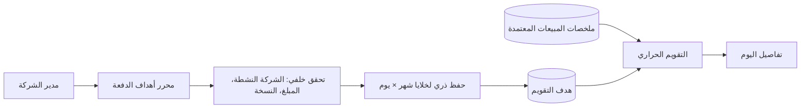

# مراجعة تسليم: أهداف التقويم الحراري

الحالة الحالية: **CONDITIONAL GO — مرشح سليم محلياً، والنشر الحي متوقف على بروفة Hostinger مستقلة ومراجعة تسليم ألفا بعد دليلها.**

## هوية المرشح

- خط الأساس الحي: `863bd851dc107ba8911b417263f21b83270701f0`
- المرشح: `f1b0034cfce8390a8274b59e900b823ae7590d97`
- الوسم: `heat-calendar-targets-live-candidate-2026-09-14.1`
- الحزمة: `baseer-heat-calendar-targets-live-f1b0034.tar.gz`
- SHA-256: `23d77acc0dfe3ae811d5b80b1e27299236d94dc6daf68ba55aa4bc04cd909ced`
- التغيير المقصود فقط: `baseer_sales_heat_calendar` إلى `19.0.1.0.8` وبيان الاستلام.

## خريطة المسار الحرج

المبيعات تقرأ فقط من ملخصات المبيعات المعتمدة. الأهداف إعدادات مستقلة؛ لا يكتب المحرر في ملخصات المبيعات أو الحسابات أو الموارد البشرية.

## دليل محلي منفذ

| فحص | النتيجة |
|---|---|
| فرق المرشح عن الخط الحي | 11 ملفاً: 10 ملفات للموديول وبيان الاستلام فقط |
| `git diff --check` | ناجح |
| اختبار Odoo المعزول | 16 اختباراً، `0 failed, 0 error(s)` |
| قاعدة الاختبار | ترقية `baseer_sales_heat_calendar` فقط إلى `19.0.1.0.8` |
| سلامة البيانات في QA | هدف واحد نشط كما قبل الاختبار؛ لا ملخصات مبيعات في قاعدة الاختبار |
| النشر المصدر | الفرع والوسم موجودان في GitHub |

رسالة القيد الفريد في سجل الاختبار متوقعة: اختبار يثبت منع التكرار لنفس الشركة والسنة والشهر ويوم الأسبوع، وقد نجح الاختبار.

## التغطية والقيود

- تم التحقق من حفظ الدفعة الذري، المبالغ العشرية، منع التكرار، التعارض المتزامن، النطاق بالشركة النشطة، والصلاحية داخل اختبارات الموديول.
- سيتحقق تمرين Hostinger من الملف المخزني، ترقية الموديول وحده، بقاء بيانات الإنتاج الحساسة دون تغيير، واجهة المخرج، والصحة العلنية.
- ملاحظة P2 معروفة خارج رحلة الداشبورد: واجهة CRUD القديمة المسموح بها قد تتعامل مع شركة مسموح بها مختلفة عن الشركة النشطة؛ محرر الدفعة الجديد لا يفعل ذلك. لا تُخفى هذه الملاحظة ولا تُضمّ معها تغييرات غير لازمة.

## شرط التحول إلى GO

لا يُحدَّث الحي قبل بروفة Hostinger ناجحة ودليل استعادة حديث ومراجعة فريق تسليم ألفا المستقلة دون مانع P0/P1.

## بروفة Hostinger المنعزلة — مكتملة

- استعيدت لقطة من المصدر الحي إلى قاعدة منفصلة وfilestore باسم مستقلين.
- رُقّيت `baseer_sales_heat_calendar` فقط من `19.0.1.0.7` إلى `19.0.1.0.8`.
- نتائج الموديول: 16 اختباراً، `0 failed, 0 error(s)`.
- لقطة الحسابات، الموارد البشرية، جهات الاتصال، ملخصات المبيعات، وعدد/بصمة أهداف التقويم بقيت مطابقة قبل وبعد.
- صفحة الدخول داخل Odoo المعزول أعادت HTTP `200`.
- اختُبرت محاذاة اسم قاعدة البروفة مع filestore؛ سجل الاختبار النهائي بلا `Traceback` أو `CRITICAL`.

دليل الخادم المنعزل: `acceptance.json` في مسار البروفة، ويحتوي SHA-256 لقطة قاعدة المصدر وfilestore دون أسرار.

## قرار فريق تسليم ألفا المستقل

**GO للنشر المقيد** للمرشح `f1b0034cfce8390a8274b59e900b823ae7590d97`.

لا يوجد P0 أو P1. تم تأكيد تطابق الفرع والوسم والأرشيف، ونظافة الفرق، وعزل الشركة والصلاحيات، وحفظ الأهداف الذري ومنع الكتابة القديمة، وقراءة المبيعات من ملخصات معتمدة فقط. تبقى ملاحظة P2 خارج نطاق هذه الرحلة: CRUD التاريخي يسمح بالشركات المتاحة في الجلسة، في حين أن محرر الدفعات ملتزم بالشركة النشطة.

## نتيجة التحويل الحي

**GO — نُشر بنجاح.**

- المصدر الحي أصبح `f1b0034`.
- رُقّيت `baseer_sales_heat_calendar` فقط إلى `19.0.1.0.8`.
- هدف واحد قائم بقي كما هو؛ لقطة البيانات المحمية وبصمة الأهداف تطابقت قبل وبعد.
- نُشئت نقطة رجوع مكتملة لقاعدة البيانات وfilestore، وتم التحقق من SHA-256 لكليهما.
- فحص الدخول المحلي والعام أعاد `200`، وخلو سجل Odoo الجديد من `Traceback` و`CRITICAL` و`FATAL` تحقق بعد الإقلاع.
