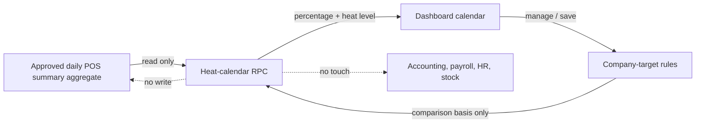
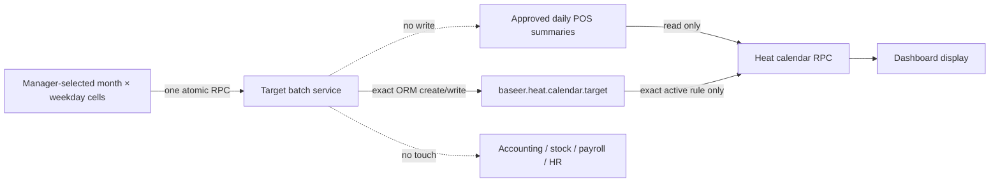

# Heat calendar targets — target-rule clarity release

## Contract and scope — G0

**Objective.** Make a heat-calendar sales target a clear, company-isolated rule that the manager can create for a selected month and weekday (for example, Thursday and Friday), and make its performance effect understandable in the calendar.

**Users.** A heat-calendar manager or system administrator manages targets only in an allowed company. POS users can read the calendar, but cannot create, edit, or delete targets.

**Source of truth.** Approved daily POS-sales summaries remain the sole source of sales and customer counts. A target is configuration only: it supplies the comparison basis for a completed day, then the existing backend computes the percentage and heat level. It never writes sales, accounting, inventory, payroll, occasions, or POS-summary rows.

**In scope.**

- Human-readable weekday choice rather than numeric weekday codes.
- A manager action that defaults to the calendar's active company, year, and month.
- Exact one-day rules only: a target is always for one company, one Gregorian year, one month, and one named weekday. There is no broad fallback rule in the manager flow.
- Reloading the calendar after target management closes and an explicit refresh for another open session.
- Focused server and browser tests plus isolated rehearsal and independent Alpha Delivery review.

**Out of scope.** WebSocket/push synchronization between browsers, changes to sales aggregation, targets for accounting journals, HR leave/payroll calendars, and changes to historical sales totals. “Immediate” means the next calendar read after a successful save (including closing the manager action, which triggers the calendar reload); an already-open independent browser can use Refresh.

**Acceptance criteria.**

1. Two records for the same company/month/year can target Thursday and Friday independently; the correct target is returned in each matching day and changes the displayed performance/heat level only.
2. An exact duplicate scope is rejected atomically. Broad `0`/`-1` wildcard scopes are not accepted, so one calendar day has at most one target rule and no precedence/override ambiguity.
3. The target setup dialog presents days by name, makes the selected company/year/month evident, and defaults a new rule to the calendar currently being viewed. The legacy raw target list is not part of this manager flow.
4. Saving and returning from target management reloads the visible month. Refresh reads the latest target data without changing any sales source data.
5. Target and dashboard reads respect the active allowed company; a manager/system user cannot bypass the company rule, and a POS reader cannot manage targets.
6. Arabic and English, desktop and narrow mobile use clear labels and no raw `-1`/weekday-number instruction is required from the manager.

**Critical journeys.**

1. Manager opens September for Company A, chooses Thursday, saves a target, returns, and sees that Thursday's target percentage and colour recomputed from the approved daily-summary data.
2. The same manager creates Friday with a different amount; Thursday remains unchanged. An exact duplicate is refused.
3. A reader in Company B cannot read or change Company A's target; a POS reader can view Company B's calendar but cannot open management actions.
4. A second open browser refreshes and receives a recently saved target without a stale calculation.

**ERP/financial cycle.** Approved POS daily summaries → read-only heat-calendar aggregation → comparison against target configuration → display. No journal, invoice, payment, stock, payroll, or source-summary state transition is part of this release.

## Capacity and release profile — G1

| Dimension | Bound / decision |
|---|---|
| Calendar query | One bounded selected month plus the existing eight-week history; target lookup is bounded to matching company/year/month scopes. |
| Target data | At most seven exact weekday rules for a company/month; no client-side sales aggregation or target history scan. |
| Concurrent saves | Database exact-scope uniqueness remains the concurrency authority; duplicate create must fail cleanly. |
| User effect | A manager save is rare; a normal reader only executes the existing month RPC. No polling or broadcast service is added. |
| Release/restore | New frozen candidate → fresh isolated rehearsal from a current live backup → one-module update → independent delivery review → live backup and update. |

G1 decision: no new capacity architecture is required. Measure the existing RPC before/after in rehearsal and reject an unexplained regression; do not load-test production.

## Architecture and data contract — G2

| Contract | Decision |
|---|---|
| Company isolation | Query by `env.company`; model ACLs and record rule remain the authority. UI defaults never grant a company. |
| Rule identity | `company_id, year, month, weekday` remains unique; `year` is a real calendar year, `month` is 1–12, and `weekday` is 0–6. |
| Rule selection | The backend selects only an exact company/year/month/weekday match. Wildcards are rejected for new or changed records, which removes rule precedence from the business contract. |
| UI storage contract | The table keeps its existing integer `weekday` column. The wizard presents a named Selection and writes the corresponding integer server-side; no column type migration is needed. |
| Money | Backend uses Decimal/money rounding. No target arithmetic is performed in OWL. |
| Refresh | The manager action's existing `onClose` calls the month RPC; the Refresh button performs the same read. No background push is promised. |
| Migration | Preserve existing stored target fields and records. This is an interface/read-contract upgrade, not a sales or accounting migration. |
| Observability | Candidate hash, focused test result, rehearsal RPC result, and configuration/source-record snapshots are release evidence. |

## Stack and dependencies — G3

No dependency, Docker image, browser package, Odoo core module, or database extension is added. The release stays inside `baseer_sales_heat_calendar`, using existing Odoo 19/OWL/action services and the existing target table. G3 remains GO unless implementation adds a dependency.

## Experience contract — G4

- The manager sees named weekdays in Arabic/English; the selection retains technical integer storage only behind the form contract.
- The calendar action supplies the active company/year/month as defaults, avoiding an accidental target in a different company or month.
- A concise scope help explains that each rule applies to exactly one company, year, month, and weekday. It does not add a new dashboard or duplicate the calendar.
- Desktop and 390px checks cover creating Thursday/Friday, server validation, close/reload, keyboard return, and clear labels.

## Gate register

| Gate | State | Owner | Independent reviewer | Evidence required |
|---|---|---|---|---|
| G0 | ready for independent review | Alpha build lead | gate reviewer | contract, journeys, ERP boundary |
| G1 | ready for independent review | capacity role | gate reviewer | bounded query/release profile |
| G2 | GO للبناء | architecture/ERP role | `alpha_gate_review` | source, isolation, exact-only uniqueness, UI integer-storage contract, refresh contract |
| G3 | GO in principle | dependency custodian | gate reviewer | no dependency change |
| G4 | GO | UI role | `alpha_gate_review` | Arabic/English named-day wizard, dialog/refresh and narrow viewport contract |
| G5–G7 | ready after G4 | build lead | quality reviewer | focused test/rehearsal evidence |
| G8 | blocked by G7 | operations | Alpha Delivery | independent GO/CONDITIONAL GO/NO-GO |

## Decisions

| ID | Decision | Alternatives | Reason |
|---|---|---|---|
| HCT-01 | Preserve backend target effect; improve rule clarity and verification. | Replace target logic or ignore targets. | It already correctly changes the day comparison; replacing it risks historical reporting without benefit. |
| HCT-02 | No WebSocket/live broadcast. | Polling or event bus. | Save-and-return reload is immediate for the manager and Refresh gives exact data to other sessions without a new production service or stale-data claim. |
| HCT-03 | Exact monthly weekday targets only. | Broad fallback + override precedence, or silent overlap. | A manager selects Thursday or Friday by name; one real scope means one rule, no hidden priority or accidental wide target. |

## Live operations log

| ID/time | Gate/phase | Type | Intent/change | Result/evidence | Impact/rollback | Owner/reviewer |
|---|---|---|---|---|---|---|
| HCT-OP-001 — 2026-09-14 | G0–G3 | Read/decision | Inspect live-candidate target contract before any code or production change. | Target changes basis/ratio/heat on the next RPC; Thursday=`3`, Friday=`4`; action close reloads only when it is a dialog; raw numeric UI and invisible fallback precedence need repair. | Read-only; no database or production change. | Alpha build lead; independent target/backend and release-scope review requested. |
| HCT-OP-002 — 2026-09-14 | G0–G2 | Design correction | Resolve independent gate-review blockers before any code. | Adopt exact-only targets (max seven per company/month), retain integer storage behind a named wizard selection, restrict manager action, and test source preservation. A read-only production query found zero target records, so no legacy wildcard data needs conversion. | No app or data write; prior candidate remains live. | Alpha build lead; re-review requested from independent gate reviewer. |
| HCT-OP-003 — 2026-09-14 | G0–G3 | Independent gate review | Re-review corrected target contract. | `alpha_gate_review`: G0/G1/G2/G3 = GO for building. The manager boundary is implemented in wizard default/load/save methods because Odoo 19 actions have no `groups_id` field; POS denial is a required explicit test. | No production/data change; G4 evidence required before candidate acceptance. | `alpha_gate_review` independent |
| HCT-OP-004 — 2026-09-14 | G4 | Build and independent UX review | Replace the raw target list with a named-day, exact-scope wizard and verify its translations. | Commit `bef7120`: Arabic/English desktop browser journeys show named weekday choices, scope defaults and translated scope message; focused Odoo suite has 0 failures/errors. `alpha_gate_review` granted G4 GO. | Local isolated demo only; target configuration/test rows do not touch sales sources. G5–G8 still required before production. | Build lead; `alpha_gate_review` independent |

## Batch target editor — approved design candidate (2026-09-14)

### Scope and acceptance — renewed G0

The owner approved replacing the one-rule target dialog with a **single batch editor**.  It remains a manager-only configuration screen inside the heat calendar, never a separate application.  The currently selected Odoo company is authoritative; the manager selects one Gregorian year, all or selected months, and all or selected weekdays.  The screen then lets the manager set a distinct target for every selected month × weekday intersection and save the batch once.

The cashier-permission request is deliberately outside this candidate until its incomplete source/ownership requirement is clarified.  It must not be coupled to target management.

| Acceptance criterion | Required outcome |
|---|---|
| Bulk scope | Select any non-empty subset of the 12 months and seven weekdays; the server accepts only the resulting explicit exact cells, maximum 84. |
| Individual control | A convenience amount may fill selected cells, but every selected cell remains independently editable and active/inactive. |
| Isolation | The service derives company from the active allowed Odoo company; a supplied or forged company identifier cannot widen access. POS users cannot read or save batch configuration. |
| Atomicity | Invalid, duplicate, or stale input changes **zero** target cells. A second manager must refresh rather than silently overwrite a newer batch. |
| No overlap | Persistent identity stays `company_id + year + month + weekday`; no wildcard, global year, precedence, or target outside the selected cells. |
| Functional boundary | Approved daily POS summaries remain the only source for sales and customer counts. Batch targets alter only comparison/colour on the next heat-calendar read; they never write sales, invoices, journals, stock, payroll, HR, occasions, or source summaries. |
| Experience | Desktop has one readable matrix; narrow mobile changes to month cards with vertical day fields, not a horizontally scrolling table. Arabic RTL and English LTR retain western digits. Save/close reloads the current calendar. |

**Decision:** G0 is ready for independent review. No live deployment is authorized by this design record.

### Capacity and durability — renewed G1

| Dimension | Bound and decision |
|---|---|
| Read path | The existing monthly heat RPC and its bounded eight-week baseline are unchanged; it still reads at most seven active targets for the displayed month. |
| Management path | A batch contains 1–84 explicit cells for one company/year. It is a rare configuration request, with no polling, queue, cache, event bus, or new table. |
| Concurrency | A transaction advisory lock keyed by company/year protects absent and present scopes alike. An opaque version check after the lock causes a stale editor to fail as a whole and request refresh. The database unique constraint remains the final invariant. |
| Money | Server input is a decimal string, finite, non-negative, and at most two fractional places. The server is the only authority for coercion, storage and display formatting; OWL never rounds or calculates money. |
| Recovery | Existing target records and schema remain. Candidate rehearsal uses an isolated live backup; normal release backup/runbook/rollback gates apply before any live upgrade. |

**Decision:** G1 is ready for independent review; the no-regression heat RPC measurement remains a rehearsal acceptance requirement.

### Data and ERP contract — renewed G2

- The persistent model, exact unique constraint and calendar reader stay intact. A no-table batch service returns a bounded matrix and applies only explicit mutations.
- Before the first ORM write, the whole payload is validated: manager/system role, active company, year `1..9999`, month `1..12`, weekday `0..6`, 1–84 unique cells, Boolean active flag, and exact decimal amount. Invalid input rolls back the entire request.
- The server produces an opaque version from the **complete** `active_test=False` set of target records for the active company/year, canonically including exact scope, database id, active state, amount and write timestamp. The editor returns that token unchanged. On save, after taking the company/year transaction advisory lock and re-reading the complete set, a mismatched token rejects the entire batch with a refresh-required response; it never uses a client timestamp or a selected-scope-only token.
- The manager screen sends no company authority. The service derives `env.company`, honors allowed companies, and returns only that company’s values. It re-reads inactive and active records under the lock before applying updates.
- The labelled **Active** switch is the explicit, non-destructive deactivation decision for an existing exact scope; it retains the last valid amount for audit and makes the reader fall back to its reference. A blank amount is never interpreted as a delete: a blank inactive unconfigured cell is no change, while a blank active or already configured cell is rejected with a visible error. Cells outside the submitted scope stay untouched.
- Central target validation is strengthened for every path, including the retained compatibility wizard: no NaN/infinity, negative amount, or fraction beyond two decimals.

**Decision:** G2 is ready for independent architecture/ERP review. No accounting or data migration exists in this candidate.

### Stack and experience — renewed G3/G4

- No dependency, Odoo core extension, Docker change, database schema migration, external API, or UI library is added. The implementation stays in `baseer_sales_heat_calendar` and uses the installed Odoo/OWL dialog service and native controls.
- The current individual wizard and raw records remain compatibility-only and secure; the dashboard route opens the batch editor. This avoids destructive cleanup of existing stored configuration.
- The batch dialog uses clear all/select controls, a single optional bulk-fill control, visible “selected cells only” scope copy, one Save, and Cancel with no write. Focus lands in the dialog, Escape/Cancel return it to the trigger, and stale/validation errors preserve the entered values.
- The desktop matrix has selected months as rows and selected named weekdays as columns. At narrow width, the same state is rendered as month cards and vertical day fields so the page does not gain horizontal overflow. No repeated or decorative animation is added; button press feedback and short opacity/transform transitions must respect reduced motion.

**Decision:** G3/G4 are ready for independent review. G5–G8 remain blocked until these reviewers grant GO and focused implementation evidence exists.

| Gate | State | Owner | Independent evidence needed |
|---|---|---|---|
| G0 | pending independent review | Alpha build lead | scope, user journey and cashier exclusion verified |
| G1 | pending independent review | capacity role | 84-cell bound, lock/version/rehearsal profile verified |
| G2 | pending independent review | ERP/data role | exact target contract, isolation, decimal and rollback verified |
| G3 | pending independent review | stack custodian | no dependency/schema expansion verified |
| G4 | pending independent review | UI role | desktop/mobile/RTL/LTR/focus contract verified |
| G5–G7 | blocked | build/quality/operations | tests, review and isolated rehearsal |
| G8 | blocked | Alpha Delivery | independent delivery GO before any live update |

| ID/time | Gate/phase | Type | Intent/change | Result/evidence | Impact/rollback | Owner/reviewer |
|---|---|---|---|---|---|---|
| HCT-BATCH-001 — 2026-09-14 | G0–G4 | Design | Owner approved one batch interface instead of creating one target per day. | Contract recorded: active-company/year scope, selected month×weekday exact cells, atomic save, <=84 bound, mobile cards, no new dependencies. Cashier permission deliberately excluded pending source/ownership clarification. | Documentation/design only; no source, DB, container or live change. | Alpha build lead; independent G0–G4 reviews requested. |
| HCT-BATCH-002 — 2026-09-14 | G1–G2 | Design correction | Close independent gate-review conditions before implementation. | The version token is now defined as a server-generated complete active/inactive company/year snapshot, checked after an advisory transaction lock. Central `target.py` Decimal validation must reject >2 fractional digits for all create/write paths. | Documentation only; implementation and focused atomic/stale/POS tests are mandatory before G5. | Alpha build lead; independent re-review requested. |
| HCT-BATCH-003 — 2026-09-14 | G2/G5 | Safety clarification | Eliminate any ambiguity that clearing a money field could silently delete configuration. | An explicit visible Active switch deactivates the exact target while preserving its last amount. Blank unconfigured/inactive cells are ignored; blank active/configured cells surface a validation error. No selected or unselected scope can be silently deleted. | Contract/documentation correction only; G5 verifies the implemented control and focused test. | Alpha build lead; independent quality re-review requested. |
| HCT-BATCH-004 — 2026-09-14 | G5–G6 | Candidate implementation and isolated verification | Build the approved one-screen month × weekday editor, freeze its source, and prove the bounded write path before delivery review. | Candidate `fadc47bfd2a0dc2bcd71e4ee34b86df409258b15`, module `19.0.1.0.8`: independent quality review found no P0/P1; isolated demo upgrade completed; 14 focused Odoo checks completed with 0 failures and 0 errors; dashboard assets reloaded and exposed the Arabic “إدارة الأهداف” action. The current isolated demo is not production. | No live deployment. Rollback candidate is commit `4cd1258`; live backup/rehearsal and independent G8 decision remain required before production. | Alpha build lead; `batch_targets_quality`; Alpha Delivery review in progress. |
| HCT-BATCH-005 — 2026-09-14 | G6 remediation | Independent delivery review found that candidate `fadc47b` left direct target create/write and delete operations outside the complete batch isolation/concurrency boundary. | Candidate `.5` was rejected without publication. Commit `f081b45` added final-company session enforcement and shared locks for raw create/write; commit `9828a30` adds the same lock to direct deletion and an explicit stale-delete test. Commit `7a6bae3` canonicalizes the year before locking so raw RPC string/float/bool values cannot skip the exact stored-year lock; 16 focused methods / 18 Odoo executions pass with 0 failures/errors. | Still no live deployment. The delivery candidate requires renewed independent security, acceptance and operations decisions plus a fresh Hostinger rehearsal/backup before G8. | Alpha build lead; renewed Alpha Delivery review requested. |
| HCT-BATCH-006 — 2026-09-14 | G6 provenance remediation | Operations review found the prior Windows file hashes unsuitable for comparison with Git-archive blobs and an old internal receipt in the artifact. | Commit `19237ce` binds the bundled receipt to tag `.8`. Candidate `.8` archive `ad52bd…967de` was verified by extracting it and matching 11 source Git blobs to its tag/tree; `candidate.json` records blob identities rather than working-tree byte hashes. Final module upgrade evidence is `evidence/module-upgrade-c073acd.log`; focused suite is `evidence/focused-tests-c073acd.log`. | Candidate only. GitHub tag/release, Hostinger rehearsal, fresh backup and G8 remain absent and mandatory. | Alpha build lead; operations/security re-review requested. |
| HCT-BATCH-007 — 2026-09-14 | G6/G7 final candidate review | Renewed independent security, acceptance and operations reviews on `.8`. | Security GO: no P0–P2 remain in the feature diff. Acceptance: CONDITIONAL GO for an isolated production rehearsal (18 executions/16 methods, 0 failures/errors; isolated HTTP 200). Operations: CONDITIONAL GO for the rehearsal and NO-GO for production until published provenance, a new Hostinger rehearsal and a fresh cutover backup exist. | No live change. The runbook now refuses a stale/mismatched rehearsal evidence file before cutover. | Alpha Delivery reviewers; decision recorded in `BATCH-DELIVERY-REPORT.md`. |
| HCT-BATCH-008 — 2026-09-14 | G0–G4/G6 revalidation | The owner requested the target editor on live after the cashier-only release. | Independent scope, quality, and operations reviews confirm the live service is still `19.0.1.0.7`; `.8` implements the approved all/selected month × weekday matrix, exact per-cell amount, atomic 84-cell bound, active-company authority, stale rejection, and immediate owner refresh. The direct route is a clean candidate from live `863bd851` carrying only `.8` target commits; no dependency, schema, migration, sales-source, or accounting change is introduced. | No code/data/live write in this entry. G5–G8 reopen for the new live baseline; the legacy direct CRUD active-company improvement is tracked separately and is not silently bundled. | Alpha build lead; independent scope/quality/operations reviewers. |
| HCT-BATCH-009 — 2026-09-14 | G5–G8 / live release | Rehearse and publish the clean `.8` target editor above the cashier-release baseline. | Hostinger isolated rehearsal: 16 Odoo tests, 0 failures/errors; protected snapshot identical; internal HTTP 200 and correct database/filestore alignment. Alpha Delivery issued GO. The exact archive SHA `23d77acc…909ced` was published, a fresh database+filestore recovery pair was verified, `baseer_sales_heat_calendar` alone was upgraded to `19.0.1.0.8`, and protected snapshot remained identical. Live login checks returned 200 locally and publicly with clean post-start logs. | Source moved from `863bd85` to `f1b0034`; recovery pair retained before cutover. No sales, accounting, payroll, HR, inventory, occasion, or source-summary records changed. | Alpha build lead; Alpha Delivery independent GO. |
| HCT-BATCH-010 — 2026-09-14 | Operations / cleanup | Remove only proven-unused release rehearsals and artifacts after confirming the live source and recovery path. | Verified current=`f1b0034`, target module=`19.0.1.0.8`, public login=200. Removed old release directories, all isolated rehearsal containers/volumes/networks, stale rehearsal directories, and superseded incoming artifacts/backups. | Retained current source, immediate source fallback `863bd85`, fresh verified database+filestore recovery pair, and the exact current archive. Local development environment untouched. | Operations lead; post-cleanup live health check passed. |
