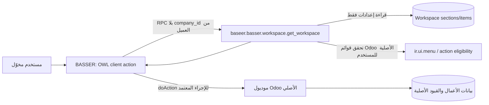

# BASSER Workspace — سجل البناء والحوكمة

**معرّف التغيير:** BASSER-WORKSPACE-001  
**النطاق:** مرشح محلي فقط على المصدر `source-863bd85`، فوق commit `cda4114`.  
**النشر:** محظور في هذه الشريحة. طلب المالك الصريح هو عدم رفع أي تعديل إلى الإنتاج أو GitHub إلى أن يضم تعديلات أخرى.  
**العمق:** مركّز — واجهة تنقّل جديدة، إعدادات صلاحيات عرض، وERP قائم من دون تغيير منطق عملياته.

**ملحق BASSER-WORKSPACE-002 — 2026-09-15:** توسعة مالية محدودة للمرشح المحلي فقط: يضيف BASSER رابطاً مضبوطاً لدفعات المشتريات الخاصة بالكاشير. يبقى اعتماد الدفعة للمحاسب افتراضياً؛ خيار شركة إداري معطّل افتراضياً قد يسمح للكاشير باعتماد **دفعاته هو فقط** في الشركة النشطة. لا يُنشر هذا الملحق ولا يمنح الكاشير وصولاً عاماً إلى الفواتير أو الحسابات.

## 1. عقد البناء (G0)

### الهدف

إنشاء تطبيق Odoo باسم **BASSER** يعرض مساحة عمل مختصرة وقابلة للتهيئة للمحاسب والكاشير. تحتوي المساحة على روابط إلى قوائم/إجراءات Odoo الموجودة فعلاً، ولا تنشئ نسخة ثانية من المشتريات أو المحاسبة أو المبيعات أو بياناتها. يختار المالك العناصر **من كتالوج تشغيلي معتمد ومحدّد خادمياً لكل دور**، ثم يرتبها ويسميها ويحدد الشركة التي تراها. لا يسمح الاختيار الحر لأي قائمة Odoo، حتى لا تصبح واجهة BASSER وسيلة لإعادة إظهار شاشة أخفيت عمداً عن الكاشير.

### المستخدمون والرحلات الحرجة

| المستخدم | الرحلة | نتيجة القبول |
| --- | --- | --- |
| الكاشير | يفتح BASSER ثم يختار «طلب مشتريات جديد» أو «طلبات المشتريات» أو شاشة تشغيل مخوّلة له. | لا تظهر قوائم المدير أو الحسابات أو الكتالوج المحمي؛ الرابط يفتح الإجراء الأصلي فقط. |
| المحاسب | يفتح BASSER ويرى العناصر التي عيّنها المالك لدور المحاسب والشركة الحالية. | لا يظهر عنصر خارج الدور أو الشركة أو دون أهلية Odoo الأصلية. |
| المالك/المدير العام | يدير الأقسام والعناصر من BASSER ثم يرتبها أو يعطّلها بلا حذف للمستندات العملية. | يظهر التغيير عند إعادة فتح المساحة؛ لا يمنح إعداد الرابط صلاحية نموذج أو قيد أو شاشة محظورة. |
| جميع المستخدمين | يبدلون الشركة النشطة ثم يفتحون BASSER. | لا تظهر إلا الإعدادات العامة أو المعينة للشركة النشطة؛ لا يعتمد الخادم على قيمة شركة يرسلها العميل. |

### داخل النطاق

1. موديول مستقل باسم تقني `baseer_basser_workspace` واسم واجهة **BASSER**.
2. أقسام وعناصر تنقل محفوظة كإعدادات فقط، مرتبطة بقائمة Odoo فعلية ذات إجراء.
3. واجهة Odoo/OWL متجاوبة بالعربية والإنجليزية، مع حالات تحميل/فراغ/خطأ وعدم سماح.
4. إعدادات مالك فقط لتحديد الدور، الشركة، الترتيب، الاسم، والتفعيل، من كتالوج قوائم معتمد ثابت في الإصدار.
5. دمج محدود مع `baseer_access_roles` لإظهار جذر BASSER للدورين التشغيليين مع بقاء قواعد الوصول الأصلية صاحبة القرار.
6. بذور آمنة للعناصر الموجودة فعلاً بعد فحص XML IDs في بيئة الاختبار.
7. إضافة رابط «الإدخال الجماعي للمشتريات» للكاشير إلى القائمة الأصلية المقيدة بدفعاته فقط، لا إلى شاشة محاسبية منسوخة.
8. إعداد تشغيلي للشركة، يملكه المدير/المالك، لضبط السماح الاستثنائي باعتماد الكاشير لدفعاته فقط؛ يبدأ معطلاً ولا يغير صلاحية أي مستخدم خارج الشركة الحالية.

### خارج النطاق

- لا نسخ لنماذج أو شاشات أو بيانات المبيعات/المشتريات/المحاسبة.
- لا إعطاء مجموعة `account.group_account_invoice` للكاشير، ولا فتح قائمة الفواتير أو الدفع أو القيود له، ولا اعتماد دفعة أنشأها مستخدم آخر.
- لا إدخال مبالغ أو احتساب أو ترحيل أو استلام أو اعتماد من BASSER نفسه.
- لا ذكاء اصطناعي، ولا تكامل خارجي، ولا مكتبة واجهات أو خدمة مستقلة جديدة.
- لا نشر حي، ولا تعديل مستخدمين أو بيانات أصلية ضمن هذا التغيير.

### خريطة دورة ERP والرقابة

BASSER ليس دورة مالية ولا مستنداً عملياً. مصدر الحقيقة لكل دورة يبقى الموديول الأصلي: طلب المشتريات في `baseer_procurement_requests`، والمبيعات في موديولها، والقيود والفواتير في Odoo Accounting. BASSER لا يكتب إلى أي جدول تشغيلي أو محاسبي ولا يغير حالة مستند؛ يطلق فقط إجراءً أصلياً بعد أن يتحقق الخادم من أهلية المستخدم. لذلك لا توجد قيود أو أرصدة أو ضرائب أو إقفال أو تصحيح ينتجها هذا الموديول. أي فعل مالي لاحق يمر بتحقق الخلفية الأصلي وسجل التدقيق الأصلي.

**مسار الاستثناء المعتمد:** دفعة الشراء تظل مسارها الأصلي: كاشير ينشئ/يعدل مسودته ← محاسب/مالك يعتمدها. عند التفعيل، يستدعي الكاشير method عامة واحدة على الدفعة نفسها ولا يرسل actor أو bypass في context. تعيد هذه method التحقق، ثم تستدعي helper خاصاً فقط (`_approve_as_actor`) في الموديول المالك لدورة الدفعة؛ لا يمكن استدعاء الـhelper عبر RPC ولا يقبل actor من العميل. داخل **قفل الدفعة وقفل صف الشركة**، يعيد الـhelper/الـcallback التحقق من الدور، المنشئ، المسودة، الشركة النشطة، شركات الكاشير، وخيار الشركة قبل إنشاء أي فاتورة. يسجل مسار الدفعة `approved_by_id` بالكاشير ويكتب سجل تدقيق مستقل باسمه ووقت الاعتماد؛ يعيد للكاشير reload محايداً فقط، لا action أو معرفات فواتير. كل ذلك داخل savepoint واحد بحيث يفشل السجل أو أي تحقق فتتراجع الفواتير والدفعات والاعتماد معاً. لا تعني النتيجة وصوله إلى الفواتير الناتجة أو توسيع ACL المحاسبة.

### معايير قبول الشريحة الأولى

- يظهر BASSER للكاشير والمحاسب والمالك وفق دوره، ولا يظهر لمستخدم عادي بلا دور Baseer.
- يرى المستخدم فقط العناصر النشطة المطابقة لدوره وشركته النشطة، ومن كتالوج الدور الثابت، مع عدم تجاوز أهلية قائمة Odoo الأصلية.
- لا يمكن للمستخدم غير المالك إنشاء/تعديل/حذف إعدادات الأقسام أو العناصر، لا عبر الواجهة ولا RPC مباشر.
- لا تقبل العناصر قائمة بلا إجراء، أو جذر BASSER نفسه، أو عنصر إدارة BASSER، أو إجراء `URL`/`Server`/`Report`؛ ويمنع التكرار داخل القسم.
- يظل تبديل الشركة محكوماً بالشركات المتاحة في جلسة Odoo؛ لا يؤثر تمرير `company_id` أو `allowed_company_ids` مزوران من العميل.
- تظل عناصر الإعداد القليلة سريعة ومحدودة: حد خادمي 100 سجل إجمالي، نشطاً أو مخفياً، في مساحة العمل و40 رابطاً مرئياً كحد أقصى للمستخدم عند الفتح؛ لا تحميل لقائمة أعمال أو مستندات من BASSER. إذا احتوت قاعدة قديمة على أكثر من 100 سجل، يظل المالك قادراً على إخفاء/حذف الإعدادات للإصلاح لكن لا يستطيع إنشاء إعداد جديد حتى يعود تحت الحد.
- تُختبر الرحلة بالعربية/RTL والإنجليزية/LTR، وعلى 390px وسطح المكتب.
- عند تعطيل خيار الشركة، يرفض الخادم اعتماد الكاشير حتى لو استدعى RPC مباشرة. وعند تفعيله، ينجح فقط اعتماد مسودة الكاشير في الشركة النشطة؛ يفشل اعتماد دفعة غيره أو دفعة شركة أخرى، ويبقى فتح الفواتير مرفوضاً.
- تظهر سياسة الشركة في إعدادات BASSER للمالك فقط مع تحذير واضح: تفعيلها يسمح بنشر فواتير موردين ومدفوعات لدفعات الكاشير الذاتية. لا يظهر للكاشير زر اعتماد عند تعطيلها، ورسالة الرفض/النجاح لا تعيد روابط أو أرقام فواتير.

### الافتراضات المعلنة

- الدور التشغيلي المعتمد هو أحد `baseer_access_roles.group_cashier` أو `group_accountant`؛ المالك هو `group_owner`. يُخزن نطاق كل قسم بدور واحد وشركة اختيارية، بدلاً من M2M مجموعات مفتوح، حتى يمكن فرض سياسة الدور والحدود بوضوح.
- صلاحية الدخول إلى الإجراء الأصلي يقررها Odoo وموديوله؛ BASSER لا يعالجها كحد أمان بديل.
- أول بذور الكاشير ستشير فقط إلى قوائم إجراءات ناجحة في المصدر الحالي. أي توسعة لكتالوج دور ما تحتاج تعديل سياسة BASSER المراجعة في الكود/الإصدار؛ يظل المالك حراً في إضافة أي عنصر من الكتالوج إلى أقسامه، لا من جميع قوائم Odoo.
- لا يلزم تاريخ/مبالغ أو دقة عشرية في هذه الميزة. أي رقم قد يظهر في عنوان Odoo الأصلي يبقى من مصدره وخدمته الخلفية.
- إعداد BASSER الحالي ليس بديلًا لصفحة إعدادات جميع موديولات Odoo: هو محرر منضبط لأقسام/روابط BASSER. تُحفظ سياسة الاعتماد في إعداد شركة مملوك للموديول المالي، ويشير BASSER إليه بوضوح بدلاً من نسخ السياسة أو قيمها في بطاقاته.

## 2. ملف الإطلاق والنمو (G1)

| المجال | افتراض الإصدار الأول | قرار التصميم والدليل المطلوب |
| --- | --- | --- |
| المستخدمون | حتى 100 مستخدم Baseer، ذروة متزامنة محافظة 20. | طلب قراءة واحد عند فتح BASSER، بحد 100 قسم/عنصر إجمالي و40 رابطاً مرئياً للدور/الشركة، مع عرض عملي مستهدف أقل من 40 عنصراً للمستخدم. |
| البيانات | أقسام وعناصر إعدادات قليلة، نمو بطيء ولا ملفات مرفقة. | حد خادمي 100 سجل إجمالي نشط أو مخفي؛ فهارس على `active, sequence` و`section_id, active, sequence` وقيد فريد `(section_id, menu_id)`؛ لا pagination مطلوب داخل مساحة العمل المحدودة. |
| العمليات | فتح مساحة العمل وفتح إجراء أصلي؛ تعديل إعدادات مالك متقطع. | لا background job ولا queue ولا cache مخصص. تحديث إعداد ينعكس في القراءة التالية. |
| اعتماد دفعة الكاشير | قليل، عملية مالية موجودة متعددة الصفوف تحت قفل الشركة. | الإعداد Boolean لكل شركة وسجل تدقيق صغير لكل اعتماد ذاتي. المسار الوسيط يعيد فحص الدور/المنشئ/الشركة/الخيار بعد قفل الدفعة وصف الشركة نفسه، داخل savepoint شامل؛ لا يحصل الكاشير على مجموعة محاسبية دائمة. |
| الأداء | فتح BASSER محلياً في أقل من 1.5 ثانية في اختبار العينة؛ لا يعيد RPC أكثر من 40 رابطاً مرجعاً. فشل RPC يظهر رسالة قابلة لإعادة المحاولة. | يقاس في قاعدة اختبار معزولة بعد G5؛ لا يعد ذلك بسعة إنتاج غير مقاسة. |
| التزامن | قد يعدل مالكان قائمة العنصر نفسها. | قيد SQL يمنع التكرار؛ تحقق خادمي من سقف 100/40 عند الإنشاء والتفعيل؛ Odoo optimistic write وتاريخ `write_date` لسجل التدقيق. لا يوجد أثر مالي أو عملية طويلة. |
| الاستمرارية | إعدادات الموديول تدخل في نسخة قاعدة بيانات Odoo المعتادة. | يمكن التراجع بإزالة الموديول بعد أخذ نسخة؛ لا يحذف الموديول مستندات أعمال. سجل Odoo القياسي يحتفظ بمنشئ/معدل الإعداد. |

**قرار المسار المباشر:** موديول Odoo داخل الـmodular monolith القائم، مع RPC محدود وOWL موجود؛ رفض خدمة مستقلة أو لوحة مخصصة أو cache أو مكتبة جديدة لأنها لا تحل عنقاً مثبتاً.

## 3. معمارية البيانات والعقود (G2)

### ملكية البيانات

| الكيان | المالك | المحتوى | لا يملك |
| --- | --- | --- | --- |
| `baseer.basser.workspace.section` | BASSER | الاسم، الترتيب، التفعيل، دور واحد (`cashier` أو `accountant`) وشركة اختيارية. | أي مستند أو مبلغ أو حالة أعمال. |
| `baseer.basser.workspace.item` | BASSER | العنوان المخصص، الترتيب، قائمة Odoo الهدف المعتمدة ضمن دور قسمه. | نسخة من الإجراء أو بياناته أو صلاحياته. |
| `ir.ui.menu` و`ir.actions.*` | Odoo/الموديول الأصلي | تعريف القائمة والإجراء والأهلية الأصلية. | إعدادات BASSER. |
| بيانات المبيعات/الشراء/المحاسبة | موديولات الأعمال الأصلية | جميع الأرقام والحالات وسجل التدقيق. | أي منطق BASSER. |
| `res.company.cashier_purchase_batch_approval_enabled` | `baseer_access_roles` | خيار سياسة شركة واحد، افتراضه False. | أي صلاحية Odoo عامة أو حالة دفعة. |
| `baseer.purchase.batch.cashier.approval.audit` | `baseer_access_roles` | الدفعة، الشركة، الكاشير، وقت الاعتماد وهوية التنفيذ الوسيط. | الفاتورة أو الدفع أو تعديل حالة الدفعة. |

### عقد القراءة الآمن

`get_workspace()` لا يأخذ company أو group أو menu أو action من العميل. يشتق المستخدم والشركة النشطة والدور من `env` فقط، ويتحقق أن `env.company` ضمن شركات المستخدم المتاحة. يقرأ إعدادات BASSER باستخدام صلاحية داخلية للقراءة فقط، ثم يعيد بحد `40` فقط العناصر التي تحقق جميع الشروط:

1. القسم والعنصر نشطان.
2. نطاق الشركة فارغ (عام) أو يساوي `env.company` الحالية في القسم؛ ولا يوجد نطاق شركة منفصل للعنصر.
3. دور القسم يساوي الدور التشغيلي الفعلي للمستخدم.
4. القائمة الهدف مسجلة في `BASEER_WORKSPACE_TARGET_POLICY` الثابت للدور. سياسة الإصدار هي الحد الإيجابي الوحيد لما يمكن عرضه.
5. القائمة الهدف موجودة في **رؤية Odoo الأصلية قبل فلتر واجهة Baseer** للمستخدم الحالي.
6. نوع الإجراء إما `ir.actions.act_window` مع `check_access_rights('read')` ناجح على `res_model` في البيئة الحالية، أو `ir.actions.client` بعلامة client action مسماة ومصرح بها في السياسة. ترفض `act_url` و`server` و`report` وأي نوع مجهول.
7. توصف action metadata بـ`sudo` فقط **بعد** تحقق السياسة الإيجابية ورؤية القائمة الأصلية؛ هذا استثناء قراءة ضيق لسجل تعريف ثابت لا يقرأ نموذج الهدف. يستمر فحص `res_model` وفتح الإجراء تحت المستخدم الحالي. لا يكون الهدف BASSER أو إدارة BASSER أو قائمة بلا إجراء.

يعيد العقد: id القسم/العنصر، الاسم المترجم، icon CSS آمن محدود، ومرجع الإجراء الداخلي فقط. لا يعيد مجالات أو سياقاً أو XML IDs مصدرها العميل، ولا يقرأ بيانات الأعمال.

### تفويض وأمان

- ACL وإدارة الأقسام/العناصر: `group_owner` فقط؛ لا صلاحية CRUD موروثة للكاشير أو المحاسب. يتأكد constraint من أن الشركة المحددة ضمن `env.companies`، ولا يقبل سجلاً خارج نطاق جلسة المالك.
- RPC القراءة: يتحقق صراحة من أحد أدوار Baseer الثلاثة؛ يرفض غير ذلك بـ`AccessError`.
- إعداد العنصر: قائمة `Many2one` ذات domain لسياسة الدور في الواجهة، مع `@api.constrains` خادمي يطبق السياسة نفسها ويمنع جذر/إدارة BASSER، إجراءً فارغاً أو التكرار أو نوع الإجراء المحظور. لا تعتمد السلامة على domain الواجهة.
- تتقاطع النتيجة دائماً مع السياسة الإيجابية وأهلية القائمة الأصلية؛ الإخفاء البصري ليس بديلاً عن ACL/record rules/تحقق الإجراء في الموديولات المالكة.
- تحديث فلتر `ir.ui.menu` في `baseer_access_roles` يضيف جذر BASSER للدور. يوفر ذلك الموديول دالة داخلية ` _baseer_native_visible_menu_ids()` تستدعي `super()._visible_menu_ids()` في البيئة الحالية فقط، بلا `sudo` وبلا استدعاء متكرر لـ`_visible_menu_ids`. cache هذه الدالة يطابق مفتاح Odoo الحالي (مجموعات المستخدم و`debug`) ويُمسح عند تغير قوائم/مجموعات Odoo بالآلية الأصلية؛ إعداد BASSER لا يدخل في cache ولا يحتاج إبطالاً.
- اعتماد الدفعة لا يعتمد على إخفاء الزر: method عامة واحدة للكاشير لا تأخذ إلا سجل الدفعة المرئي له وتتحقق أولاً من المنشئ/الدور/الشركة. ثم helper خاص غير RPC في الموديول المالك ينفذ باسم خادم مرفوع؛ لا يقبل actor أو bypass في context. بعد أن يقفل صف الشركة، ينفذ callback خادمي ثابت التحقق ثانيةً من الدور، شركات الكاشير، الشركة النشطة، المنشئ، المسودة وBoolean. لا يعيد المسار المحايد action فواتير، ويكتب سجل التدقيق في savepoint نفسه. حماية `res.company.write` ترفض تغيير Boolean لغير `group_owner`، ولا تُعامل رؤية الحقل كحماية.

### الفهارس والترحيل والرصد

- `section`: فهرس `(active, sequence)`؛ `item`: `(section_id, active, sequence)` وقيد فريد `(section_id, menu_id)`. يتحقق الكود عند **الإنشاء** من الحد العام 100 سجل إجمالي، نشطاً أو مخفياً، ومن الحد المرجعي 40 عنصراً مرئياً للدور/الشركة عند الإنشاء والتفعيل؛ لا يعتمد على truncation صامت. لا يمنع وضع قاعدة تاريخية تجاوزت الحد من إخفاء أو حذف إعدادات للإصلاح.
- تركيب جديد فقط ولا ترحيل بيانات قديمة. إزالة الموديول تعزل إعداداته ولا تمس جداول الأعمال.
- يسجل Odoo `create_uid`, `create_date`, `write_uid`, `write_date`. أخطاء RPC تعرض رسالة عامة للمستخدم وتبقى تفاصيل trace في سجل الخادم المحمي.

## 4. الرصة والمكتبات (G3)

| القرار | البديل المرفوض | السبب |
| --- | --- | --- |
| Odoo 19 addon + ORM + OWL الموجودان، مع dependency مباشر على `baseer_access_roles` | SPA أو خدمة مستقلة أو نسخ شاشات الأعمال. | يحافظ على مصدر حقيقة واحد، الحماية الأصلية، وتكلفة تشغيل أقل. `baseer_access_roles` لا يعتمد على BASSER؛ lookup جذر BASSER اختياري وقت التشغيل لمنع cycle. |
| CSS/مكونات backend القياسية الموجودة | مكتبة واجهات إضافية. | لا حاجة مثبتة؛ تفادي الحجم والترخيص وازدواج RTL. |
| قائمة `ir.ui.menu` كهدف مقيد | إدخال action string/raw URL يدوي. | يمنع الروابط المزورة والتحويل إلى إجراء غير مراجع. |
| اختبارات Odoo `TransactionCase` وواجهة تركيزية | اختبار حمل/متصفح شامل قبل الشريحة. | نبدأ باختبار صلاحيات وعقد حقيقي؛ قياس محدود معزول بعد G5. |

**الحزم الجديدة:** لا توجد.  
**الترخيص:** يرث LGPL-3 المتوافق مع addons Baseer.  
**أوامر التحقق المخططة:** XML/PO parse، Odoo test tags المخصصة في قاعدة منعزلة، ثم فحص RTL/LTR و390px/سطح مكتب.  
**لا توجد حركة جديدة لازمة:** انتقال Odoo القياسي فقط؛ لا keyframes أو مكتبة motion.

## 5. نظام التجربة (G4 — مسودة)

### مصدر المكوّنات وحدوده

- لا تفترض استيراد `AppShell` أو `PageHeader` أو `Card` من Odoo؛ لم يثبت وجود API بهذه الأسماء في المرشح. الشاشة تستعمل **OWL template محلياً** داخل الموديول، وخدمات Odoo الموجودة فقط (`orm`, `action`, `notification`) وclasses Bootstrap/Odoo المثبتة فعلاً مثل `container-fluid`, `d-flex`, `btn`, `card`, `alert` وCSS variables من الثيم.
- عناصر مساحة العمل (قائمة الأقسام، بطاقة الرابط، الحالة) محلية لأنها رحلة واحدة ولم تثبت إعادة استخدامها. لا حزمة UI ولا مكوّن مركزي جديد.

### التخطيط والتفاعل

- صفحة BASSER: رأس باسم المساحة، وصف قصير، ثم شبكة أقسام وبطاقات إجراءات كبيرة قابلة للمس؛ `grid-template-columns: repeat(auto-fit, minmax(14rem, 1fr))` على سطح المكتب وعمود واحد عند 390px، ولا container أو عنصر محتوى يسمح بتمرير أفقي.
- كل بطاقة إجراء هي `<button type="button">` واحدة باسم واضح؛ لذلك يدعم Enter/Space أصلاً. لا روابط/أزرار متداخلة أو `div` قابل للنقر. يعرض التركيز المرئي بـ`:focus-visible` وتستعمل حالة `disabled` و`aria-disabled` أثناء فتح الإجراء لمنع `doAction` المزدوج.
- البطاقات لها حالة ضغط خفيفة فقط (`transform` ومدة دون 160ms) ودعم `prefers-reduced-motion`; لا حركة أثناء اختصار لوحة مفاتيح ولا رسوم زخرفية.

### حالات الوصول والتحميل

- حاوية القراءة تملك `aria-busy="true"` وقت التحميل. skeleton ثابت لا يومض، أو يحترم `prefers-reduced-motion`.
- حالة التحميل أو الفراغ تستخدم `role="status"` ونصاً مترجماً؛ عدم السماح أو فشل RPC يستخدم `role="alert"` بلا تفاصيل خادم حساسة.
- خطأ القراءة يحتوي زر **إعادة المحاولة** قابل للتركيز. إذا تغيرت الشركة أثناء الطلب، يهمل العميل الرد القديم وفق sequence token ثم يعيد القراءة؛ ولا يبقى focus على بطاقة اختفت.

### اللغات ومعايير القبول البصري

- تدعم القوالب RTL/LTR ونصوص PO عربية/إنجليزية، وتبقي أي أرقام Odoo الغربية `0-9`.
- قبول G5 يتضمن لقطة/فحص فعلي: العربية RTL والإنجليزية LTR، سطح مكتب و390px بلا overflow أفقي، انتقال Enter/Space، focus-visible، منع double-click، وتحويل شركة يبدّل العناصر من دون بطاقة قديمة أو focus تالف.

## 6. سجل البوابات

| البوابة | الحالة | المالك | المراجع المستقل | الدليل | القرار |
| --- | --- | --- | --- | --- | --- |
| G0 | معتمدة للبناء | قائد البناء + خبير ERP | حارس البوابات | ملحق BASSER-WORKSPACE-002 + BASSER-OP-018/019/020 | نطاق مالي ضيق: اعتماد دفعة ذاتية اختياري، مع المحاسب افتراضياً. |
| G1 | معتمدة للبناء | مهندس السعة | حارس البوابات | القسم 2 + BASSER-OP-019/020 | Boolean شركة وسجل audit؛ يعاد التحقق من الذرية والتزامن. |
| G2 | معتمدة للبناء | معماري البيانات + خبير ERP | حارس البوابات | القسم 3 + BASSER-OP-019/020 | helper خاص + تحقق خادمي داخل الأقفال؛ اختبارات عزل إلزامية. |
| G3 | معتمدة | أمين المكتبات + حارس البساطة | حارس البوابات | القسم 4 + BASSER-OP-004 | GO مستقل بلا حزم أو تبعية دائرية. |
| G4 | معتمدة للبناء | مصمم التجربة + بنّاء الواجهة | حارس الجودة | إعداد شركة Odoo القياسي + BASSER-OP-019/020 | إعداد مالك واضح وتحذير مالي؛ لا صفحة إعدادات وهمية أو نسخ سياسة. |
| G5 | معتمدة محلياً للإضافة | قائد البناء | حارس الجودة المستقل | BASSER-OP-021/022 + 13 اختبار Odoo معزول | اعتماد ذاتي اختياري محمي؛ لا يشمل هذا القرار GitHub أو الإنتاج. يلزم اختبار سباق جلستين قبل أي اعتماد إنتاجي لاحق. |
| G6–G8 | غير مبدوءة | — | — | — | — |

## 7. سجل القرارات

| المعرف | القرار | البدائل | السبب المباشر والأثر |
| --- | --- | --- | --- |
| BASSER-D01 | روابط إلى قوائم Odoo ذات إجراءات فقط. | action/raw URL يدوي، نسخ الشاشة. | أقل مخاطرة ويحفظ حماية ومصدر حقيقة الموديول الأصلي. |
| BASSER-D02 | إعداد مستقل ودور/شركة في الخلفية. | قوائم hard-coded لكل دور. | يحقق قابلية إضافة القوائم من دون تعديل كود، مع بقاء التحقق الخادمي. |
| BASSER-D03 | لا صلاحيات أعمال جديدة. | إعطاء BASSER صلاحيات موديلات. | يمنع امتيازاً غير مقصود ويجعل الحماية قابلة للمراجعة. |
| BASSER-D04 | لا حزمة أو خدمة جديدة. | واجهة خارج Odoo. | يطابق أسلوب النظام ويقلل كلفة النشر والعزل. |
| BASSER-D05 | كتالوج خادمي ثابت حسب الدور بدلاً من اختيار كل `ir.ui.menu`. | حرية اختيار أي قائمة للمالك. | يمنع BASSER من كشف قائمة أخفتها سياسة الدور الإضافية؛ التوسعة تمر بمراجعة وإصدار واضح. |
| BASSER-D06 | قبول `act_window` بعد فحص model read وclient tags المعتمدة فقط. | تنفيذ URL/server/report أو أي action. | يمنع مسارات خارجية أو خوادم أو تقارير من ممر التنقل المختصر. |
| BASSER-D07 | سلف الموظفين للكاشير عبر قائمة POS المصرح بها، وعهدة/تسوية المشتريات للمحاسب عبر مجموعة محاسب المشتريات الأصلية، والتقويم الحراري للكاشير عبر dashboard محدد خادمياً. | رابط حسابات للكاشير، أو عرض قوائم العهدة بلا صلاحية أصلية، أو رابط dashboard عام. | يحافظ على فعل العرض المطلوب فقط؛ لا ترتفع صلاحيات الكاشير إلى مدير التقويم، ولا يكشف الرابط لوحة غير التقويم الحراري. |
| BASSER-D08 | اعتماد دفعة الكاشير اختياري لكل شركة وبمسار خادمي وسيط ضيق؛ الافتراضي اعتماد المحاسب. | إعطاء الكاشير مجموعة فواتير الموردين، أو الاعتماد من المتصفح فقط، أو اعتماد أي دفعة كاشير. | يمنع امتياز محاسبي دائم أو عابر للشركات، ويحافظ على تحقق الدفعة الأصلي وعلى فصل الفواتير. |

## 8. دفتر العمليات الحي

| المعرّف والوقت | البوابة/المرحلة | النوع | النية أو السبب | التغيير أو الأمر | النتيجة والدليل | الأثر والتراجع | المنفذ والمراجع |
| --- | --- | --- | --- | --- | --- | --- | --- |
| BASSER-OP-001 — 2026-09-15 | G0–G3 | قراءة/قرار | فهم طلب مساحة تنقل BASSER وربطه بالصلاحيات الحالية. | قراءة سجل معمارية، `baseer_access_roles`, قوائم المشتريات، ودلائل ألفا. | حُددت حدود الموديول والعقد أعلاه. | لا تغيير في التطبيق؛ يمكن تعديل المسودة فقط. | قائد البناء؛ مراجعة مستقلة مطلوبة. |
| BASSER-OP-002 — 2026-09-15 | G0–G3 | تنفيذ توثيقي | إنشاء عقد وسجل بوابات قبل الكود. | هذا الملف فقط. | البوابات قيد المراجعة. | لا أثر تشغيلي أو حي. | أمين السجل/قائد البناء؛ مراجعة مستقلة مطلوبة. |
| BASSER-OP-003 — 2026-09-15 | G0–G3 | مراجعة مستقلة | حارس بوابات مستقل فحص العقد والمصدر الحالي. | مراجعة `alpha_gate_review`. | BLOCK: سياسة الدور، أنواع action، cache، عزل الشركات والحدود غير كافية. | لا كود؛ أعيد العقد إلى المسودة. | حارس البوابات المستقل. |
| BASSER-OP-004 — 2026-09-15 | G0–G3 | تصحيح عقد | إغلاق موانع المراجعة قبل البناء. | هذا التعديل: سياسة خادمية إيجابية، فحص action/model، عقد helper/cache، قيود الشركة والحدود/dependency. | قيد إعادة المراجعة المستقلة. | لا أثر تشغيلي أو حي. | قائد البناء؛ مراجعة مستقلة مطلوبة. |
| BASSER-OP-005 — 2026-09-15 | G0–G3 | مراجعة مستقلة | إعادة فحص العقد المصحح. | قرار `alpha_gate_review`. | GO: G0/G1/G2/G3 معتمدة؛ اختبارات policy/action/company/cache/limits تبقى إلزامية في G5. | أصبح بناء الشريحة مسموحاً بعد اعتماد G4. | حارس البوابات المستقل. |
| BASSER-OP-006 — 2026-09-15 | G4 | مراجعة مستقلة | فحص عقد التجربة قبل الواجهة. | قرار `alpha_gate_review`. | BLOCK: مصدر مكونات مفترض، وإتاحة/حالات/تبديل شركة غير محددة. | لا كود واجهة؛ عدنا لتفصيل G4. | حارس الجودة المستقل. |
| BASSER-OP-007 — 2026-09-15 | G4 | تصحيح عقد | توثيق مكونات Odoo الفعلية وسلوك الإتاحة والتبديل. | هذا التعديل في القسم 5. | قيد إعادة المراجعة المستقلة. | لا أثر تشغيلي أو حي. | قائد البناء؛ مراجعة مستقلة مطلوبة. |
| BASSER-OP-008 — 2026-09-15 | G4 | مراجعة مستقلة | إعادة فحص عقد التجربة المصحح. | قرار `alpha_gate_review`. | GO: المصدر والإتاحة وحالات التحميل/الخطأ وتبديل الشركة ومعيار الجوال محددة. | أصبح بناء أول شريحة عمودية مسموحاً؛ G5 اختبار فعلي إلزامي. | حارس الجودة المستقل. |
| BASSER-OP-009 — 2026-09-15 | G5 | فشل اختبار معزول | تركيب المرشح وتشغيل اختبار الدور/القائمة. | Odoo isolated DB `baseer_basser_workspace_test_20260915`. | اكتشف أن Odoo يمنع المستخدم التشغيلي من قراءة سجل `ir.actions.client` الوصفي رغم ظهور قائمته الأصلية. | لا بيانات حية؛ عدّلنا العقد والكود ليستخدم metadata ضيقاً بعد policy+native eligibility. إعادة الاختبار مطلوبة. | قائد البناء؛ مراجعة جودة لاحقة. |
| BASSER-OP-010 — 2026-09-15 | G5 | تنفيذ | بناء إضافة BASSER وتكامل جذر التنقل دون تغيير دورة أعمال. | إضافة `baseer_basser_workspace` وتحديث محدود في `baseer_access_roles`؛ استبدال قيد SQL القديم بـ`models.Constraint` المتوافق مع Odoo 19. | السياسة الإيجابية، نطاق الشركة من الخادم، حدود 100/40، وACL المالك فقط موجودة في المرشح. | لا نشر ولا GitHub ولا بيانات أصلية؛ التراجع بإلغاء تغييرات المرشح فقط. | قائد البناء. |
| BASSER-OP-011 — 2026-09-15 | G5 | اختبار خلفي معزول | إثبات الصلاحيات والنطاق والإجراءات المعتمدة. | Odoo test tags: `/baseer_basser_workspace,/baseer_access_roles` على `baseer_basser_workspace_test_20260915`. | `0 failed, 0 error(s) of 8 tests`؛ يتضمن رفض CRUD للكاشير، رفض العنصر المزور، سياسة action، ونطاق الشركة. | قاعدة الاختبار فقط؛ لا أثر حي. | قائد البناء. |
| BASSER-OP-012 — 2026-09-15 | G5 | اختبار واجهة | إثبات منطق الواجهة وحالات التزامن/الفشل في Hoot. | `web/tests?debug=assets&filter=baseer_basser_workspace`. | `3 tests completed` و`3` ناجحة: منع الفتح المزدوج، إعادة المحاولة، وإهمال رد الشركة القديم. ويستخدم الحدث القياسي `userBus / ACTIVE_COMPANIES_CHANGED` المثبت في Odoo core. | قاعدة الاختبار فقط؛ لا أثر حي. | قائد البناء. |
| BASSER-OP-013 — 2026-09-15 | G5 | فحص بصري معزول | التحقق من رحلة كاشير عربية على الجوال وسطح المكتب. | معاينة محلية `127.0.0.1:18088` بقاعدة الاختبار فقط؛ مستخدم اختبار دور كاشير. | عند 390px: ثلاث بطاقات عربية، اتجاه CSS `rtl`، `scrollWidth = clientWidth = 390` بلا overflow. وعلى سطح المكتب: 3 بطاقات، RTL وبلا overflow. أُكملت ترجمة أوصاف البطاقات العربية. | أُعيد ضبط viewport؛ لا تعديل لأي مستخدم/بيانات في الأصل أو الحي. | قائد البناء؛ مراجعة مستقلة مطلوبة. |
| BASSER-OP-014 — 2026-09-15 | G5 | إعادة اختبار خلفي معزول | تثبيت النتيجة النهائية بعد إعادة مستخدم الاختبار الإداري إلى دور مالك داخل قاعدة الاختبار فقط. | نفس test tags على `baseer_basser_workspace_test_20260915`، ثم `compileall` وXML parse و`git diff --check`. | `0 failed, 0 error(s) of 8 tests`؛ Python وXML سليمان؛ لا أخطاء whitespace في التغييرات المتتبعة. | تعديل مؤقت لمستخدم اختبار محلي فقط؛ لا أصل ولا حي ولا GitHub. | قائد البناء؛ مراجعة مستقلة معلّقة. |
| BASSER-OP-015 — 2026-09-15 | G5 | مراجعة قبول مستقلة | قرار القبول بعد اكتمال أدلة الخلفية والواجهة. | إعادة مراجعة `alpha_gate_review` للمصدر والاختبارات والأدلة البصرية. | **GO**: 5 TransactionCase لـBASSER و3 لـصلاحيات الوصول، و3 اختبارات Hoot فعلية، وRTL/390px مقبول؛ لا مانع G5. لا يشمل القرار نشرًا أو G6+. | يظل المرشح محلياً فقط بانتظار تغييرات المستخدم الأخرى. | حارس الجودة المستقل. |
| BASSER-OP-016 — 2026-09-15 | G5 | تنفيذ/اختبار إضافة | إضافة سلف الموظفين للكاشير، عهدة المشتريات وتسويتها الشهرية للمحاسب، والتقويم الحراري للعرض فقط للكاشير. | سياسة BASSER والبذور والترجمة، مع منح `group_procurement_accountant` لدور المحاسب فقط؛ التقويم يمرر `dashboard_id` ثابتاً خادمياً إلى action dashboard المعتمد. | `0 failed, 0 error(s) of 9 tests` لوسمي BASSER والصلاحيات. الاختبار يثبت مسار الداشبورد الثابت، غياب دور مدير التقويم للكاشير، ورفض create للأهداف والمناسبات. | مرشح/قاعدة اختبار محلية فقط؛ مراجعة صلاحيات مستقلة معلّقة؛ لا حي ولا GitHub. | قائد البناء. |
| BASSER-OP-017 — 2026-09-15 | G5 | مراجعة قبول مستقلة | مراجعة توسعة الروابط والصلاحيات بعد BASSER-OP-016. | قرار `alpha_gate_review` للمصدر والاختبارات. | **GO محلي فقط**: سلف الكاشير تستهدف مسار POS المقيد بالشركة ومنشئ السجل، والمحاسب يرث فقط مجموعة العهدة اللازمة؛ `dashboard_id` للتقويم ثابت من الخادم، والكاشير قراءة فقط للأهداف والمناسبات. | لا بيانات حي ولا GitHub ولا نشر. | حارس الجودة المستقل. |
| BASSER-OP-018 — 2026-09-15 | G0–G4 | إعادة فتح عقد | طلب المالك: كاشير يدخل الدفعات المجمعة، المحاسب يعتمد افتراضياً، وخيار شركة يجيز اعتماد الكاشير لدفعاته فقط؛ مع إعداد BASSER تشغيلي واضح. | هذا الملحق قبل الكود. | تحددت الحقيقة المالية، حدود التفويض، خيار شركة معطل افتراضياً، وسيناريوهات قبول/رفض وعزل. | لا كود ولا بيانات ولا نشر؛ مراجعة مستقلة بعد التنفيذ والاختبار إلزامية. | قائد البناء؛ حارس البوابات مطلوب. |
| BASSER-OP-019 — 2026-09-15 | G0–G4 | مراجعة مستقلة وتصحيح عقد | فحص التفويض المقترح قبل كود الاعتماد الذاتي. | قرار `alpha_gate_review` ثم هذا التصحيح. | **BLOCK P0**: كان `sudo` المقترح يختم الاعتماد بالمستخدم الخدمي وقد يعيد action فواتير. صُحح العقد إلى RPC عام بلا actor + helper خاص غير RPC + callback بعد أقفال الدفعة/الشركة + audit ذري + response محايد + حارس كتابة Boolean للمالك. G3 GO؛ G0/G1/G2/G4 تعاد للمراجعة المستقلة قبل البناء. | لا كود تشغيلي ولا بيانات ولا نشر. | حارس البوابات المستقل؛ قائد البناء. |
| BASSER-OP-020 — 2026-09-15 | G0–G4 | مراجعة مستقلة | إعادة فحص العقد المصحح قبل التنفيذ. | قرار `alpha_gate_review`. | **GO للبناء**: G0/G1/G2/G3/G4؛ يشترط G5 إثبات التعطيل/التفعيل، الذات/الغير/شركة أخرى/مسودة، عدم ACL أو action فواتير، attribution/audit، rollback وسباق الاعتماد/تبديل الخيار. | لا كود تشغيلي ولا بيانات ولا نشر. | حارس البوابات المستقل. |
| BASSER-OP-021 — 2026-09-15 | G5 | تنفيذ واختبار معزول | تنفيذ سياسة اعتماد دفعات مشتريات الكاشير مع بقاء اعتماد المحاسب افتراضياً. | commit المرشح المحلي `224b026`; Odoo test tags `/baseer_basser_workspace,/baseer_access_roles` على `baseer_basser_workspace_test_20260915`. | **0 failed, 0 error(s) من 13 اختباراً**: تعطيل/تفعيل مالك الشركة، دفعة الذات/الغير، الشركة غير النشطة، قلب الخيار بعد القفل، attribution، منع فتح الفواتير، وتراجع المستندات والسجل معاً. | مرشح وقاعدة اختبار محليان فقط؛ لا GitHub ولا إنتاج. | قائد البناء. |
| BASSER-OP-022 — 2026-09-15 | G5 | مراجعة قبول مستقلة | مراجعة المصدر والاختبارات بعد التنفيذ. | قرار `alpha_gate_review` على المرشح النظيف `224b026` و`git diff --check`. | **GO محلي فقط** بعد قفل سجل التدقيق للمالك في ACL وrecord rule (وليس فقط قائمة BASSER). Boolean الشركة وحارسه، helper الخاص، الاستجابة المحايدة وrole mapping مقبولة. ملاحظة P2: أضف اختبار سباق جلستين لاعتماد الدفعة قبل أي قرار إنتاجي. | لا نشر ولا GitHub ولا تغيير بيانات. | حارس الجودة المستقل. |
| BASSER-OP-023 — 2026-09-15 | G5 | تنفيذ/اختبار معزول | إكمال محرر ظهور عمليات BASSER ولوحة فواتير الموردين والمصروفات. | المرشح `765c9eb`؛ تحديث الموديولين واختبارات Odoo على `baseer_basser_workspace_test_20260915`. | لوحة مالية قراءة فقط من `account.move` (شركة/فترة/عملة الشركة؛ فواتير ومردودات موقعة)، وحالة ظهور صريحة للأقسام والبطاقات مع إظهار المخفي للمالك فقط. **0 failed, 0 errors من 9 اختبارات**؛ UI العربي فُحص على `127.0.0.1:18089`. | قاعدة معاينة ومرشح محليان فقط؛ لا بيانات أصلية أو حي أو GitHub. | قائد البناء؛ مراجعة G5 مستقلة معلّقة. |
| BASSER-OP-024 — 2026-09-15 | G5 | مراجعة قبول مستقلة | مراجعة نهائية للنطاق 003 ولوحة فواتير الموردين. | قرار `alpha_gate_review` على `765c9eb` والأدلة. | **GO محليًا**: ACL/rules، عزل الشركة/الفترة/العملة، الحسابات الموقعة، action المتطابق، وفهرس lookup مقبولة؛ العناصر المخفية لا يراها إلا المالك. ملاحظة P2 غير مانعة: أضف حالة ledger فعلية لفاتورة ومردود في اختبار ترقية لاحق. | لا نشر أو تغيير حي؛ يبقى المرشح في الحزمة الموحدة. | حارس البوابات المستقل. |

## ملحق BASSER-WORKSPACE-003 — محرر ظهور العمليات وتشخيص لوحة الفواتير (مسودة G0–G4)

**سبب الإضافة:** واجهة إدارة BASSER تخفي الأقسام المعطلة من القائمة الافتراضية في Odoo، لذلك يصبح إظهار قسم سبق إخفاؤه غير واضح للمالك. طلب المالك محرراً مباشراً: يفتح «العمليات» فيرى أقسام الكاشير والمحاسب، ثم بطاقات كل قسم، مع تفعيل/إخفاء صريحين بدلاً من الاعتماد على الأرشفة. بالتوازي، يجب التحقق من عدم ظهور الفواتير في لوحة الفوترة دون خلط مصدر اللوحة أو اختراع أرقام.

### G0 — العقد والنطاق (مسودة)

- **داخل النطاق:** شاشة مالك BASSER فقط تعرض جميع الأقسام، النشطة والمخفية، مع حالة مرئية؛ فتح القسم يعرض جميع بطاقاته مع مفتاح «ظاهر للكاشير/للمحاسب» لكل بطاقة ومفتاح للقسم. التغيير يكتب فقط `active` في إعدادات BASSER القائمة، ولا يغير ACL أو record rules أو بيانات أعمال.
- **خارج النطاق:** لا اختيار حر لقوائم Odoo خارج `BASEER_WORKSPACE_TARGET_POLICY`، ولا تغيير صلاحية أصلية أو إنشاء مستندات أو تعديل دفتر الأستاذ. لا تغيير أو نشر للوحة الفوترة قبل إثبات مصدرها وبياناتها.
- **معيار القبول:** بطاقة أو قسم معطّل يبقى مرئياً للمالك بعلامة «مخفي» ويمكن إعادته بنقرة؛ لا يظهر للمستخدم التشغيلي حتى يعاد تفعيله؛ لا يمكن للمحاسب أو الكاشير فتح المحرر أو تعديل الإعدادات عبر RPC.
- **قرار ERP:** عرض الفواتير في لوحة الفوترة يبقى مسؤولية `account.move`/لوحة Odoo الأصلية. لا يجوز أن تستبدل BASSER الفاتورة بصف شراء أو ملخص مبيعات ولا أن تنسخ أرقامها.

### G1 — السعة والاستمرارية (مسودة)

لا تتغير الكيانات أو الحدود: حد خادمي صريح قدره **100 سجل إعداد إجمالي** (نشط ومخفي معاً)، و40 بطاقة ظاهرة للدور/الشركة. لذلك يقرأ محرر المالك كل السجلات بأمان بلا ترقيم صفحات في الإصدار الأول؛ إذا بلغ الحد يرفض الخادم إنشاء إعداد جديد برسالة واضحة. الرحلة الحرجة هي فتح/تفعيل بطاقة، ويكفي حفظ Odoo الاعتيادي وتحديث BASSER التالي؛ لا cache أو job أو اعتماد جديد.

### G2 — عقد البيانات والأمان (مسودة)

`baseer.basser.workspace.section.active` و`baseer.basser.workspace.item.active` هما المصدر الوحيد لحالة الظهور. `get_workspace()` التشغيلي يستمر في ترشيح `active=True` فقط. أما **إجراء إدارة المالك وقائمة البطاقات التابعة له فقط** فيحملان `active_test=False` لإظهار النشط والمخفي؛ لا RPC جديد ولا `sudo` ولا دور أو شركة أو قائمة من العميل. الشركة تظل من جلسة Odoo، والكتالوج المسموح ثابت خادمياً. تغيير الحالة لا يغير صلاحية المستند الهدف، لذلك إخفاء البطاقة ليس ادعاءً بإلغاء الوصول الأصلي.

### G3 — التقنية والمسار المباشر (مسودة)

يعاد استخدام نموذج/قائمة Odoo الحاليان وحقول `active` الموجودة، مع تعديل موضعي لعرض العناصر المعطلة وأزرار تفعيل/إخفاء دلالية؛ لا مكتبات أو schema أو خدمة جديدة. البديل المرفوض هو أرشفة السجل ثم مطالبة المالك ببحث Odoo العام، لأنه سبب المشكلة المرصودة.

### G4 — تجربة الإدارة (مسودة)

داخل **إدارة BASSER**: قائمة أقسام الكاشير والمحاسب مع الحالة، ثم نموذج قسم فيه قائمة بطاقات واضحة. كل صف يعرض الاسم، الدور، الشركة، الترتيب، والحالة المترجمة صراحة: **«ظاهر في BASSER»** أو **«مخفي في BASSER»**؛ مفتاح Odoo الأصلي للمالك يفعّل/يخفي مع بادج نصي، وحالة فارغة واضحة عند عدم وجود بطاقات. العربية/RTL والإنجليزية/LTR، والجوال يعرض البطاقات كصفوف عمودية قابلة للمس. لا تستخدم الألوان وحدها لتمييز الإخفاء، ولا تكرر عناصر عامة خارج مكونات Odoo الحالية.

### نتيجة تشخيص لوحة الفواتير — 2026-09-15

قاعدة المعاينة المحلية `baseer_basser_workspace_test_20260915` على المنفذ 18089 تحتوي **0** سجلاً في `account_move` و**0** دفعات شراء؛ لوحة «الفوترة» الأصلية لا يمكن أن تعرض فواتير غير موجودة في هذه القاعدة. وهي ليست نفس قاعدة البيانات التي رُحلت إليها البيانات أو أُدخلت فيها فواتير في بيئة أخرى. لا يوجد دليل على خلل حسابي في لوحة الفوترة نفسها من هذه المعاينة؛ يلزم فحص قاعدة البيئة التي أُدخلت فيها الفواتير إذا استمر عدم ظهورها هناك.

## ملحق BASSER-WORKSPACE-004 — إصلاح قابلية اكتشاف الإدخال الجماعي وإدارة الظهور (G0–G4)

**سبب الإضافة:** فحص الإنتاج في 2026-09-15 أثبت أن بطاقة «إدخال المشتريات المجمعة» موجودة ومسموح بها للكاشير، لكنها تأتي بعد بطاقات أخرى في العرض العمودي للجوال فلا تظهر في أول لقطة. كما أن شاشة الإدارة تعرض مفتاحاً تقنياً فقط من دون إجراء نصي مباشر لإظهار/إخفاء بطاقة، وهو غير واضح للمدير.

- **المسار المباشر:** لا نمنح صلاحية جديدة ولا ننشئ شاشة شراء بديلة. نحافظ على القائمة الأصلية والـACL وقواعد الشركة، ونرفع موضع البطاقة الافتراضية للكاشير إلى ما بعد «طلب مشتريات جديد»، مع ترحيل ضيق لسجل البذرة الحالي فقط. نضيف في محرر BASSER إجراءات مالك صريحة: «إخفاء من BASSER» و«إظهار في BASSER» للأقسام والبطاقات؛ مصدر الحالة يظل الحقل `active` نفسه.
- **الرقابة وERP:** التغيير يكتب إعدادات تنقل BASSER فقط؛ لا يعدل دفعة شراء أو فاتورة أو قيد أو صلاحية أصلية. لا يستطيع الكاشير أو المحاسب استدعاء إجراءات الإخفاء/الإظهار عبر RPC. إخفاء البطاقة لا يدّعي إلغاء وصول أصلي خارج BASSER.
- **السعة والعقد:** لا schema ولا مكتبة ولا endpoint تجميعي جديد. العمليات تكتب سجلاً واحداً محدوداً ضمن حد 100 إعداد قائم؛ تظل الشركة والدور والكتالوج الإيجابي وفحص الوصول الأصلي كما هي. الاختبار يثبت ظهور الدفعة للكاشير، وفشل تغيير الحالة لغير المالك، ونجاح إخفاء/إظهار المالك مع انعكاسه في `get_workspace()`.
- **تجربة الجوال:** النصوص عربية/إنجليزية، والأزرار مسماة ولا تعتمد على لون المفتاح وحده؛ تبقى قائمة عناصر القسم عمودية وطبيعية في واجهة Odoo الأصلية.

### دفتر العمليات الحي

| المعرّف والوقت | البوابة | النوع | النية/النتيجة | الأثر والتراجع |
| --- | --- | --- | --- | --- |
| BASSER-OP-025 — 2026-09-15 | G0–G4 | فحص ثم تنفيذ مرشح | فحص الإنتاج قراءة فقط أثبت وجود بطاقة الكاشير الستة، ومنها الإدخال الجماعي؛ سبب الالتباس ترتيب الجوال. المرشح `b593901` ينقل بطاقتها إلى الترتيب 15 بترحيل ضيق، ويضيف أفعال مالك صريحة لإظهار/إخفاء الأقسام والبطاقات مع ترجمة عربية. | لا تعديل بيانات أعمال أو ACL أو قوائم أصلية؛ التراجع هو إعادة إصدار الموديول السابق. |
| BASSER-OP-026 — 2026-09-15 | G5 | اختبار معزول | ترقية `baseer_basser_workspace` على قاعدة المعاينة `baseer_basser_workspace_test_20260915` ثم اختبارات الوسم `/baseer_basser_workspace`. ثبتت الترقية `19.0.1.0.5` وترتيب البطاقة `15` ورفض الكاشير للإخفاء ونجاح المالك في الإخفاء ثم الإظهار. | **0 failed, 0 errors**؛ المرشح وGitHub فقط، ولم ينشر إلى الإنتاج. |

## ملحق DASHBOARD-PURCHASES-001 — فواتير الموردين والمصروفات (مسودة G0–G4)

### G0 — الهدف والدورة المحاسبية

يضيف المرشح المحلي لوحة قراءة فقط باسم **فواتير الموردين والمصروفات** إلى Dashboards. تعرض الفواتير الأصلية للموردين (`account.move` من الأنواع `in_invoice` و`in_refund`) للشركة النشطة والفترة المختارة: العدد، الإجمالي، الرصيد غير المسدد، المدفوع، رسم زمني، وأكبر الموردين، مع رابط إلى مستندات Odoo الأصلية. لا تنشئ الفواتير ولا تعدلها ولا تدفعها ولا تسويها. مالك الموديول هو `baseer_purchase_expense_dashboard` ويعتمد على `account` و`spreadsheet_dashboard` و`baseer_sales_dashboard` و`baseer_access_roles`؛ الاعتماد على لوحة المبيعات يعيد استخدام امتداد نوع لوحة Baseer الموجود، والاعتماد على الأدوار يقيّدها صراحة للمحاسب أو مالك Baseer، ولا يقرأ أي بيانات مبيعات. لا يستبدل لوحة المبيعات أو لوحة Invoicing.

مصطلح «المشتريات والمصروفات» في هذه الشريحة يعني فواتير الموردين التي تمثل الشراء أو المصروف كما أدخلت في الحسابات. لا نخترع تصنيفاً محاسبياً بينهما من اسم المورد أو المنتج. تُعرض مصروفات الموظفين الأصلية في لوحة Odoo **Expenses** القائمة؛ أي دمج لها لاحقاً يحتاج تحديد مصدر وحالة اعتمادها بقرار منفصل.

معيار القبول: يراه فقط المستخدم الذي يملك أصلًا `account.group_account_invoice` أو مالك Baseer، ومن خلال ACL/record rules الأصلية لا `sudo` ولا ACL جديد؛ الإجماليات تحسب في الخلفية بدقة العملة من فواتير أصلية فقط، والمردودات تخفض الصافي؛ الضغط يفتح قائمة فواتير الموردين الأصلية المقيدة بنفس الشركة والفترة وسياسة العملة؛ لا تتغير الجداول أو القيود أو الأرصدة.

### G1 — السعة والاستمرارية

حتى 2,000 فاتورة مورد في الشركة وفترة التقرير في الحي الحالي كنقطة قياس أولية، مع نمو متوقع حتى 100,000 مستند تاريخي. endpoint الخلفي يجمع النتائج بنطاق شركة/فترة ويحد الفترة إلى 366 يوماً، ولا يجلب تفاصيل كل فاتورة إلى العميل. رحلة الفتح تقرأ نتائج مجمعة وحداً أقصى 10 موردين؛ قائمة Odoo الأصلية تتولى pagination. قبل G5 يثبت `EXPLAIN` في قاعدة معزولة أو يضاف فهرس مركب مبرر لمسار `company_id,state,move_type,invoice_date,currency_id`. لا cache أو queue أو اعتماد جديد.

### G2 — مصدر الحقيقة والعقد

المالك الوحيد للأرقام هو `account.move` وحالاته وأرصدة الدفع المحسوبة في Odoo. dashboard endpoint يشتق الشركة من `env.company` والفترة من مرشح Dashboard المعتمد؛ لا يقبل `company_id` أو totals أو domain من العميل. الفترة هي `invoice_date` فقط: قيم ISO (`YYYY-MM-DD`) ببداية لا تتجاوز النهاية وحد أقصى 366 يوماً؛ الافتراضي آخر 90 يوماً بتوقيت الرياض، وتستبعد الفواتير بلا `invoice_date` من هذا الإصدار.

النطاق الدقيق هو `company_id=env.company.id`, `state='posted'`, `move_type in ('in_invoice','in_refund')`, `invoice_date` داخل الفترة، و`currency_id=env.company.currency_id`. الفواتير بعملة أخرى لا تدخل أي KPI أو رسم أو رابط؛ يعاد فقط عددها كتحذير «فواتير بعملة أخرى غير معروضة»، ولا يوجد تحويل أو خلط للعملات. يستخدم العرض في عملة الشركة: `signed_total = -amount_total_signed` و`signed_residual = -amount_residual_signed`، فتكون فاتورة المورد موجبة والمردود سالباً تلقائياً؛ **الصافي** هو مجموع `signed_total`، و**غير المسدد** مجموع `signed_residual`، و**المدفوع** هو `signed_total - signed_residual` لكل مستند ثم المجموع. العدد هو عدد المستندات في النطاق، وأكبر 10 موردين تجمع حسب `commercial_partner_id` وبـ`signed_total` نفسه. كل جمع/تقريب بالخلفية باستخدام Decimal/عملة Odoo، والواجهة عرض فقط. رابط التفاصيل يطابق المجال نفسه حرفياً ويعمل تحت المستخدم الحالي وACL/rules الأصلية، من دون `sudo`.

### G3 — المسار المباشر

لا توجد لوحة Vendor Bills جاهزة أو مخفية في الحي: لوحة Invoicing القياسية تقيس فواتير العملاء فقط، رغم وجود 1,527 فاتورة مورد. نعيد استخدام مكوّن Dashboards/OWL الموجود و`account.move` وواجهة قائمة الفواتير الأصلية؛ لا موديول محاسبي موازٍ ولا جدول تجميعي ولا مكتبة جديدة.

### G4 — التجربة

لوحة ثنائية اللغة RTL/LTR وجوال/سطح مكتب؛ مؤشرات العدد والصافي وغير المسدد والمدفوع، رسم شهري، أكبر الموردين، وحالات تحميل وخطأ وعدم صلاحية ولا بيانات وتحذير العملة الأخرى. لا تخلطها مع لوحة Invoicing ولا تسمي فواتير الموردين «مبيعات». جميع الأرقام الغربية `0–9` ومنسقة من الخلفية.

## ملحق SALES-CATEGORIES-001 — الفئات والنسب والأداء (مسودة G0–G4)

**طلب المالك:** مراجعة لوحة ملخصات المبيعات ثم إكمال عرض فئات التحصيل: رسم ملون، نسبة كل فئة، الأعلى والأقل، وبطاقات/رسم بمظهر منسجم مع لوحة Odoo، قبل تضمينها في الإصدار الموحد.

### G0 — العقد والرقابة

- **مصدر الحقيقة:** `baseer.pos.summary.allocation` المعتمد فقط، من خلال دالة لوحة المبيعات الحالية. لا تقرأ الواجهة مبيعات أو دفعات خاماً ولا تحسب نسبة أو ترتيباً أو مبلغاً.
- **النطاق:** فئات طرق الدفع (`baseer_category_id`) في الشركة والفترة النشطتين، لا فئات المنتجات ولا تصنيفًا محاسبيًا جديدًا. تشمل البطاقة أعلى فئة وأقل فئة، والرسم يعرض مبلغ ونسبة الفئة.
- **سلامة المعنى:** إذا كانت تغطية التخصيص ناقصة أو غير متطابقة، تبقى مبالغ الفئات المتاحة للقراءة، لكن النسب والترتيب لا تكون متاحة ولا يُعرض الأعلى/الأقل، مع التحذير الموجود. هذا يمنع استنتاج «الأعلى» من جزء من المبيعات.
- **خارج النطاق:** لا تغيير في ملخصات المبيعات، التخصيصات، فواتير الموردين، القيود، أو أهداف التقويم. لا مكوّن رسوم جديد ولا مكتبة؛ يستخدم Chart.js المضمّن في أودو والمستخدم فعلياً في اللوحة.
- **القبول:** النسبة تحسب بخلفية Decimal بدقة عملة الشركة، مجموع الفئات الكاملة = 100.00% عند وجود مبيعات، أعلى/أقل محددان بحتمية (المبلغ ثم الاسم ثم المعرّف)، رسم وألوان قابلة للقراءة في RTL/LTR والجوال، والحالات الفارغة/الناقصة صادقة.

### G1 — السعة

تعيد endpoint القائمة المجمعة للفئات فقط، وحدها العملي هو عدد طرق الدفع في الشركة وليس عدد المبيعات. الاستعلام الحالي يقرأ تخصيصات الفترة المرتبطة بملخصات معتمدة ضمن نطاق الشركة؛ لا قراءة غير محدودة أو صفوف فواتير إلى العميل. افتراض إصدار محلي: أقل من 100 طريقة/فئة في الشركة؛ إن زاد العدد يبقى الرسم محدوداً بأكبر 12 فئة وتظهر البقية مجمعة في «أخرى» من الخلفية فقط. لا cache أو job أو كتابة جديدة.

### G2 — العقد الفني والمالي

تضيف الخلفية إلى `payment_performance.categories` فقط: `sales`, `share`, `available`، ومعلومة `category_performance` ذات `highest` و`lowest` أو غير متاحة. تتبع كل قيمة النطاق الحالي للشركة والفترة، وتستخدم `money` و`Decimal` و`_card` القائمين. واجهة الرسم تستهلك هذه القيم كمحاور Canvas فقط؛ لا تحسب نسبة/ترتيب/تقريب أو «أخرى». اللون ترتيب بصري ثابت لا أثر له على الرقم.

### G3 — المسار المباشر

نمدد لوحة `baseer_sales_dashboard` ومكوّن Chart.js المستخدم فيها بالفعل. رفضنا إنشاء Dashboard أو جدول تجميعي جديد أو استعلام منفصل؛ المصدر والـendpoint والـCSS الحاليون يملكون السلوك.

### G4 — التجربة

داخل بطاقة **المبيعات حسب الفئات**: بطاقة ملونة للأعلى وبطاقة ملونة للأقل، رسم أعمدة/دونات ملون يوضح الفئة ومبلغها ونسبتها، وقائمة قابلة للقراءة تعرض النسبة والمبلغ. تستخدم ألوان لوحة Odoo المتباينة مع تسمية نصية، لا يعتمد المعنى على اللون وحده، وتظهر بدائل نصية في قارئ الشاشة. على الجوال تتكدس البطاقات فوق الرسم وتبقى أسماء الفئات قابلة للقراءة بلا تمرير أفقي.
